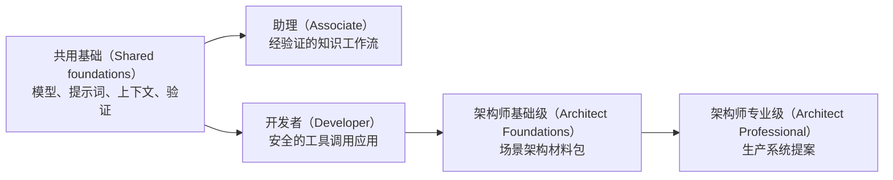

# Claude 认证课程（Claude Certification Curriculum）

> 通过构建考试所描述的系统，学会答案背后的判断方法。

**状态（Status）：** 本地预览
**指南版本（Guide version）：** 1.0
**指南生效日期（Guide effective date）：** 2026 年 7 月
**最近核实（Last verified）：** 2026-08-09

本免费课程覆盖以下认证：

| 考试（Exam） | 认证（Credential） | 题数（Items） | 时长（Time） | 费用（Fee） | 核心路线（Core route） |
|------|------------|------:|-----:|----:|-----------:|
| CCAO-F | Claude 认证助理基础级（Claude Certified Associate - Foundations） | 60 | 120 分钟 | $99 | 9 课 |
| CCDV-F | Claude 认证开发者基础级（Claude Certified Developer - Foundations） | 53 | 120 分钟 | $125 | 15 课 |
| CCAR-F | Claude 认证架构师基础级（Claude Certified Architect - Foundations） | 60 | 120 分钟 | $125 | 21 课 |
| CCAR-P | Claude 认证架构师专业级（Claude Certified Architect - Professional） | 63 | 120 分钟 | $175 | 25 课 |

四份指南均采用 100 至 1,000 分的换算分数（Scaled score），及格线为 720 分，并规定认证有效期为 12 个月。项目细节可能变化，报名前请对照官方指南确认。

截至 2026 年 8 月 9 日核实的情况，官方考试仅允许 Claude Partner Network 组织的人员报名，并要求使用受认可的合作伙伴公司邮箱。本课程仍面向所有人开放，包括只想掌握技能而不参加考试的学习者。报考资格可能变化，付款或预约前请查看当前的[认证常见问题（Certification FAQ）](https://anthropic-partners.skilljar.com/page/faq-certifications)。

## 通过 AI 导师在 GitHub 上学习（Learn From GitHub With an AI Tutor）

这是一套 AI 原生（AI-native）课程。Claude Code、Codex、ChatGPT、Cursor 或其他智能体（Agent）可以沿学习路线逐步授课、运行仓库中的实验、评审你构建的交付物、组织课程测验，并从已保存的进度继续。

请先阅读 [GitHub 学习者指南（GitHub learner guide）](GETTING_STARTED.md)，或安装[可移植认证导师技能（Portable certification tutor skill）](../../skills/claude-certification/SKILL.md)：

```bash
npx skills add rohitg00/ai-engineering-from-scratch
```

然后请智能体运行：

```text
/claude-certification
```

克隆仓库后，本地 Claude Code 会话会从 `.claude/skills/` 发现同一技能。不支持斜杠命令的运行框架（Harness）可以直接阅读 `GETTING_STARTED.md` 和导师技能。学习进度保存在 `CLAUDE-CERTIFICATION.md`，学习者作业保存在 `learning-artifacts/claude/` 下。仓库中的 `outputs/` 文件始终作为参考交付物，不得覆盖。

## 你将构建什么（What You Build）

各条路线共用基础内容，然后按角色分流：



- 助理（Associate）：构建受治理的知识工作流，具备证据支持和升级处理机制。
- 开发者（Developer）：构建协议优先的 Claude 应用，包含工具、测试、安全措施和评估。
- 架构师基础级（Architect Foundations）：完成架构决策记录（ADR）、威胁模型、评估器、上下文计划和故障恢复操作手册。
- 架构师专业级（Architect Professional）：完成从需求探索到运营的整套架构材料，涵盖检索增强生成（RAG）、集成、评估、治理、服务级别协议（SLA）和责任归属。

每条路径都包含简短诊断测评，以及与公开指南题数一致的原创全长模拟考试。题目分布按大纲权重进行合理取整，不模仿或复刻真实试题。

## GitHub 课程索引（GitHub Lesson Index）

导师读取所选路径文件以确定学习顺序。通过下面的完整索引，也可以直接在 GitHub 上浏览每节共用课程。

| # | 课程（Lesson） |
|---:|--------|
| 00 | [学习决策方法，而非背诵词汇（Study the Decisions, Not the Vocabulary）](lessons/00-certification-strategy/) |
| 01 | [选择足以完成工作的最小产品形态（Choose the Smallest Surface That Can Carry the Work）](lessons/01-claude-product-and-model-landscape/) |
| 02 | [将能力用在失败代价高的地方（Spend Capability Where Failure Is Expensive）](lessons/02-model-selection-and-token-economics/) |
| 03 | [将请求转化为可测试的契约（Turn a Request Into a Testable Contract）](lessons/03-prompting-and-task-decomposition/) |
| 04 | [将每项事实放入合适的上下文（Put Each Fact in the Right Kind of Context）](lessons/04-context-knowledge-memory-and-caching/) |
| 05 | [验证主张，而非相信自信的语气（Validate the Claim, Not the Confidence）](lessons/05-output-evaluation-and-validation/) |
| 06 | [为能力设置权限边界（Put Authority Around Capability）](lessons/06-governance-safety-and-responsible-use/) |
| 07 | [先设计交接，再实现自动化（Design the Handoff Before the Automation）](lessons/07-workflow-design-and-human-handoffs/) |
| 08 | [Messages API 是状态机（The Messages API Is a State Machine）](lessons/08-messages-api-and-application-lifecycle/) |
| 09 | [结构化输出是不可信的契约（Structured Output Is an Untrusted Contract）](lessons/09-structured-output-and-defensive-parsing/) |
| 10 | [工具循环是受控委派（A Tool Loop Is Controlled Delegation）](lessons/10-tool-use-and-agentic-loops/) |
| 11 | [MCP 将能力与宿主分离（MCP Separates Capability From Host）](lessons/11-mcp-server-design-and-integration/) |
| 12 | [Agent SDK 是运行框架，不是权限（The Agent SDK Is a Harness, Not Permission）](lessons/12-claude-agent-sdk-and-hooks/) |
| 13 | [安全控制位于提示词之外（Security Lives Outside the Prompt）](lessons/13-application-security-and-secrets/) |
| 14 | [评估将智能体行为转化为工程证据（Evals Turn Agent Behavior Into Engineering Evidence）](lessons/14-evals-testing-debugging-and-observability/) |
| 15 | [Claude Code 通过共享约束扩展协作（Claude Code Scales Through Shared Constraints）](lessons/15-claude-code-for-development-teams/) |
| 16 | [多智能体编排与委派（Multi-Agent Orchestration and Delegation）](lessons/16-multi-agent-orchestration-and-delegation/) |
| 17 | [Agent SDK 会话、子智能体与上下文（Agent SDK Sessions, Subagents, and Context）](lessons/17-agent-sdk-sessions-subagents-and-context/) |
| 18 | [工具契约、错误与渐进式发现（Tool Contracts, Errors, and Progressive Discovery）](lessons/18-tool-contracts-errors-and-progressive-discovery/) |
| 19 | [Claude Code 记忆、规则、技能与持续集成（Claude Code Memory, Rules, Skills, and CI）](lessons/19-claude-code-memory-rules-skills-and-ci/) |
| 20 | [可靠提取、批处理与独立评审者（Reliable Extraction, Batch, and Independent Reviewers）](lessons/20-reliable-extraction-batch-and-reviewers/) |
| 21 | [让大型上下文可观测（Make Large Context Observable）](lessons/21-long-context-reliability-provenance-and-escalation/) |
| 22 | [业务探索、需求与服务级别协议（Business Discovery, Requirements, and SLAs）](lessons/22-business-discovery-requirements-and-slas/) |
| 23 | [端到端架构与价值权衡（End-to-End Architecture and Value Tradeoffs）](lessons/23-end-to-end-architecture-and-value-tradeoffs/) |
| 24 | [检索增强生成、检索与数据流水线（RAG, Retrieval, and Data Pipelines）](lessons/24-rag-retrieval-and-data-pipelines/) |
| 25 | [集成协议、身份与最小权限（Integration Protocols, Identity, and Least Privilege）](lessons/25-integration-protocols-identity-and-least-privilege/) |
| 26 | [生产可观测性、延迟与成本（Production Observability, Latency, and Cost）](lessons/26-production-observability-latency-and-cost/) |
| 27 | [企业治理、合规与人工审核（Enterprise Governance, Compliance, and Human Review）](lessons/27-enterprise-governance-compliance-and-hitl/) |
| 28 | [利益相关者沟通、架构决策记录与生命周期责任（Stakeholder Communication, ADRs, and Lifecycle Ownership）](lessons/28-stakeholder-communication-adrs-and-lifecycle/) |
| 29 | [交付一周的工作，而非完美提示词（Ship a Week of Work, Not a Perfect Prompt）](lessons/29-associate-workflow-capstone/) |
| 30 | [交付经得起质询的 Claude 应用（Ship a Claude Application You Can Defend）](lessons/30-developer-application-capstone/) |
| 31 | [在六种情境中论证同一架构（Defend One Architecture Across Six Contexts）](lessons/31-architect-foundations-scenario-capstone/) |
| 32 | [架构师专业级系统综合实践（Architect Professional System Capstone）](lessons/32-architect-professional-system-capstone/) |

## 本地预览（Local Preview）

在仓库根目录运行：

```bash
node site/build.js
python3 scripts/audit_certifications.py
python3 -m http.server 4173 --bind 127.0.0.1
```

然后打开：

```text
http://127.0.0.1:4173/site/certifications.html
```

必须从仓库根目录启动服务器，以便课程阅读器读取本地尚未推送的课程文件。

认证课程通过 GitHub 和网站发布。由于导师状态、可运行实验、评估和交互机制都是课程的一部分，因此有意不将它纳入 EPUB/PDF 电子书流程。

## 研究记录（Research Trail）

- [CCAR-F 精确机制复核（Exact mechanics review）](references/ccar-f-exact-mechanics.md)
- [Anthropic Academy 官方课程对照表（Official Anthropic Academy parity map）](research/official-academy-parity.md)
- [官方考试大纲映射（Official blueprint map）](research/official-blueprint-map.md)
- [来源核实台账（Source verification ledger）](research/source-verification-ledger.md)
- [YouTube 来源评审（YouTube source review）](research/youtube-source-review.md)
- [近期社区信号（Recent community signal）](research/recent-community-signal.md)

## 独立性与考试诚信（Independence and Exam Integrity）

这是独立的社区课程，与 Anthropic 无隶属关系，也未获得其背书、赞助或授权。使用 Claude 及认证名称，仅用于标明所学习的项目。

本课程采用公开考核目标和原创场景，不使用保密考试内容。参加考试时，请遵守考试的保密义务和考生行为规则。
