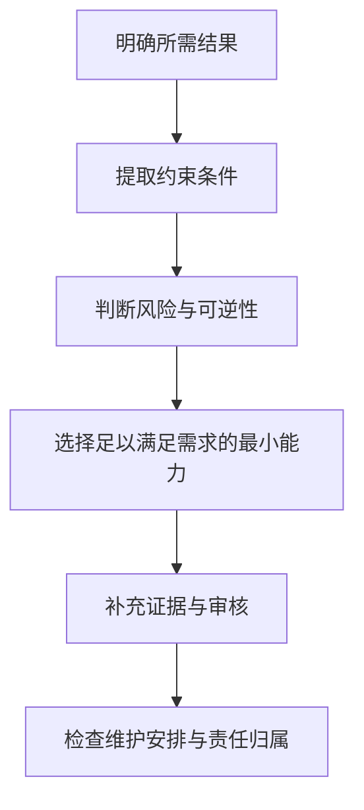

# 学会决策，而不只是记住术语（Study the Decisions, Not the Vocabulary）

> 认证考试大纲（Certification blueprint）列出了合格从业者应当能够作出并说明理由的决策。如果把它当成术语表，你花时间学习的就会是对考试最没有帮助的部分。

**Type:** Learn
**Languages:** Python
**Prerequisites:** 无
**Time:** ~75 分钟

## 学习目标（Learning Objectives）

- 将认证考试大纲转化为按权重分配时间的学习计划。
- 区分稳定的工程原则与可能变化的产品细节。
- 建立证据台账（Evidence ledger），记录决策、理由和官方来源。
- 不使用泄露题库、不还原在用考题，通过场景练习培养判断能力。
- 根据各领域的表现设定备考就绪门槛（Readiness gate），而不是依赖一次好看的模拟分数。

## 问题背景（The Problem）

Maya 花了两周背诵功能名称。她能解释 Project、上下文窗口（Context Window）和连接器（Connector），随后却遇到了一道场景题。

一个团队希望为机密周报生成摘要。源文件每周五更新，最终摘要要交给高管。可选方案包括：把报告粘贴到新对话中、加入已有 Project、连接实时数据源，或者构建自定义应用。每个方案都能生成摘要，但只有一个同时适合更新频率、审核要求、数据政策和维护负担。

Maya 努力回想连接器的定义，但这道题要求她作出决策。

这一区别贯穿整套课程。官方指南描述的是选择产品、验证输出、管理知识和升级处理风险等任务。定义可以帮助你完成这些任务，却不能代替你完成它们。

考试还采用换算分数（Scaled score）。练习正确率不等于官方分数，任何社区模拟考试都无法预测考试结果。你要培养足够的判断能力，让自己面对陌生场景时仍然能有条理地分析。

## 核心概念（The Concept）

### 考试大纲是岗位工作模型（The blueprint is a job model）

每个领域都对应目标岗位应承担的一部分工作。权重表示该领域在计分考试中的大致占比，而不是难度；占比较小的领域也可能有难题。权重的作用是指导你分配练习时间。

在 Associate Foundations 中，占比最大的领域是输出评估与验证。这传达了一个信号：该岗位不仅要会向 Claude 提问，还要能够判断回答是否适合实际使用。

阅读每个目标时，使用以下三种标签：

1. **知道（Know）：** 需要记住的事实或术语。
2. **执行（Do）：** 需要能够完成的操作流程。
3. **决策（Decide）：** 需要依据约束作出的权衡。

效果不佳的学习计划往往在“知道”上投入过多，而大多数场景题关注的是“执行”和“决策”。

### 稳定原则与可变事实（Stable principles and changeable facts）

有些知识变化很慢：

- 敏感数据必须通过获批的流程处理。
- 主张进入可能造成重大影响的交付物前，必须有证据支持。
- 持久指令应简洁、范围明确，并持续维护。
- 不可逆操作应比可修改的草稿接受更严格的审核。
- 如果较小模型已达到实测要求，使用更大模型就是浪费。

另一些知识可能在本课写作到你学习的这段时间内就发生变化：

- 模型名称、价格和上下文上限。
- 套餐适用资格与功能可用性。
- 产品导航方式和界面标签。
- 连接器能力与审批行为。
- 认证费用、政策和参与规则。

第二类知识必须附上核实日期和官方来源。本课程已对照 2026 年 7 月的 1.0 版指南核查。在预约考试前，请再次打开最新官方指南和认证常见问题。

### 场景决策的分析顺序（The scenario decision stack）

当多个答案听起来都合理时，按以下顺序分析场景：



“足以满足需求的最小能力”很重要。如果普通对话就能安全地产出一次性草稿，可能不需要专门维护 Project。如果数据源每天变化，粘贴的副本可能很快过时。如果工作流会执行影响重大的操作，便利性就不能凌驾于审批要求之上。

### 错误答案通常只在局部成立（Wrong answers are usually locally correct）

设计良好的干扰项（Distractor）很少毫无道理。它们往往解决了错误的问题、忽略了某个约束，或引入了不必要的复杂机制。

常见类型包括：

- **有能力但不适用（Capability without fit）：** 功能能够完成任务，却无法满足题目给出的隐私或时效要求。
- **默认选择最强能力（Maximum power by default）：** 未经实测确认需求，就选择最大模型。
- **只修改提示词（Prompt-only repair）：** 故障其实源于过时知识或缺失来源，却反复重写提示词。
- **自动化缺乏责任归属（Automation without ownership）：** 工作流没有审核人、升级处理路径或维护负责人。
- **先执行后考虑政策（Policy after execution）：** 先处理敏感材料，再进行数据分类。
- **以一次成功为依据（One successful example）：** 把一份精美输出当成可靠性的证据。

### 建立证据台账（Build an evidence ledger）

笔记应记录决策，而不是抄录段落。每个目标对应一条记录：

```json
{
  "objective": "Choose when human verification is required",
  "decision_rule": "Require independent review when an error could create material harm or the claim lacks authoritative evidence",
  "counterexample": "A low-risk brainstorming list can be reviewed by the author during normal editing",
  "artifact": "claim-evidence matrix",
  "official_source": "URL and verification date",
  "confidence": "practiced"
}
```

反例必不可少。如果你说不出规则何时不适用，很可能只是记住了口号，而没有理解适用边界。

## 动手实现（Build It）

创建一份包含七行的 Associate Foundations 台账，每个领域一行。每行写明：

- 领域权重。
- 预计需要作出的两个决策。
- 一份能够证明你有能力完成该工作的交付物。
- 一种希望能够快速识别的失效模式（Failure mode）。
- 一个官方来源。
- 当前掌握程度：未接触（unseen）、已理解（understood）、已练习（practiced）或已限时练习（timed）。

然后按比例分配十小时学习时间。先计算基础分配，再根据薄弱程度调整。对于占比 21% 但你已表现良好的领域，补强时间可能应少于一个占比 12% 却从未接触过的领域。

使用以下公式：

```text
domain hours = total hours x domain weight x weakness multiplier
```

将最终数值归一化，使总和等于可用时间。对陌生领域使用 1.5 的薄弱程度乘数是合理的，但不要借调整乘数回避自己不喜欢的高权重内容。

最后，为练习题建立错题日志（Error log），记录：

- 你作出的决策。
- 遗漏的约束。
- 所选选项为何看起来有吸引力。
- 哪条规则本可以帮助你得出更好的答案。
- 一个同样适用该规则的新场景。

复盘错题日志，比反复做同一套模拟题更有价值。

### 按节奏学习，而不是临时堆积材料（Use a cadence, not a cram pile）

把以下四阶段节奏作为课程学习的参考。可以安排为四周，也可以压缩到实际可用的时间内：

1. **定位（Orient）：** 阅读最新指南，做一套未接触过的诊断测评，并为每道错题关联目标和掌握程度。
2. **构建（Build）：** 完成必修课程以及由学习者自己制作的交付物。实际运行测试，不要只把代码、政策或架构示例当文章阅读。
3. **迁移（Transfer）：** 解决新场景，说明每个看似合理的备选方案为什么不合适，并利用错题日志补强薄弱领域。
4. **模拟（Simulate）：** 按已公布的闭卷规则完成全新限时题组，复盘猜对的题目，并在临近测评时停止增加新材料。

选择补救措施前，先为每次错误分类：

- **记忆缺口（Recall gap）：** 不知道某个稳定事实或定义。
- **事实过时（Stale fact）：** 记住的产品细节需要依据最新官方资料重新核实。
- **遗漏约束（Missed constraint）：** 忽略了隐私、时效性、延迟、成本、权限或可逆性。
- **顺序错误（Sequence error）：** 操作本身有效，却安排在错误的生命周期阶段。
- **产品形态混淆（Surface confusion）：** 选了有能力的产品或工具，却不是满足需求且便于维护的最小方案。
- **证据失误（Evidence failure）：** 把自信语气、存在引用或一次成功运行当成证明。
- **过度工程（Overengineering）：** 场景尚未需要，就提前增加架构。

错误类别决定补救方式。事实过时需要查阅文档；遗漏约束需要练习新场景；顺序错误需要梳理生命周期图。反复阅读同一段解析，并不是适用于所有问题的学习策略。

## 交互实验（Interactive Lab）

在路线图中调整各领域的掌握程度和可用小时数。观察薄弱且高权重的领域如何改变学习顺序，而不是对所有目标平均用力。

```figure
00-certification-route-map
```

## 实践实验（Practice Lab）

运行本地场景评分器，修改一个掌握程度标签，观察加权学习顺序的变化。故意把领域权重或时间分配改成无效值，确认运行器会拒绝无效计划。

## 交付物（Shipped Artifact）

`outputs/readiness-plan.json` 中填写好的交付物是一份完整的十小时 Associate Foundations 计划。它包含大纲全部七个领域、当前掌握程度、每个领域的两个决策、一种失效模式、一个官方来源、一份具体待产出的交付物、四阶段练习节奏，以及错题分类体系。

## 验证结果（Verify It）

无需 API 密钥，即可验证计划包并运行测试：

```bash
cd certifications/claude/lessons/00-certification-strategy/code
python3 main.py
python3 -m unittest discover tests -v
```

校验器用于确认领域权重与分配时间核算一致、每个来源都有日期且来自官方、各领域都包含实践证据，以及补救措施覆盖不同错误类别。示例通过后，再将其中的值替换为你自己的计划。

## 与综合实践的联系（Capstone Connection）

六道测验题检查你能否根据权重、带日期的事实、约束和错误证据进行推理。将验证后的计划带入所选路线的综合实践。在 Associate 路线中，它会成为第 29 课的覆盖情况与备考就绪记录。

## 实际应用（Use It）

分四轮学习本课程。

**第一轮：定位。** 阅读最新指南，完成一次诊断测评，标出薄弱领域。做完前不要学习诊断题的答案。

**第二轮：构建。** 完成课程及其交付物。不看笔记完成工作周综合实践；这项实践要求你在同一工作流中统筹产品选择、知识维护、提示词编写、验证、治理和交接。

**第三轮：解释。** 对每个决策，说明在给定约束下，最有竞争力的备选方案为什么仍不如当前选择。解释过程会暴露没有扎实依据的自信。

**第四轮：限时。** 在闭卷条件下完成整套模拟考试。复盘每个答案，包括猜对的题。猜对不代表掌握。

较稳妥的备考就绪门槛是：

- 两套全新限时练习均达到或超过目标。
- 各领域的原始练习得分率均不低于 75%。
- 完成所有综合实践交付物。
- 每道错题都能从遗漏约束的角度解释。
- 完成整套模拟考试后至少还剩十分钟。

这是学习进度门槛，并不用于预测 Anthropic 的换算分数。

## 考试决策模式（Exam Decision Patterns）

- 优先选择满足所有明确约束的方案，而不是功能最多的方案。
- 将“最新”“机密”“周期性”“已批准”“可审计”“面向高管”等词视为架构决策的输入。
- 区分内容质量与工作流质量。未经批准的数据处理路径即使产出好答案，也仍是错误方案。
- 时效性重要时，优先使用有人维护的来源，而不是复制的快照。
- 后果、不确定性或不可逆程度较高时，加入人工审核。
- 依据最新官方资料核实产品事实，不要依赖记忆中的界面。

## 常见陷阱（Common Traps）

- 使用泄露的在用题库。这违反认证规则，而且训练的是识题能力，不是判断力。
- 认为答案越长，正确的可能性就越大。
- 记住精确价格，却不记录日期。
- 把最大模型等同于最安全选择。
- 大量做低质量模拟题，却不研究解析。
- 把熟悉场景中的成功当成能够应对陌生场景的证据。
- 混淆原始练习正确率与官方换算分数。

## 练习（Exercises）

1. 从每个领域选一个目标，标为知道（Know）、执行（Do）或决策（Decide），并说明分类理由。
2. 编写两个场景：一个不需要 Project，另一个以 Project 为最简单且便于维护的选择。
3. 在本课程中找出一项可能变化的产品事实，通过官方来源核实并记录日期。
4. 将“我忘了答案”这类无效错题记录改写为对遗漏约束的解释。
5. 设计个人备考就绪门槛：比单次模拟分数更严格，又能在可用时间内达到。

## 关键术语（Key Terms）

| 术语（Term） | 含义（Meaning） |
|---|---|
| 考试大纲（Blueprint） | 用于界定考试范围的官方领域与目标图谱 |
| 换算分数（Scaled score） | 经转换得到的考试分数，不等于原始正确率 |
| 干扰项（Distractor） | 在没有完整理解题意时看似合理的错误选项 |
| 决策规则（Decision rule） | 在已知约束下从多个方案中作出选择的可复用方法 |
| 证据台账（Evidence ledger） | 带日期的记录，将目标与规则、交付物和官方来源关联起来 |
| 备考就绪门槛（Readiness gate） | 进入下一测评阶段前必须满足的一组条件 |

## 延伸阅读（Further Reading）

- [Anthropic Partner 认证目录](https://anthropic-partners.skilljar.com/page/partner-certifications)
- [Anthropic 认证常见问题](https://anthropic-partners.skilljar.com/page/faq-certifications)
- [Claude Certified Associate Foundations 考试指南](https://everpath-course-content.s3-accelerate.amazonaws.com/instructor%2F6nizmqk8tpzpfjvt6qmmav7rh%2Fpublic%2F1783542847%2FClaude+Certified+Associate+%E2%80%93+Foundations+Exam+Guide.pdf)
- [CCAR-F 精确机制复习（Exact Mechanics Review）](../../../references/ccar-f-exact-mechanics.md)
- [提示词工程：技巧与模式（Prompt Engineering: Techniques and Patterns）](../../../../../phases/11-llm-engineering/01-prompt-engineering/)
- [LLM 应用的评估与测试（Evaluation and Testing LLM Applications）](../../../../../phases/11-llm-engineering/10-evaluation/)
