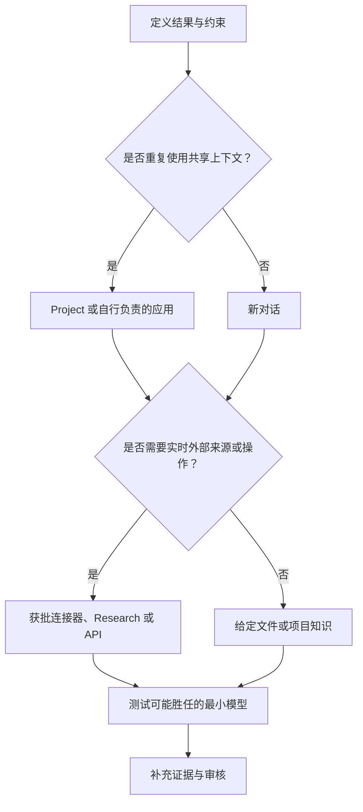

# 选择足以承载工作的最小产品形态（Choose the Smallest Surface That Can Carry the Work）

> 产品选择，是知识工作尺度上的架构设计。产品形态选错了，即使输出正确，也可能过时、无法审核，或产生不必要的成本。

**Type:** Learn
**Languages:** Python
**Prerequisites:** [学会决策，而不只是记住术语（Study the Decisions, Not the Vocabulary）](../../00-certification-strategy/), [托管 LLM 平台（Managed LLM Platforms）](../../../../../phases/17-infrastructure-and-production/01-managed-llm-platforms/)
**Time:** ~90 分钟

## 学习目标（Learning Objectives）

- 在对话、Projects、Research、文件与 Artifacts、连接器（Connector）和编程接口之间作出选择。
- 不依赖特定模型版本，解释 Haiku、Sonnet 和 Opus 的长期定位。
- 根据质量、速度、成本、时效性和治理约束，匹配产品形态与模型。
- 通过架构决策记录（Architecture decision record，ADR），比较 Anthropic 直连、Amazon Bedrock、Google Vertex AI 和 Microsoft Foundry 部署路径。
- 判断何时应使用记忆（Memory）、项目知识（Project knowledge）或新对话来保持工作连续性。
- 为可能变化的产品事实标注官方来源和核实日期。

## 问题背景（The Problem）

一位运营负责人每周准备竞品简报。她打开上周的对话，粘贴三个新链接，要求更新，然后转发结果。

输出看起来很专业，却引用了上一轮对话中的旧产品价格，漏掉内部文档的一项政策变更，还包含一条没有来源的竞品主张。问题并非始于措辞，而是始于所选的工作界面。

旧对话携带了过时上下文。粘贴链接并不能保证研究全面。内部政策不在可用知识中。工作流也没有验证主张的步骤。

考试将这一目标称为产品与模型选择，但真正需要的是边界设计能力。你要决定 Claude 能看到什么、记住什么、检索什么、创建什么，以及任务值得投入多少推理能力。

## 核心概念（The Concept）

### 从工作出发，而不是从功能菜单出发（Start with the work, not the feature menu）

从六个维度描述任务：

| 维度（Dimension） | 问题（Question） |
|---|---|
| 重复性（Recurrence） | 任务是一次性的、重复发生的，还是持续运行的？ |
| 知识（Knowledge） | 所需来源是少量、大量、私有，还是不断变化的？ |
| 时效性（Freshness） | 昨天的副本今天是否可能已经错误？ |
| 输出（Output） | 结果是回复、报告、文件、分析，还是可复用的工作流？ |
| 后果（Consequence） | 结果错误或发生非预期操作会怎样？ |
| 协作（Collaboration） | 是个人使用，还是需要团队共享和维护？ |

之后再选择产品形态。

### 对话适合边界清晰的交流任务（Chat is for bounded conversational work）

对于输入明确的一次性任务，新对话通常是合适的默认选择。它提供清晰的上下文边界，适合起草、头脑风暴、解释、转换给定文本以及简短分析。

持续很久的对话中，旧假设可能在不知不觉间影响新工作，这会带来风险。当目标变化、上下文包含冲突指令，或你无法说明哪些早期消息仍然重要时，应重新开始。如果需要保持连续性，重启前先提取一份简短且经过核实的交接说明。

对话搜索和记忆可以恢复先前上下文，但不能替代获批的权威来源。记忆适合保存偏好和长期工作背景。政策、价目表或客户记录应存放在有负责人、有日期且持续维护的系统中。

### Projects 是持续维护的上下文边界（Projects are maintained context boundaries）

Project 将聚焦同一主题的对话、项目指令和知识库组织起来。当重复工作依赖相同的稳定上下文时，例如品牌指南、研究项目、操作规程或客户合作，Project 更合适。

其优势不只是存储，而是可重复性：每次新对话都在有意设定的边界内开始。

风险在于配置过时。包含上季度政策的 Project 可能持续作出同一种错误决策。每个 Project 都需要负责人、来源清单、复核节奏和移除流程。

官方产品行为会变化。按 2026 年 8 月 8 日的核查结果，Anthropic 帮助资料说明 Projects 可以包含指令和上传的知识，且知识量接近上下文上限时可以使用检索。可用性、限制和套餐要求必须在最新帮助中心重新核实。

### Cowork 是可在运行中引导的任务循环（Cowork is a steerable task loop）

Cowork 是面向多步骤知识工作的产品形态，不是独立部署路径，也不是本课的考试目标。按 2026 年 8 月 9 日的核实结果，Anthropic 当时的帮助资料描述了一种结果驱动的任务循环：你描述目标结果、审核方案、观察进度，并在运行中引导或调整工作方向。Projects 可为相关任务提供常备文件、链接、指令和记忆。Skills 提供可复用工作流，而插件可将技能、连接器、智能体（Agent）和钩子（Hook）打包。

当结果是实际文件，或任务需要跨获批来源协调，且人工引导有助于完成工作时，可以使用 Cowork。文件访问边界应保持狭窄：当前文档说明，本地访问仅限已连接的文件夹，文件操作受权限控制，永久删除需要明确批准。面对敏感文件、陌生插件、重大操作或广泛计算机访问时，应采用手动批准，持续关注任务，并检查产出文件。长时间运行的循环不会把责任转移给模型。

### Research 适合多来源调查（Research is for multi-source investigation）

任务需要广泛搜集信息、多次搜索、综合分析和引用时，使用 Research。对于范围较小的最新事实，直接网页搜索更合适。Research 更适合比较市场、审阅多篇论文，或将公开来源与已连接的内部资料相互核对。

Research 不会免除你判断来源质量的责任。长报告仍可能引用薄弱证据、混用不同日期的主张，或遗漏私有约束。应将引用视为通往证据的导航，而不是自动成立的证明。

### 文件与 Artifacts 让输出可检查（Files and Artifacts make the output inspectable）

根据下一步用途选择输出形式。如果答案读完即弃，行内文本就合适。如果需要比较字段，结构化表格更好。如果结果要进入业务流程，可下载的文档或电子表格更合适。

交付物应明确呈现假设、来源、日期和待解决事项。隐藏不确定性的精美文件，比带有清晰证据列的朴素表格更难审核。

文件创建和编辑能力可能随产品形态、套餐、文件类型和大小而变化。围绕这些能力设计周期性工作流前，应核实当前限制。

### 连接器以实时、受权限控制的访问替代复制（Connectors trade copying for live, permissioned access）

连接器让 Claude 能从外部服务中检索信息或执行操作。当来源时效性重要、手动复制粘贴容易偏离原始数据时，它们很有用。

不要仅因为存在连接器就选择它。需要检查：

- 它是只读，还是可以修改数据。
- 它继承已连接账户的哪些权限。
- 是否每个操作都需要批准。
- 哪些数据会随对话保留。
- 是否需要组织管理员启用。
- 它能否提供你需要的确切内容类型。

按 2026 年 8 月 8 日的核查结果，官方文档说明 Google Workspace 连接器可以搜索 Gmail、处理 Calendar 和 Drive 内容，且执行操作需要明确批准。文档还列出了限制，包括某些内容可能不可见。这些细节都是会变化的产品事实。

### API 与编程工具适合由你负责的软件行为（API and coding surfaces are for owned software behavior）

当你需要确定性集成、自定义界面、自动化测试、版本化配置，或在软件系统内重复执行时，转向 API、Claude Code 或智能体运行时（Agent runtime）。

不要为了逃避学习 Project 配置而构建应用。但当工作流需要对话产品无法表达的契约时，就应该构建应用，例如带类型的输出模式（Schema）、由应用负责的授权，或每次发布都自动执行的评估。

### 部署是控制平面决策（Deployment is a control-plane decision）

选择工作产品形态与选择 Claude 在哪里运行，是两个不同的决策。Project 可能适合作为员工界面，而另一个应用使用云托管 API。不要把两种选择都隐藏在“Claude”这个词后面。

按 2026 年 8 月 9 日的核实结果，Anthropic 官方文档描述了企业架构评审应比较的四条部署路径：

| 路径（Path） | 控制平面与采购（Control plane and procurement） | 适用条件（Strong fit when） | 批准前重新核查（Recheck before approval） |
|---|---|---|---|
| Claude for Enterprise 与直连 Claude API | Anthropic 管理面向人的产品和第一方 API 服务。企业席位与直连 API 工作区是不同的使用形态。 | 可以直接向 Anthropic 采购，重视第一方产品访问，且没有必须通过云市场采购的要求。 | 企业身份与席位政策、API 身份验证、工作区预算、数据条款、可用功能及模型生命周期。 |
| Amazon Bedrock | AWS 原生身份验证、计费、区域、配额，以及 AWS 管理的推理边界。 | 组织已通过 AWS IAM、AWS 采购及 AWS 合规控制来治理生产 AI。 | 模型访问、区域端点、功能差异、AWS 数据处理、配额，以及确切的 Bedrock API 代际。 |
| Google Vertex AI | Google Cloud 项目身份、计费，以及全球、多区域或区域端点。 | 工作负载应进入既有 Google Cloud 云落地区（Landing zone），并沿用其 IAM、计费、日志和数据驻留控制。 | 模型与功能支持、端点地理位置、预配容量与按量付费容量，以及 Google Cloud 数据处理。 |
| Microsoft Foundry | Azure 原生端点与身份验证，通过 Azure Marketplace 计费。当前文档描述了 Azure 托管和 Anthropic 托管两种选择。 | Azure 采购、Entra 身份、Azure RBAC 和 Foundry 运维已是获批路径。 | 托管选项、部署类型、区域或数据区、模型与功能支持，以及最新处理者条款。 |

这些行不是排名，而是责任归属图。最佳路径，是以最少新增控制平面满足组织约束的路径。

可以把 Anthropic 直连访问归为同一采购类别，但仍须明确各项控制。Claude for Enterprise 管理具名人员与共享工作。直连 Claude API 则通过 API 组织和工作区管理应用负载。席位不等于 API 容量，API 消费上限也不等于席位政策。

合作云还在各层的运营者和数据处理者方面有所不同。按 2026 年 8 月 9 日的核实结果，Anthropic 数据保留文档说明：第一方 Claude API 和 Microsoft Foundry 的数据处理者是 Anthropic，Amazon Bedrock 和 Google Cloud 的数据处理者则是云提供商。Foundry 另有不同托管选项，其边界须查阅最新 Foundry 页面。应记录确切服务、区域和托管选项，而不只是写“Azure”或“AWS”。

### 为需求评分，而不是为提供商评分（Score the requirement, not the provider）

在接洽供应商之前，先写下决策标准：

| 标准（Criterion） | 架构问题（Architecture question） |
|---|---|
| 云平台约束（Cloud commitment） | 已有哪些云落地区、网络控制、日志系统和支持团队？ |
| 采购（Procurement） | 消费是否必须通过云市场，或通过与 Anthropic 的直接协议结算？ |
| 合规与数据边界（Compliance and data boundary） | 谁是处理者？推理在哪里运行？什么可以离开边界？适用哪些保留条款？ |
| 身份（Identity） | 人员使用企业 SSO 和 SCIM，还是工作负载使用云身份、联合身份或限定范围的 API 凭据？ |
| 席位与预算（Seats and budgets） | 采购的是具名用户访问、应用词元（Token）、预配容量，还是其中多项？限制在哪里执行？ |
| 运维控制（Operational control） | 谁负责模型启用、配额、区域、日志、事故响应、弃用迁移工作和功能核实？ |

针对实际工作负载为各项标准赋权，为每条路径评分并简述理由，然后计算结果。没有理由的分数只是装饰。把一套分数照搬到另一个组织，会产生误导。

最后形成架构决策记录。写明所选路径、拒绝的替代方案、后果和复核触发条件。云平台约束、处理者条款、必需功能或采购要求都可能改变，因此已接受的决策仍需要复核日期。

### 模型家族是角色，不是身份等级（Model families are roles, not status levels）

长期有效的家族定位如下：

- **Haiku：** 面向范围窄、要求明确、调用量大的工作，优先考虑速度和低成本。
- **Sonnet：** 面向大多数专业工作流，在能力、延迟和成本之间取得平衡。
- **Opus：** 面向最困难的推理、综合分析和智能体式（Agentic）工作；当实测质量足以证明额外成本或延迟值得时，优先考虑能力。

确切代际、别名、价格、上下文上限、输出上限、思考模式和平台可用性都会变化。不要把版本表当成永久知识来教授，应查阅实时模型概览和定价页。

选择需要证据。在可能胜任的最小模型上运行代表性示例。只有修复提示词、上下文和验证设计后，实测失败仍然存在，才升级模型。



## 动手实现（Build It）

创建产品选择记录，其中包含两个相互关联的决策。

首先，为每周竞品简报选择工作产品形态。

1. 明确输出：两页高管简报，附来源附录。
2. 设定时效性：公开主张不早于七天前；内部产品事实来自当前获批路线图。
3. 选择 Research 广泛搜集公开信息，并选择获批连接器或持续维护的 Project 来源处理内部文档。
4. 将一份包含五个来源的代表性简报放到两个模型家族层级上测试，据此选择模型。
5. 比较事实覆盖率、无依据主张、延迟和审核时间。
6. 要求人类负责人批准最终主张。
7. 对每项可变事实记录所依据的产品文档和日期。

决策记录应包含被拒绝的替代方案。说明复用旧对话为何因上下文过时而不合适，以及原生工作流已满足需求时，为何构建自定义应用为时过早。

其次，为应用工作负载完成部署决策矩阵：

1. 打分前先写出具体负载和六项部署标准。
2. 比较 Claude for Enterprise 与直连 API 访问、Amazon Bedrock、Google Vertex AI 和 Microsoft Foundry。
3. 根据该负载，为每项标准赋予一至五的权重。
4. 对每个候选方案的每项标准给出一至五的适配分数及理由。
5. 为每条可变平台主张关联最新官方文档，并记录核实日期。
6. 选择加权适配度最高的方案，再写明 ADR 的后果和复核触发条件。

不要为了选中偏好的提供商而操纵权重。如果某项硬性合规规则会淘汰一条路径，应在打分前将其明确列为准入门槛。

## 交互实验（Interactive Lab）

使用模型适配图调整重复性、时效性、后果、协作和输出约束。目的不是找出一个普遍最佳的产品形态，而是观察哪项约束使较简单的形态不再适用。

```figure
01-claude-model-fit
```

## 实践实验（Practice Lab）

运行本地适配评分器，然后让便宜模型无法通过某道门槛，或让更简单的产品形态满足全部约束。调整部署权重、将某个候选分数改成无效值，或删除带日期的证据。推荐必须随证据变化，而不是随产品或云平台偏好变化。

## 交付物（Shipped Artifact）

`outputs/product-selection-record.json` 包含填写完整的每周竞品简报产品形态决策，以及面向受监管 Azure 应用的部署矩阵和 ADR。部署部分覆盖当前全部四条路径、六项加权标准、与场景相关的理由、带日期的官方证据、后果和复核触发条件。

## 验证结果（Verify It）

运行确定性校验器及其测试：

```bash
cd certifications/claude/lessons/01-claude-product-and-model-landscape/code
python3 main.py
python3 -m unittest discover tests -v
```

校验器会拒绝以下情况：产品事实没有日期、所选模型不在基准中、缺少人类负责人、决策未记录被拒绝的替代方案、部署路径不完整、计算不一致、ADR 忽略加权适配度最高的方案，以及缺少官方证据。将填写好的记录改编为你负责的一项周期性工作流。

## 与综合实践的联系（Capstone Connection）

本课测验考查约束变化时的产品和模型适配决策。交付物将产品选择与来源边界决策带入第 29 至 32 课的综合实践，届时你必须说明更小或更原生的产品形态为何不合适。

## 实际应用（Use It）

开始工作前，使用这张简明决策卡：

```text
预期结果：
重复频率：
所需来源及其时效：
敏感程度：
输出形式：
人工负责人：
选定的产品接口：
选定的模型系列：
选定的部署路径：
云服务支出承诺与采购渠道：
数据边界与处理方：
人员席位与应用预算的分配：
更小或更简单的替代方案为何不适用：
易变事实的核验日期：
```

如果来源和负责人字段都填不出来，就还没到编写提示词的时候。

模型选择只需保留一小组对比任务。十个代表性任务比一个表现惊艳的示例更有用。应覆盖简单、常规、模糊和容易失败的情况，测量较小模型是否达到要求，而不只是比较文风。

## 考试决策模式（Exam Decision Patterns）

- 一次性、边界明确的转换任务通常从新对话开始。
- 重复工作依赖共享稳定上下文时，通常适合持续维护的 Project。
- 广泛、最新、多来源的调查通常适合 Research。
- 需要新鲜外部数据或外部操作时，通常适合获批连接器或自行负责的集成。
- 需要结构化、自动化、可测试的行为时，通常适合 API 或编程工具。
- 已有 AWS 治理和采购体系时，Bedrock 可能带来最小的运维变更。
- 已有 Google Cloud 治理和端点要求时，Vertex AI 可能带来最小的运维变更。
- 已有 Azure 采购、身份和 Foundry 运维体系时，Microsoft Foundry 可能带来最小的运维变更。
- 可以接受直接采购和第一方控制时，Anthropic 直连访问可能合适，但企业席位和 API 负载仍是独立决策。
- 选择达到实测质量要求的最小模型，而不是声誉最强的模型。
- 当旧上下文更可能干扰而非帮助时，重新开始。

## 常见陷阱（Common Traps）

- 因为方便而复用旧对话。
- 把记忆当成权威数据库。
- 上传一次文件就认为它会一直保持最新。
- 为简单事实查询选择 Research。
- 给连接器超出任务所需的权限。
- 将当前模型价格硬编码进永久决策规则。
- 尚未测试 Sonnet 或 Haiku 能否达标，就选择 Opus。
- 持续维护的原生产品形态已经够用，却构建自定义应用。
- 根据功能宣传选择云平台，忽略采购、身份和事故责任归属。
- 将具名用户席位当成应用容量，或将 API 预算当成席位政策。
- 只写“运行在我们的云中”，不记录确切服务、托管选项、端点地理位置和处理者。
- 将今天的模型与功能支持固化为永久的提供商矩阵。

## 练习（Exercises）

1. 分别为一次性改写、周期性政策问答、五来源市场报告和自动工单分类器选择产品形态，并说明理由。
2. 设计两个连接器不如文件上传的案例。
3. 用五个代表性任务比较小模型与大模型。运行前先定义成功标准。
4. 审核你使用的一个 Project，列出负责人、过时来源、持久指令和复核日期。
5. 在官方帮助中心找到一项当前产品限制，将它记录为带日期的事实，而不是永久规则。
6. 为组织中的一个应用对四条部署路径评分，然后调整云平台约束的权重，解释 ADR 是否应变化。

## 关键术语（Key Terms）

| 术语（Term） | 含义（Meaning） |
|---|---|
| 工作产品形态（Work surface） | 管理输入、上下文、工具和输出的产品边界 |
| 项目知识（Project knowledge） | 为 Project 内对话维护的文件或来源 |
| 记忆（Memory） | 由用户控制、源于先前工作的连续性信息，与权威来源数据分离 |
| 连接器（Connector） | 通向外部服务或数据源、受权限控制的连接 |
| Research | 多步骤信息搜集与综合分析能力 |
| 最小充分能力（Smallest sufficient capability） | 满足全部实测要求且复杂度最低的产品形态和模型 |
| 部署路径（Deployment path） | 人员或应用访问 Claude 所经过的商业与运维路径 |
| 控制平面（Control plane） | 负责身份、政策、计费、配额、部署和运维配置的系统 |
| 架构决策记录（Architecture decision record） | 带日期的记录，说明决策、背景、替代方案、后果和复核触发条件 |

## 延伸阅读（Further Reading）

- [模型概览（Models overview）](https://platform.claude.com/docs/en/about-claude/models/overview)
- [身份验证（Authentication）](https://platform.claude.com/docs/en/manage-claude/authentication)
- [工作区（Workspaces）](https://platform.claude.com/docs/en/manage-claude/workspaces)
- [设置单点登录（Set up single sign-on）](https://support.claude.com/en/articles/13132885-set-up-single-sign-on-sso)
- [Claude Enterprise 消费上限](https://platform.claude.com/docs/en/manage-claude/spend-limits-api)
- [API 与数据保留（API and data retention）](https://platform.claude.com/docs/en/manage-claude/api-and-data-retention)
- [Amazon Bedrock 中的 Claude](https://platform.claude.com/docs/en/build-with-claude/claude-in-amazon-bedrock)
- [Google Cloud 上的 Claude](https://platform.claude.com/docs/en/build-with-claude/claude-on-vertex-ai)
- [Microsoft Foundry 中的 Claude](https://platform.claude.com/docs/en/build-with-claude/claude-in-microsoft-foundry)
- [什么是 Projects？](https://support.claude.com/en/articles/9517075-what-are-projects)
- [开始使用 Claude Cowork](https://support.claude.com/en/articles/13345190-get-started-with-claude-cowork)
- [安全使用 Claude Cowork](https://support.claude.com/en/articles/13364135-use-claude-cowork-safely)
- [在 Claude 中使用 Skills](https://support.claude.com/en/articles/12512180-use-skills-in-claude)
- [安装 Cowork 插件](https://claude.com/docs/cowork/guide/plugins)
- [何时使用网页搜索、扩展思考和 Research](https://support.claude.com/en/articles/11095361-when-should-i-use-web-search-extended-thinking-and-research)
- [使用连接器扩展 Claude](https://support.claude.com/en/articles/11176164-use-connectors-to-extend-claude-s-capabilities)
- [使用 Google Workspace 连接器](https://support.claude.com/en/articles/10166901-use-google-workspace-connectors)
- [上下文工程（Context Engineering）](../../../../../phases/11-llm-engineering/05-context-engineering/)
- [模型路由（Model Routing）](../../../../../phases/17-infrastructure-and-production/16-model-routing/)
