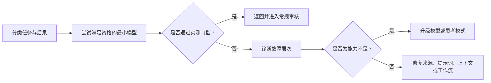

# 将能力投入到失败代价高的地方（Spend Capability Where Failure Is Expensive）

> 模型选择不是排名，而是在质量、延迟、上下文和成本之间分配资源的问题。

**Type:** Learn
**Languages:** Python
**Prerequisites:** [选择足以承载工作的最小产品形态（Choose the Smallest Surface That Can Carry the Work）](../../01-claude-product-and-model-landscape/), [缓存、速率限制与成本优化（Caching, Rate Limiting and Cost Optimization）](../../../../../phases/11-llm-engineering/11-caching-cost/)
**Time:** ~90 分钟

## 学习目标（Learning Objectives）

- 不依赖背诵价格表，估算词元（Token）与工作流成本。
- 根据实测质量、延迟和后果选择模型。
- 解释采样（Sampling）的非确定性，以及为何发布结论需要重复评估。
- 核实当前模型与平台后，再选择速度、投入程度（Effort）和思考（Thinking）设置。
- 区分模型故障与提示词、上下文、来源和工作流故障。
- 将路由（Routing）、缓存（Caching）、批处理（Batching）和输出上限作为独立优化手段使用。

## 问题背景（The Problem）

一个支持团队将所有请求路由到能力最强的模型。第一个月看似成功：质量很高，但响应时间不稳定，账单达到预测的四倍。

经理于是将所有任务改用最快模型。成本下降了，但升级处理摘要开始遗漏例外条款，复杂退款案例也得到了自信却不完整的建议。

两种设计都把模型名称当成政策，却都没有描述工作本身。

生产决策应从失败代价入手。内部头脑风暴中的错别字代价很低，退款决策遗漏例外条款的代价则更高。模型、提示词、上下文、来源质量和审核流程都应体现这一区别。

## 核心概念（The Concept）

### 词元是工作负载的度量（Tokens are a workload measure）

模型处理的是词元，不是页数或单词数。输入词元包含指令、对话历史、给定文档、工具定义和检索内容。输出词元包含回答；视产品或 API 而定，也可能包含推理相关计算或当前定价说明中的其他计费单位。

规划时，将输入分成四类：

```text
total input = stable instructions + task input + retrieved knowledge + prior turns
total output = requested answer + structured metadata
```

不要把所有输入都隐藏在一个数字里。稳定指令可能受益于缓存；检索知识可以裁剪；历史轮次可以总结或丢弃；任务输入通常无法删除。

### 先使用变量，再代入实时价格（Use variables before live prices）

价格会变，长期适用的等式不会变：

```text
request cost = input_tokens / 1,000,000 x input_rate
             + output_tokens / 1,000,000 x output_rate
             + tool or feature charges
```

对于工作流：

```text
workflow cost = request cost x requests per case x cases per month
              + review cost
              + failure and rework cost
```

审核和返工很重要。便宜模型如果造成两倍的人工修正工作，反而可能是更贵的选择。

考虑一份示意而非当前价格表：模型 A 的输入费率为 1 单位，输出为 5；模型 B 分别为 3 和 15。一个案例使用 20,000 个输入词元和 2,000 个输出词元，模型 B 每次调用的成本是 A 的三倍。如果模型 A 能通过 98% 的分流案例，而且困难案例能够被识别，就将常规工作交给 A，把不确定的剩余部分升级处理。如果无法安全识别困难案例，路由设计就还不完整。

### 质量需要阈值，而不是感觉（Quality needs a threshold, not a vibe）

测试模型前，定义最低可接受结果。可用维度包括：

- 包含必需事实。
- 不包含无依据主张。
- 遵守指令。
- 输出模式（Schema）有效。
- 延迟低于工作流限制。
- 人工修正时间低于阈值。
- 安全与隐私控制得以保留。

最佳模型是在留有足够余量的情况下通过全部必需阈值、且成本最低的选择。仅看平均质量不够；模型可能总体得分很好，却在每个后果严重的边界案例上失败。

### 采样产生的是分布，不是重放（Sampling produces a distribution, not a replay）

生成每个词元时，语言模型都对可能的后续内容给出概率分布，采样从中作出选择。对于支持温度设置的模型，温度会改变分布的集中程度，但不会把模型推理变成确定性函数。

Anthropic 官方 API 文档指出，即使温度为零，也并非完全确定。通过第一方 API 或合作云发送相同请求，仍可能得到不同结果。固定模型 ID 可以稳定模型权重，但 Anthropic 模型版本文档也说明，路由、安全分类器和采样逻辑等服务基础设施仍可能变化。

这改变了什么才算证据：

- 一次回答通过，只能证明那一次回答通过了。
- 单个平均值会隐藏尾部失败和运行间波动。
- 确定性校验器可以检查模式和算术，但不能让生成变得确定。
- 对同一版本化任务重复试验，可以揭示最低质量、方差、严重失败和尾延迟（Tail latency）。
- 模型、提示词、工具、平台或服务模式变化后，需要重新比较。

小型学习练习中，每种配置至少独立运行三次。生产样本量应由观察到的风险和方差决定，而不是照搬这个最低次数。应分别比较不同风险分组，优先使用关键案例最低质量和 p95 延迟等门槛，而不是一个好看的均值。

采样控制本身也是可变产品事实。按 2026 年 8 月 9 日的核实结果，当时 Anthropic Messages 指南说明 Claude 4.7 及以后版本拒绝非默认的 `temperature`、`top_p` 或 `top_k` 值。仍受支持的旧模型可能接受其中部分参数。未核查当前模型和平台文档前，不要从旧请求复制采样设置。

### 诊断故障层次（Diagnose the failure layer）

输出不佳时，先判断故障源头：

1. **需求故障（Requirement failure）：** 从未定义成功标准。
2. **来源故障（Source failure）：** 必需事实缺失或过时。
3. **上下文故障（Context failure）：** 相关证据被淹没、截断，或与冲突材料混在一起。
4. **提示词故障（Prompt failure）：** 指令或输出标准不清晰。
5. **模型故障（Model failure）：** 输入和标准良好，但模型仍缺乏所需能力。
6. **工作流故障（Workflow failure）：** 缺少审核、升级处理或工具行为。

升级模型主要帮助解决第五层。它可能暂时掩盖其他层的问题，从而让系统更难调试。

### 延迟包含多个部分（Latency has several components）

用户体验到的不只是总耗时：

- 首次可见输出前的等待时间。
- 流式数据块之间的间隔。
- 总生成时间。
- 工具和检索时间。
- 人工批准时间。

更强的模型可能每次调用更慢，却减少重试次数。小模型可能响应很快，却造成更多循环。应测量完整工作流。

### 根据可观察约束进行路由（Route by observable constraints）

简单路由政策可以把工作分成三条通道：

| 通道（Lane） | 示例（Example） | 政策（Policy） |
|---|---|---|
| 常规（Routine） | 整理给定更新的格式 | 快速模型，严格模板 |
| 模糊（Ambiguous） | 比较冲突笔记 | 均衡模型，明确来源要求 |
| 重大后果（Consequential） | 建议采用例外处理 | 高能力模型，加上强制审核 |

分类器本身也会失败。尽可能使用确定性信号：文档长度、任务类型、敏感度标签、请求操作或用户明确选择。记录路由决策，并审计错误路由。



### 缓存、批处理和上限解决不同问题（Caching, batching, and limits solve different problems）

**提示词缓存（Prompt caching）**在当前模型和平台支持时，减少重复处理稳定提示词前缀的成本与延迟。它不会让过时指令变正确。

**语义缓存（Semantic caching）**为足够相似的请求复用先前结果。它需要时效政策，对于个性化、快速变化或后果重大的工作具有风险。

**批处理（Batch processing）**以响应时间换取成本和吞吐量，适合夜间分类或批量提取等离线工作，不适合用户正在等待的交互工作。

**输出上限（Output limits）**防止回答不必要地冗长，但低于任务要求时也会截断工作。要求最小有用输出，并验证完整性。

**上下文裁剪（Context pruning）**在无关输入产生费用、干扰模型前移除它。更多上下文并不自动等于更多知识。

### 配置是一组带日期的选择（A configuration is a dated bundle）

模型选择只是配置手段之一：

| 手段（Lever） | 改变什么（What it changes） | 测量什么（What to measure） |
|---|---|---|
| 模型（Model） | 基础能力、价格、支持功能和生命周期 | 各风险分组的质量、成本、延迟、兼容性 |
| 速度（Speed） | 支持快速模式时的服务速度，通常价格更高 | 每秒输出词元、首词元时间、p95 延迟、每个合格结果的成本 |
| 投入程度（Effort） | 在支持的平台上，模型在文本、思考和工具使用中投入的工作量与词元消耗 | 质量、工具调用次数、输出词元、延迟、成本 |
| 思考（Thinking） | 在支持的平台上，模型是否以及如何分配显式推理 | 困难案例质量、思考词元、总输出、延迟、成本 |
| 提示词与输出契约（Prompt and output contract） | 指令、证据边界、格式和要求长度 | 指令遵循、模式有效性、修正时间 |
| 采样（Sampling） | 仍接受采样控制的模型代际中的随机性控制 | 结果波动、严重失败、风格多样性 |

按 2026 年 8 月 9 日的核实结果，官方模型概览将 `claude-sonnet-5` 和 `claude-opus-5` 列为确切的 Claude API ID。Sonnet 5 默认启用自适应思考，允许关闭思考，并支持交付物中使用的 low 和 high 投入程度值。Opus 5 接受自适应思考和交付物中的 medium 投入程度值。

快速模式的适用范围更窄。当前官方文档列出的是 Opus 5 和 Opus 4.8，不包括 Sonnet 5，并将功能限定在 Claude API 内，包括 Managed Agents，而非合作平台。它是需要访问资格的研究预览，要求 `speed: "fast"` 和 `anthropic-beta: fast-mode-2026-02-01` 请求头。它以溢价提供同一模型的更快推理，不承诺更高智能。可用性、支持范围和价格可以独立变化。

不要把永久兼容矩阵写进路由代码或学习笔记。每次实验前：

1. 记录确切模型 ID 和平台。
2. 打开当前关于模型支持、思考、投入程度、速度和定价的官方页面。
3. 为每种拟用配置标注 `docs-supported` 或 `docs-unsupported`，附上日期和来源。文档支持不证明账户拥有预览访问资格。
4. 不要试验不受支持的组合，也不要假设它会静默回退。
5. 使用同一任务集和门槛，重复运行受支持配置。

平台允许时，每次只改变一个因素。如果支持范围迫使你同时改变模型和速度，应称之为路由替代方案，而不是速度单独导致结果变化的证据。

### 换算考试分数不是百分比（A scaled exam score is not a percentage）

按 2026 年 8 月 9 日的核实结果，Anthropic 认证常见问题说明，考试结果采用 100 至 1,000 的换算分数，最低及格分为 720。换算用于等值处理难度可能不同的试卷。

因此，720 绝不证明原始及格线是 72% 正确率。本课程测验和模拟考试的百分比是原始练习得分，不能转换为官方换算分数，也无法预测考试结果。

## 动手实现（Build It）

为每周运营工作流创建包含十个案例的模型选择基准。

- 四个常规格式整理与分类案例。
- 三个含糊的综合分析案例。
- 两个来源材料冲突的案例。
- 一个后果重大、必须升级给人工处理的案例。

运行任何模型前，先定义评分量表（Rubric）：

```json
{
  "required_facts": 4,
  "unsupported_claims_allowed": 0,
  "format_valid": true,
  "latency_seconds_max": 20,
  "human_correction_minutes_max": 3,
  "consequential_case_must_escalate": true
}
```

先测试可能胜任的最小模型家族，记录输入与输出词元、延迟、量表分数和修正时间。仅升级失败案例。将路由工作流与十个案例全部交给大模型的方案比较。

报告必须回答：

- 哪些案例可以安全使用小模型？
- 哪种可观察信号会将案例向上路由？
- 哪些失败并非模型故障？
- 在示意业务量下，路由节省多少成本？
- 路由器不确定时怎么办？

然后，为一个模糊或后果重大的案例创建模式试验交付物：

1. 在看到结果前定义最低质量、最大 p95 延迟、最大平均成本和最低重复运行次数。
2. 提出至少三种改变速度、投入程度或思考设置的配置。
3. 在最新官方文档中核实每个确切模型与平台组合，保留一个文档明确不支持的组合作为被拒绝选项。
4. 对每种受支持配置，使用相同提示词、来源、工具和评分量表至少运行三次。
5. 每次记录质量、延迟、成本和结果指纹（Outcome fingerprint）。
6. 根据原始运行结果核算最低质量、p95 延迟和平均成本。
7. 选择通过全部门槛且成本最低的受支持配置。

提供的交付物比较了低与高投入程度、自适应与关闭思考、同一模型上的标准与快速服务，以及一个不受支持的快速组合。其中 `standard` 速度是省略请求字段时使用的归一化实验标签。快速配置单独记录所需预览资格、请求字段和 beta 请求头。这是带日期的示例，不是可复用兼容表，也不证明账户拥有使用资格。

## 交互实验（Interactive Lab）

使用风险图调整后果、不确定性、可逆性和审核强度。它让错误放行的隐藏代价在优化词元开销前变得可见。

```figure
02-responsible-ai-risk
```

## 实践实验（Practice Lab）

运行十案例路由基准。让重大后果案例跳过审核、重复案例 ID，或错误填写路由成本，观察确定性验证失败。随后删除一次重复模式运行、修改已核算的 p95 值、尝试文档不支持的模式，或选择成本不达标的配置。修复证据，不要放宽门槛。

## 交付物（Shipped Artifact）

`outputs/model-routing-benchmark.json` 保留了覆盖常规、模糊、来源冲突和重大后果工作的十案例路由契约，包括实测门槛、所选通道、词元估算、审核时间，以及路由与全部使用大模型的比较。

`outputs/mode-trials.json` 是实际配置交付物，记录当前文档证据、速度、投入程度、思考、快速模式请求前提、重复质量、p95 延迟、平均成本、不受支持组合、所选模式和重跑触发条件。

支持声明来自带日期的官方文档，状态使用 `docs-supported`，而不是“已通过实时请求验证”。质量、延迟和成本是教学示例数据，并非提供商实际运行或基准结果。应将它们替换为你自己的任务集和账户上的重复运行结果。

## 验证结果（Verify It）

无需调用提供商即可验证基准：

```bash
cd certifications/claude/lessons/02-model-selection-and-token-economics/code
python3 main.py
python3 -m unittest discover tests -v
```

校验器保留原始基准检查，并单独验证模式试验。它要求：当前官方支持证据、明确的示意测量标签、快速模式请求前提、每种文档支持模式至少三次重复运行、观察到的结果指纹、核算一致的摘要、未尝试运行的文档不支持选项，以及选择成本最低的达标配置。它没有硬编码任何未来模型支持何种模式的主张。

## 与综合实践的联系（Capstone Connection）

测验考查路由、故障层次诊断和成本推理。将验证后的基准用作第 29 至 32 课综合实践的模型选择证据，再用你自己的代表性案例结果替换示意测量值。

## 实际应用（Use It）

使用以下决策句式：

```text
对于[任务类别]，选择[模型系列或模式]，因为它在[重复运行次数]中均通过了[质量门禁]，
且符合[p95 延迟与平均成本上限]。出现[可观测条件]时升级处理；
达到[后果阈值]时，必须执行[审查规则]。
模型、平台、速度、推理强度和思考支持已于[日期]依据官方文档核验。
```

如果理由只是“它更聪明”，决策就还没完成。

运行基准前查阅实时模型概览和价格页。将确切模型标识符保存在基准结果中，而不是永久政策中，以免模型别名变化悄悄使证据失效。

把不受支持的配置留在决策记录中，而不是生产请求中。拒绝理由解释了为何没有测试某个诱人的模式，也为未来核实提供了明确触发条件。

## 考试决策模式（Exam Decision Patterns）

- 为更强能力付费前，先修复缺失标准、来源和上下文。
- 使用能通过代表性质量门槛的最小模型。
- 除词元价格外，还计入人工修正与失败成本。
- 根据可观察信号，将后果重大或含糊的工作向上路由。
- 只有工作流容忍延迟完成时，才采用批处理。
- 只有时效性与隔离条件允许时，才缓存稳定、可复用材料。
- 将模型功能、定价和上限视为带日期的事实。
- 重复执行概率性评估；低温度或固定模型 ID 不保证输出相同。
- 将速度、投入程度和思考作为实测配置选择比较，而不是视为等级象征。
- 将 720 视为换算认证分数，绝不视为原始百分比。

## 常见陷阱（Common Traps）

- 根据家族声誉而不是任务基准选择模型。
- 只用一个简单示例比较模型。
- 报告平均质量，却隐藏关键案例失败。
- 把所有差输出都归为模型局限。
- 持续增加上下文，使成本与干扰同时上升。
- 底层来源变化后仍复用缓存输出。
- 成本模型遗漏审核时间。
- 用不透明分类器路由，且没有审计轨迹。
- 因一次运行通过或温度低，就宣称提示词具有确定性。
- 从其他模型或平台复制速度、投入程度、思考或采样设置。
- 对不受支持模式静默降级，而不是拒绝执行并记录不兼容。
- 比较平均延迟，却隐藏违反用户目标的尾部延迟。
- 将 720 的换算及格线转换为 72% 的原始目标。

## 练习（Exercises）

1. 用符号计算包含 50,000 个案例、两个模型层级的工作流月成本。
2. 为支持工作流写出三个确定性路由信号。
3. 将五种故障诊断为需求、来源、上下文、提示词、模型或工作流问题。
4. 找出一个应使用批处理的任务，以及一个必须保持交互的任务。
5. 在官方文档中核实一项当前思考功能，记录模型、平台和日期。
6. 将一种配置运行三次，保留结果指纹，解释单次运行会隐藏什么。
7. 在官方文档中找到一个当前不受支持的模式组合，只记录，不发送请求。

## 关键术语（Key Terms）

| 术语（Term） | 含义（Meaning） |
|---|---|
| 词元经济性（Token economics） | 输入、输出、请求量、模型费率与工作流成本之间的关系 |
| 质量门槛（Quality gate） | 候选配置必须通过的可测量阈值 |
| 路由（Routing） | 根据任务信号选择模型或执行通道 |
| 升级处理（Escalation） | 将不确定或后果重大的工作转交更强能力或人工审核 |
| 提示词缓存（Prompt caching） | 对稳定提示词材料复用提供商侧计算 |
| 返工成本（Rework cost） | 修正不合格输出所需的人工或机器投入 |
| 采样（Sampling） | 从模型概率分布中选择生成词元 |
| 模式试验（Mode trial） | 对确切模型、平台、速度、投入程度和思考配置开展带日期的重复评估 |
| 尾延迟（Tail latency） | p95 等高分位延迟指标，揭示均值隐藏的慢请求 |
| 换算分数（Scaled score） | 用于等值处理不同试卷的转换后成绩，不是原始正确率 |

## 延伸阅读（Further Reading）

- [模型概览](https://platform.claude.com/docs/en/about-claude/models/overview)
- [创建消息 API 参考](https://platform.claude.com/docs/en/api/messages/create)
- [使用 Messages](https://platform.claude.com/docs/en/build-with-claude/working-with-messages)
- [模型 ID 与版本管理](https://platform.claude.com/docs/en/about-claude/models/model-ids-and-versions)
- [Claude Sonnet 5 新功能](https://platform.claude.com/docs/en/about-claude/models/whats-new-sonnet-5)
- [Claude Opus 5 新功能](https://platform.claude.com/docs/en/about-claude/models/whats-new-opus-5)
- [Claude 定价](https://platform.claude.com/docs/en/about-claude/pricing)
- [思考（Thinking）](https://platform.claude.com/docs/en/build-with-claude/thinking)
- [投入程度（Effort）](https://platform.claude.com/docs/en/build-with-claude/effort)
- [快速模式（Fast mode）](https://platform.claude.com/docs/en/build-with-claude/fast-mode)
- [提示词缓存（Prompt caching）](https://platform.claude.com/docs/en/build-with-claude/prompt-caching)
- [批处理（Batch processing）](https://platform.claude.com/docs/en/build-with-claude/batch-processing)
- [Anthropic 认证常见问题](https://anthropic-partners.skilljar.com/page/faq-certifications)
- [缓存、速率限制与成本优化](../../../../../phases/11-llm-engineering/11-caching-cost/)
- [提示词与语义缓存经济性](../../../../../phases/17-infrastructure-and-production/14-prompt-semantic-caching/)
- [作为成本削减基础手段的模型路由](../../../../../phases/17-infrastructure-and-production/16-model-routing/)
