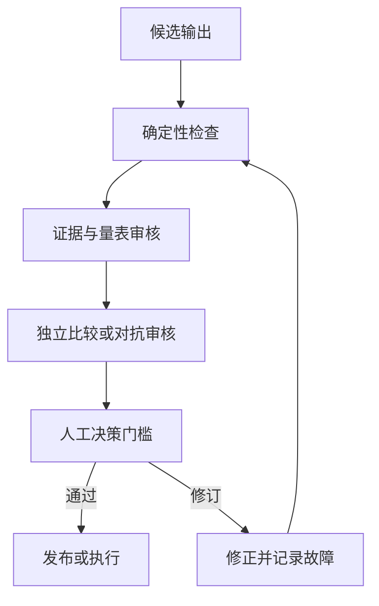

# 验证主张，而不是相信自信语气（Validate the Claim, Not the Confidence）

> 流畅度体现表达质量。验证（Validation）提供证据，证明输出能够安全完成其任务。

**Type:** Learn
**Languages:** Python
**Prerequisites:** [将请求转化为可测试的契约（Turn a Request Into a Testable Contract）](../../03-prompting-and-task-decomposition/), [将每项事实放入合适的上下文（Put Each Fact in the Right Kind of Context）](../../04-context-knowledge-memory-and-caching/), [评估与测试（Evaluation and Testing）](../../../../../phases/11-llm-engineering/10-evaluation/)
**Time:** ~115 分钟

## 学习目标（Learning Objectives）

- 为具体任务建立准确性、完整性、一致性、受众适配、偏差和格式标准。
- 将后果重大的主张追溯到权威证据。
- 结合确定性检查（Deterministic check）、量表评分器（Rubric grader）、独立审核和人工判断。
- 诊断幻觉（Hallucination）、遗漏、矛盾、范围和引用故障。
- 选择修复前，依据模型能力局限诊断非预期输出。
- 将生产故障转化为持久评估案例。

## 问题背景（The Problem）

Claude 根据客户数据和内部政策生成每周高管简报。简报开头有力、建议简洁，每节都有引用。领导据此批准了一项政策变更。

后来分析师发现三个问题：一处引用指向的文档提到相关主题，却不支持主张；一个小客户群体在聚合时消失；一条建议超出团队权限。

文档因为有引用、语气专业，看起来像经过验证，却没人测试覆盖率、蕴含关系（Entailment）或操作范围。

这正是输出评估在 Claude Certified Associate 大纲中占比最大的原因。有用的 Claude 工作流不会在文字出现时停止，而是在结果通过与后果相称的检查后才停止。

## 核心概念（The Concept）

### 从输出的用途出发（Start from the job of the output）

评估标准应随输出所支持的决策而定。头脑风暴清单与监管申报需要不同证据和审核。

以六个维度为起点：

1. **准确性（Accuracy）：** 事实主张有依据、计算正确吗？
2. **完整性（Completeness）：** 必需项目、群体、例外和限定说明都在吗？
3. **一致性（Consistency）：** 各章节、数字、标签和建议相互一致吗？
4. **受众适配（Audience fit）：** 目标读者能否理解并据此行动？
5. **公平与安全（Fairness and safety）：** 输出是否引入无正当依据的偏差、暴露数据或超出政策？
6. **格式合规（Format compliance）：** 是否满足人员和系统的结构要求？

这些是类别，不是分数，要将它们转化为可观察测试。

薄弱标准：

```text
报告准确且完整。
```

可测试标准：

```text
每项定量主张必须与给定数据集核算一致。
每条建议必须引用至少一项支持性发现和一项适用约束。
全部七个运营区域都必须出现，或标为“无数据”。
摘要必须说明两项最大不确定性。
```

### 将主张追溯到证据（Trace claims to evidence）

引用是指针。验证要问：指向的证据是否支持这项确切主张？

创建主张与证据矩阵（Claim-evidence matrix）：

| 主张 ID（Claim ID） | 主张（Claim） | 来源（Source） | 支持类型（Support type） | 权威性（Authority） | 审核结果（Reviewer result） |
|---|---|---|---|---|---|
| C-01 | 北部区域退货增加 | 数据集第 120-184 行 | 直接计算 | 一手数据 | 通过 |
| C-02 | 培训导致了变化 | 访谈笔记 7 | 推测 | 轶事证据 | 失败 |
| C-03 | 退款需要批准 | 政策 4.2 | 直接引用 | 获批政策 | 通过 |

矩阵区分四个常见问题：

- 来源是否存在？
- 对这项主张是否具有权威性？
- 它是否真正支持主张，而不只是讨论该主题？
- 主张是否强于证据所能支持的程度？

报告可以引用正确，却仍夸大因果。“发生在之后”不证明“由其导致”。

### 重试前先诊断属性（Diagnose the property before retrying）

“非预期输出”不是有效诊断。泛泛重试通常会重现故障，因为原因未变。

Anthropic 入门能力课程围绕四个模型属性组织诊断。应将它们作为实用故障树，而非四个孤立标签：

| 属性（Property） | 故障信号（Failure signal） | 针对性应对（Targeted response） |
|---|---|---|
| 下一词元预测（Next-token prediction） | 回答流畅合理，却无依据 | 将重大主张关联给定证据，要求弃答，并验证蕴含关系 |
| 知识（Knowledge） | 任务依赖新近、罕见、私有或有争议的事实 | 添加最新权威来源，呈现不确定性，不依赖参数记忆 |
| 工作记忆（Working memory） | 重要上下文被淹没、不在当前会话，或与过多材料竞争 | 只检索相关上下文、拆分任务、总结状态并验证覆盖 |
| 可引导性（Steerability） | 指令模糊、冲突、过长或无法检查 | 将请求改成简洁契约，明确优先级、示例、约束和验收测试 |

多个属性可能同时出现问题。很长的政策问题可能超过有效工作记忆，也同时询问模型知识之外的事实。记录一个主要属性、所有促成问题的属性、诊断证据，以及针对每个原因的修复。

可选的 AI Fluency 4D 检查补充了同一决策中的人类侧：

- **委派（Delegation）：** 决定哪些工作应委派，哪些判断必须留给人。
- **描述（Description）：** 提供系统所需的上下文、目标、约束和成功标准。
- **辨别（Discernment）：** 评估结果是否准确、有用且适当。
- **尽责（Diligence）：** 在整个工作流中落实隐私、归属标注、政策和问责。

这些检查不替代任务特定评估，而是帮助选择合适评估者和修复，避免把每次失败都当成“提示词不好”。

### 使用分层验证（Use layered validation）

没有单一评估者足够，应结合多层：



**确定性检查（Deterministic checks）**是代码或精确规则，适用于模式有效性、必需字段、行总数、范围、引用 ID 是否存在、禁用词和权限标志。

**量表审核（Rubric review）**处理需要解释的质量，例如摘要是否保留关键例外。模型可以按量表评分，但评分器本身也需要测试。

**独立或对抗审核（Independent or adversarial review）**另开一次审核，寻找无依据主张、遗漏群体、冲突和不安全建议。独立性很重要；让同一次生成自证正确，会产生相关联的盲点。

**人工审核（Human review）**负责后果、模糊权衡和组织权限。人不应重复每项机械检查，而应拿到证据、不确定性、失败检查和需要判断的决策。

### 为属性匹配评估者（Match the evaluator to the property）

对每个属性使用成本最低且可靠的评估者：

| 属性（Property） | 合适的首选评估者（Strong first evaluator） |
|---|---|
| JSON 有效 | 解析器或模式校验器 |
| 算术总数 | 确定性计算 |
| 确切必需字段 | 程序化断言 |
| 含义保留 | 基于量表的比较 |
| 段落支持主张 | 附引用片段的证据审核 |
| 高管语气恰当 | 人工或经测试的量表评分器 |
| 高影响公平性决策 | 依据政策的合格人工审核 |

代码能精确确定的事情，不要交给 LLM 判断。依赖语境的伦理权衡，也不要强迫代码决定。

### 幻觉不是单一故障（Hallucination is not one failure）

修复前先分类缺陷：

- **编造（Fabrication）：** 虚构事实或来源。
- **错误归因（Misattribution）：** 将真实主张归到错误来源。
- **过度推断（Overreach）：** 结论强于证据。
- **遗漏（Omission）：** 缺少必需事实、群体或例外。
- **矛盾（Contradiction）：** 输出两部分不能同时为真。
- **越界（Scope violation）：** 回答超出请求或权限。
- **过时（Staleness）：** 曾经有效的事实已不再最新。
- **格式故障（Format failure）：** 下游系统无法消费内容。

不同缺陷需要不同修复。编造可能需要限定来源和弃答；遗漏可能需要覆盖清单；矛盾可能需要核对步骤；格式故障可能需要结构化输出和解析器验证。

### 评估集要代表风险（Evaluation sets represent risk）

有用评估集不只包含正常示例，还应包含：

- 常见代表性任务。
- 重要边界案例。
- 先前观察到的故障。
- 缺失与冲突证据。
- 来源文本中的对抗指令。
- 涉及隐私、公平或未授权操作的案例。
- 接近长度和格式上限的输入。

按风险组跟踪表现。95% 的总体分数可能隐藏最重要案例仅 40% 的通过率。

为重大提示词或模型变化保留留出集（Held-out set）。如果反复针对所有案例调优，工作流可能记住测试形式，却无法泛化。

### 不带品牌偏见地比较输出（Compare outputs without brand bias）

比较提示词或模型变体时：

1. 使用相同案例和标准。
2. 可行时隐藏每个结果来自哪个系统。
3. 随机安排展示顺序。
4. 先为各维度评分，再判断总体偏好。
5. 调查审核者之间的分歧。
6. 重跑足够次数以观察不稳定性。

一次偏好的输出只是个案。部署决策需要覆盖代表性风险的结果分布。

## 动手实现（Build It）

### 第 1 步：定义发布门槛（Step 1: Define release gates）

按三级编写门槛：

```text
阻塞项：无依据的高影响主张、暴露受限数据、总数无效
必需项：覆盖所有区域、引用可解析、建议在权限内
质量项：摘要简洁、标题易读、尽量少重复
```

阻塞项禁止发布。质量问题是否允许发布并附修复工单，取决于政策。这样可以避免外观偏好与安全故障争夺优先级。

### 第 2 步：建立验证记录（Step 2: Build a validation record）

每次运行记录：

```json
{
  "workflow_version": "brief-v3",
  "source_snapshot": "2026-W31",
  "checks": {
    "schema": "pass",
    "totals_reconcile": "pass",
    "claim_support": "fail",
    "privacy": "pass"
  },
  "failed_claims": ["C-08"],
  "uncertainties": ["West region sample incomplete"],
  "reviewer_decision": "revise"
}
```

这些值仅为示意。生产中应对验证日志应用你的保留和隐私政策。

结果非预期时，附简短诊断：

```json
{
  "primaryProperty": "knowledge",
  "contributingProperties": ["next-token-prediction"],
  "evidence": "The cited policy was published after the model's supplied source snapshot.",
  "targetedFix": "Retrieve the approved current policy and rerun claim-support checks.",
  "humanCompetency": "discernment"
}
```

标签本身无用，证据与针对性修复才让诊断可测试。

### 第 3 步：分离生成与审核（Step 3: Separate generation and review）

给审核者草稿、标准和来源证据，不允许它静默改写。

```text
每个发现的问题返回一行：
claim_id | severity | evidence | criterion | proposed correction

如果没有给定来源支持某项主张，将其标为无依据。
不得虚构替代证据。
```

生成器随后可依据明确问题清单修订。为可审计性保留原始问题与修正。

### 第 4 步：校准评分器（Step 4: Calibrate graders）

创建通过、临界和失败输出示例，由合格审核者标注。比较自动评分器决策与人工参考。

先检查错误放行，因为它会释放坏输出；再检查错误拒绝，因为它浪费审核能力。记录人工判断合理不同的地方，不要强求虚假一致。

### 第 5 步：闭环改进（Step 5: Close the loop）

每个重大生产故障至少应产出一项持久成果：

- 新评估案例。
- 更明确的标准。
- 确定性检查。
- 来源管理修复。
- 提示词或工作流变更。
- 监控信号或升级规则。

不要只修复那份报告，还要改进放行它的系统。

## 交互实验（Interactive Lab）

使用文档与视觉流水线，检查从输入证据到提取字段、主张、验证问题和发布决策的每次转换。切换视觉提取失败或无依据主张，观察哪道门槛必须阻止发布。

```figure
05-document-vision-pipeline
```

## 实践实验（Practice Lab）

对填写好的主张矩阵运行发布评分器。将阻塞决策改为发布、让主张指向缺失来源、把精确总数交给模型裁判，或从非预期输出诊断中删除一个能力属性，确认发布验证失败。

## 交付物（Shipped Artifact）

`outputs/claim-validation-record.json` 是填写完整的审核包，包含主张与证据矩阵、四属性能力诊断、发布门槛、评估者分配、不确定性，以及最终 `revise` 决策。它故意包含一项失败的因果主张，以展示阻塞路径。

## 验证结果（Verify It）

运行确定性检查：

```bash
cd certifications/claude/lessons/05-output-evaluation-and-validation/code
python3 main.py
python3 -m unittest discover tests -v
```

校验器确认主张 ID 唯一、每个来源引用可解析、能力诊断包含全部四个属性和针对性修复、精确属性使用确定性评估者，以及阻塞失败不能产生发布决策。

## 与综合实践的联系（Capstone Connection）

测验考查蕴含关系、评估者选择、分组失败和回归学习。在第 29 至 32 课综合实践中，将此包作为验证与审核者证据。

## 实际应用（Use It）

### 考试决策模式（Exam decision pattern）

被问到如何改进输出质量时：

1. 定义输出用途和后果。
2. 选择明确、任务特定的标准。
3. 对精确属性使用精确检查。
4. 将重要主张追溯到权威证据。
5. 对模糊或高影响事项保留独立和人工审核。
6. 将观察到的故障反馈到评估集。

### 常见陷阱（Common traps）

- **流畅即正确（Fluency as correctness）：** 精美答案仍可能错误。
- **有引用即有依据（Citation presence as support）：** 链接未必支持主张。
- **单一总分（Single aggregate score）：** 关键风险分组消失在平均值中。
- **只有自审（Self-review only）：** 生成器与审核者共享假设和遗漏。
- **让 LLM 做精确算术（LLM for exact arithmetic）：** 确定性检查更便宜可靠。
- **人工审核没有资料包（Human review without a packet）：** 审核者只有文章，没有主张、证据或失败检查。
- **只测正常路径（Testing only happy paths）：** 缺失、冲突、过时和对抗输入仍不可见。
- **只修症状（Fixing symptoms）：** 报告修改了，但失败案例从未进入测试集。

### 练习（Exercises）

1. 将五个主观质量目标转化为可观察标准。
2. 为一页报告建立主张与证据矩阵，标出过度推断。
3. 为十项检查分配确定性、量表、独立或人工评估者。
4. 创建包含四个正常、三个边界和三个高风险案例的评估集。
5. 盲比两份输出，记录审核者分歧。

## 关键术语（Key Terms）

- **蕴含关系（Entailment）：** 证据是否真正支持陈述的主张。
- **评估集（Evaluation set）：** 用于测量行为的代表性和风险导向案例集合。
- **确定性检查（Deterministic check）：** 对精确预期属性执行可重复的程序化测试。
- **量表评分器（Rubric grader）：** 应用已定义定性标准的人工或模型评估者。
- **独立审核（Independent review）：** 不依赖生成器自我判断的单独评估步骤。
- **发布门槛（Release gate）：** 输出发布或据此行动前必须通过的条件。
- **错误放行（False pass）：** 评估者错误接受无效输出。
- **回归（Regression）：** 先前通过的行为在变更后失败。

## 延伸阅读（Further Reading）

- [Anthropic：定义成功标准并构建评估](https://platform.claude.com/docs/en/test-and-evaluate/develop-tests)
- [Anthropic：评估工具](https://platform.claude.com/docs/en/test-and-evaluate/eval-tool)
- [Anthropic：减少幻觉](https://platform.claude.com/docs/en/test-and-evaluate/strengthen-guardrails/reduce-hallucinations)
- [Anthropic Academy：AI 能力与局限](https://anthropic.skilljar.com/ai-capabilities-and-limitations)
- [Anthropic Academy：AI Fluency 框架与基础](https://anthropic.skilljar.com/ai-fluency-framework-foundations)
- [AI Engineering from Scratch：高级 RAG 与评估](../../../../../phases/11-llm-engineering/07-advanced-rag/)
- [AI Engineering from Scratch：审核智能体](../../../../../phases/14-agent-engineering/39-reviewer-agent/)
- [AI Engineering from Scratch：公平性标准](../../../../../phases/18-ethics-safety-alignment/21-fairness-criteria-group-individual-counterfactual/)

评估工具、模型行为和产品界面会变化。这些官方参考核查于 2026-08-08。模型、提示词、来源、工具或工作流政策变化时，应重新验证评分器和阈值。
