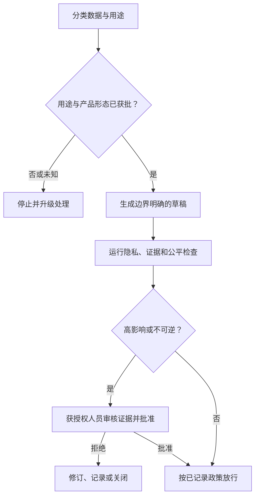

# 用授权约束能力（Put Authority Around Capability）

> 模型能够生成答案，并不意味着它有权查看数据、作出决策或执行操作。

**Type:** Learn
**Languages:** Python
**Prerequisites:** [将每项事实放入合适的上下文（Put Each Fact in the Right Kind of Context）](../../04-context-knowledge-memory-and-caching/), [验证主张，而不是相信自信语气（Validate the Claim, Not the Confidence）](../../05-output-evaluation-and-validation/), [防护机制（Guardrails）](../../../../../phases/11-llm-engineering/12-guardrails/)
**Time:** ~110 分钟

## 学习目标（Learning Objectives）

- 选择 Claude 产品形态或工作流前，先对信息和用例分类。
- 区分技术能力、组织许可和人员决策权限。
- 为隐私、安全、偏差、透明度、保留和滥用设计控制措施。
- 根据后果、可逆性和模糊程度安排人工审核。
- 为不安全或不合规行为建立事故与升级处理路径。

## 问题背景（The Problem）

一位客户成功经理希望加快账户评审，把支持对话记录、合同节选和续约笔记粘贴到未经批准的个人 AI 账户中。Claude 生成了有用摘要，于是经理要求它按续约风险排列客户，并自动发送特别优惠。

还没考虑输出质量，工作流就已经存在多项故障：

- 对话记录包含个人信息和商业敏感数据。
- 没人核查适用的产品条款和保留控制。
- 排名可能使不同客户群体受到不均等对待。
- 经理无权自动批准折扣。
- 没有来源、审核或已发送消息的记录。

在提示词中加一句“保护隐私”无法修复系统。治理（Governance）定义谁可以出于什么目的、通过哪种产品形态、在什么控制下使用哪些数据，以及最终由谁负责。

## 核心概念（The Concept）

### 先分类，再处理（Classify before processing）

从数据和决策开始，而不是从模型开始。

简单的组织分类可以是：

| 类别（Class） | 示例（Example） | 典型控制方向（Typical control direction） |
|---|---|---|
| 公开（Public） | 已发布文档 | 验证完整性和归属标注 |
| 内部（Internal） | 非公开流程笔记 | 获批账户与访问控制 |
| 机密（Confidential） | 合同、客户详情 | 最少必要数据、严格权限、保留审核 |
| 受限（Restricted） | 秘密、受监管记录、高敏感标识符 | 禁止使用，或要求特别批准的受控工作流 |

这些标签只是示例，不是普适法律。请使用组织实际政策和法律指导。

也要分类用例。为人工审核者总结文本，与决定资格或发送有约束力的沟通不同。低敏感输入仍可能支持高影响决策。

受理时问五个问题：

1. 哪些数据进入工作流？
2. 什么用途已获批准？
3. 谁可访问输入和输出？
4. 后续可能发生什么决策或操作？
5. 记录可以保留多久？

任何答案未知时，正确下一步可能是澄清政策，而不是生成。

### 能力、访问许可与决策权限相互独立（Capability, permission, and authority are separate）

Claude 技术上可能会起草优惠，连接器可能获准访问客户记录，但都不意味着工作流被授权批准折扣或发送消息。

设置三道门槛：

```text
能力：系统能否执行操作？
访问许可：该身份是否可以访问所需数据或工具？
决策权限：该角色是否有权作出或执行决策？
```

三者必须全部通过。工具权限应遵循最小权限（Least privilege），只给工作流获批用途所需的数据和操作。后果显著时，将读取、起草、批准和执行角色分开。

### 限定用途并最小化数据（Minimize data and purpose）

用途限制（Purpose limitation）意味着：获准用于一项工作的数据，不会自动获准用于另一项工作。为解决事故收集的支持记录，未必获准用于客户画像。

数据最小化（Data minimization）要求足以满足需求的最小输入：

- 无需身份时移除姓名。
- 用限定范围的引用替代精确标识符。
- 检索相关章节，而不是整份记录。
- 不将秘密放入提示词或日志。
- 将输出限定为下一步骤需要的字段。

最小化减少暴露、提示词大小和意外二次使用，但不免除使用获批产品形态及记录政策的要求。

### 产品条款是可变事实（Product terms are changeable facts）

数据使用、保留、区域处理、管理控制和功能可用性，可能因消费产品、商业服务、API 用途、套餐和配置而不同，也可能变化。

不要把一个 Claude 产品形态的假设移植到另一个。部署前，核实最新官方条款和组织合同中的：

- 提交数据是否以及如何被使用。
- 默认与可配置保留期限。
- 删除行为及法律例外。
- 管理访问与审计能力。
- 区域或数据驻留选项。
- 连接器和第三方数据处理。

在工作流决策日志中记录来源与核实日期。

### 人工审核应放在决策边界（Human review belongs at decision boundaries）

“人在回路（Human-in-the-loop）”太模糊，要定义人员看到什么、决定什么、能阻止什么。

以下任一因素较高时，应加强审核：

- 对人、财务、权利、安全或声誉的后果。
- 操作不可逆性。
- 政策或证据的模糊程度。
- 案例的新颖程度。
- 操作后发现错误的难度。



审核者需要来源证据、模型输出、不确定性、政策约束和拟议操作。只有一个批准按钮，会让监督流于形式。

### 公平性需要明确群体与结果（Fairness requires a defined population and outcome）

要求模型“不带偏见”解决不了偏差。应明确：

- 谁受影响？
- 分配或拒绝了什么结果？
- 哪些属性或代理变量可能造成无正当依据的差异？
- 使用什么比较与阈值？
- 谁具备解释结果的资格？
- 有什么申诉或纠正路径？

合法适当时，按相关群体分组测试，同时调查数据失衡和工作流设计。人工审核者如果看到同样的误导证据，也可能复现同样的偏差。

涉及就业、信贷、住房、医疗、教育、公共服务或法律权利的决策，应让具备资格的政策、法律和领域负责人参与。本课程不构成法律建议。

### 透明度应服务受影响者（Transparency should serve the affected person）

有用的透明说明包括：

- 政策要求披露时，说明 AI 提供了实质协助。
- 哪些信息影响结果。
- 仍有哪些不确定性或局限。
- 谁作出最终决策。
- 如何请求纠正或申诉。

不要为满足模糊的透明度要求而暴露隐藏系统指令、安全控制、个人数据或专有推理。以问责所需的层次解释流程和证据。

### 防护需要纵深防御（Guardrails need defense in depth）

提示指令只是一层。稳健工作流可以包含：

- 输入分类与访问控制。
- 秘密和个人数据检测。
- 可信来源检索过滤。
- 工具允许列表和限定范围凭据。
- 结构化输出与确定性验证。
- 内容与政策检查。
- 重大操作前批准。
- 速率和消费上限。
- 适当保留的审计日志。
- 监控、回滚和事故响应。

假设来源内容可能包含恶意指令。将检索文档视为数据而非命令，明确分隔，并将工具授权保留在模型文本之外。

### 事故需要预先准备的路径（Incidents need a prepared path）

事故可能是隐私暴露、不安全建议、未授权工具使用、系统性偏差、提示词注入（Prompt injection）或反复无依据输出。

上线前准备：

1. **检测（Detect）：** 定义信号和报告渠道。
2. **遏制（Contain）：** 暂停工作流、撤销凭据或禁用操作路径。
3. **保全（Preserve）：** 保留获准证据，不扩散敏感数据。
4. **通知（Notify）：** 遵循组织和法律升级规则。
5. **纠正（Correct）：** 修复数据、权限、提示词、模型或工作流控制。
6. **学习（Learn）：** 增加评估案例和监控，防止复发。

未核查实际政策和司法辖区前，不要承诺删除、通知时限或法律结论。

## 动手实现（Build It）

### 第 1 步：编写用例卡（Step 1: Write a use-case card）

```text
用途：
数据类别：
受影响人员：
允许来源：
获批 Claude 产品形态：
允许输出：
禁止操作：
人工决策负责人：
保留规则：
事故负责人：
```

用途、数据类别或操作权限变化时，要求明确批准。

### 第 2 步：创建控制措施图（Step 2: Create a control map）

将每项风险映射到预防、检测和纠正控制：

| 风险（Risk） | 预防（Prevent） | 检测（Detect） | 纠正（Correct） |
|---|---|---|---|
| 个人数据暴露 | 最小化并脱敏输入 | 扫描提示词和输出 | 遏制、通知、轮换访问凭据 |
| 无依据建议 | 限定来源 | 主张与证据验证 | 阻止并修订 |
| 未授权操作 | 只读工具和批准 | 审计操作尝试 | 撤销凭据并调查 |
| 不均等对待 | 定义标准和代表性测试 | 分组评估 | 重做数据、政策或工作流 |

一种控制很少能覆盖完整故障路径。

### 第 3 步：设计审批包（Step 3: Design the approval packet）

审核者应收到：

- 拟议决策或操作。
- 支持与冲突证据。
- 数据和政策分类。
- 自动检查结果。
- 已知不确定性。
- 可逆性和受影响群体。
- 明确的批准、修订、拒绝和升级处理选项。

将人工决策与模型建议分开记录。

### 第 4 步：开展威胁研讨（Step 4: Run a threat workshop）

至少测试这些案例：

- 意外出现受限数据。
- 已连接文档包含忽略政策的指令。
- 用户请求未经批准的用途。
- 模型提出超出角色权限的操作。
- 评估显示某受影响群体存在差异。
- 第三方连接器不可用或行为变化。

记录哪项控制检测到问题，以及下一步由谁处理。

## 交互实验（Interactive Lab）

使用置信度风险图调整证据置信度、后果、可逆性和受影响群体。交互展示：涉及较高权限或影响时，即使输出置信度高，仍可能需要审核。

```figure
06-data-analysis-confidence
```

## 实践实验（Practice Lab）

运行治理评分器。将分析置信度提高到 1.0、移除人工门槛，或允许不可信内容授权修改。结果应显示，置信度永远不能替代权限或后果控制。

## 交付物（Shipped Artifact）

`outputs/responsible-use-control-map.json` 是填写完整的客户续约辅助治理包，包含获批用途、数据类别、禁止操作、预防检测纠正控制、人工审批包和事故负责人。

## 验证结果（Verify It）

验证控制措施：

```bash
cd certifications/claude/lessons/06-governance-safety-and-responsible-use/code
python3 main.py
python3 -m unittest discover tests -v
```

校验器拒绝缺失控制层、事故无人负责、高影响操作没有获授权人工门槛，以及让不可信内容授权修改的任何设计。

## 与综合实践的联系（Capstone Connection）

测验检查能力与权限的区别、最小化、产品形态特定条款、审核质量、注入边界和公平性应对。将此包带入 Associate 第 29 课和 Professional Architect 第 32 课综合实践，作为治理和审批证据。

## 实际应用（Use It）

### 考试决策模式（Exam decision pattern）

治理场景中：

1. 分类数据、用途和后果。
2. 检查当前获批产品条款与组织政策。
3. 最小化输入和权限。
4. 将生成与决策或执行权限分开。
5. 在高影响或不可逆操作前设置有实质作用的人工门槛。
6. 保留证据、可审计性、申诉和事故响应。

### 常见陷阱（Common traps）

- **仅靠提示词治理（Prompt-only governance）：** 一句话无法强制访问或保留规则。
- **技术访问等于权限（Technical access as authority）：** 将连接器许可误当成业务批准。
- **所有产品形态共用隐私规则（One privacy rule for every surface）：** 产品和合同行为不同。
- **先收集后找用途（Collect now, find a use later）：** 二次用途未经批准。
- **人工盖章（Human rubber stamp）：** 审核者缺少证据或拒绝权。
- **靠指令实现公平（Fairness by instruction）：** 未定义群体、度量或申诉路径。
- **尽可能多记日志（Maximum logging）：** 审计数据创造新隐私和安全风险。
- **断言合规（Compliance certainty）：** 未经合格审核就作法律主张。

### 练习（Exercises）

1. 对组织中三个工作流的数据和操作分类。
2. 为一个 Claude 辅助流程创建用例卡。
3. 建立包含预防、检测和纠正控制的措施图。
4. 用最小权限重新设计宽泛连接器权限。
5. 为后果重大的建议编写审批包。
6. 对事故进行桌面推演，确定首个遏制操作。

## 关键术语（Key Terms）

- **用途限制（Purpose limitation）：** 仅为获批目标使用数据。
- **数据最小化（Data minimization）：** 仅处理该目标所需信息。
- **最小权限（Least privilege）：** 授予所需的最小访问和操作范围。
- **人工决策门槛（Human decision gate）：** 获授权人员可检查、拒绝、修订或批准的明确节点。
- **纵深防御（Defense in depth）：** 在故障路径上设置多项控制。
- **提示词注入（Prompt injection）：** 不可信内容试图改变模型或工具行为。
- **申诉路径（Appeal path）：** 受影响者质疑或纠正结果的流程。
- **事故响应（Incident response）：** 预先准备的检测、遏制、通知、纠正和学习行动。

## 延伸阅读（Further Reading）

- [Anthropic：API 与数据保留](https://platform.claude.com/docs/en/manage-claude/api-and-data-retention)
- [Anthropic 隐私中心](https://privacy.anthropic.com/)
- [Anthropic 信任中心](https://trust.anthropic.com/)
- [Anthropic：负责任扩展政策（Responsible Scaling Policy）](https://www.anthropic.com/responsible-scaling-policy)
- [Anthropic：减少提示词泄露](https://platform.claude.com/docs/en/test-and-evaluate/strengthen-guardrails/reduce-prompt-leak)
- [AI Engineering from Scratch：安全、秘密与审计](../../../../../phases/17-infrastructure-and-production/25-security-secrets-audit/)
- [AI Engineering from Scratch：合规框架](../../../../../phases/17-infrastructure-and-production/26-compliance-frameworks/)
- [AI Engineering from Scratch：公平性标准](../../../../../phases/18-ethics-safety-alignment/21-fairness-criteria-group-individual-counterfactual/)

隐私、保留、管理控制、产品条款和监管义务会变化，也可能因产品形态、套餐、合同、地点和设置而不同。这些官方来源核查于 2026-08-08。处理敏感数据或自动化重大决策前，核实最新条款并获取合格的组织指导。
