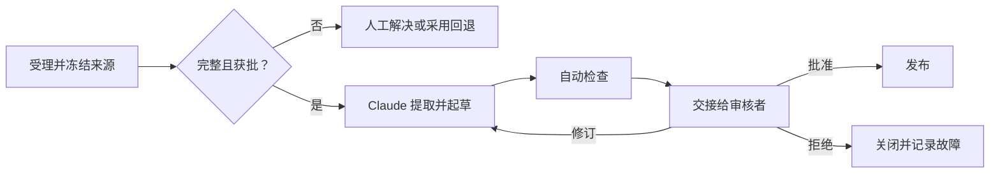

# 先设计交接，再设计自动化（Design the Handoff Before the Automation）

> Claude 完成并不代表工作流完成。只有接手者能够验证、决策、行动和恢复，工作流才算完整。

**Type:** Learn
**Languages:** Python
**Prerequisites:** [验证主张，而不是相信自信语气（Validate the Claim, Not the Confidence）](../../05-output-evaluation-and-validation/), [用授权约束能力（Put Authority Around Capability）](../../06-governance-safety-and-responsible-use/), [Anthropic 工作流模式（Anthropic Workflow Patterns）](../../../../../phases/14-agent-engineering/12-anthropic-workflow-patterns/)
**Time:** ~105 分钟

## 学习目标（Learning Objectives）

- 选择 Claude 参与位置前，先梳理当前工作流。
- 判断一个步骤应采用辅助、自动化、重新设计还是拒绝。
- 规定步骤输入、输出、负责人、门槛、回退和服务预期。
- 构建保留证据、不确定性和权限的人工交接包（Handoff packet）。
- 衡量工作流价值，不忽略审核、失败和维护成本。

## 问题背景（The Problem）

产品团队自动化每周发布简报。Claude 阅读问题摘要、起草简报，并在每周五发布到共享频道。

前两份简报节省时间，第三份却包含已从范围中移除的功能，第四份遗漏未解决的安全隐患。原来整理简报的工程师以为现在由产品经理负责审核，产品经理则以为自动发布内容已经获批。

团队自动化了文字生产，却删除了责任模型。没有来源截止点、批准门槛、升级路径，也没有数据不完整时的回退。

成功工作流不是模型调用链，而是责任链，其中有明确证据和可恢复状态。

## 核心概念（The Concept）

### 先梳理当前状态（Map the current state first）

加入 Claude 前，观察工作实际怎样流转：

- 什么事件触发它？
- 谁提供每项输入？
- 哪些系统是权威记录来源？
- 人员在哪里作出判断？
- 哪些例外最耗时？
- 谁批准结果？
- 后续有什么下游操作？
- 如何检测并恢复故障？

不要只记录理想流程，应跟踪几个真实案例。非正式检查常承载关键知识。如果移除时没有将其明确编码或分配责任，新工作流看似高效，质量却会下降。

### 选择干预方式，而不只是工具（Choose the intervention, not just the tool）

每个步骤在四种干预中选择：

1. **辅助（Assist）：** Claude 提议、总结、提取或起草，人员仍是操作者。
2. **自动化（Automate）：** 系统按政策执行边界明确、充分测试且可逆的步骤。
3. **重新设计（Redesign）：** 当前步骤是差输入或重复系统造成的浪费，应移除或重构。
4. **拒绝（Reject）：** 数据、后果、模糊性或政策使风险不可接受，因此不应使用 Claude。

自动化不总是最高成熟度。如果分析师花数小时核对两张冲突表格，更快生成核对说明并不能解决来源冲突。

### 将每步规定为契约（Specify every step as a contract）

每步都应包含：

```text
触发条件：
负责人：
允许输入与来源：
转换操作：
输出模式：
通过标准：
超时或服务预期：
升级处理条件：
回退方案：
下一负责人：
```

契约让步骤可以独立测试，防止责任在系统间消失。

发布简报的提取步骤可以是：

```text
触发条件：周四 15:00 冻结来源
负责人：发布协调员
输入：获批跟踪器视图和签署的安全状态
输出：包含来源 ID 和状态的结构化候选条目
通过：覆盖全部必需团队；标注未解决字段
升级：缺少安全状态或上线状态冲突
回退：协调员使用手动模板
下一负责人：产品经理验证纳入决策
```

### 根据后果与可逆性设置控制（Use consequence and reversibility to place control）

两个问题决定自动化深度：

1. 结果错误会造成多严重的后果？
2. 能否在损害发生前以低成本撤销操作？

| 后果（Consequence） | 可逆（Reversible） | 设计方向（Design direction） |
|---|---|---|
| 低 | 是 | 可采用有监控的有界自动化 |
| 高 | 是 | 生成或暂存，发布前要求审核 |
| 低 | 否 | 增加确认、审计并缩小范围 |
| 高 | 否 | 保留获授权人工决策门槛和有力回退 |

保存待审草稿与向数千客户发送消息不同。把操作权限视为独立能力。

### 选择符合依赖关系的工作流模式（Choose a workflow pattern that matches dependencies）

Claude 工作流常使用少数几种模式：

- **提示词链（Prompt chaining）：** 固定顺序，每阶段均可检查。
- **路由（Routing）：** 分类工作并发送到专门路径。
- **并行化（Parallelization）：** 独立分析并行运行，再核对结果。
- **编排器与工作者（Orchestrator-workers）：** 协调者将可变工作拆成子任务并综合结果。
- **评估器与优化器（Evaluator-optimizer）：** 生成、按标准审核、修订，直到通过门槛或达到上限。

优先选择能表达工作的最简单模式。固定五阶段报告不需要开放式智能体（Agent）。路由工作流需要可观察路由信号，以及模糊案例的回退。



### 交接本身也是产品（Handoffs are products）

交接应减少重复调查。给下一负责人提供：

- 所需决策和截止时间。
- 工作流范围与版本。
- 来源 ID 和时效状态。
- 候选输出。
- 通过与失败的检查。
- 已知不确定性和冲突。
- 已执行操作。
- 选项：批准、修订、拒绝、升级。
- 回退与恢复说明。

不要把关键限制埋在长对话末尾，应围绕决策组织交接。

接收者必须知道哪些仍由自己负责。“请审核”不完整；“请确认 R-14 和 R-19 获准对外发布，其他检查均已通过”才可执行。

### 故障中保留状态（Preserve state across failures）

长工作流会失败：API 超时、连接器返回部分数据、审核者错过截止时间，输入在生成后变化。

在有意义的边界设置检查点（Checkpoint）：

- 来源快照已接受。
- 提取已验证。
- 草稿版本已生成。
- 审核问题已记录。
- 批准已记录。
- 外部操作已完成。

尽可能让重试具有幂等性（Idempotency）。重试草稿生成通常安全，但没有幂等键就重试发送或财务操作，可能重复造成损害。

上线前定义手动回退。当前员工没人能执行的回退，只是虚构的韧性。

### 衡量工作流，不是演示（Measure the workflow, not the demo）

同时跟踪价值和风险：

```text
net value = time saved
          - human review time
          - correction and incident cost
          - platform and model cost
          - maintenance cost
```

有用运维指标包括：

- 端到端完成时间。
- 排队与审核时间。
- 首次验收通过率。
- 高严重度错误放行率。
- 升级与回退率。
- 每案例返工量。
- 每合格结果成本。
- 来源时效故障。
- 用户纠正与申诉结果。

如果审核更难，生成更快也未必缩短端到端时间。

### 按利益相关者沟通限制（Communicate limits by stakeholder）

高管需要预期价值、风险边界和就绪证据。操作者需要确切输入、故障信号和回退步骤。审核者需要标准和权限。安全与政策负责人需要数据流、权限、保留和事故控制。

不要把能力演示说成生产证据。说明测试了什么、覆盖哪些案例、什么仍由人负责，以及哪些当前产品事实需要重新验证。

## 动手实现（Build It）

### 第 1 步：梳理一个真实案例（Step 1: Map one real case）

画出包含角色和系统的当前流程，标出：

- 等待时间。
- 返工循环。
- 判断点。
- 权威记录来源查询。
- 外部操作。
- 已知例外。

问操作者：哪项非正式检查防止了最严重的错误？

### 第 2 步：为候选干预评分（Step 2: Score candidate interventions）

为每步按 1 至 5 评分：

| 因素（Factor） | 问题（Question） |
|---|---|
| 重复性（Repetition） | 相同转换是否反复发生？ |
| 清晰度（Clarity） | 能否写出通过标准？ |
| 数据批准（Data approval） | 输入是否获批且受控？ |
| 可逆性（Reversibility） | 错误操作能否停止或撤销？ |
| 可检测性（Detectability） | 故障能否在损害前可见？ |

低分意味着更适合辅助、重设计或拒绝，而不是自动化。

### 第 3 步：编写目标状态契约（Step 3: Write the future-state contract）

定义每步、负责人、门槛、检查点、回退和服务预期，明确手动路径。然后请操作者、审核者和政策负责人一起走查正常与例外案例。

### 第 4 步：建立交接包（Step 4: Build the handoff packet）

使用稳定模板：

```text
所需决策：
截止时间与负责人：
工作流与来源版本：
候选结果：
证据：
已通过检查：
失败检查：
不确定性：
可用操作：
回退：
```

缺少必需阻塞项或来源版本的资料包应拒绝。

### 第 5 步：以影子模式试点（Step 5: Pilot in shadow mode）

让 Claude 与既有流程并行运行，不允许它执行外部操作。比较结果与审核投入，包含例外而非只选简单案例。只有门槛通过、事故负责人准备就绪后，才进入有限发布。

## 交互实验（Interactive Lab）

使用审核阈值图调整后果、可逆性、模糊程度和证据完整性。控制应在到达不可逆状态之前，从有界自动化转为强制审核。

```figure
07-human-review-threshold
```

## 实践实验（Practice Lab）

运行交接评分器，删除发布步骤的负责人、检查点、回退或批准，观察契约失败。然后清除未解决审核检查，比较建议的下一步。

## 交付物（Shipped Artifact）

`outputs/workflow-handoff-packet.json` 是填写完整的发布简报工作流，包含步骤负责人、门槛、检查点、回退、服务预期，以及可执行的审核者资料包。

## 验证结果（Verify It）

在本地验证工作流：

```bash
cd certifications/claude/lessons/07-workflow-design-and-human-handoffs/code
python3 main.py
python3 -m unittest discover tests -v
```

校验器检查每步是否有负责人、门槛、升级、回退和下一负责人，不可逆发布是否有人批准，以及交接是否列出失败检查与可用决策。

## 与综合实践的联系（Capstone Connection）

测验考查现状梳理、重设计、交接内容、重试安全、责任归属和影子模式就绪情况。将验证后的包作为 Associate 第 29 课综合实践的运维与审核交接提交。

## 实际应用（Use It）

### 考试决策模式（Exam decision pattern）

工作流场景中：

1. 梳理当前决策、证据、角色和例外路径。
2. 自动化前先移除流程浪费。
3. 选择符合依赖的最简单模式。
4. 在重大后果或不可逆边界保留人工权限。
5. 发送包含证据和失败检查的结构化交接。
6. 上线前定义检查点、回退、监控和责任归属。

### 常见陷阱（Common traps）

- **自动化文章，却删掉负责人（Automate the prose, delete the owner）：** 没人知道谁批准。
- **演示等于部署证明（Demo as deployment proof）：** 正常示例隐藏例外和运维问题。
- **固定流程使用开放式智能体（Open-ended agent for a fixed process）：** 复杂度增加，却没有价值。
- **并行化有依赖的工作（Parallelize dependent work）：** 证据未验证，综合分析已开始。
- **把人在回路当口号（Human in the loop as a slogan）：** 没有审核包或拒绝权限。
- **没有来源截止点（No source cutoff）：** 输出审批时输入仍变化。
- **什么都重试（Retry everything）：** 不可逆操作可能执行两次。
- **只看节省时间（Time saved as the only metric）：** 审核、修正、失败和维护消失不见。

### 练习（Exercises）

1. 梳理周期性工作流，找出一项非正式质量检查。
2. 将每步分类为辅助、自动化、重设计或拒绝。
3. 为价值最高的候选步骤编写契约。
4. 为只有五分钟的审核者设计交接包。
5. 桌面推演故障：来源在批准后、发布前变化。
6. 定义五项指标，揭示工作流是否创造净价值。

## 关键术语（Key Terms）

- **现状图（Current-state map）：** 表示当前工作实际流转方式。
- **步骤契约（Step contract）：** 工作流步骤的触发、负责人、输入、转换、输出、门槛、升级、回退和下一负责人。
- **交接包（Handoff packet）：** 为下一责任人准备的结构化状态与证据。
- **检查点（Checkpoint）：** 验证阶段后的持久恢复点。
- **幂等性（Idempotency）：** 重复操作不重复产生效果的属性。
- **影子模式（Shadow mode）：** 运行新工作流，但不允许它控制真实结果。
- **回退（Fallback）：** 自动路径不安全或不可用时使用的已测试替代路径。
- **来源截止点（Source cutoff）：** 固定输出所代表输入的版本边界。

## 延伸阅读（Further Reading）

- [Anthropic：构建有效智能体](https://www.anthropic.com/research/building-effective-agents)
- [Anthropic：定义成功标准并构建评估](https://platform.claude.com/docs/en/test-and-evaluate/develop-tests)
- [AI Engineering from Scratch：范围契约](../../../../../phases/14-agent-engineering/36-scope-contracts/)
- [AI Engineering from Scratch：验证门槛](../../../../../phases/14-agent-engineering/38-verification-gates/)
- [AI Engineering from Scratch：多会话交接](../../../../../phases/14-agent-engineering/40-multi-session-handoff/)
- [AI Engineering from Scratch：先提议再提交](../../../../../phases/15-autonomous-systems/15-propose-then-commit/)

Claude 产品功能、连接器行为、模型能力、限制和成本会变化。这些来源核查于 2026-08-08。将工作流从影子模式转入生产前，应重新核实最新官方文档与组织控制。
