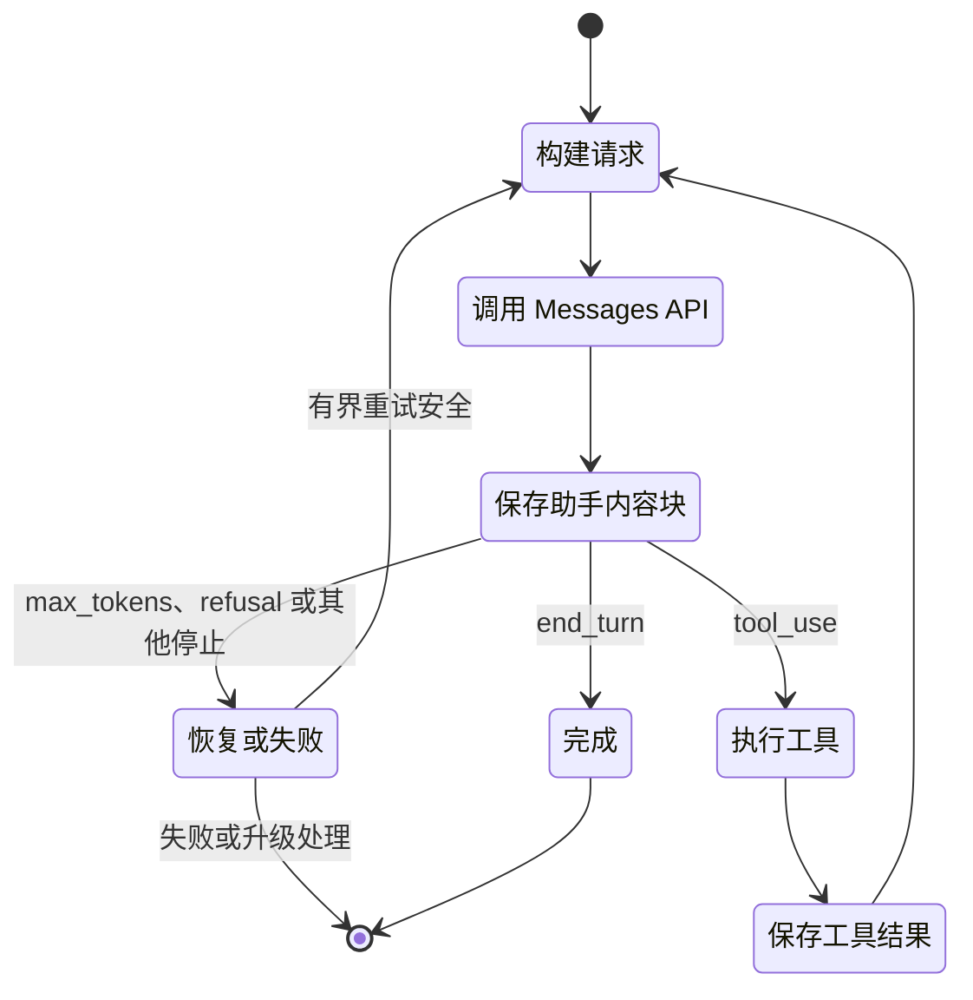

# Messages API 是状态机（The Messages API Is a State Machine）

> API 不会记住对话，负责记忆的是应用。一个内容块放错位置，就可能破坏整个循环。

**Type:** Build
**Languages:** Python
**Prerequisites:** [将能力投入到失败代价高的地方（Spend Capability Where Failure Is Expensive）](../../02-model-selection-and-token-economics/), [将请求转化为可测试的契约（Turn a Request Into a Testable Contract）](../../03-prompting-and-task-decomposition/), [将每项事实放入合适的上下文（Put Each Fact in the Right Kind of Context）](../../04-context-knowledge-memory-and-caching/)
**Time:** ~120 分钟

## 学习目标（Learning Objectives）

- 将 Claude 请求建模为明确的应用状态转换
- 将 SDK 或原始 REST 的选择，与同步、流式或批量交付的选择分开
- 构建具有明确资产边界的图像和文档内容块
- 保留类型化响应块，并根据 `stop_reason` 分支处理
- 落实会话、重试、超时、保留和上下文预算管理
- 不依赖真实 API 密钥，测试完整生命周期

## 用故障理解协议（The Failure That Teaches the Protocol）

工程师发送以下序列：

1. 用户询问：“订单 A-17 在哪里？”
2. Claude 返回 ID 为 `toolu_01` 的 `tool_use` 块。
3. 应用运行 `lookup_order`。
4. 应用在新请求中只发送工具结果。

第二个请求失败，或者 Claude 的反应像从未请求过工具。

没有神秘之处。Messages API 无状态，客户端没有重发包含原始 `tool_use` 块的助手消息。`tool_result` 不是独立事实，而是在代码管理的对话序列中，按 ID 回答某个具体工具请求。

框架替你维护数组，容易让人忽略这一点。认证要求你能深入便利层之下推理。亲手构建一次原始状态机（State machine），之后调试任何 SDK、智能体框架和托管运行时都会更容易。

## 一次请求，一次转换（One Request, One Transition）

请求提供模型、系统指令、消息、词元控制和可选能力。响应提供内容块、用量元数据和生成停止原因，由应用决定下一步。

```json
{
  "model": "<current-model-id>",
  "max_tokens": 800,
  "system": "Answer from verified order data only.",
  "messages": [
    {
      "role": "user",
      "content": "Where is order A-17?"
    }
  ]
}
```

确切模型标识符和可选请求字段会变化，应视为配置；平台允许时有意识地固定版本，并在最新[模型概览](https://platform.claude.com/docs/en/about-claude/models/overview)核实。长期契约是客户端提交上下文并接收类型化响应。



这张图比背 SDK 方法更有用。每条箭头都是应用责任，可以记录、测试、重试或拒绝。

## 独立选择两种访问模式（Choose Two Independent Access Patterns）

客户端库和完成模式回答不同问题，应独立选择。

| 客户端（Client） | 适用条件（Prefer it when） | 仍由你负责（You still own） |
|---|---|---|
| 官方 SDK | 支持所用语言，且需要类型化请求响应模型、类型化错误、请求头管理、默认重试、分页和流累积助手 | 应用状态、`stop_reason` 政策、重试安全、工具授权、日志和最终验证 |
| 原始 REST | 运行时无受支持 SDK、受限环境禁止依赖，或需要自定义 HTTP 传输及协议级夹具 | 身份验证和版本头、JSON 类型、SSE 帧处理、超时、重试、错误映射、前向兼容和连接清理 |

对受支持的生产语言，SDK 是更安全的默认选择，因为它减少协议基础工作，不是因为它负责应用生命周期。只有额外控制值得额外测试负担时，原始 REST 才合适。[Python SDK 指南](https://platform.claude.com/docs/en/cli-sdks-libraries/sdks/python)说明同步与异步客户端、类型化模型、流助手、默认重试及原始响应访问。[API 概览](https://platform.claude.com/docs/en/api/overview)是直接 HTTP 契约。

再选择一个或多个结果如何到达：

| 完成模式（Completion pattern） | 最适合（Best fit） | 完成证据（Completion evidence） | 不适合（Poor fit） |
|---|---|---|---|
| 同步 Message | 继续前需要完整响应的单次交互请求 | 解析后的一个 `Message`，且已处理 `stop_reason` | 渐进显示或大型离线队列 |
| 流式 Message | 部分显示或首词元时间重要的交互或长响应 | 累积内容、终止 `message_stop` 和最终消息元数据 | 根据部分增量执行不可逆操作 |
| Message Batch | 可稍后完成的大量独立请求 | 异步处理后按稳定 `custom_id` 核对逐项结果 | 对话工具循环或逐词元反馈 |

异步 SDK 客户端不是 Message Batches。它让进程并发等待普通 HTTP 工作；Message Batch 则是服务端异步负载，保存输入和结果，包含逐项状态并在之后核对。当前[批处理指南](https://platform.claude.com/docs/en/build-with-claude/batch-processing)还指出结果不按提交顺序排列，因此身份依靠 `custom_id`。

## 内容是类型化块序列（Content Is a Sequence of Typed Blocks）

不要将响应简化为 `response.content[0].text`。Claude 可在一条消息中返回多个块：

- `text` 包含面向用户或中间步骤的语言。
- `tool_use` 指定工具、提供结构化输入，并携带唯一请求 ID。
- `thinking` 在功能启用时携带扩展推理数据。
- 提供商功能可能随时间引入其他块类型。

防御性代码按 `type` 分支，明确处理支持的块，记录未知块，不默默当成文本。版本变化时尤其重要。假设所有块都有 `text` 属性的解析器，会把有效工具请求变成空答案。

工具往返有严格顺序：

```json
[
  {
    "role": "user",
    "content": "Where is order A-17?"
  },
  {
    "role": "assistant",
    "content": [
      {
        "type": "tool_use",
        "id": "toolu_01",
        "name": "lookup_order",
        "input": {"id": "A-17"}
      }
    ]
  },
  {
    "role": "user",
    "content": [
      {
        "type": "tool_result",
        "tool_use_id": "toolu_01",
        "content": "{\"status\":\"ready\"}"
      }
    ]
  }
]
```

助手请求在先，用户角色结果在后，`tool_use_id` 与原始 ID 完全匹配。多个工具调用同时到达时，为每个返回结果并保留关联。

## 停止原因是控制信号（Stop Reasons Are Control Signals）

文本可能说“我现在去检查”，响应却实际因工具请求停止；文字也可能看似完整，生成却因词元上限停止。应按协议信号分支。

| 信号（Signal） | 应用解释（Application interpretation） | 安全响应（Safe response） |
|---|---|---|
| `end_turn` | Claude 完成本轮 | 验证并展示答案 |
| `tool_use` | 请求一个或多个客户端工具 | 验证、授权、执行、追加结果并继续 |
| `max_tokens` | 配置的输出预算终止生成 | 视为可能不完整；有计划才重试 |
| `stop_sequence` | 配置的序列终止生成 | 确认边界符合契约 |
| `pause_turn` | 服务端操作可能需要续接 | 遵循当前功能专属续接契约 |
| `refusal` | 模型拒绝请求 | 保留拒绝，采用获批回退或升级 |
| `model_context_window_exceeded` | 生成填满上下文窗口 | 视为截断，重设计上下文预算 |

产品说明，核实于 2026-08-08：支持的停止原因和续接要求会变化。当前权威来源是[处理停止原因](https://platform.claude.com/docs/en/build-with-claude/handling-stop-reasons)。代码遇未知值应拒绝继续，并捕获足够诊断元数据。

绝不要写 `while stop_reason != "end_turn"`，那会把每个陌生状态变成新请求，导致失控循环。应使用穷尽分支，并设置最大轮数、总时限和每工具预算。

## 客户端负责对话状态（The Client Owns Conversation State）

Messages API 服务不保留隐藏对话对象，每次调用只接收你选择发送的上下文。这给你控制权，也使会话管理成为你的责任。

维护以下边界：

1. **用户隔离（User isolation）。** 不得把一个租户的消息数组给另一个租户复用。
2. **系统分离（System separation）。** 将可信指令放在不可信文档内容之外。
3. **规范存储（Canonical storage）。** 持久化类型化块，而不是无法重建工具 ID 的扁平对话记录。
4. **上下文预算（Context budgeting）。** 测量输入增长，在上限前压缩，同时保留事实和未完成义务。
5. **保留政策（Retention policy）。** 只保存产品所需内容，记录日志前脱敏秘密和敏感字段。
6. **幂等性（Idempotency）。** 没有稳定操作键时，网络重试不得重复付款、邮件或部署。

总结长会话时，保留活动工具请求、用户约束、已验证事实、未解决问题、批准状态和来源引用。漏掉“不要发送”的流畅摘要在操作层面就是错误。

## 多模态请求是类型化资产传输（Multimodal Requests Are Typed Asset Transfers）

文本、图像和文档放在一个有序内容数组中。资产前先说明任务，使用匹配媒体的块类型，并明确来源。

```json
{
  "model": "<current-model-id>",
  "max_tokens": 400,
  "messages": [
    {
      "role": "user",
      "content": [
        {
          "type": "text",
          "text": "Compare the chart with the approved policy document."
        },
        {
          "type": "image",
          "source": {
            "type": "base64",
            "media_type": "image/png",
            "data": "<base64-image-bytes>"
          }
        },
        {
          "type": "document",
          "source": {
            "type": "file",
            "file_id": "<application-owned-file-id>"
          }
        }
      ]
    }
  ]
}
```

图像可使用 `base64`、`url` 或 Files API `file` 来源。PDF 可在 `document` 块内使用 URL、base64 或 Files API 来源。块顺序也是提示词的一部分：指令和信任背景应靠近其约束的资产。在[视觉](https://platform.claude.com/docs/en/build-with-claude/vision)和[PDF 支持](https://platform.claude.com/docs/en/build-with-claude/pdf-support)中核实当前媒体与模型限制。

Files API 改变的是复用和保留，不是内容块含义。上传一次，获得不透明 `file_id`，后续 Messages 请求引用它而不重发字节，适合反复使用的政策 PDF 或图像。

产品说明，核实于 2026-08-09：[Files API](https://platform.claude.com/docs/en/build-with-claude/files) 处于 beta，当前 Message 引用文件时使用 `files-api-2025-04-14` beta 请求头。文件在工作区范围内可用，上传后不可变，直到删除前持续保存。工作区任意 API 密钥均可引用。请求头、平台可用性、限制和下载规则都易变，实施前查阅指南。

| 来源（Source） | 跨边界数据（Data crossing the boundary） | 复用与保留责任（Reuse and retention responsibility） |
|---|---|---|
| 行内 base64 | 每次请求传输编码字节 | 不记录载荷；明确请求保留和大小限制 |
| URL | 提供商从远程源站获取资产 | 授权源站，避免含秘密 URL，考虑源站日志与可用性 |
| Files API `file_id` | 标识符引用 API 工作区保存的字节 | 允许列表限定应用所有的 ID，记录负责人和用途，隔离工作区，保留期结束时删除 |

`file_id` 不能证明当前租户有权使用。应绑定包含租户、工作区、媒体类型、敏感度、内容哈希、上传时间和删除期限的应用记录。不要接受任意模型或用户提供的 ID 就直接转发。普通追踪中不要记录原始图像字节、PDF 文本、签名 URL 或不透明文件 ID，应改记内容哈希和政策决策。

## 流式传输改变交付，不改变含义（Streaming Changes Delivery, Not Meaning）

流式传输让用户在完整消息到达前看到输出，但仍须组装并验证最终响应。

典型事件处理如下：

```python
text_parts = []

for event in stream:
    if event.type == "content_block_delta" and event.delta.type == "text_delta":
        text_parts.append(event.delta.text)
    elif event.type == "message_delta":
        final_stop_reason = event.delta.stop_reason
    elif event.type == "message_stop":
        complete = True
```

体验需要时可以显示临时文本，但不要根据部分流触发不可逆工作。工具输入也可能增量到达，先缓存至块完成，再一次解析、验证并授权。

连接中断会带来歧义。跟踪是否收到完整终止事件，否则将尝试标为不完整。安全时可重试只读请求；修改操作再次执行前，检查幂等记录。

当前事件类型和 SDK 助手见[流式 Messages](https://platform.claude.com/docs/en/build-with-claude/streaming)。

## 批处理、缓存和思考解决不同问题（Batch, Cache, and Thinking Solve Different Problems）

这些功能都改变成本或延迟，因而常被混淆，但用途不同。

**Message Batches** 异步处理大量独立请求，以即时响应延迟换取吞吐量和批量成本优势。适合离线分类、提取、评估或迁移，不适合立即需要下一答案的交互工具循环。按自定义 ID 跟踪每个请求，处理部分批次失败。参见[批处理](https://platform.claude.com/docs/en/build-with-claude/batch-processing)。

**提示词缓存（Prompt caching）**复用稳定前缀。将持久系统指令、工具定义和共享参考材料放在易变用户内容之前。缓存前缀内改一个字节都可能使下游复用失效。命中改善首词元时间和输入成本，但不扩大窗口，也不使过时事实正确。参见[提示词缓存](https://platform.claude.com/docs/en/build-with-claude/prompt-caching)。

**扩展思考（Extended thinking）**为受益任务分配推理工作，消耗预算、改变响应块，并有跨工具轮次保留思考块的专属规则。不得编辑或伪造带签名的思考内容，也不要习惯性为简单提取启用它。用评估集比较质量、延迟和成本。参见[扩展思考](https://platform.claude.com/docs/en/build-with-claude/extended-thinking)。

考试推理很简单：从工作负载选择机制。离线独立任务适合批处理，重复稳定前缀适合缓存，有实测质量收益的困难推理适合思考，快速交付词元适合流式传输。

## 离线构建生命周期与资产边界（Build the Lifecycle and Asset Boundary Offline）

`code/main.py` 中可运行模拟器使用脚本化提供商响应，让隐藏的客户端工作可见：

- 保存每个助手内容块。
- 执行请求工具。
- 返回匹配的 `tool_result` 块。
- 重发完整状态。
- 拒绝未知停止原因。
- 停止失控循环。
- 仅在 `message_stop` 后收集模拟流。
- 将 SDK 或 REST 的选择与同步、流式或批量分开。
- 构建并验证图像和可复用文件内容块。
- 拒绝应用所有权允许列表之外的文件 ID。
- 生成不含资产字节或文件 ID 的哈希边界台账。

运行：

```bash
cd certifications/claude/lessons/08-messages-api-and-application-lifecycle/code
python3 main.py
python3 -m unittest discover tests -v
```

本课代码不导入 SDK、不读凭据、不上传文件、不获取 URL，也不调用模型。`multimodal_lab_fixture()` 使用单像素合成图像和离线占位文件 ID。私人实验中可用真实 SDK 调用替换 `ScriptedTransport.create()`，仅在认证上传后替换占位符。状态机、允许列表和台账保持不变。

## 交互实验（Interactive Lab）

使用生命周期图逐步查看用户输入、助手内容块、工具执行、关联结果和终止原因。破坏顺序，观察哪个转换无效。

```figure
08-messages-lifecycle
```

## 实践实验（Practice Lab）

运行脚本化生命周期，然后删除助手 `tool_use` 消息、改变关联 ID，或让流在没有 `message_stop` 时结束。再把可复用文件 ID 改为所有权允许列表外的值、破坏图像 base64，或同时要求访问选择器提供批处理和渐进词元。每项故障都应映射到具名协议或数据边界错误，而不是提示词重试。

## 交付物（Shipped Artifact）

`outputs/messages-lifecycle-transcript.json` 保持为完整、无需提供商的工具往返。`outputs/multimodal-request-fixture.json` 增加四个访问决策、一个混合图像文档请求、应用所有的文件允许列表，以及脱敏资产边界台账。运行 `python3 main.py` 会打印两份夹具。单元测试无网络验证每份已签入交付物。

## 验证结果（Verify It）

```bash
cd certifications/claude/lessons/08-messages-api-and-application-lifecycle/code
python3 main.py
python3 -m unittest discover tests -v
```

## 与综合实践的联系（Capstone Connection）

测验在陌生场景中检查相同协议决策。将验证后的对话记录作为 Developer 第 30 课与 Architect 第 31、32 课综合实践的生命周期证据。

## 超越单轮的应用生命周期（Application Lifecycle Beyond One Turn）

生产 Claude 应用不只有“请求”和“响应”状态。


模型错误只是一类故障，还包括传输超时、速率限制、应用状态畸形、模式不匹配、授权拒绝、工具失败、过时缓存、用户取消和部署回归。分别标记它们。能帮助超时的重试，可能让授权失败更糟。

每条追踪都记录系统指令、模型选择、工具目录、输出模式和应用代码版本。没有这些标识符，就无法复现回归或公平比较评估运行。

## 考试决策规则（Exam Decision Rules）

- 场景丢失早期消息时，先怀疑客户端状态，再怀疑模型记忆。
- 工具结果被拒绝时，检查角色顺序和匹配的工具使用 ID。
- 输出看似截断时，改提示词前先看 `stop_reason` 和用量。
- 用户需要即时渐进显示时，选流式而非批量。
- 数千独立任务可以稍后完成时，选 Message Batches。
- 受支持 SDK 满足传输需求时，优先其类型化模型和助手；生命周期政策仍在应用代码中。
- 受限运行时需要原始 REST 时，为请求头、错误、SSE、重试和未知字段安排明确测试。
- 资产重复时，比较行内传输与 Files API 复用，并明确删除政策。
- `file_id` 未绑定认证租户和工作区时，在请求前拒绝。
- 长共享前缀重复时，评估提示词缓存。
- 重试可能重复副作用时，先要求幂等性或核对。
- 出现新停止原因时，拒绝继续并按最新文档更新。

## 练习（Exercises）

1. 添加包含两个 `tool_use` 块的脚本化响应，断言两份结果以正确 ID 出现在随后同一用户消息中。
2. 明确处理 `max_tokens`，返回类型化不完整结果，而不是把部分文本显示为最终答案。
3. 模拟在 `message_stop` 前断开的流，记录不完整尝试，证明不会执行不可逆操作。
4. 在追踪中添加租户和提示词版本元数据，不保存原始用户消息。
5. 为多模态夹具增加 URL 图像，不调用网络，记录其源站、授权、保留和故障边界。

## 延伸阅读（Further Reading）

- [Messages API 参考](https://platform.claude.com/docs/en/api/messages)
- [Messages 示例](https://platform.claude.com/docs/en/api/messages-examples)
- [Python SDK](https://platform.claude.com/docs/en/cli-sdks-libraries/sdks/python)
- [视觉（Vision）](https://platform.claude.com/docs/en/build-with-claude/vision)
- [PDF 支持](https://platform.claude.com/docs/en/build-with-claude/pdf-support)
- [Files API](https://platform.claude.com/docs/en/build-with-claude/files)
- [处理停止原因](https://platform.claude.com/docs/en/build-with-claude/handling-stop-reasons)
- [流式 Messages](https://platform.claude.com/docs/en/build-with-claude/streaming)
- [批处理](https://platform.claude.com/docs/en/build-with-claude/batch-processing)
- [提示词缓存](https://platform.claude.com/docs/en/build-with-claude/prompt-caching)
- [扩展思考](https://platform.claude.com/docs/en/build-with-claude/extended-thinking)
