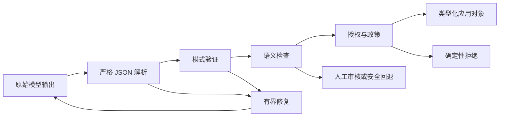

# 结构化输出是不可信契约（Structured Output Is an Untrusted Contract）

> 有效 JSON 不等于有效业务决策。先解析字节、验证结构、核实含义，再允许操作。

**Type:** Build
**Languages:** Python
**Prerequisites:** [验证主张，而不是相信自信语气（Validate the Claim, Not the Confidence）](../../05-output-evaluation-and-validation/), [Messages API 是状态机（The Messages API Is a State Machine）](../../08-messages-api-and-application-lifecycle/)
**Time:** ~95 分钟

## 学习目标（Learning Objectives）

- 区分 JSON 语法、模式有效性、语义有效性和授权
- 设计范围狭窄的模式，让无效状态难以表达
- 不使用不安全清理或乐观类型转换来解析 Claude 输出
- 使用有界且证据充分的重试修复无效响应
- 演进输出契约，不静默破坏消费者
- 在对抗与流式边界测试结构化输出

## 本应失败的 JSON（The JSON That Should Have Failed）

支持应用要求优先级为 1 至 5，响应却是：

```json
{
  "category": "billing",
  "priority": 9,
  "summary": "Customer reports a duplicate charge",
  "needs_human": false
}
```

JSON 解析成功，对象有全部预期键。应用将其作为最高紧急优先级路由，跳过人工审核，并呼叫值班工程师。

模型没有违反 JSON，是应用未落实契约。

结构化输出有四道门槛：

1. **语法（Syntax）：** 是否恰好有一个可解析 JSON 值？
2. **结构（Shape）：** 是否符合类型、必需字段、枚举、边界和额外属性规则？
3. **语义（Semantics）：** 字段是否符合领域事实，彼此一致？
4. **权限（Authority）：** 请求的下游操作是否获准？

通过前一道门槛从不意味着通过后一道。



## 要求 JSON 不等于契约（Prompting for JSON Is Not a Contract）

“只返回 JSON”是一条指令，只会提高概率，不会让无效输出不可能发生，也不会防止模式漂移或验证业务含义。

当前模型和 API 支持结构化输出时，可提供 JSON Schema 让平台约束生成，减少语法和结构失败。但这仍不证明引用订单存在、退款获授权或类别正确。

产品说明，核实于 2026-08-09：结构化输出可用性、支持的模式关键字、与其他功能的不兼容情况和模型支持都会变化。交付前查阅[结构化输出](https://platform.claude.com/docs/en/build-with-claude/structured-outputs)。即使启用约束解码（Constrained decoding），也保留应用侧验证。

应用负责模式，应像 API 一样进行版本管理。

```json
{
  "$id": "support-triage-v1",
  "type": "object",
  "required": ["category", "priority", "summary", "needs_human"],
  "additionalProperties": false,
  "properties": {
    "category": {
      "type": "string",
      "enum": ["billing", "bug", "account", "other"]
    },
    "priority": {
      "type": "integer",
      "minimum": 1,
      "maximum": 5
    },
    "summary": {
      "type": "string",
      "minLength": 1,
      "maxLength": 240
    },
    "needs_human": {
      "type": "boolean"
    }
  }
}
```

这个模式的严格性有价值。消费者只期待四个字段；意外的 `debug_context` 字段可能把私人文本带入日志，整数边界阻止 `9`，枚举防止类别拼写不一致割裂分析统计。

## 从消费者决策设计模式（Design Schemas From Consumer Decisions）

不要先问“Claude 能生成什么”，先问“下一个确定性组件必须决定什么”。

消费者选队列，就给枚举；排序优先级，就给有界整数；不确定性改变路由，就明确表示，而不是期待它出现在文章里。

比较以下契约：

```json
{"answer": "Probably a billing issue. It seems urgent."}
```

```json
{
  "category": "billing",
  "priority": 4,
  "evidence_ids": ["invoice-483", "message-12"],
  "uncertainty": "medium",
  "needs_human": true
}
```

第二个对象使路由和验证成为可能。它仍可能错，但可以检查。

使用以下设计规则：

- 优先枚举，而非自由文本标签。
- 只有每个有效响应都能提供时，才将字段设为必需。
- 有意识地用 `null` 表示“已知不存在”，不要当通用逃生口。
- 消费者未明确支持扩展时，拒绝额外属性。
- 限制字符串和数组以控制成本与存储。
- 事实必须可追溯时，包含证据标识符。
- 将操作编码为提议，而非授权证明。
- 给模式稳定名称和版本。

避免用几十个可选字段的大模式表示互不相关的模式，应使用带标签联合（Tagged union）或独立端点契约。所有字段都可选时，无效状态会大量增加。

## 严格解析（Parse Strictly）

乐观清理会隐藏失败。考虑：

```python
raw = raw.replace("```json", "").replace("```", "")
payload = json.loads(raw)
```

看似友好，却在生成后改变契约。含评论、两个 JSON 对象或用户控制围栏文本的响应，可能被改造成模型从未以单一值返回过的内容。

优先严格解析：

```python
payload = json.loads(raw)
validate_against_schema(payload)
```

契约要求一个 JSON 对象时，拒绝 Markdown 围栏和尾部文章，记录失败类别，使修复尝试获得精确错误。

不要静默转换：

- `"4"` 不是整数。
- `1` 不是布尔值。
- `"false"` 不等于 false。
- 逗号分隔字符串不是数组。
- 缺失字段不等于安全默认值，除非模式声明默认值且应用有意识地应用。

Python 有个微妙情况：`bool` 是 `int` 子类。简单的 `isinstance(True, int)` 会在要求整数的位置接受布尔值，可运行校验器明确拒绝它。

## 结构之后验证含义（Validate Meaning After Shape）

模式能证明 `invoice_id` 是字符串，不能证明发票存在或属于认证用户。

语义检查使用可信应用数据：

```python
if payload["invoice_id"] not in invoices_for(authenticated_user):
    raise SemanticError("invoice is not visible to this user")

if payload["refund_amount"] > verified_charge_amount:
    raise SemanticError("refund exceeds verified charge")
```

跨字段规则同样重要。`uncertainty: high` 时，`needs_human: false` 可能无效；提议 `action: close_account` 可能需要批准令牌；引用 ID 必须解析到真正支持主张的来源。

模型可以帮助提出建议，由确定性代码核实身份、所有权、金额边界、权限和状态转换。

## 在预算内修复（Repair With a Budget）

无效输出不总要直接失败。任务低风险且修正不虚构缺失证据时，语法或模式错误可能可修复。

修复循环应包括：

1. 原始任务和不变的可信上下文。
2. 模式或精确契约摘要。
3. 带字段路径的机器生成验证错误。
4. 严格最大尝试次数。
5. 最终回退或升级处理。

```text
修复上一次输出。
返回一个 JSON 对象，不附周边文本。
验证错误：
- $.priority：应为 1 至 5 的整数
- $.needs_human：缺少必需字段
不得虚构来源中不存在的证据。
```

不要把原始异常转储、秘密、数据库记录或任意不可信字符串粘贴进更高信任指令区。验证反馈是数据，应分隔并与可信修复指令分开。

两次尝试通常能揭示是随机格式错误，还是更深契约不匹配。无限重试消耗预算，还可能放大注入载荷。统计尝试次数、词元、延迟和重复错误指纹。

来源缺乏必需证据时，修 JSON 是错误操作，应返回明确不完整状态或升级处理。

## 工具输入与最终输出是不同契约（Tool Inputs and Final Outputs Are Different Contracts）

Claude 工具使用也提供结构化输入，但服务不同边界。

- 工具输入模式帮助模型构造调用。
- 工具处理器仍须验证值并授权调用者。
- 来自远程服务的工具结果是不可信外部数据。
- 最终应用输出有自己的消费者模式。

不要将宽泛内部工具模式复用为公开响应契约。内部字段可能暴露实现细节或秘密，应将已验证工具结果映射为最小最终对象。

同样，不要因最终 JSON 包含 `"approved": true` 就执行操作。批准来自认证应用状态，而不是模型输出。

以工具使用作为结构化输出机制时，要掌握 CCAR-F 指南中的三种公开 `tool_choice` 决策：

| 选择（Choice） | 模型行为（Model behavior） | 适用条件（Use when） |
|---|---|---|
| `auto` | 可以调用工具或返回对话文本 | 两种路径都有效 |
| `any` | 必须调用给定工具之一 | 必需类型化工具结果，但多个模式都有效 |
| `{"type":"tool","name":"extract_metadata"}` | 必须选指定工具 | 后续工作前必须完成某项已知提取 |

最终机器可读响应，应优先选择支持所需模式和功能组合的当前原生结构化输出功能。工作流真正选择或调用工具时，才使用工具模式。两种情况下，语义检查与授权都仍是应用责任。

## Pydantic 是校验器实现，不是契约（Pydantic Is a Validator Implementation, Not the Contract）

公开 CCAR-F 指南将 Pydantic 与 JSON Schema 验证及验证重试循环并列。在 Python 中，Pydantic 模型能生成模式、按配置转换或拒绝输入，并表达跨字段验证，但不能让模型主张成真，也不赋予下游权限。

本仓库优先标准库，因此实验直接实现相关检查。生产应用已用 Pydantic 时，明确映射相同四道门槛：

```text
JSON 解析 -> Pydantic 结构验证 -> 领域验证 -> 授权
```

检查类型转换行为。静默把 `"4"` 转成 `4`，在某个外部边界可能合适，在另一个则不可接受。将有界、字段级错误送入修复；来源缺少必需证据时升级处理。

## 流式传输产生部分语法（Streaming Produces Partial Syntax）

通过流接收的 JSON 在相关内容块结束前都不完整。前缀 `{"category":"bill` 尚不能说无效，只是未完成。

缓存结构化块。除非使用专为增量 JSON 设计且理解其部分状态语义的解析器，不要每来一个字符就解析。某个必需字段恰好先出现，也不应触发下游操作。

块完成时：

1. 确认流到达有效终止事件。
2. 恰好解析一次。
3. 验证模式。
4. 验证语义与政策。
5. 原子提交下游状态转换。

流断开时丢弃或隔离部分对象。界面可以显示临时文本，但应用契约尚未完成。

## 模式演进就是 API 迁移（Schema Evolution Is an API Migration）

假设版本 1 返回整数 `priority`，版本 2 改为 `severity: "low" | "medium" | "high"`。先部署提示词会破坏旧消费者，先部署消费者可能拒绝旧输出。

使用以下策略之一：

- 增加契约版本字段，迁移期同时支持两者。
- 在狭窄、事先规划的兼容窗口部署宽容读取器。
- 切换前并行生成并比较结果。
- 在适配器边界将新输出转换为旧内部类型。

不要静默修改模式。在追踪中记录模式、提示词、模型和校验器版本。回归评估应覆盖新旧示例、边界值、遗漏字段、意外字段、恶意字符串和大输入。

## 构建校验器与修复循环（Build the Validator and Repair Loop）

`code/main.py` 无外部依赖实现实用的 JSON Schema 子集，验证对象、必需字段、额外属性、基本类型、枚举、数值边界、字符串边界、数组和嵌套路径，再将校验器包装为有界提取器。

运行：

```bash
cd certifications/claude/lessons/09-structured-output-and-defensive-parsing/code
python3 main.py
python3 -m unittest discover tests -v
```

首个脚本响应在需要整数的位置使用 `"high"`，第二个修复字段。测试证明 Markdown 围栏、缺失字段、布尔冒充整数、意外字段和重试耗尽都明确失败。

生产中优先使用应用技术栈支持的成熟校验器。手写子集是为了揭示库执行的检查，不是替代完整 JSON Schema 实现。

## 交互实验（Interactive Lab）

使用恢复图，让候选输出经过语法、模式、语义和授权门槛。将修复预算用于结构错误，再与必须升级的证据缺失失败比较。

```figure
09-structured-output-recovery
```

## 实践实验（Practice Lab）

运行有界提取器，提交带围栏 JSON、布尔整数、意外字段和两次无效尝试。指出每次故障属于语法、结构、含义还是授权。

## 交付物（Shipped Artifact）

`outputs/validated-triage.json` 是无需提供商的修复演示产出的完整契约。运行 `python3 main.py` 复现，再运行单元测试。一项测试将签入交付物与 `demo()` 比较，其余覆盖围栏、缺失字段、布尔整数、额外属性、有界修复和重试耗尽。

## 验证结果（Verify It）

```bash
cd certifications/claude/lessons/09-structured-output-and-defensive-parsing/code
python3 main.py
python3 -m unittest discover tests -v
```

## 与综合实践的联系（Capstone Connection）

测验检查各故障由哪道门槛负责。在 Developer 第 30 课和 Architect 第 31、32 课综合实践中使用已验证对象与修复证据。

## 考试决策规则（Exam Decision Rules）

- 可解析但违反范围或枚举时，选择模式验证，不是提示词清理。
- 符合模式但与可信记录冲突时，选择语义验证。
- 对象提议特权操作时，依据应用身份和政策授权。
- 格式偶发失败时，用精确反馈进行有界修复。
- 证据缺失时升级或返回明确不完整状态，不修造事实。
- 流不完整时，不要当契约已完成来解析或行动。
- 模式变化时，像公开 API 一样版本化并迁移。
- 有约束生成时，用它减少错误，但保留下游验证。

## 练习（Exercises）

1. 添加有界字符串数组 `evidence_ids`，测试有效列表、整数元素和超出所选上限的列表。
2. 添加跨字段规则：`uncertainty: high` 要求 `needs_human: true`。
3. 创建语义校验器，确认发票属于认证用户，不向模型暴露完整发票记录。
4. 添加 `contract_version`，实现版本 1 到版本 2 适配器。
5. 给校验器十个对抗字符串：围栏、重复对象、意外字段、转义控制文本、巨大摘要、布尔整数和嵌套注入语言。
6. 在单独生产沙箱中用 Pydantic 重建分流契约，比较严格与转换行为，不将 Pydantic 加为本课依赖。

## 延伸阅读（Further Reading）

- [结构化输出](https://platform.claude.com/docs/en/build-with-claude/structured-outputs)
- [Messages API 参考](https://platform.claude.com/docs/en/api/messages)
- [工具使用概览](https://platform.claude.com/docs/en/agents-and-tools/tool-use/overview)
- [提高输出一致性](https://platform.claude.com/docs/en/test-and-evaluate/strengthen-guardrails/increase-consistency)
- [JSON Schema 规范](https://json-schema.org/specification)
- [Claude Certified Architect Foundations 考试指南](https://everpath-course-content.s3-accelerate.amazonaws.com/instructor%2F6nizmqk8tpzpfjvt6qmmav7rh%2Fpublic%2F1783542750%2FClaude+Certified+Architect+%E2%80%93+Foundations+Exam+Guide.pdf)
