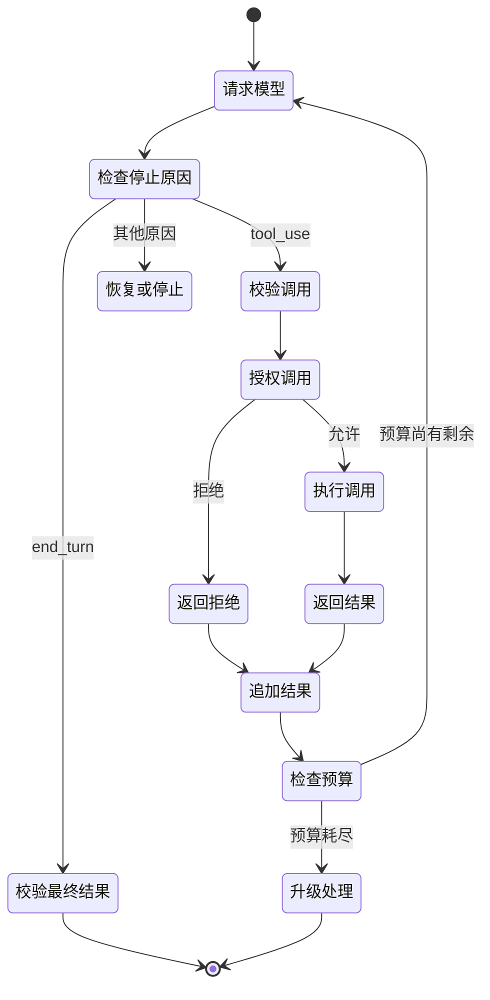

# 工具循环是受控委派（A Tool Loop Is Controlled Delegation）

> Claude 可以提议操作。应用验证请求、授予能力、观察结果，并决定循环是否继续。

**Type:** Build
**Languages:** Python
**Prerequisites:** [Messages API 是状态机（The Messages API Is a State Machine）](../../08-messages-api-and-application-lifecycle/), [结构化输出是不可信契约（Structured Output Is an Untrusted Contract）](../../09-structured-output-and-defensive-parsing/)
**Time:** ~130 分钟

## 学习目标（Learning Objectives）

- 实现完整的 `tool_use` 与 `tool_result` 协议循环
- 设计职责聚焦的工具契约并选择执行边界
- 将模型选工具与确定性授权分开
- 比较手写循环、SDK Tool Runner 和托管智能体
- 将失败作为类型化结果返回，消费需要处理的运行时事件
- 限定自主性，路径已知时选择固定工作流

## 重复付款的智能体（The Agent That Repeats a Payment）

账单助手收到“退还重复收费”。Claude 请求 `issue_refund`，应用执行了，但最终文本到达前连接断开。应用重试整轮，Claude 再次请求工具，客户收到两次退款。

问题不是模型用了工具，而是应用混淆语言生成与事务控制。

可靠工具循环有两项契约：

1. 模型可用结构化参数提议具名能力。
2. 确定性应用代码决定该能力是否执行、怎样执行、最多执行几次。

工具使用扩展 Claude 的触达范围，不赋予权限。

## 先理解通信契约，再使用框架（The Wire Contract Before the Framework）

客户端工具在请求中声明，每项声明给模型名称、描述和 JSON Schema 输入契约。

```json
{
  "name": "lookup_order",
  "description": "Look up one order by its exact public order ID. Returns status and last update. This tool never changes an order.",
  "input_schema": {
    "type": "object",
    "required": ["order_id"],
    "additionalProperties": false,
    "properties": {
      "order_id": {
        "type": "string",
        "description": "Order ID in the form A-12345"
      }
    }
  }
}
```

Claude 可能返回：

```json
{
  "stop_reason": "tool_use",
  "content": [
    {
      "type": "tool_use",
      "id": "toolu_7f3",
      "name": "lookup_order",
      "input": {"order_id": "A-12345"}
    }
  ]
}
```

客户端保留整个助手内容，验证并运行工具，再追加：

```json
{
  "role": "user",
  "content": [
    {
      "type": "tool_result",
      "tool_use_id": "toolu_7f3",
      "content": "{\"found\":true,\"status\":\"in_transit\"}"
    }
  ]
}
```

匹配 ID 不是装饰，它把结果与某次请求关联起来。在协议要求的对话历史中，助手消息必须紧邻结果序列之前。

当前 SDK 和 API 结构见[实现客户端工具](https://platform.claude.com/docs/en/agents-and-tools/tool-use/implement-tool-use)。

## 循环具有明确状态（The Loop Has Explicit States）



每次转换都可能失败：响应缺工具 ID、工具名未知、参数违反模式、授权拒绝、处理器超时、结果过大、Claude 又请求工具，最终答案也可能不符合输出契约。

不要用宽泛 `try/except` 和通用重试隐藏这些状态，应分类并按故障类别选择恢复。

## 工具设计就是接口设计（Tool Design Is Interface Design）

Claude 根据接口选工具，人也应无需阅读处理器就知道何时使用。

### 每个工具只做一件事（Give Each Tool One Job）

`manage_customer` 很模糊，可能搜索、编辑、退款、暂停或删除。狭窄目录更易选择和保护：

- `get_customer_profile`
- `list_customer_invoices`
- `propose_refund`
- `issue_approved_refund`

提议与执行的分离很重要。低风险工具可以计算建议金额，高风险工具要求在模型之外生成的认证批准令牌。

### 写选择说明，而不是内部文档（Write Selection Descriptions, Not Internal Documentation）

有用描述说明工具做什么、何时用、何时不用、结果意味着什么，不是粘贴整本 API 手册。

差的描述：

```text
调用 Commerce 服务中的 GET /v3/orders/{id}。
```

更好的描述：

```text
从商务系统读取一个既有订单的当前状态。
仅在用户提供确切订单 ID 时使用。本工具只读。
不得用于按邮箱搜索或修改发货详情。
```

描述中的示例可澄清复杂格式，但每个词元都会随工具目录重复。测量示例改善选择的收益是否值得上下文成本。

### 让无效调用难以表达（Make Invalid Calls Hard to Express）

使用枚举、必需字段、边界和 `additionalProperties: false`，拆分互斥模式。狭窄领域值够用时，避免自由形式 shell 命令、SQL、URL 和文件路径。

模式引导生成，处理器仍须验证。不要因模型输入根据模式生成，就认为它安全。

## 工具目录应小且区别明确（Keep the Tool Catalog Small and Distinct）

工具越多不一定能力越强。名称重叠和长目录制造选择歧义、消耗上下文。

从真实任务所需的最少工具开始。评估显示能力缺口时再加工具，轨迹显示混淆时移除或合并工具。

问这些问题：

- 两个工具的名称和描述是否看似可互换？
- 通用代码或 CLI 工具是否已能在沙箱下完成任务？
- 智能体是否每轮都需要该能力？
- 能否将能力放在 Skill 中，只在相关时加载？
- 是否应将工具交给独立子智能体，而非主智能体？
- 标准 MCP 服务器能否让多个宿主安全共享？

工具数量不是架构分数，正确选择和受控执行才是。

## 验证之后授权（Authorization Happens After Validation）

安全执行边界按此顺序：

1. 根据允许列表解析工具名。
2. 验证输入类型与边界。
3. 从应用而非参数绑定认证身份和租户上下文。
4. 检查能力范围和资源所有权。
5. 对重大操作要求批准。
6. 应用幂等、超时、速率和大小限制。
7. 在可用的最窄沙箱中执行。
8. 返回 Claude 或日志前脱敏结果。

工具参数含 `user_id` 时，不要信任其作为身份。与认证会话比较，或完全移出模型控制。

修改操作的批准记录应绑定用户、操作、规范化参数、有效期和操作 ID。对话中的“用户先前说同意”不是安全批准令牌。

## 将失败作为结果返回（Return Failures as Results）

处理器失败不自动等于应用崩溃。收到简洁真实工具结果时，Claude 可能恢复。

```json
{
  "type": "tool_result",
  "tool_use_id": "toolu_7f3",
  "is_error": true,
  "content": "Order service timed out. No order state was changed. Retry is allowed once."
}
```

好的错误内容告诉模型：

- 什么失败了。
- 是否发生副作用。
- 重试是否安全。
- 可以怎样修正。

不要暴露堆栈、环境值、数据库查询、访问令牌或内部主机名。将其保留在有脱敏和访问控制的受保护遥测中。

验证失败可包含字段路径。政策拒绝不应诱导模型找绕过方法。“该智能体不能退款”比列出每条安全规则更安全。

按设计，未知工具应成为关联错误结果或终止协议错误。绝不动态导入并运行模型指定名称的处理器。

## 多工具与并行调用（Multiple and Parallel Tool Calls）

Claude 可在一个响应中请求多个工具。仅当它们独立、只读且可安全重排时并行执行。

两个搜索常可并发。“创建发票”后“发送发票”有依赖，必须顺序；对同一记录的两次写入可能冲突；付款和邮件可能需要事务或补偿工作流。

每个请求的 `tool_use` ID 都返回一个 `tool_result`，保留足够顺序以重建轨迹。一个并行调用失败时，应逐项报告，不要假装整批成功。

产品说明，核实于 2026-08-08：自动工具执行和并行调用助手 API 因 SDK 而异，不免除应用授权责任。查阅当前[工具使用概览](https://platform.claude.com/docs/en/agents-and-tools/tool-use/overview)。

## 限定智能体（Bound the Agent）

除 `end_turn` 外，智能体循环还需要终止条件：

- 最大模型轮数。
- 全局和每工具最大调用次数。
- 总时限。
- 词元和金额预算。
- 最大连续错误数。
- 相同调用最大重复次数。
- 用户取消。
- 必需人工批准。
- 已验证最终状态谓词（Final-state predicate）。

最终状态谓词比回答听起来完整更强。部署智能体成功意味着预期版本健康，不是说了“已部署”；研究智能体成功意味着必需主张有可解析来源，不是写了长报告。

记录轨迹：提示词版本、模型、停止原因、工具名、规范化参数指纹、决策、延迟、结果类别和状态变化。脱敏敏感值。

## 工作流还是智能体（Workflow or Agent）

步骤和分支已知时用固定工作流。路径取决于观察、模型必须选择工具时用智能体。

| 任务（Task） | 更好的默认方案（Better default） | 理由（Reason） |
|---|---|---|
| 提取字段、验证、存储 | 工作流 | 顺序已知，契约清晰 |
| 分类后路由到一个队列 | 工作流 | 分支有限 |
| 调查陌生仓库缺陷 | 智能体 | 搜索路径取决于发现 |
| 验证重复收费后退款 | 带批准的工作流 | 操作重大，控制已知 |
| 跨变化的内部系统搜集证据 | 有界智能体 | 工具选择取决于缺失证据 |

任务有价值、环境可经工具访问、错误可检测且可恢复时，自主性才有依据。错误不可检测时，增加轮次只会隐藏风险。

## 选择承担多少循环责任（Choose How Much Loop to Own）

通过工作流选择门槛后，选择满足运维要求的最小运行框架（Harness）。

| 运行时（Runtime） | 负责内容（What it handles） | 应用仍负责（What your application still handles） | 适用条件（Prefer it when） |
|---|---|---|---|
| 手写 Messages 循环 | 仅你实现的协议工作 | 完整历史、停止原因、模式与政策、执行、重试、预算、追踪和恢复 | 需要通信级控制、受限运行时、自定义状态机，或协议教学测试 |
| SDK Tool Runner | 工具声明助手、`tool_use` 与 `tool_result` 顺序、消息状态更新和可选逐轮流式传输 | 授权、沙箱、幂等性、错误披露、迭代限制、可观测性和最终状态证明 | 受支持 SDK 合适，客户端工具仍由应用控制运行 |
| Claude Managed Agents | 带配置沙箱、内置工具和事件驱动执行的远程智能体、会话及环境框架 | 智能体配置、数据边界批准、自定义工具执行、确认决策、事件持久化、业务授权和结果验证 | 需要托管会话及沙箱边界，并接受当前 beta、平台和事件契约 |

本课代码有意采用第一种，暴露每个转换。迁移到 [Tool Runner](https://platform.claude.com/docs/en/agents-and-tools/tool-use/tool-runner) 可减少重复基础工作，却不能让退款自动安全。设置迭代上限、拦截或包装工具执行、保留应用批准，并验证最终状态。

产品说明，核实于 2026-08-09：[Claude Managed Agents](https://platform.claude.com/docs/en/managed-agents/overview) 当前为公开 beta，使用版本化 beta 契约，提供托管智能体、环境、会话、内置工具和服务端发送事件流。请求头、资源、事件类型、工具集、上限和提供商可用性都易变。不要只因任务叫智能体就选择它。

托管智能体集成是事件消费者，不是最终文本调用。应用发送用户事件、消费持久会话和智能体事件、跟踪状态。自定义工具或权限门控工具可通过 `requires_action` 暂停会话；应用按引用事件 ID 返回结果或确认决策。SSE 连接关闭不等于成功，应核对持久事件和终态。第 12 课以离线事件夹具实现此边界；当前来源为[会话事件流](https://platform.claude.com/docs/en/managed-agents/events-and-streaming)。

## 第一方不意味着同一执行边界（First-Party Does Not Mean One Execution Boundary）

按代码和数据在哪里执行、谁授权、如何发现来分类能力。

| 形态（Surface） | 执行与数据边界（Execution and data boundary） | 用途（Use it for） | 不要假设（Do not assume） |
|---|---|---|---|
| Messages 服务端工具 | Anthropic 执行网页搜索、抓取、代码执行、工具搜索等受支持工具 | 提供商侧执行和数据政策适配的第一方能力 | 通常情况下应用会收到客户端 `tool_use` 并自行执行 |
| Anthropic 模式客户端工具 | Anthropic 定义训练内置模式，应用执行 bash、文本编辑器、记忆或计算机使用等工具 | 标准模式改善模型熟悉度，但执行仍须归客户端的通用操作 | 第一方模式等于提供商执行或自动授权 |
| 托管智能体内置工具 | 配置的托管或自托管环境执行工具集 | 适合该运行时沙箱和权限政策的仓库与网页工作 | 启用工具集授予业务权限或免除确认 |
| 自定义客户端工具 | 应用验证并执行你的 JSON Schema 契约 | 私有业务操作、狭窄领域 API 和精确应用政策 | 模式有效输入就是身份、授权或幂等证据 |
| Skill | 受支持运行时加载可复用指令、参考、脚本或资产 | 只应在相关时披露的流程 | Skill 本身是执行或授权边界 |
| MCP | MCP 客户端或连接器调用标准外部服务器 | 在兼容宿主间共享能力或上下文，并明确服务器、身份和传输边界 | 发现服务器就让其所有工具安全或相关 |

Skill 和工具常互补，而非替代。退款审核 Skill 可以教授流程，自定义客户端工具提供获批操作。多个宿主需要相同标准接口时，可通过 MCP 承载。只有网络、保留和结果语义适合数据时才选提供商执行的服务端工具；只有沙箱和操作校验器准备好时，才选 Anthropic 模式客户端工具。

当前执行类别见[工具使用原理](https://platform.claude.com/docs/en/agents-and-tools/tool-use/how-tool-use-works)，托管框架另有[工具配置](https://platform.claude.com/docs/en/managed-agents/tools)。版本和模型兼容性会变，因此追踪中应持久保存所选工具类型和版本。

## 构建循环（Build the Loop）

`code/main.py` 实现工具注册表和原始循环，支持多调用、模式检查、修改工具批准、处理器错误、未知工具、关联 ID 和轮数预算。离线决策实验另按明确需求选择工作流、手写循环、SDK Tool Runner 或托管智能体，并将执行形态与可选 Skill 组合，不把 Skills 假装成工具。

```bash
cd certifications/claude/lessons/10-tool-use-and-agentic-loops/code
python3 main.py
python3 -m unittest discover tests -v
```

阅读演示打印的记录，找到助手 `tool_use` 及随后用户 `tool_result`，再检查后面的决策夹具。将托管智能体案例改为不接受 beta，使决策在启动运行时前失败。协议和架构正确性应可见，而非假定。

## 交互实验（Interactive Lab）

使用工具循环图分配轮数、工具调用、时间和批准预算，触发重复调用或被拒绝修改，观察哪项确定性终止条件停止循环。

```figure
10-tool-loop-budget
```

## 实践实验（Practice Lab）

运行工具循环，测试未知工具、无效参数、被拒绝修改、多调用、处理器错误和轮数耗尽，确认每份结果保留工具使用 ID。再按执行边界和授权负责人，分类提供商服务端工具、Anthropic 模式客户端工具、私有自定义工具、Skill 支持的流程和 MCP 服务。

## 交付物（Shipped Artifact）

`outputs/tool-loop-transcript.json` 是 `demo()` 产出的完整关联执行记录。`outputs/runtime-and-tool-surface-decisions.json` 是带日期、无需提供商的四种运行时与四种能力组合比较。运行 `python3 main.py` 查看两者，再运行测试验证交付物、模式边界、批准拒绝、运行时门槛、执行边界、处理器失败和失控防护。

## 验证结果（Verify It）

```bash
cd certifications/claude/lessons/10-tool-use-and-agentic-loops/code
python3 main.py
python3 -m unittest discover tests -v
```

## 与综合实践的联系（Capstone Connection）

测验考查提议与授权、工具描述、幂等性、并行、最终状态检查和工作流选择。将验证记录带入 Developer 第 30 课及 Architect 第 31、32 课综合实践，作为工具边界证据。

## 考试决策规则（Exam Decision Rules）

- Claude 选工具是提议，绝不是授权。
- 先验证模式，再检查政策，再执行。
- 用狭窄名称和描述区分工具适用条件。
- 恢复安全时返回简洁、有关联的错误。
- 可重试副作用要求幂等性或核对。
- 仅并行顺序无关的独立调用。
- 预算、重复调用、取消或未知控制状态出现时停止。
- 路径已知时优先确定性工作流。
- 客户端执行合适且自定义通信控制无价值时，优先 SDK Tool Runner。
- 只有明确托管运行时需求，并接受 beta 和数据边界时，才选托管智能体。
- 将托管会话视为事件状态机，按事件 ID 处理 `requires_action`，绝不因流断开推断成功。
- 按执行位置区分服务端工具、Anthropic 模式客户端工具、托管内置和自定义客户端工具。
- Skills 是流程，MCP 是连接边界，均不授予权限。
- 评估工具轨迹和最终状态，不只评估最终文字。

## 练习（Exercises）

1. 添加要求批准令牌的 `issue_refund`，证明对话文本不能替代令牌。
2. 在一个响应中添加两个只读调用并并发执行，保留确定性结果关联。
3. 让工具在产生副作用后超时，重试前增加幂等键和核对检查。
4. 添加重复调用检测器，相同规范化请求出现两次后停止。
5. 将私有自定义工具改为两个宿主共享的 MCP 能力，指出哪些认证、同意、结果过滤和可用性责任转到服务器边界，哪些仍留在各宿主。

## 延伸阅读（Further Reading）

- [工具使用概览](https://platform.claude.com/docs/en/agents-and-tools/tool-use/overview)
- [实现客户端工具](https://platform.claude.com/docs/en/agents-and-tools/tool-use/implement-tool-use)
- [处理工具错误](https://platform.claude.com/docs/en/agents-and-tools/tool-use/implement-tool-use#handling-tool-use-and-tool-result-content-blocks)
- [Tool Runner](https://platform.claude.com/docs/en/agents-and-tools/tool-use/tool-runner)
- [工具使用原理](https://platform.claude.com/docs/en/agents-and-tools/tool-use/how-tool-use-works)
- [Claude Managed Agents](https://platform.claude.com/docs/en/managed-agents/overview)
- [会话事件流](https://platform.claude.com/docs/en/managed-agents/events-and-streaming)
- [托管智能体工具](https://platform.claude.com/docs/en/managed-agents/tools)
- [构建有效智能体](https://www.anthropic.com/research/building-effective-agents)
- [处理停止原因](https://platform.claude.com/docs/en/build-with-claude/handling-stop-reasons)
