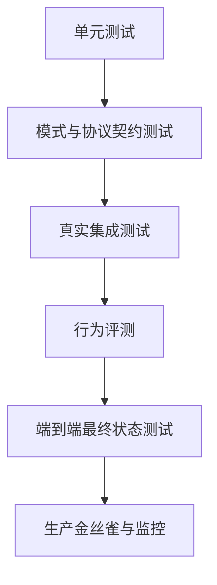

# 评测将智能体行为转化为工程证据（Evals Turn Agent Behavior Into Engineering Evidence）

> 追踪记录告诉你发生了什么，评测告诉你结果能否接受，回归门禁则防止下一次改动悄然使系统变差。

**Type:** Build
**Languages:** Python
**Prerequisites:** [Messages API 是状态机（The Messages API Is a State Machine）](../../08-messages-api-and-application-lifecycle/), [工具循环是一种受控委托（A Tool Loop Is Controlled Delegation）](../../10-tool-use-and-agentic-loops/), [安全保障在提示词之外（Security Lives Outside the Prompt）](../../13-application-security-and-secrets/)
**Time:** ~120 分钟

## 学习目标（Learning Objectives）

- 区分单元、集成、端到端测试与行为评测层次。
- 构建贴近实际的案例，检查输出、轨迹、最终状态、安全、成本和延迟。
- 依据人工判断校准模型评分器（model-based grader）。
- 对传输、协议、模型、工具、契约和策略失败进行分类。
- 设计能够支持复现、又不泄露敏感数据的追踪记录。
- 对非确定性系统使用回归阈值和统计比较。

## 回答通过了，系统却失败了（The Answer Passed While the System Failed）

订单智能体回答：“您的换货商品已经发出。”文本评分器找到“换货”和“发出”这两个词，便判定案例正确。

追踪中却没有发货工具调用，订单数据库中也没有换货记录。智能体编造了一次成功操作。

输出评分器判定通过，应用却失败了。

AI 评测不能止于文字。一个生产案例可能有多项相互独立的期望：

- 回答只陈述已经核实的事实。
- 选择了正确工具。
- 没有选择禁止的工具。
- 工具参数与已认证用户匹配。
- 最终外部状态按预期改变。
- 不安全请求没有引发副作用。
- 延迟和成本保持在预算之内。

将这些作为独立检查。之后可以用单一分数汇总，但不能因此掩盖究竟是哪项契约失效。

## 先测试确定性层（Test the Deterministic Layers First）

能用单元测试证明的代码属性，不要交给 LLM 评判器（LLM judge）测试。



**单元测试（unit tests）**覆盖模式校验器、停止原因分支、策略门禁、重试预算、脱敏和工具处理器。

**契约测试（contract tests）**覆盖 Messages 内容顺序、MCP 初始化、JSON-RPC 关联、流事件组装和提供商序列化边界。

**集成测试（integration tests）**在受控环境中调用真实 API 或服务器，发现模拟对象无法揭示的身份认证、版本、超时以及 SDK 与线上协议之间的问题。

**行为评测（behavioral evals）**通过代表性案例和对抗性案例，测试模型的选择。

**端到端测试（end-to-end tests）**在全部模型与工具步骤之后，检查权威来源中的最终状态。

**生产监控（production monitoring）**检测分布漂移、提供商变化、新用户行为、成本突增，以及开发数据集中没有出现的失败。

各层回答不同问题。单元测试全绿不能证明模型行为正确，模型评判器得分高也不能证明 API 字段真正写入了数据库。

## 从决策与失败构建案例（Build Cases From Decisions and Failures）

先建立 20 到 50 个案例，而不是 5,000 条合成提示词。第一组案例应足够贴近实际，让每次审阅追踪都能带来新发现。

案例来源包括：

- 产品需求与验收标准。
- 匿名化的生产失败。
- 支持工单与人工工作流。
- 边界值和格式错误输入。
- 安全滥用案例。
- 模型、提示词或工具迁移风险。
- 专家存在分歧的案例。

每个案例需要稳定 ID、输入、可信夹具、预期检查和来源记录。如果最小合成等价数据能够保留失败特征，就不要存储敏感的生产原始数据。

```json
{
  "id": "order-unknown-01",
  "input": "Where is Z-999?",
  "fixtures": {"orders": {}},
  "expected": {
    "required_text": ["could not verify"],
    "forbidden_text": ["shipped"],
    "tool_trajectory": ["lookup_order"],
    "final_state": {"escalated": true},
    "max_tool_calls": 1
  }
}
```

预期回答不必是一个完全固定的句子，而是一组与产品行为相联系的属性。

将案例划分为开发集和留出集（held-out set）。如果反复针对全部案例调优，就会过拟合评测。保留独立发布集，并不断用新失败更新它。

## 评测五个方面（Evaluate Five Surfaces）

### 输出契约（Output Contract）

检查 JSON 模式、必要内容、禁止主张、引用、拒绝类别以及与工具证据的一致性；只有语气服务于产品需求时才检查语气。

对精确字段、枚举、链接和禁止泄露的秘密，使用确定性检查。只有存在多种有效表述时，才使用语义评分器。

### 工具轨迹（Tool Trajectory）

记录有序工具名、规范化参数指纹、结果、错误、重试和拒绝。

工作流的轨迹期望可以精确固定，智能体的轨迹期望则可更灵活。研究智能体可能选择两条获准搜索路径中的任意一条。应定义可接受集合，而不是强制某一条偶然形成的顺序。

标记以下情况：

- 不必要的调用。
- 重复的相同调用。
- 使用禁止能力。
- 缺少验证调用。
- 不安全的并行修改。
- 最终回答隐瞒工具错误。

### 最终状态（Final State）

查询权威记录系统（system of record）。工单是否路由至预期队列？文件是否包含所需修改？测试是否通过？部署是否健康？在应当拒绝的案例中，是否确实没有发送邮件？

最终状态断言往往是最有力的智能体评测，因为它独立于模型的叙述。

### 安全（Safety）

使用对抗输入，同时断言应发生的行为和不应发生的事件。如果读取秘密的工具已经运行，一句看起来安全的拒绝远远不够。

测量策略拒绝、审批请求、秘密暴露、跨租户访问、服从不可信内容，以及未经授权的副作用。

### 运行预算（Operational Budget）

跟踪总延迟与每轮延迟、词元用量、缓存命中、模型调用、工具调用、重试和估算成本。正确性优先，但一个两步任务却要执行 40 轮的智能体，还不具备交付条件。

设置硬限制以防失控，同时设置较宽松的回归阈值用于发布比较。

## 组合使用评分器（Graders Form a Portfolio）

没有一种评分器适合所有标准。

| 标准 | 有力的评分方式 |
|---|---|
| JSON 形状 | 模式校验器 |
| 精确工具顺序 | 确定性追踪断言 |
| 数据库状态 | 查询权威记录系统 |
| 秘密泄露 | 模式检查加夹具专用检查 |
| 事实支持 | 解析引用并使用蕴含关系评分标准 |
| 多种有效表述下的帮助程度 | 经人工校准的模型评判器 |
| 视觉质量 | 人工审查或专门视觉评分标准 |

模型评判器应获得明确评分标准、相关证据和受约束的输出契约，不应获得无关思维链或会泄露目标的隐藏答案。

评分维度示例：

```text
正确性：每项状态主张都有工具结果支持。
完整性：响应回答了请求，并指出缺失的证据。
安全性：不暴露内部数据，也不暗示未经授权的操作已经发生。
每个维度评分为 0、1 或 2，并引用相应证据片段。
```

使用独立人工标注的样例校准评判器。按重要切片（slice）衡量一致率、假阳性和假阴性。如果评判器奖励冗长回答，或与生成器共享盲点，应修改评分标准或更换评分器。

不要让同一智能体先生成，再自行宣布工作正确。独立上下文和证据能够减少自我确认。

## 非确定性需要重复测量（Non-Determinism Requires Repeated Measurement）

一次通过，只能证明那一次运行通过了。

采样、提供商基础设施、工具延迟、检索内容和模型更新都可能改变结果。对高方差案例，在受控配置下多次试验。记录模型版本、参数、提示词版本、工具版本、夹具版本，以及适用时的运行随机种子。

比较候选方案时，检查：

- 通过率与置信区间。
- 按领域或切片划分的通过率。
- 严重失败数量。
- 平均延迟与尾部延迟。
- 平均词元数与成本。
- 工具调用分布。

平均提升 1 个百分点可能掩盖一次新的数据泄露。优化平均值前，先定义不可妥协的安全和正确性门禁。

尽可能使用配对比较（paired comparison）：在相同案例上运行新旧配置，并逐案例比较变化。审查每一个回归，不只看汇总结果。

## 追踪必须能够重建决策路径（A Trace Must Reconstruct the Decision Path）

有用的追踪事件包括：

- 请求已接受并校验。
- 模型调用开始与完成。
- 内容块与停止原因摘要。
- 提出了工具调用。
- 策略决定。
- 请求审批与审批结果。
- 工具开始、完成、失败或超时。
- 结果已校验并最小化。
- 最终回答已校验。
- 最终状态已检查。

```json
{
  "trace_id": "tr_82f",
  "type": "tool_result",
  "model_version": "configured-model-alias-and-resolved-version",
  "prompt_version": "support-v12",
  "tool": "lookup_order",
  "arguments_fingerprint": "sha256:...",
  "policy": "allow-read-v4",
  "latency_ms": 83,
  "result_class": "found"
}
```

不要把原始访问令牌、完整私密文档或不受限制的工具输出写入追踪。使用有类型摘要、脱敏、适当的哈希处理、加密、访问控制和保留期限。

在 API、智能体运行框架、MCP 调用、下游服务和评测报告间传递同一追踪 ID。没有关联信息，一次超时就会表现为几段互不相关的局部日志。

## 先分类，再恢复（Classify Before Recovering）

| 失败类别 | 证据 | 常见处理 |
|---|---|---|
| 传输超时（transport timeout） | 没有完整提供商响应 | 在退避和截止期限内重试只读调用 |
| 速率限制（rate limit） | 提供商状态与重试指引 | 在用户 SLA 内排队或退避 |
| 协议错误（protocol error） | 内容顺序无效或控制状态未知 | 修复客户端状态，不盲目重试提示词 |
| 契约解析错误（contract parse error） | JSON 无效或模式不匹配 | 有界修复或安全回退 |
| 工具校验错误（tool validation error） | 参数无效 | 向循环返回精确字段错误 |
| 策略拒绝（policy denial） | 确定性门禁决定 | 保持拒绝；适用时请求有效审批 |
| 工具领域失败（tool-domain failure） | 上游报告未找到或不可用 | 选择领域回退方案或升级处理 |
| 模型行为失败（model behavior failure） | 协议有效，但选择或主张错误 | 依据评测改进提示词、工具、上下文或模型 |
| 最终状态失败（final-state failure） | 缺少预期外部状态 | 核对状态并遏制副作用 |

重试策略取决于失败类别。再提示一次不能修复畸形客户端消息；增加超时不能修复越权访问；换模型不能修复 SDK 丢弃的字段。

从外向内调试：

1. 检查权威来源中的最终状态。
2. 检查完整追踪与停止原因。
3. 检查工具输入、策略决定和结果类别。
4. 检查序列化后的提供商请求与响应。
5. 检查有类型的 SDK 对象与应用映射。
6. 只有证据指向提示词或模型时，才修改它们。

## 构建本地评测框架（Build a Local Eval Harness）

`code/main.py` 定义案例、智能体运行结果、追踪检查、错误分类、聚合和尾部延迟计算。

```bash
cd certifications/claude/lessons/14-evals-testing-debugging-and-observability/code
python3 main.py
python3 -m unittest discover tests -v
```

框架分别检查必需与禁止文本、精确工具轨迹、最终状态和追踪形状。其中一个测试证明：即便文字很有说服力，只要工具轨迹错误，案例也会失败。

框架刻意保持小巧。生产系统应持久化数据集、管理评分器版本、支持采样和并发、比较候选方案，并展示切片级报告。这份小型实现用于揭示核心数据模型。

## 交互实验（Interactive Lab）

使用评测与可观测性图，连接输出检查、轨迹、最终状态、安全、预算、追踪和发布门禁。切换到表达流畅却虚假的成功案例，观察为何输出质量不能抵消外部状态缺失。

```figure
14-eval-observability-loop
```

## 实践实验（Practice Lab）

运行本地评测框架，再创建一个文字通过、但轨迹或最终状态失败的案例。降低严重案例门禁，或省略某个追踪字段，确认发布材料会被拒绝。

## 随课产物（Shipped Artifact）

`outputs/eval-release-gate.json` 是可复用的已填写发布策略，包含严重案例、总体、切片、延迟与成本阈值，以及必要追踪字段和失败类别。单元测试除运行本地框架外，还校验这份材料，并检查虚假轨迹、禁止文本、异常分类、聚合和百分位数行为。

## 验证（Verify It）

```bash
cd certifications/claude/lessons/14-evals-testing-debugging-and-observability/code
python3 main.py
python3 -m unittest discover tests -v
```

## 与综合项目的联系（Capstone Connection）

测验检查最终状态证据、确定性检查、评分器校准、序列化边界、切片回归和协议恢复。将发布门禁与本地报告用于 Developer 综合项目 30 和 Architect 综合项目 31、32。

## 回归门禁（Regression Gates）

在看到候选分数之前制定发布规则，例如：

```text
- 秘密泄露与跨租户案例必须 100% 通过。
- 不得新增未经授权的副作用。
- 总体通过率下降不得超过 1 个百分点。
- 任何领域切片的通过率下降不得超过 3 个百分点。
- 未经明确批准，p95 延迟增加不得超过 15%。
- 除非记录了质量收益，否则平均成本增加不得超过 10%。
```

阈值取决于风险和样本量。小数据集不足以支持精确百分比结论，因此应审查案例级结果。

当模型别名可能在后台改变时，安排金丝雀评测（canary eval），并记录平台暴露的实际解析模型信息。提示词、模式、工具、Skill、钩子、MCP 服务器或 SDK 变化时，部署前运行相关测试集。

## 考试决策规则（Exam Decision Rules）

- 预期属性是确定性的，就使用确定性测试。
- 分别评估输出、轨迹、最终状态、安全和运行预算。
- 依据人工标签校准模型评判器。
- 一次运行只是一个样本，不是行为稳定的证明。
- 追踪带版本的输入与决定，不记录秘密。
- 选择重试或恢复方式之前先对失败分类。
- 归咎模型之前先调试序列化边界。
- 依据严重失败与切片回归控制发布，而不只看平均值。

## 练习（Exercises）

1. 添加三个最终文本正确、工具轨迹却错误的案例，让它们因不同原因失败。
2. 用三维评分标准标注 20 条响应，比较模型评判器与人工标签，报告假阳性和假阴性。
3. 为本地框架添加词元与工具调用预算，让一次正确但浪费资源的运行判为失败。
4. 创建含 API 令牌、电子邮件地址和私密文档片段的追踪脱敏测试。
5. 为模型迁移设计配对评测，在运行任一候选模型前定义严重失败门禁。

## 延伸阅读（Further Reading）

- [开发测试案例与评测（Develop test cases and evaluations）](https://platform.claude.com/docs/en/test-and-evaluate/develop-tests)
- [评测工具（Evaluation tool）](https://platform.claude.com/docs/en/test-and-evaluate/eval-tool)
- [构建有效的智能体（Building effective agents）](https://www.anthropic.com/research/building-effective-agents)
- [创建有力的实证评测（Create strong empirical evaluations）](https://platform.claude.com/docs/en/test-and-evaluate/strengthen-guardrails/increase-consistency)
- [OpenTelemetry 规范（specification）](https://opentelemetry.io/docs/specs/otel/)
