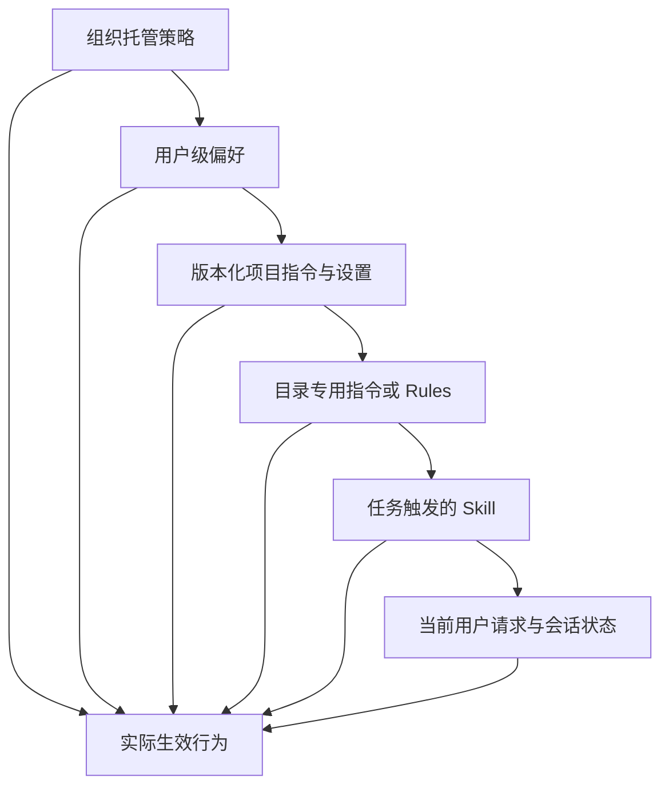

# Claude Code 通过共享约束支持团队协作（Claude Code Scales Through Shared Constraints）

> 团队不需要一份庞大的提示词，而需要精简的项目契约、可复用流程、确定性检查和有版本管理的配置。

**Type:** Learn
**Languages:** Python
**Prerequisites:** [Agent SDK 是运行框架，不是行动授权（The Agent SDK Is a Harness, Not Permission）](../../12-claude-agent-sdk-and-hooks/), [评测将智能体行为转化为工程证据（Evals Turn Agent Behavior Into Engineering Evidence）](../../14-evals-testing-debugging-and-observability/)
**Time:** ~170 分钟

## 学习目标（Learning Objectives）

- 设计精简的 `CLAUDE.md`，使其承担项目入门指南的作用。
- 将指令、设置、Rules、Skills、智能体、钩子和 MCP 配置放在正确作用域。
- 使用权限模式、上下文恢复、目标、循环、工作树和调度，同时保持审批边界。
- 对模型、提示词、插件和团队配置的变化进行版本管理。
- 将 Claude Code 作为受边界约束的贡献者集成到 CI，而不是未经审查的部署者。
- 通过产物、测试、追踪和恢复点评估团队工作流。

## 900 行的指令文件（The 900-Line Instruction File）

团队把每次纠正都追加到 `CLAUDE.md`。文件包含架构历史、API 文档、风格偏好、发布步骤、安全规则、示例、故障排查和任务专用操作手册。

Claude 每次会话都读取它。重要命令与过时文字争夺注意力；文件太大，开发者不再审查变更。其中一行旧说明要求使用已经停用的测试命令，于是智能体反复运行错误测试集后报告成功。

团队没有建立记忆，而是积累了上下文债务（context debt）。

`CLAUDE.md` 应像一份精确的入门脚本：说明仓库是什么、如何浏览、如何构建和测试、有哪些不明显的约束，以及深入文档在哪里。

## 将信息放在最小的持久作用域（Put Information at Its Narrowest Durable Scope）

Claude Code 可以从多个作用域加载配置和指令。确切层级与文件名属于产品细节，但设计规则稳定：广泛策略放在广泛作用域，项目事实放在仓库，任务流程只在相关时加载。



项目任务不应轻易削弱上层控制，局部指令也不应被全局复制。请查阅当前 [Claude Code 设置（settings）](https://code.claude.com/docs/en/settings)和[记忆（Memory）](https://code.claude.com/docs/en/memory)文档，确认已安装版本的精确优先级、托管策略位置、导入和发现行为。

来源冲突时，要明确显示优先级。不要写下两句矛盾指令，然后寄希望于模型选择更安全的一句。

## 编写精简的 CLAUDE.md（Write a Lean CLAUDE.md）

从 Claude 反复需要的事实开始：

```markdown
# 仓库指南（Repository guide）

## 用途（Purpose）
本仓库是一个用于路由支持工单的 Python 服务。

## 命令（Commands）
- 安装：`python3 -m venv .venv && .venv/bin/pip install -r requirements.txt`
- 针对性测试：`python3 -m unittest discover tests -v`
- 完整校验：`./scripts/validate.sh`

## 目录结构（Layout）
- `src/`：应用代码
- `tests/`：单元测试与集成测试
- `docs/architecture.md`：边界与决策记录

## 约束（Constraints）
- 绝不提交凭据或 `.env` 文件。
- 除非任务明确要求改变，否则保持公共 API 兼容性。
- 部署或向外部发送消息前，必须取得明确批准。
```

包含：

- 用途与技术栈。
- 标准构建、测试、lint 和运行命令。
- 重要目录映射。
- 仓库专用风格或架构规则。
- 安全和公开操作边界。
- 指向权威深入文档的链接。

排除：

- Claude 已经知道的通用建议。
- 完整 API 参考文档。
- 临时任务状态。
- 秘密或环境变量值。
- 仅供某个专门工作流使用的指令。
- 无人执行或审查的规则。

从小规模开始。如果多次会话出现同一纠正，再判断它应属于 `CLAUDE.md`、Rule、Skill、钩子、测试还是实际代码。“总是运行格式化器”的最佳修复，可能是编辑后钩子与 CI 检查，而不是再加一句话。

## Rules、Skills、命令与智能体（Rules, Skills, Commands, and Agents）

这些机制解决不同问题。

### 规则（Rules）

对某类文件或仓库某区域适用的约束，使用 Rules 或目录作用域指令。编辑数据库迁移时，前端规则不应占用上下文。

每条规则应内聚且可测试，并指出执行机制与权威来源。避免在根目录和子目录文件中重复同一指令，否则不可避免地发生漂移。

### 技能（Skills）

Skill 封装可复用流程、参考资料、脚本和资源。简短描述帮助 Claude 判断何时加载完整材料。

数据库迁移审查、发布说明生成、安全威胁建模和团队文档风格等工作适合用 Skill。保持核心会话提示词精简，通过仓库或获准的分发机制管理 Skill 版本。

价值在于渐进式披露（progressive disclosure）。如果一个 Skill 总被加载且包含整本手册，它就只是另一份系统提示词。

### 命令（Commands）

命令提供由用户明确调用的工作流。当开发者应主动启动 `/release-check` 或 `/review-migration` 等操作时，很适合使用命令。

把命令参数视为不可信输入。命令不能绕过工具授权或审批。

### 智能体（Agents）

自定义智能体或子智能体定义隔离的角色、工具集和指令。将其用于独立审查、狭窄专业职责，或有独立文件归属的并行工作。

只读审查者不应继承编辑和部署工具。如果独立性重要，生成器和评估器不应共享隐藏推理。

产品说明，核验日期为 2026-08-09：精确文件系统位置、前置元数据字段、命令行为和智能体配置会演进。使用当前 [Claude Code 文档（documentation）](https://code.claude.com/docs/en/overview)，并为仓库示例标注目标版本。

## 设置也是代码（Settings Are Code）

团队设置控制权限、环境、钩子、模型行为、MCP 服务器、插件和其他产品能力。应像生产代码一样审查它们。

区分作用域：

- 组织策略承载不可妥协的限制。
- 提交项目设置，共享安全默认值。
- 本地设置保存不应提交的机器专用路径或实验。
- 环境变量承载秘密名称和部署特有值。

绝不在设置中提交令牌，也不要把拒绝模式当成沙箱。用无害夹具测试权限行为。

修改设置时：

1. 说明预期行为。
2. 固定或记录相关 Claude Code 版本。
3. 添加针对性验收测试或人工验证脚本。
4. 运行一项应拒绝操作和一项应允许操作。
5. 审查合并后实际生效的配置。
6. 提供回滚说明。

设置文件能解析，不代表已安装版本尊重每个键。

## 权限模式定义基线（Permission Modes Set a Baseline）

权限模式控制 Claude 提出工具调用时会发生什么。它不会改变仓库策略、授予凭据，也不会让外部操作变得可逆。

产品说明，核验日期为 2026-08-09：当前 Claude Code 文档列出了以下精确模式。其可用性和 UI 标签因产品界面、套餐、提供商、模型、管理员策略和安装版本而异。

| 模式 | 实际边界 | 合适用途 |
|---|---|---|
| `default` | 读取可继续，编辑和命令可能弹出审批 | 首次使用、敏感仓库 |
| `acceptEdits` | 文件编辑和常见文件系统操作可继续，其他命令仍需审批 | 配合差异审查的本地代码迭代 |
| `plan` | 允许读取和探索；auto 模式可用时，分类器批准的命令可能运行，但仍阻止源码编辑 | 先批准范围与方案 |
| `auto` | 独立分类器评估操作；显式询问控制仍可能要求审批 | 在可信方向上的研究预览自主运行 |
| `dontAsk` | 所有原本会询问的操作都被拒绝；只执行预先批准的工作 | 严格受限的 CI 和脚本 |
| `bypassPermissions` | 绕过内置权限检查；已配置的拒绝、询问和用户交互控制仍生效 | 不含有价值凭据的隔离容器或虚拟机 |

会话可使用 `--permission-mode <mode>`，或在支持时使用 `permissions.defaultMode` 设置。之后权限规则通过 `deny`、`ask` 和 `allow` 模式进一步缩小调用范围。显式拒绝和询问规则、组织连接器控制及必需用户交互，在包括 `bypassPermissions` 的所有模式下都会评估。硬边界应写入拒绝规则、沙箱、凭据作用域、分支保护或钩子，而不是写成一句可能在 auto 模式会话压缩后消失的话。

`acceptEdits` 只意味着编辑减少审批步骤，不会自动接受发布、部署、任意 shell 命令或消息发送。`auto` 是研究预览，不是安全证明。`bypassPermissions` 不适合普通笔记本，也不能仅因为会话位于 Git 工作树中就使用。

## 钩子把建议变成检查（Hooks Turn Advice Into Checks）

使用钩子执行确定性的生命周期操作：

- 在工具执行前阻止秘密路径读取。
- 阻止向受保护分支提交。
- 外部写入要求审批。
- 编辑后格式化变更文件。
- 代码变化后运行针对性测试。
- 脱敏工具输出。
- 记录审计事件。
- 必需检查具备证据之前，阻止宣告完成。

保持钩子快速。慢钩子会反复运行，破坏交互延迟。设置超时并明确失败行为。安全钩子无法评估请求时应默认拒绝。

Claude Code 用 JSON 传入钩子输入。命令钩子有两条不同控制路径：

- 以 `0` 退出，在 stdout 打印一个 JSON 对象，实施结构化控制。
- 以 `2` 退出，在 stderr 打印原因，触发事件专用阻止行为。

不要混用。Claude Code 只在退出码为 `0` 时处理结构化 JSON；退出码为 `2` 时打印的 JSON 会被忽略。对大多数事件，退出码 `1` 只是非阻塞错误，因此策略钩子不能依赖普通 Unix 失败语义。

`PreToolUse` 和 `PermissionRequest` 的输出形状也不同。`PreToolUse` 钩子可通过 `hookSpecificOutput.permissionDecision` 允许、拒绝、询问或交由其他机制决定：

```json
{
  "hookSpecificOutput": {
    "hookEventName": "PreToolUse",
    "permissionDecision": "deny",
    "permissionDecisionReason": "Publishing requires a human-controlled workflow"
  }
}
```

`PermissionRequest` 钩子仅在 Claude Code 即将询问，或因无法询问而必须拒绝时运行。它使用嵌套决策对象：

```json
{
  "hookSpecificOutput": {
    "hookEventName": "PermissionRequest",
    "decision": {
      "behavior": "deny",
      "message": "External publishing requires interactive human approval",
      "interrupt": false
    }
  }
}
```

允许决定不能覆盖匹配的拒绝或询问规则。退出码 `2` 会阻止 `PreToolUse` 调用并拒绝 `PermissionRequest`，但事件行为各不相同：例如 `PostToolUse` 钩子在操作之后运行，无法撤销操作。把任何钩子当成强制控制之前，先阅读事件表。

适当时，将共享钩子放入经过审查的项目代码，但要确保受约束智能体不能悄悄改写策略后执行禁止操作。组织控制、仓库权限和沙箱边界必须保护钩子层。

## MCP 与插件是安装得到的能力（MCP and Plugins Are Installed Capability）

MCP 服务器或插件可以添加工具、提示词、钩子、智能体、Skills、命令或语言智能。安装会改变攻击面与上下文范围。

团队审查应覆盖：

- 发布者与源仓库。
- 精确版本与更新策略。
- 安装的组件。
- 工具和文件系统权限。
- 网络目标。
- 请求的秘密和环境变量。
- 无界面或 CI 环境中的行为。
- 卸载与回滚步骤。

优先采用小型获准目录，在支持时固定版本。用代表性仓库和评测集测试升级。不要为了使用一个可由已审查本地 Skill 提供的小流程，就安装大型插件。

插件与 MCP 不能互换。MCP 标准化外部能力连接；插件封装 Claude Code 扩展；Skill 承载流程和支撑材料。应按需求选择，而不是按机制热度选择。

## 会话需要恢复纪律（Sessions Need Recovery Discipline）

Claude Code 会话帮助开发者恢复工作、分叉调查并保留本地上下文，但会话历史不是权威记录系统。

恢复有实质后果的工作之前：

- 检查当前 Git 状态与差异。
- 重跑相关测试。
- 核对外部副作用。
- 确认分支和仓库根目录。
- 审查待处理审批。
- 检查指令、工具或模型配置是否改变。

当累积上下文导致偏移，或跨越租户或保密边界时，清空或新建会话。上下文压缩用于保持连续性，不能证明每项约束都被保留。

仓库策略允许时，提交小型恢复点。会话摘要不能替代版本控制。

不同会话命令用于不同工作：

| 机制 | 效果 | 使用时机 |
|---|---|---|
| `/context` | 显示上下文窗口由哪些内容占用 | 诊断记忆、技能、工具和消息膨胀 |
| `/compact [focus]` | 用聚焦摘要替换先前对话 | 减少历史，继续同一任务 |
| 自动压缩（automatic compaction） | 先清除旧工具输出，接近上限时再生成摘要 | 正常维持长会话连续性 |
| `/clear` | 开始空对话，旧对话仍可恢复 | 切换到无关工作或新信任边界 |
| `/rewind` 或双击 `Esc` | 从检查点恢复代码、对话，或进行摘要 | 恢复已跟踪编辑，或移除错误对话分支 |

压缩可能丢失普通对话指令。项目根目录的 `CLAUDE.md` 和自动记忆会重新加载；路径作用域规则则在再次读取匹配文件时加载。将持久约束放入版本化配置，并在压缩后重申当前验收边界。

回退是便利功能，不是版本控制。它跟踪 Claude Code 的直接文件编辑，却不跟踪 shell 命令、外部系统或大多数子智能体产生的变化。以 `context: fork` 运行的前台 Skills 是例外，它们的直接编辑会被跟踪。重试操作前，检查 Git 和外部状态。

## 不同自主机制有不同停止条件（Autonomy Has Different Stop Conditions）

不要把所有重复工作流都当作同一种循环。

### 目标会话（Goal Sessions）

`/goal <condition>` 会在上一轮结束后开启下一轮，直到独立小模型评估器认定条件满足。评估器读取对话证据，不会独立运行测试或检查文件。要说明可测量结果、证明它的命令和必须保持的约束。时间或轮数条款对评估器可见，但不是硬运行限制；硬限制应在目标会话之外执行。

```text
/goal tests/auth 退出码为 0 且 lint 无问题，不得修改夹具；或在 15 轮后停止
```

每个会话只能有一个活动目标。`/goal clear` 可将其停止。目标不会改变权限，因此 default 模式仍可能询问。将目标与 auto 模式配合使用可减少普通询问，但显式询问控制仍可要求审批；这也更需要隔离环境、拒绝规则、预算和可观测证据。

### 会话内循环与定时提示词（In-Session Loops and Scheduled Prompts）

`/loop 5m check whether CI finished` 在当前 CLI 会话保持打开时调度提示词。没有固定间隔时，Claude 可以决定下次延迟。这些任务继承会话的工具与权限，在轮次之间运行，不是持久化任务基础设施。

选择合适的持久调度器：

- 云端 Routine 用于已保存提示词、选定仓库、连接器，以及定时、API 或 GitHub 触发器。Routines 是研究预览，会自主运行且没有审批提示，因此应移除所有未使用连接器，并严格限制分支权限。
- 当机器和本地未提交文件属于预期边界时，使用 Desktop 定时任务。
- 当触发器和权限应位于经过审查的仓库工作流配置中时，使用 GitHub Actions。

在可用环境中，`/schedule` 创建或管理云端 Routines。产品开关、限制、账户资格和精确调度行为都对版本敏感；持久有效的设计是自包含提示词、明确成功条件、最小身份权限和可审计结果。

## 并行工作需要隔离文件（Parallel Work Needs Isolated Files）

即使提示词指定不同任务，两个智能体编辑同一检出目录仍可能互相覆盖。应在工作树（worktree）中启动独立 Claude Code 会话：

```bash
claude --worktree auth-hardening
claude --worktree docs-refresh
```

当前 Claude Code 默认在独立的 `worktree-<name>` 分支上创建 `.claude/worktrees/<name>/`。为每个会话指定负责人、文件边界、验收测试和集成契约。自定义子智能体必须并行编辑时，可声明 `isolation: worktree`。

工作树隔离工作文件和分支，但共享仓库 Git 元数据、项目插件和已保存权限审批，也不隔离网络、凭据、数据库或其他副作用。称某次运行“已隔离”之前，先审查这些共享方面。通过常规 Git 审查集成，不要在活动检出目录间复制文件。

## 托管审查与 GitHub Action 不同（Managed Review and the GitHub Action Are Different）

产品说明，核验日期为 2026-08-09：Anthropic 的托管 Code Review GitHub 集成是面向 Team 和 Enterprise 套餐的研究预览。它运行一组专门智能体审查拉取请求，并能添加带严重级别的行内问题。它可以读取 `CLAUDE.md` 和 `REVIEW.md` 获得审查指引，但这些发现不会批准或阻止拉取请求；合并门禁仍由分支保护与确定性检查决定。

官方 `anthropics/claude-code-action@v1` 在你自己的 GitHub Actions 工作流内运行 Claude Code。它可以响应获准的 `@claude` 提及，或在仓库事件和 cron 调度时运行固定提示词。工作流控制检出深度、GitHub 令牌权限、秘密来源、工具、设置、模型和轮数限制。

```yaml
name: bounded-claude-review
on:
  pull_request:
    types: [opened, synchronize]
permissions:
  contents: read
  pull-requests: read
  id-token: write
jobs:
  review:
    runs-on: ubuntu-latest
    steps:
      - uses: actions/checkout@v6
      - uses: anthropics/claude-code-action@v1
        with:
          anthropic_api_key: ${{ secrets.ANTHROPIC_API_KEY }}
          prompt: "Review this pull request and emit evidence-backed findings only."
          claude_args: "--max-turns 6 --allowedTools Read,Grep,Glob"
```

将凭据保存在 GitHub Secrets 或工作负载身份中，只授予必需工作流权限，并在合并前审查全部变更。需要更强供应链固定机制的组织，可以将 Actions 固定到经过审查的提交 SHA，同时跟踪文档中的主版本发布。

## CI 中的无界面 Claude Code（Headless Claude Code in CI）

无界面（headless）执行可以在自动化中分析代码、生成结构化输出或提出补丁，同时也移除了通常能发现危险请求的交互式人工监督。

将 CI 用途设计为有边界的任务：


控制包括：

- 最小仓库和令牌权限。
- 不允许访问无关秘密。
- 固定依赖和配置。
- 网络允许列表。
- 轮数、时间与成本限制。
- 结构化输出模式。
- 产物和追踪保留策略。
- 禁止直接推送受保护分支。
- 合并、部署、发送消息或评论问题单之前进行人工审查。

使用短期自动化凭据。将拉取请求文本和仓库文件视为不可信内容。不要向评估不可信贡献的任务暴露高权限令牌。

当前无界面参数、结构化流模式和权限选项会变化。请核实已安装 CLI 对应的官方[无界面模式（Headless mode）](https://code.claude.com/docs/en/headless)文档，并在自己的仓库中为命令示例标注版本。

## 从计划到证据的团队工作流（Team Workflow From Plan to Proof）

可靠的开发循环如下：

1. Claude 阅读精简的项目契约。
2. 检查相关代码，在大范围编辑前编写计划。
3. 当选择具有外部影响时，由开发者确认范围。
4. Claude 完成一项小而内聚的变更。
5. 钩子格式化并运行针对性检查。
6. Claude 检查失败并修复原因。
7. 构建产物完成端到端运行。
8. 独立审查检查差异与证据。
9. 由常规版本控制保护管理合并与部署。

视觉变更应启动真实构建并检查截图；API 应检查真实传输数据与序列化；CLI 应运行构建产物。当这些证据要求具有仓库特性时，应写入团队指令。

## 对一切影响行为的内容进行版本管理（Version Everything That Changes Behavior）

记录：

- Claude Code 版本。
- 模型配置或别名。
- 根目录和子目录指令。
- 设置与钩子。
- Skills、命令、智能体、插件和 MCP 服务器。
- 自动化使用的提示词与输出模式版本。

任何一项变化时，都运行代表性工作流评测，比较正确性、安全、轮数、延迟和成本。模型升级可能改善一般推理，却改变某个关键工作流的工具选择。

永久固定版本不是答案，受控升级才是。使用兼容窗口、金丝雀仓库、回归测试集与回滚路径。

## 团队配置审查（A Team Configuration Review）

审查以下假设变更：

```json
{
  "permissions": {
    "allow": ["Bash(*)", "Read(**)"]
  },
  "mcpServers": {
    "company": {
      "command": "npx",
      "args": ["latest-company-server"]
    }
  }
}
```

问题包括：shell 和文件系统访问过宽、软件包未固定版本、服务器来源不清、缺少网络边界、没有秘密管理方案和审批策略。能力更强的配置并不自动成为更好的团队配置。

审查者应要求能力清单，将每项权限缩小到实际工作流所需，再使用真实安装版本测试一项允许操作和一项拒绝操作。

## 交互实验（Interactive Lab）

```figure
15-team-agent-loop
```

使用交互循环，让一项团队变更提议依次经过指令、执行、确定性验证、审查和恢复。改变作用域与执行控制，观察仅靠提示词的规则在哪里不再是可靠的团队边界。

## 实践实验（Practice Lab）

审计上述假设变更，缩小 shell 和文件系统范围，定义一项允许夹具、一项拒绝夹具以及回滚条件。

## 随课产物（Shipped Artifact）

已填写的 [`outputs/team-configuration-review.md`](../outputs/team-configuration-review.md) 将审查转化为可复用记录，覆盖能力、权限、上下文、自主性、隔离、调度、强制执行和恢复。[`outputs/permission-request-decision.json`](../outputs/permission-request-decision.json) 是已经校验的 `PermissionRequest` 钩子决定，用于拒绝对外发布。

## 验证（Verify It）

为你的仓库修改一份副本，然后运行确定性校验器：

```bash
cd certifications/claude/lessons/15-claude-code-for-development-teams
python3 code/main.py
python3 -m unittest discover -s code/tests -v
```

校验器检查必需的归属、允许和拒绝夹具、版本化配置与回滚证据。六道随课测验在你提供证据之后检查决策规则。

## 与综合项目的联系（Capstone Connection）

将完成的审查带入 Developer 综合项目，作为团队配置与 CI 控制附录。

## 考试决策规则（Exam Decision Rules）

- 保持 `CLAUDE.md` 精简且专用于项目。
- 将信息放在最小的持久作用域。
- 用 Skills 承载可复用任务流程，用钩子执行确定性生命周期检查。
- 将设置、插件和 MCP 服务器视为需要审查的代码与能力。
- 使用 `acceptEdits` 加快编辑，使用 `dontAsk` 执行预先批准的自动化；只在可丢弃的隔离运行时中使用绕过模式。
- 分别使用 `/context`、聚焦的 `/compact`、`/clear` 和 `/rewind` 完成不同恢复工作。
- 用证据、权限、时间和成本约束 `/goal`、`/loop`、Routines 和定时任务。
- 为并行写入者分配独立工作树和明确归属。
- 将秘密保留在受保护环境或秘密管理器边界内。
- 恢复会话前核对 Git 与外部状态。
- 为无界面 CI 设置最小词元、工具、网络、时间和权限范围。
- 智能体自动化之后仍须常规审查和受保护合并路径。
- 对配置变化进行版本管理和评测。

## 练习（Exercises）

1. 在 `default`、`acceptEdits`、`plan` 和 `dontAsk` 下运行同一无害编辑，记录哪些边界改变。
2. 压缩一个夹具会话，再验证哪些项目、路径和 Skill 指令被重新加载。
3. 为同一个 CI 任务编写有边界的 `/goal` 条件和独立 `/loop` 提示词，解释它们不同的停止条件。
4. 启动两个可丢弃的工作树会话，分配互不重叠的归属，再通过经过审查的差异集成。
5. 同时实现 `PreToolUse` JSON 拒绝和 `PermissionRequest` 拒绝，分别证明退出码 `0` 和 `2` 的行为。
6. 针对同一拉取请求，比较托管 Code Review 与只读 `anthropics/claude-code-action@v1` 工作流。

## 延伸阅读（Further Reading）

- [Claude Code 概览（overview）](https://code.claude.com/docs/en/overview)
- [Claude Code 记忆（memory）](https://code.claude.com/docs/en/memory)
- [Claude Code 设置（settings）](https://code.claude.com/docs/en/settings)
- [Claude Code 钩子指南（hooks guide）](https://code.claude.com/docs/en/hooks-guide)
- [Claude Code 权限模式（permission modes）](https://code.claude.com/docs/en/permission-modes)
- [Claude Code 命令（commands）](https://code.claude.com/docs/en/commands)
- [Claude Code 检查点（checkpointing）](https://code.claude.com/docs/en/checkpointing)
- [Claude Code 目标（goals）](https://code.claude.com/docs/en/goal)
- [Claude Code 定时任务（scheduled tasks）](https://code.claude.com/docs/en/scheduled-tasks)
- [Claude Code Routines](https://code.claude.com/docs/en/routines)
- [Claude Code 工作树（worktrees）](https://code.claude.com/docs/en/worktrees)
- [Claude Code 托管 Code Review（managed Code Review）](https://code.claude.com/docs/en/code-review)
- [Claude Code GitHub Actions](https://code.claude.com/docs/en/github-actions)
- [Claude Code 无界面模式（headless mode）](https://code.claude.com/docs/en/headless)
- [Claude Code 安全（security）](https://code.claude.com/docs/en/security)
- [Agent Skills](https://platform.claude.com/docs/en/agents-and-tools/agent-skills/overview)
