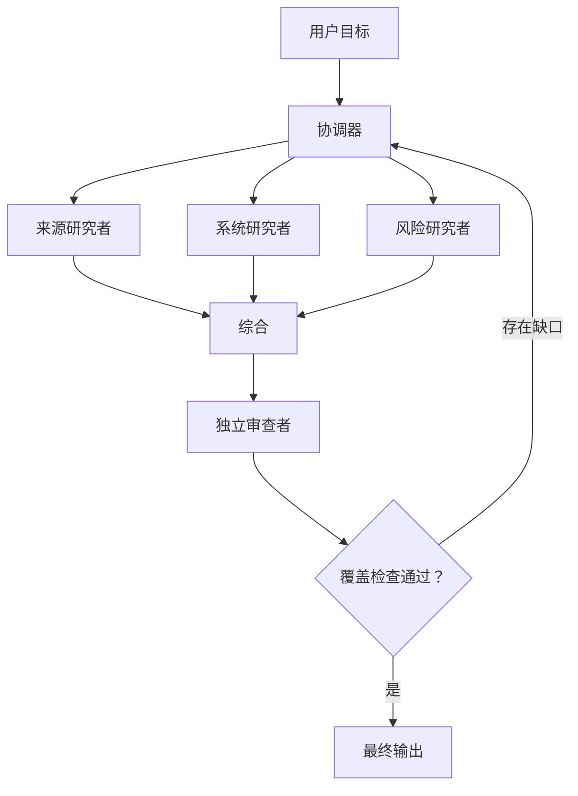

# 多智能体编排与委托（Multi-Agent Orchestration and Delegation）

> 委托一个边界明确的问题，而不是把全部不确定性都交出去。

**Type:** Reference
**Languages:** Python
**Prerequisites:** [工具循环是一种受控委托（A Tool Loop Is Controlled Delegation）](../../10-tool-use-and-agentic-loops/); 阶段 14，第 12 和 28 课
**Time:** ~135 分钟

## 学习目标（Learning Objectives）

- 选择单智能体、协调器、流水线、并行和审查者模式。
- 编写明确范围、工具、输出和完成标准的委托任务。
- 使用上下文隔离减少膨胀，并保护独立判断。
- 区分确定性前置条件与自适应模型决策。
- 合并部分结果，同时保留来源、错误和未解决缺口。

## 问题（The Problem）

一个研究智能体使用极其庞大的提示词。它搜索六个来源、比较主张、计算置信度、撰写报告、审查引用，并决定是否需要进一步研究。任务越大，它越容易忘记早期约束并重复搜索。团队将它拆成五个智能体，给它们宽泛工具和一句指令：“协作，直到报告足够优秀。”

新系统成本更高，也更难调试。两个智能体研究同一主张；协调器期待 JSON，某个智能体却返回文字；审查者看到生成器的推理，重复了它的假设；一个智能体静默失败，最终综合却将缺失结果当作否定证据。

多智能体架构没有解决任务拆分，只是让缺失契约的代价更高。

## 概念（The Concept）

### 明确新增上下文的理由（Decide Why Another Context Exists）

只有能提供具体收益时，才创建子智能体：

- 为有界关注点隔离上下文。
- 并行执行独立工作。
- 提供专门工具或指令。
- 不带生成器上下文地独立审查。
- 保护协调器的上下文预算。

如果子任务是一个确定性函数，就使用工具；如果是按需加载的可复用指引，就使用 Skill；如果需要自己的推理循环、证据与停止条件，才可能适合子智能体。

### 从五种模式开始（Start With Five Patterns）



#### 单智能体（Single Agent）

一个上下文能容纳所需证据、工具轨迹也较短时最适用。这是最容易评测的系统。

#### 顺序流水线（Sequential Pipeline）

每个阶段有固定前驱。当顺序与前置条件已知时使用，例如先提取、再校验、再审查、最后渲染。

#### 并行扇出与归并（Parallel Fan-Out and Reduce）

独立任务同时运行，再由归并器（reducer）合并结构化结果。适合逐文件审查或独立来源研究。不要并行执行依赖彼此发现的步骤。

#### 协调器与专家（Coordinator and Specialists）

协调器根据当前缺口选择并委托工作。适用于任务拆分无法在开始时完全确定的情况。

#### 生成器与独立审查者（Generator and Independent Reviewer）

一个上下文负责创建，另一个只接收产物、证据和评分标准，不接收生成器具有说服性的内部叙述。要求的是独立性，而不是在同一对话中再问一次。

### 编写委托契约（Write a Delegation Contract）

有用的委托任务包含：

```text
目标：子智能体负责的单一结果。
范围：纳入和排除的文件、来源、主张或系统。
输入：权威证据与当前状态。
允许工具：最少必要能力。
约束：时间、轮数、成本、安全和格式。
输出：可由机器校验的模式，包含来源与错误。
完成：用于判断完成、部分完成或阻塞的可观测条件。
交接：协调器应如何处理每种状态。
```

“深入研究这个主题”没有定义完成条件。“返回最多五项有支持的主张，每项包含来源 ID、日期、引用片段参考、置信度类别、冲突列表和未解决问题”则定义了。

### 将确定性顺序放在模型之外（Keep Deterministic Sequence Outside the Model）

如果必须先测试再审查，就由代码强制这一顺序。如果每个文件都必须先做局部审查，再做跨文件一致性审查，编排就应跟踪清单，并在第一遍完成前阻止第二遍开始。

不要依赖协调器提示词在上下文压力下记住硬性前置条件。

Claude 决定哪些缺失主张需要进一步研究等语义问题；代码决定最大并发数、必需输出、审批状态和阶段顺序等不变量。

### 有意识地使用任务边界（Use the Task Boundary Deliberately）

在 Claude Code 与智能体运行框架中，任务或子智能体边界可以提供隔离上下文和受限工具集。精确配置会随时间改变，因此应核实当前文档。持久适用的设计原则是：

- 只传递子智能体所需证据。
- 用明确允许列表限制工具。
- 要求结果附带结构化元数据。
- 仅当调用互不依赖时，才并行执行独立调用。
- 由协调器负责全局约束与最终状态。
- 当探索替代方案不得改变原路径时，分叉会话。

隔离可以防止上下文膨胀，但如果所有智能体收到同一份有缺陷的证据或评分标准，就不能保证事实判断独立。

### 保留三种结果状态（Preserve Three Result States）

每个子任务应返回：

- 完成（complete）：满足请求契约。
- 部分完成（partial）：提供有效工作，并指出缺口或失败来源。
- 阻塞（blocked）：没有新增权限或状态，就无法安全推进。

不能因为存在部分字段，就把部分完成转换为完成。协调器必须将缺失证据与结构化错误传递给综合阶段。

### 按身份与来源合并（Merge by Identity and Provenance）

归并器需要稳定键。代码审查使用文件和问题标识符；研究使用主张和来源标识符；客户支持使用工单和操作标识符。

合并规则应明确：

- 重复项如何处理。
- 冲突如何保留。
- 是否存在来源优先级。
- 如何比较时效。
- 如何处理不完整输入。
- 如何聚合置信度。
- 智能体意见不一致时如何升级处理。

不要让综合器为了文字流畅而隐藏冲突。

### 评测执行轨迹（Evaluate the Trajectory）

最终输出可能看起来正确，编排过程却浪费工作或越过边界。应测试：

- 子智能体选择是否正确。
- 是否只使用允许工具。
- 是否没有重复任务归属。
- 前置条件顺序是否正确。
- 结果模式与错误传播是否正确。
- 是否遵守轮数和成本预算。
- 审查者是否独立。
- 最终状态是否完整。

使用合成工具失败和部分结果。只证明正常路径最没有说服力。

## 构建（Build It）

## 交互实验（Interactive Lab）

```figure
16-multi-agent-topology
```

添加智能体前，先使用拓扑探索器。比较单上下文、顺序流水线、并行扇出、协调器和独立审查者；图中展示协调成本、前置条件和部分结果风险。

## 实践实验（Practice Lab）

设计下面的有界研究流水线，再移除一个不必要上下文，并说明可测量结果是否变化、为什么。

## 随课产物（Shipped Artifact）

已填写的 [`outputs/orchestration-contract.md`](../outputs/orchestration-contract.md) 是具体的研究流水线交接契约，不是空白工作表。

## 验证（Verify It）

在本地校验任务标识、依赖顺序、预算、部分状态与审查者隔离：

```bash
cd certifications/claude/lessons/16-multi-agent-orchestration-and-delegation
python3 code/main.py
python3 -m unittest discover -s code/tests -v
```

修改一个依赖，或移除部分状态规则，确认校验器会阻止该材料通过。本课测验在构建之后测试拓扑决策。

## 与综合项目的联系（Capstone Connection）

将通过验证的契约复用为 Architect Foundations 场景综合项目的编排部分。

为一项技术决策设计多智能体研究流水线。

### 第 1 步：定义最终契约（Step 1: Define the Final Contract）

定义智能体之前，先规定决策简报、主张模式、来源要求以及未解决缺口的表示方式。

### 第 2 步：尝试单智能体基线（Step 2: Try a Single-Agent Baseline）

测量质量、成本、延迟、重复工作和上下文增长。没有基线失败，不要添加智能体。

### 第 3 步：识别上下文边界（Step 3: Identify Context Boundaries）

只拆分能从隔离、并行、专门化或独立审查中受益的关注点。为每个新上下文记录预期改善。

### 第 4 步：编写任务契约（Step 4: Write Task Contracts）

创建表格：

| 任务 | 范围 | 允许工具 | 输出 | 完成 | 部分完成 | 预算 |
|------|-------|---------------|--------|------|---------|--------|

### 第 5 步：编码前置条件（Step 5: Encode Prerequisites）

使用依赖图或状态机。所有必需研究状态达到完成或明确部分完成之前，审查者不能运行。

### 第 6 步：对合并过程进行红队测试（Step 6: Red-Team the Merge）

注入重复主张、冲突日期、一个失败智能体、过期证据，以及模式错误的结果。验证综合过程不会悄悄抹去失败。

## 应用（Use It）

对于代码库审查，一种可靠结构是：

1. 建立文件与跨文件关注点清单。
2. 使用只读工具并行执行有界逐文件审查。
3. 将问题规范化为共享模式。
4. 针对清单和规范化问题执行一次跨文件审查。
5. 使用独立审查者剔除证据薄弱的问题和重复项。
6. 确定性测试与范围门禁通过后，才应用已接受变更。

不要让每个智能体都检查整个仓库。这会重复上下文，并使归属含糊。

客户支持中，既要按专业能力，也要按权限分工。策略研究者可以阅读文档，退款建议者可以分析案例，只有独立且获准的执行者才能拥有写入权限。

## 考试决策模式（Exam Decision Patterns）

对前置条件和权限选择结构性强制执行；对子智能体的使用，应基于隔离推理需求，而不是确定性实用函数调用。

较强的选项通常会：

- 使用协调器与有界专家。
- 按角色限制工具。
- 返回结构化结果与部分状态。
- 并行执行独立任务。
- 在全新上下文中进行独立审查。
- 保留来源与错误出处。
- 只重新委托已识别的缺口。

较弱的选项则要求更多智能体共享同一宽泛提示词和工具集。

## 常见陷阱（Common Traps）

### 每一步都创建智能体（Agent Per Step）

固定步骤不需要自主上下文。操作确定时，使用代码或工具。

### 默认并行（Parallel by Default）

依赖任务并行执行会使用过期假设，并需要昂贵的合并修复。

### 把协调器当成数据仓库（Coordinator as Data Warehouse）

原始子智能体对话记录会膨胀全局上下文。应返回精简结构化结果，将详细证据保留在提示词之外。

### 审查者继承生成器上下文（Reviewer With Generator Context）

审查者继承相同框架后，会退化为风格编辑器。应在干净上下文中提供产物、证据和评分标准。

## 练习（Exercises）

1. 将过度膨胀的单智能体提示词拆成工具、Skill 和子智能体职责，并论证每条边界。
2. 设计三名来源研究者中一名超时后的部分结果行为。
3. 为逐文件和跨文件审查流水线添加确定性前置条件。
4. 在同一评测集上比较顺序拆分与自适应拆分。
5. 创建轨迹测试，在两个智能体重复拥有同一任务时判为失败。

## 关键术语（Key Terms）

| 术语 | 常见说法 | 实际含义 |
|------|-----------------|------------------------|
| 协调器（Coordinator） | 最聪明的智能体 | 负责拆分、全局约束、合并与完成判断的上下文 |
| 子智能体（Subagent） | 函数调用 | 拥有有界任务与工具的隔离推理循环 |
| 扇出（Fan-out） | 使用很多智能体 | 并发运行独立有界任务 |
| 归并（Reduce） | 总结一切 | 按明确冲突与部分状态规则合并结构化结果 |
| 交接（Handoff） | 发送文字 | 转交有类型状态、证据、错误和下一步责任 |
| 独立审查者（Independent reviewer） | 再问一次 | 在不受生成器说服影响的隔离上下文中评估产物和证据 |

## 延伸阅读（Further Reading）

- [Claude Agent SDK 文档（documentation）](https://platform.claude.com/docs/en/agent-sdk/overview)：了解当前子智能体与会话能力。
- [构建有效的智能体（Building effective agents）](https://www.anthropic.com/research/building-effective-agents)：了解编排模式。
- 阶段 14，第 28 课：更广泛的编排比较。
- 阶段 14，第 39 课：独立审查者设计。
