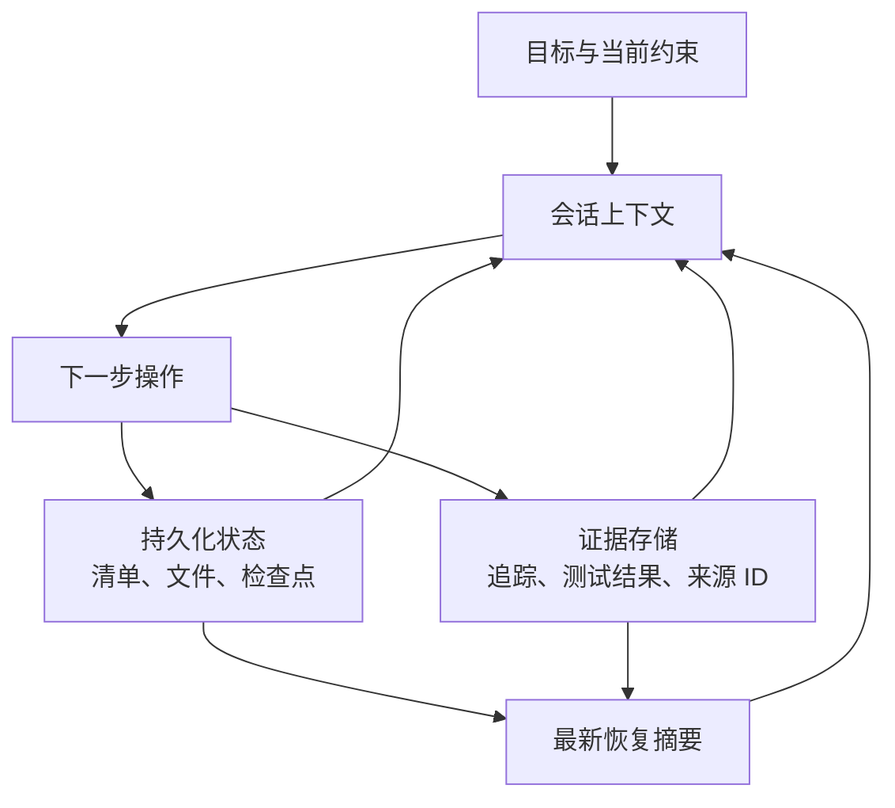

# Agent SDK 会话、子智能体与上下文（Agent SDK Sessions, Subagents, and Context）

> 连续性有帮助时恢复状态；继承的假设带来风险时，分叉上下文。

**Type:** Reference
**Languages:** Python
**Prerequisites:** [Agent SDK 是运行框架，不是权限（The Agent SDK Is a Harness, Not Permission）](../../12-claude-agent-sdk-and-hooks/), [多智能体编排与委派（Multi-Agent Orchestration and Delegation）](../../16-multi-agent-orchestration-and-delegation/); 阶段 14，第 17 课
**Time:** ~120 分钟

## 学习目标（Learning Objectives）

- 区分持久化任务状态与对话上下文
- 根据失败风险选择新建、恢复、分叉或压缩会话
- 使用子智能体（Subagent）隔离上下文和工具
- 围绕确定性生命周期事件设置钩子（Hook）
- 设计恢复机制，避免沿用过时假设或重复产生副作用

## 问题（The Problem）

一个仓库迁移智能体已运行数小时。上下文包含最初的计划、工具输出、失败实验、部分补丁、测试日志及几份摘要。某个依赖变化后，团队恢复原会话，并要求它“从上次停止的位置继续”。

智能体沿用已过时的计划，再次执行超时前已经成功的写入。压缩保留了大体经过，却丢失了一项关键测试失败。评审子智能体收到父级全部历史，也认定旧依赖的行为仍然成立。

系统混淆了三种东西：

- 持久化的外部状态
- 当前对话上下文
- 执行历史

它们相互关联，却不应被当作同一个存储。

## 概念（The Concept）

### 上下文是工作集（Context Is a Working Set）

模型上下文应包含下一步决策所需的信息。它不是记录已完成工作、审批、文件、检查点或工具副作用的权威数据库。



将持久性事实存放在上下文之外：

- 当前任务清单与各项状态
- 已完成的交付物及其版本
- 幂等键（Idempotency key）与外部操作 ID
- 审批及其有效期
- 最近经过验证的测试和部署结果
- 尚未解决的阻塞项
- 来源和追踪引用

会话开始或恢复时，根据这些状态重建精简且反映当前情况的工作集。

### 在四种会话操作中选择（Choose Among Four Session Moves）

#### 新建会话（New Session）

当目标或信任边界变化、继承的上下文不可靠，或先前任务已完成时，使用干净的新会话。根据权威状态提供结构化简报。

#### 恢复会话（Resume Session）

当任务、约束和证据仍然有效，而且对话连续性有价值时，恢复会话。首先重新验证外部状态。会话 ID 并不能证明外部世界没有变化。

#### 分叉会话（Fork Session）

如果探索另一种方案时需要保留原来的分支，就分叉会话。典型场景包括对比架构计划、独立排查调试假设，或尝试有风险的迁移方案。分叉会继承一个起点，但未经明确协调，不应修改共享状态。

#### 压缩会话（Compact Session）

当上下文变长，而当前工作仍受益于连续性时，压缩会话。好的压缩摘要保留决策、约束、交付物 ID、测试状态、未解决的缺口和下一步操作。将大型证据存到外部，并保留引用。

压缩能节省上下文，却不提供持久化执行，不保证关键事实不会丢失，也不会验证信息是否仍然有效。

### 使用结构化恢复包（Use a Structured Resume Packet）

```json
{
  "goal": "Migrate the request client without changing public behavior",
  "scope": ["src/client.py", "tests/test_client.py"],
  "completed": [
    {"task": "inventory", "artifact": "work/inventory.json", "verified": true}
  ],
  "current_state": {
    "branch": "migration/client-v2",
    "dependency_version": "verified-at-resume",
    "tests": "12 passed, 1 blocked"
  },
  "open_gaps": ["timeout retry semantics need decision"],
  "constraints": ["no public API change", "no production writes"],
  "next_action": "compare retry behavior against the contract tests"
}
```

恢复包报告当前事实，不要逐轮概括整段对话。

### 按职责隔离子智能体上下文（Isolate Subagent Context by Responsibility）

子智能体应收到：

- 单一目标与明确范围
- 最少的相关证据
- 受限工具
- 明确的输出与错误模式（Schema）
- 轮次、时间和成本预算
- 完成与升级处理规则

它不应收到无关的父级历史。隔离可以保护注意力，并有助于保持评审者的独立性。

协调者保留全局状态，在合并结果前检查返回内容是否符合契约。

### 用钩子处理确定性的生命周期工作（Use Hooks for Deterministic Lifecycle Work）

钩子在会话或工具周围的规定事件发生时运行。确切的事件名和配置可能变化，应查阅当前 Agent SDK 和 Claude Code 文档。长期适用的放置原则是：

- 操作前钩子负责验证或阻止操作
- 操作后钩子负责规范化、记录或验证结果
- 停止钩子检查完成情况并清理资源
- 会话钩子加载或持久化受控状态

例如：

- 阻止超出声明范围的写入
- 在使用破坏性工具前要求有效的新审批
- 截断过大的工具输出，或将其存放到外部
- 将工具错误统一为公共模式
- 编辑后运行格式化工具或针对性测试
- 写入不可变的追踪引用

不要把需要模型推理的语义判断塞进脆弱的 shell 逻辑，也不要把强制授权约束放进提示词。

### 让副作用具有幂等性（Make Side Effects Idempotent）

超时后恢复时，若结果丢失，某项操作可能被重复执行。每个外部写入都需要幂等或对账策略。

例如：

- 使用唯一请求键创建退款
- 打补丁前记录预期文件哈希
- 重试前检查部署版本
- 持久化工具调用 ID 与结果状态
- 再次写入前先核实结果不明的操作

只有先对错误进行分类，“再试一次”才安全。

### 在边界处重新验证（Revalidate at the Boundary）

继续之前：

1. 确定当前文件、依赖版本、分支和服务状态。
2. 与检查点进行比较。
3. 标记过时假设。
4. 重新运行能够确认下一步安全性的最小验证。
5. 创建最新的当前状态摘要。

如果环境出现实质性变化，应使用新计划新建或分叉会话，而不是强迫旧会话重新解释自身。

### 规划上下文预算（Plan Context Budgets）

将上下文分配给：

- 目标与硬性约束
- 当前计划和清单
- 下一次选择所需的近期证据
- 精简的相关工具输出
- 最终输出契约

大量原始日志、整个仓库和重复的工具模式，应放在活跃工作集之外，或通过渐进式发现（Progressive discovery）按需获取。

使用子智能体执行有边界的搜索，并返回带引用的摘要。即使标称窗口很大，上下文仍是稀缺的推理空间。

## 动手实现（Build It）

## 交互实验（Interactive Lab）

```figure
17-session-context-budget
```

使用上下文预算模拟器，在目标、约束、证据、工具结果和输出契约之间分配工作集。它会展示：为什么压缩能减少体积，却不能证明状态仍然有效。

## 实践实验（Practice Lab）

使迁移练习中的一个检查点失效，然后在不信任对话历史的前提下修复恢复包。

## 交付物（Shipped Artifact）

填写完成的 [`outputs/session-recovery-packet.md`](../outputs/session-recovery-packet.md) 记录一次中断的迁移，包括哈希、一个结果不明的副作用以及安全的下一步操作。

## 验证（Verify It）

验证它包含持久化状态、重新验证、幂等键以及隔离评审：

```bash
cd certifications/claude/lessons/17-agent-sdk-sessions-subagents-and-context
python3 code/main.py
python3 -m unittest discover -s code/tests -v
```

测验检查会话选择与恢复规则。

## 综合实践衔接（Capstone Connection）

将经过验证的恢复包附到架构师基础（Architect Foundations）综合实践中，作为恢复与上下文管理的证据。

创建一个具有持久化状态、跨三个会话的迁移练习。

### 会话 1：盘点与计划（Session 1: Inventory and Plan）

生成清单，列出文件、测试、公开契约、依赖与风险。将清单持久化到对话之外，暂不实施。

### 会话 2：实施与验证（Session 2: Implement and Verify）

从清单与仓库当前状态出发，使用受限文件工具。持久化已完成任务 ID、文件哈希、测试输出引用以及未解决的缺口。

中途模拟文件写入后的超时。恢复时，先核对文件哈希，再考虑是否重试。

### 会话 3：独立评审（Session 3: Independent Review）

分叉出一个新的评审上下文。提供差异、需求、测试和评分标准，而非实施过程的对话记录。评审者返回有证据支持的结构化发现。

### 钩子要求（Hook Requirements）

- 写入前的范围门禁
- 写入后的针对性验证
- 工具输出大小限制，以及外部证据引用
- 结构化追踪记录
- 停止检查：要求清单已完成，或明确报告部分完成状态

## 实际应用（Use It）

对于客服智能体，将工单状态、检索证据 ID、审批和工具结果存入持久化案例记录。会话上下文包含当前问题和相关证据。若用户数小时后回来，就根据案例记录重建工作集，并重新验证政策是否仍然有效。

对于持续集成（CI），每次运行都应从一个提交和声明的输入干净启动。复用交互式会话可能引入未声明的状态。应改为把持久化的发现或结构化摘要作为显式输入。

## 考试决策模式（Exam Decision Patterns）

有效的连续性适合恢复；隔离探索不同方案适合分叉；风险来自过时上下文时适合新建会话。压缩解决的是大小，不是真实性。

优先选择以下答案：

- 在提示词之外持久化长期状态
- 恢复时重新验证当前环境
- 隔离子智能体的上下文与工具
- 用钩子实现确定性门禁和规范化
- 重试前核实结果不明的副作用
- 传递带有交付物引用的结构化摘要

避免选择把全部旧对话记录传给每个新智能体的答案。

## 常见陷阱（Common Traps）

### 会话等于状态（Session Equals State）

对话历史不提供事务、幂等性、版本管理，也不是外部事实的权威来源。

### 压缩等于恢复（Compaction Equals Recovery）

摘要可能恰好遗漏那项关键失败。恢复依赖持久化状态和验证。

### 分叉等于独立（Fork Equals Independence）

分叉也可能继承有缺陷的证据。评审独立性还需要干净的评分标准和受控输入。

### 到处添加钩子（Hooks Everywhere）

过多不透明的钩子会让行为难以调试。让它们保持小巧、可观测、有版本，并绑定明确命名的不变条件。

## 练习（Exercises）

1. 为部署过程中被中断的智能体设计恢复包。
2. 为一项高影响工具调用加入幂等性与对账机制。
3. 判断五个场景应采用恢复、分叉、压缩还是新会话。
4. 创建钩子映射，区分模型的语义工作和确定性门禁。
5. 分别在提供和不提供生成者对话上下文的条件下测试评审者，对比其重复沿用的假设。

## 关键术语（Key Terms）

| 术语 | 常见说法 | 实际含义 |
|------|-----------------|------------------------|
| 会话（Session） | 持久记忆 | 用于工作的对话上下文，而非权威系统状态 |
| 恢复（Resume） | 盲目继续 | 核对当前外部状态后，复用仍然有效的上下文 |
| 分叉（Fork） | 复制一切 | 从既有上下文分支，以隔离方式开展替代工作 |
| 压缩（Compaction） | 保存全部细节 | 压缩当前上下文，由外部状态保留权威证据 |
| 钩子（Hook） | 一段提示词 | 绑定生命周期事件的确定性代码 |
| 幂等性（Idempotency） | 重试一次 | 对同一请求标识重复执行操作，不产生额外效果 |

## 延伸阅读（Further Reading）

- [Claude Agent SDK 会话文档（sessions documentation）](https://platform.claude.com/docs/en/agent-sdk/sessions)：了解当前会话行为
- [Claude Agent SDK 钩子文档（hooks documentation）](https://platform.claude.com/docs/en/agent-sdk/hooks)：了解当前生命周期事件
- 阶段 14，第 40 课：多会话交接
- 阶段 15，第 12 课：持久化执行
