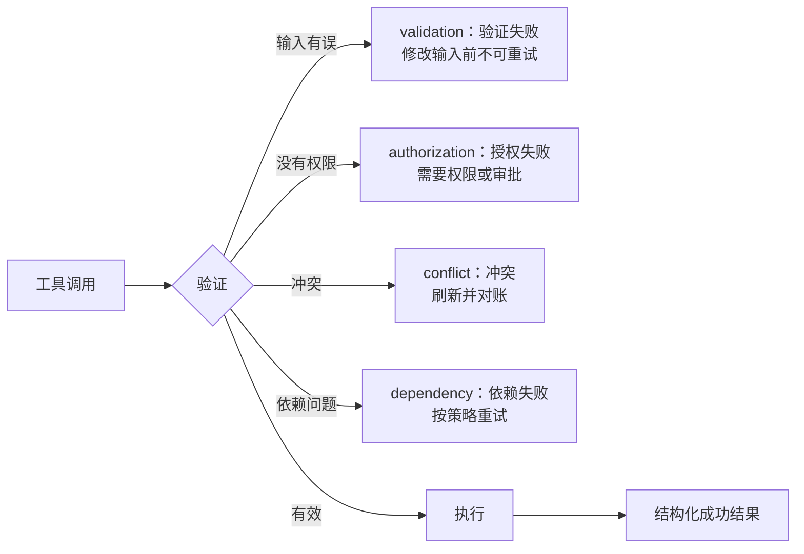

# 工具契约、错误与渐进式发现（Tool Contracts, Errors, and Progressive Discovery）

> 模型根据你描述的接口作出选择。含糊的工具会带来含糊的行为。

**Type:** Reference
**Languages:** Python
**Prerequisites:** [工具循环是受控委派（A Tool Loop Is Controlled Delegation）](../../10-tool-use-and-agentic-loops/), [MCP 将能力与宿主分离（MCP Separates Capability From Host）](../../11-mcp-server-design-and-integration/); 阶段 13，第 05 课
**Time:** ~120 分钟

## 学习目标（Learning Objectives）

- 编写边界互不重叠的工具名称、描述和模式（Schema）
- 设计结构化工具及 MCP 错误，引导安全恢复
- 有意识地使用工具选择，并缩小工具分发范围
- 为用户和项目划定 MCP 配置与密钥的作用域
- 对大型工具目录采用渐进式发现（Progressive discovery），同时保留授权控制

## 问题（The Problem）

智能体看到三个工具：

- `search`
- `find`
- `lookup`

它们的描述都写着“查找信息”。一个搜索公开网页，一个查询内部客户记录，一个检索已批准的政策。模式只接受一个字符串，错误则返回任意文本。

模型的选择不一致：公开研究任务查询了私有数据，政策问题却搜索网页。工具返回“失败”后，智能体不断重试，直到耗尽预算。

并不是模型不懂使用工具，而是接口抹去了安全选择所需的区别。

## 概念（The Concept）

### 工具描述也是决策依据（A Tool Description Is Part of the Decision Surface）

完善的工具契约应说明：

- 单一操作与对象
- 何时使用
- 何时不使用
- 权威数据边界
- 必需的身份或审批
- 参数含义及约束
- 结果与错误结构
- 副作用及其可逆性

比较下面的定义：

```json
{
  "name": "search",
  "description": "Search for information",
  "input_schema": {
    "type": "object",
    "properties": {"q": {"type": "string"}}
  }
}
```

与下面的定义：

```json
{
  "name": "search_active_support_policy",
  "description": "Search approved active support-policy text for the caller's region. Use for policy questions. Do not use for customer-account facts or public web research. Returns versioned policy passages with source IDs.",
  "input_schema": {
    "type": "object",
    "properties": {
      "query": {"type": "string", "minLength": 3},
      "region": {"type": "string", "enum": ["uk", "eu", "us"]},
      "top_k": {"type": "integer", "minimum": 1, "maximum": 8}
    },
    "required": ["query", "region", "top_k"],
    "additionalProperties": false
  }
}
```

第二个接口提供了选择边界和结果承诺。执行时，服务仍须验证身份与地区。

### 避免工具重叠（Avoid Overlapping Tools）

当模型无法判断哪个工具负责某个请求时，两个工具就发生了重叠。可通过以下方式修复接口：

- 将相同操作合并到一个工具后面
- 按可见对象或权限边界拆分
- 在名称中指出来源或副作用
- 加入适用和不适用的条件
- 当前 API 支持时提供输入示例
- 用容易混淆的工具对测试选择

不要靠增加提示词规则来弥补混乱的目录。

### 让模式承载不变条件（Make Schemas Carry Invariants）

使用类型、枚举、必填字段、边界、模式约束和封闭对象。名为 `options` 的字符串会把验证推给自然语言。带类型的字段让无效状态更难表达。

模式有效不代表语义有效。服务仍须检查账户是否存在、金额是否符合政策、用户是否有权操作，以及引用资源是否属于该租户。

### 将错误作为数据返回（Return Errors as Data）



错误契约应包含：

- 错误类别
- 是否可重试的标记
- 安全的消息
- 适用时提供字段错误
- 部分结果及来源信息
- 建议的安全下一步
- 追踪或事故引用

不要暴露堆栈追踪、密钥、原始凭据或内部路径。不要把所有错误都标为可重试。

对于 MCP 工具，使用协议的结构化错误信号，以及客户端能够解释的内容正文。传输成功与工具成功是两回事。具体字段应核对当前规范。

### 有意识地使用工具选择（Use Tool Choice Deliberately）

根据当前 API 提供的能力，工具选择控制可以要求使用工具、允许自动选择、指定某个工具，或禁止使用工具。

应用需要带类型的结果时，强制使用结构化工具输出。如果是否调用或调用哪个工具应由模型判断，就允许自动选择。不要仅为了获得 JSON 而强制执行现实操作。将提取与执行分开。

允许并行工具调用时，要确保调用相互独立，且运行框架（Harness）能将每个结果关联到正确的调用标识。

### 分配更少的工具（Distribute Fewer Tools）

工具列表消耗上下文，也增加选择。只给每个角色分配它所需的最小目录。

- 研究智能体：只读网页和来源工具。
- 政策智能体：有效政策资源与搜索。
- 退款建议者：读取案例并计算建议。
- 已获批准的执行者：一个受边界约束、需要有效新审批的写入工具。

不要为图方便给一个智能体分配全部四套目录。

### 渐进式发现大型目录（Discover Large Catalogs Progressively）

初始只提供常用工具和能力搜索机制。只有任务明确需要时，才加载专用定义。

渐进式发现可以改善：

- 上下文使用
- 工具选择
- 提示词缓存稳定性
- 安全评审范围

发现过程必须遵守身份与作用域限制，不能泄露受限能力的名称或描述。

### 划定 MCP 配置作用域（Scope MCP Configuration）

项目配置供团队使用，并纳入版本管理。用户配置适用于同一账户或机器上的多个项目。共享服务器声明和安全默认值应放在项目作用域中；个人路径、本地选择和用户专属凭据应留在提交文件之外。

通过环境变量引用密钥，绝不提交密钥值。评审服务器命令、参数、环境、传输方式、来源以及工具接口范围。

MCP 服务器可暴露工具、资源和提示词。根据控制方向选择原语（Primitive）：

- 工具（tool）：模型请求执行操作
- 资源（resource）：宿主或模型读取上下文数据
- 提示词（prompt）：用户或宿主调用可复用模板

不要把每个静态文档都包装成操作工具。

### 按意图选择 Claude Code 内置工具（Choose Claude Code Built-In Tools by Intent）

长期适用的边界是：

- Read：读取已知文件的内容
- Glob：发现路径
- Grep：搜索文本和符号
- Edit：对现有文件做有边界的修改
- Write：创建或完整替换文件
- Bash：执行命令、测试，以及没有更安全专用工具可用的操作

按任务限制 Bash 和写入工具。使用能表达预期操作、又能产生可检查证据的最专用接口。

## 动手实现（Build It）

## 交互实验（Interactive Lab）

```figure
18-tool-discovery-contract
```

使用发现契约图，对比重叠工具、渐进加载工具和执行授权。改变错误类别，观察何时只有重试、修改输入、申请审批或升级处理才是安全的继续方式。

## 实践实验（Practice Lab）

引入一处重叠描述，以及一项被标记为可重试的授权错误，观察两类失败，再修复接口与恢复契约。

## 交付物（Shipped Artifact）

填写完成的 [`outputs/tool-catalog-review.md`](../outputs/tool-catalog-review.md) 包含相互区分的政策、账户和公开搜索边界，以及失败矩阵。

## 验证（Verify It）

运行确定性的契约评审：

```bash
cd certifications/claude/lessons/18-tool-contracts-errors-and-progressive-discovery
python3 code/main.py
python3 -m unittest discover -s code/tests -v
```

测验检验相同的选择规则。

## 综合实践衔接（Capstone Connection）

将交付物带入架构师基础（Architect Foundations）综合实践，作为工具与 MCP 契约索引。

使用以下清单审计工具目录。

| 问题 | 证据 |
|----------|----------|
| 每个名称是否明确表示一个操作及其对象？ | 选择测试 |
| 适用和不适用场景是否区分清楚？ | 易混淆对评估 |
| 模式是否拒绝无效结构？ | 校验器测试 |
| 服务是否强制实施语义和授权规则？ | 集成测试 |
| 错误是否分类并考虑重试？ | 失败测试夹具 |
| 每个副作用是否都有名称和边界？ | 威胁模型 |
| 每个角色的工具是否最小化？ | 能力矩阵 |
| 大型目录能否渐进加载？ | 上下文与缓存测量 |
| 项目配置和用户配置是否分离？ | 配置评审 |
| 是否只引用密钥，而不存储其值？ | 仓库扫描 |

至少创建十二个选择用例，包含看起来可能同时匹配两个工具的查询。只有模型选择正确工具，或正确决定不调用工具，评估才通过。

注入验证、授权、冲突、限流、超时和部分结果失败。断言运行框架会根据类别改变行为。

## 实际应用（Use It）

对于结构化提取，定义一个无副作用工具，用模式表达所需记录。需要结构化记录时强制调用该工具，然后验证语义约束与来源。不要把生产写入工具复用为输出模式。

对于大型企业目录，使用注册表按任务和作用域查找能力。只加载选中的定义。监控目录大小、发现精度、工具选择、缓存命中以及未经授权的发现尝试。

## 考试决策模式（Exam Decision Patterns）

工具问题往往是接口问题。在增加提示词复杂度之前，先修复描述、边界、模式、分发和错误契约。

优先选择以下答案：

- 为工具提供不同名称以及不适用场景说明
- 返回带重试语义的结构化 `isError` 风格结果
- 在适合时通过工具选择强制带类型的输出
- 将项目配置与用户密钥分离
- 用资源表示上下文数据，用工具表示操作
- 对大型目录应用渐进式发现

## 常见陷阱（Common Traps）

### 把工具描述当成授权（Tool Description as Authorization）

“仅限管理员”只是文本。服务需要经过身份验证的权限范围和政策。

### 把错误文本当成恢复政策（Error Text as Recovery Policy）

模型只能猜测“失败”意味着重试、修改输入、升级处理还是停止。应返回明确的类别和重试状态。

### 一个工具负责所有操作（One Tool for Every Operation）

庞大的模式和条件行为会让选择、验证与授权变得困难。应沿有意义的边界拆分。

### 将密钥放入共享配置（Secrets in Shared Configuration）

项目文件是为协作设计的。引用环境变量名，并在版本控制之外提供具体值。

## 练习（Exercises）

1. 重写五个含糊的工具定义，使其边界清晰不同。
2. 为内部、公开和政策搜索构建易混淆对评估。
3. 为多来源搜索超时设计结构化部分结果。
4. 将单体 MCP 服务器拆分为工具、资源和提示词。
5. 创建不包含密钥值的项目配置和用户配置示例。

## 关键术语（Key Terms）

| 术语 | 常见说法 | 实际含义 |
|------|-----------------|------------------------|
| 工具契约（Tool contract） | 函数名 | 选择指导、模式、结果、错误、权限与副作用边界 |
| 不适用场景说明（Negative-use guidance） | 额外提示词 | 明确哪些情况下请求应由另一个接口负责 |
| 工具选择（Tool choice） | 工具权限 | 在请求级控制 Claude 是否必须调用工具，以及必须调用哪个工具 |
| 渐进式发现（Progressive discovery） | 动态授权 | 在限定作用域的发现后，按需加载相关能力 |
| MCP 资源（MCP resource） | 读取工具 | 通过资源原语标识和读取的上下文数据 |
| 项目作用域（Project scope） | 全局配置 | 面向单个仓库或团队的版本化配置 |

## 延伸阅读（Further Reading）

- [Claude 工具使用文档（tool use documentation）](https://platform.claude.com/docs/en/agents-and-tools/tool-use/overview)
- [MCP 规范（specification）](https://modelcontextprotocol.io/specification/latest)
- [Claude Code MCP 文档（documentation）](https://docs.anthropic.com/en/docs/claude-code/mcp)
- 阶段 13，第 05 课：工具模式设计
- 阶段 13，第 15 课：工具投毒威胁
