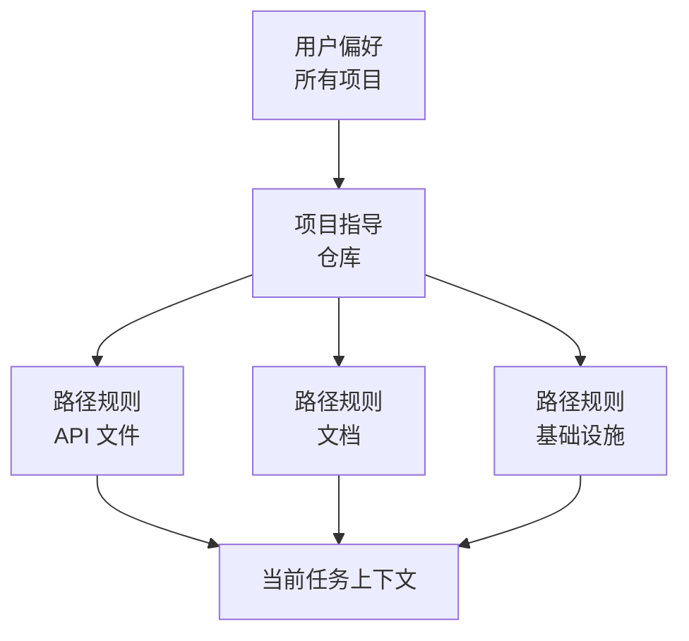

# Claude Code 记忆、规则、技能与 CI（Claude Code Memory, Rules, Skills, and CI）

> 将稳定指导放在它真正适用的作用域内；不能容忍失败的约束，则应交给可执行机制。

**Type:** Reference
**Languages:** Python
**Prerequisites:** [Claude Code 通过共享约束扩展协作（Claude Code Scales Through Shared Constraints）](../../15-claude-code-for-development-teams/), [Agent SDK 会话、子智能体与上下文（Agent SDK Sessions, Subagents, and Context）](../../17-agent-sdk-sessions-subagents-and-context/)
**Time:** ~210 分钟

## 学习目标（Learning Objectives）

- 设计项目和用户指令层级，避免上下文膨胀
- 按用途选择 CLAUDE.md、路径规则、技能（Skill）、命令、智能体、钩子和设置
- 编写并分发真正的多文件 `SKILL.md` 技能包，只预先批准小范围工具
- 使用规划、直接执行和有边界的子智能体，并明确报告障碍
- 配置无头（Headless）Claude Code，生成可复现的 CI 证据
- 防止过时记忆、过宽权限和隐藏的本地配置支配团队工作

## 问题（The Problem）

团队把所有指令放入根目录的一个 `CLAUDE.md`：架构历史、格式规范、数据库规则、部署步骤、个人偏好、命令以及六种语言的示例。每个任务都会复制这些内容。

开发者添加私有覆盖配置，CI 又采用不同配置。一条命令假定自己有写权限，一个范围过宽的钩子会重新格式化无关文件。指令要求“始终运行全部测试”，于是一次小文档修改也触发 40 分钟的测试套件。智能体忽略安全规则时，团队只会添加更多加粗文字。

问题并不是指令不足，而是作用域、优先级、渐进式披露（Progressive disclosure），以及把指导与强制执行混为一谈。

## 概念（The Concept）

### 让机制匹配工作（Match the Mechanism to the Job）

| 机制 | 最佳用途 | 避免 |
|-----------|----------|-------|
| `CLAUDE.md` | 精简稳定的仓库指导和索引 | 完整手册、临时状态、密钥 |
| 导入文件（Imported files） | 保存在所属模块附近的共享辅助指令 | 循环或不可见的指令图 |
| 路径规则（Path rules） | 只对匹配文件成立的指导 | 复制到每个任务的全局规则 |
| 技能（Skill） | 相关时加载的可复用流程或领域手册 | 一次性事实或硬性授权 |
| 命令（Command） | 用户显式调用工作流的兼容名称 | 不采用技能结构的新多步骤包 |
| 智能体（Agent） | 上下文和工具隔离、有边界的角色 | 确定性工具函数 |
| 钩子（Hook） | 确定性的验证、阻止、规范化或自动化 | 开放式语义判断 |
| 设置（Settings） | 权限、模型、插件与运行时配置 | 提交到仓库的密钥值 |

产品说明，核实于 2026-08-09：自定义命令已并入技能。`.claude/commands/` 下的文件仍然兼容，而新工作流优先采用 `.claude/skills/<name>/SKILL.md` 技能包。具体字段、优先级和产品可用性可能变化，实施前应核实当前 Claude Code 文档。2026 年 7 月的 CCAR-F 大纲要求理解层级、规则、命令、技能、智能体、记忆、规划和无头工作流。

### 保持根指令文件精简（Keep the Root Instruction File Small）

根文件应帮助有能力的新贡献者正确起步。

应包含：

- 项目用途和不明显的架构边界
- 标准构建、测试与格式化命令
- 权威来源文件
- 安全和范围约束
- 指向更深入指导的链接或导入
- 验证与贡献要求

应排除：

- 临时任务状态
- 自动生成的清单
- 冗长 API 参考
- 个人编辑器设置
- 密钥值
- 只适用于单个目录的指令

把它当作入门导航，而不是知识堆积场。

### 将指令放到真正适用的最窄作用域（Place Instructions at the Narrowest True Scope）



用户作用域保存不应定义团队行为的个人默认偏好。项目作用域保存纳入版本管理的共享决策。路径专用规则仅在文件模式匹配时加载。任务指令包含当前请求。

两条规则冲突时，调查文档规定的优先级，并明确项目的权威来源。关键工作流不能依赖隐藏的本地覆盖。

### 导入稳定的辅助指导（Import Stable Supporting Guidance）

通过导入保持根文件精简，同时保留模块化归属。例如数据库迁移政策应靠近数据库文档，根文件中的指针保证它可被发现。

审计导入图：

- 每个目标都存在
- 不存在循环
- 不会因导入范围过大而泄露密钥或带入无关文本
- 归属和更新触发条件明确
- 指导被删除或改名时会明确报错

记忆检查命令可以揭示哪些指令正在生效。用它们调试配置，不要用它们存储无法恢复的项目状态。

### 使用技能实现渐进式披露（Use Skills for Progressive Disclosure）

技能打包可重复的方法、参考资料、脚本和交付物。描述帮助智能体判断何时适用。只有被选中时才加载完整正文，为无关工作保留上下文。

合适的技能包括：

- 数据库迁移评审
- 事故分诊
- 发布说明生成
- 威胁模型检查清单
- 架构决策访谈

技能应定义输入、步骤、证据、输出和停止条件，不应嵌入密钥或授予权限。

实际项目技能位于 `.claude/skills/<skill-name>/SKILL.md`。入口文件包含 YAML 元数据头与 Markdown 指令：

```yaml
---
name: migration-review
description: Review database migration files when a change adds or modifies paths under migrations/. Use it before merge to collect forward, rollback, locking, and data-safety evidence.
allowed-tools: Read Grep Glob Bash(python3 ${CLAUDE_SKILL_DIR}/scripts/check_scope.py *)
---
```

描述是一份触发契约。用开发者实际会使用的语言说明技能做什么、何时适用。测试应该触发的请求，也测试看似接近却不该触发的请求。如果只能通过显式 `/skill-name` 调用加载，就使用 `disable-model-invocation: true`。

`allowed-tools` 在调用轮次内预先批准匹配的工具。它不限制可用工具集合，不覆盖拒绝规则，也不会作为会话授权持续生效。模式应与技能包流程一样窄，并在信任文件夹前评审项目技能。

将细节移出 `SKILL.md`，并明确引导加载：

| 技能文件 | 用途 | 加载条件 |
|---|---|---|
| `SKILL.md` | 触发条件、核心步骤、停止条件、输出契约 | 调用技能时 |
| `references/review-checklist.md` | 详细领域证据 | 核心步骤进入评审时 |
| `scripts/check_scope.py` | 确定性路径验证 | 读取请求中的迁移文件前 |
| `examples/accepted.md` | 一种代表性的输出结构 | 格式不明确时 |

在 `SKILL.md` 中引用每个辅助文件，让 Claude 知道为什么以及何时打开它。通过 `${CLAUDE_SKILL_DIR}` 解析包内路径，不要假定当前工作目录。交付的 [`outputs/migration-review-skill/`](../outputs/migration-review-skill/) 是可运行示例。

### 用命令表达明确用户意图（Use Commands for Explicit User Intent）

用户主动调用可重复工作流时，命令很有用。定义参数提示、允许的工具与执行上下文。若命令需要隔离，在支持且适合时使用分叉上下文。

例如：

- 评审一个迁移文件
- 根据访谈生成架构决策记录（ADR）
- 运行针对性测试计划
- 检查失败的 CI 追踪

避免使用会静默写入、部署或获得宽泛 Bash 访问的命令。名称和参数契约应清楚表明后果。

新工作应把这类显式工作流实现为用户可调用的技能。现有 `.claude/commands/<name>.md` 文件仍会创建 `/<name>`，可在不影响用户的情况下迁移。流程需要脚本、参考、模板、调用控制或插件分发时，优先使用技能目录。

### 让子智能体有边界地收集证据（Use Subagents as Bounded Evidence Gatherers）

运行 `/agents` 创建和管理可复用子智能体定义。项目智能体存入 `.claude/agents/`，让其角色与代码库一起接受评审。`description` 告诉 Claude 何时委派；`tools` 限制工具池；`maxTurns` 提供硬性轮次预算；`isolation: worktree` 为编辑智能体提供独立检出。

```markdown
---
name: migration-auditor
description: 当变更涉及 migrations/ 时，审查迁移安全性。返回证据和阻塞项；不要编辑文件。
tools: Read, Grep, Glob, Bash
maxTurns: 10
isolation: worktree
---

只检查分配的迁移及相邻模式代码。
十轮或二十分钟后停止，以先到者为准。
返回包含 status、evidence、blockers 和 next_step 的 JSON。
绝不以假设替代缺失的证据。
```

轮次或时间上限是停止条件，不是完成证据。父会话验证结果并负责集成。要求结构化障碍报告：子智能体无法访问文件时，应返回 `status: blocked`、确切障碍、已尝试取得的证据以及小范围的 `next_step`，而不是静默扩大工具或任务范围。

只有子智能体需要编辑时才使用工作树隔离。只读研究者通常只需独立上下文。工作树隔离文件和分支，不隔离网络、凭据、共享 Git 元数据或外部系统。

### 通过最小共享范围分发（Distribute Through the Smallest Shared Surface）

根据受众选择分发方式：

- 单个仓库使用时，提交 `.claude/skills/` 和 `.claude/agents/`。
- 多个仓库需要同一个版本化包时，把技能、智能体、钩子和 MCP 定义放入插件。
- 通过经过评审的市场发布插件，并固定发行版或提交。
- 用托管设置实施组织政策和市场限制，不要把所有团队流程都堆入其中。

项目可以在 `.claude/settings.json` 中声明市场并启用经过评审的插件：

```json
{
  "extraKnownMarketplaces": {
    "company-tools": {
      "source": {"source": "github", "repo": "company/claude-plugins"},
      "autoUpdate": false
    }
  },
  "enabledPlugins": {
    "migration-review@company-tools": true
  }
}
```

文件夹信任仍然重要，托管的 `strictKnownMarketplaces` 可在任何网络或文件系统操作之前限制用户能添加的来源。评审发布者、版本、组件、脚本、钩子、MCP 服务器、权限、更新和回滚。项目默认值是团队配置；托管设置是不可覆盖的组织政策。

### 使用路径规则表达局部政策（Use Path Rules as Local Policy）

路径通配模式（Glob）可表达以下规则：

- API 修改需要契约测试
- 迁移文件只能追加
- 文档使用规定风格
- 生产配置不能包含字面量密钥

测试通配模式的行为。永不匹配的规则会造成虚假信心；匹配整个仓库的模式则再次造成根文件膨胀。

### 分离规划、探索与执行（Separate Planning, Exploration, and Execution）

修改之前需要批准范围或策略时，使用规划模式。对于会使主任务上下文膨胀的只读代码库问题，使用探索子智能体。修改范围已经明确、下一步安全操作清楚时，直接执行。

需求缺失时可以采用访谈模式。提出会实质影响实现的问题，记录决策，然后构建。

示例和测试只有展示实际验收边界，才能提高一致性。不要添加只是重复指令的示例。

### 让测试成为对话契约的一部分（Make Tests Part of the Conversation Contract）

对于代码任务：

1. 确认行为和最小相关验证。
2. 可行时建立或编写失败测试。
3. 做有边界的修改。
4. 运行针对性测试。
5. 按风险运行更广泛的门禁。
6. 检查实际交付物或行为。
7. 报告确切证据和剩余不确定性。

Claude 可以提出并执行这一循环，但门禁是否通过由确定性 CI 决定。

### 钩子决策需要精确契约（Hook Decisions Need Exact Contracts）

Claude Code 向钩子发送 JSON。命令钩子要么以 `0` 退出，并向 stdout 输出一个结构化 JSON 对象；要么以 `2` 退出，并向 stderr 写入阻止原因。不要混用，因为仅在退出码为 `0` 时才解析 JSON。对大多数事件，退出码 `1` 不会阻止执行。

事件模式不能互换。`PreToolUse` 使用 `hookSpecificOutput.permissionDecision`，值为 `allow`、`deny`、`ask` 或 `defer`。`PermissionRequest` 使用 `hookSpecificOutput.decision.behavior`，值为 `allow` 或 `deny`。配置中的拒绝与询问规则仍会被评估；允许结果不能覆盖匹配的拒绝规则。

```json
{
  "hookSpecificOutput": {
    "hookEventName": "PermissionRequest",
    "decision": {
      "behavior": "deny",
      "message": "Production access requires interactive approval"
    }
  }
}
```

确认退出码 `2` 能否阻止所选事件。它可以阻止 `PreToolUse`，拒绝 `PermissionRequest`，却不能撤销 `PostToolUse` 已观察到的操作。

### 将无头 CI 设计为全新的评审者（Design Headless CI as a Fresh Reviewer）

无头 Claude Code 可使用打印模式和结构化输出进行非交互运行。使用前核实当前标志与模式。长期适用的原则是：

- 从干净提交和声明输入开始
- 使用最小权限的工具与设置
- 固定或记录模型与配置
- 设置时间、轮次和成本边界
- 请求 JSON 或受模式约束的输出
- 将发现生成与修改应用分离
- 需要时运行独立评审
- 检查修复时显式包含先前发现
- 让确定性测试与政策门禁拥有最终判定权

CI 不应继承交互式开发者会话。可复现性要求全新状态。

产品说明，核实于 2026-08-09：Anthropic 的托管 Code Review 产品是面向 Team 和 Enterprise 套餐的研究预览版。它与官方 GitHub Action 是不同的运维选择。托管 Code Review 报告拉取请求发现，但不批准或阻止合并。`anthropics/claude-code-action@v1` 在仓库工作流中运行，明确配置事件、GitHub 权限、密钥来源、设置、工具、模型和轮次边界。二者均不替代确定性门禁或受保护的合并路径。

### 跨运行保留发现（Preserve Findings Across Runs）

若一次运行发现问题，另一次验证修复，应把发现存为结构化交付物，包含稳定 ID、文件、证据、严重程度和状态。只传自然语言摘要可能丢失正在验证的确切主张。

修复评审收到原始发现、当前差异、相关测试和验收规则，不需要原始完整对话。

## 动手实现（Build It）

## 交互实验（Interactive Lab）

```figure
19-memory-rule-precedence
```

使用优先级探索器，将稳定项目事实、路径专用指导、可复用技能、命令和确定性钩子放到真正适用的最窄作用域。冲突层级会展示为什么隐藏的本地政策不能支配 CI。

## 实践实验（Practice Lab）

破坏一个已记录的路径通配模式，检查哪些夹具路径会加载规则，然后修复作用域，不要把窄范围指导移回根文件。再分别用一个迁移路径和一次目录穿越尝试运行附带的技能检查器：

```bash
python3 outputs/migration-review-skill/scripts/check_scope.py migrations/2026_add_index.sql
python3 outputs/migration-review-skill/scripts/check_scope.py ../secrets.sql
```

## 交付物（Shipped Artifact）

填写完成的 [`outputs/configuration-scope-audit.md`](../outputs/configuration-scope-audit.md) 记录已测试的通配夹具、一组允许与拒绝边界、有边界的子智能体、插件分发、确切钩子输出以及全新 CI 契约。[`outputs/migration-review-skill/`](../outputs/migration-review-skill/) 目录交付真正的 `SKILL.md`、确定性脚本和按需参考资料。

## 验证（Verify It）

不使用 Claude、网络或凭据即可验证：

```bash
cd certifications/claude/lessons/19-claude-code-memory-rules-skills-and-ci
python3 code/main.py
python3 -m unittest discover -s code/tests -v
```

测验检查机制选择与 CI 修复。

## 综合实践衔接（Capstone Connection）

在架构师基础（Architect Foundations）综合实践的 Claude Code 配置章节复用结果。

为包含 Python API 代码、数据库迁移和文档的仓库设计团队配置。

### 根级指导（Root Guidance）

限制在可读的一页以内，包含项目地图、标准命令、安全约束以及路径规则链接。

### 路径规则（Path Rules）

分别为以下路径创建规则：

- `src/api/**`：契约与授权测试
- `migrations/**`：仅追加与回滚要求
- `docs/**`：风格与链接检查

### 技能与命令（Skills and Commands）

将附带的迁移评审技能包安装为 `.claude/skills/migration-review/`，测试一个应触发和一个接近但不应触发的请求，并保留窄范围的 `allowed-tools` 预批准。显式 `/adr` 命令需要模板或脚本时，将其迁移为技能。

通过 `/agents` 定义一个只读迁移审计者。为它设置 `maxTurns`，结构化的 `status` / `evidence` / `blockers` / `next_step` 结果，以及证据缺失时停止而不是假设的规则。

### 钩子（Hooks）

- 写入前：阻止超出声明范围的文件
- 编辑后：只对已编辑文件运行格式化工具
- Bash 前：拒绝破坏性命令或打印密钥的命令
- 停止时：要求确切验证证据

### CI 评审（CI Review）

从全新状态运行只读评审，输出 JSON 发现。由独立作业执行确定性测试与政策检查，并保存两份交付物。

然后测试配置调试：引入一个无法匹配的路径通配模式，证明审计能够发现。

## 实际应用（Use It）

配置应像代码一样接受评审。配置变化可能改变权限、上下文、工具和自动行为。

以下情况需要评审：

- 新增 MCP 服务器或插件
- 扩大工具权限
- 具有写入或命令效果的钩子
- 更换模型或服务商
- 新增导入和路径模式
- 访问外部系统的技能
- 使用更广工具、更高轮次上限或工作树隔离的智能体
- 插件市场、启用的插件及自动更新政策
- 能够应用修改的 CI 工作流

通过小型夹具任务记录当前行为。配置测试可以断言：迁移指导只对迁移路径加载，危险命令被阻止，评审命令返回预期模式。

## 考试决策模式（Exam Decision Patterns）

指令太大或只适用于部分文件时，移到限定作用域的规则或技能。某个条件绝不能违反时，使用确定性设置、权限、钩子或 CI，而不是加强提示词措辞。

优先选择以下答案：

- 保持 `CLAUDE.md` 精简并纳入版本管理
- 用导入和路径专用规则提供窄范围指导
- 把可复用工作流打包为技能或显式命令
- 编写技能触发描述、辅助文件和窄范围调用预批准
- 用工具集、轮次、归属和结构化障碍报告约束子智能体
- 直接分发单项目配置，将跨项目包作为经过评审的插件分发
- 需要时为隔离的命令工作分叉上下文
- 大范围编辑前先规划或探索
- 从干净状态运行无头 CI，并提供结构化输出
- 对照先前发现 ID 验证修复

## 常见陷阱（Common Traps）

### 把根文件当百科全书（Root File as Encyclopedia）

所有内容到处加载。重要约束与无关细节争夺注意力，也会因缺少负责人而逐渐失效。

### 把私有配置当团队政策（Private Configuration as Team Policy）

本地行为无法评审，也不能在 CI 中复现。共享决策应放在项目作用域。

### 把钩子当隐藏构建系统（Hook as Hidden Build System）

不透明自动化会让命令行为出乎意料，使失败难以定位。保持钩子小巧且可观测。

### 将 AI 评审作为唯一门禁（AI Review as the Only Gate）

模型发现辅助判断；确定性测试、模式、安全政策和审批负责强制不变条件。

## 练习（Exercises）

1. 把膨胀的根指令文件缩成一页导航。
2. 设计路径规则，并编写能证明每个通配模式匹配行为的夹具路径。
3. 将 200 行工作流提示词改为多文件技能，包含触发测试、参考文件和确定性脚本。
4. 通过 `/agents` 创建只读子智能体；限制轮次并测试其被阻塞时的障碍报告。
5. 使用各自不同的 JSON 结构，验证 `PreToolUse` 拒绝和 `PermissionRequest` 拒绝。
6. 将技能与智能体打包为插件，在测试市场固定版本，并记录回滚步骤。
7. 创建只读无头评审模式，包含稳定的发现 ID。

## 关键术语（Key Terms）

| 术语 | 常见说法 | 实际含义 |
|------|-----------------|------------------------|
| CLAUDE.md | 永久模型记忆 | 按文档规定作用域加载的版本化项目指导 |
| 路径规则（Path rule） | 额外提示词 | 仅对匹配文件路径激活的指导 |
| 技能（Skill） | 命令别名 | 按需加载指令、参考、工具和输出的可复用流程 |
| 命令（Command） | 自动化魔法 | 具有参数、工具及上下文行为的用户显式调用工作流 |
| `allowed-tools` | 沙箱 | 在技能调用轮次内对匹配工具的临时预批准 |
| 子智能体（Subagent） | 无限并行工作者 | 具有声明角色、工具、轮次预算和结果契约的独立上下文 |
| 插件（Plugin） | 提示词文件 | 技能、智能体、钩子、MCP 服务器及相关配置的版本化包 |
| 钩子（Hook） | 模型指令 | 围绕生命周期事件运行的确定性代码 |
| 无头模式（Headless mode） | 没有界面的交互聊天 | 基于声明输入、输出机器可读结果的非交互执行 |

## 延伸阅读（Further Reading）

- [Claude Code 记忆文档（memory documentation）](https://code.claude.com/docs/en/memory)
- [Claude Code 技能（Skills）](https://code.claude.com/docs/en/skills)
- [Claude Code 子智能体（subagents）](https://code.claude.com/docs/en/sub-agents)
- [Claude Code 工作树（worktrees）](https://code.claude.com/docs/en/worktrees)
- [Claude Code 设置（settings）](https://code.claude.com/docs/en/settings)
- [Claude Code 插件市场（plugin marketplaces）](https://code.claude.com/docs/en/plugin-marketplaces)
- [Claude Code 钩子（hooks）](https://code.claude.com/docs/en/hooks)
- [Claude Code 托管 Code Review](https://code.claude.com/docs/en/code-review)
- [Claude Code GitHub Actions](https://code.claude.com/docs/en/github-actions)
- [Claude Code 无头模式（headless mode）](https://code.claude.com/docs/en/headless)
- 阶段 14，第 33 至 38 课：可执行指令、状态、范围与验证
