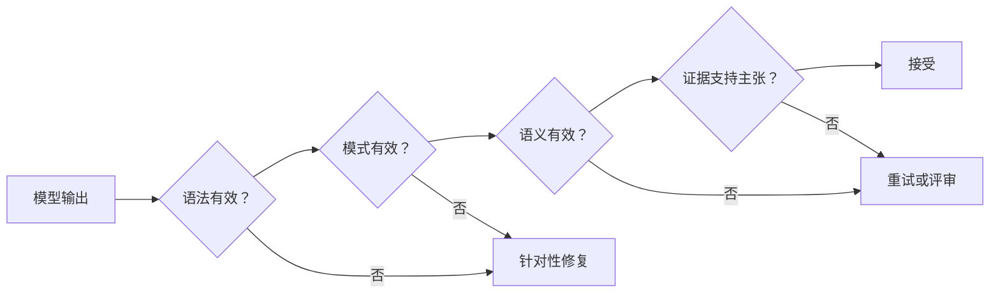

# 可靠提取、批处理与独立评审者（Reliable Extraction, Batch, and Independent Reviewers）

> 有效的 JSON 只证明结构得以保留，不能证明事实也得以保留。

**Type:** Reference
**Languages:** Python
**Prerequisites:** [验证主张，而非置信度（Validate the Claim, Not the Confidence）](../../05-output-evaluation-and-validation/), [结构化输出是不可信契约（Structured Output Is an Untrusted Contract）](../../09-structured-output-and-defensive-parsing/); 阶段 14，第 39 课
**Time:** ~135 分钟

## 学习目标（Learning Objectives）

- 定义提取标准，减少假阳性（False positive）和模糊标签
- 有意识地使用模式、示例、可空字段、枚举与证据片段
- 分离语法、模式、语义和来源验证
- 设计有边界的重试与独立评审轮次
- 根据工作流要求选择实时或批处理

## 问题（The Problem）

一条流水线把合同义务提取为有效 JSON。每条记录都符合模式，法律评审者却仍拒绝其中的 18%。

模型用看似合理的值填补缺失日期，把背景陈述标成义务，并将不熟悉的类别映射到最接近的枚举。重试循环不断传回同一提示词，直到验证通过。由于验证只检查类型，编造值只是被包装得更加确定。

团队解决了序列化，却误把它当成正确性。

## 概念（The Concept）

### 先定义判断，再定义模式（Define the Judgment Before the Schema）

模式说明有哪些字段，标准说明什么才符合条件。

对于义务提取器，应规定：

- 义务承担方必须明确写出，或有无歧义的关联
- 必须明确陈述所要求的行为，而非仅仅讨论它
- 只在有依据时提取触发条件和截止日期
- 证据片段必须包含该主张
- 未知值保持 `null`
- 不受支持的类别使用 `other` 并附注，或触发评审
- 例外和否定会改变结果

没有这些规则，标注者、模型和评估器实际上在执行不同任务。

### 用少样本示例说明边界（Use Few-Shot Examples for Boundaries）

合理的人可能作出不同判断的地方，最需要示例。

应包含：

- 一个明确正例
- 一个接近但不符合的例子
- 一项被否定的义务
- 用 `null` 表示缺失日期
- 一个枚举范围之外的类别
- 同一段落中的两项义务
- 相互冲突的条款

每个示例应展示理由，而非只有答案。不要用重复的简单案例淹没上下文。

### 让缺失可以表示（Make Absence Representable）

如果某字段可能未知，模式就需要显式状态。强制字符串会鼓励编造。

```json
{
  "type": "object",
  "properties": {
    "party": {"type": ["string", "null"]},
    "action": {"type": "string"},
    "deadline": {"type": ["string", "null"]},
    "category": {
      "type": "string",
      "enum": ["payment", "delivery", "reporting", "other"]
    },
    "evidence_span": {"type": "string"},
    "needs_review": {"type": "boolean"}
  },
  "required": ["party", "action", "deadline", "category", "evidence_span", "needs_review"],
  "additionalProperties": false
}
```

必填加可空会强制明确选择：有依据的值，或已知的缺失。这样可防止静默省略字段。

### 用工具调用实现带类型的输出（Use Tool Use for Typed Output）

无副作用的提取工具可以承载模式。应用需要时，可通过工具选择强制生成带类型记录。当前 API 支持严格模式功能时，可以保证结构有效。

不要为了获得结构化输出而调用真实操作工具。提取与执行所需权限不同。

### 分四层验证（Validate in Four Layers）



#### 语法（Syntax）

载荷能否被解析？

#### 模式（Schema）

字段、类型、枚举与边界是否有效？

#### 语义（Semantics）

跨字段关系是否成立？如果领域规则不允许，截止日期不能早于生效日期。`needs_review` 为 false 的结果不能同时包含不受支持的类别。

#### 来源（Provenance）

证据片段是否真正支持提取出的主张，且是否来自正确的来源版本？

许多看似自信的幻觉，只有后两层才能发现。

### 反馈最小但有用的错误（Feed Back the Smallest Useful Error）

修复时，返回结构化验证反馈：

```json
{
  "category": "semantic_validation",
  "field": "deadline",
  "message": "The extracted date does not appear in the evidence span.",
  "allowed_action": "Set deadline to null or select a supported span."
}
```

不要只说“再试一次”。保留原始来源和先前结果，限制重试。重复的语义失败应升级处理，而不是把不确定性转化为延迟和成本。

### 分离生成者与评审者（Separate Generator and Reviewer）

生成者负责提取。评审者收到来源、候选记录和评分标准，检查：

- 所需证据是否存在
- 片段是否支持每项非空主张
- 是否处理了否定与例外
- 类别是否符合定义
- 是否没有编造未知值
- 是否标记了冲突和歧义

使用全新上下文增强独立性。评审者返回发现 ID、字段、证据与处置意见，不静默重写记录。

根据人工标签测量评审者的精确率和召回率。模型裁判是测量工具，不是真值。

### 按工作流选择批处理（Choose Batch for the Workflow）

2026 年 7 月的 CCAR-F 公开指南规定：Message Batches 成本降低 50%，处理窗口最长 24 小时且没有保证延迟的服务等级协议（SLA），单个批请求内不支持多轮工具调用。这些是注明日期的考试参考事实，不是价格或服务限制永不变化的承诺。部署前，应在 [Message Batches 文档（documentation）](https://platform.claude.com/docs/en/build-with-claude/batch-processing) 中确认当前价格、限制、保留政策和功能兼容性。

批处理适合：

- 大规模离线提取
- 评估数据集
- 夜间分类
- 历史数据补处理与重新处理
- 生成后的独立评审

实时处理适合：

- 交互式用户响应
- 有严格短延迟上限的任务
- 同一请求内的自适应工具使用
- 需要即时审批或反馈的工作流

若下一步取决于模型必须在请求中途观察到的外部操作，就不要使用批处理。应预先计算输入，或把工作流拆成多个作业。

### 让批处理作业能够对账（Make Batch Jobs Reconciliable）

为每个项目提供稳定的 `custom_id`。持久化来源版本、模式版本、提示词版本和预期输出位置。结果可能乱序返回。

处理以下情况：

- 成功
- 验证失败
- 服务商失败
- 过期
- 重复提交
- 作业部分完成
- 来源变化后重试

绝不要按数组位置关联结果与输入。

### 评估真正关心的错误（Evaluate the Error You Care About）

对于提取，应测量：

- 字段精确率与召回率
- 适用时的精确或归一化匹配
- 证据支持率
- 高风险字段的假阳性率
- 空值校准
- 类别混淆矩阵
- 评审者分歧
- 每条获接受记录的成本和延迟

平均值可能掩盖危险的假阳性类别。应按文档类型、语言、长度和风险分层。

## 动手实现（Build It）

## 交互实验（Interactive Lab）

```figure
20-batch-review-confidence
```

使用置信度与评审模拟器，让记录依次通过语法、模式、语义和来源门禁。调整假阳性成本与评审覆盖率，观察为什么有效 JSON 和模型置信度不足以作为发布标准。

## 实践实验（Practice Lab）

将一个有依据的日期改成编造值，运行四层验证，把失败记录转交裁决，而不是再次盲目重试。

## 交付物（Shipped Artifact）

填写完成的 [`outputs/extraction-review-report.md`](../outputs/extraction-review-report.md) 包含一个批处理作业，其中有稳定的 `custom_id` 值、可空未知值、乱序结果、评审发现以及裁决状态。

## 验证（Verify It）

运行其确定性校验器：

```bash
cd certifications/claude/lessons/20-reliable-extraction-batch-and-reviewers
python3 code/main.py
python3 -m unittest discover -s code/tests -v
```

测验检查修复、批处理与评审者决策。

## 综合实践衔接（Capstone Connection）

将经过验证的报告带入架构师基础（Architect Foundations）的提取场景，作为全部四层验证的证据。

为客服政策变更创建提取流水线。

### 输出契约（Output Contract）

提取政策 ID、生效日期、受影响地区、操作类型、阈值、证据片段、来源版本和评审状态。每个不确定字段都应可空，或有显式 `other` 状态。

### 数据集（Dataset）

构建至少 40 个示例：

- 15 个明确变更
- 10 个不包含变更的背景陈述
- 5 个否定或例外
- 5 个缺失日期或阈值的案例
- 5 个版本冲突案例

### 处理轮次（Passes）

1. 使用严格模式的生成者
2. 确定性的语法和模式验证
3. 语义关系验证
4. 独立证据评审者
5. 对分歧进行人工裁决

### 实验（Experiment）

对比零样本标准、少样本边界示例以及生成者加评审者方案。报告假阳性、证据支持、成本和延迟。

### 批处理设计（Batch Design）

用稳定 ID 提交记录，在测试中随机打乱结果顺序。注入部分失败，证明对账会保留已完成记录，并只重试安全项目。

## 实际应用（Use It）

生产中，将原始来源与归一化提取结果分开保存，保留来源版本和证据偏移量。标准或模式变化时创建新输出版本，不要覆盖历史决策。

人工修正记录时，存储原因码。修改提示词前，先利用分歧改进标准和评估集。

高风险提取可以分层评审：覆盖每个高影响字段、证据不足的记录或新文档类型，再随机抽样普通案例。

## 考试决策模式（Exam Decision Patterns）

JSON 有效但内容错误时，加入语义和证据验证。判断边界处一致性较差时，使用明确标准和少样本示例。

优先选择以下答案：

- 使用 `null` 或 `other`，而非编造
- 强制带类型的输出，但不触发真实操作
- 回传具体验证错误，并限制重试
- 分离生成者与评审者
- 对异步且不依赖工具的负载使用批处理
- 使用稳定 ID 对账结果

## 常见陷阱（Common Traps）

### 模式等于事实（Schema Equals Truth）

类型不能证明值出现在来源中，或能从来源推出。

### 必填且不可空字段（Required Non-Nullable Fields）

契约没有表示缺失的方式，模型便编造一个看似合理的值。

### 无限修复（Infinite Repair）

同一模糊来源不断产生猜测。尝试达到限定次数后，应升级处理。

### 评审者静默重写（Reviewer Rewrites Silently）

系统会丢失哪项主张失败及其原因。任何受控修正前，先返回结构化发现。

## 练习（Exercises）

1. 添加关联阈值与币种的语义规则。
2. 设计减少错误义务提取的负例。
3. 根据人工标签校准评审者，并报告分歧。
4. 为乱序批结果构建稳定 ID 对账。
5. 对比单遍流水线与评审流水线的每条获接受记录成本。

## 关键术语（Key Terms）

| 术语 | 常见说法 | 实际含义 |
|------|-----------------|------------------------|
| 结构化输出（Structured output） | 正确数据 | 符合机器可读结构的数据 |
| 语义验证（Semantic validation） | 模式验证 | 检查值和关系在领域中是否合理 |
| 来源验证（Provenance validation） | 有效引用 | 证明来源证据支持确切的提取主张 |
| 可空（Nullable） | 可选字段 | 为未知或缺失值提供显式受支持状态 |
| 批处理（Batch） | 更快的 API | 针对离线数据量和不同成本或延迟约束优化的异步处理 |
| 裁决（Adjudication） | 重试 | 由具备资格的人作出决策，解决评估者或标签分歧 |

## 延伸阅读（Further Reading）

- [Claude 结构化输出文档（structured outputs documentation）](https://platform.claude.com/docs/en/build-with-claude/structured-outputs)
- [Claude Message Batches 文档（documentation）](https://platform.claude.com/docs/en/build-with-claude/message-batches)
- 阶段 11，第 03 课：从基本原理理解结构化输出
- 阶段 14，第 39 课：评审智能体
- 阶段 17，第 15 课：批处理架构
