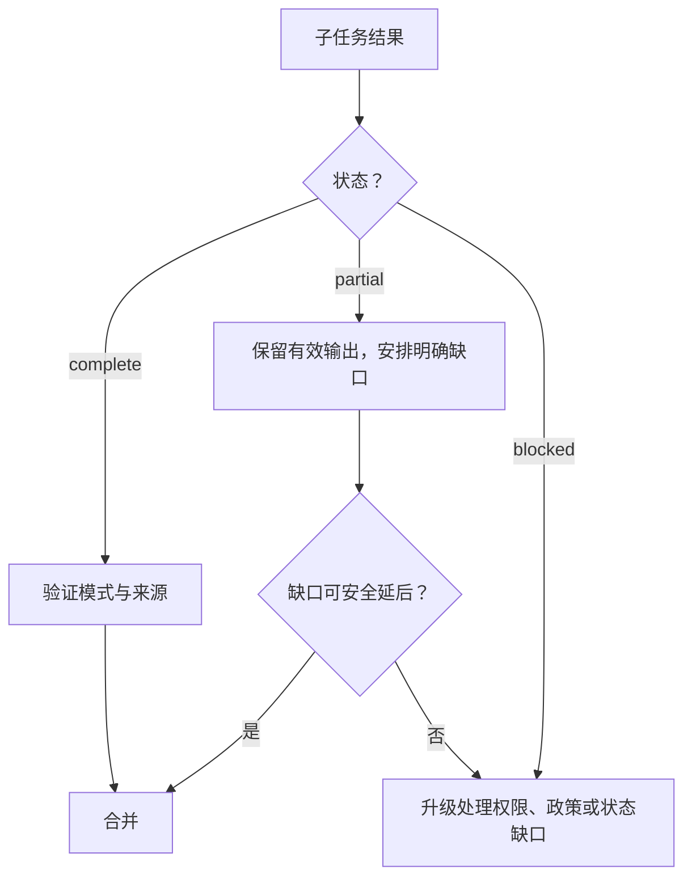

# 让大型上下文可观测（Make Large Context Observable）

> 大上下文窗口可以容纳更多证据，却不能告诉你哪些证据被注意到了、仍然有效、具有权威性，或足以安全地指导行动。

**Type:** Reference
**Languages:** Python
**Prerequisites:** [Agent SDK 会话、子智能体与上下文（Agent SDK Sessions, Subagents, and Context）](../../17-agent-sdk-sessions-subagents-and-context/), [工具契约、错误与渐进式发现（Tool Contracts, Errors, and Progressive Discovery）](../../18-tool-contracts-errors-and-progressive-discovery/), [可靠提取、批处理与独立评审者（Reliable Extraction, Batch, and Independent Reviewers）](../../20-reliable-extraction-batch-and-reviewers/)
**Time:** ~150 分钟

## 学习目标（Learning Objectives）

- 合理放置并检索关键事实，减少中间信息丢失（Lost in the middle）。
- 精简工具输出，同时保留来源、错误、冲突和决策相关细节。
- 在智能体工作流中传递 complete、partial 和 blocked 结果。
- 为大型代码库中的不同工作使用清单、草稿区、子智能体和压缩。
- 根据证据与后果校准置信度，并分层安排人工评审。
- 在摄取和渲染过程中保留来源身份、日期、冲突与内容类型。

## 问题（The Problem）

迁移协调者收到 140 个文件、三份架构文档、一份依赖报告、测试日志和四个子智能体的结果。提示词没有超出宣称的上下文窗口。

最终计划却仍违反安全规则。规则只出现在一份长架构文档的中间位置。包含集成测试失败的工具结果被缩为“测试大部分通过”。一个子智能体评审了 24 个文件中的 18 个便超时，但文字摘要看上去已完成。Markdown 表格在提取时丢失列间关系，使已弃用依赖看起来仍受支持。

没有任何内容超过标称词元限制。系统失败的原因是关键事实位置不醒目、元数据消失、部分工作看似完成，而且没人定义升级处理规则。

上下文可靠性不是容纳更多文字的能力，而是保留正确状态、暴露不确定性，并在证据不足时将决策交给合适对象的能力。

## 概念（The Concept）

### 上下文具有注意力拓扑（Context has an attention topology）

模型不会在每个任务中认为每个词元都同样有用。长输入会让证据更难定位，尤其当相关事实被类似或冲突材料包围时。这通常称为中间信息丢失。

有意识地安排位置：

1. 将任务、决策、硬性约束和输出契约放在证据之前。
2. 按文件、主张、来源或子系统等稳定身份组织证据。
3. 在模型必须回答之前紧接着放置当前问题。
4. 只在最终请求附近重复少数关键约束。
5. 针对当前决策检索小范围证据，不携带整个档案。

不要在首尾重复每条规则。重复消耗上下文，还可能强化过时指令。只突出那些遗漏后会造成实质失败的不变条件。

```text
目标与硬性约束
当前清单与未解决缺口
带元数据的相关证据块
针对当前决策的问题
要求的结果与升级处理模式
```

若能可靠选择证据，检索通常优于一个庞大提示词。大窗口是为剩余难例提供容量，不是跳过信息架构设计的许可。

### 证据需要封装（Evidence needs an envelope）

原始文本不够。为每个重要单元附上结构化元数据：

```json
{
  "evidence_id": "policy-auth-017",
  "source_uri": "repo://docs/security/authentication.md",
  "source_version": "git:3a91c7e",
  "content_type": "text/markdown",
  "effective_date": "2026-07-15",
  "observed_at": "2026-08-08T10:30:00Z",
  "authority": "approved-architecture-policy",
  "scope": ["services/auth/**"],
  "extractor": "markdown-section-v2",
  "location": {"heading": "Token rotation", "lines": [88, 112]},
  "status": "active"
}
```

这些值仅为示例。证据封装（Envelope）能回答纯文字无法回答的问题：

- 智能体看到了哪个版本？
- 它是政策、草稿，还是生成摘要？
- 它约束哪些文件或主张？
- 能否检查原始片段？
- 是否有更新或更权威的其他来源？

每次交接都保持来源正文与元数据关联。没有身份信息的简洁摘要很难验证。

### 按决策价值精简工具输出（Trim tool output by decision value）

工具输出可能占据大量上下文。精简应删除重复，而非状态。

保留：

- 工具调用与追踪 ID
- 命令或查询及其限定目标
- 退出或完成状态
- 结构化错误与可重试性
- 受影响的文件、记录或主张
- 失败断言及最小支持片段
- 计数、总数和省略项目数
- 来源版本与时间戳
- 冲突和未解决缺口
- 指向完整外部交付物的指针

删除或外置：

- 重复进度行
- 重复堆栈帧
- 不提供独特证据的成功行
- 装饰性格式
- 已通过稳定引用存储的大段正文

尽可能使用确定性适配器：

```json
{
  "status": "partial",
  "summary": "18 of 24 files reviewed; 2 findings; 6 files not processed",
  "findings": ["finding-014", "finding-015"],
  "errors": [
    {
      "category": "dependency_timeout",
      "retryable": true,
      "scope": ["services/payments/**"],
      "trace_id": "trace-8801"
    }
  ],
  "full_artifact": "artifact://review/run-224"
}
```

“大部分通过”删掉了最重要的区别：究竟哪部分没通过。

### 完成、部分完成与阻塞是一等状态（Complete, partial, and blocked are first-class states）

每个任务契约都应定义三种结果：

- **完成（Complete）：** 每个必需部分都满足输出契约。
- **部分完成（Partial）：** 已有有效工作，但仍缺少明确指出的范围或证据。
- **阻塞（Blocked）：** 安全继续需要新的权限、政策、数据或外部状态。

部分完成既不是失败，也不是完成。协调者可保留有效发现，只重试符合条件的缺口，防止综合结果时把未做工作理解为没有问题。



错误需要类别、可重试性、安全消息、受影响范围、部分结果引用和建议下一步。超时可能可重试，授权拒绝不能靠重试解决，模糊政策需要负责人而不是更多词元。

### 升级处理应说明原因，而非只表达担忧（Escalate the reason, not the anxiety）

升级处理应指出缺少哪项决策：

| 条件 | 安全响应 |
|---|---|
| 缺少证据 | 指明需要的来源和受影响结论 |
| 权威来源冲突 | 保留双方，应用已有优先级规则，或交给负责人 |
| 政策缺口 | 停止受约束操作，请政策负责人提供规则 |
| 权限缺口 | 申请限定范围的访问，或选择已批准替代路径 |
| 反复语义失败 | 停止有限重试，请求裁决 |
| 外部副作用不明 | 重试前对账状态 |

不要仅以“模型不确定”为由升级。提供来源 ID、已尝试的检查、确切歧义、后果、截止时间和可选安全方案。

### 大型代码库需要四种不同记忆工具（Large codebases need four different memory tools）

这些机制有关联，但不能互换。

#### 清单（Manifest）

清单（Manifest）是持久化地图，包含文件 ID、归属、用途、依赖、评审状态、哈希、发现和未完成工作。它支持覆盖率检查与恢复，在对话之外仍是权威状态。

#### 草稿区（Scratchpad）

草稿区（Scratchpad）支持当前有边界任务的临时推理，例如搜索假设、候选文件和下一步检查。它可以丢弃。绝不把决策、审批或已完成操作的唯一副本存在那里。

#### 子智能体（Subagent）

子智能体针对有边界的问题获得隔离上下文，返回带文件和证据引用的结构化结果。隔离减少上下文竞争，但协调者仍须强制覆盖率与合并规则。

#### 压缩（Compaction）

压缩将不断增长的会话缩为当前目标、约束、已验证工作、未解决缺口、证据引用和下一步操作。它控制上下文大小，不保证事实正确或状态持久化。

组合使用它们：

```text
清单说明有哪些内容、哪些已完成
草稿区帮助决定下一次有边界的搜索
子智能体隔离一项推理职责
压缩重建较小的当前工作集
```

大型仓库先建立结构与依赖地图，再检索最小的关联片段。让有边界的子智能体检查特定子系统，把归一化发现返回清单。最后根据清单和已接受证据做跨文件检查，而非检查原始对话记录。

### 置信度应根据证据校准（Confidence should be evidence-calibrated）

模型生成的百分比不会因为有两位小数就自动经过校准。通过可观测证据表达置信度：

- 支持类别：直接、计算所得、间接、冲突或缺失
- 来源权威性与时效性
- 覆盖率：已评审项目除以必需项目
- 评估者一致性和已知分歧
- 相对于已测试案例的新颖程度
- 判断错误的后果

决策记录可以写成：

```text
证据类别：两个已批准来源中的直接证据
覆盖率：24 个必需文件中的 24 个
冲突：一项，已由架构负责人于 2026-08-07 解决
自动检查：18 项通过，0 项失败
剩余不确定性：尚未观察网络分区下的运行时行为
处置：生产上线前需要人工评审
```

这比“有 92% 信心”更有用。

### 人工评审应分层（Human review should be stratified）

后果或政策要求时，评审每个案例。否则按风险分配人工注意力：

- 每项高影响决策
- 每项冲突或政策缺口
- 每个证据不足或部分完成结果
- 每种新内容类型、语言或子系统
- 接近决策阈值的案例
- 对普通通过案例进行随机抽样

随机抽样可以发现未知失败类别。若只评审被标记的案例，标记器坏了也可能无人发现。

跟踪评审者分歧和修正，用来更新评估案例与路由阈值，而非仅计算好看的接受率。

### 内容类型会改变含义（Content type changes meaning）

摄取和渲染必须尊重内容类型：

- Markdown 通过标题、列表、链接和围栏代码表达结构。
- HTML 可能包含与可见文本不同的隐藏导航、脚本或无障碍标签。
- PDF 页面可能包含表格、脚注、分栏、图表和扫描图像。
- CSV 和电子表格通过行、列、公式和工作表表达关系。
- 源代码依赖符号、导入、注释、生成文件和仓库路径。
- 图像和图表需要视觉解释，以及原始资源引用。

把每种格式都压平成无差别文本，可能颠倒表格、拆散脚注，或把导航混入证据。保存原始内容类型、提取方法、位置和渲染警告。布局承载含义时，测试实际渲染的交付物。

把文档文本视为不可信数据。隐藏 HTML 元素或代码注释可能包含指令，但不应覆盖任务或工具政策。

## 动手实现（Build It）

## 交互实验（Interactive Lab）

```figure
21-provenance-escalation
```

使用来源与升级处理模拟器，埋藏、精简、制造冲突或移除证据，并观察覆盖率和任务状态变化。交互让 `partial` 和 `blocked` 可观测，防止流畅摘要掩盖缺失工作。

## 实践实验（Practice Lab）

从恢复包副本中移除省略项目数或冲突负责人，观察虚假完成风险，再修复证据封装。

## 交付物（Shipped Artifact）

填写完成的 [`outputs/reliability-packet.md`](../outputs/reliability-packet.md) 记录一项 24 文件评审，包含一个冲突、明确覆盖率、来源元数据及绑定负责人的升级处理。

## 验证（Verify It）

验证证据封装与评审分层：

```bash
cd certifications/claude/lessons/21-long-context-reliability-provenance-and-escalation
python3 code/main.py
python3 -m unittest discover -s code/tests -v
```

测验检查信息位置、清单和恢复。

## 综合实践衔接（Capstone Connection）

将恢复包用作架构师基础（Architect Foundations）综合实践的上下文可靠性附录。

为大型代码库安全评审构建可靠性包。

### 步骤 1：创建清单（Step 1: Create the manifest）

列出每个范围内文件的子系统、负责人、哈希、内容类型、评审状态、分配的子智能体、发现 ID 和未解决缺口。添加确定性覆盖率检查。

### 步骤 2：定义上下文预算（Step 2: Define the context budget）

为目标、硬性约束、当前清单片段、相关证据、结构化错误和输出契约预留空间。将完整日志外置，并使用稳定引用。

### 步骤 3：规范化工具结果（Step 3: Normalize tool results）

为搜索、测试和文件检查编写适配器。注入超时、截断日志、权限拒绝和部分搜索结果。验证每种情况都保留受影响范围和正确重试行为。

### 步骤 4：添加升级处理规则（Step 4: Add escalation rules）

为政策冲突、未覆盖文件、缺失授权和结果不明的副作用创建夹具。每项都应指明负责人和安全下一步。

### 步骤 5：校准评审（Step 5: Calibrate review）

评审每个严重发现和部分结果，并随机抽样通过项。比较报告的证据类别与评审者处置意见，根据测得的错误放行风险调整路由。

### 步骤 6：测试渲染（Step 6: Test rendering）

使用一份 Markdown 政策、一份表格密集 PDF、一个 CSV 和一个源文件。确认引用指向正确章节、页面、单元格范围或行，并确保依赖布局的事实得以保留。

## 实际应用（Use It）

### 考试决策模式（Exam decision patterns）

对于长上下文可靠性场景：

1. 将当前目标与关键约束放在清晰边界处。
2. 选择相关证据，并携带结构化来源封装。
3. 精简冗余，同时保留失败、计数、冲突和引用。
4. 显式传递 complete、partial 和 blocked 状态。
5. 将政策、权限和歧义缺口升级给指定负责人。
6. 根据证据与覆盖率校准置信度。
7. 按后果、不确定性、新颖性及随机抽样分层安排人工评审。

### 常见陷阱（Common traps）

- **装得下就会注意到（Fits in context, therefore noticed）：** 把容量误当成可靠注意力。
- **把摘要当证据（Summary as evidence）：** 来源身份、日期和支持片段消失。
- **删掉每个错误（Trim every error）：** 唯一失败断言与重复日志一起被删除。
- **部分完成意味着没有发现（Partial means no findings）：** 未评审范围被转化为没有问题的证据。
- **重试每个失败（Retry every failure）：** 授权与政策缺口消耗预算，却不改变状态。
- **把草稿区当数据库（Scratchpad as database）：** 上下文变化后，持久性决策消失。
- **把压缩当验证（Compaction as verification）：** 较小摘要也可能保留过时假设。
- **把置信度当百分比（Confidence as a percentage）：** 把措辞精确误认为经过校准。
- **所有格式都按纯文本摄取（Plain-text ingestion for every format）：** 表格、脚注、代码结构和渲染含义丢失。

### 练习（Exercises）

1. 重新排列一份 50 页上下文包，使任务和关键政策保持可见，而不重复每条规则。
2. 将 5,000 行测试日志转换为结构化部分结果，并附完整交付物指针。
3. 为包含 300 个文件的仓库设计清单和三份子智能体契约。
4. 为缺失证据、政策冲突和结果不明的副作用编写升级处理包。
5. 为 10,000 条提取记录创建分层评审计划。
6. 对比从 Markdown 表格及其渲染视图提取的结果，记录丢失的关系。

## 关键术语（Key Terms）

- **中间信息丢失（Lost in the middle）：** 对埋在长上下文内部的相关信息，可靠使用能力下降。
- **来源封装（Provenance envelope）：** 保留来源身份、版本、日期、权威性、位置和提取方法的元数据。
- **部分结果（Partial result）：** 有效的已完成工作，同时明确指出缺失范围或错误。
- **清单（Manifest）：** 范围、状态、归属、证据和缺口的持久化结构化盘点。
- **草稿区（Scratchpad）：** 不属于权威状态的临时工作笔记。
- **压缩（Compaction）：** 将对话上下文压缩为更小工作集。
- **置信度校准（Confidence calibration）：** 让表达的确定性或路由与测得的证据和错误行为一致。
- **分层评审（Stratified review）：** 按风险类别和代表性抽样分配人工评审。
- **内容类型渲染（Content-type rendering）：** 保留原始格式的结构与视觉语义。

## 延伸阅读（Further Reading）

- [Claude 认证架构师基础考试指南（Claude Certified Architect Foundations Exam Guide）](https://everpath-course-content.s3-accelerate.amazonaws.com/instructor%2F6nizmqk8tpzpfjvt6qmmav7rh%2Fpublic%2F1783542750%2FClaude+Certified+Architect+%E2%80%93+Foundations+Exam+Guide.pdf)
- [Anthropic: 长上下文提示技巧（Long context prompting tips）](https://platform.claude.com/docs/en/build-with-claude/prompt-engineering/long-context-tips)
- [Anthropic: 上下文窗口（Context windows）](https://platform.claude.com/docs/en/build-with-claude/context-windows)
- [Anthropic: 引用（Citations）](https://platform.claude.com/docs/en/build-with-claude/citations)
- [Anthropic: Agent SDK 上下文管理（context management）](https://platform.claude.com/docs/en/agent-sdk/context-management)
- [AI Engineering from Scratch: 上下文工程（Context Engineering）](../../../../../phases/11-llm-engineering/05-context-engineering/)
- [AI Engineering from Scratch: 仓库记忆与状态（Repository Memory and State）](../../../../../phases/14-agent-engineering/34-repo-memory-and-state/)
- [AI Engineering from Scratch: 多会话交接（Multi-Session Handoff）](../../../../../phases/14-agent-engineering/40-multi-session-handoff/)

上下文限制、压缩行为、引用、SDK 功能、模型支持和内容处理能力可能变化。这些参考资料检查于 2026-08-08。部署前核实当前官方文档，并测试平台的确切行为。
