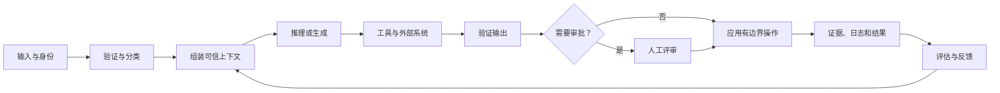

# 端到端架构与价值取舍（End-to-End Architecture and Value Tradeoffs）

> 架构的艺术，是只在能够改变结果的地方投入复杂度。

**Type:** Reference
**Languages:** Python
**Prerequisites:** [业务调研、需求与 SLA（Business Discovery, Requirements, and SLAs）](../../22-business-discovery-requirements-and-slas/); 阶段 14，第 01、12 和 28 课
**Time:** ~135 分钟

## 学习目标（Learning Objectives）

- 绘制从输入到反馈与运维的完整 Claude 系统
- 在增强调用、工作流、智能体和多智能体系统之间选择
- 围绕证据、权限和验证边界分解复杂工作
- 为成本、延迟、质量、安全和可维护性的取舍提供理由
- 识别增加模型能力也无法修复的结构性设计缺陷

## 问题（The Problem）

团队上线了合同评审助手。一个提示词包含合同、政策库、提取模式、谈判规则，以及生成最终修订稿的请求。演示有效，生产却不行。

大合同超出实际上下文预算，政策版本相互冲突。模型返回有效 JSON，却包含无依据的法律结论。评审者看不出哪个来源支持哪项修改。重试增加成本，却不改变失败。更大的模型改善文字，仍未解决来源、权限和生命周期归属。

系统失败不是因为提示词少了一句话，而是因为多个不同职责被压进同一个概率性步骤。

## 概念（The Concept）

### 绘制完整循环（Draw the Whole Loop）

端到端架构不只有模型调用。



对每条连线都要问：

- 什么数据跨越边界？
- 适用哪个身份和权限？
- 强制执行什么模式或契约？
- 超时、歧义或部分失败时会发生什么？
- 保留什么证据？
- 谁负责下一项决策？

没有失败路径的架构图只是宣传图。

### 选择满足要求的最小模式（Choose the Smallest Pattern That Fits）

有四种实用的起始模式。

#### 增强模型调用（Augmented Model Call）

一次请求使用选定上下文、检索或工具，返回有边界的输出。步骤已知且一轮能够容纳所需证据时，用于分类、提取、起草或评分。

优点：

- 编排开销最低
- 最容易评估
- 延迟与成本可预测

限制：

- 不适合分支工作
- 跨多个外部操作的恢复能力有限

#### 确定性工作流（Deterministic Workflow）

代码控制顺序，在选定步骤调用 Claude。业务流程稳定、可审计性重要，或每次转换需要明确契约时使用。

优点：

- 显式状态和重试
- 每步权限范围小
- 测试可复现

限制：

- 无法预知路径时较脆弱
- 新例外类别需要修改工作流

#### 自适应智能体（Adaptive Agent）

Claude 根据观察选择下一项操作，直到满足停止条件。证据发现决定路径、无法实际枚举每个分支时使用。

优点：

- 灵活规划
- 适合开放式研究与修复

限制：

- 延迟和成本变化较大
- 权限和评估范围更大
- 存在循环、偏离和工具错误风险

#### 多智能体系统（Multi-Agent System）

协调者把隔离的问题委派给专家或独立评审者。工作可分区、上下文隔离能提高质量，或验证要求独立性时使用。

优点：

- 并行执行
- 每个角色的上下文更小
- 独立评审

限制：

- 交接信息丢失和重复工作
- 调用更多，追踪分析更难
- 协调成本可能超过收益

不要因为图看起来成熟就选择多智能体。只有具体的上下文、独立性、并行或专业化需求足以抵偿协调成本时才选择。

### 围绕契约分解（Decompose Around Contracts）

糟糕的分解只沿文档章节或团队边界切分，不问如何检查正确性。好的分解在每次交接处建立契约。

对于合同评审系统：

1. 接收环节验证文件类型、身份和司法辖区元数据。
2. 条款分段返回稳定标识和来源片段。
3. 政策检索返回带来源信息的版本化证据。
4. 条款分析按模式返回发现。
5. 独立评审者检查证据覆盖和矛盾。
6. 修订稿生成只使用已接受发现。
7. 人类法律顾问批准实质修改。
8. 系统记录决策证据和后续结果。

每步的职责都比“评审这份合同”窄，失败可以定位。系统能重试检索而不重新生成已接受条款分析，评审者也能拒绝一个发现而不丢弃全部工作。

### 分离语义与确定性控制（Separate Semantic and Deterministic Controls）

Claude 适合模糊判断，例如条款是否实质改变责任。代码更适合必填字段、权限检查、退款上限、允许辖区和文档版本等不变条件。

使用这条规则：

```text
如果一个条件可以表达为针对可信数据的稳定谓词，就在模型之外强制执行。
```

提示词指令指导行为，但不构成安全边界。

### 为完整轨迹编制预算（Budget Across the Whole Trajectory）

成本不只是单次调用的输入输出词元。系统轨迹可能包含检索、多次模型调用、工具执行、重试、评审和人工劳动。

估算预期任务成本时，应计入模型调用、检索与工具成本、重试概率乘以重试成本、人工审查分钟数乘以人工费率，以及预期事件与修正成本：

```text
expected task cost =
  model calls
  + retrieval and tool cost
  + retry probability times retry cost
  + human review minutes times labor rate
  + expected incident and correction cost
```

更小的模型若带来更多重试，每个成功任务可能更贵。更大模型若消除了昂贵评审步骤，可能反而更便宜，但只有评估才能证明。

### 把延迟视为分布（Treat Latency as a Distribution）

平均延迟会掩盖用户体验到的长尾。模型时间、工具时间、排队、重试和人工审批叠加。

至少使用 P50、P95 和超时率。交互工作既跟踪首次有用输出时间，也跟踪总完成时间。后台工作可能更看重吞吐量和完成期限，而非首词元延迟。

并行执行只帮助独立工作。并行调用若竞争同一速率限制，或结果需要串行对账，可能增加成本却不缩短端到端时间。

### 把反馈作为产品接口设计（Design Feedback as a Product Surface）

反馈不是一堆点赞事件，必须将结果关联到输入、版本、轨迹和决策。

存储：

- 输入类别和风险等级
- 提示词、模型、工具和知识版本
- 检索证据标识
- 工具调用和结构化错误
- 输出及校验器结果
- 人工编辑和原因码
- 下游结果

反馈循环随后支持决策：修改提示词、修复检索、调整路由、改进工具，或缩小范围。

## 动手实现（Build It）

## 交互实验（Interactive Lab）

```figure
23-architecture-tradeoff
```

使用架构取舍探索器，根据加权的质量、延迟、成本、安全、可审计性和变更成本证据，对比增强调用、工作流、智能体和多智能体设计。高总分不能把硬性约束平均掉。

## 实践实验（Practice Lab）

从决策副本移除一个被否决方案或硬性安全门禁，观察就绪检查失败，再修复架构理由。

## 交付物（Shipped Artifact）

填写完成的 [`outputs/architecture-decision.md`](../outputs/architecture-decision.md) 选择确定性合同评审工作流，并记录失败路径和逆转条件。

## 验证（Verify It）

运行确定性的决策包校验器：

```bash
cd certifications/claude/lessons/23-end-to-end-architecture-and-value-tradeoffs
python3 code/main.py
python3 -m unittest discover -s code/tests -v
```

测验检验同样的模式与控制决策。

## 综合实践衔接（Capstone Connection）

将 ADR 带入专业架构师（Architect Professional）综合实践的架构选项章节。

为一个业务工作流创建架构包。

### 步骤 1：绘制三个候选方案（Step 1: Draw Three Candidates）

绘制增强调用、确定性工作流和自适应智能体设计。保持输入、输出和约束相同，确保比较公平。

### 步骤 2：为明确取舍评分（Step 2: Score Explicit Tradeoffs）

使用一到五分的量表，并提供书面证据。

| 标准 | 权重 | 增强调用 | 工作流 | 智能体 |
|-----------|-------:|---------------:|---------:|------:|
| 任务质量 | 25 | | | |
| P95 延迟 | 15 | | | |
| 每次成功成本 | 15 | | | |
| 安全与权限 | 20 | | | |
| 可审计性 | 15 | | | |
| 变更成本 | 10 | | | |

权重来自调研，而非习惯。若受监管操作使安全成为硬约束，不要用便利性把它平均掉。

### 步骤 3：编写失败路径（Step 3: Write Failure Paths）

对每个外部依赖规定超时、重试、熔断行为、部分结果、用户消息和运维证据。为智能体规定总轮次与成本预算。

### 步骤 4：定义评估（Step 4: Define the Evaluation）

建立代表性测试集，覆盖正常、模糊、对抗和依赖失败案例。测量最终质量、轨迹质量、成本、延迟和安全。

### 步骤 5：记录逆转条件（Step 5: Record Reversal Conditions）

说明什么证据会使团队切换模式。架构是当前决策，不是永久身份。

## 实际应用（Use It）

考虑一个需要跨公司申报文件回答问题的研究系统。

一个检索查询能可靠返回足够证据时，单次增强调用适用。每个任务都遵循查询、检索、排序、回答和引用时，工作流适用。必须发现缺失实体、重写查询并判断证据是否足够时，智能体适用。只有并行来源研究或独立验证对目标指标的改善足以抵偿协调成本，多智能体设计才适用。

现在加入一小时回答期限和严格成本预算，最优设计可能改变。架构始终是在约束之下的架构。

## 考试决策模式（Exam Decision Patterns）

选项复杂度不同时，选择满足既定需求的最简单架构。先寻找结构性修复，再考虑提示词补丁。

好的答案通常：

- 在代码中强制确定性规则
- 隔离高风险工具和权限
- 已知路径用工作流，真正需要自适应的路径用智能体
- 独立性是需求时添加独立评审者
- 每次转换都保留来源
- 定义停止、重试、部分结果和升级行为
- 优化每个成功结果的成本，而非单次调用成本

薄弱答案往往只增加模型大小、提示词长度、智能体或工具数量，却不处理实际失败边界。

## 常见陷阱（Common Traps）

### 能力膨胀（Capability Bloat）

每个多余工具都会增加提示词大小、选择歧义、攻击面和授权风险。只暴露当前角色所需的最小集合。

### 用提示词绕过缺失契约（Prompting Around a Missing Contract）

若两个步骤对标识、模式或错误行为不一致，更清楚的自然语言指令也无法建立可靠接口。应定义契约。

### 把自我评审当独立评审（Self-Review as Independence）

让同一上下文“再检查一次”，可能重复同一假设。独立性重要时，使用独立评审者，提供明确评分标准和隔离证据。

### 只优化演示路径（Optimizing the Demo Path）

生产质量体现在歧义、过时数据、权限错误、超时和部分失败中。架构批准前就纳入这些场景。

## 练习（Exercises）

1. 为发票争议流程设计增强调用、工作流和智能体候选方案，选择一个并说明逆转条件。
2. 找出 AI 工作流中三个应由确定性代码实现的不变条件。
3. 计算两种模型在不同重试率和评审率下的每个成功任务成本。
4. 为多智能体研究设计添加工具中断，并规定部分结果行为。
5. 编写评估，识别最终文字很好但轨迹浪费资源或不安全的系统。

## 关键术语（Key Terms）

| 术语 | 常见说法 | 实际含义 |
|------|-----------------|------------------------|
| 增强调用（Augmented call） | 弱智能体 | 带有选定上下文或工具的有边界模型调用 |
| 工作流（Workflow） | 固定步骤智能体 | 由代码掌控、具有显式转换的编排 |
| 智能体（Agent） | 任意 LLM 应用 | 根据观察选择操作、由模型指导的循环 |
| 多智能体（Multi-agent） | 更多智能 | 为隔离、并行或独立评审而协调多个模型上下文 |
| 契约（Contract） | 提示词指令 | 可由机器检查的数据、错误和职责边界 |
| 每次成功成本（Cost per success） | 词元价格 | 每个获接受结果的模型、工具、重试、评审和修正预期总成本 |

## 延伸阅读（Further Reading）

- [构建有效智能体（Building effective agents）](https://www.anthropic.com/research/building-effective-agents)：工作流和智能体模式
- [Claude Agent SDK 文档（documentation）](https://platform.claude.com/docs/en/agent-sdk/overview)：当前智能体运行框架能力
- 阶段 14，第 01 课：从基本原理理解智能体循环
- 阶段 14，第 28 课：编排取舍
- 阶段 17，第 08 课：有效吞吐量和延迟测量
