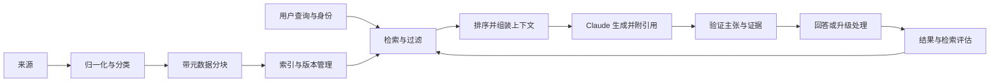

# RAG、检索与数据流水线（RAG, Retrieval, and Data Pipelines）

> 有依据的答案是否可信，取决于送达模型的证据是否可信。

**Type:** Build
**Languages:** Python
**Prerequisites:** [端到端架构与价值取舍（End-to-End Architecture and Value Tradeoffs）](../../23-end-to-end-architecture-and-value-tradeoffs/); 阶段 11，第 06 和 07 课；阶段 5，第 23 课
**Time:** ~150 分钟

## 学习目标（Learning Objectives）

- 设计摄取、分块、索引、检索、生成和引用边界
- 根据数据形态选择稀疏、稠密、混合、过滤和迭代检索
- 修改模型或提示词前先诊断检索失败
- 分开测量检索质量与答案质量
- 在整个流水线中保留时效性、访问控制和来源信息

## 问题（The Problem）

政策助手运行了数月。一次文档刷新后，它开始根据旧退款阈值自信作答。模型版本、提示词和延迟都没变化。

团队在提示词中加入“使用最新政策”，却没有改善。模型无法遵循从未收到的证据。索引包含两个政策版本，缺少元数据过滤，检索器把过时块排第一，因为它的措辞更贴近查询。

这是检索事故。把它当模型事故会浪费时间，也可能掩盖真正的控制失败。

## 概念（The Concept）

### RAG 是数据系统（RAG Is a Data System）

检索增强生成（Retrieval-augmented generation，RAG）由两个互相连接、失败模式不同的系统组成。



即使模型出色，系统仍可能因以下原因失败：

- 来源从未被摄取
- 解析丢掉相关表格
- 分块把条件与例外拆开
- 索引使用过时或不兼容表示
- 过滤忽略租户、辖区、日期或权限
- 排序偏向关键词匹配，而非权威来源
- 上下文组装截断最佳证据
- 生成引用一个块，却作出超出其支持范围的主张

诊断最早失败的边界。

### 围绕含义与检索设计分块（Design Chunks Around Meaning and Retrieval）

固定词元分块是基线，不是通用答案。块的形态应保留人会引用的单元。

散文式政策常可按标题和段落划分。API 文档应把方法签名与参数、错误放在一起。表格应让每组行保留表头。工单中一条消息可能需要对话上下文。源码按函数和类划分，比任意字符窗口更合适。

事实跨边界时，重叠有帮助，但也重复证据、扩大索引，并可能让最终上下文挤满近乎相同的文本。应测量效果。

每个块都需要元数据：

- 稳定的文档和块标识
- 来源 URI 或权威记录系统标识
- 版本和生效日期
- 租户、辖区、产品或内容类型
- 访问控制属性
- 摄取和解析器版本
- 父标题和位置

元数据让检索受治理，而不仅是寻找相似内容。

### 让检索匹配查询和数据形态（Match Retrieval to Query and Data Shape）

#### 稀疏检索（Sparse Retrieval）

BM25 风格检索匹配显式词项，适合标识、产品名、错误码和政策措辞，成本低且可解释。

#### 稠密检索（Dense Retrieval）

嵌入（Embedding）匹配语义相似性。当用户换种说法，或查询与来源词汇不同时，它很有用。但它可能遗漏精确标识，也可能检索出语义相关却非权威的文本。

#### 混合检索（Hybrid Retrieval）

组合稀疏与稠密候选，再融合或重排。对混合自然语言与标识的查询，混合检索通常优于单独使用其中一种。

#### 过滤检索（Filtered Retrieval）

证据到达模型前，应用可信元数据与授权。不要要求 Claude 忽略用户无权查看的块，禁止的数据根本不应进入上下文。

#### 迭代检索（Iterative Retrieval）

智能体可以改写查询、追踪引用或识别缺失证据。只有发现过程确实需要自适应时才使用。设置查询、轮次、时间和成本预算。稳定问答流水线不应默认承担智能体复杂度。

### 分离检索评估与答案评估（Separate Retrieval Evaluation From Answer Evaluation）

正确证据不在头部候选中，答案质量就有上限。先测检索。

有用指标包括：

- K 项召回率（Recall at K）：候选集是否包含必需来源？
- K 项精确率（Precision at K）：候选集中有多少相关内容？
- 平均倒数排名（Mean reciprocal rank）：首个相关来源多早出现？
- 归一化折损累计增益（nDCG）：排序是否把高度相关来源放在前面？
- 时效覆盖率：结果是否使用有效版本？
- 授权泄漏：是否有结果违反调用者访问权限？

然后评估生成：

- 引用证据对主张的支持
- 引用正确性与完整性
- 答案完整性
- 证据不足时拒答
- 跨来源冲突检测

单个端到端分数无法告诉你应修哪一层。

### 将来源信息作为数据保留（Preserve Provenance as Data）

不要让来源信息只存在于答案之后生成的文字中。将来源标识贯穿检索、上下文组装、输出模式和日志。

对每项主张保留：

- 来源文档和块标识
- 来源版本和生效日期
- 确切支持片段
- 检索分数和排名
- 转换或概括步骤

来源冲突时报告冲突。除非领域有明确优先级规则，否则不要静默选择最近日期。

### 让刷新具有原子性且可观测（Make Refresh Atomic and Observable）

文档刷新可能产生新旧块共存的混合索引。更安全的模式是构建新版本、验证，再原子切换别名或指针。新索引通过检索和时效检查前，保留回滚能力。

监控：

- 摄取成功率与滞后
- 解析内容数量和大小
- 每个来源的有效版本
- 嵌入或索引版本
- 空结果率和低分率
- 检索分布变化
- 最常失败的评估查询

## 动手实现（Build It）

## 交互实验（Interactive Lab）

```figure
24-rag-ranking
```

编辑代码前，使用排序实验比较词汇匹配、元数据过滤、过时来源排除和 top-K 行为。可见排名把检索决策与召回率、倒数排名、时效性和来源关联起来。

## 实践实验（Practice Lab）

在夹具副本中加入过时或未授权文档，证明它在生成前无法进入候选集。

## 交付物（Shipped Artifact）

[`outputs/retrieval-evidence-report.json`](../outputs/retrieval-evidence-report.json) 是填写完成的基线，包含排序后的块身份、有效来源版本和检索指标。

## 验证（Verify It）

使用以下命令复现并验证：

```bash
cd certifications/claude/lessons/24-rag-retrieval-and-data-pipelines/code
python3 main.py
python3 -m unittest discover tests -v
```

六道测验题检查诊断与检索选择。

## 综合实践衔接（Capstone Connection）

将证据报告带入专业架构师（Architect Professional）综合实践的 RAG 评估和时效门禁。

实验用 Python 标准库实现小型 BM25 风格索引，刻意保持透明。生产搜索系统更快、能力更强，但评分和元数据边界不应再让你觉得神秘。

运行：

```bash
cd certifications/claude/lessons/24-rag-retrieval-and-data-pipelines/code
python3 main.py
python3 -m unittest discover tests -v
```

### 步骤 1：归一化词元（Step 1: Normalize Tokens）

`tokenize` 将文本转为小写并提取字母数字词项。生产流水线需要感知语言的分词、字段处理和解析器测试。本课只保留排序概念。

### 步骤 2：以稳定身份分块（Step 2: Chunk With Stable Identity）

`chunk_document` 创建重叠词窗口，同时保留文档 ID、位置、更新时间和稳定块 ID。无效重叠会及早失败，不会造成无限循环。

### 步骤 3：索引前排除非活跃来源（Step 3: Exclude Inactive Sources Before Indexing）

`RetrievalIndex.build` 忽略非活跃文档版本。这是简化的时效门禁。生产中，激活应绑定已验证索引版本与原子切换。

### 步骤 4：透明评分（Step 4: Score Transparently）

索引计算词频、文档频率、长度归一化和逆文档频率分数。精确查询词项可提高真正包含当前政策措辞的来源排名。

### 步骤 5：返回来源（Step 5: Return Provenance）

每个 `RetrievalHit` 携带文档 ID、块 ID、更新日期、文本和分数。生成层应消费结构化证据，并返回关联到它的主张链接。

### 步骤 6：评估检索器（Step 6: Evaluate the Retriever）

`evaluate_retrieval` 根据标注案例计算 K 项召回率与平均倒数排名。改变排序前，加入正常、模糊、过时版本、权限和对抗查询。

## 实际应用（Use It）

生产系统通常组合文档解析器、对象存储、稀疏或向量索引、元数据过滤器、重排器和评估流水线。即使托管服务隐藏实现，也保留相同契约。

针对政策事故：

1. 复现查询，检查检索到的块 ID。
2. 确认索引中哪些来源版本有效。
3. 检查阈值与例外附近的解析和分块边界。
4. 验证身份与元数据过滤。
5. 比较稀疏、稠密和混合候选集。
6. 修复前后运行冻结的检索评估。
7. 原子切换已验证索引，并保留回滚。
8. 在生成层重新运行主张支持评估。

不要先改变温度或模型大小。两者都无法恢复缺失或禁止访问的证据。

## 考试决策模式（Exam Decision Patterns）

文档刷新后答案立即变错，但模型和延迟稳定时，先调查摄取、索引、过滤和检索。

好的架构选择：

- 让检索方式匹配精确标识和语义改述
- 生成前按身份和元数据过滤
- 对来源与索引做版本管理
- 分别评估检索与最终答案
- 通过输出契约传递来源
- 显式表示不足或冲突的证据

薄弱的选择：

- 告诉模型记住最新文档
- 把每个来源都加进上下文
- 检查候选之前更换模型
- 依赖生成引用，却没有来源标识

## 常见陷阱（Common Traps）

### 更多上下文意味着更多依据（More Context Means More Grounding）

无关上下文争夺注意力，可能掩盖最佳证据。更好的检索和排序通常优于更大的上下文载荷。

### 相似意味着权威（Similar Means Authoritative）

语义相似性不编码政策优先级、权限或生效日期，这些需要元数据和规则。

### 有效引用意味着主张受支持（Valid Citation Means Supported Claim）

引用可能指向真实来源，却不支持全部主张。评估蕴含关系和覆盖率，而不仅是链接有效性。

### 刷新意味着追加（Refresh Means Append）

追加新块却不停用旧版本，会产生矛盾证据。应把刷新视为版本化部署。

## 练习（Exercises）

1. 添加感知字段的加权，让标题匹配得分高于正文匹配。
2. 添加辖区过滤，并用测试证明未授权块绝不出现在候选中。
3. 为两个排序列表构建混合排名融合函数。
4. 创建十个检索案例，让精确标识和改述需要不同策略。
5. 设计含验证与回滚的原子索引刷新清单。

## 关键术语（Key Terms）

| 术语 | 常见说法 | 实际含义 |
|------|-----------------|------------------------|
| 块（Chunk） | 固定数量词元 | 具有身份和元数据、可检索可引用的单元 |
| 稀疏检索（Sparse retrieval） | 老式关键词搜索 | 擅长精确词汇与标识的词项排序 |
| 稠密检索（Dense retrieval） | 语义真相 | 嵌入空间相似性，不代表权威性或事实支持 |
| 混合检索（Hybrid retrieval） | 两个数据库 | 组合精确与语义信号的候选融合 |
| K 项召回率（Recall at K） | 答案准确率 | 必需证据是否出现在前 K 个检索项中 |
| 来源追踪（Provenance） | 生成脚注 | 从来源贯穿主张的结构化血缘 |

## 延伸阅读（Further Reading）

- [Claude 引用文档（citations documentation）](https://platform.claude.com/docs/en/build-with-claude/citations)：当前引用支持
- [Claude 词元计数文档（token counting documentation）](https://platform.claude.com/docs/en/build-with-claude/token-counting)：上下文预算
- 阶段 11，第 06 课：从基本原理构建 RAG 流水线
- 阶段 11，第 07 课：高级检索和重排
- 阶段 19，第 65 课：稀疏与稠密混合检索
