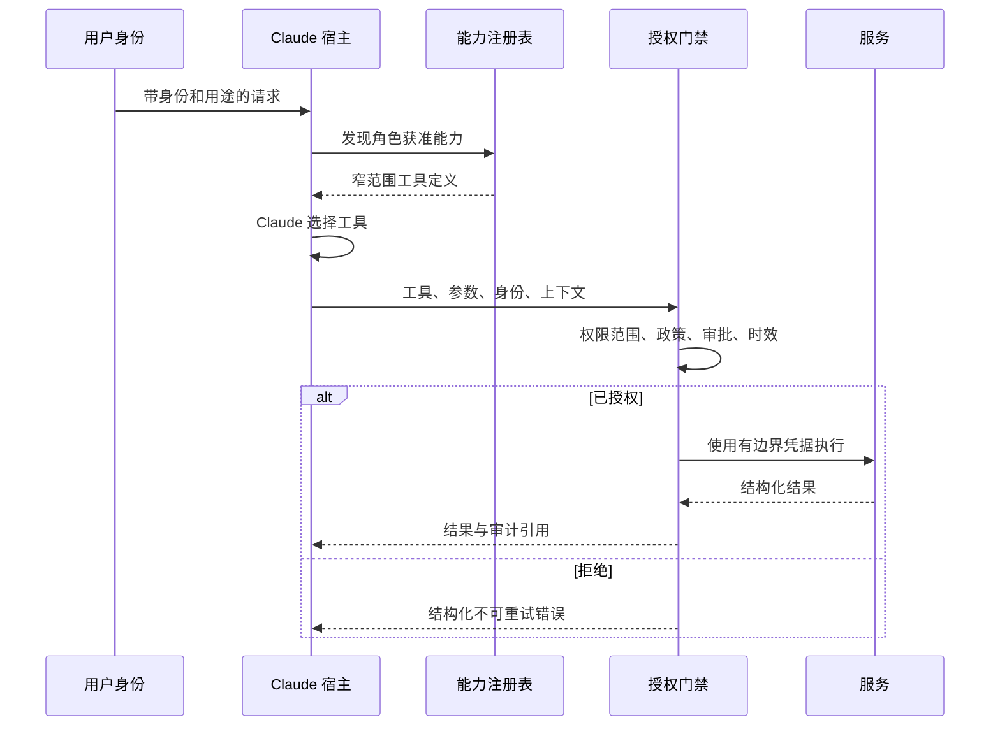

# 集成协议、身份与最小权限（Integration Protocols, Identity, and Least Privilege）

> 工具的安全不取决于 Claude 用得谨慎，而取决于系统会拒绝未授权使用。

**Type:** Build
**Languages:** Python
**Prerequisites:** [端到端架构与价值取舍（End-to-End Architecture and Value Tradeoffs）](../../23-end-to-end-architecture-and-value-tradeoffs/); 阶段 13，第 01、05、06、16 和 18 课
**Time:** ~150 分钟

## 学习目标（Learning Objectives）

- 根据需求选择直接 API、CLI、MCP 或智能体间集成
- 区分能力发现与执行授权
- 设计最小权限工具集和身份传递
- 返回结构化、可采取行动且不泄露密钥的错误
- 在执行边界放置审批、审计和撤销控制

## 问题（The Problem）

客服智能体可以读工单、起草回复、退款和删除账户。多数客服只需前两项能力。团队却启用全部四个工具，并添加提示词：“除非绝对必要，绝不退款或删除账户。”

这不是最小权限。危险能力仍存在，模型仍能看到，提示词注入仍可针对它。确认文本能减少误用，却不能替代授权。

结构性修复更小：不暴露角色不需要的能力，传递调用者身份，并在工具执行时强制检查权限范围和审批。

## 概念（The Concept）

### 根据边界选择集成形式（Choose an Integration Shape From the Boundary）

这些协议有重叠，但主要解决的问题不同。

| 形式 | 最适合 | 主要取舍 |
|-------|----------|---------------|
| 直接 API（Direct API） | 应用已知一个服务契约，需要低开销 | 服务耦合紧密，需要自定义发现 |
| CLI | 围绕可执行程序的本地或 CI 自动化 | 进程、环境和输出管理负担 |
| MCP | 宿主需要跨服务器标准化发现工具、资源或提示词 | 多一个需要运维的协议边界和授权模型 |
| 智能体间（Agent-to-agent） | 一个智能体向另一个自主服务委派任务 | 信任、身份、进度和失败语义更难处理 |

MCP 不替代所有 API。稳定内部服务调用使用直接 API 可能更清晰、更快。多个宿主需要共同发现和调用能力，或工具归属应留在服务器边界之后时，MCP 才有价值。

CLI 适合本地开发工作流和 CI，但长期运行工作需要超越脆弱子进程的持久状态、取消和结果获取。当远端负责自主任务，而非只是函数端点时，智能体间集成才合理。

### 分离发现、选择与执行（Separate Discovery, Selection, and Execution）



发现控制模型看到什么，授权控制实际发生什么，两者都必需。

发现返回全部工具时，模型承担额外上下文和选择成本，还能看到危险操作描述。若缺少授权，隐藏工具只是掩饰，调用者仍可能直接访问端点。

### 传递身份，不替代身份（Propagate Identity, Do Not Replace It）

应用 API 密钥标识应用，不自动代表发起请求的人类用户或服务。

传递：

- 主体 ID
- 租户或组织
- 已认证会话
- 角色和权限范围
- 政策要求时的用途或案例标识
- 提权操作的审批引用
- 请求和追踪 ID

下游系统应根据可信身份声明独立作出授权决定。不要授予宽泛服务凭据，再要求 Claude 模拟用户权限。

### 在四个层次使用最小权限（Use Least Privilege at Four Levels）

1. 工具集：只暴露任务和角色所需能力。
2. 工具模式：只接受必需参数，并约束值。
3. 凭据：只授予所需服务权限范围和资源。
4. 操作：执行时重新检查当前政策、对象归属和审批。

权限会改变，审批会过期，工具定义可能几分钟前就已加载。执行时授权是最后一道控制。

### 把审批设计为能力（Design Approval as a Capability）

“先问用户”含义模糊。可靠审批包含：

- 确切拟议操作与参数
- 预期影响和可逆性
- 请求者身份
- 批准者身份与权限
- 过期时间
- 单次或有限次数使用语义
- 审计引用

审批后执行的必须是经过评审的确切操作。参数变化时重新申请审批。

### 返回结构化错误（Return Structured Errors）

不同工具失败需要不同恢复方式。

```json
{
  "ok": false,
  "error": {
    "category": "authorization",
    "retryable": false,
    "message": "refunds:write scope is required",
    "safe_details": {
      "required_action": "request authorized human review"
    }
  }
}
```

类别可包括验证、授权、未找到、冲突、限流、依赖、超时和内部错误。告诉智能体重试是否安全，以及什么变化能改变结果。不要返回原始堆栈追踪、令牌或含密钥的上游消息。

### 渐进式发现减少能力膨胀（Progressive Discovery Reduces Capability Bloat）

大型工具目录消耗上下文并增加选择错误。从小而稳定的工具集及搜索或注册机制开始。任务明确需要时再加载专用工具。

渐进式发现仍应强制主体权限范围。搜索不能暴露调用者无权知晓的能力名称或描述。

### MCP 作用域不定义业务授权（MCP Scopes Do Not Define Business Authorization）

MCP 标准化能力交换。应用仍负责身份、租户隔离、同意、审批、政策、审计和凭据管理。传输安全不是授权，协议握手成功也不授予使用每个工具的权限。

## 动手实现（Build It）

## 交互实验（Interactive Lab）

```figure
25-identity-permission-path
```

使用权限路径探索器，追踪从已认证请求经过能力发现、模型选择、执行时授权、审批、服务调用到审计的身份。改变权限范围，展示发现与授权为何是独立控制。

## 实践实验（Practice Lab）

只授予发现权限，尝试执行，然后加入绑定审批，观察哪个决策变化、哪个边界仍被强制执行。

## 交付物（Shipped Artifact）

[`outputs/least-privilege-review.json`](../outputs/least-privilege-review.json) 是填写完成的能力评审，展示可见工具和结构化的退款拒绝尝试。

## 验证（Verify It）

复现行为，运行全部授权测试：

```bash
cd certifications/claude/lessons/25-integration-protocols-identity-and-least-privilege/code
python3 main.py
python3 -m unittest discover tests -v
```

测验检查协议、身份、审批和重试规则。

## 综合实践衔接（Capstone Connection）

将报告用作专业架构师（Architect Professional）综合实践的身份与最小权限证据。

实验使用 Python 标准库，让边界清晰可见。

```bash
cd certifications/claude/lessons/25-integration-protocols-identity-and-least-privilege/code
python3 main.py
python3 -m unittest discover tests -v
```

### 步骤 1：选择主要形式（Step 1: Select a Primary Shape）

`select_protocol` 要求一个主要集成需求。动态发现映射 MCP，本地自动化映射 CLI，自主远程委派映射智能体间协议，已知服务调用映射直接 API。含糊需求会失败，迫使架构师澄清边界。

### 步骤 2：定义主体和工具契约（Step 2: Define Principal and Tool Contracts）

`Principal` 携带权限范围和有效新审批。`ToolContract` 声明所需权限、风险和是否需要审批。描述解释行为，但不授权行为。

### 步骤 3：过滤发现（Step 3: Filter Discovery）

`discover_tools` 移除超出主体权限范围的能力。客服起草者永远看不到账户删除。

### 步骤 4：执行时授权（Step 4: Authorize at Execution）

`authorize` 检查当前权限范围和审批。检查失败时，`execute_tool` 以结构化不可重试错误拒绝调用。

这个简化系统不实现密码学身份、令牌验证或政策引擎，这些属于生产基础设施。但它保留了决策应放置的位置。

## 实际应用（Use It）

为客服系统创建角色专用工具包：

- 分诊：读取分配工单、分类、路由
- 回复者：读取工单和政策、写草稿
- 退款评审者：读取案例和建议、批准或拒绝
- 退款执行者：仅执行某项具体已批准操作
- 管理员：在客服智能体路径之外维护账户

不能因为某服务能提供管理员工具，就把它们给模型。高风险操作应使用绑定已批准操作的短期凭据，并生成不可变审计记录。

选择 MCP 或直接 API 时，编写 ADR 比较：

- 宿主数量和多样性
- 动态发现需求
- 延迟预算
- 现有授权和 SDK 成熟度
- 部署和归属边界
- 流式或长期运行行为
- 可观测性与支持负担

协议潮流不是需求。

## 考试决策模式（Exam Decision Patterns）

角色永远不需要某能力，就从配置移除。日志和确认是补偿控制，不是最小权限。

优先选择以下答案：

- 传递经过认证的用户或服务身份
- 缩小工具和凭据权限范围
- 执行时再次授权
- 高影响操作使用有效新审批
- 返回分类且考虑重试的错误
- 根据集成边界选择协议
- 目录大时渐进式发现能力

拒绝那些认为更好提示词、更大模型或成功 MCP 连接就能解决授权的答案。

## 常见陷阱（Common Traps）

### 所有用户共用一个服务账户（One Service Account for Every User）

下游服务只看到宽泛应用权限，逐用户限制变成提示词政策，而非可强制执行的政策。

### 确认却不绑定（Confirmation Without Binding）

用户批准退款 50 美元，随后参数变为 500。审批必须绑定操作、参数、身份和时间。

### 把工具描述当控制（Tool Descriptions as Controls）

描述帮助选择，但从安全角度是不可信文本，自身也可能携带提示词注入。

### 重试授权错误（Retrying Authorization Errors）

重试不会创造权限。把错误标为不可重试，并交给正确的审批或访问流程。

## 练习（Exercises）

1. 添加资源级授权，让主体只能读分配工单。
2. 创建签名的单次审批记录，并拒绝变化参数。
3. 定义隐藏未授权工具名称的渐进式发现接口。
4. 为具有 200 ms 延迟预算的三个内部服务比较 MCP 与直接 API。
5. 对工具描述和结果开展间接提示词注入红队测试。

## 关键术语（Key Terms）

| 术语 | 常见说法 | 实际含义 |
|------|-----------------|------------------------|
| 身份认证（Authentication） | 操作许可 | 身份证据 |
| 授权（Authorization） | 登录 | 判断该身份能否执行该操作 |
| 权限范围（Scope） | 提示词规则 | 可信凭据或政策决策携带的有边界权限 |
| 发现（Discovery） | 授权 | 查找能力，与执行许可分离 |
| 最小权限（Least privilege） | 加确认 | 移除多余能力，最小化每个剩余权限边界 |
| 审批（Approval） | 用户说了是 | 对确切操作参数作出的、绑定时间和身份的授权 |

## 延伸阅读（Further Reading）

- [MCP 规范（specification）](https://modelcontextprotocol.io/specification/latest)：当前协议行为
- [MCP 授权规范（authorization specification）](https://modelcontextprotocol.io/specification/latest/basic/authorization)：协议级授权要求
- [Claude 工具使用文档（tool use documentation）](https://platform.claude.com/docs/en/agents-and-tools/tool-use/overview)：当前工具契约
- 阶段 13，第 05 课：模式设计
- 阶段 13，第 18 课：生产 MCP 身份认证
- 阶段 17，第 25 课：密钥和审计控制
