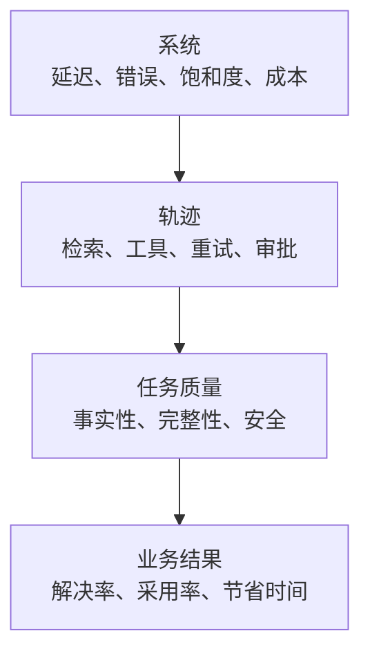

# 生产可观测性、延迟与成本（Production Observability, Latency, and Cost）

> API 调用显示成功，任务仍可能失败。

**Type:** Build
**Languages:** Python
**Prerequisites:** [RAG、检索与数据流水线（RAG, Retrieval, and Data Pipelines）](../../24-rag-retrieval-and-data-pipelines/); 阶段 11，第 10 课；阶段 17，第 08、13 和 27 课
**Time:** ~150 分钟

## 学习目标（Learning Objectives）

- 区分系统可靠性、任务质量和业务结果
- 为 Claude 请求和智能体轨迹设计日志、指标与追踪
- 跨模型、检索、工具、队列和重试诊断延迟
- 测量总成本与每个成功结果的成本
- 根据服务目标定义告警和上线门禁

## 问题（The Problem）

生产仪表盘报告 API 调用成功率为 99.9%，客户却仍在抱怨。

模型返回 HTTP 200，但部分答案使用过时来源。工具超时后，智能体静默继续。长提示词因开头附近放了时间戳而无法命中缓存。P95 延迟翻倍，平均值却仍可接受。更便宜的模型降低调用单价，却增加重试和人工评审。

仪表盘测量传输成功，产品依赖任务成功。可观测性必须把二者联系起来。

## 概念（The Concept）

### 观察四个层次（Observe Four Layers）



系统信号告诉你组件是否运行；轨迹信号告诉你应用做了什么；质量信号告诉你结果是否满足任务；业务信号告诉你工作流是否创造价值。

不要把它们压成一个“成功”字段。

### 日志、指标和追踪职责不同（Logs, Metrics, and Traces Have Different Jobs）

日志（Log）记录离散事件：请求被接受、检索无候选、工具拒绝授权、输出未通过模式验证、评审者升级处理。使用结构化字段，让运维人员分组和过滤。

指标（Metric）聚合一段时间的行为：请求率、错误率、P95 延迟、词元用量、缓存命中、检索召回率、任务通过率和每次成功成本。它们驱动仪表盘与告警。

追踪（Trace）连接完整轨迹。一条追踪应以父子时间关系展示模型调用、检索、工具执行、验证、重试和人工审批。没有追踪，慢请求就像一个不透明的大块。

### 追踪语义契约（Trace the Semantic Contract）

收集足以复现和分类结果的信息：

- 追踪、请求、会话及可安全使用的用户标识
- 应用、提示词、模型、工具、知识和评估版本
- 输入类别和风险等级
- 词元数及缓存读写
- 停止原因和工具名称
- 工具时长和结构化错误类别
- 验证与政策决策
- 评估结果和人工编辑
- 最终状态与下游结果

不要记录密钥、原始凭据或不必要的个人数据。敏感输入应存哈希、类别、计数或受访问控制的引用，而不是明文。

### 区分系统成功与任务成功（Separate System Success From Task Success）

系统成功问请求是否按协议完成；任务成功问输出是否满足评分标准。有效 JSON 可能事实错误，智能体也可能正常结束却未完成请求的状态变化。

智能体系统应同时评估：

- 最终状态：目标交付物或系统状态是否存在？
- 轨迹：工具、权限、证据和预算是否正确使用？

单纯文本匹配会漏掉两者。

### 分解延迟（Decompose Latency）

端到端延迟包含排队、上下文组装、模型、检索、工具、校验、重试和审批各环节的时间：

```text
queue + context assembly + model + retrieval + tools + validation + retries + approval
```

在每个主要跨度（Span）跟踪 P50 和 P95。P50 描述普通路径，P95 暴露慢工具、长上下文、限流和重试。

流式体验要包含首次有用输出时间。首词元时间看起来很好，用户却可能仍在等引用、工具结果或最终验证答案。

后台和批处理系统测量按期完成与吞吐量。若整个作业在业务窗口内结束，单个批项目耗时 30 秒也可接受。

### 根据证据优化（Optimize From Evidence）

常见延迟改进措施：

- 将简单工作路由给更快且合适的模型
- 减少无关上下文
- 设置稳定提示词前缀以利用缓存
- 检索更少、更好的候选
- 并发运行独立工具调用
- 将非交互负载移到批处理
- 强制时间、轮次和重试预算
- 时效允许时缓存确定性工具结果

每项都可能改变质量或安全，应在代表性评估集上测量取舍。

### 测量每个成功结果的成本（Measure Cost Per Successful Outcome）

词元价格只是一个组成部分。总成本还包括缓存写入与读取、工具、基础设施、审查和修正；每次成功的成本，是总成本除以验收通过的任务成果数量。

```text
total cost = model + cache writes and reads + tools + infrastructure + review + correction
cost per success = total cost / accepted task outcomes
```

失败请求仍花钱，安全拒绝、重试、评审时间和事故修正也一样。分别报告输入、输出、缓存和工具成本，让团队能够采取行动。

选择模型或架构变体时，真正重要的比较是每个成功结果的成本。

### 理解提示词缓存结构（Understand Prompt Cache Shape）

提示词缓存复用稳定前缀。靠前的变化可能使后面全部缓存失效。当前文档支持该布局时，将稳定工具定义、系统指令和大型参考材料放在动态用户内容之前。

跟踪缓存读取与写入词元。只有缓存功能开关，没有命中率指标，不算优化。

工具定义、模型设置、思考配置和其他请求变化可能影响缓存行为。细节会演变，应对照当前官方文档核实。

### 构建可采取行动的告警（Build Actionable Alerts）

围绕用户和运维决策告警，而不是每次数值波动都告警。

好的告警包括：

- 在有意义的窗口内任务通过率低于 SLO
- 安全控制失败或未授权操作尝试
- P95 延迟超出用户容忍度
- 检索时效滞后
- 工具某类错误激增
- 部署后缓存命中骤降
- 每次成功成本超预算
- 评估者分歧或标签漂移

每项告警都需要负责人、操作手册（Runbook）、证据链接和升级路径。若没人知道下一步做什么，它只是仪表盘装饰。

### 通过分阶段上线限制证据风险（Use Rollouts to Limit Evidence Risk）

离线评估必要但不充分。生产流量包含新的查询、数据、负载和集成。

采用：

1. 不影响用户的影子评估
2. 按租户或流量比例进行小规模金丝雀发布
3. 带自动回滚的受控扩量
4. 质量、延迟、成本和安全门禁通过后全量上线

对比稳定基线，按任务类别分层。总体提升可能掩盖高风险分群的严重回归。

## 动手实现（Build It）

## 交互实验（Interactive Lab）

```figure
26-latency-cost-slo
```

使用 SLO 探索器，独立改变任务成功率、缓存率、重试成本、P50 和 P95。它会揭示调用更便宜或传输健康，却仍未通过用户、质量或每次成功成本门禁的变体。

## 实践实验（Practice Lab）

加入一条便宜的失败追踪，观察单价下降而每次成功成本上升。然后找出应首先阻止上线的门禁。

## 交付物（Shipped Artifact）

[`outputs/release-scorecard.json`](../outputs/release-scorecard.json) 是填写完成的基线与候选比较，包含独立的质量、延迟、缓存和经济性门禁。

## 验证（Verify It）

复现并测试聚合：

```bash
cd certifications/claude/lessons/26-production-observability-latency-and-cost/code
python3 main.py
python3 -m unittest discover tests -v
```

测验检查诊断与上线决策。

## 综合实践衔接（Capstone Connection）

将评分卡带入专业架构师（Architect Professional）综合实践的评估、可观测性和金丝雀门禁。

实验只用 Python 聚合合成追踪记录。

```bash
cd certifications/claude/lessons/26-production-observability-latency-and-cost/code
python3 main.py
python3 -m unittest discover tests -v
```

### 步骤 1：表示一条任务轨迹（Step 1: Represent One Task Trajectory）

`Trace` 存储精简的端到端记录：变体、延迟、词元数、成本、系统结果、任务结果、缓存状态和错误类别。生产追踪应包含子跨度与受访问控制的引用，而非一个扁平对象。

### 步骤 2：聚合但不隐藏失败（Step 2: Aggregate Without Hiding Failure）

`summarize` 分开报告系统和任务成功，计算最近秩法 P50 和 P95、缓存读取率、错误类别、总成本和每次任务成功成本。失败尝试仍留在成本分子中。

### 步骤 3：比较变体（Step 3: Compare Variants）

`by_variant` 防止缓存或路由设计被平均进基线。一起比较质量、延迟和成本。

### 步骤 4：评估服务目标（Step 4: Evaluate Service Objectives）

`evaluate_objectives` 应用最低任务成功率、最高延迟和成本阈值。变体必须通过每个必需门禁。不要用低成本平均掉安全或质量失败。

## 实际应用（Use It）

从一个生产问题开始：“为什么发布后任务成功率下降？”

按应用和发布版本过滤追踪，按输入类别分层。先查系统错误，再查检索与工具跨度，然后查校验器与评估结果。比较提示词、模型、知识和工具版本，找出相对基线轨迹最早发生分歧的位置。

P95 上升而 P50 稳定时，检查慢路径：重试、限流、大输入、工具超时和审批等待。词元价格稳定而成本上升时，检查调用次数、上下文长度、缓存命中和评审。

保留发布评分卡：

| 门禁 | 基线 | 候选 | 要求 |
|------|----------|-----------|----------|
| 任务通过率 | | | 高风险分层无回归 |
| 安全通过率 | | | 硬控制 100% 通过 |
| P95 延迟 | | | 在 SLO 内 |
| 每次成功成本 | | | 在预算内 |
| 检索召回率 | | | 在容忍范围内 |
| 人工评审分钟数 | | | 没有隐藏工作流负担 |

## 考试决策模式（Exam Decision Patterns）

API 成功率高但用户报告差结果时，添加或检查语义质量与轨迹证据。错误答案出现在文档刷新后时，先追踪检索，再改变模型。

优先选择以下答案：

- 联合使用日志、指标和追踪
- 区分传输、任务和业务成功
- 监控 P95，而非只有平均值
- 比较每个成功结果的成本
- 版本化提示词、模型、工具和知识
- 用质量、延迟、成本和安全作为上线门禁
- 为每个告警指定负责人和操作手册

## 常见陷阱（Common Traps）

### 默认记录完整提示词（Logging Full Prompts by Default）

这可能泄露个人数据、密钥或受监管内容。记录最少安全证据，对敏感引用实施访问控制。

### 单一聚合质量分数（One Aggregate Quality Score）

它可能掩盖语言、风险等级、任务或客户维度的回归。应分层。

### 平均延迟（Average Latency）

少量慢请求群体可能损害体验，平均值却保持稳定。跟踪尾延迟与超时率。

### 单次调用成本（Cost per Call）

它奖励便宜的失败。使用每个获接受结果的成本，并包含评审与修正。

## 练习（Exercises）

1. 扩展实验，为检索和两个工具添加子跨度。
2. 添加输入风险分层，证明总体改善可能掩盖关键回归。
3. 创建缓存失效实验，测量命中率、P95 和成本。
4. 为工具授权失败设计带负责人和操作手册的告警。
5. 编写金丝雀政策，在任何硬控制失败时回滚。

## 关键术语（Key Terms）

| 术语 | 常见说法 | 实际含义 |
|------|-----------------|------------------------|
| 日志（Log） | 调试文本 | 带安全证据和标识的结构化事件 |
| 指标（Metric） | 任意数字 | 用于理解或控制行为的时间聚合 |
| 追踪（Trace） | 请求 ID | 完整轨迹中相互连接的计时和结果 |
| 任务成功（Task success） | HTTP 200 | 请求结果满足评分标准和约束 |
| P95 延迟（P95 latency） | 最慢请求 | 95% 的测量请求在此值或更低时间内完成 |
| 每次成功成本（Cost per success） | 模型价格 | 预期总成本除以获接受任务结果数 |

## 延伸阅读（Further Reading）

- [Claude 用量与成本 API 文档（usage and cost API documentation）](https://platform.claude.com/docs/en/build-with-claude/usage-cost-api)：当前用量报告
- [提示词缓存文档（Prompt caching documentation）](https://platform.claude.com/docs/en/build-with-claude/prompt-caching)：当前缓存行为
- 阶段 17，第 13 课：LLM 可观测性
- 阶段 17，第 27 课：LLM 财务运营
- 阶段 17，第 20 和 21 课：渐进式交付与 A/B 测试
