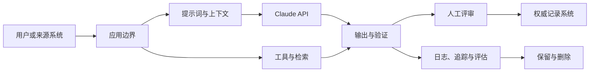

# 企业治理、合规与人工评审（Enterprise Governance, Compliance, and Human Review）

> 治理决定谁可以使用谁的数据、承担哪种风险。

**Type:** Reference
**Languages:** Python
**Prerequisites:** [用权限约束能力（Put Authority Around Capability）](../../06-governance-safety-and-responsible-use/), [集成协议、身份与最小权限（Integration Protocols, Identity, and Least Privilege）](../../25-integration-protocols-identity-and-least-privilege/); 阶段 17，第 26 课
**Time:** ~150 分钟

## 学习目标（Learning Objectives）

- 将政策和监管义务转化为有负责人的技术控制
- 对数据分类，映射它在提示词、工具、存储、日志和评审中的流动
- 根据风险、权限和可逆性设计人工评审
- 结合情境评估偏差、公平性、透明度和可申诉性
- 为审批、监控、事故响应和审计建立证据

## 问题（The Problem）

医疗团队提出一个 Claude 工作流：概括患者消息、建议分流类别并起草回复。设计文档写道：“模型不保留数据，所有输出都经人工评审，系统符合 HIPAA。”

这些陈述没有一条算架构。

数据可能出现在 API 载荷、文件、缓存、批存储、日志、追踪、支持系统和评审工具中。“人工评审”没有说明评审者资质、证据、工作量或权限。合规取决于具体用途、合同、配置、地区、控制和法律分析，架构师不能用一句话宣告。

正确响应不是自动否决，而是设计受治理的系统：包含数据地图、风险决策、控制负责人、证据，并在需要时升级给安全、隐私、法律、临床或合规专家。

本课教授架构判断，不提供法律建议。

## 概念（The Concept）

### 从风险决策开始（Start With a Risk Decision）

治理首先识别：

- 系统影响的决策或操作
- 可能受益或受害的人
- 涉及的数据类别
- 错误与滥用模式
- 可逆性
- 所需权限
- 适用的组织和外部义务
- 接受剩余风险的负责人

不要从通用防护清单开始。内容过滤、审批队列或加密控制只有在特定边界解决明确风险时才有价值。

### 映射数据在整个系统中的流动（Map Data Through the Whole System）



对每条连线和存储记录：

- 数据类别和用途
- 适用时记录来源和数据主体
- 必需与可选字段
- 身份和访问
- 加密与密钥归属
- 服务商与次级处理商边界
- 地区或数据驻留要求
- 保留与删除行为
- 是否用于模型改进或评估
- 事故和访问审计证据

不同产品功能的数据保留和资格要求可能不同。文件、批处理、代码执行、MCP 连接器、托管会话和标准 Messages 请求未必共享同一边界。针对确切功能组合，核对当前官方文档和协议。

### 先最小化，再保护（Minimize Before Protecting）

不必要的数据根本不进入系统时，安全控制更强。

按以下顺序：

1. 移除任务不需要的字段。
2. 不需要身份时，使用假名化或聚合。
3. 根据明确需求限制功能或服务商边界。
4. 限制身份、权限范围、保留和日志。
5. 用加密、监控和事故控制保护仍然需要的数据。

“告诉 Claude 不要记住”不是保留控制。保留由配置和合同行为定义。

### 建立控制矩阵（Build a Control Matrix）

控制分为几类。

| 类型 | 用途 | 示例 |
|------|---------|---------|
| 预防性（Preventive） | 阻止不安全事件 | 范围门禁阻止未授权写入 |
| 检测性（Detective） | 揭示问题 | 对抽样输出中的敏感字段泄漏告警 |
| 纠正性（Corrective） | 限制或修复伤害 | 撤销访问、回滚模型路由、修正受影响记录 |
| 治理性（Governance） | 分配并评审权限 | 实质变化后，由指定负责人重新批准用例 |

对每项控制记录负责人、实现、证据、测试、失败响应和评审频率。没有负责人和测试的控制只是愿望。

### 分层设置模型与系统防护（Layer Model and System Guardrails）

使用多个边界：

- 输入验证与分类
- 将可信来源与不可信内容分离
- 提示词指令和示例
- 最小工具暴露
- 身份认证与授权
- 模式和语义输出验证
- 操作限制与审批
- 部署后监控和红队测试

提示词防护影响生成，系统防护强制不变条件，两者不能互相替代。

### 将人工评审设计为控制（Design Human Review as a Control）

人在回路（Human-in-the-loop，HITL）只有在评审者能改善决策，并有信息、时间、能力和权限时才有用。

定义：

- 触发条件：风险类别、证据不足、冲突、不确定性或抽样案例
- 评审者：角色与资质
- 证据包：来源证据、模型输出、工具轨迹、标记和拟议操作
- 决策：批准、编辑、拒绝、升级或请求证据
- 服务等级：时间预算和队列容量
- 后备方案：评审不可用时的安全行为
- 审计：身份、理由、时间戳和最终操作

避免自动化偏见（Automation bias）。评审者需要有理由检查证据，而不是被精美答案引导得只做形式批准。考虑先展示来源片段、后展示生成结论，或要求结构化原因码。

### 让评审匹配风险（Match Review to Risk）

| 风险 | 示例 | 评审模式 |
|------|---------|----------------|
| 低 | 易撤销的内部草稿 | 自动检查加抽样评审 |
| 中 | 面向客户的建议 | 阈值或例外评审 |
| 高 | 财务、法律、临床或破坏性操作 | 操作前由具备资格者批准 |
| 未知 | 新用例或薄弱证据 | 暂停、升级并收集证据 |

同一模型给出的置信度不是可靠安全边界。使用可观测证据、经过校准的评估器、确定性条件和合格评审。

### 把公平性当作情境需求（Treat Fairness as a Contextual Requirement）

偏差（Bias）指可能使人处于不利地位的系统性错误或表示。公平性（Fairness）不存在一个通用指标。

询问：

- 正在作出什么决策？
- 哪些群体可能经历不同错误率或访问机会？
- 哪些受保护或敏感属性被直接使用、推断或代理？
- 哪种公平定义符合该法律和伦理情境？
- 与准确率、隐私和个体待遇存在哪些取舍？
- 谁有权选择并评审标准？

适当时测试代表性切片和交叉群体。小样本带来的不确定性应报告，而非隐藏。

### 提供透明度与可申诉性（Provide Transparency and Contestability）

不同人需要不同解释。

- 最终用户需要知道 AI 何时实质影响交互，以及如何质疑有害结果。
- 评审者需要证据、不确定性和控制背景。
- 运维人员需要版本、追踪和失败类别。
- 审计者需要政策映射、测试、归属和保留证据。
- 管理者需要剩余风险、业务影响和决策状态。

不要把思维链或敏感系统指令作为解释暴露。提供基于来源的理由、适用规则、相关因素和人工申诉路径。

### 为变化做准备（Plan for Change）

任何实质要素变化时重新评估：

- 用例或受影响人群
- 模型或服务商
- 提示词或工具权限
- 数据来源、保留或地区
- 评估结果或事故模式
- 法律、政策或合同
- 部署规模

对风险评估和控制证据做版本管理。一次上线批准不覆盖无关的未来系统。

## 动手实现（Build It）

## 交互实验（Interactive Lab）

```figure
27-governance-approval-flow
```

使用审批流程探索器，改变后果、可逆性、证据、评审者资质、队列容量和后备方案。它展示“人工评审”标签何时是真控制，何时只是瓶颈。

## 实践实验（Practice Lab）

从证据包副本中移除评审后备方案或一个控制负责人，观察阻塞状态，再修复治理设计。

## 交付物（Shipped Artifact）

填写完成的 [`outputs/governance-control-packet.md`](../outputs/governance-control-packet.md) 包含风险登记表、数据边界、预防性、检测性、纠正性和治理性控制，以及有人员保障的审批路径。

## 验证（Verify It）

以确定性方式验证归属和失败响应：

```bash
cd certifications/claude/lessons/27-enterprise-governance-compliance-and-hitl
python3 code/main.py
python3 -m unittest discover -s code/tests -v
```

测验检查治理和重新评估决策。

## 综合实践衔接（Capstone Connection）

将此包带入专业架构师（Architect Professional）综合实践的治理与人工评审章节。

为高影响 Claude 工作流创建治理包。

### 步骤 1：风险登记表（Step 1: Risk Register）

```markdown
| 风险 | 原因 | 受影响方 | 影响 | 可能性 | 控制 | 负责人 | 剩余风险 |
|------|-------|----------------|--------|------------|---------|-------|---------------|
```

包含意外失败、误用、提示词注入、内部人员访问、依赖失败、知识过时、表现不公平和评审者过载。

### 步骤 2：数据地图（Step 2: Data Map）

列出每个载荷、存储、日志、缓存、评估集、人工界面和外部服务。标明数据用途、最少字段、保留、删除、身份、地区和合同边界。

### 步骤 3：控制矩阵（Step 3: Control Matrix）

```markdown
| 控制 | 所解决风险 | 边界 | 负责人 | 证据 | 测试 | 失败时 |
|---------|----------------|----------|-------|----------|------|------------|
```

至少各包含一项预防性、检测性、纠正性和治理性控制。

### 步骤 4：人工评审设计（Step 4: Human Review Design）

规定触发条件、评审者资质、证据包、操作、队列 SLO、后备方案和审计记录。计算预期评审量。如果队列无法满足 SLO，设计就不完整。

### 步骤 5：审批与重新评估（Step 5: Approval and Reassessment）

指出需要不同负责人承担的技术、安全、隐私、领域和业务决策。定义实质变化触发条件和下次评审日期。

## 实际应用（Use It）

患者消息工作流较安全的首版，可以只为合格评审者起草分流建议，不发送回复，也不改病历。它使用最少必要字段、可信临床来源、严格租户和角色授权、关联来源的输出、高风险关键词与证据检查，并在评审队列不可用时采用安全后备方案。

团队随后验证：

- 按消息类别划分的任务准确率
- 紧急案例的假阴性行为
- 在允许且适当时的人口统计和语言切片
- 来源支持和过时数据处理
- 评审者一致性、时间和覆盖决策
- 隐私、访问、保留和删除控制
- 事故、回滚和审计行为

法律、隐私、安全和临床负责人判断结果证据是否满足适用义务。架构师提供地图、控制、测试和剩余风险说明。

## 考试决策模式（Exam Decision Patterns）

场景涉及受监管或敏感数据时，不要推断内部用途就自动获准。最小化、分类、核实政策与合同，并让适当权威参与。

优先选择以下答案：

- 移除或匿名化不必要标识
- 映射功能专用数据边界和保留
- 分层组合模型和确定性控制
- 将高影响操作绑定合格审批
- 测试代表性切片和不利案例
- 提供证据与申诉或升级路径
- 明确控制负责人和重评触发条件

避免把提示词、模型置信度、泛泛评审或供应商声明当成完整治理的答案。

## 常见陷阱（Common Traps）

### 凭产品名认定合规（Compliance by Product Name）

资格可能取决于功能、配置、协议、地区和数据流。应验证确切架构。

### 把人工评审当勾选项（Human Review as a Checkbox）

缺少证据且不合格或过载的评审者，无法可靠降低风险。

### 为审计记录日志却不最小化（Logging for Audit Without Minimization）

详尽日志可能形成新的敏感数据存储。保留最少证据，并实施适当访问和删除控制。

### 单一公平指标（One Fairness Metric）

不同公平定义可能冲突。根据情境、法律、伤害和相关方决策选择，再报告取舍。

## 练习（Exercises）

1. 为使用文件、MCP 连接器、批评估和人工评审的客服工作流建立数据地图。
2. 为每天 10,000 个任务、5% 触发率设计评审队列，计算人员配置假设。
3. 编写控制测试，证明未授权租户数据绝不进入模型上下文。
4. 为受到 AI 辅助决策伤害的用户定义申诉路径。
5. 创建强制重新评估治理的实质变化标准。

## 关键术语（Key Terms）

| 术语 | 常见说法 | 实际含义 |
|------|-----------------|------------------------|
| 治理（Governance） | 政策文档 | 系统生命周期中的决策、归属、控制、证据和评审 |
| 数据最小化（Data minimization） | 加密一切 | 不收集或发送用途不需要的字段 |
| 人在回路（Human-in-the-loop） | 有人看输出 | 有触发条件、合格负责人、证据、权限和后备方案的明确控制 |
| 剩余风险（Residual risk） | 隐藏问题 | 控制后仍存在、由获授权负责人明确接受的风险 |
| 公平性（Fairness） | 相等准确率 | 具有取舍和受影响相关方的情境专用标准 |
| 可申诉性（Contestability） | 客服 | 能够实质质疑、评审并修正结果的路径 |

## 延伸阅读（Further Reading）

- [Claude API 数据保留文档（data retention documentation）](https://platform.claude.com/docs/en/manage-claude/api-and-data-retention)：当前功能专用边界
- [Anthropic Trust Center](https://trust.anthropic.com/)：当前安全与合规材料
- [Claude 宪法（Claude's Constitution）](https://www.anthropic.com/constitution)：Anthropic 公开模型行为框架
- 阶段 17，第 26 课：合规架构
- 阶段 18，第 20 和 21 课：偏差与公平性
