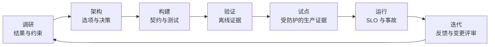

# 相关方沟通、ADR 与生命周期归属（Stakeholder Communication, ADRs, and Lifecycle Ownership）

> 架构不是画完图就交付了，而是下一位负责人能够把决策落实到运行中，才算交付。

**Type:** Reference
**Languages:** Python
**Prerequisites:** [业务调研、需求与 SLA（Business Discovery, Requirements, and SLAs）](../../22-business-discovery-requirements-and-slas/), [企业治理、合规与人工评审（Enterprise Governance, Compliance, and Human Review）](../../27-enterprise-governance-compliance-and-hitl/); 阶段 17，第 23 课
**Time:** ~135 分钟

## 学习目标（Learning Objectives）

- 在管理层、产品、工程和控制层面沟通同一架构
- 编写保留取舍与逆转条件的决策记录
- 将设计转化为实施指导、上线门禁和明确归属
- 定义交接验收与运维就绪条件
- 在系统全生命周期运行反馈和变更管理

## 问题（The Problem）

架构师向管理层指导小组展示详细多智能体图，包含模型路由、MCP 服务器、向量索引、事件队列、评估器和追踪，却没人能回答三个基本问题：

- 正在批准什么业务决策？
- 拟议控制实施后还剩什么风险？
- 上线后谁负责系统？

同一设计随后以幻灯片交给工程团队。关键选择只存在于会议记忆。运维没有收到 SLO 或回滚规则。政策团队不知道自己负责知识时效，评审者直到试点才发现要处理队列。

设计即使技术正确，也可能无法交付。沟通与生命周期归属是架构职责。

## 概念（The Concept）

### 同一系统需要多个视图（One System Needs Several Views）

不同相关方需要不同决策，不是不同事实。

| 受众 | 主要问题 | 最少证据 |
|----------|------------------|------------------|
| 管理层 | 价值是否值得剩余风险和投资？ | 结果、基线、目标、选项、成本范围、风险决策 |
| 产品与运营 | 工作流和用户体验怎样变化？ | 旅程、例外、评审、SLO、采用计划 |
| 工程 | 必须构建什么，边界如何工作？ | 组件、契约、身份、错误、版本、测试 |
| 安全与隐私 | 数据和权限在哪里跨边界？ | 数据地图、威胁模型、控制、保留、证据 |
| 领域负责人 | 输出对真实任务是否有效？ | 评估案例、来源、政策、升级、变更归属 |
| SRE 与支持 | 如何发现、限制并恢复失败？ | 遥测、告警、操作手册、回滚、依赖 |

不要通过删掉决策来简化。应把同一决策转化为每类受众使用的证据。

### 构建架构叙述（Build an Architecture Narrative）

有效评审遵循决策顺序：

1. 当前工作流和可衡量问题。
2. 塑造方案的约束与风险。
3. 考虑过的选项。
4. 推荐架构及胜出理由。
5. 后果和被否决方案。
6. 验证与上线计划。
7. 剩余风险和所需审批。
8. 运行和变化期间的归属。

先展示组件图，会迫使受众自己重建逻辑。应先提供逻辑。

### 用图回答一个问题（Use Diagrams to Answer One Question）



上下文图回答谁、什么跨越系统边界；数据流图回答敏感数据移到哪里；时序图回答一条轨迹如何运作；部署图回答运行时归属；控制地图回答风险在哪里被预防、检测和纠正。

一张承载过多内容的图，无法很好回答任何一个问题。

### 记录决策，而非会议对话（Record Decisions, Not Meeting Transcripts）

ADR 应短到愿意读，也完整到能够重新审视。

必需字段：

- 状态与决策负责人
- 背景与约束
- 选项与证据
- 决策与理由
- 后果和剩余风险
- 被否决方案
- 验证计划
- 逆转条件和评审日期

被否决方案很重要。没有它们，未来团队会重复相同分析，或在不了解会违反哪条约束时改变设计。

明确表达置信程度。“我们估计”比把未测试延迟或成本当事实更诚实，也更有用。

### 将架构转为契约（Turn Architecture Into Contracts）

实施指导需要机器可检查的边界：

- 请求与响应模式
- 身份和授权要求
- 版本管理和兼容规则
- 超时、重试、取消和幂等行为
- 结构化错误类别
- 数据分类和保留
- 提示词、模型、工具和知识归属
- 评估夹具和发布门禁
- 可观测性字段和脱敏

架构包应指向这些契约，不必复制每行实现。

### 按决策定义归属（Define Ownership by Decision）

“AI 团队负责”太宽泛。

为以下项目指定负责人：

- 业务结果
- 产品工作流和用户沟通
- 提示词与输出契约
- 模型选择和路由
- 工具与集成服务
- 知识来源时效
- 身份与权限
- 评估标签和接受阈值
- 安全与合规控制
- 运行时 SLO 和事故响应
- 供应商与成本管理
- 弃用和退役

区分提出变更建议的人，与有权接受风险的人。

### 设计交接验收（Design Handoff Acceptance）

接收团队能安全运行和修改系统时，交接才完成，而不是发送文档链接时。

验收标准：

- 确认负责人和升级联系人
- 架构与 ADR 最新
- 依赖和访问已就绪
- 仪表盘与告警已运行
- 通过失败演练实践操作手册
- 评估套件可运行，基线已保存
- 回滚已测试
- 数据保留和删除已验证
- 评审队列有人值守
- 已沟通知识局限
- 已约定变更和事故流程

进行联合验收评审。接收负责人应演示从模拟失败中恢复。

### 把采用规划纳入工作流（Plan Adoption as Part of the Workflow）

AI 系统改变工作方式。只培训界面操作不够，用户需要知道：

- 哪些任务在范围内
- 要检查什么证据
- 何时编辑、拒绝或升级
- 可以输入哪些数据
- 系统记录什么
- 如何报告有害或错误行为
- 服务不可用时会发生什么

用结果和质量衡量采用，而非只有登录次数。高用量可能反映强制流程或重复返工。

### 围绕影响与决策沟通事故（Communicate Incidents by Impact and Decision）

事故期间，区分已确认事实、当前影响、缓解措施和未知项。

```text
影响：哪些用户、任务或记录可能受影响？
证据：哪些遥测或评估确认了它？
遏制：哪项能力被停用或安全路由？
恢复：恢复服务前必须通过什么？
后续：哪项控制、负责人或假设需要变化？
```

不要猜测模型意图。描述可观测系统行为和控制响应。

### 保持生命周期证据关联（Keep Lifecycle Evidence Connected）

每个生产结果都应能追溯到：

- 需求与决策
- 系统和配置版本
- 测试与审批证据
- 部署和运行时追踪
- 人工评审或覆盖决策
- 下游结果
- 证据揭示问题时对应的变更请求

这条链支持调试、治理和有依据的迭代。

## 动手实现（Build It）

## 交互实验（Interactive Lab）

```figure
28-adr-lifecycle
```

使用 ADR 生命周期探索器，让一项决策经过调研、构建、验证、试点、运行、事故和重新考虑。改变证据或逆转条件，观察下一步哪个负责人必须行动。

## 实践实验（Practice Lab）

让过时检索的桌面推演失败，把变化证据追溯到决策负责人，并更新 ADR，而不是只改图。

## 交付物（Shipped Artifact）

填写完成的 [`outputs/delivery-handoff-packet.md`](../outputs/delivery-handoff-packet.md) 关联管理层决策、ADR、工程契约、运维演练和归属地图。

## 验证（Verify It）

验证其决策、负责人、恢复证明和可衡量的逆转触发条件：

```bash
cd certifications/claude/lessons/28-stakeholder-communication-adrs-and-lifecycle
python3 code/main.py
python3 -m unittest discover -s code/tests -v
```

测验检查沟通与生命周期决策。

## 综合实践衔接（Capstone Connection）

将经过验证的交付包用作专业架构师（Architect Professional）综合实践的最终交接章节。

创建包含五个交付物的交付包。

### 1. 管理层决策简报（1. Executive Decision Brief）

一页内容：问题、基线、目标、选项、推荐、投资范围、主要风险、验证和请求作出的决策。

### 2. 架构决策记录（2. Architecture Decision Record）

记录所选模式和至少两个被否决方案，包含逆转条件。

### 3. 工程契约索引（3. Engineering Contract Index）

```markdown
| 边界 | 契约 | 负责人 | 版本规则 | 失败规则 | 测试 |
|----------|----------|-------|--------------|--------------|------|
```

### 4. 运维就绪清单（4. Operational Readiness Checklist）

包含仪表盘、告警、操作手册、访问、评估、回滚、依赖、评审容量和事故沟通。

### 5. 归属与变更地图（5. Ownership and Change Map）

```markdown
| 决策或资产 | 运行负责人 | 变更批准者 | 证据 | 评审触发条件 |
|-------------------|-----------------|-----------------|----------|----------------|
```

进行桌面推演。模拟过时检索导致不安全建议、授权服务失败和评估器漂移。接收团队应识别影响、限制能力、从已知安全版本恢复，并记录后续归属。

## 实际应用（Use It）

对于企业研究助手，提供以下视图：

- 管理层：分析周期缩短、证据质量目标、预算和剩余保密风险。
- 产品：查询旅程、证据不足状态、引用体验和反馈路径。
- 工程：检索、模型、工具、身份和评估契约。
- 安全：租户边界、来源权限、日志、保留和事故控制。
- 运维：时效、延迟、成本、错误和质量仪表盘，以及回滚规则。

事实保持一致，细节根据每类受众负责的决策调整。

试点结束时，不只检查准确率。比较分析人员时间、引用检查、评审工作量、按任务类别划分的采用、每份获接受报告成本和事故。决定扩展、修订、限制还是停止。

## 考试决策模式（Exam Decision Patterns）

场景询问如何沟通取舍时，用适合受众的语言说明业务后果、技术证据、被否决方案和剩余风险。

优先选择以下答案：

- 承诺前进行结构化调研
- 记录背景、选项和后果
- 为提示词、数据、工具、控制、指标和运维分配负责人
- 定义实施与失败契约
- 要求运维就绪和交接验收
- 把反馈关联到版本化变更决策

避免只交图却没有 SLO、操作手册、评估器、归属或回滚的答案。

## 常见陷阱（Common Traps）

### 所有受众使用同一套幻灯片（One Deck for Every Audience）

要么管理层淹没在实现细节里，要么工程师只收到模糊主张。应使用事实一致、按决策调整的视图。

### 把架构当上线交付物（Architecture as a Launch Artifact）

架构随证据、规模、依赖和风险变化。在运行期间持续版本化决策与图表。

### 按团队名称分配归属（Ownership by Team Name）

团队标签不能说明谁更新过时来源、接受评估变化或响应告警。应分配具体决策。

### 采用等于价值（Adoption Equals Value）

用量上升时，质量、评审负担或总处理时间仍可能恶化。应测量结果。

## 练习（Exercises）

1. 将技术架构转为一页管理层决策简报。
2. 编写具有可衡量逆转条件的 ADR。
3. 为开始返回部分结果的工具创建交接演练。
4. 为 RAG 应用中每个可变交付物分配负责人。
5. 设计包含质量、返工和用户信任的采用评分卡。

## 关键术语（Key Terms）

| 术语 | 常见说法 | 实际含义 |
|------|-----------------|------------------------|
| 相关方（Stakeholder） | 受邀开会的任何人 | 负责、影响或承担某项决策或结果的人或群体 |
| ADR | 架构文档 | 聚焦单项决策及其背景、替代方案和后果的记录 |
| 交接（Handoff） | 发送文档 | 以证据转移运行能力和已接受责任 |
| 运维就绪（Operational readiness） | 部署成功 | 负责人、控制、可观测性、恢复、评估和支持均已证明就绪 |
| 采用（Adoption） | 用户数 | 持续使用工作流，产生预期结果且没有隐藏负担 |
| 逆转条件（Reversal condition） | 缺乏信心 | 触发计划内架构或范围变更的证据 |

## 延伸阅读（Further Reading）

- [Claude Platform 文档（documentation）](https://platform.claude.com/docs/en/home)：当前实施边界
- [构建有效智能体（Building effective agents）](https://www.anthropic.com/research/building-effective-agents)：解释工作流和智能体选择
- 阶段 17，第 23 课：SRE 实践
- 阶段 14，第 40 课：结构化技术交接
- 阶段 17，第 24 课：事故响应与运维恢复
