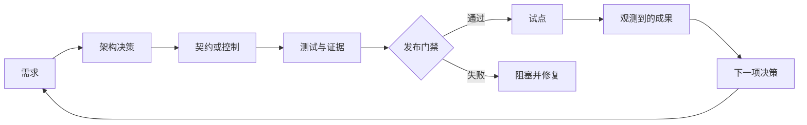

# 架构师专业级系统综合项目（Architect Professional System Capstone）

> 构建一份证据材料包，让生产架构的论证有据可依。

**Type:** Build
**Languages:** Python
**Prerequisites:** [选择足以承载工作的最小能力界面（Choose the Smallest Surface That Can Carry the Work）](../../01-claude-product-and-model-landscape/), [把能力用在失败代价高的地方（Spend Capability Where Failure Is Expensive）](../../02-model-selection-and-token-economics/), [把请求转化为可测试的契约（Turn a Request Into a Testable Contract）](../../03-prompting-and-task-decomposition/), [把每条事实放入合适的上下文（Put Each Fact in the Right Kind of Context）](../../04-context-knowledge-memory-and-caching/), [验证断言，而非置信度（Validate the Claim, Not the Confidence）](../../05-output-evaluation-and-validation/), [为能力划定权限边界（Put Authority Around Capability）](../../06-governance-safety-and-responsible-use/), [Messages API 是状态机（The Messages API Is a State Machine）](../../08-messages-api-and-application-lifecycle/), [结构化输出是不可信的契约（Structured Output Is an Untrusted Contract）](../../09-structured-output-and-defensive-parsing/), [工具循环是受控委派（A Tool Loop Is Controlled Delegation）](../../10-tool-use-and-agentic-loops/), [MCP 将能力与宿主分离（MCP Separates Capability From Host）](../../11-mcp-server-design-and-integration/), [Agent SDK 是执行框架，不是授权（The Agent SDK Is a Harness, Not Permission）](../../12-claude-agent-sdk-and-hooks/), [安全边界位于提示词之外（Security Lives Outside the Prompt）](../../13-application-security-and-secrets/), [评估将智能体行为转化为工程证据（Evals Turn Agent Behavior Into Engineering Evidence）](../../14-evals-testing-debugging-and-observability/), [Claude Code 通过共享约束实现规模化协作（Claude Code Scales Through Shared Constraints）](../../15-claude-code-for-development-teams/), [多智能体编排与委派（Multi-Agent Orchestration and Delegation）](../../16-multi-agent-orchestration-and-delegation/), [工具契约、错误与渐进式发现（Tool Contracts, Errors, and Progressive Discovery）](../../18-tool-contracts-errors-and-progressive-discovery/), [业务调研、需求与 SLA（Business Discovery, Requirements, and SLAs）](../../22-business-discovery-requirements-and-slas/), [端到端架构与价值权衡（End-to-End Architecture and Value Tradeoffs）](../../23-end-to-end-architecture-and-value-tradeoffs/), [RAG、检索与数据流水线（RAG, Retrieval, and Data Pipelines）](../../24-rag-retrieval-and-data-pipelines/), [集成协议、身份与最小权限（Integration Protocols, Identity, and Least Privilege）](../../25-integration-protocols-identity-and-least-privilege/), [生产可观测性、延迟与成本（Production Observability, Latency, and Cost）](../../26-production-observability-latency-and-cost/), [企业治理、合规与人工审查（Enterprise Governance, Compliance, and Human Review）](../../27-enterprise-governance-compliance-and-hitl/), [利益相关方沟通、ADR 与生命周期责任归属（Stakeholder Communication, ADRs, and Lifecycle Ownership）](../../28-stakeholder-communication-adrs-and-lifecycle/)
**Time:** ~8 至 12 小时

## 学习目标（Learning Objectives）

- 为生产环境中的 Claude 系统交付从调研到运营的完整架构
- 论证模式、模型、上下文、RAG、集成和控制方面的决策
- 通过明确的门禁证明质量、延迟、成本、使用安全和系统安全
- 整理治理、上线部署、运行手册和生命周期责任归属
- 面向管理层、工程、控制职能和运营受众，呈现同一项决策

## 任务（The Mission）

为一家在多个地区运营的公司，设计一个受治理约束的企业客户支持问题解决系统。

现有团队每周处理 40,000 张工单，其中大部分是账单和物流问题。首次响应时间的中位数为 11 分钟。政策变更每周通过文档和内部系统发布。审查发现引用不一致，而此前的一次自动化执行了超出员工权限的退款。

拟议系统可以对工单分类、检索现行政策、读取限定范围的账户上下文、起草回复和建议操作。它不得删除账户。执行退款需要明确权限，以及新近取得的人工批准。公司要求分阶段上线、可衡量的质量、考虑地区要求的数据处理，以及向支持平台团队的运营交接。

你的任务不是尽可能提高自主程度，而是在约束下设计最合适的系统，并证明它为什么已经就绪。

## 必需交付物（Required Deliverables）

使用 `outputs/architecture-packet-template.md` 中的模板。材料包必须包含十项相互关联的产物。

### 1. 调研简报（Discovery Brief）

定义成果、基线、目标、护栏、用户、当前工作流、数据、权限、假设和非目标。

至少区分以下概念：

- 首次响应时间与总解决时间
- 系统执行完成与符合政策的任务成功
- 建议与执行权限
- 内部目标与合同承诺
- 已知事实与估算

### 2. 架构备选方案与 ADR（Architecture Options and ADRs）

至少比较：

1. 检索辅助起草，并对全部结果进行人工审查
2. 包含受限模型步骤的确定性工作流
3. 自适应工具使用智能体

选择其中一种。记录证据、后果、被否决的备选方案和推翻决策的条件。如果使用多个智能体，说明每个上下文边界或独立审查者的必要性。组件更多不会获得更多分数。

### 3. 端到端系统视图（End-to-End System Views）

为以下内容创建 Mermaid 图：

- 系统上下文
- 数据与身份流
- 一张普通工单的处理时序
- 一次高风险退款的处理时序
- 部署与责任归属
- 故障与部分结果路径

每条对外连线都必须说明模式、身份、超时、重试、证据和负责人。

### 4. 模型、提示词与上下文计划（Model, Prompt, and Context Plan）

定义任务类别，以及每类任务的模型选择标准。纳入质量、延迟、成本、上下文和思考需求。没有验证日期，不要固定产品事实。

设计以下内容：

- 系统指令与用户指令边界
- 在判断一致性需要时提供少样本示例（Few-shot Examples）
- 稳定前缀与提示词缓存（Prompt Caching）计划
- 上下文裁剪与压缩
- 结构化输出与语义校验
- 提示词和模型版本管理

### 5. 知识与 RAG 设计（Knowledge and RAG Design）

明确来源责任归属、解析方式、分块形态、元数据、稀疏或稠密检索、过滤器、重排序（Reranking）、上下文组装、来源溯源（Provenance）、来源冲突、时效性、版本激活和回滚。

创建检索评估，包含普通、含糊、过期、未授权和对抗性案例。将检索表现与答案质量分开衡量。

### 6. 集成与身份设计（Integration and Identity Design）

根据需求选择直接 API、CLI、MCP 或智能体间边界。在工具发现、模式、凭据和操作各环节落实最小权限（Least Privilege）。

为退款设计新近确认的批准机制。将批准绑定到主体（Principal）、金额、账户、理由、到期时间和单次使用限制。为校验、授权、冲突、限流、依赖和超时定义结构化错误。

### 7. 评估与生产证据（Evaluation and Production Evidence）

创建具有代表性的黄金集（Golden Set）和混合方法评估计划。

纳入以下内容：

- 检索召回率与时效性
- 断言支持度与引用覆盖率
- 政策遵循情况与完整性
- 工具与授权执行轨迹
- 不安全操作预防
- P50 和 P95 延迟
- 每个验收通过任务的成本
- 审查者一致性与审查时间
- 高风险分层，以及地区或语言分层

比较基线与拟议系统。定义不能被平均值抵消的硬门禁（Hard Gate）。

### 8. 治理与人工审查（Governance and Human Review）

产出风险登记册、数据地图、控制矩阵、审查设计、公平性计划、申诉路径、事件证据计划和重大变更触发条件。

说明哪些问题需要安全、隐私、法务、合规、财务或领域负责人的批准。不要代表这些负责人宣称法律合规。

### 9. 上线与运营（Rollout and Operations）

规划影子模式（Shadow）、金丝雀发布（Canary）、受控扩展、回滚、仪表盘、告警、运行手册、容量、依赖故障和审查队列行为。

每条告警都需要负责人和响应操作。每个生产版本都需要一个已知安全的回滚方案。针对过期政策、授权服务中断、通过工单注入提示词，以及评估器漂移开展桌面推演（Tabletop Exercise）。

### 10. 利益相关方与交接材料包（Stakeholder and Handoff Package）

准备：

- 一页管理层决策简报
- 产品工作流与采用计划
- 工程契约索引
- 安全与隐私控制摘要
- 运营就绪与交接检查清单

接收团队必须在验收前证明其具备监控、安全停用、回滚、评估和事件升级处理能力。

## 架构方法（Architecture Method）

在整个材料包中使用同一条证据链。



如果某个组件无法追溯到需求，就应质疑它是否必要。如果某项需求没有控制或测试，架构就是不完整的。如果某项测试不会影响发布决策，它就只是一份报告。

## 动手构建（Build It）

## 交互实验（Interactive Lab）

```figure
32-architect-professional-readiness
```

使用专业级就绪度面板，将需求与决策、控制、证据、发布门禁、试点成果和生命周期负责人关联起来。无论加权就绪度得分如何，授权、安全和回滚硬门禁的失败都应清晰可见。

## 实践实验（Practice Lab）

让支持业务架构分别经历一项未满足的需求、一项未经验证的硬控制、一项失败的评估门禁和一次回滚演练，并在各自责任边界内修复问题。

## 交付产物（Shipped Artifact）

材料包模板、完成的
[`outputs/reference-architecture-packet.md`](../outputs/reference-architecture-packet.md)、
填写完成的 [`outputs/demo-readiness-report.json`](../outputs/demo-readiness-report.json)
和 [`outputs/scored-rubric.md`](../outputs/scored-rubric.md) 是本课的实践产出。已评分的参考方案仍不得发布到生产环境，直到其中明确列出的真实环境硬门禁和交接证据通过验收。

## 验证（Verify It）

Python 实验校验架构材料包的结构，不评判业务决策是否正确。它捕获的是更基础的一类故障：缺少负责人、需求无法衡量、硬控制未经验证、评估门禁失败、没有回滚方案，以及决策缺少推翻条件。

```bash
cd certifications/claude/lessons/32-architect-professional-system-capstone/code
python3 main.py
python3 -m unittest discover tests -v
```

### 步骤 1：编码需求（Step 1: Encode Requirements）

每个 `Requirement` 都有类别、可测试的陈述、可衡量标志和负责人。在你的材料包中，用明确的测量契约替换这一标志。

### 步骤 2：编码决策（Step 2: Encode Decisions）

每个 `Decision` 都记录情境、所选方案、被否决的方案、后果、推翻条件和负责人。没有备选方案的建议无法体现权衡判断。

### 步骤 3：编码控制（Step 3: Encode Controls）

每个 `Control` 都明确风险、类型、负责人、证据、验证状态，以及是否属于发布硬门禁。硬门禁失败时，无论平均就绪度如何，都必须阻止发布。

### 步骤 4：评估门禁（Step 4: Evaluate Gates）

`EvaluationGate` 支持最小值、最大值和相等阈值。用它检查质量、延迟、成本和零容忍控制结果。真实门禁还需要置信区间、样本要求和细分群体覆盖。

### 步骤 5：作出发布决策（Step 5: Make the Release Decision）

`release_decision` 返回全部发现项和阻塞项数量。在这个简化实现中，遗漏非目标会被报告，但不会阻止发布。你的评审委员会可以将其设为门禁。

使用上述命令复现报告，并运行全部确定性门禁。六道测验题检查个人架构判断能力。

## 与综合项目的联系（Capstone Connection）

完成的十项产物材料包、答辩、演练和已验收交接，共同构成架构师专业级（Architect Professional）综合项目的提交材料。

## 架构答辩（Architecture Defense）

用 20 分钟介绍材料包，然后回答以下问题：

1. 为什么这一模式比最有力的被否决方案更简单？
2. 每次模型和智能体调用分别由哪项需求支撑？
3. 检索返回的证据不足或相互冲突时，会发生什么？
4. 每个工具接收到哪个身份，权限如何检查？
5. 哪些证据会阻止发布？
6. 你如何确定较便宜的变体，按每次成功成果计算仍然更便宜？
7. 审查者能够查看什么、决定什么，以及将什么升级处理？
8. 哪些产品细节需要在部署前重新验证？
9. 每个来源、控制、指标、告警和事件分别由谁负责？
10. 哪些证据会让你推翻当前架构决策？

答案必须引用产物和证据。“模型有这个能力”不能构成论证。

## 评分标准（Scoring Rubric）

| 领域 | 权重 | 掌握程度的证据 |
|------|-------:|---------------------|
| 解决方案设计 | 17 | 方案符合需求；任务分解与反馈明确 |
| 模型、提示词、上下文 | 13 | 选择与复用依据测得的权衡 |
| 集成 | 19 | RAG、协议、身份和最小权限设计相互一致 |
| 评估与优化 | 16 | 代表性测试和运营信号驱动发布决策 |
| 治理与风险 | 14 | 数据、控制、审查、公平性和批准均有负责人 |
| 利益相关方生命周期 | 14 | 决策落实为交付、采用、交接和变更 |
| 开发者运维 | 7 | 团队配置、调试、运行手册和责任归属可实际使用 |

使用该评分标准开展自评和独立审查。它是课程工具，不是官方考试评分模型。

## 考试决策模式（Exam Decision Patterns）

专业级考试考查生命周期判断。当多个选项听起来都合理时，应选择在正确系统边界处理指定约束，并产生可供其他负责人验证的证据的方案。

结构上的优先顺序：

- 先澄清，再自动化
- 先最小化，再加防护
- 先检索和过滤，再生成
- 在执行时授权
- 校验语义断言，而不只是语法
- 评估完整执行轨迹和最终状态
- 硬控制失败时阻止发布
- 渐进式上线
- 为变更直至退役的全过程分配负责人

## 综合项目的常见失败（Common Capstone Failures）

### 图很精美，却没有决策（A Polished Diagram Without Decisions）

补充需求、备选方案、后果和推翻条件。

### 控制清单很长，却没有证据（A Long Control List Without Evidence）

为每项控制指定负责人、测试、结果、失败响应和审查触发条件。

### 评估只覆盖理想路径（An Evaluation With Only Happy Paths）

补充含糊输入、过期数据、冲突来源、提示词注入、授权失败、工具超时、高风险子集和审查者过载。

### 人工审查队列没有容量规划（A Human Review Queue Without Capacity）

估算处理量、时间、资格要求、服务等级目标（SLO）、回退方案和升级处理需求。

### 交接没有恢复能力证明（A Handoff Without Recovery Proof）

执行演练。运营团队应能够恢复到已知安全的状态，而不需要架构师逐步讲解。

## 练习（Exercises）

1. 将客户支持场景替换为受监管的文档分析工作流，识别哪些控制和负责人会变化。
2. 为 `EvaluationGate` 增加统计置信度和最小样本量。
3. 在机器可读材料包中，将授权和过期来源控制设为硬门禁。
4. 请独立审查者找出五项没有测试或负责人的需求。
5. 模拟一次金丝雀发布回归后，记录一次真正推翻原决策的决定。

## 关键术语（Key Terms）

| 术语 | 常见说法 | 实际含义 |
|------|-----------------|------------------------|
| 架构材料包（Architecture packet） | 一份很长的设计文档 | 相互关联的决策、契约、证据、控制、责任归属和恢复方案 |
| 硬门禁（Hard gate） | 高权重指标 | 无论平均值如何，都能阻止发布的条件 |
| 就绪度（Readiness） | 代码已完成 | 已证明能够满足需求，并安全处理故障 |
| 架构答辩（Architecture defense） | 演示技巧 | 基于证据解释选择、后果和被否决的备选方案 |
| 运营负责人（Operating owner） | 部署团队 | 对 SLO、事件、变更和退役承担责任的角色 |

## 延伸阅读（Further Reading）

- [Claude 认证架构师专业级考试指南（Claude Certified Architect Professional exam guide）](https://everpath-course-content.s3-accelerate.amazonaws.com/instructor%2F6nizmqk8tpzpfjvt6qmmav7rh%2Fpublic%2F1783542810%2FClaude+Certified+Architect+%E2%80%93+Professional+Exam+Guide.pdf)
- [Claude Platform 文档（Claude Platform documentation）](https://platform.claude.com/docs/en/home)
- [构建有效的智能体（Building effective agents）](https://www.anthropic.com/research/building-effective-agents)
- 架构师专业级学习路线中的全部课程
