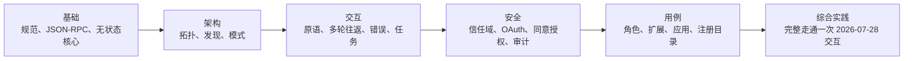

# MCPA 认证课程（MCPA Certification Curriculum）

> 亲手构建考试所描述的协议，掌握考试要检验的判断能力。

**Status:** 本地预览（Local preview）
**Guide version:** 1.0
**Guide effective date:** 2026 年 9 月（September 2026）
**Last verified:** 2026-09-24

这套免费课程面向 Agentic AI Foundation 的模型上下文协议助理认证（Model Context Protocol Associate，MCPA），考试由 Linux Foundation Training and Certification 提供：

| 考试（Exam） | 认证（Credential） | 级别（Level） | 时长（Time） | 费用（Fee） | 主线路线（Core route） |
|------|------------|-------|------|-----|-----------:|
| MCPA | 模型上下文协议助理认证（Model Context Protocol Associate） | 入门（Beginner） | 90 分钟 | $250 | 34 课 |

按上游于 2026 年 9 月 24 日保存的核验记录，考试采用在线监考、多项选择题形式，对齐 2026-07-28 版模型上下文协议规范；认证有效期两年，包含一次补考机会，报考资格有效期十二个月。官方未公布考试题数和及格分数，因此本课程三套各 60 题的模拟卷属于原创练习集，不能将其题量当作官方题量，也不能凭练习百分比预测官方结果。MCPA 考试页面列出的时长为 90 分钟，发布公告则写为 120 分钟。项目细节可能变化，预约前请在官方页面确认当前价格、形式、时长和报考资格。所有考试信息及其检索日期均记录在[来源核验台账](research/source-verification-ledger.md)中；本次汉化保留原核验日期，没有将其更新为新核验结果。

## 在 GitHub 上使用 AI 导师学习（Learn From GitHub With an AI Tutor）

本课程采用 AI 原生学习方式。Claude Code、Codex、ChatGPT、Cursor 或其他智能体可以按路线授课、运行已纳入版本控制的实验、审阅你构建的交付物、主持课内测验，并从已保存的进度继续。

先阅读 [GitHub 学习者指南](GETTING_STARTED.md)，也可以安装位于 [../../skills/mcpa-certification/SKILL.md](../../skills/mcpa-certification/SKILL.md) 的通用认证导师技能：

```bash
npx skills add rohitg00/ai-engineering-from-scratch
```

随后让智能体运行：

```text
/mcpa-certification
```

克隆仓库后，本地 Claude Code 会话会从 `.claude/skills/` 发现同一技能。不支持斜杠命令的运行框架可以直接阅读 `GETTING_STARTED.md` 和导师技能。学习进度保存在 `MCPA-CERTIFICATION.md`，学习者自己的作品保存在 `learning-artifacts/mcpa/`。已纳入版本控制的 `outputs/` 文件始终作为参考交付物，绝不覆盖。本认证课程有意不纳入 EPUB/PDF 电子书生成流程，也不会转换进课程图书。中文分支使用本地已译文件；上面的安装命令保留上游地址，执行它可能安装上游英文内容，不能据此假定已经加载本中文分支。

## 你将构建什么（What You Build）

沿一条路线从基本原理出发，逐步组装一次可运行的 MCP 交互：



每课都提供可运行的标准库 MCP 模拟实现、测试套件、课内测验和可复用交付物。课程以无状态的 2026-07-28 版本作为本路线的协议基线，`scripts/check_mcpa_wire.py` 会按该版本的消息结构检查各实验报文。协议信息、对应一手来源，以及编写时处理的来源冲突，保存在[协议研究简报](research/mcp-2026-07-28-brief.md)中。路线包括一套 30 题诊断测评和三套各有侧重的完整原创模拟卷；题目分布在合理取整范围内遵循公开考试大纲的领域权重。这些练习不模仿或复刻真实考试试题。

MCPA 大纲包含五个领域：

| 领域（Domain） | 权重（Weight） |
|--------|-------:|
| MCP 基础（MCP Fundamentals） | 16% |
| 架构与组件（Architecture and Components） | 14% |
| 交互与执行（Interactions and Execution） | 26% |
| 安全与治理（Security and Governance） | 24% |
| 用例与生态（Use Cases and Ecosystem） | 20% |

## GitHub 课程索引（GitHub Lesson Index）

导师按路线文件中的顺序授课。下方完整索引也方便你直接从 GitHub 打开任意一课。

| 序号（#） | 课程（Lesson） |
|---:|--------|
| 00 | [MCPA 考试大纲应指导学习预算，而非充当勾选清单](lessons/00-mcp-exam-strategy/) |
| 01 | [阅读 MCP 规范（Reading the MCP Specification）](lessons/01-reading-the-specification/) |
| 02 | [MCP 解决的集成问题（The Integration Problem MCP Solves）](lessons/02-the-integration-problem/) |
| 03 | [JSON-RPC 消息封套（The JSON-RPC Envelope）](lessons/03-json-rpc-and-meta/) |
| 04 | [MCP 的无状态核心（The Stateless Core of MCP）](lessons/04-the-stateless-core/) |
| 05 | [区分现代与旧版 MCP 服务器（Telling a Modern MCP Server From a Legacy One）](lessons/05-protocol-eras-and-compatibility/) |
| 06 | [宿主、客户端与服务器：MCP 的进程拓扑（Hosts, Clients, and Servers: MCP's Process Topology）](lessons/06-hosts-clients-and-servers/) |
| 07 | [发现服务器并协商能力（Discovering a Server and Negotiating What It Can Do）](lessons/07-discovery-and-capability-negotiation/) |
| 08 | [工具定义中的契约（The Contract Inside a Tool Definition）](lessons/08-tool-schemas-and-structured-content/) |
| 09 | [像评审者一样阅读服务器清单（Reading a Server Manifest Like a Reviewer）](lessons/09-reading-server-manifests/) |
| 10 | [模型交互流程（The Model Interaction Flow）](lessons/10-model-interaction-flow/) |
| 11 | [工具原语：执行动作并读取结果（The Tools Primitive: Calling Actions and Reading Their Results）](lessons/11-the-tools-primitive/) |
| 12 | [资源：无状态服务器中的可寻址内容（Resources: Addressable Content for a Stateless Server）](lessons/12-the-resources-primitive/) |
| 13 | [提示词模板与参数补全（Prompt Templates and Argument Completion）](lessons/13-prompts-and-completion/) |
| 14 | [多轮往返请求与信息征询（Multi Round-Trip Requests and Elicitation）](lessons/14-multi-round-trip-requests-and-elicitation/) |
| 15 | [已弃用但仍可用：Roots、Sampling 与 Logging（Deprecated, Not Removed: Roots, Sampling, and Logging）](lessons/15-deprecated-client-features/) |
| 16 | [订阅流：通知、进度与取消（The Subscription Stream: Notifications, Progress, and Cancellation）](lessons/16-notifications-and-subscriptions/) |
| 17 | [工具调用生命周期（The Tool Invocation Lifecycle）](lessons/17-tool-invocation-lifecycle/) |
| 18 | [请求失败的两个通道（Two Ways for a Request to Fail）](lessons/18-error-handling/) |
| 19 | [传输与 HTTP 请求头契约（Transports and the HTTP Header Contract）](lessons/19-transports-and-http-headers/) |
| 20 | [缓存新鲜度与游标分页（Cache Freshness and Cursor-Based Pagination）](lessons/20-caching-and-pagination/) |
| 21 | [长时间运行的工作与任务扩展（Long-Running Work and the Tasks Extension）](lessons/21-long-running-work-and-tasks/) |
| 22 | [MCP 交互中的信任区域（Trust Zones in an MCP Exchange）](lessons/22-trust-boundaries/) |
| 23 | [为 MCP 服务器访问授权（Authorizing Access to an MCP Server）](lessons/23-oauth-authorization/) |
| 24 | [向授权服务器证明客户端身份（Proving a Client's Identity to an Authorization Server）](lessons/24-client-registration-and-identity/) |
| 25 | [同意授权与最小权限（Consent and Least Privilege）](lessons/25-consent-and-least-privilege/) |
| 26 | [MCP 工具调用的风险与安全控制（Risk and Safety Controls for MCP Tool Calls）](lessons/26-risk-and-safety-controls/) |
| 27 | [用同一个追踪 ID 关联审计与可观测性（One Trace ID Ties Auditability to Observability）](lessons/27-auditability-and-observability/) |
| 28 | [每条 MUST 都需要负责人（Every MUST Needs an Owner）](lessons/28-roles-and-adoption/) |
| 29 | [按工作需求选择 MCP 方案（Choosing MCP's Shape for the Job）](lessons/29-operational-use-cases/) |
| 30 | [扩展框架（The Extensions Framework）](lessons/30-the-extensions-framework/) |
| 31 | [对话中的交互界面（Interactive Interfaces Inside the Conversation）](lessons/31-mcp-apps/) |
| 32 | [发现服务器、路由请求与判断可信度（Finding, Routing To, and Trusting a Server）](lessons/32-registry-gateways-and-sdk-tiers/) |
| 33 | [从头到尾读懂一段 MCP 交互（Reading One MCP Exchange End to End）](lessons/33-mcpa-capstone-readiness/) |

## 独立性声明（Not Affiliated）

本课程由独立社区编写，与 Agentic AI Foundation 或 Linux Foundation 无隶属关系，未获其背书、赞助或授权。不包含真实考试试题。官方考试页面及当前项目政策始终优先。
