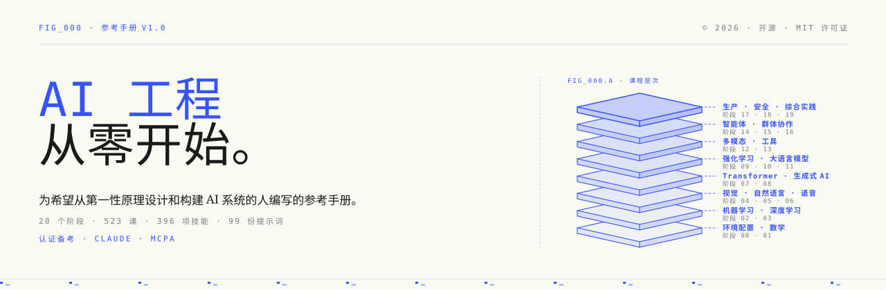
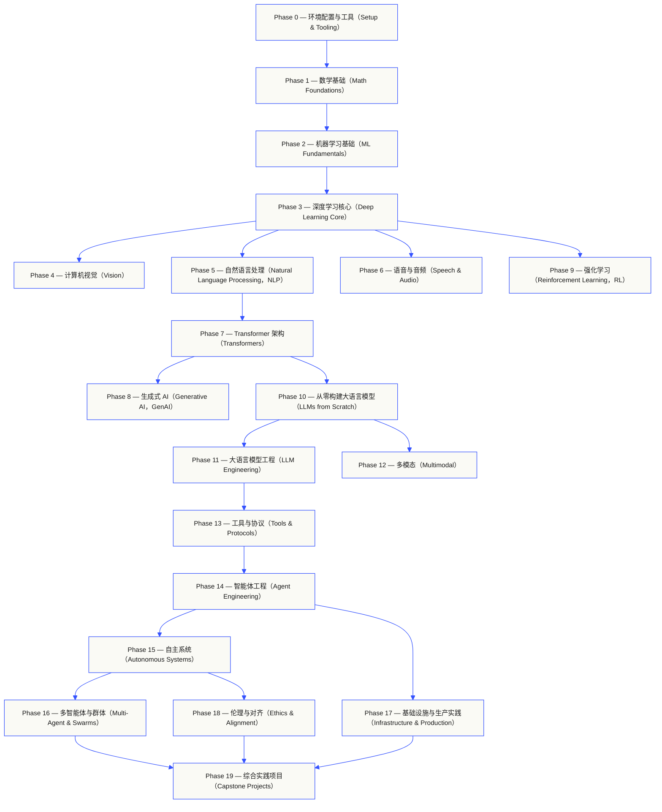
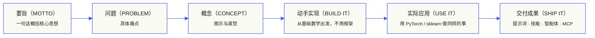
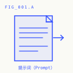
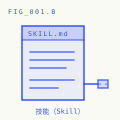
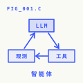
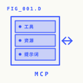

<p align="center"><sub>中文阅读入口；完整课程见<a href="../../README.md">仓库主 README</a>，版本与翻译范围见<a href="../../TRANSLATION.md">翻译说明</a> · <a href="https://aiengineeringfromscratch.com">aiengineeringfromscratch.com</a></sub></p>
<p align="center">
  
</p>

> **中文分支说明：** 本分支 translation/zh-cn-full 从上游 main 独立翻译，不使用 translations 分支。正文保留 docs/en.md 等原路径以兼容工具。全量翻译仍在进行中；当前范围、术语规范和验收边界见 TRANSLATION.md。下方语言入口属于上游既有版本，不代表本分支的翻译成果。

<p align="center">
  <b>选择你的阅读语言：</b>
  <a href="../../i18n/es/README.md">西班牙语（Español）</a> ·
  <a href="../../i18n/fr/README.md">法语（Français）</a> ·
  <a href="../../i18n/pt/README.md">葡萄牙语（Português）</a> ·
  <a href="../../i18n/de/README.md">德语（Deutsch）</a> ·
  <a href="../../i18n/it/README.md">意大利语（Italiano）</a> ·
  <a href="../../i18n/zh/README.md">简体中文</a> ·
  <a href="../../i18n/ja/README.md">日语（日本語）</a> ·
  <a href="../../i18n/ko/README.md">韩语（한국어）</a> ·
  <a href="../../i18n/hi/README.md">印地语（हिन्दी）</a> ·
  <a href="../../i18n/ar/README.md">阿拉伯语（العربية）</a> ·
  <a href="../../i18n/ru/README.md">俄语（Русский）</a> ·
  <a href="../../i18n/tr/README.md">土耳其语（Türkçe）</a>
</p>

<p align="center">
  <a href="../../LICENSE"></a>
  <a href="../../ROADMAP.md"></a>
  <a href="#contents"></a>
  <a href="https://github.com/rohitg00/ai-engineering-from-scratch/stargazers"></a>
  <a href="https://aiengineeringfromscratch.com"></a>
  <p align="center">
 <a href="https://www.star-history.com/rohitg00/ai-engineering-from-scratch">
  <picture><source media="(prefers-color-scheme: dark)" srcset="https://api.star-history.com/badge?repo=rohitg00/ai-engineering-from-scratch&type=rank&theme=dark" /><source media="(prefers-color-scheme: light)" srcset="https://api.star-history.com/badge?repo=rohitg00/ai-engineering-from-scratch&type=rank" /></picture> <picture><source media="(prefers-color-scheme: dark)" srcset="https://api.star-history.com/badge?repo=rohitg00/ai-engineering-from-scratch&type=trending&theme=dark" /><source media="(prefers-color-scheme: light)" srcset="https://api.star-history.com/badge?repo=rohitg00/ai-engineering-from-scratch&type=trending" /></picture>
 </a>
</p>
</p>

<a id="sponsors"></a>
### 赞助方（Sponsors）

<a href="https://serpapi.com/ai-engineering-from-scratch">
  
</a>

<p><br><b>感谢各位赞助方。</b></p>
<p>你们的支持让每一课都能保持免费和开源。</p>
<p>
  <a href="#supporters">查看所有支持者</a><br>
  <a href="../../SPONSORS.md">成为赞助方</a>
  <br clear="all">
</p>


```text
░░░▒▒▒░░░▒▒▒░░░▒▒▒░░░▒▒▒░░░▒▒▒░░░▒▒▒░░░▒▒▒░░░▒▒▒░░░▒▒▒░░░▒▒▒░░░▒▒▒░░░▒▒▒░░░▒▒▒░░░▒▒▒░░░▒▒▒
```

> **84% 的学生已经在使用人工智能（Artificial Intelligence，AI）工具，但只有 18% 认为自己已准备好在专业工作中使用它们。** 本课程旨在弥合这一差距。
>
> 523 课，20 个阶段，约 342 小时。使用 Python、TypeScript、Rust、Julia。每课都交付可复用的成果（Artifact）：提示词（Prompt）、技能（Skill）、智能体（Agent）或模型上下文协议（Model Context Protocol，MCP）服务器。免费、开源，采用 MIT 许可证。
>
> 你不只是学习 AI，还会亲手从头到尾构建它。

<!-- STATS:START (generated from site/stats.json by build.js — do not edit by hand) -->
<p align="center"><sub><b>114,584</b> 位读者 &nbsp;·&nbsp; <b>181,995</b> 次页面浏览，统计周期：30 天 &nbsp;·&nbsp; 截至 2026-08-29</sub></p>
<!-- STATS:END -->

<a id="start-here-choose-what-you-want-to-build"></a>
## 从这里开始：选择你想构建的内容（Start here: choose what you want to build）

开始之前，无须浏览完 523 课。先选定一个目标。每个链接都会打开 GitHub 或网站上的同一套课程，两种版本使用相同的课程代码。

| 你的目标 | 在 GitHub 上学习 | 在网站上学习 |
|---|---|---|
| 我是初学者，希望系统打好基础 | [阶段 0：环境配置与工具（Setup and Tooling）](../../phases/00-setup-and-tooling/) | [开发环境（Dev Environment）](https://aiengineeringfromscratch.com/lesson?path=phases/00-setup-and-tooling/01-dev-environment) |
| 我会 Python，希望补充数学和机器学习（Machine Learning，ML）基础 | [阶段 1：数学基础（Math Foundations）](../../phases/01-math-foundations/) | [线性代数直觉（Linear Algebra Intuition）](https://aiengineeringfromscratch.com/lesson?path=phases/01-math-foundations/01-linear-algebra-intuition) |
| 我想构建生产级大语言模型（Large Language Model，LLM）应用 | [阶段 11：大语言模型工程（LLM Engineering）](../../phases/11-llm-engineering/) | [提示词工程（Prompt Engineering）](https://aiengineeringfromscratch.com/lesson?path=phases/11-llm-engineering/01-prompt-engineering) |
| 我想构建智能体（Agent） | [阶段 14：智能体工程（Agent Engineering）](../../phases/14-agent-engineering/) | [智能体循环（The Agent Loop）](https://aiengineeringfromscratch.com/lesson?path=phases/14-agent-engineering/01-the-agent-loop) |
| 我想在真实仓库中使用编程智能体（Coding Agent） | [智能体辅助工程（Agent-Assisted Engineering）学习路径](../../learning-paths/using-coding-agents.json) | [智能体辅助工程（Agent-Assisted Engineering）](https://aiengineeringfromscratch.com/lesson?path=phases/14-agent-engineering/31-agent-workbench-why-models-fail&learningPath=using-coding-agents) |
| 我想在实现前明确应该构建什么 | [产品判断与交付（Product Judgment and Delivery）学习路径](../../learning-paths/shaping-the-build.json) | [产品判断与交付（Product Judgment and Delivery）](https://aiengineeringfromscratch.com/lesson?path=phases/14-agent-engineering/47-outcomes-before-output&learningPath=shaping-the-build) |
| 我想使用模型上下文协议（Model Context Protocol，MCP）构建系统 | [模型上下文协议（MCP）学习路线](../../phases/13-tools-and-protocols/README.md#model-context-protocol-mcp-path) | [模型上下文协议（MCP）学习路径](https://aiengineeringfromscratch.com/lesson?path=phases/13-tools-and-protocols/06-mcp-fundamentals&learningPath=model-context-protocol) |
| 我想编写并交付智能体技能（Agent Skills） | [智能体技能（Agent Skills）专项路线](../../phases/13-tools-and-protocols/README.md#agent-skills-fast-path) | [智能体技能（Agent Skills）学习路径](https://aiengineeringfromscratch.com/lesson?path=phases/13-tools-and-protocols/22-skills-and-agent-sdks&learningPath=agent-skills) |
| 我想准备 Claude 认证考试 | [认证入门指南](../../certifications/claude/GETTING_STARTED.md) | [认证学院](https://aiengineeringfromscratch.com/certifications.html) |
| 我想准备 MCP Associate（MCPA）考试 | [MCPA 入门指南](../../certifications/mcpa/GETTING_STARTED.md) | [MCPA 学习路线](https://aiengineeringfromscratch.com/certification?id=mcpa-f) |

不确定自己的起点？使用 [`start-learning` 水平评估导师](../../skills/start-learning/SKILL.md)，或阅读[网站先修知识指南](https://aiengineeringfromscratch.com/prereqs.html)。

在 [AI 工程学习路径（AI Engineering Learning Paths）](https://aiengineeringfromscratch.com/learning-paths.html)中比较四大核心领域和六条职业路线。

<a id="use-every-lesson-the-same-way"></a>
### 用同一套方法学习每一课（Use every lesson the same way）

1. **阅读** `docs/en.md`，用自己的话解释核心概念。
2. **亲手输入并实现**关键代码，不要把代码块当作装饰。
3. **运行**课程命令，工作目录应为仓库根目录，即包含 `README.md` 和 `phases/` 的目录。
4. **保留证据**：命令、工作目录、退出码、有意义的输出，以及你修改或生成的交付物（Artifact）。
5. 只有当你能解释输出，并且无需猜测就能做出一项小修改时，才**继续下一步**。

除非课程明确要求切换目录，否则课程页面中的命令路径均以仓库根目录为基准。如果一课提供多种语言，请运行你正在学习的语言所对应的实现。

<a id="clone-it-and-produce-your-first-evidence"></a>
### 克隆仓库，生成你的第一份证据（Clone it and produce your first evidence）

```bash
git clone https://github.com/rohitg00/ai-engineering-from-scratch.git
cd ai-engineering-from-scratch
python3 phases/00-setup-and-tooling/01-dev-environment/code/verify.py --route beginner
python3 phases/01-math-foundations/01-linear-algebra-intuition/code/vectors.py
```

预检（Preflight）会区分当前必需的条件和后续才会用到的工具。每项必需检查失败时，都会给出检测到的原因和修正命令。第二条命令对应一课不依赖第三方库的内容，最后会展示：矩阵与向量相乘，就是神经网络（Neural Network）层内部执行的运算。把这段终端输出保存为你的第一份证据。

<a id="add-the-ai-tutor-in-30-seconds"></a>
## 30 秒添加 AI 导师（Add the AI tutor in 30 seconds）

如果已经安装 Node.js、`npx` 和支持技能（Skill）的编程智能体，只需两条命令就能让编程智能体成为你的导师。安装或阅读导师技能不需要克隆仓库。可运行的专项学习路径实验需要 `python3`。智能体技能（Agent Skills）的宿主（Host）实验还需要选定宿主，并具备可写入的用户级或项目级技能作用域（Scope）。

先检查本地必需条件：

```bash
node --version
npx --version
python3 --version
```

然后安装课程技能，并在安装程序询问时选择你准备使用的宿主和作用域：

```bash
npx skills add rohitg00/ai-engineering-from-scratch
```

调用语法由宿主决定，不属于可移植的 `SKILL.md` 格式规范：

| 宿主（Host） | 开始课程 | 开始学习模型上下文协议（MCP） | 开始学习智能体技能（Agent Skills） | 进行阶段测验 |
|---|---|---|---|---|
| Codex | `start-learning`，或从 `/skills` 中选择 | `learn-mcp`，或从 `/skills` 中选择 | `learn-agent-skills`，或从 `/skills` 中选择 | `check-understanding 13`，或从 `/skills` 中选择 |
| Claude Code | `/start-learning` | `/learn-mcp` | `/learn-agent-skills` | `/check-understanding 13` |
| 其他兼容宿主 | `Use start-learning to begin the course.` | `Use learn-mcp to start the Model Context Protocol (MCP) path.` | `Use learn-agent-skills to start the Agent Skills Engineering path.` | `Use check-understanding to quiz me on Phase 13.` |

一份包含十道题的水平评估测验，会根据你已有的知识确定起始阶段，并将个性化学习计划保存到 `LEARNING.md`。随后，`learn` 技能会在每次会话中教授一课，依次覆盖概念、数学、代码和测验。它直接从本仓库按需读取课程；遇到卡点时，`course-guide` 技能会带你找到讲解该问题的具体课程。在 Codex 中，用 `learn` 和 `course-guide` 调用这些技能；在 Claude Code 中，用 `/learn` 和 `/course-guide`；在其他兼容宿主中，按名称请求使用对应技能。

只想学习模型上下文协议（MCP）？使用对应宿主的 MCP 调用方式。它会创建 `MCP-LEARNING.md`，并沿一条 17 课路线学习无状态请求（Stateless Requests）、传输（Transports）、双向交互、安全性、可靠性、注册表治理（Registry Governance）和一致性证据（Conformance Evidence）。具体顺序和检查点见[模型上下文协议（MCP）清单](../../learning-paths/model-context-protocol.json)。

只想学习智能体技能（Agent Skills）？使用对应宿主的智能体技能调用方式。它会创建 `AGENT-SKILLS-LEARNING.md`，并沿一条连贯的五课路线学习：契约（Contract）、发现（Discovery）、调用（Invocation）、沙箱边界（Sandbox Boundaries），最后是发布评估（Release Evals）和真实宿主间的可移植性（Portability）。也可以从网站上的[智能体技能（Agent Skills）学习路径](https://aiengineeringfromscratch.com/lesson?path=phases/13-tools-and-protocols/22-skills-and-agent-sdks&learningPath=agent-skills)开始。

安装程序会列出它能配置的宿主，并询问安装位置。如果你尚未具备 Node.js、`npx`、`python3`、受支持的宿主或可写入的作用域，可以使用网站或自行阅读 `docs/en.md`。这种方式能帮助你学习概念，但在预检条件具备之前，真实宿主上的发现、调用、脚本执行和卸载证据仍有待补齐。课程也可在[课程网站](https://aiengineeringfromscratch.com)阅读。

<a id="how-this-works"></a>
## 这套课程如何运作（How this works）

大多数 AI 学习材料是零散的：这里一篇论文，那里一篇微调（Fine-tuning）文章，别处再来一个吸引眼球的智能体演示。这些内容很少能衔接起来。你交付了聊天机器人，却解释不清它的损失曲线（Loss Curve）；你给智能体接入了一个函数，却说不清调用该函数的模型内部，注意力（Attention）究竟做了什么。

本课程提供贯穿始终的主线：20 个阶段、523 课、四种语言，分别是 Python、TypeScript、Rust、Julia。起点是线性代数（Linear Algebra），终点是自主群体（Autonomous Swarms）。每个算法都先从基础数学亲手实现，包括反向传播（Backpropagation）、分词器（Tokenizer）、注意力（Attention）和智能体循环（Agent Loop）。等到用上 PyTorch 时，你已经知道它底层在做什么。

每课都遵循相同的循环：阅读问题、推导数学、编写代码、运行测试、保留交付物。没有五分钟速成视频，没有复制粘贴式部署，也不手把手代劳。课程免费、开源，设计为可在你自己的笔记本电脑上运行。

```text
░░░▒▒▒░░░▒▒▒░░░▒▒▒░░░▒▒▒░░░▒▒▒░░░▒▒▒░░░▒▒▒░░░▒▒▒░░░▒▒▒░░░▒▒▒░░░▒▒▒░░░▒▒▒░░░▒▒▒░░░▒▒▒░░░▒▒▒
```

<a id="the-shape-of-the-curriculum"></a>
## 课程结构（The shape of the curriculum）

二十个阶段层层递进。数学是基础，智能体和生产实践位于顶层。如果已经掌握底层知识，可以跳到后面；但不要跳过基础后，又困惑于高层内容为什么出问题。



```text
░░░▒▒▒░░░▒▒▒░░░▒▒▒░░░▒▒▒░░░▒▒▒░░░▒▒▒░░░▒▒▒░░░▒▒▒░░░▒▒▒░░░▒▒▒░░░▒▒▒░░░▒▒▒░░░▒▒▒░░░▒▒▒░░░▒▒▒
```

<a id="the-shape-of-a-lesson"></a>
## 单课结构（The shape of a lesson）

每课都位于独立的文件夹中，整套课程采用相同的结构：

```text
phases/<NN>-<phase-name>/<NN>-<lesson-name>/
├── code/      可运行的实现（Python、TypeScript、Rust、Julia）
├── docs/
│   └── en.md  课程正文
└── outputs/   本课产出的提示词（Prompt）、技能（Skill）、智能体（Agent）或 MCP 服务器
```

每课分为六个环节。*动手实现（Build It）/ 实际应用（Use It）* 是主线：先从零实现算法，再用生产级库运行同样的操作。因为你亲手写过一个精简版本，所以能理解框架在做什么。



<a id="getting-started"></a>
## 开始学习（Getting started）

三种入门方式，任选一种。

**方式 A：在终端中学习（推荐）。** 完成上文对 Node.js、`npx`、宿主和作用域的预检后，将学习技能安装到兼容的智能体中，让课程自行引导学习流程：

```bash
npx skills add rohitg00/ai-engineering-from-scratch
```

使用上文按宿主列出的调用方式。安装后可使用 `start-learning`、`learn`、`course-guide`，以及 `learn-mcp` 和 `learn-agent-skills` 两条专项路线。课程正文可以直接从本仓库按需读取，无须克隆。要执行从仓库复制的代码命令，或运行 MCP 和智能体技能（Agent Skills）实验，则必须先在本地克隆仓库。进度保存在项目中的 `LEARNING.md`、`MCP-LEARNING.md` 或 `AGENT-SKILLS-LEARNING.md`，因此每次会话都能接着学。

**方式 B：阅读。** 在[课程网站](https://aiengineeringfromscratch.com)打开任意已完成的课程，或展开[目录](#contents)中的某个阶段。无须配置环境，也无须克隆仓库。

**方式 C：克隆并运行。**

```bash
git clone https://github.com/rohitg00/ai-engineering-from-scratch.git
cd ai-engineering-from-scratch
python3 phases/01-math-foundations/01-linear-algebra-intuition/code/vectors.py
```

克隆仓库还会让 Claude Code 自动加载学习技能，并将各课代码提供给 `learn` 导师，真正执行代码，而不只是陪读。

<a id="prerequisites"></a>
### 先修条件（Prerequisites）

- 你能够编写代码，任何语言均可，会 Python 更有帮助。
- 你希望理解 AI **究竟如何运作**，而不只是调用应用程序编程接口（Application Programming Interface，API）。

<a id="prepare-for-claude-certifications"></a>
### 准备 Claude 认证考试（Prepare for Claude certifications）

[Claude 认证学院（Claude Certification Academy）](../../certifications/claude/README.md)是一个免费、开源的备考项目，覆盖全部四条官方 Claude 认证路线：入门基础（Associate Foundations）、开发者基础（Developer Foundations）、架构师基础（Architect Foundations）和架构师专业（Architect Professional）。每条路线都包含对应考试大纲的课程、可运行实验、诊断测评、综合实践（Capstone）和一套完整的原创模拟考试。

使用面向 Claude Code、Codex、ChatGPT、Cursor 或其他智能体的 [AI 原生（AI-native）GitHub 入门指南](../../certifications/claude/GETTING_STARTED.md)。在 Codex 中运行 `claude-certification`，在 Claude Code 中运行 `/claude-certification`，或请其他宿主使用 `claude-certification`。它会选择认证路线，在 `CLAUDE-CERTIFICATION.md` 中建立持久保存的学习路线，逐步授课，运行真实实验，并基于交付物提供反馈。同一套课程也可在[认证网站](https://aiengineeringfromscratch.com/certifications.html)学习。

学院提供基于公开考试目标编写的独立学习材料，与 Anthropic 无隶属关系，不复现真实考试题目，也不能保证通过考试。

<a id="prepare-for-the-mcp-associate-mcpa-certification"></a>
### 准备 MCP Associate（MCPA）认证

[MCPA 认证课程](../../certifications/mcpa/README.md)是一套免费、开源的备考项目，面向 Agentic AI Foundation 提供、通过 Linux Foundation Training 交付的 Model Context Protocol Associate 考试。34 节课围绕五个考试领域讲解 2026-07-28 版无状态协议：使用逐请求 `_meta` 与 `server/discover` 替代旧握手流程，并覆盖多轮往返请求、订阅、缓存、tasks 与 MCP Apps 扩展、OAuth 授权，以及注册表和 SDK 分级。每课都交付可运行的标准库实验，实验记录会检查是否符合当前线上报文结构；学习路线还包含诊断测评、综合实践和三套原创完整模拟考试，题目分布遵循已公布的考试大纲权重。

可配合 Claude Code、Codex、ChatGPT、Cursor 或其他智能体使用 [AI 原生 GitHub 入门指南](../../certifications/mcpa/GETTING_STARTED.md)。在 Codex 中运行 `mcpa-certification`，在 Claude Code 中运行 `/mcpa-certification`，或要求其他宿主使用 `mcpa-certification`。导师会在 `MCPA-CERTIFICATION.md` 中保存持久学习路线，逐步授课、运行真实实验，并根据交付物提供反馈。同一课程也可从 [MCPA 学习路线页面](https://aiengineeringfromscratch.com/certification?id=mcpa-f)访问。

本课程根据公开考试目标编写，属于独立学习材料，与 Agentic AI Foundation 和 Linux Foundation 无隶属关系，不复现真实考试题，也不保证通过考试。

<a id="the-learning-skills"></a>
### 学习技能（The learning skills）

| 技能（Skill） | 功能 |
|---|---|
| [`start-learning`](../../skills/start-learning/SKILL.md) | 一次性入门引导：明确学习目的，进行水平评估测验，将个性化计划保存到 `LEARNING.md`。 |
| [`learn`](../../skills/learn/SKILL.md) | 导师循环：先通过回忆复习热身，再交互式讲授下一课，最后进行该课测验；记录进度和复习队列。 |
| [`course-guide`](../../skills/course-guide/SKILL.md) | 主题路由（Topic Router）：无论是“在哪里学习注意力（Attention）？”还是“我的损失值是 NaN”，都能定位到具体课程并提供链接。 |
| [`learn-mcp`](../../skills/learn-mcp/SKILL.md) | 模型上下文协议（MCP）专项导师：创建 `MCP-LEARNING.md`，遵循 17 课清单，并记录线上协议交互、安全性、可靠性和一致性证据。 |
| [`learn-agent-skills`](../../skills/learn-agent-skills/SKILL.md) | 智能体技能（Agent Skills）专项导师：创建 `AGENT-SKILLS-LEARNING.md`，讲授第 22、24、25、26、27 课，并记录真实宿主上的证据。 |
| [`claude-certification`](../../skills/claude-certification/SKILL.md) | 认证导师：选择 CCAO-F、CCDV-F、CCAR-F 或 CCAR-P；逐课授课、运行实验、审阅交付物、组织诊断测评和模拟考试，并保存进度。 |
| [`mcpa-certification`](../../skills/mcpa-certification/SKILL.md) | MCPA 导师：按照 2026-07-28 协议的 34 课 `mcpa-f` 路线逐课授课，运行实验与报文检查器，组织诊断测评和三套模拟考试，并保存进度。 |
| [`find-your-level`](../../skills/find-your-level/SKILL.md) | 十道题的水平评估测验：根据你的知识确定起始阶段，并生成带有预计用时的个性化路径。 |
| [`check-understanding <phase>`](../../skills/check-understanding/SKILL.md) | 每阶段八道题的测验，提供反馈并指出需要复习的具体课程。使用上文调用表中的 Codex、Claude Code 或自然语言形式。 |

```text
░░░▒▒▒░░░▒▒▒░░░▒▒▒░░░▒▒▒░░░▒▒▒░░░▒▒▒░░░▒▒▒░░░▒▒▒░░░▒▒▒░░░▒▒▒░░░▒▒▒░░░▒▒▒░░░▒▒▒░░░▒▒▒░░░▒▒▒
```

<a id="read-the-core-curriculum-as-a-book"></a>
## 以书籍形式阅读核心课程（Read the core curriculum as a book）

`phases/` 下包含 20 个阶段的核心课程会编译成六卷本系列丛书。持续集成（Continuous Integration，CI）从同一份核心课程源文件生成 EPUB 和 PDF，并将其附加到每次 [GitHub 发布（Release）](https://github.com/rohitg00/ai-engineering-from-scratch/releases)中；下方链接始终指向最新发布。卷号表示系列中的顺序，而非版本号：每份书籍都带有标注日期的版次信息，旧版仍可从对应发布中下载。

认证课程有意不纳入书籍转换流程。它们的 AI 导师状态、可运行实验、交互图示、诊断测评和限时模拟考试，仍在 GitHub 和网站上作为完整的一等学习内容提供。

| 卷 | 书名 | 阶段 | 下载 |
|-----|-------|--------|----------|
| 1 | 基础（Foundations） · 数学、工具与经典机器学习（Math, Tooling, and Classical Machine Learning） | 00-02 | [电子出版物（EPUB）](https://github.com/rohitg00/ai-engineering-from-scratch/releases/latest/download/aiefs-vol1-foundations.epub) · [便携式文档（PDF）](https://github.com/rohitg00/ai-engineering-from-scratch/releases/latest/download/aiefs-vol1-foundations.pdf) |
| 2 | 深度学习（Deep Learning） · 网络、视觉与语音（Networks, Vision, and Speech） | 03, 04, 06 | [电子出版物（EPUB）](https://github.com/rohitg00/ai-engineering-from-scratch/releases/latest/download/aiefs-vol2-deep-learning.epub) · [便携式文档（PDF）](https://github.com/rohitg00/ai-engineering-from-scratch/releases/latest/download/aiefs-vol2-deep-learning.pdf) |
| 3 | 语言（Language） · 自然语言处理基础与 Transformer（NLP Foundations and the Transformer） | 05, 07 | [电子出版物（EPUB）](https://github.com/rohitg00/ai-engineering-from-scratch/releases/latest/download/aiefs-vol3-language.epub) · [便携式文档（PDF）](https://github.com/rohitg00/ai-engineering-from-scratch/releases/latest/download/aiefs-vol3-language.pdf) |
| 4 | 大语言模型（Large Language Models） · 生成、强化学习、预训练与工程实践（Generation, Reinforcement, Pretraining, and Engineering） | 08-11 | [电子出版物（EPUB）](https://github.com/rohitg00/ai-engineering-from-scratch/releases/latest/download/aiefs-vol4-llms.epub) · [便携式文档（PDF）](https://github.com/rohitg00/ai-engineering-from-scratch/releases/latest/download/aiefs-vol4-llms.pdf) |
| 5 | 智能体（Agents） · 多模态、协议、自主性与群体（Multimodality, Protocols, Autonomy, and Swarms） | 12-16 | [电子出版物（EPUB）](https://github.com/rohitg00/ai-engineering-from-scratch/releases/latest/download/aiefs-vol5-agents.epub) · [便携式文档（PDF）](https://github.com/rohitg00/ai-engineering-from-scratch/releases/latest/download/aiefs-vol5-agents.pdf) |
| 6 | 生产实践（Production） · 基础设施、安全与综合实践（Infrastructure, Safety, and Capstones） | 17-19 | [电子出版物（EPUB）](https://github.com/rohitg00/ai-engineering-from-scratch/releases/latest/download/aiefs-vol6-production.epub) · [便携式文档（PDF）](https://github.com/rohitg00/ai-engineering-from-scratch/releases/latest/download/aiefs-vol6-production.pdf) |

书籍是快照，仓库则是持续更新的版本。每章结尾都有链接，可返回该课的动画图示、测验和可运行代码。使用 `python3 scripts/build_book.py` 可在本地构建，需要安装 pandoc；流水线（Pipeline）细节见[书籍构建说明](../../book/README.md)。

```text
░░░▒▒▒░░░▒▒▒░░░▒▒▒░░░▒▒▒░░░▒▒▒░░░▒▒▒░░░▒▒▒░░░▒▒▒░░░▒▒▒░░░▒▒▒░░░▒▒▒░░░▒▒▒░░░▒▒▒░░░▒▒▒░░░▒▒▒
```

<a id="every-lesson-ships-something"></a>
## 每课都有交付成果（Every lesson ships something）

其他课程往往以“恭喜你，学会了某项知识”收尾。这里的每课都以一件**可复用工具**收尾，你可以将它安装或粘贴到日常工作流程中。

<table>
<tr>
<th align="left" width="25%"><br/><sub>FIG_001 · A</sub><br/><b>提示词（PROMPTS）</b></th>
<th align="left" width="25%"><br/><sub>FIG_001 · B</sub><br/><b>技能（SKILLS）</b></th>
<th align="left" width="25%"><br/><sub>FIG_001 · C</sub><br/><b>智能体（AGENTS）</b></th>
<th align="left" width="25%"><br/><sub>FIG_001 · D</sub><br/><b>MCP 服务器（MCP SERVERS）</b></th>
</tr>
<tr>
<td valign="top">粘贴到任意 AI 助手中，为某个具体任务获得专家级帮助。</td>
<td valign="top">放入 Claude、Cursor、Codex、OpenClaw、Hermes，或任何能读取 <code>SKILL.md</code> 的智能体中。</td>
<td valign="top">部署为自主执行任务的工作单元；你已在阶段 14 亲手写过其循环。</td>
<td valign="top">接入任意兼容 MCP 的客户端；你已在阶段 13 从头到尾实现它。</td>
</tr>
</table>

> 使用 `python3 scripts/install_skills.py <target>` 一次安装全部成果。这些是真正的工具，不只是作业。
> 完成课程后，你将拥有包含 523 件交付物的作品集。因为是亲手构建的，你真正理解它们。

<a id="fig_002--a-worked-sample"></a>
### FIG_002 · 完整示例（A worked sample）

阶段 14，第 1 课：智能体循环（Agent Loop）。约 120 行纯 Python，无第三方依赖。

<table>
<tr>
<td valign="top" width="50%">

**`code/agent_loop.py`** &nbsp; <sub><i>动手实现（build it）</i></sub>

```python
def run(query, tools):
    history = [user(query)]
    for step in range(MAX_STEPS):
        msg = llm(history)
        if msg.tool_calls:
            for call in msg.tool_calls:
                result = tools[call.name](**call.args)
                history.append(tool_result(call.id, result))
            continue
        return msg.content
    raise StepLimitExceeded
```

</td>
<td valign="top" width="50%">

**`outputs/skill-agent-loop.md`** &nbsp; <sub><i>交付成果（ship it）</i></sub>

```markdown
---
name: agent-loop
description: ReAct-style loop for any tool list
phase: 14
lesson: 01
---

实现一个最小智能体循环（Agent Loop），使其能够……
```

**`outputs/prompt-debug-agent.md`**

```markdown
你是一名智能体调试助手。给定一次智能体运行的追踪记录（Trace），
找出智能体出错的步骤，并解释原因……
```

</td>
</tr>
</table>

```text
░░░▒▒▒░░░▒▒▒░░░▒▒▒░░░▒▒▒░░░▒▒▒░░░▒▒▒░░░▒▒▒░░░▒▒▒░░░▒▒▒░░░▒▒▒░░░▒▒▒░░░▒▒▒░░░▒▒▒░░░▒▒▒░░░▒▒▒
```

<a id="contents"></a>

## 目录（Contents）

二十个阶段。点击任意阶段即可展开课程列表。

<a id="phase-0"></a>
<a id="phase-0-setup--tooling-12-lessons"></a>
### Phase 0: 环境配置与工具（Setup & Tooling） `12 lessons`
> 配置好环境，为后续所有学习做好准备。

| # | 课程（Lesson） | 类型（Type） | 语言（Lang） |
|:---:|--------|:----:|------|
| 01 | [开发环境（Dev Environment）](../../phases/00-setup-and-tooling/01-dev-environment/) | 动手实现（Build） | Python |
| 02 | [Git 与协作（Git & Collaboration）](../../phases/00-setup-and-tooling/02-git-and-collaboration/) | 理解概念（Learn） | — |
| 03 | [图形处理器（Graphics Processing Unit，GPU）配置与云环境（GPU Setup & Cloud）](../../phases/00-setup-and-tooling/03-gpu-setup-and-cloud/) | 动手实现（Build） | Python |
| 04 | [应用程序编程接口（Application Programming Interface，API）与密钥（APIs & Keys）](../../phases/00-setup-and-tooling/04-apis-and-keys/) | 动手实现（Build） | Python |
| 05 | [Jupyter 笔记本（Jupyter Notebooks）](../../phases/00-setup-and-tooling/05-jupyter-notebooks/) | 动手实现（Build） | Python |
| 06 | [Python 环境（Python Environments）](../../phases/00-setup-and-tooling/06-python-environments/) | 动手实现（Build） | Shell |
| 07 | [面向 AI 的 Docker（Docker for AI）](../../phases/00-setup-and-tooling/07-docker-for-ai/) | 动手实现（Build） | Docker |
| 08 | [编辑器配置（Editor Setup）](../../phases/00-setup-and-tooling/08-editor-setup/) | 动手实现（Build） | — |
| 09 | [数据管理（Data Management）](../../phases/00-setup-and-tooling/09-data-management/) | 动手实现（Build） | Python |
| 10 | [终端与 Shell（Terminal & Shell）](../../phases/00-setup-and-tooling/10-terminal-and-shell/) | 理解概念（Learn） | — |
| 11 | [面向 AI 的 Linux（Linux for AI）](../../phases/00-setup-and-tooling/11-linux-for-ai/) | 理解概念（Learn） | — |
| 12 | [调试与性能剖析（Debugging & Profiling）](../../phases/00-setup-and-tooling/12-debugging-and-profiling/) | 动手实现（Build） | Python |

<details id="phase-1">
<summary><b>Phase 1 — 数学基础（Math Foundations）</b> &nbsp;<code>22 lessons</code>&nbsp; <em>通过代码理解每个 AI 算法背后的直觉。</em></summary>
<br/>

| # | 课程（Lesson） | 类型（Type） | 语言（Lang） |
|:---:|--------|:----:|------|
| 01 | [线性代数直觉（Linear Algebra Intuition）](../../phases/01-math-foundations/01-linear-algebra-intuition/) | 理解概念（Learn） | Python, Julia |
| 02 | [向量、矩阵与运算（Vectors, Matrices & Operations）](../../phases/01-math-foundations/02-vectors-matrices-operations/) | 动手实现（Build） | Python, Julia |
| 03 | [矩阵变换与特征值（Matrix Transformations & Eigenvalues）](../../phases/01-math-foundations/03-matrix-transformations/) | 动手实现（Build） | Python, Julia |
| 04 | [机器学习微积分：导数与梯度（Calculus for ML: Derivatives & Gradients）](../../phases/01-math-foundations/04-calculus-for-ml/) | 理解概念（Learn） | Python |
| 05 | [链式法则与自动微分（Chain Rule & Automatic Differentiation）](../../phases/01-math-foundations/05-chain-rule-and-autodiff/) | 动手实现（Build） | Python |
| 06 | [概率与分布（Probability & Distributions）](../../phases/01-math-foundations/06-probability-and-distributions/) | 理解概念（Learn） | Python |
| 07 | [贝叶斯定理与统计思维（Bayes' Theorem & Statistical Thinking）](../../phases/01-math-foundations/07-bayes-theorem/) | 动手实现（Build） | Python |
| 08 | [优化：梯度下降算法家族（Optimization: Gradient Descent Family）](../../phases/01-math-foundations/08-optimization/) | 动手实现（Build） | Python |
| 09 | [信息论：熵与 KL 散度（Information Theory: Entropy, KL Divergence）](../../phases/01-math-foundations/09-information-theory/) | 理解概念（Learn） | Python |
| 10 | [降维：主成分分析、t-SNE 与 UMAP（Dimensionality Reduction: PCA, t-SNE, UMAP）](../../phases/01-math-foundations/10-dimensionality-reduction/) | 动手实现（Build） | Python |
| 11 | [奇异值分解（Singular Value Decomposition）](../../phases/01-math-foundations/11-singular-value-decomposition/) | 动手实现（Build） | Python, Julia |
| 12 | [张量运算（Tensor Operations）](../../phases/01-math-foundations/12-tensor-operations/) | 动手实现（Build） | Python |
| 13 | [数值稳定性（Numerical Stability）](../../phases/01-math-foundations/13-numerical-stability/) | 动手实现（Build） | Python |
| 14 | [范数与距离（Norms & Distances）](../../phases/01-math-foundations/14-norms-and-distances/) | 动手实现（Build） | Python |
| 15 | [机器学习统计学（Statistics for ML）](../../phases/01-math-foundations/15-statistics-for-ml/) | 动手实现（Build） | Python |
| 16 | [采样方法（Sampling Methods）](../../phases/01-math-foundations/16-sampling-methods/) | 动手实现（Build） | Python |
| 17 | [线性方程组（Linear Systems）](../../phases/01-math-foundations/17-linear-systems/) | 动手实现（Build） | Python |
| 18 | [凸优化（Convex Optimization）](../../phases/01-math-foundations/18-convex-optimization/) | 动手实现（Build） | Python |
| 19 | [面向 AI 的复数（Complex Numbers for AI）](../../phases/01-math-foundations/19-complex-numbers/) | 理解概念（Learn） | Python |
| 20 | [傅里叶变换（The Fourier Transform）](../../phases/01-math-foundations/20-fourier-transform/) | 动手实现（Build） | Python |
| 21 | [机器学习图论（Graph Theory for ML）](../../phases/01-math-foundations/21-graph-theory/) | 动手实现（Build） | Python |
| 22 | [随机过程（Stochastic Processes）](../../phases/01-math-foundations/22-stochastic-processes/) | 理解概念（Learn） | Python |

</details>

<details id="phase-2">
<summary><b>Phase 2 — 机器学习基础（ML Fundamentals）</b> &nbsp;<code>18 lessons</code>&nbsp; <em>经典机器学习（Classical ML）仍是大多数生产级 AI 的支柱。</em></summary>
<br/>

| # | 课程（Lesson） | 类型（Type） | 语言（Lang） |
|:---:|--------|:----:|------|
| 01 | [什么是机器学习（What Is Machine Learning）](../../phases/02-ml-fundamentals/01-what-is-machine-learning/) | 理解概念（Learn） | Python |
| 02 | [从零实现线性回归（Linear Regression from Scratch）](../../phases/02-ml-fundamentals/02-linear-regression/) | 动手实现（Build） | Python |
| 03 | [逻辑回归与分类（Logistic Regression & Classification）](../../phases/02-ml-fundamentals/03-logistic-regression/) | 动手实现（Build） | Python |
| 04 | [决策树与随机森林（Decision Trees & Random Forests）](../../phases/02-ml-fundamentals/04-decision-trees/) | 动手实现（Build） | Python |
| 05 | [支持向量机（Support Vector Machines）](../../phases/02-ml-fundamentals/05-support-vector-machines/) | 动手实现（Build） | Python |
| 06 | [K 近邻与距离度量（KNN & Distance Metrics）](../../phases/02-ml-fundamentals/06-knn-and-distances/) | 动手实现（Build） | Python |
| 07 | [无监督学习：K 均值与 DBSCAN（Unsupervised Learning: K-Means, DBSCAN）](../../phases/02-ml-fundamentals/07-unsupervised-learning/) | 动手实现（Build） | Python |
| 08 | [特征工程与选择（Feature Engineering & Selection）](../../phases/02-ml-fundamentals/08-feature-engineering/) | 动手实现（Build） | Python |
| 09 | [模型评估：指标与交叉验证（Model Evaluation: Metrics, Cross-Validation）](../../phases/02-ml-fundamentals/09-model-evaluation/) | 动手实现（Build） | Python |
| 10 | [偏差、方差与学习曲线（Bias, Variance & the Learning Curve）](../../phases/02-ml-fundamentals/10-bias-variance/) | 理解概念（Learn） | Python |
| 11 | [集成方法：提升、装袋与堆叠（Ensemble Methods: Boosting, Bagging, Stacking）](../../phases/02-ml-fundamentals/11-ensemble-methods/) | 动手实现（Build） | Python |
| 12 | [超参数调优（Hyperparameter Tuning）](../../phases/02-ml-fundamentals/12-hyperparameter-tuning/) | 动手实现（Build） | Python |
| 13 | [机器学习流水线与实验跟踪（ML Pipelines & Experiment Tracking）](../../phases/02-ml-fundamentals/13-ml-pipelines/) | 动手实现（Build） | Python |
| 14 | [朴素贝叶斯（Naive Bayes）](../../phases/02-ml-fundamentals/14-naive-bayes/) | 动手实现（Build） | Python |
| 15 | [时间序列基础（Time Series Fundamentals）](../../phases/02-ml-fundamentals/15-time-series/) | 动手实现（Build） | Python |
| 16 | [异常检测（Anomaly Detection）](../../phases/02-ml-fundamentals/16-anomaly-detection/) | 动手实现（Build） | Python |
| 17 | [处理不平衡数据（Handling Imbalanced Data）](../../phases/02-ml-fundamentals/17-imbalanced-data/) | 动手实现（Build） | Python |
| 18 | [特征选择（Feature Selection）](../../phases/02-ml-fundamentals/18-feature-selection/) | 动手实现（Build） | Python |

</details>

<details id="phase-3">
<summary><b>Phase 3 — 深度学习核心（Deep Learning Core）</b> &nbsp;<code>13 lessons</code>&nbsp; <em>从第一性原理（First Principles）理解神经网络。在亲手实现一个网络之前，不使用框架。</em></summary>
<br/>

| # | 课程（Lesson） | 类型（Type） | 语言（Lang） |
|:---:|--------|:----:|------|
| 01 | [感知机：一切的起点（The Perceptron: Where It All Started）](../../phases/03-deep-learning-core/01-the-perceptron/) | 动手实现（Build） | Python |
| 02 | [多层网络与前向传播（Multi-Layer Networks & Forward Pass）](../../phases/03-deep-learning-core/02-multi-layer-networks/) | 动手实现（Build） | Python |
| 03 | [从零实现反向传播（Backpropagation from Scratch）](../../phases/03-deep-learning-core/03-backpropagation/) | 动手实现（Build） | Python |
| 04 | [激活函数：ReLU、Sigmoid、GELU 及其原理（Activation Functions: ReLU, Sigmoid, GELU & Why）](../../phases/03-deep-learning-core/04-activation-functions/) | 动手实现（Build） | Python |
| 05 | [损失函数：均方误差、交叉熵与对比损失（Loss Functions: MSE, Cross-Entropy, Contrastive）](../../phases/03-deep-learning-core/05-loss-functions/) | 动手实现（Build） | Python |
| 06 | [优化器：随机梯度下降、动量、Adam 与 AdamW（Optimizers: SGD, Momentum, Adam, AdamW）](../../phases/03-deep-learning-core/06-optimizers/) | 动手实现（Build） | Python |
| 07 | [正则化：随机失活、权重衰减与批归一化（Regularization: Dropout, Weight Decay, BatchNorm）](../../phases/03-deep-learning-core/07-regularization/) | 动手实现（Build） | Python |
| 08 | [权重初始化与训练稳定性（Weight Initialization & Training Stability）](../../phases/03-deep-learning-core/08-weight-initialization/) | 动手实现（Build） | Python |
| 09 | [学习率调度与预热（Learning Rate Schedules & Warmup）](../../phases/03-deep-learning-core/09-learning-rate-schedules/) | 动手实现（Build） | Python |
| 10 | [构建自己的迷你框架（Build Your Own Mini Framework）](../../phases/03-deep-learning-core/10-mini-framework/) | 动手实现（Build） | Python |
| 11 | [PyTorch 入门（Introduction to PyTorch）](../../phases/03-deep-learning-core/11-intro-to-pytorch/) | 动手实现（Build） | Python |
| 12 | [JAX 入门（Introduction to JAX）](../../phases/03-deep-learning-core/12-intro-to-jax/) | 动手实现（Build） | Python |
| 13 | [神经网络调试（Debugging Neural Networks）](../../phases/03-deep-learning-core/13-debugging-neural-networks/) | 动手实现（Build） | Python |

</details>

<details id="phase-4">
<summary><b>Phase 4 — 计算机视觉（Computer Vision）</b> &nbsp;<code>28 lessons</code>&nbsp; <em>从像素到理解：图像、视频、三维（3D）、视觉语言模型（Vision-Language Models，VLM）和世界模型（World Models）。</em></summary>
<br/>

| # | 课程（Lesson） | 类型（Type） | 语言（Lang） |
|:---:|--------|:----:|------|
| 01 | [图像基础：像素、通道与色彩空间（Image Fundamentals: Pixels, Channels, Color Spaces）](../../phases/04-computer-vision/01-image-fundamentals/) | 理解概念（Learn） | Python |
| 02 | [从零实现卷积（Convolutions from Scratch）](../../phases/04-computer-vision/02-convolutions-from-scratch/) | 动手实现（Build） | Python |
| 03 | [卷积神经网络：从 LeNet 到 ResNet（CNNs: LeNet to ResNet）](../../phases/04-computer-vision/03-cnns-lenet-to-resnet/) | 动手实现（Build） | Python |
| 04 | [图像分类（Image Classification）](../../phases/04-computer-vision/04-image-classification/) | 动手实现（Build） | Python |
| 05 | [迁移学习与微调（Transfer Learning & Fine-Tuning）](../../phases/04-computer-vision/05-transfer-learning/) | 动手实现（Build） | Python |
| 06 | [目标检测：从零实现 YOLO（Object Detection — YOLO from Scratch）](../../phases/04-computer-vision/06-object-detection-yolo/) | 动手实现（Build） | Python |
| 07 | [语义分割：U-Net（Semantic Segmentation — U-Net）](../../phases/04-computer-vision/07-semantic-segmentation-unet/) | 动手实现（Build） | Python |
| 08 | [实例分割：Mask R-CNN（Instance Segmentation — Mask R-CNN）](../../phases/04-computer-vision/08-instance-segmentation-mask-rcnn/) | 动手实现（Build） | Python |
| 09 | [图像生成：生成对抗网络（Image Generation — GANs）](../../phases/04-computer-vision/09-image-generation-gans/) | 动手实现（Build） | Python |
| 10 | [图像生成：扩散模型（Image Generation — Diffusion Models）](../../phases/04-computer-vision/10-image-generation-diffusion/) | 动手实现（Build） | Python |
| 11 | [Stable Diffusion：架构与微调（Stable Diffusion — Architecture & Fine-Tuning）](../../phases/04-computer-vision/11-stable-diffusion/) | 动手实现（Build） | Python |
| 12 | [视频理解：时序建模（Video Understanding — Temporal Modeling）](../../phases/04-computer-vision/12-video-understanding/) | 动手实现（Build） | Python |
| 13 | [三维视觉：点云与神经辐射场（3D Vision: Point Clouds, NeRFs）](../../phases/04-computer-vision/13-3d-vision-nerf/) | 动手实现（Build） | Python |
| 14 | [视觉 Transformer（Vision Transformers (ViT)）](../../phases/04-computer-vision/14-vision-transformers/) | 动手实现（Build） | Python |
| 15 | [实时视觉：边缘部署（Real-Time Vision: Edge Deployment）](../../phases/04-computer-vision/15-real-time-edge/) | 动手实现（Build） | Python |
| 16 | [构建完整的视觉流水线（Build a Complete Vision Pipeline）](../../phases/04-computer-vision/16-vision-pipeline-capstone/) | 动手实现（Build） | Python |
| 17 | [自监督视觉：SimCLR、DINO 与 MAE（Self-Supervised Vision — SimCLR, DINO, MAE）](../../phases/04-computer-vision/17-self-supervised-vision/) | 动手实现（Build） | Python |
| 18 | [开放词汇视觉：CLIP（Open-Vocabulary Vision — CLIP）](../../phases/04-computer-vision/18-open-vocab-clip/) | 动手实现（Build） | Python |
| 19 | [光学字符识别与文档理解（OCR & Document Understanding）](../../phases/04-computer-vision/19-ocr-document-understanding/) | 动手实现（Build） | Python |
| 20 | [图像检索与度量学习（Image Retrieval & Metric Learning）](../../phases/04-computer-vision/20-image-retrieval-metric/) | 动手实现（Build） | Python |
| 21 | [关键点检测与姿态估计（Keypoint Detection & Pose Estimation）](../../phases/04-computer-vision/21-keypoint-pose/) | 动手实现（Build） | Python |
| 22 | [从零实现三维高斯泼溅（3D Gaussian Splatting from Scratch）](../../phases/04-computer-vision/22-3d-gaussian-splatting/) | 动手实现（Build） | Python |
| 23 | [扩散 Transformer 与整流流（Diffusion Transformers & Rectified Flow）](../../phases/04-computer-vision/23-diffusion-transformers-rectified-flow/) | 动手实现（Build） | Python |
| 24 | [SAM 3 与开放词汇分割（SAM 3 & Open-Vocabulary Segmentation）](../../phases/04-computer-vision/24-sam3-open-vocab-segmentation/) | 动手实现（Build） | Python |
| 25 | [视觉语言模型：ViT-MLP-LLM（Vision-Language Models (ViT-MLP-LLM)）](../../phases/04-computer-vision/25-vision-language-models/) | 动手实现（Build） | Python |
| 26 | [单目深度与几何估计（Monocular Depth & Geometry Estimation）](../../phases/04-computer-vision/26-monocular-depth/) | 动手实现（Build） | Python |
| 27 | [多目标跟踪与视频记忆（Multi-Object Tracking & Video Memory）](../../phases/04-computer-vision/27-multi-object-tracking/) | 动手实现（Build） | Python |
| 28 | [世界模型与视频扩散（World Models & Video Diffusion）](../../phases/04-computer-vision/28-world-models-video-diffusion/) | 动手实现（Build） | Python |

</details>

<details id="phase-5">
<summary><b>Phase 5 — 自然语言处理：从基础到进阶（NLP: Foundations to Advanced）</b> &nbsp;<code>29 lessons</code>&nbsp; <em>语言是通往智能的接口。</em></summary>
<br/>

| # | 课程（Lesson） | 类型（Type） | 语言（Lang） |
|:---:|--------|:----:|------|
| 01 | [文本处理：分词、词干提取与词形还原（Text Processing: Tokenization, Stemming, Lemmatization）](../../phases/05-nlp-foundations-to-advanced/01-text-processing/) | 动手实现（Build） | Python |
| 02 | [词袋、词频-逆文档频率与文本表示（Bag of Words, TF-IDF & Text Representation）](../../phases/05-nlp-foundations-to-advanced/02-bag-of-words-tfidf/) | 动手实现（Build） | Python |
| 03 | [词嵌入：从零实现 Word2Vec（Word Embeddings: Word2Vec from Scratch）](../../phases/05-nlp-foundations-to-advanced/03-word-embeddings-word2vec/) | 动手实现（Build） | Python |
| 04 | [GloVe、FastText 与子词嵌入（GloVe, FastText & Subword Embeddings）](../../phases/05-nlp-foundations-to-advanced/04-glove-fasttext-subword/) | 动手实现（Build） | Python |
| 05 | [情感分析（Sentiment Analysis）](../../phases/05-nlp-foundations-to-advanced/05-sentiment-analysis/) | 动手实现（Build） | Python |
| 06 | [命名实体识别（Named Entity Recognition (NER)）](../../phases/05-nlp-foundations-to-advanced/06-named-entity-recognition/) | 动手实现（Build） | Python |
| 07 | [词性标注与句法分析（POS Tagging & Syntactic Parsing）](../../phases/05-nlp-foundations-to-advanced/07-pos-tagging-parsing/) | 动手实现（Build） | Python |
| 08 | [文本分类：面向文本的卷积神经网络与循环神经网络（Text Classification — CNNs & RNNs for Text）](../../phases/05-nlp-foundations-to-advanced/08-cnns-rnns-for-text/) | 动手实现（Build） | Python |
| 09 | [序列到序列模型（Sequence-to-Sequence Models）](../../phases/05-nlp-foundations-to-advanced/09-sequence-to-sequence/) | 动手实现（Build） | Python |
| 10 | [注意力机制：关键突破（Attention Mechanism — The Breakthrough）](../../phases/05-nlp-foundations-to-advanced/10-attention-mechanism/) | 动手实现（Build） | Python |
| 11 | [机器翻译（Machine Translation）](../../phases/05-nlp-foundations-to-advanced/11-machine-translation/) | 动手实现（Build） | Python |
| 12 | [文本摘要（Text Summarization）](../../phases/05-nlp-foundations-to-advanced/12-text-summarization/) | 动手实现（Build） | Python |
| 13 | [问答系统（Question Answering Systems）](../../phases/05-nlp-foundations-to-advanced/13-question-answering/) | 动手实现（Build） | Python |
| 14 | [信息检索与搜索（Information Retrieval & Search）](../../phases/05-nlp-foundations-to-advanced/14-information-retrieval-search/) | 动手实现（Build） | Python |
| 15 | [主题建模：LDA 与 BERTopic（Topic Modeling: LDA, BERTopic）](../../phases/05-nlp-foundations-to-advanced/15-topic-modeling/) | 动手实现（Build） | Python |
| 16 | [文本生成（Text Generation）](../../phases/05-nlp-foundations-to-advanced/16-text-generation-pre-transformer/) | 动手实现（Build） | Python |
| 17 | [聊天机器人：从规则到神经网络（Chatbots: Rule-Based to Neural）](../../phases/05-nlp-foundations-to-advanced/17-chatbots-rule-to-neural/) | 动手实现（Build） | Python |
| 18 | [多语言自然语言处理（Multilingual NLP）](../../phases/05-nlp-foundations-to-advanced/18-multilingual-nlp/) | 动手实现（Build） | Python |
| 19 | [子词分词：字节对编码、WordPiece、Unigram 与 SentencePiece（Subword Tokenization: BPE, WordPiece, Unigram, SentencePiece）](../../phases/05-nlp-foundations-to-advanced/19-subword-tokenization/) | 理解概念（Learn） | Python |
| 20 | [结构化输出与约束解码（Structured Outputs & Constrained Decoding）](../../phases/05-nlp-foundations-to-advanced/20-structured-outputs-constrained-decoding/) | 动手实现（Build） | Python |
| 21 | [自然语言推断与文本蕴含（NLI & Textual Entailment）](../../phases/05-nlp-foundations-to-advanced/21-nli-textual-entailment/) | 理解概念（Learn） | Python |
| 22 | [深入理解嵌入模型（Embedding Models Deep Dive）](../../phases/05-nlp-foundations-to-advanced/22-embedding-models-deep-dive/) | 理解概念（Learn） | Python |
| 23 | [检索增强生成的分块策略（Chunking Strategies for RAG）](../../phases/05-nlp-foundations-to-advanced/23-chunking-strategies-rag/) | 动手实现（Build） | Python |
| 24 | [指代消解（Coreference Resolution）](../../phases/05-nlp-foundations-to-advanced/24-coreference-resolution/) | 理解概念（Learn） | Python |
| 25 | [实体链接与消歧（Entity Linking & Disambiguation）](../../phases/05-nlp-foundations-to-advanced/25-entity-linking/) | 动手实现（Build） | Python |
| 26 | [关系抽取与知识图谱构建（Relation Extraction & Knowledge Graph Construction）](../../phases/05-nlp-foundations-to-advanced/26-relation-extraction-kg/) | 动手实现（Build） | Python |
| 27 | [大语言模型评估：RAGAS、DeepEval 与 G-Eval（LLM Evaluation: RAGAS, DeepEval, G-Eval）](../../phases/05-nlp-foundations-to-advanced/27-llm-evaluation-frameworks/) | 动手实现（Build） | Python |
| 28 | [长上下文评估：NIAH、RULER、LongBench 与 MRCR（Long-Context Evaluation: NIAH, RULER, LongBench, MRCR）](../../phases/05-nlp-foundations-to-advanced/28-long-context-evaluation/) | 理解概念（Learn） | Python |
| 29 | [对话状态跟踪（Dialogue State Tracking）](../../phases/05-nlp-foundations-to-advanced/29-dialogue-state-tracking/) | 动手实现（Build） | Python |

</details>

<details id="phase-6">
<summary><b>Phase 6 — 语音与音频（Speech & Audio）</b> &nbsp;<code>17 lessons</code>&nbsp; <em>听见、理解、表达。</em></summary>
<br/>

| # | 课程（Lesson） | 类型（Type） | 语言（Lang） |
|:---:|--------|:----:|------|
| 01 | [音频基础：波形、采样与快速傅里叶变换（Audio Fundamentals: Waveforms, Sampling, FFT）](../../phases/06-speech-and-audio/01-audio-fundamentals) | 理解概念（Learn） | Python |
| 02 | [频谱图、梅尔刻度与音频特征（Spectrograms, Mel Scale & Audio Features）](../../phases/06-speech-and-audio/02-spectrograms-mel-features) | 动手实现（Build） | Python |
| 03 | [音频分类（Audio Classification）](../../phases/06-speech-and-audio/03-audio-classification) | 动手实现（Build） | Python |
| 04 | [自动语音识别（Speech Recognition (ASR)）](../../phases/06-speech-and-audio/04-speech-recognition-asr) | 动手实现（Build） | Python |
| 05 | [Whisper：架构与微调（Whisper: Architecture & Fine-Tuning）](../../phases/06-speech-and-audio/05-whisper-architecture-finetuning) | 动手实现（Build） | Python |
| 06 | [说话人识别与验证（Speaker Recognition & Verification）](../../phases/06-speech-and-audio/06-speaker-recognition-verification) | 动手实现（Build） | Python |
| 07 | [文本转语音（Text-to-Speech (TTS)）](../../phases/06-speech-and-audio/07-text-to-speech) | 动手实现（Build） | Python |
| 08 | [声音克隆与声音转换（Voice Cloning & Voice Conversion）](../../phases/06-speech-and-audio/08-voice-cloning-conversion) | 动手实现（Build） | Python |
| 09 | [音乐生成（Music Generation）](../../phases/06-speech-and-audio/09-music-generation) | 动手实现（Build） | Python |
| 10 | [音频语言模型（Audio-Language Models）](../../phases/06-speech-and-audio/10-audio-language-models) | 动手实现（Build） | Python |
| 11 | [实时音频处理（Real-Time Audio Processing）](../../phases/06-speech-and-audio/11-real-time-audio-processing) | 动手实现（Build） | Python |
| 12 | [构建语音助手流水线（Build a Voice Assistant Pipeline）](../../phases/06-speech-and-audio/12-voice-assistant-pipeline) | 动手实现（Build） | Python |
| 13 | [神经音频编解码器：EnCodec、SNAC、Mimi 与 DAC（Neural Audio Codecs — EnCodec, SNAC, Mimi, DAC）](../../phases/06-speech-and-audio/13-neural-audio-codecs) | 理解概念（Learn） | Python |
| 14 | [语音活动检测与话轮交替（Voice Activity Detection & Turn-Taking）](../../phases/06-speech-and-audio/14-voice-activity-detection-turn-taking) | 动手实现（Build） | Python |
| 15 | [流式语音到语音：Moshi 与 Hibiki（Streaming Speech-to-Speech — Moshi, Hibiki）](../../phases/06-speech-and-audio/15-streaming-speech-to-speech-moshi-hibiki) | 理解概念（Learn） | Python |
| 16 | [语音防伪与音频水印（Voice Anti-Spoofing & Audio Watermarking）](../../phases/06-speech-and-audio/16-anti-spoofing-audio-watermarking) | 动手实现（Build） | Python |
| 17 | [音频评估：词错误率、平均意见分、MMAU 与排行榜（Audio Evaluation — WER, MOS, MMAU, Leaderboards）](../../phases/06-speech-and-audio/17-audio-evaluation-metrics) | 理解概念（Learn） | Python |

</details>

<details id="phase-7">
<summary><b>Phase 7 — 深入理解 Transformer（Transformers Deep Dive）</b> &nbsp;<code>16 lessons</code>&nbsp; <em>改变一切的架构。</em></summary>
<br/>

| # | 课程（Lesson） | 类型（Type） | 语言（Lang） |
|:---:|--------|:----:|------|
| 01 | [为什么需要 Transformer：循环神经网络的问题（Why Transformers: The Problems with RNNs）](../../phases/07-transformers-deep-dive/01-why-transformers/) | 理解概念（Learn） | Python |
| 02 | [从零实现自注意力（Self-Attention from Scratch）](../../phases/07-transformers-deep-dive/02-self-attention-from-scratch/) | 动手实现（Build） | Python |
| 03 | [多头注意力（Multi-Head Attention）](../../phases/07-transformers-deep-dive/03-multi-head-attention/) | 动手实现（Build） | Python |
| 04 | [位置编码：正弦编码、旋转位置嵌入与 ALiBi（Positional Encoding: Sinusoidal, RoPE, ALiBi）](../../phases/07-transformers-deep-dive/04-positional-encoding/) | 动手实现（Build） | Python |
| 05 | [完整的 Transformer：编码器与解码器（The Full Transformer: Encoder + Decoder）](../../phases/07-transformers-deep-dive/05-full-transformer/) | 动手实现（Build） | Python |
| 06 | [BERT：掩码语言建模（BERT — Masked Language Modeling）](../../phases/07-transformers-deep-dive/06-bert-masked-language-modeling/) | 动手实现（Build） | Python |
| 07 | [GPT：因果语言建模（GPT — Causal Language Modeling）](../../phases/07-transformers-deep-dive/07-gpt-causal-language-modeling/) | 动手实现（Build） | Python |
| 08 | [T5、BART：编码器-解码器模型（T5, BART — Encoder-Decoder Models）](../../phases/07-transformers-deep-dive/08-t5-bart-encoder-decoder/) | 理解概念（Learn） | Python |
| 09 | [视觉 Transformer（Vision Transformers (ViT)）](../../phases/07-transformers-deep-dive/09-vision-transformers/) | 动手实现（Build） | Python |
| 10 | [音频 Transformer：Whisper 架构（Audio Transformers — Whisper Architecture）](../../phases/07-transformers-deep-dive/10-audio-transformers-whisper/) | 理解概念（Learn） | Python |
| 11 | [混合专家（Mixture of Experts (MoE)）](../../phases/07-transformers-deep-dive/11-mixture-of-experts/) | 动手实现（Build） | Python |
| 12 | [键值缓存、Flash Attention 与推理优化（KV Cache, Flash Attention & Inference Optimization）](../../phases/07-transformers-deep-dive/12-kv-cache-flash-attention/) | 动手实现（Build） | Python |
| 13 | [缩放定律（Scaling Laws）](../../phases/07-transformers-deep-dive/13-scaling-laws/) | 理解概念（Learn） | Python |
| 14 | [从零构建 Transformer（Build a Transformer from Scratch）](../../phases/07-transformers-deep-dive/14-build-a-transformer-capstone/) | 动手实现（Build） | Python |
| 15 | [注意力变体：滑动窗口、稀疏注意力与差分注意力（Attention Variants — Sliding Window, Sparse, Differential）](../../phases/07-transformers-deep-dive/15-attention-variants/) | 动手实现（Build） | Python |
| 16 | [推测解码：起草、验证、重复（Speculative Decoding — Draft, Verify, Repeat）](../../phases/07-transformers-deep-dive/16-speculative-decoding/) | 动手实现（Build） | Python |

</details>

<details id="phase-8">
<summary><b>Phase 8 — 生成式 AI（Generative AI）</b> &nbsp;<code>15 lessons</code>&nbsp; <em>生成图像、视频、音频、三维内容等。</em></summary>
<br/>

| # | 课程（Lesson） | 类型（Type） | 语言（Lang） |
|:---:|--------|:----:|------|
| 01 | [生成模型：分类体系与发展历史（Generative Models: Taxonomy & History）](../../phases/08-generative-ai/01-generative-models-taxonomy-history/) | 理解概念（Learn） | Python |
| 02 | [自编码器与变分自编码器（Autoencoders & VAE）](../../phases/08-generative-ai/02-autoencoders-vae/) | 动手实现（Build） | Python |
| 03 | [生成对抗网络：生成器与判别器（GANs: Generator vs Discriminator）](../../phases/08-generative-ai/03-gans-generator-discriminator/) | 动手实现（Build） | Python |
| 04 | [条件生成对抗网络与 Pix2Pix（Conditional GANs & Pix2Pix）](../../phases/08-generative-ai/04-conditional-gans-pix2pix/) | 动手实现（Build） | Python |
| 05 | [StyleGAN 风格生成对抗网络（StyleGAN）](../../phases/08-generative-ai/05-stylegan/) | 动手实现（Build） | Python |
| 06 | [扩散模型：从零实现去噪扩散概率模型（Diffusion Models — DDPM from Scratch）](../../phases/08-generative-ai/06-diffusion-ddpm-from-scratch/) | 动手实现（Build） | Python |
| 07 | [潜在扩散与 Stable Diffusion（Latent Diffusion & Stable Diffusion）](../../phases/08-generative-ai/07-latent-diffusion-stable-diffusion/) | 动手实现（Build） | Python |
| 08 | [ControlNet、低秩适配与条件控制（ControlNet, LoRA & Conditioning）](../../phases/08-generative-ai/08-controlnet-lora-conditioning/) | 动手实现（Build） | Python |
| 09 | [图像修复、扩图与编辑（Inpainting, Outpainting & Editing）](../../phases/08-generative-ai/09-inpainting-outpainting-editing/) | 动手实现（Build） | Python |
| 10 | [视频生成（Video Generation）](../../phases/08-generative-ai/10-video-generation/) | 动手实现（Build） | Python |
| 11 | [音频生成（Audio Generation）](../../phases/08-generative-ai/11-audio-generation/) | 动手实现（Build） | Python |
| 12 | [三维生成（3D Generation）](../../phases/08-generative-ai/12-3d-generation/) | 动手实现（Build） | Python |
| 13 | [流匹配与整流流（Flow Matching & Rectified Flows）](../../phases/08-generative-ai/13-flow-matching-rectified-flows/) | 动手实现（Build） | Python |
| 14 | [评估：弗雷歇 Inception 距离与 CLIP 分数（Evaluation: FID, CLIP Score）](../../phases/08-generative-ai/14-evaluation-fid-clip-score/) | 动手实现（Build） | Python |
| 19 | [视觉自回归建模：下一尺度预测（Visual Autoregressive Modeling (VAR): Next-Scale Prediction）](../../phases/08-generative-ai/19-visual-autoregressive-var/) | 动手实现（Build） | Python |

</details>

<details id="phase-9">
<summary><b>Phase 9 — 强化学习（Reinforcement Learning）</b> &nbsp;<code>12 lessons</code>&nbsp; <em>基于人类反馈的强化学习（Reinforcement Learning from Human Feedback，RLHF）与游戏 AI 的基础。</em></summary>
<br/>

| # | 课程（Lesson） | 类型（Type） | 语言（Lang） |
|:---:|--------|:----:|------|
| 01 | [马尔可夫决策过程、状态、动作与奖励（MDPs, States, Actions & Rewards）](../../phases/09-reinforcement-learning/01-mdps-states-actions-rewards/) | 理解概念（Learn） | Python |
| 02 | [动态规划（Dynamic Programming）](../../phases/09-reinforcement-learning/02-dynamic-programming/) | 动手实现（Build） | Python |
| 03 | [蒙特卡洛方法（Monte Carlo Methods）](../../phases/09-reinforcement-learning/03-monte-carlo-methods/) | 动手实现（Build） | Python |
| 04 | [Q 学习与 SARSA（Q-Learning, SARSA）](../../phases/09-reinforcement-learning/04-q-learning-sarsa/) | 动手实现（Build） | Python |
| 05 | [深度 Q 网络（Deep Q-Networks (DQN)）](../../phases/09-reinforcement-learning/05-dqn/) | 动手实现（Build） | Python |
| 06 | [策略梯度：REINFORCE（Policy Gradients — REINFORCE）](../../phases/09-reinforcement-learning/06-policy-gradients-reinforce/) | 动手实现（Build） | Python |
| 07 | [行动者-评论家：A2C 与 A3C（Actor-Critic — A2C, A3C）](../../phases/09-reinforcement-learning/07-actor-critic-a2c-a3c/) | 动手实现（Build） | Python |
| 08 | [近端策略优化（PPO）](../../phases/09-reinforcement-learning/08-ppo/) | 动手实现（Build） | Python |
| 09 | [奖励建模与基于人类反馈的强化学习（Reward Modeling & RLHF）](../../phases/09-reinforcement-learning/09-reward-modeling-rlhf/) | 动手实现（Build） | Python |
| 10 | [多智能体强化学习（Multi-Agent RL）](../../phases/09-reinforcement-learning/10-multi-agent-rl/) | 动手实现（Build） | Python |
| 11 | [从仿真到现实的迁移（Sim-to-Real Transfer）](../../phases/09-reinforcement-learning/11-sim-to-real-transfer/) | 动手实现（Build） | Python |
| 12 | [面向游戏的强化学习（RL for Games）](../../phases/09-reinforcement-learning/12-rl-for-games/) | 动手实现（Build） | Python |

</details>

<details id="phase-10">
<summary><b>Phase 10 — 从零构建大语言模型（LLMs from Scratch）</b> &nbsp;<code>24 lessons</code>&nbsp; <em>构建、训练并理解大语言模型（Large Language Models）。</em></summary>
<br/>

| # | 课程（Lesson） | 类型（Type） | 语言（Lang） |
|:---:|--------|:----:|------|
| 01 | [分词器：字节对编码、WordPiece 与 SentencePiece（Tokenizers: BPE, WordPiece, SentencePiece）](../../phases/10-llms-from-scratch/01-tokenizers/) | 动手实现（Build） | Python, Rust |
| 02 | [从零构建分词器（Building a Tokenizer from Scratch）](../../phases/10-llms-from-scratch/02-building-a-tokenizer/) | 动手实现（Build） | Python |
| 03 | [预训练数据流水线（Data Pipelines for Pre-Training）](../../phases/10-llms-from-scratch/03-data-pipelines/) | 动手实现（Build） | Python |
| 04 | [预训练迷你 GPT（124M）（Pre-Training a Mini GPT (124M)）](../../phases/10-llms-from-scratch/04-pre-training-mini-gpt/) | 动手实现（Build） | Python |
| 05 | [分布式训练、完全分片数据并行与 DeepSpeed（Distributed Training, FSDP, DeepSpeed）](../../phases/10-llms-from-scratch/05-scaling-distributed/) | 动手实现（Build） | Python |
| 06 | [指令调优：监督微调（Instruction Tuning — SFT）](../../phases/10-llms-from-scratch/06-instruction-tuning-sft/) | 动手实现（Build） | Python |
| 07 | [基于人类反馈的强化学习：奖励模型与近端策略优化（RLHF — Reward Model + PPO）](../../phases/10-llms-from-scratch/07-rlhf/) | 动手实现（Build） | Python |
| 08 | [直接偏好优化（DPO — Direct Preference Optimization）](../../phases/10-llms-from-scratch/08-dpo/) | 动手实现（Build） | Python |
| 09 | [宪法式 AI 与自我改进（Constitutional AI & Self-Improvement）](../../phases/10-llms-from-scratch/09-constitutional-ai-self-improvement/) | 动手实现（Build） | Python |
| 10 | [评估：基准测试与评测（Evaluation — Benchmarks, Evals）](../../phases/10-llms-from-scratch/10-evaluation/) | 动手实现（Build） | Python |
| 11 | [量化：INT8、GPTQ、AWQ 与 GGUF（Quantization: INT8, GPTQ, AWQ, GGUF）](../../phases/10-llms-from-scratch/11-quantization/) | 动手实现（Build） | Python |
| 12 | [推理优化（Inference Optimization）](../../phases/10-llms-from-scratch/12-inference-optimization/) | 动手实现（Build） | Python |
| 13 | [构建完整的大语言模型流水线（Building a Complete LLM Pipeline）](../../phases/10-llms-from-scratch/13-building-complete-llm-pipeline/) | 动手实现（Build） | Python |
| 14 | [开放模型：架构详解（Open Models: Architecture Walkthroughs）](../../phases/10-llms-from-scratch/14-open-models-architecture-walkthroughs/) | 理解概念（Learn） | Python |
| 15 | [推测解码与 EAGLE-3（Speculative Decoding and EAGLE-3）](../../phases/10-llms-from-scratch/15-speculative-decoding-eagle3/) | 动手实现（Build） | Python |
| 16 | [差分注意力（V2）（Differential Attention (V2)）](../../phases/10-llms-from-scratch/16-differential-attention-v2/) | 动手实现（Build） | Python |
| 17 | [原生稀疏注意力：DeepSeek NSA（Native Sparse Attention (DeepSeek NSA)）](../../phases/10-llms-from-scratch/17-native-sparse-attention/) | 动手实现（Build） | Python |
| 18 | [多词元预测（Multi-Token Prediction (MTP)）](../../phases/10-llms-from-scratch/18-multi-token-prediction/) | 动手实现（Build） | Python |
| 19 | [DualPipe 并行（DualPipe Parallelism）](../../phases/10-llms-from-scratch/19-dualpipe-parallelism/) | 理解概念（Learn） | Python |
| 20 | [DeepSeek-V3 架构详解（DeepSeek-V3 Architecture Walkthrough）](../../phases/10-llms-from-scratch/20-deepseek-v3-walkthrough/) | 理解概念（Learn） | Python |
| 21 | [Jamba：混合状态空间模型与 Transformer（Jamba — Hybrid SSM-Transformer）](../../phases/10-llms-from-scratch/21-jamba-hybrid-ssm-transformer/) | 理解概念（Learn） | Python |
| 22 | [异步推理与 Hogwild! 推理（Async and Hogwild! Inference）](../../phases/10-llms-from-scratch/22-async-hogwild-inference/) | 动手实现（Build） | Python |
| 25 | [推测解码与 EAGLE（Speculative Decoding and EAGLE）](../../phases/10-llms-from-scratch/25-speculative-decoding/) | 动手实现（Build） | Python |
| 34 | [梯度检查点与激活重计算（Gradient Checkpointing and Activation Recomputation）](../../phases/10-llms-from-scratch/34-gradient-checkpointing/) | 动手实现（Build） | Python |

</details>

<details id="phase-11">
<summary><b>Phase 11 — 大语言模型工程（LLM Engineering）</b> &nbsp;<code>17 lessons</code>&nbsp; <em>让大语言模型（LLM）在生产环境中发挥作用。</em></summary>
<br/>

| # | 课程（Lesson） | 类型（Type） | 语言（Lang） |
|:---:|--------|:----:|------|
| 01 | [提示词工程：技巧与模式（Prompt Engineering: Techniques & Patterns）](../../phases/11-llm-engineering/01-prompt-engineering/) | 动手实现（Build） | Python |
| 02 | [少样本、思维链与思维树（Few-Shot, CoT, Tree-of-Thought）](../../phases/11-llm-engineering/02-few-shot-cot/) | 动手实现（Build） | Python |
| 03 | [结构化输出（Structured Outputs）](../../phases/11-llm-engineering/03-structured-outputs/) | 动手实现（Build） | Python |
| 04 | [嵌入与向量表示（Embeddings & Vector Representations）](../../phases/11-llm-engineering/04-embeddings/) | 动手实现（Build） | Python |
| 05 | [上下文工程（Context Engineering）](../../phases/11-llm-engineering/05-context-engineering/) | 动手实现（Build） | Python |
| 06 | [检索增强生成（RAG: Retrieval-Augmented Generation）](../../phases/11-llm-engineering/06-rag/) | 动手实现（Build） | Python |
| 07 | [高级检索增强生成：分块与重排序（Advanced RAG: Chunking, Reranking）](../../phases/11-llm-engineering/07-advanced-rag/) | 动手实现（Build） | Python |
| 08 | [使用低秩适配与量化低秩适配进行微调（Fine-Tuning with LoRA & QLoRA）](../../phases/11-llm-engineering/08-fine-tuning-lora/) | 动手实现（Build） | Python |
| 09 | [函数调用与工具使用（Function Calling & Tool Use）](../../phases/11-llm-engineering/09-function-calling/) | 动手实现（Build） | Python |
| 10 | [评估与测试（Evaluation & Testing）](../../phases/11-llm-engineering/10-evaluation/) | 动手实现（Build） | Python |
| 11 | [缓存、速率限制与成本（Caching, Rate Limiting & Cost）](../../phases/11-llm-engineering/11-caching-cost/) | 动手实现（Build） | Python |
| 12 | [防护机制与安全（Guardrails & Safety）](../../phases/11-llm-engineering/12-guardrails/) | 动手实现（Build） | Python |
| 13 | [构建生产级大语言模型应用（Building a Production LLM App）](../../phases/11-llm-engineering/13-production-app/) | 动手实现（Build） | Python |
| 14 | [模型上下文协议（Model Context Protocol (MCP)）](../../phases/11-llm-engineering/14-model-context-protocol/) | 动手实现（Build） | Python |
| 15 | [提示词缓存与上下文缓存（Prompt Caching & Context Caching）](../../phases/11-llm-engineering/15-prompt-caching/) | 动手实现（Build） | Python |
| 16 | [智能体状态机：图、节点与检查点（Agent State Machines — Graphs, Nodes, Checkpoints）](../../phases/11-llm-engineering/16-langgraph-state-machines/) | 动手实现（Build） | Python |
| 17 | [智能体框架的权衡（Agent Framework Tradeoffs）](../../phases/11-llm-engineering/17-agent-framework-tradeoffs/) | 理解概念（Learn） | Python |

</details>

<details id="phase-12">
<summary><b>Phase 12 — 多模态 AI（Multimodal AI）</b> &nbsp;<code>25 lessons</code>&nbsp; <em>跨模态（Modalities）看、听、读并进行推理：从视觉 Transformer（ViT）的图像块（Patches）到计算机操作智能体（Computer-Use Agents）。</em></summary>
<br/>

| # | 课程（Lesson） | 类型（Type） | 语言（Lang） |
|:---:|--------|:----:|------|
| 01 | [视觉 Transformer 与图像块词元原语（Vision Transformers and the Patch-Token Primitive）](../../phases/12-multimodal-ai/01-vision-transformer-patch-tokens/) | 理解概念（Learn） | Python |
| 02 | [CLIP 与对比式视觉语言预训练（CLIP and Contrastive Vision-Language Pretraining）](../../phases/12-multimodal-ai/02-clip-contrastive-pretraining/) | 动手实现（Build） | Python |
| 03 | [作为模态桥梁的 BLIP-2 Q-Former（BLIP-2 Q-Former as Modality Bridge）](../../phases/12-multimodal-ai/03-blip2-qformer-bridge/) | 动手实现（Build） | Python |
| 04 | [Flamingo 与门控交叉注意力（Flamingo and Gated Cross-Attention）](../../phases/12-multimodal-ai/04-flamingo-gated-cross-attention/) | 理解概念（Learn） | Python |
| 05 | [LLaVA 与视觉指令调优（LLaVA and Visual Instruction Tuning）](../../phases/12-multimodal-ai/05-llava-visual-instruction-tuning/) | 动手实现（Build） | Python |
| 06 | [任意分辨率视觉：Patch-n'-Pack 与 NaFlex（Any-Resolution Vision — Patch-n'-Pack and NaFlex）](../../phases/12-multimodal-ai/06-any-resolution-patch-n-pack/) | 动手实现（Build） | Python |
| 07 | [开放权重视觉语言模型配方：真正重要的因素（Open-Weight VLM Recipes: What Actually Matters）](../../phases/12-multimodal-ai/07-open-weight-vlm-recipes/) | 理解概念（Learn） | Python |
| 08 | [LLaVA-OneVision：单图、多图与视频（LLaVA-OneVision: Single, Multi, Video）](../../phases/12-multimodal-ai/08-llava-onevision-single-multi-video/) | 动手实现（Build） | Python |
| 09 | [Qwen-VL 系列与动态帧率视频（Qwen-VL Family and Dynamic-FPS Video）](../../phases/12-multimodal-ai/09-qwen-vl-family-dynamic-fps/) | 理解概念（Learn） | Python |
| 10 | [InternVL3 原生多模态预训练（InternVL3 Native Multimodal Pretraining）](../../phases/12-multimodal-ai/10-internvl3-native-multimodal/) | 理解概念（Learn） | Python |
| 11 | [Chameleon：仅用词元的早期融合（Chameleon Early-Fusion Token-Only）](../../phases/12-multimodal-ai/11-chameleon-early-fusion-tokens/) | 动手实现（Build） | Python |
| 12 | [Emu3：以预测下一词元进行生成（Emu3 Next-Token Prediction for Generation）](../../phases/12-multimodal-ai/12-emu3-next-token-for-generation/) | 理解概念（Learn） | Python |
| 13 | [Transfusion：自回归与扩散（Transfusion Autoregressive + Diffusion）](../../phases/12-multimodal-ai/13-transfusion-autoregressive-diffusion/) | 动手实现（Build） | Python |
| 14 | [Show-o：以离散扩散实现统一建模（Show-o Discrete-Diffusion Unified）](../../phases/12-multimodal-ai/14-show-o-discrete-diffusion-unified/) | 理解概念（Learn） | Python |
| 15 | [Janus-Pro 解耦编码器（Janus-Pro Decoupled Encoders）](../../phases/12-multimodal-ai/15-janus-pro-decoupled-encoders/) | 动手实现（Build） | Python |
| 16 | [MIO 任意模态到任意模态的流式处理（MIO Any-to-Any Streaming）](../../phases/12-multimodal-ai/16-mio-any-to-any-streaming/) | 理解概念（Learn） | Python |
| 17 | [视频语言时序定位（Video-Language Temporal Grounding）](../../phases/12-multimodal-ai/17-video-language-temporal-grounding/) | 动手实现（Build） | Python |
| 18 | [百万词元上下文中的长视频（Long-Video at Million-Token Context）](../../phases/12-multimodal-ai/18-long-video-million-token/) | 动手实现（Build） | Python |
| 19 | [音频语言模型：从 Whisper 到 AF3（Audio-Language Models: Whisper to AF3）](../../phases/12-multimodal-ai/19-audio-language-whisper-to-af3/) | 动手实现（Build） | Python |
| 20 | [全模态模型：Thinker-Talker 流式处理（Omni Models: Thinker-Talker Streaming）](../../phases/12-multimodal-ai/20-omni-models-thinker-talker/) | 动手实现（Build） | Python |
| 21 | [具身视觉语言动作模型：RT-2、OpenVLA、π0 与 GR00T（Embodied VLAs: RT-2, OpenVLA, π0, GR00T）](../../phases/12-multimodal-ai/21-embodied-vlas-openvla-pi0-groot/) | 理解概念（Learn） | Python |
| 22 | [文档与图表理解（Document and Diagram Understanding）](../../phases/12-multimodal-ai/22-document-diagram-understanding/) | 动手实现（Build） | Python |
| 23 | [ColPali 视觉原生文档检索增强生成（ColPali Vision-Native Document RAG）](../../phases/12-multimodal-ai/23-colpali-vision-native-rag/) | 动手实现（Build） | Python |
| 24 | [多模态检索增强生成与跨模态检索（Multimodal RAG and Cross-Modal Retrieval）](../../phases/12-multimodal-ai/24-multimodal-rag-cross-modal/) | 动手实现（Build） | Python |
| 25 | [多模态智能体与计算机操作：综合实践（Multimodal Agents and Computer-Use (Capstone)）](../../phases/12-multimodal-ai/25-multimodal-agents-computer-use/) | 动手实现（Build） | Python |

</details>

<details id="phase-13">
<summary><b>Phase 13 — 工具与协议（Tools & Protocols）</b> &nbsp;<code>31 lessons</code>&nbsp; <em>连接 AI 与现实世界的接口。</em></summary>
<br/>

| # | 课程（Lesson） | 类型（Type） | 语言（Lang） |
|:---:|--------|:----:|------|
| 01 | [工具接口（The Tool Interface）](../../phases/13-tools-and-protocols/01-the-tool-interface/) | 理解概念（Learn） | Python |
| 02 | [深入理解函数调用（Function Calling Deep Dive）](../../phases/13-tools-and-protocols/02-function-calling-deep-dive/) | 动手实现（Build） | Python |
| 03 | [并行与流式工具调用（Parallel and Streaming Tool Calls）](../../phases/13-tools-and-protocols/03-parallel-and-streaming-tool-calls/) | 动手实现（Build） | Python |
| 04 | [结构化输出（Structured Output）](../../phases/13-tools-and-protocols/04-structured-output/) | 动手实现（Build） | Python |
| 05 | [工具模式设计（Tool Schema Design）](../../phases/13-tools-and-protocols/05-tool-schema-design/) | 理解概念（Learn） | Python |
| 06 | [模型上下文协议基础：无状态请求与 JSON-RPC（MCP Fundamentals: Stateless Requests and JSON-RPC）](../../phases/13-tools-and-protocols/06-mcp-fundamentals/) | 理解概念（Learn） | Python |
| 07 | [构建 MCP 服务器：无状态 Python 与 TypeScript 实现（Building an MCP Server: Stateless Python and TypeScript）](../../phases/13-tools-and-protocols/07-building-an-mcp-server/) | 动手实现（Build） | Python, TypeScript |
| 08 | [构建 MCP 客户端：发现、路由与双时代回退（Building an MCP Client: Discovery, Routing, and Dual-Era Fallback）](../../phases/13-tools-and-protocols/08-building-an-mcp-client/) | 动手实现（Build） | Python |
| 09 | [MCP 传输：标准输入输出与无状态可流式 HTTP（MCP Transports: stdio and Stateless Streamable HTTP）](../../phases/13-tools-and-protocols/09-mcp-transports/) | 理解概念（Learn） | Python |
| 10 | [MCP 资源与提示词：为无状态服务器提供可寻址上下文（MCP Resources and Prompts: Addressable Context for Stateless Servers）](../../phases/13-tools-and-protocols/10-mcp-resources-and-prompts/) | 动手实现（Build） | Python |
| 11 | [MCP 模型输入：采样迁移与无状态 MRTR（MCP Model Input: Sampling Migration and Stateless MRTR）](../../phases/13-tools-and-protocols/11-mcp-sampling/) | 动手实现（Build） | Python |
| 12 | [显式作用域与无状态信息征询（Explicit Scope and Stateless Elicitation）](../../phases/13-tools-and-protocols/12-mcp-roots-and-elicitation/) | 动手实现（Build） | Python |
| 13 | [MCP 任务扩展：在无状态核心上执行持久任务（MCP Tasks Extension: Durable Work on a Stateless Core）](../../phases/13-tools-and-protocols/13-mcp-async-tasks/) | 动手实现（Build） | Python |
| 14 | [无状态协议上的 MCP 应用（MCP Apps on the Stateless Protocol）](../../phases/13-tools-and-protocols/14-mcp-apps/) | 动手实现（Build） | Python |
| 15 | [MCP 安全：遭投毒的元数据、路由与 MRTR 状态（MCP Security: Poisoned Metadata, Routing, and MRTR State）](../../phases/13-tools-and-protocols/15-mcp-security-tool-poisoning/) | 理解概念（Learn） | Python |
| 16 | [MCP 授权：CIMD、签发者绑定、PKCE 与升级认证（MCP Authorization: CIMD, Issuer Binding, PKCE, and Step-Up）](../../phases/13-tools-and-protocols/16-mcp-security-oauth-2-1/) | 动手实现（Build） | Python |
| 17 | [无状态 MCP 网关与注册表准入（Stateless MCP Gateways and Registry Admission）](../../phases/13-tools-and-protocols/17-mcp-gateways-and-registries/) | 理解概念（Learn） | Python |
| 18 | [生产环境中的 MCP 认证授权：签发者绑定的注册与令牌（MCP Auth in Production: Issuer-Bound Enrollment and Tokens）](../../phases/13-tools-and-protocols/18-mcp-auth-production/) | 动手实现（Build） | Python |
| 19 | [智能体间协议（A2A Protocol）](../../phases/13-tools-and-protocols/19-a2a-protocol/) | 动手实现（Build） | Python |
| 20 | [OpenTelemetry 生成式 AI（OpenTelemetry GenAI）](../../phases/13-tools-and-protocols/20-opentelemetry-genai/) | 动手实现（Build） | Python |
| 21 | [大语言模型路由层（LLM Routing Layer）](../../phases/13-tools-and-protocols/21-llm-routing-layer/) | 理解概念（Learn） | Python |
| 22 | [智能体技能：可移植契约与运行时边界（Agent Skills: Portable Contract and Runtime Boundary）](../../phases/13-tools-and-protocols/22-skills-and-agent-sdks/) | 动手实现（Build） | Python |
| 23 | [综合实践：无状态工具生态（Capstone: Stateless Tool Ecosystem）](../../phases/13-tools-and-protocols/23-capstone-tool-ecosystem/) | 动手实现（Build） | Python |
| 24 | [技能发现与渐进式披露（Skill Discovery and Progressive Disclosure）](../../phases/13-tools-and-protocols/24-skill-discovery-and-progressive-disclosure/) | 动手实现（Build） | Python |
| 25 | [技能调用与路由（Skill Invocation and Routing）](../../phases/13-tools-and-protocols/25-skill-invocation-and-routing/) | 动手实现（Build） | Python |
| 26 | [技能权限、沙箱与信任（Skill Permissions, Sandboxes, and Trust）](../../phases/13-tools-and-protocols/26-skill-permissions-sandboxes-and-trust/) | 动手实现（Build） | Python |
| 27 | [技能评估、打包与可移植性（Skill Evals, Packaging, and Portability）](../../phases/13-tools-and-protocols/27-skill-evals-packaging-and-portability/) | 动手实现（Build） | Python |
| 28 | [MCP 工具契约与内容（MCP Tool Contracts and Content）](../../phases/13-tools-and-protocols/28-mcp-tool-contracts-and-content/) | 动手实现（Build） | Python |
| 29 | [MCP 可靠性、取消与流量控制（MCP Reliability, Cancellation, and Flow Control）](../../phases/13-tools-and-protocols/29-mcp-reliability-cancellation-and-flow-control/) | 动手实现（Build） | Python |
| 30 | [MCP 注册表供应链：准入、漂移与回滚（MCP Registry Supply Chain: Admission, Drift, and Rollback）](../../phases/13-tools-and-protocols/30-mcp-registry-supply-chain-and-drift/) | 动手实现（Build） | Python |
| 31 | [MCP 一致性工程：版本管理、证据与运维（MCP Conformance Engineering: Versioning, Evidence, and Operations）](../../phases/13-tools-and-protocols/31-mcp-conformance-versioning-and-operations/) | 动手实现（Build） | Python |

第 06-18 课和第 28-31 课组成[模型上下文协议（MCP）专项学习路径](../../learning-paths/model-context-protocol.json)。其清单规定的顺序为 06、07、08、09、10、11、12、13、14、15、16、18、17、28、29、30、31。使用上文对应宿主的 `learn-mcp` 调用方式开始学习。第 23 课是该路径唯一的可选综合实践（Capstone），还要求先学第 19 和第 20 课。

第 22 课和第 24-27 课组成[智能体技能（Agent Skills）专项学习路径](../../learning-paths/agent-skills.json)，从技能包契约（Package Contract）一直覆盖到真实宿主上的发布门禁（Release Gates）。使用上文对应宿主的 `learn-agent-skills` 调用方式开始；不要按数字顺序使用“下一课”导航从第 22 课进入第 23 课。

</details>

<details id="phase-14">
<summary><b>Phase 14 — 智能体工程（Agent Engineering）</b> &nbsp;<code>54 lessons</code>&nbsp; <em>从第一性原理构建智能体，可靠地使用编程智能体，并在实现前明确工作内容。</em></summary>
<br/>

| # | 课程（Lesson） | 类型（Type） | 语言（Lang） |
|:---:|--------|:----:|------|
| 01 | [智能体循环（The Agent Loop）](../../phases/14-agent-engineering/01-the-agent-loop/) | 动手实现（Build） | Python |
| 02 | [ReWOO 与计划后执行（ReWOO and Plan-and-Execute）](../../phases/14-agent-engineering/02-rewoo-plan-and-execute/) | 动手实现（Build） | Python |
| 03 | [Reflexion 与语言强化学习（Reflexion and Verbal Reinforcement Learning）](../../phases/14-agent-engineering/03-reflexion-verbal-rl/) | 动手实现（Build） | Python |
| 04 | [思维树与语言智能体树搜索（Tree of Thoughts and LATS）](../../phases/14-agent-engineering/04-tree-of-thoughts-lats/) | 动手实现（Build） | Python |
| 05 | [Self-Refine 与 CRITIC（Self-Refine and CRITIC）](../../phases/14-agent-engineering/05-self-refine-and-critic/) | 动手实现（Build） | Python |
| 06 | [工具使用与函数调用（Tool Use and Function Calling）](../../phases/14-agent-engineering/06-tool-use-and-function-calling/) | 动手实现（Build） | Python |
| 07 | [智能体记忆：虚拟上下文与记忆分页（Agent Memory — Virtual Context and Memory Paging）](../../phases/14-agent-engineering/07-memory-virtual-context-memgpt/) | 动手实现（Build） | Python |
| 08 | [记忆块与休眠期计算（Memory Blocks and Sleep-Time Compute）](../../phases/14-agent-engineering/08-memory-blocks-sleep-time-compute/) | 动手实现（Build） | Python |
| 09 | [混合记忆：向量、图与键值存储（Hybrid Memory — Vector + Graph + KV）](../../phases/14-agent-engineering/09-hybrid-memory-mem0/) | 动手实现（Build） | Python |
| 10 | [技能库与终身学习：Voyager（Skill Libraries and Lifelong Learning (Voyager)）](../../phases/14-agent-engineering/10-skill-libraries-voyager/) | 动手实现（Build） | Python |
| 11 | [使用分层任务网络与进化搜索进行规划（Planning with HTN and Evolutionary Search）](../../phases/14-agent-engineering/11-planning-htn-and-evolutionary/) | 动手实现（Build） | Python |
| 12 | [Anthropic 的工作流模式（Anthropic's Workflow Patterns）](../../phases/14-agent-engineering/12-anthropic-workflow-patterns/) | 动手实现（Build） | Python |
| 13 | [有状态图编排：持久执行与检查点（Stateful Graph Orchestration — Durable Execution and Checkpoints）](../../phases/14-agent-engineering/13-langgraph-stateful-graphs/) | 动手实现（Build） | Python |
| 14 | [面向智能体的 Actor 模型（The Actor Model for Agents）](../../phases/14-agent-engineering/14-autogen-actor-model/) | 动手实现（Build） | Python |
| 15 | [基于角色的智能体团队：角色、任务与流程（Role-Based Agent Teams — Roles, Tasks, Processes）](../../phases/14-agent-engineering/15-crewai-role-based-crews/) | 动手实现（Build） | Python |
| 16 | [OpenAI Agents SDK：交接、防护机制与追踪（OpenAI Agents SDK — Handoffs, Guardrails, Tracing）](../../phases/14-agent-engineering/16-openai-agents-sdk/) | 动手实现（Build） | Python |
| 17 | [以库形式提供运行框架：子智能体与会话存储（The Harness as a Library — Subagents and Session Store）](../../phases/14-agent-engineering/17-claude-agent-sdk/) | 动手实现（Build） | Python |
| 18 | [生产级智能体运行时（Production Agent Runtimes）](../../phases/14-agent-engineering/18-agno-and-mastra-runtimes/) | 理解概念（Learn） | Python |
| 19 | [基准测试：SWE-bench、GAIA 与 AgentBench（Benchmarks — SWE-bench, GAIA, AgentBench）](../../phases/14-agent-engineering/19-benchmarks-swebench-gaia/) | 理解概念（Learn） | Python |
| 20 | [基准测试：WebArena 与 OSWorld（Benchmarks — WebArena and OSWorld）](../../phases/14-agent-engineering/20-benchmarks-webarena-osworld/) | 理解概念（Learn） | Python |
| 21 | [计算机操作：Claude、OpenAI CUA 与 Gemini（Computer Use — Claude, OpenAI CUA, Gemini）](../../phases/14-agent-engineering/21-computer-use-agents/) | 动手实现（Build） | Python |
| 22 | [语音智能体：Pipecat 与 LiveKit（Voice Agents — Pipecat and LiveKit）](../../phases/14-agent-engineering/22-voice-agents-pipecat-livekit/) | 动手实现（Build） | Python |
| 23 | [OpenTelemetry 生成式 AI 语义约定（OpenTelemetry GenAI Semantic Conventions）](../../phases/14-agent-engineering/23-otel-genai-conventions/) | 动手实现（Build） | Python |
| 24 | [智能体可观测性：Langfuse、Phoenix 与 Opik（Agent Observability — Langfuse, Phoenix, Opik）](../../phases/14-agent-engineering/24-agent-observability-platforms/) | 理解概念（Learn） | Python |
| 25 | [多智能体辩论与协作（Multi-Agent Debate and Collaboration）](../../phases/14-agent-engineering/25-multi-agent-debate/) | 动手实现（Build） | Python |
| 26 | [失效模式：智能体为什么会出错（Failure Modes — Why Agents Break）](../../phases/14-agent-engineering/26-failure-modes-agentic/) | 动手实现（Build） | Python |
| 27 | [提示词注入与 PVE 防御（Prompt Injection and the PVE Defense）](../../phases/14-agent-engineering/27-prompt-injection-defense/) | 动手实现（Build） | Python |
| 28 | [编排模式：监督者、群体与分层结构（Orchestration Patterns — Supervisor, Swarm, Hierarchical）](../../phases/14-agent-engineering/28-orchestration-patterns/) | 动手实现（Build） | Python |
| 29 | [生产运行时：队列、事件与定时任务（Production Runtimes — Queue, Event, Cron）](../../phases/14-agent-engineering/29-production-runtimes/) | 理解概念（Learn） | Python |
| 30 | [评估驱动的智能体开发（Eval-Driven Agent Development）](../../phases/14-agent-engineering/30-eval-driven-agent-development/) | 动手实现（Build） | Python |
| 31 | [智能体工作台：能力强的模型为什么仍会失败（Agent Workbench: Why Capable Models Still Fail）](../../phases/14-agent-engineering/31-agent-workbench-why-models-fail/) | 理解概念（Learn） | Python |
| 32 | [最小智能体工作台（The Minimal Agent Workbench）](../../phases/14-agent-engineering/32-minimal-agent-workbench/) | 动手实现（Build） | Python |
| 33 | [将智能体指令转化为可执行约束（Agent Instructions as Executable Constraints）](../../phases/14-agent-engineering/33-instructions-as-executable-constraints/) | 动手实现（Build） | Python |
| 34 | [仓库记忆与持久状态（Repo Memory and Durable State）](../../phases/14-agent-engineering/34-repo-memory-and-state/) | 动手实现（Build） | Python |
| 35 | [智能体初始化脚本（Initialization Scripts for Agents）](../../phases/14-agent-engineering/35-initialization-scripts/) | 动手实现（Build） | Python |
| 36 | [范围契约与任务边界（Scope Contracts and Task Boundaries）](../../phases/14-agent-engineering/36-scope-contracts/) | 动手实现（Build） | Python |
| 37 | [运行时反馈循环（Runtime Feedback Loops）](../../phases/14-agent-engineering/37-runtime-feedback-loops/) | 动手实现（Build） | Python |
| 38 | [验证门禁（Verification Gates）](../../phases/14-agent-engineering/38-verification-gates/) | 动手实现（Build） | Python |
| 39 | [审阅智能体：将构建者与评分者分离（Reviewer Agent: Separate Builder from Marker）](../../phases/14-agent-engineering/39-reviewer-agent/) | 动手实现（Build） | Python |
| 40 | [多会话交接（Multi-Session Handoff）](../../phases/14-agent-engineering/40-multi-session-handoff/) | 动手实现（Build） | Python |
| 41 | [真实仓库中的工作台（The Workbench on a Real Repo）](../../phases/14-agent-engineering/41-workbench-for-real-repos/) | 动手实现（Build） | Python |
| 42 | [综合实践：交付可复用的智能体工作台套件（Capstone: Ship a Reusable Agent Workbench Pack）](../../phases/14-agent-engineering/42-agent-workbench-capstone/) | 动手实现（Build） | Python |
| 43 | [在智能体写代码前明确任务（Frame the Task Before the Agent Writes Code）](../../phases/14-agent-engineering/43-frame-the-task-before-code/) | 动手实现（Build） | Python |
| 44 | [制定有证据支撑的执行计划（Build an Evidence-Backed Execution Plan）](../../phases/14-agent-engineering/44-plan-from-evidence/) | 动手实现（Build） | Python |
| 45 | [通过隔离与合并契约委派智能体任务（Delegate Agent Work with Isolation and Merge Contracts）](../../phases/14-agent-engineering/45-delegate-with-isolation/) | 动手实现（Build） | Python |
| 46 | [将每次对智能体的纠正转化为系统改进（Turn Every Agent Correction into a System Improvement）](../../phases/14-agent-engineering/46-turn-feedback-into-system/) | 动手实现（Build） | Python |
| 47 | [先定义目标成效，再选择产出形式（Define the Outcome Before You Choose the Output）](../../phases/14-agent-engineering/47-outcomes-before-output/) | 动手实现（Build） | Python |
| 48 | [发现人们实际执行的工作流程（Discover the Workflow People Actually Perform）](../../phases/14-agent-engineering/48-discover-the-real-workflow/) | 动手实现（Build） | Python |
| 49 | [梳理假设，优先验证风险最高的一项（Map Assumptions and Resolve the Riskiest One First）](../../phases/14-agent-engineering/49-map-assumptions-and-risk/) | 动手实现（Build） | Python |
| 50 | [选择足以改变决策的最小可测试范围（Choose the Smallest Slice That Can Change the Decision）](../../phases/14-agent-engineering/50-choose-the-smallest-testable-slice/) | 动手实现（Build） | Python |
| 51 | [编写保留判断依据的规格说明（Write Specifications That Preserve Judgment）](../../phases/14-agent-engineering/51-write-specifications-that-preserve-judgment/) | 动手实现（Build） | Python |
| 52 | [在结果出现前设计成功指标（Design Success Metrics Before the Result Exists）](../../phases/14-agent-engineering/52-design-success-metrics/) | 动手实现（Build） | Python |
| 53 | [有意识地选择原型、试点或生产方案（Choose Prototype, Pilot, or Production Deliberately）](../../phases/14-agent-engineering/53-prototype-pilot-or-production/) | 动手实现（Build） | Python |
| 54 | [通过明确归属与淘汰机制构建反馈棘轮（Build a Feedback Ratchet with Ownership and Retirement）](../../phases/14-agent-engineering/54-build-the-feedback-ratchet/) | 动手实现（Build） | Python |

阶段 14 的每一课工作台课程（31-42）都会交付一份 `mission.md`，供智能体在打开完整课程文档前了解任务。

第 31-46 课组成[智能体辅助工程（Agent-Assisted Engineering）学习路径](../../learning-paths/using-coding-agents.json)。其清单顺序将工作台基础与任务界定、规划、委派及持久反馈结合起来。第 47-54 课组成[产品判断与交付（Product Judgment and Delivery）学习路径](../../learning-paths/shaping-the-build.json)，从界定目标成效开始，依次涉及证据、风险、范围、度量、分阶段发布和反馈责任归属。

</details>

<details id="phase-15">
<summary><b>Phase 15 — 自主系统（Autonomous Systems）</b> &nbsp;<code>22 lessons</code>&nbsp; <em>长时程智能体（Long-Horizon Agents）、自我改进（Self-Improvement）与 2026 年安全技术栈（Safety Stack）。</em></summary>
<br/>

| # | 课程（Lesson） | 类型（Type） | 语言（Lang） |
|:---:|--------|:----:|------|
| 01 | [从聊天机器人到长时程智能体：METR（From Chatbots to Long-Horizon Agents (METR)）](../../phases/15-autonomous-systems/01-long-horizon-agents/) | 理解概念（Learn） | Python |
| 02 | [STaR、V-STaR、Quiet-STaR：自学式推理（STaR, V-STaR, Quiet-STaR: Self-Taught Reasoning）](../../phases/15-autonomous-systems/02-star-family-reasoning/) | 理解概念（Learn） | Python |
| 03 | [AlphaEvolve：进化式编程智能体（AlphaEvolve: Evolutionary Coding Agents）](../../phases/15-autonomous-systems/03-alphaevolve-evolutionary-coding/) | 理解概念（Learn） | Python |
| 04 | [Darwin Gödel Machine：自修改智能体（Darwin Gödel Machine: Self-Modifying Agents）](../../phases/15-autonomous-systems/04-darwin-godel-machine/) | 理解概念（Learn） | Python |
| 05 | [AI Scientist v2：研讨会级研究（AI Scientist v2: Workshop-Level Research）](../../phases/15-autonomous-systems/05-ai-scientist-v2/) | 理解概念（Learn） | Python |
| 06 | [自动化对齐研究：Anthropic AAR（Automated Alignment Research (Anthropic AAR)）](../../phases/15-autonomous-systems/06-automated-alignment-research/) | 理解概念（Learn） | Python |
| 07 | [递归自我改进：能力与对齐（Recursive Self-Improvement: Capability vs Alignment）](../../phases/15-autonomous-systems/07-recursive-self-improvement/) | 理解概念（Learn） | Python |
| 08 | [有边界的自我改进设计（Bounded Self-Improvement Designs）](../../phases/15-autonomous-systems/08-bounded-self-improvement/) | 理解概念（Learn） | Python |
| 09 | [自主编程智能体全景：SWE-bench 与 CodeAct（Autonomous Coding Agent Landscape (SWE-bench, CodeAct)）](../../phases/15-autonomous-systems/09-coding-agent-landscape/) | 理解概念（Learn） | Python |
| 10 | [自主智能体的权限模式（Permission Modes for Autonomous Agents）](../../phases/15-autonomous-systems/10-claude-code-permission-modes/) | 理解概念（Learn） | Python |
| 11 | [浏览器智能体与间接提示词注入（Browser Agents and Indirect Prompt Injection）](../../phases/15-autonomous-systems/11-browser-agents/) | 理解概念（Learn） | Python |
| 12 | [长时间运行智能体的持久执行（Durable Execution for Long-Running Agents）](../../phases/15-autonomous-systems/12-durable-execution/) | 理解概念（Learn） | Python |
| 13 | [动作预算、迭代上限与成本控制器（Action Budgets, Iteration Caps, Cost Governors）](../../phases/15-autonomous-systems/13-cost-governors/) | 理解概念（Learn） | Python |
| 14 | [紧急停止开关、熔断器与金丝雀令牌（Kill Switches, Circuit Breakers, Canary Tokens）](../../phases/15-autonomous-systems/14-kill-switches-canaries/) | 理解概念（Learn） | Python |
| 15 | [人在回路：先提案再提交（HITL: Propose-Then-Commit）](../../phases/15-autonomous-systems/15-propose-then-commit/) | 理解概念（Learn） | Python |
| 16 | [检查点与回滚（Checkpoints and Rollback）](../../phases/15-autonomous-systems/16-checkpoints-rollback/) | 理解概念（Learn） | Python |
| 17 | [宪法式 AI 与规则覆盖（Constitutional AI and Rule Overrides）](../../phases/15-autonomous-systems/17-constitutional-ai/) | 理解概念（Learn） | Python |
| 18 | [Llama Guard 与输入输出分类（Llama Guard and Input/Output Classification）](../../phases/15-autonomous-systems/18-llama-guard/) | 理解概念（Learn） | Python |
| 19 | [Anthropic 负责任扩展政策 v3.0（Anthropic Responsible Scaling Policy v3.0）](../../phases/15-autonomous-systems/19-anthropic-rsp/) | 理解概念（Learn） | Python |
| 20 | [OpenAI 准备度框架与 DeepMind 前沿安全框架（OpenAI Preparedness Framework and DeepMind FSF）](../../phases/15-autonomous-systems/20-openai-preparedness-deepmind-fsf/) | 理解概念（Learn） | Python |
| 21 | [METR 时间跨度与外部评估（METR Time Horizons and External Evaluation）](../../phases/15-autonomous-systems/21-metr-external-evaluation/) | 理解概念（Learn） | Python |
| 22 | [CAIS、CAISI 与社会规模风险（CAIS, CAISI, and Societal-Scale Risk）](../../phases/15-autonomous-systems/22-cais-caisi-societal-risk/) | 理解概念（Learn） | Python |

</details>

<details id="phase-16">
<summary><b>Phase 16 — 多智能体与群体（Multi-Agent & Swarms）</b> &nbsp;<code>25 lessons</code>&nbsp; <em>协调（Coordination）、涌现（Emergence）与集体智能（Collective Intelligence）。</em></summary>
<br/>

| # | 课程（Lesson） | 类型（Type） | 语言（Lang） |
|:---:|--------|:----:|------|
| 01 | [为什么需要多智能体（Why Multi-Agent）](../../phases/16-multi-agent-and-swarms/01-why-multi-agent/) | 理解概念（Learn） | TypeScript |
| 02 | [FIPA-ACL 的传承与言语行为（FIPA-ACL Heritage and Speech Acts）](../../phases/16-multi-agent-and-swarms/02-fipa-acl-heritage/) | 理解概念（Learn） | Python |
| 03 | [通信协议（Communication Protocols）](../../phases/16-multi-agent-and-swarms/03-communication-protocols/) | 动手实现（Build） | TypeScript |
| 04 | [多智能体原语模型（The Multi-Agent Primitive Model）](../../phases/16-multi-agent-and-swarms/04-primitive-model/) | 理解概念（Learn） | Python |
| 05 | [监督者与编排者-工作者模式（Supervisor / Orchestrator-Worker Pattern）](../../phases/16-multi-agent-and-swarms/05-supervisor-orchestrator-pattern/) | 动手实现（Build） | Python |
| 06 | [分层架构与任务分解漂移（Hierarchical Architecture and Decomposition Drift）](../../phases/16-multi-agent-and-swarms/06-hierarchical-architecture/) | 理解概念（Learn） | Python |
| 07 | [心智社会与多智能体辩论（Society of Mind and Multi-Agent Debate）](../../phases/16-multi-agent-and-swarms/07-society-of-mind-debate/) | 动手实现（Build） | Python |
| 08 | [角色专门化：规划者、评论者、执行者与验证者（Role Specialization — Planner / Critic / Executor / Verifier）](../../phases/16-multi-agent-and-swarms/08-role-specialization/) | 动手实现（Build） | Python |
| 09 | [并行群体与网络化架构（Parallel Swarm and Networked Architectures）](../../phases/16-multi-agent-and-swarms/09-parallel-swarm-networks/) | 动手实现（Build） | Python |
| 10 | [群聊与发言者选择（Group Chat and Speaker Selection）](../../phases/16-multi-agent-and-swarms/10-group-chat-speaker-selection/) | 动手实现（Build） | Python |
| 11 | [交接与例程：无状态编排（Handoffs and Routines (Stateless Orchestration)）](../../phases/16-multi-agent-and-swarms/11-handoffs-and-routines/) | 动手实现（Build） | Python |
| 12 | [智能体间协议（A2A — The Agent-to-Agent Protocol）](../../phases/16-multi-agent-and-swarms/12-a2a-protocol/) | 动手实现（Build） | Python |
| 13 | [共享记忆与黑板模式（Shared Memory and Blackboard Patterns）](../../phases/16-multi-agent-and-swarms/13-shared-memory-blackboard/) | 动手实现（Build） | Python |
| 14 | [共识与拜占庭容错（Consensus and Byzantine Fault Tolerance）](../../phases/16-multi-agent-and-swarms/14-consensus-and-bft/) | 动手实现（Build） | Python |
| 15 | [投票、自一致性与辩论拓扑（Voting, Self-Consistency, and Debate Topology）](../../phases/16-multi-agent-and-swarms/15-voting-debate-topology/) | 动手实现（Build） | Python |
| 16 | [协商与议价（Negotiation and Bargaining）](../../phases/16-multi-agent-and-swarms/16-negotiation-bargaining/) | 动手实现（Build） | Python |
| 17 | [生成式智能体与涌现仿真（Generative Agents and Emergent Simulation）](../../phases/16-multi-agent-and-swarms/17-generative-agents-simulation/) | 动手实现（Build） | Python |
| 18 | [心智理论与涌现协调（Theory of Mind and Emergent Coordination）](../../phases/16-multi-agent-and-swarms/18-theory-of-mind-coordination/) | 动手实现（Build） | Python |
| 19 | [群体优化：粒子群优化与蚁群优化（Swarm Optimization (PSO, ACO)）](../../phases/16-multi-agent-and-swarms/19-swarm-optimization-pso-aco/) | 动手实现（Build） | Python |
| 20 | [多智能体强化学习：MADDPG、QMIX 与 MAPPO（MARL — MADDPG, QMIX, MAPPO）](../../phases/16-multi-agent-and-swarms/20-marl-maddpg-qmix-mappo/) | 理解概念（Learn） | Python |
| 21 | [智能体经济、代币激励与声誉（Agent Economies, Token Incentives, Reputation）](../../phases/16-multi-agent-and-swarms/21-agent-economies/) | 理解概念（Learn） | Python |
| 22 | [生产扩展：队列、检查点与持久性（Production Scaling — Queues, Checkpoints, Durability）](../../phases/16-multi-agent-and-swarms/22-production-scaling-queues-checkpoints/) | 动手实现（Build） | Python |
| 23 | [失效模式：MAST、群体思维与单一同质化（Failure Modes — MAST, Groupthink, Monoculture）](../../phases/16-multi-agent-and-swarms/23-failure-modes-mast-groupthink/) | 理解概念（Learn） | Python |
| 24 | [评估与协调基准测试（Evaluation and Coordination Benchmarks）](../../phases/16-multi-agent-and-swarms/24-evaluation-coordination-benchmarks/) | 理解概念（Learn） | Python |
| 25 | [案例研究与 2026 年前沿进展（Case Studies and 2026 State of the Art）](../../phases/16-multi-agent-and-swarms/25-case-studies-2026-sota/) | 理解概念（Learn） | Python |

</details>

<details id="phase-17">
<summary><b>Phase 17 — 基础设施与生产实践（Infrastructure & Production）</b> &nbsp;<code>28 lessons</code>&nbsp; <em>将 AI 交付到现实世界。</em></summary>
<br/>

| # | 课程（Lesson） | 类型（Type） | 语言（Lang） |
|:---:|--------|:----:|------|
| 01 | [托管大语言模型平台：Bedrock、Azure OpenAI 与 Vertex AI（Managed LLM Platforms — Bedrock, Azure OpenAI, Vertex AI）](../../phases/17-infrastructure-and-production/01-managed-llm-platforms/) | 理解概念（Learn） | Python |
| 02 | [推理平台经济性：Fireworks、Together、Baseten 与 Modal（Inference Platform Economics — Fireworks, Together, Baseten, Modal）](../../phases/17-infrastructure-and-production/02-inference-platform-economics/) | 理解概念（Learn） | Python |
| 03 | [Kubernetes 上的 GPU 自动扩缩容：Karpenter 与 KAI Scheduler（GPU Autoscaling on Kubernetes — Karpenter, KAI Scheduler）](../../phases/17-infrastructure-and-production/03-gpu-autoscaling-kubernetes/) | 理解概念（Learn） | Python |
| 04 | [服务引擎内部机制：分页注意力、连续批处理与分块预填充（Serving Engine Internals — PagedAttention, Continuous Batching, Chunked Prefill）](../../phases/17-infrastructure-and-production/04-vllm-serving-internals/) | 理解概念（Learn） | Python |
| 05 | [生产环境中的 EAGLE-3 推测解码（EAGLE-3 Speculative Decoding in Production）](../../phases/17-infrastructure-and-production/05-eagle3-speculative-decoding/) | 理解概念（Learn） | Python |
| 06 | [前缀缓存服务：RadixAttention 与键值缓存复用（Prefix-Cache Serving — RadixAttention and KV Reuse）](../../phases/17-infrastructure-and-production/06-sglang-radixattention/) | 理解概念（Learn） | Python |
| 07 | [面向特定硬件的推理编译：Blackwell 上的 FP8 与 NVFP4（Hardware-Specialized Inference Compilation — FP8 and NVFP4 on Blackwell）](../../phases/17-infrastructure-and-production/07-tensorrt-llm-blackwell/) | 理解概念（Learn） | Python |
| 08 | [推理指标：首词元时间、每输出词元耗时、词元间延迟、有效吞吐量与 P99（Inference Metrics — TTFT, TPOT, ITL, Goodput, P99）](../../phases/17-infrastructure-and-production/08-inference-metrics-goodput/) | 理解概念（Learn） | Python |
| 09 | [生产量化：AWQ、GPTQ、GGUF、FP8 与 NVFP4（Production Quantization — AWQ, GPTQ, GGUF, FP8, NVFP4）](../../phases/17-infrastructure-and-production/09-production-quantization/) | 理解概念（Learn） | Python |
| 10 | [缓解无服务器大语言模型的冷启动（Cold Start Mitigation for Serverless LLMs）](../../phases/17-infrastructure-and-production/10-cold-start-mitigation/) | 理解概念（Learn） | Python |
| 11 | [多区域大语言模型服务与键值缓存局部性（Multi-Region LLM Serving and KV Cache Locality）](../../phases/17-infrastructure-and-production/11-multi-region-kv-locality/) | 理解概念（Learn） | Python |
| 12 | [边缘推理：ANE、Hexagon、WebGPU 与 Jetson（Edge Inference — ANE, Hexagon, WebGPU, Jetson）](../../phases/17-infrastructure-and-production/12-edge-inference/) | 理解概念（Learn） | Python |
| 13 | [大语言模型可观测性技术栈选型（LLM Observability Stack Selection）](../../phases/17-infrastructure-and-production/13-llm-observability/) | 理解概念（Learn） | Python |
| 14 | [提示词缓存与语义缓存的经济性（Prompt Caching and Semantic Caching Economics）](../../phases/17-infrastructure-and-production/14-prompt-semantic-caching/) | 理解概念（Learn） | Python |
| 15 | [批处理 API：成为行业标准的 50% 折扣（Batch APIs — the 50% Discount as Industry Standard）](../../phases/17-infrastructure-and-production/15-batch-apis/) | 理解概念（Learn） | Python |
| 16 | [将模型路由作为降本原语（Model Routing as a Cost-Reduction Primitive）](../../phases/17-infrastructure-and-production/16-model-routing/) | 理解概念（Learn） | Python |
| 17 | [预填充与解码分离：NVIDIA Dynamo 与 llm-d（Disaggregated Prefill/Decode — NVIDIA Dynamo and llm-d）](../../phases/17-infrastructure-and-production/17-disaggregated-prefill-decode/) | 理解概念（Learn） | Python |
| 18 | [生产服务技术栈：键值缓存卸载与缓存感知路由（Production Serving Stack — KV Offloading and Cache-Aware Routing）](../../phases/17-infrastructure-and-production/18-vllm-production-stack-lmcache/) | 理解概念（Learn） | Python |
| 19 | [AI 网关：LiteLLM、Portkey、Kong 与 Bifrost（AI Gateways — LiteLLM, Portkey, Kong, Bifrost）](../../phases/17-infrastructure-and-production/19-ai-gateways/) | 理解概念（Learn） | Python |
| 20 | [影子部署、金丝雀部署与渐进式部署（Shadow, Canary, and Progressive Deployment）](../../phases/17-infrastructure-and-production/20-shadow-canary-progressive/) | 理解概念（Learn） | Python |
| 21 | [大语言模型功能的 A/B 测试：GrowthBook 与 Statsig（A/B Testing LLM Features — GrowthBook and Statsig）](../../phases/17-infrastructure-and-production/21-ab-testing-llm-features/) | 理解概念（Learn） | Python |
| 22 | [大语言模型 API 负载测试：k6、LLMPerf 与 GenAI-Perf（Load Testing LLM APIs — k6, LLMPerf, GenAI-Perf）](../../phases/17-infrastructure-and-production/22-load-testing-llm-apis/) | 动手实现（Build） | Python |
| 23 | [面向 AI 的站点可靠性工程：多智能体事件响应（SRE for AI — Multi-Agent Incident Response）](../../phases/17-infrastructure-and-production/23-sre-for-ai/) | 理解概念（Learn） | Python |
| 24 | [大语言模型生产环境中的混沌工程（Chaos Engineering for LLM Production）](../../phases/17-infrastructure-and-production/24-chaos-engineering-llm/) | 理解概念（Learn） | Python |
| 25 | [安全：机密信息、个人身份信息清理与审计日志（Security — Secrets, PII Scrubbing, Audit Logs）](../../phases/17-infrastructure-and-production/25-security-secrets-audit/) | 理解概念（Learn） | Python |
| 26 | [合规：SOC 2、HIPAA、GDPR、欧盟人工智能法案与 ISO 42001（Compliance — SOC 2, HIPAA, GDPR, EU AI Act, ISO 42001）](../../phases/17-infrastructure-and-production/26-compliance-frameworks/) | 理解概念（Learn） | Python |
| 27 | [大语言模型云财务运营：单位经济性与多租户成本归因（FinOps for LLMs — Unit Economics and Multi-Tenant Attribution）](../../phases/17-infrastructure-and-production/27-finops-llms/) | 理解概念（Learn） | Python |
| 28 | [自托管服务选型：让引擎匹配硬件与规模（Self-Hosted Serving Selection — Matching Engine to Hardware and Scale）](../../phases/17-infrastructure-and-production/28-self-hosted-serving-selection/) | 理解概念（Learn） | Python |

</details>

<details id="phase-18">
<summary><b>Phase 18 — 伦理、安全与对齐（Ethics, Safety & Alignment）</b> &nbsp;<code>30 lessons</code>&nbsp; <em>构建有益于人类的 AI。这不是可选项。</em></summary>
<br/>

| # | 课程（Lesson） | 类型（Type） | 语言（Lang） |
|:---:|--------|:----:|------|
| 01 | [将指令遵循作为对齐信号（Instruction-Following as Alignment Signal）](../../phases/18-ethics-safety-alignment/01-instruction-following-alignment-signal/) | 理解概念（Learn） | Python |
| 02 | [奖励投机与古德哈特定律（Reward Hacking & Goodhart's Law）](../../phases/18-ethics-safety-alignment/02-reward-hacking-goodhart/) | 理解概念（Learn） | Python |
| 03 | [直接偏好优化算法家族（Direct Preference Optimization Family）](../../phases/18-ethics-safety-alignment/03-direct-preference-optimization-family/) | 理解概念（Learn） | Python |
| 04 | [被人类反馈强化学习放大的迎合行为（Sycophancy as RLHF Amplification）](../../phases/18-ethics-safety-alignment/04-sycophancy-rlhf-amplification/) | 理解概念（Learn） | Python |
| 05 | [宪法式 AI 与基于 AI 反馈的强化学习（Constitutional AI & RLAIF）](../../phases/18-ethics-safety-alignment/05-constitutional-ai-rlaif/) | 理解概念（Learn） | Python |
| 06 | [内层优化与欺骗性对齐（Mesa-Optimization & Deceptive Alignment）](../../phases/18-ethics-safety-alignment/06-mesa-optimization-deceptive-alignment/) | 理解概念（Learn） | Python |
| 07 | [潜伏智能体：持续欺骗（Sleeper Agents — Persistent Deception）](../../phases/18-ethics-safety-alignment/07-sleeper-agents-persistent-deception/) | 理解概念（Learn） | Python |
| 08 | [前沿模型中的上下文内密谋（In-Context Scheming in Frontier Models）](../../phases/18-ethics-safety-alignment/08-in-context-scheming-frontier-models/) | 理解概念（Learn） | Python |
| 09 | [伪装对齐（Alignment Faking）](../../phases/18-ethics-safety-alignment/09-alignment-faking/) | 理解概念（Learn） | Python |
| 10 | [AI 控制：即使存在蓄意破坏也能保障安全（AI Control — Safety Despite Subversion）](../../phases/18-ethics-safety-alignment/10-ai-control-subversion/) | 理解概念（Learn） | Python |
| 11 | [可扩展监督与弱到强泛化（Scalable Oversight & Weak-to-Strong）](../../phases/18-ethics-safety-alignment/11-scalable-oversight-weak-to-strong/) | 理解概念（Learn） | Python |
| 12 | [红队测试：PAIR 与自动化攻击（Red-Teaming: PAIR & Automated Attacks）](../../phases/18-ethics-safety-alignment/12-red-teaming-pair-automated-attacks/) | 动手实现（Build） | Python |
| 13 | [多样本越狱（Many-Shot Jailbreaking）](../../phases/18-ethics-safety-alignment/13-many-shot-jailbreaking/) | 理解概念（Learn） | Python |
| 14 | [ASCII 字符画与视觉越狱（ASCII Art & Visual Jailbreaks）](../../phases/18-ethics-safety-alignment/14-ascii-art-visual-jailbreaks/) | 动手实现（Build） | Python |
| 15 | [间接提示词注入（Indirect Prompt Injection）](../../phases/18-ethics-safety-alignment/15-indirect-prompt-injection/) | 动手实现（Build） | Python |
| 16 | [红队工具：Garak、Llama Guard 与 PyRIT（Red-Team Tooling: Garak, Llama Guard, PyRIT）](../../phases/18-ethics-safety-alignment/16-red-team-tooling-garak-llamaguard-pyrit/) | 动手实现（Build） | Python |
| 17 | [大规模杀伤性武器代理基准与两用能力评估（WMDP & Dual-Use Capability Evaluation）](../../phases/18-ethics-safety-alignment/17-wmdp-dual-use-evaluation/) | 理解概念（Learn） | Python |
| 18 | [前沿安全框架：RSP、PF 与 FSF（Frontier Safety Frameworks — RSP, PF, FSF）](../../phases/18-ethics-safety-alignment/18-frontier-safety-frameworks-rsp-pf-fsf/) | 理解概念（Learn） | Python |
| 19 | [模型福利研究（Model Welfare Research）](../../phases/18-ethics-safety-alignment/19-model-welfare-research/) | 理解概念（Learn） | Python |
| 20 | [偏见与表征性伤害（Bias & Representational Harm）](../../phases/18-ethics-safety-alignment/20-bias-representational-harm/) | 动手实现（Build） | Python |
| 21 | [公平性准则：群体、个体与反事实（Fairness Criteria: Group, Individual, Counterfactual）](../../phases/18-ethics-safety-alignment/21-fairness-criteria-group-individual-counterfactual/) | 理解概念（Learn） | Python |
| 22 | [大语言模型的差分隐私（Differential Privacy for LLMs）](../../phases/18-ethics-safety-alignment/22-differential-privacy-for-llms/) | 动手实现（Build） | Python |
| 23 | [水印：SynthID、Stable Signature 与 C2PA（Watermarking: SynthID, Stable Signature, C2PA）](../../phases/18-ethics-safety-alignment/23-watermarking-synthid-stable-signature-c2pa/) | 动手实现（Build） | Python |
| 24 | [监管框架：欧盟、美国、英国与韩国（Regulatory Frameworks: EU, US, UK, Korea）](../../phases/18-ethics-safety-alignment/24-regulatory-frameworks-eu-us-uk-korea/) | 理解概念（Learn） | Python |
| 25 | [EchoLeak 与 AI 的通用漏洞披露（EchoLeak & CVEs for AI）](../../phases/18-ethics-safety-alignment/25-echoleak-cves-for-ai/) | 理解概念（Learn） | Python |
| 26 | [模型卡、系统卡与数据集卡（Model, System & Dataset Cards）](../../phases/18-ethics-safety-alignment/26-model-system-dataset-cards/) | 动手实现（Build） | Python |
| 27 | [数据溯源与训练数据治理（Data Provenance & Training-Data Governance）](../../phases/18-ethics-safety-alignment/27-data-provenance-training-governance/) | 理解概念（Learn） | Python |
| 28 | [对齐研究生态：MATS、Redwood、Apollo 与 METR（Alignment Research Ecosystem: MATS, Redwood, Apollo, METR）](../../phases/18-ethics-safety-alignment/28-alignment-research-ecosystem/) | 理解概念（Learn） | Python |
| 29 | [内容审核系统：OpenAI、Perspective 与 Llama Guard（Moderation Systems: OpenAI, Perspective, Llama Guard）](../../phases/18-ethics-safety-alignment/29-moderation-systems-openai-perspective-llamaguard/) | 动手实现（Build） | Python |
| 30 | [两用风险：网络、生物、化学与核领域（Dual-Use Risk: Cyber, Bio, Chem, Nuclear）](../../phases/18-ethics-safety-alignment/30-dual-use-risk-cyber-bio-chem-nuclear/) | 理解概念（Learn） | Python |

</details>

<details id="phase-19">
<summary><b>Phase 19 — 综合实践项目（Capstone Projects）</b> &nbsp;<code>85 lessons</code>&nbsp; <em>17 个端到端产品 + 9 条深入实现路线。每个项目需 20-40 小时；每条路线含 4-12 课。</em></summary>
<br/>

| # | 项目（Project） | 综合内容（Combines） | 语言（Lang） |
|:---:|---------|----------|------|
| 01 | [终端原生编程智能体（Terminal-Native Coding Agent）](../../phases/19-capstone-projects/01-terminal-native-coding-agent/) | P0 P5 P7 P10 P11 P13 P14 P15 P17 P18 | Python |
| 02 | [代码库上的检索增强生成：跨仓库语义搜索（RAG over Codebase (Cross-Repo Semantic Search)）](../../phases/19-capstone-projects/02-rag-over-codebase/) | P5 P7 P11 P13 P17 | Python |
| 03 | [实时语音助手：自动语音识别 → 大语言模型 → 文本转语音（Real-Time Voice Assistant (ASR → LLM → TTS)）](../../phases/19-capstone-projects/03-realtime-voice-assistant/) | P6 P7 P11 P13 P14 P17 | Python |
| 04 | [多模态文档问答：视觉优先（Multimodal Document QA (Vision-First)）](../../phases/19-capstone-projects/04-multimodal-document-qa/) | P4 P5 P7 P11 P12 P17 | Python |
| 05 | [自主研究智能体：AI-Scientist 级（Autonomous Research Agent (AI-Scientist Class)）](../../phases/19-capstone-projects/05-autonomous-research-agent/) | P0 P2 P3 P7 P10 P14 P15 P16 P18 | Python |
| 06 | [面向 Kubernetes 的开发运维故障排查智能体（DevOps Troubleshooting Agent for Kubernetes）](../../phases/19-capstone-projects/06-devops-troubleshooting-agent/) | P11 P13 P14 P15 P17 P18 | Python |
| 07 | [端到端微调流水线（End-to-End Fine-Tuning Pipeline）](../../phases/19-capstone-projects/07-end-to-end-fine-tuning-pipeline/) | P2 P3 P7 P10 P11 P17 P18 | Python |
| 08 | [生产级检索增强生成聊天机器人：受监管垂直领域（Production RAG Chatbot (Regulated Vertical)）](../../phases/19-capstone-projects/08-production-rag-chatbot/) | P5 P7 P11 P12 P17 P18 | Python |
| 09 | [代码迁移智能体：仓库级升级（Code Migration Agent (Repo-Level Upgrade)）](../../phases/19-capstone-projects/09-code-migration-agent/) | P5 P7 P11 P13 P14 P15 P17 | Python |
| 10 | [多智能体软件工程团队（Multi-Agent Software Engineering Team）](../../phases/19-capstone-projects/10-multi-agent-software-team/) | P11 P13 P14 P15 P16 P17 | Python |
| 11 | [大语言模型可观测性与评估仪表盘（LLM Observability & Eval Dashboard）](../../phases/19-capstone-projects/11-llm-observability-dashboard/) | P11 P13 P17 P18 | Python |
| 12 | [视频理解流水线：场景 → 问答（Video Understanding Pipeline (Scene → QA)）](../../phases/19-capstone-projects/12-video-understanding-pipeline/) | P4 P6 P7 P11 P12 P17 | Python |
| 13 | [带注册表与治理的无状态 MCP 服务器（Stateless MCP Server with Registry and Governance）](../../phases/19-capstone-projects/13-mcp-server-with-registry/) | P11 P13 P14 P17 P18 | Python |
| 14 | [推测解码推理服务器（Speculative-Decoding Inference Server）](../../phases/19-capstone-projects/14-speculative-decoding-server/) | P3 P7 P10 P17 | Python |
| 15 | [宪法式安全框架与红队演练场（Constitutional Safety Harness + Red-Team Range）](../../phases/19-capstone-projects/15-constitutional-safety-harness/) | P10 P11 P13 P14 P18 | Python |
| 16 | [从 GitHub 问题单到拉取请求的自主智能体（GitHub Issue-to-PR Autonomous Agent）](../../phases/19-capstone-projects/16-github-issue-to-pr-agent/) | P11 P13 P14 P15 P17 | Python |
| 17 | [个性化 AI 导师：自适应、多模态（Personal AI Tutor (Adaptive, Multimodal)）](../../phases/19-capstone-projects/17-personal-ai-tutor/) | P5 P6 P11 P12 P14 P17 P18 | Python |

**深入实现路线（Deep-build tracks）**：通过连续多课，从零构建一个完整子系统。

| # | 项目（Project） | 综合内容（Combines） | 语言（Lang） |
|:---:|---------|----------|------|
| 20 | [智能体运行框架循环契约（Agent Harness Loop Contract）](../../phases/19-capstone-projects/20-agent-harness-loop-contract/) | A. 智能体运行框架（Agent harness） | Python |
| 21 | [带模式验证的工具注册表（Tool Registry with Schema Validation）](../../phases/19-capstone-projects/21-tool-registry-schema-validation/) | A. 智能体运行框架（Agent harness） | Python |
| 22 | [在换行分隔的标准输入输出上传输 JSON-RPC 2.0（JSON-RPC 2.0 Over Newline-Delimited Stdio）](../../phases/19-capstone-projects/22-jsonrpc-stdio-transport/) | A. 智能体运行框架（Agent harness） | Python |
| 23 | [函数调用分发器（Function Call Dispatcher）](../../phases/19-capstone-projects/23-function-call-dispatcher/) | A. 智能体运行框架（Agent harness） | Python |
| 24 | [计划-执行控制流（Plan-Execute Control Flow）](../../phases/19-capstone-projects/24-plan-execute-control-flow/) | A. 智能体运行框架（Agent harness） | Python |
| 25 | [验证门禁与观测预算（Verification Gates and Observation Budget）](../../phases/19-capstone-projects/25-verification-gates-observation-budget/) | A. 智能体运行框架（Agent harness） | Python |
| 26 | [带拒绝列表与路径隔离的沙箱运行器（Sandbox Runner with Denylist and Path Jail）](../../phases/19-capstone-projects/26-sandbox-runner-denylist/) | A. 智能体运行框架（Agent harness） | Python |
| 27 | [基于固定测试任务的评估框架（Eval Harness with Fixture Tasks）](../../phases/19-capstone-projects/27-eval-harness-fixture-tasks/) | A. 智能体运行框架（Agent harness） | Python |
| 28 | [通过 OpenTelemetry 生成式 AI 跨度与 Prometheus 指标实现可观测性（Observability with OTel GenAI Spans and Prometheus Metrics）](../../phases/19-capstone-projects/28-observability-otel-traces/) | A. 智能体运行框架（Agent harness） | Python |
| 29 | [基于运行框架的端到端编程智能体（End-to-End Coding Agent on the Harness）](../../phases/19-capstone-projects/29-end-to-end-coding-task-demo/) | A. 智能体运行框架（Agent harness） | Python |
| 30 | [从零实现字节对编码分词器（BPE Tokenizer From Scratch）](../../phases/19-capstone-projects/30-bpe-tokenizer-from-scratch/) | B. 自然语言处理大语言模型（NLP LLM） | Python |
| 31 | [带滑动窗口的分词后数据集（Tokenized Dataset with Sliding Window）](../../phases/19-capstone-projects/31-tokenized-dataset-sliding-window/) | B. 自然语言处理大语言模型（NLP LLM） | Python |
| 32 | [词元嵌入与位置嵌入（Token and Positional Embeddings）](../../phases/19-capstone-projects/32-token-positional-embeddings/) | B. 自然语言处理大语言模型（NLP LLM） | Python |
| 33 | [多头自注意力（Multi-Head Self-Attention）](../../phases/19-capstone-projects/33-multihead-self-attention/) | B. 自然语言处理大语言模型（NLP LLM） | Python |
| 34 | [从零实现 Transformer 块（Transformer Block from Scratch）](../../phases/19-capstone-projects/34-transformer-block/) | B. 自然语言处理大语言模型（NLP LLM） | Python |
| 35 | [GPT 模型组装（GPT Model Assembly）](../../phases/19-capstone-projects/35-gpt-model-assembly/) | B. 自然语言处理大语言模型（NLP LLM） | Python |
| 36 | [训练循环与评估（Training Loop and Evaluation）](../../phases/19-capstone-projects/36-training-loop-eval/) | B. 自然语言处理大语言模型（NLP LLM） | Python |
| 37 | [加载预训练权重（Loading Pretrained Weights）](../../phases/19-capstone-projects/37-loading-pretrained-weights/) | B. 自然语言处理大语言模型（NLP LLM） | Python |
| 38 | [通过更换输出头微调分类器（Classifier Fine-Tuning by Head Swap）](../../phases/19-capstone-projects/38-classifier-finetuning/) | B. 自然语言处理大语言模型（NLP LLM） | Python |
| 39 | [通过监督微调进行指令调优（Instruction Tuning by Supervised Fine-Tuning）](../../phases/19-capstone-projects/39-instruction-tuning-sft/) | B. 自然语言处理大语言模型（NLP LLM） | Python |
| 40 | [从零实现直接偏好优化（Direct Preference Optimization from Scratch）](../../phases/19-capstone-projects/40-dpo-from-scratch/) | B. 自然语言处理大语言模型（NLP LLM） | Python |
| 41 | [完整评估流水线（Full Evaluation Pipeline）](../../phases/19-capstone-projects/41-eval-pipeline/) | B. 自然语言处理大语言模型（NLP LLM） | Python |
| 42 | [大型语料库下载器（Large Corpus Downloader）](../../phases/19-capstone-projects/42-large-corpus-downloader/) | C. 端到端训练（Train end-to-end） | Python |
| 43 | [HDF5 分词后语料库（HDF5 Tokenized Corpus）](../../phases/19-capstone-projects/43-hdf5-tokenized-corpus/) | C. 端到端训练（Train end-to-end） | Python |
| 44 | [带线性预热的余弦学习率（Cosine LR with Linear Warmup）](../../phases/19-capstone-projects/44-cosine-lr-warmup/) | C. 端到端训练（Train end-to-end） | Python |
| 45 | [梯度裁剪与混合精度（Gradient Clipping and Mixed Precision）](../../phases/19-capstone-projects/45-gradient-clipping-amp/) | C. 端到端训练（Train end-to-end） | Python |
| 46 | [梯度累积（Gradient Accumulation）](../../phases/19-capstone-projects/46-gradient-accumulation/) | C. 端到端训练（Train end-to-end） | Python |
| 47 | [检查点保存与恢复（Checkpoint Save and Resume）](../../phases/19-capstone-projects/47-checkpoint-save-resume/) | C. 端到端训练（Train end-to-end） | Python |
| 48 | [从零实现分布式数据并行与完全分片数据并行（Distributed Data Parallel and FSDP from Scratch）](../../phases/19-capstone-projects/48-distributed-fsdp-ddp/) | C. 端到端训练（Train end-to-end） | Python |
| 49 | [语言模型评估框架（Language Model Evaluation Harness）](../../phases/19-capstone-projects/49-lm-eval-harness/) | C. 端到端训练（Train end-to-end） | Python |
| 50 | [假设生成器（Hypothesis Generator）](../../phases/19-capstone-projects/50-hypothesis-generator/) | D. 自动研究（Auto research） | Python |
| 51 | [文献检索（Literature Retrieval）](../../phases/19-capstone-projects/51-literature-retrieval/) | D. 自动研究（Auto research） | Python |
| 52 | [实验运行器（Experiment Runner）](../../phases/19-capstone-projects/52-experiment-runner/) | D. 自动研究（Auto research） | Python |
| 53 | [结果评估器（Result Evaluator）](../../phases/19-capstone-projects/53-result-evaluator/) | D. 自动研究（Auto research） | Python |
| 54 | [论文撰写器（Paper Writer）](../../phases/19-capstone-projects/54-paper-writer/) | D. 自动研究（Auto research） | Python |
| 55 | [评论者循环（Critic Loop）](../../phases/19-capstone-projects/55-critic-loop/) | D. 自动研究（Auto research） | Python |
| 56 | [迭代调度器（Iteration Scheduler）](../../phases/19-capstone-projects/56-iteration-scheduler/) | D. 自动研究（Auto research） | Python |
| 57 | [端到端研究演示（End-to-End Research Demo）](../../phases/19-capstone-projects/57-end-to-end-research-demo/) | D. 自动研究（Auto research） | Python |
| 58 | [视觉编码器图像块（Vision Encoder Patches）](../../phases/19-capstone-projects/58-vision-encoder-patches/) | E. 多模态视觉语言模型（Multimodal VLM） | Python |
| 59 | [视觉 Transformer 编码器（Vision Transformer Encoder）](../../phases/19-capstone-projects/59-vit-transformer/) | E. 多模态视觉语言模型（Multimodal VLM） | Python |
| 60 | [用于模态对齐的投影层（Projection Layer for Modality Alignment）](../../phases/19-capstone-projects/60-projection-layer-modality-align/) | E. 多模态视觉语言模型（Multimodal VLM） | Python |
| 61 | [交叉注意力融合（Cross-Attention Fusion）](../../phases/19-capstone-projects/61-cross-attention-fusion/) | E. 多模态视觉语言模型（Multimodal VLM） | Python |
| 62 | [视觉语言预训练（Vision-Language Pretraining）](../../phases/19-capstone-projects/62-vision-language-pretraining/) | E. 多模态视觉语言模型（Multimodal VLM） | Python |
| 63 | [多模态评估（Multimodal Evaluation）](../../phases/19-capstone-projects/63-multimodal-eval/) | E. 多模态视觉语言模型（Multimodal VLM） | Python |
| 64 | [分块策略对比（Chunking Strategies, Compared）](../../phases/19-capstone-projects/64-chunking-strategies-advanced/) | F. 高级检索增强生成（Advanced RAG） | Python |
| 65 | [结合 BM25 与稠密嵌入的混合检索（Hybrid Retrieval with BM25 and Dense Embeddings）](../../phases/19-capstone-projects/65-hybrid-retrieval-bm25-dense/) | F. 高级检索增强生成（Advanced RAG） | Python |
| 66 | [交叉编码器重排序器（Cross-Encoder Reranker）](../../phases/19-capstone-projects/66-reranker-cross-encoder/) | F. 高级检索增强生成（Advanced RAG） | Python |
| 67 | [查询改写：HyDE、多查询与分解（Query Rewriting: HyDE, Multi-Query, and Decomposition）](../../phases/19-capstone-projects/67-query-rewriting-hyde/) | F. 高级检索增强生成（Advanced RAG） | Python |
| 68 | [检索增强生成评估：精确率、召回率、平均倒数排名、归一化折损累计增益、忠实度与答案相关性（RAG Evaluation: Precision, Recall, MRR, nDCG, Faithfulness, Answer Relevance）](../../phases/19-capstone-projects/68-rag-eval-precision-recall/) | F. 高级检索增强生成（Advanced RAG） | Python |
| 69 | [端到端检索增强生成系统（End-to-End RAG System）](../../phases/19-capstone-projects/69-end-to-end-rag-system/) | F. 高级检索增强生成（Advanced RAG） | Python |
| 70 | [任务规格格式（Task Spec Format）](../../phases/19-capstone-projects/70-task-spec-format/) | G. 评估框架（Eval framework） | Python |
| 71 | [经典指标（Classical Metrics）](../../phases/19-capstone-projects/71-classical-metrics/) | G. 评估框架（Eval framework） | Python |
| 72 | [代码执行指标（Code Exec Metric）](../../phases/19-capstone-projects/72-code-exec-metric/) | G. 评估框架（Eval framework） | Python |
| 73 | [困惑度与校准（Perplexity and Calibration）](../../phases/19-capstone-projects/73-perplexity-calibration/) | G. 评估框架（Eval framework） | Python |
| 74 | [排行榜聚合（Leaderboard Aggregation）](../../phases/19-capstone-projects/74-leaderboard-aggregation/) | G. 评估框架（Eval framework） | Python |
| 75 | [端到端评估运行器（End-to-End Eval Runner）](../../phases/19-capstone-projects/75-end-to-end-eval-runner/) | G. 评估框架（Eval framework） | Python |
| 76 | [从零实现集合通信操作（Collective Ops From Scratch）](../../phases/19-capstone-projects/76-collective-ops-from-scratch/) | H. 分布式训练（Distributed train） | Python |
| 77 | [从零实现数据并行 DDP（Data Parallel DDP From Scratch）](../../phases/19-capstone-projects/77-data-parallel-ddp/) | H. 分布式训练（Distributed train） | Python |
| 78 | [ZeRO 优化器状态分片（ZeRO Optimizer State Sharding）](../../phases/19-capstone-projects/78-zero-parameter-sharding/) | H. 分布式训练（Distributed train） | Python |
| 79 | [流水线并行与气泡分析（Pipeline Parallel and Bubble Analysis）](../../phases/19-capstone-projects/79-pipeline-parallel/) | H. 分布式训练（Distributed train） | Python |
| 80 | [分片检查点与原子恢复（Sharded Checkpoint and Atomic Resume）](../../phases/19-capstone-projects/80-checkpoint-sharded-resume/) | H. 分布式训练（Distributed train） | Python |
| 81 | [端到端分布式训练（End-to-End Distributed Training）](../../phases/19-capstone-projects/81-end-to-end-distributed-train/) | H. 分布式训练（Distributed train） | Python |
| 82 | [越狱分类体系（Jailbreak Taxonomy）](../../phases/19-capstone-projects/82-jailbreak-taxonomy/) | I. 安全框架（Safety harness） | Python |
| 83 | [提示词注入检测器（Prompt Injection Detector）](../../phases/19-capstone-projects/83-prompt-injection-detector/) | I. 安全框架（Safety harness） | Python |
| 84 | [拒答评估（Refusal Evaluation）](../../phases/19-capstone-projects/84-refusal-evaluation/) | I. 安全框架（Safety harness） | Python |
| 85 | [内容分类器集成（Content Classifier Integration）](../../phases/19-capstone-projects/85-content-classifier-integration/) | I. 安全框架（Safety harness） | Python |
| 86 | [宪法式规则引擎（Constitutional Rules Engine）](../../phases/19-capstone-projects/86-constitutional-rules-engine/) | I. 安全框架（Safety harness） | Python, YAML |
| 87 | [端到端安全门禁（End-to-End Safety Gate）](../../phases/19-capstone-projects/87-end-to-end-safety-gate/) | I. 安全框架（Safety harness） | Python |

</details>

```text
░░░▒▒▒░░░▒▒▒░░░▒▒▒░░░▒▒▒░░░▒▒▒░░░▒▒▒░░░▒▒▒░░░▒▒▒░░░▒▒▒░░░▒▒▒░░░▒▒▒░░░▒▒▒░░░▒▒▒░░░▒▒▒░░░▒▒▒
```

<a id="the-toolkit"></a>
## 工具箱（The toolkit）

每课都会产出可复用的交付物（Artifact）。完成课程后，你将拥有：

```text
outputs/
├── prompts/      面向各类 AI 任务的提示词模板（Prompt Templates）
└── skills/       供 AI 编程智能体使用的 SKILL.md 文件
```

将它们接入 Claude、Cursor、Codex、OpenClaw、Hermes，或任何能读取 SKILL.md / AGENTS.md 目录的智能体。这些是真正的工具，不只是作业。

<a id="install-course-skills-into-your-agent"></a>
### 将课程技能安装到你的智能体中（Install course skills into your agent）

两组技能，两种安装程序：

**学习技能（Learning Skills）**（`start-learning`、`learn`、`course-guide`、`learn-mcp`、`learn-agent-skills`、`claude-certification`、`mcpa-certification`、`find-your-level` 和 `check-understanding`）位于 [`skills/`](../../skills/)，用一条命令即可安装到受支持且具备技能能力的宿主中。安装需要 Node.js 和 `npx`，但不需要克隆仓库，也不需要 Python：

```bash
npx skills add rohitg00/ai-engineering-from-scratch
```

`skills` 会写入安装时选定的宿主和作用域，例如 `.claude/skills/`、`.cursor/skills/`、`.codex/skills/` 或其他受支持的技能文件夹。请确认选定宿主能发现这个确切的目标位置。

**课程交付物（Lesson Artifacts）。** 本仓库提供 396 个技能和 99 个提示词，位于 `phases/**/outputs/`；使用 `scripts/install_skills.py` 安装。需要先克隆仓库。支持标签过滤、试运行（Dry-run）以及按智能体设置目录布局：

```bash
python3 scripts/install_skills.py <target>                                 # every skill, default --layout skills (nested)
python3 scripts/install_skills.py <target> --layout skills                 # same as above, explicit
python3 scripts/install_skills.py <target> --type all                      # skills + prompts + agents
python3 scripts/install_skills.py <target> --phase 14                      # one phase only
python3 scripts/install_skills.py <target> --tag rag                       # filter by tag
python3 scripts/install_skills.py <target> --layout flat                   # flat files
python3 scripts/install_skills.py <target> --dry-run                       # preview without writing
python3 scripts/install_skills.py <target> --force                         # overwrite existing files
```

`<target>` 是你的智能体的技能目录，例如 `~/.claude/skills/`、`~/.cursor/skills/`、`~/.config/openclaw/skills/`、`.skills/`，或智能体能够读取的任意路径。

默认情况下，脚本拒绝覆盖已有目标，并在列出所有冲突路径后以退出码 1 结束。使用 `--dry-run` 预览冲突，或使用 `--force` 覆盖。每次非试运行都会在目标目录中写入 `manifest.json`，其中包含按类型和阶段分组的完整清单。请选择你的智能体能读取的布局：

| `--layout`  | 写入路径 |
|---|---|
| `skills`    | `<target>/<name>/SKILL.md`（嵌套约定，Claude / Cursor / Codex / OpenClaw / Hermes 均支持） |
| `by-phase`  | `<target>/phase-NN/<name>.md` |
| `flat`      | `<target>/<name>.md` |

<a id="drop-the-agent-workbench-into-your-own-repo"></a>
### 将智能体工作台引入你自己的仓库（Drop the agent workbench into your own repo）

阶段 14 的综合实践会交付一套可复用的智能体工作台（Agent Workbench）套件，包含 AGENTS.md、模式定义（Schemas），以及初始化、验证和交接脚本。使用以下命令即可在任意仓库中生成其初始结构：

```bash
python3 scripts/scaffold_workbench.py path/to/your-repo            # full pack + seeds
python3 scripts/scaffold_workbench.py path/to/your-repo --minimal  # skip docs/
python3 scripts/scaffold_workbench.py path/to/your-repo --dry-run  # preview only
python3 scripts/scaffold_workbench.py path/to/your-repo --force    # overwrite
```

你会得到已连接好的七个工作台功能面、一份初始 `task_board.json`，以及一份 `schema_version: 1` 的全新 `agent_state.json`。接下来：编辑任务，编辑 `AGENTS.md`，运行 `scripts/init_agent.py`，再将契约交给你的智能体。套件源文件位于 `phases/14-agent-engineering/42-agent-workbench-capstone/outputs/agent-workbench-pack/`。

<a id="browse-the-entire-course-as-json"></a>
### 以 JSON 浏览整套课程（Browse the entire course as JSON）

`scripts/build_catalog.py` 会遍历磁盘上的每个阶段、每一课和每件交付物，并在仓库根目录写入 `catalog.json`。一个文件，汇集整套课程的全部实际信息。

```bash
python3 scripts/build_catalog.py               # writes <repo>/catalog.json
python3 scripts/build_catalog.py --stdout      # to stdout, do not touch repo
python3 scripts/build_catalog.py --out path/to/file.json
```

目录清单（Catalog）从文件系统生成，而不是从 README 生成，因此计数始终与磁盘上的实际内容一致。可将它用于网站构建、下游工具，或验证 README 中的计数是否发生偏移。数据模式说明位于脚本顶部。

GitHub Action（`.github/workflows/curriculum.yml`）会在每个拉取请求（Pull Request，PR）中重建 `catalog.json`；如果已提交的文件过时，就让构建失败。编辑任何课程后，请运行 `python3 scripts/build_catalog.py` 并提交结果，否则 CI 会拒绝该 PR。同一工作流还会以仅警告模式运行 `audit_lessons.py`，避免既有偏差阻碍贡献者。

<a id="smoke-check-every-lessons-python-code"></a>
### 对每课 Python 代码进行冒烟检查（Smoke-check every lesson's Python code）

`scripts/lesson_run.py` 会将每课 `code/` 目录中的所有 `.py` 文件编译为字节码。默认模式只检查语法，不执行代码，不需要 API 密钥，也不需要大型机器学习依赖。它能捕获贡献者最常引入的回归问题，例如缩进错误、损坏的格式化字符串（f-strings）和误编辑。

```bash
python3 scripts/lesson_run.py                  # syntax-check the whole curriculum
python3 scripts/lesson_run.py --phase 14       # one phase only
python3 scripts/lesson_run.py --json           # JSON report on stdout
python3 scripts/lesson_run.py --strict         # exit 1 if any lesson fails
python3 scripts/lesson_run.py --execute        # actually run, 10s timeout per lesson
```

`--execute` 会运行每课的 `code/main.py`，若不存在则运行第一个 `.py` 文件，超时为 10 秒。如果某课入口文件以 `# requires: pkg1,
pkg2` 注释开头，列出了非标准库依赖，该课会被跳过，原因为 `needs <deps>`。此脚本需要主动选择运行，未接入 CI。

仅使用标准库（Standard Library），需要 Python 3.10+。设置 `LINK_CHECK_SKIP=domain1,domain2` 可覆盖默认跳过列表（`twitter.com`、`x.com`、`linkedin.com`、`instagram.com`、`medium.com`，这些域名会积极拦截自动化 HEAD/GET 请求）。

<a id="where-to-start"></a>
## 从哪里开始（Where to start）

| 已有基础 | 起始位置 | 预计用时 |
|---|---|---|
| 编程和 AI 初学者 | Phase 0 — 环境配置（Setup） | ~306 小时 |
| 会 Python，刚接触机器学习（ML） | Phase 1 — 数学基础（Math Foundations） | ~270 小时 |
| 了解机器学习（ML），刚接触深度学习（Deep Learning） | Phase 3 — 深度学习核心（Deep Learning Core） | ~200 小时 |
| 了解深度学习，想学习大语言模型（LLM）和智能体（Agent） | Phase 10 — 从零构建大语言模型（LLMs from Scratch） | ~100 小时 |
| 资深工程师，只想学习智能体工程（Agent Engineering） | Phase 14 — 智能体工程（Agent Engineering） | ~60 小时 |
| 只想构建生产级 MCP 系统 | [模型上下文协议（MCP）学习路径](../../learning-paths/model-context-protocol.json) | ~23 小时 15 分钟 |
| 只想构建生产级智能体技能（Agent Skills） | [智能体技能工程（Agent Skills Engineering）学习路径](../../learning-paths/agent-skills.json) | ~9.5 小时 |

```text
░░░▒▒▒░░░▒▒▒░░░▒▒▒░░░▒▒▒░░░▒▒▒░░░▒▒▒░░░▒▒▒░░░▒▒▒░░░▒▒▒░░░▒▒▒░░░▒▒▒░░░▒▒▒░░░▒▒▒░░░▒▒▒░░░▒▒▒
```

<a id="why-this-matters-now"></a>
## 为什么现在值得学习（Why this matters now）

<table>
<tr>
<th align="left" width="50%"><sub>FIG_003 · A</sub><br/><b>行业信号（THE INDUSTRY SIGNAL）</b></th>
<th align="left" width="50%"><sub>FIG_003 · B</sub><br/><b>覆盖的奠基论文（FOUNDATIONAL PAPERS COVERED）</b></th>
</tr>
<tr>
<td valign="top">

> *“当下最热门的新编程语言是英语。”*<br/>
> — **Andrej Karpathy**（[推文](https://x.com/karpathy/status/1617979122625712128)）
>
> *“软件工程正在我们眼前被重塑。”*<br/>
> — **Boris Cherny**，Claude Code 的创造者
>
> *“模型会持续进步。能不断积累价值的能力是**知道该构建什么**。”*<br/>
> — 2026 年行业共识

</td>
<td valign="top">

- *注意力就是你所需要的一切（Attention Is All You Need）*，Vaswani 等，2017 → [阶段 7](#phase-7)
- *语言模型是少样本学习者（Language Models are Few-Shot Learners）*（GPT-3）→ [阶段 10](#phase-10)
- *去噪扩散概率模型（Denoising Diffusion Probabilistic Models）* → [阶段 8](#phase-8)
- *InstructGPT / 基于人类反馈的强化学习（RLHF）* → [阶段 10](#phase-10)
- *直接偏好优化（Direct Preference Optimization）* → [阶段 10](#phase-10)
- *思维链提示（Chain-of-Thought Prompting）* → [阶段 11](#phase-11)
- *ReAct：大语言模型中的推理与行动（ReAct: Reasoning + Acting in LLMs）* → [阶段 14](#phase-14)
- *模型上下文协议（Model Context Protocol）*，Anthropic → [阶段 13](#phase-13)

</td>
</tr>
</table>

```text
░░░▒▒▒░░░▒▒▒░░░▒▒▒░░░▒▒▒░░░▒▒▒░░░▒▒▒░░░▒▒▒░░░▒▒▒░░░▒▒▒░░░▒▒▒░░░▒▒▒░░░▒▒▒░░░▒▒▒░░░▒▒▒░░░▒▒▒
```

<a id="contributing"></a>
## 参与贡献（Contributing）

| 目标 | 阅读材料 |
|---|---|
| 贡献课程或修复问题 | [贡献指南](../../CONTRIBUTING.md) |
| 为团队或学校派生仓库（Fork） | [派生指南](../../FORKING.md) |
| 课程模板 | [课程模板](../../LESSON_TEMPLATE.md) |
| 跟踪进度 | [路线图](../../ROADMAP.md) |
| 术语表 | [术语表](../../glossary/terms.md) |
| 行为准则 | [行为准则](../../CODE_OF_CONDUCT.md) |

提交课程前，请运行不变量检查（Invariant Check）：

```bash
python3 scripts/audit_lessons.py           # full curriculum
python3 scripts/audit_lessons.py --phase 14  # single phase
python3 scripts/audit_lessons.py --json    # CI-friendly output
```

任何规则不通过时，退出码都为非零。规则（L001–L010）会验证目录结构、`docs/en.md` 是否存在且包含一级标题（H1）、`code/` 是否非空、`quiz.json` 的模式（拒绝曾导致问题 #102 的旧版 `q/choices/answer` 键），以及课程文档中的相对链接。

```text
░░░▒▒▒░░░▒▒▒░░░▒▒▒░░░▒▒▒░░░▒▒▒░░░▒▒▒░░░▒▒▒░░░▒▒▒░░░▒▒▒░░░▒▒▒░░░▒▒▒░░░▒▒▒░░░▒▒▒░░░▒▒▒░░░▒▒▒
```

<a id="supporters"></a>

<a id="sponsor-the-work"></a>
## 赞助项目（Sponsor the work）

免费，采用 MIT 许可证，共 523 课。感谢让这个项目得以持续的赞助方与支持者。
[查看所有赞助方和支持者](../../BACKERS.md)。

想支持本项目？查看[赞助方案](../../SPONSORS.md)，其中包括[硬件赞助](../../SPONSORS.md#hardware-lab-partner)，也可以[通过 GitHub 赞助](https://github.com/sponsors/rohitg00)。

```text
░░░▒▒▒░░░▒▒▒░░░▒▒▒░░░▒▒▒░░░▒▒▒░░░▒▒▒░░░▒▒▒░░░▒▒▒░░░▒▒▒░░░▒▒▒░░░▒▒▒░░░▒▒▒░░░▒▒▒░░░▒▒▒░░░▒▒▒
```

如果本手册对你有帮助，请为仓库点亮星标。这能帮助项目持续发展。

<a id="license"></a>
## 许可证（License）

采用 MIT 许可证。你可以按自己的需要使用：派生、教学、销售或交付。欢迎注明出处，但不作要求。

由 [Rohit Ghumare](https://github.com/rohitg00) 与社区共同维护。

<sub>
  <a href="https://x.com/ghumare64">@ghumare64</a> &nbsp;·&nbsp;
  <a href="https://aiengineeringfromscratch.com">课程网站</a> &nbsp;·&nbsp;
  <a href="https://github.com/rohitg00/ai-engineering-from-scratch/issues/new/choose">报告问题 / 提出建议</a>
</sub>


## 中文增量翻译结项（2026-10-07）

本次范围固定为上游 `c02ca08d`，涵盖新增的 34 节 MCPA 课程、4 套评估共 210 题、48 个实践项目、共享界面和共用读者文档。结项范围、保留英文的分类及验证结果见[结项报告](../../docs/UPSTREAM_SYNC_2026-10-07_CLOSEOUT.md)和 [TRANSLATION.md](../../TRANSLATION.md)。本次不包含该固定版本之后的上游提交。

代理执行规则、协议与代码标识、测试样本、历史录屏和其他语言内容按用途保留，不作为中文正文缺口。真实浏览器视觉、可选运行环境、媒体重录、上游缺陷、书籍重建和发布分别跟踪，不把翻译完成当作这些事项已通过。最初的[同步报告](../../docs/UPSTREAM_SYNC_2026-10-05.md)仅保留为历史记录。
