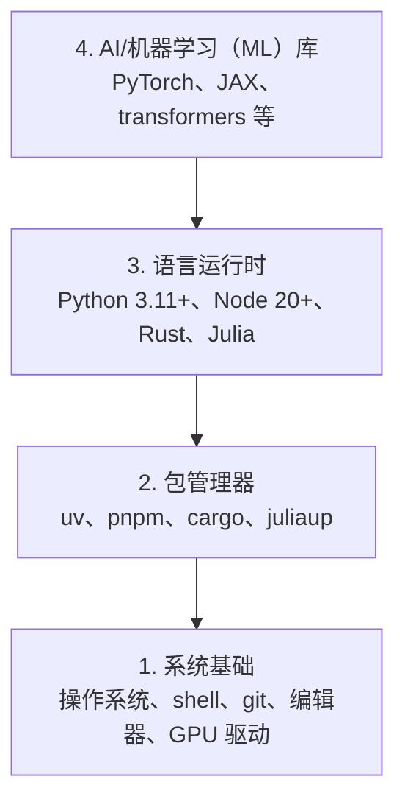

# 开发环境（Dev Environment）

> 工具会塑造你的思考方式。一次配置，把它配好。

**Type:** Build
**Languages:** Python, Node.js, Rust
**Prerequisites:** 无
**Time:** ~45 分钟

## 学习目标（Learning Objectives）

- 从零配置 Python 3.11+、Node.js 20+ 和 Rust 工具链（Toolchain）
- 配置虚拟环境（Virtual Environment）和包管理器（Package Manager），实现可复现构建
- 验证能否通过 CUDA/MPS 使用图形处理器（Graphics Processing Unit，GPU），并运行一次张量（Tensor）测试运算
- 理解系统、包、运行时（Runtime）、AI 库这四层技术栈

## 问题（The Problem）

你即将使用 Python、TypeScript、Rust 和 Julia，在 500 多节课中学习 AI 工程（AI Engineering）。如果环境有问题，每一课都会变成与工具较劲，而不是学习知识。

很多人跳过环境配置，随后却花上数小时排查导入错误、版本冲突和 CUDA 驱动缺失。我们要一次把这件事做好。

## 概念（The Concept）

AI 工程环境分为四层：



我们自底向上安装，每一层都依赖它下面的一层。

```figure
s0-env-stack
```

## 动手实现（Build It）

### 第 1 步：系统基础（Step 1: System Foundation）

检查系统并安装基础工具。

```bash
# macOS
xcode-select --install
brew install git curl wget

# Ubuntu/Debian
sudo apt update && sudo apt install -y build-essential git curl wget

# Windows (use WSL2)
wsl --install -d Ubuntu-24.04
```

### 第 2 步：用 uv 配置 Python（Step 2: Python with uv）

我们使用 `uv`：它比 pip 快 10–100 倍，并能自动管理虚拟环境。

```bash
curl -LsSf https://astral.sh/uv/install.sh | sh

uv python install 3.12

uv venv
source .venv/bin/activate  # or .venv\Scripts\activate on Windows

uv pip install numpy matplotlib jupyter
```

验证：

```python
import sys
print(f"Python {sys.version}")

import numpy as np
print(f"NumPy {np.__version__}")
a = np.array([1, 2, 3])
print(f"Vector: {a}, dot product with itself: {np.dot(a, a)}")
```

### 第 3 步：配置 Node.js 与 pnpm（Step 3: Node.js with pnpm）

用于 TypeScript 课程，包括智能体（Agent）、模型上下文协议（Model Context Protocol，MCP）服务器和 Web 应用。

```bash
curl -fsSL https://fnm.vercel.app/install | bash
fnm install 22
fnm use 22

npm install -g pnpm

node -e "console.log('Node', process.version)"
```

**macOS / Apple Silicon（M1/M2/M3/M4）：** 如果安装程序因 `Error: Cannot install under Rosetta 2 in ARM default prefix (/opt/homebrew)` 停止，说明终端运行在 Rosetta 2 下（`arch` 输出 `i386`），而 Homebrew 是原生 arm64 版本。强制以 arm64 安装 fnm，将其接入 shell，然后从 `fnm install 22` 开始重新运行上述命令：

```bash
arch -arm64 brew install fnm
echo 'eval "$(fnm env --use-on-cd)"' >> ~/.zshrc
source ~/.zshrc
```

### 第 4 步：Rust（Step 4: Rust）

用于对性能要求高的课程，例如推理（Inference）和系统开发。

```bash
curl --proto '=https' --tlsv1.2 -sSf https://sh.rustup.rs | sh

rustc --version
cargo --version
```

### 第 5 步：Julia，可选（Step 5: Julia (Optional)）

用于数学运算密集的课程，发挥 Julia 的优势。

```bash
curl -fsSL https://install.julialang.org | sh

julia -e 'println("Julia ", VERSION)'
```

### 第 6 步：配置 GPU（若有）（Step 6: GPU Setup (If You Have One)）

**NVIDIA (Linux / Windows):**

```bash
nvidia-smi

# Install PyTorch with CUDA
uv pip install torch torchvision torchaudio --index-url https://download.pytorch.org/whl/cu124
```

**macOS / Apple Silicon（M1/M2/M3/M4）：** Mac 不支持 CUDA，这是正常情况，不是故障。**不要**传入 `--index-url .../cuXXX`（这些 wheel 包仅适用于 Linux/Windows，因此会安装失败）。安装普通版本，其中包含 Apple 的 MPS（Metal）GPU 后端（Backend）：

```bash
uv pip install torch torchvision torchaudio
```

验证（适用于所有平台）：

```python
import torch
print(f"CUDA available: {torch.cuda.is_available()}")           # False on macOS — expected
print(f"MPS available:  {torch.backends.mps.is_available()}")   # True on Apple Silicon
if torch.cuda.is_available():
    print(f"GPU: {torch.cuda.get_device_name(0)}")
```

没有 GPU 也没关系。大多数课程可在中央处理器（Central Processing Unit，CPU）上运行。对于训练量大的课程，可以使用 Google Colab 或云端 GPU。

### 第 7 步：验证要开始的学习路线（Step 7: Verify the route you want to start）

本课所有命令都应在仓库根目录运行，也就是包含
`README.md` 和 `phases/` 的目录。预检（Preflight）仅检查
开始所选路线需要的项目。默认跳过后续才会用到的工具，让新学员看到
一个明确的结论，而不是满屏警告。

开始完整的初学者学习序列：

```bash
python3 phases/00-setup-and-tooling/01-dev-environment/code/verify.py --route beginner
```

也可以只检查你想学的路线：

```bash
python3 phases/00-setup-and-tooling/01-dev-environment/code/verify.py --route ml-foundations
python3 phases/00-setup-and-tooling/01-dev-environment/code/verify.py --route llm-engineering
python3 phases/00-setup-and-tooling/01-dev-environment/code/verify.py --route agents
python3 phases/00-setup-and-tooling/01-dev-environment/code/verify.py --route mcp
python3 phases/00-setup-and-tooling/01-dev-environment/code/verify.py --route agent-skills
python3 phases/00-setup-and-tooling/01-dev-environment/code/verify.py --route certification
```

如果希望同一次预检也检查可选工具
及后续课程使用的依赖，请添加 `--show-later`。后续工具缺失不会阻止
你开始所选路线。

每一项失败的必需检查都会给出检测到的路径或导入错误，以及
具体修复命令。智能体技能（Agent Skills）和认证路线还会显示
需要手动执行的宿主检查，因为 Python 脚本无法证明 AI 宿主已经
发现某项技能，也无法证明所选技能作用域可写。

初学者路线预检通过后，会打印第一节可运行课程的确切命令：

```text
Ready to start Beginner course.
Next: python3 phases/01-math-foundations/01-linear-algebra-intuition/code/vectors.py
```

## 实际应用（Use It）

你的环境已准备好，可以开始刚才检查的路线。后续工具等
课程需要时再安装，不必为了配齐整套技术栈而耽误第一课。
整个课程会用到以下工具：

| 语言 | 使用阶段 | 包管理器 |
|----------|---------|-----------------|
| Python | 阶段 1–12（机器学习（Machine Learning，ML）、深度学习（Deep Learning，DL）、自然语言处理（Natural Language Processing，NLP）、视觉、音频、大语言模型（Large Language Model，LLM）） | uv |
| TypeScript | 阶段 13–17（工具、智能体、智能体群（Swarm）、基础设施） | pnpm |
| Rust | 阶段 12、15–17（对性能要求高的系统） | cargo |
| Julia | 阶段 1（数学基础） | Pkg |

## 交付成果（Ship It）

本课产出一个验证脚本，任何人都能运行它来检查自己的环境配置。

`outputs/prompt-env-check.md` 提供了一个提示词（Prompt），用于帮助 AI 助手诊断环境问题。

## 练习（Exercises）

1. 运行验证脚本并修复所有失败项
2. 为本课程创建 Python 虚拟环境并安装 PyTorch
3. 用四种语言分别编写“hello world”程序，并逐一运行
