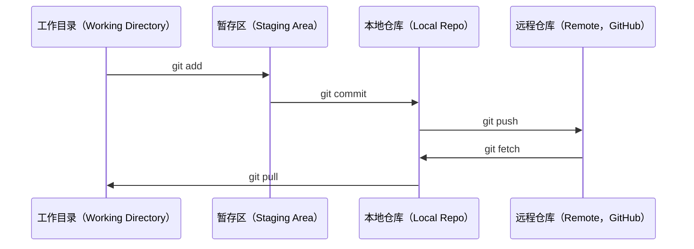

# Git 与协作（Git & Collaboration）

> 版本控制（Version Control）不是可选项。在这里，每次实验、每个模型，以及每课动手实现的内容，都要纳入版本控制。

**Type:** Learn
**Languages:** --
**Prerequisites:** 第 0 阶段，第 01 课
**Time:** ~30 分钟

## 学习目标（Learning Objectives）

- 配置 git 用户身份，并掌握暂存（add）、提交（commit）和推送（push）的日常工作流程
- 创建并合并分支（Branch），开展相互隔离的实验而不破坏 main 主分支
- 编写 `.gitignore`，排除模型检查点（Model Checkpoint）和大型二进制文件
- 使用 `git log` 浏览提交历史，了解项目的演变过程

## 问题（The Problem）

你将在 20 个阶段中编写数百个代码文件。如果没有版本控制，你可能丢失工作成果，造成无法撤销的破坏，也无法与他人协作。

Git 是版本控制工具，GitHub 是托管代码的地方。本课只介绍学习本课程所需的内容，不作额外扩展。

## 核心概念（The Concept）



记住三件事：
1. 经常保存（`git commit`）
2. 推送到远程仓库（`git push`）
3. 为实验创建分支（`git checkout -b experiment`）

```figure
s0-commit-dag
```

## 动手实现（Build It）

### 步骤 1：配置 git（Step 1: Configure git）

```bash
git config --global user.name "Your Name"
git config --global user.email "you@example.com"
```

### 步骤 2：日常工作流程（Step 2: The daily workflow）

```bash
git status
git add file.py
git commit -m "Add perceptron implementation"
git push origin main
```

### 步骤 3：为实验创建分支（Step 3: Branching for experiments）

在实验分支进行修改并提交，然后回到主分支合并。

```bash
git checkout -b experiment/new-optimizer

# ... make changes, commit ...

git checkout main
git merge experiment/new-optimizer
```

### 步骤 4：使用本课程仓库（Step 4: Working with this course repo）

你不能直接向课程仓库推送，因为只有维护者才有写入权限。先在 GitHub 上派生（Fork）一份仓库副本（点击右上角的 Fork 按钮），这样 `origin` 就会指向你自己的副本：

在自己的进度分支逐课学习，并提交你的代码。

```bash
git clone https://github.com/YOUR-USERNAME/ai-engineering-from-scratch.git
cd ai-engineering-from-scratch

git checkout -b my-progress
# work through lessons, commit your code
git push origin my-progress
```

## 实际应用（Use It）

学习本课程只需要以下命令：

| 命令 | 使用场景 |
|---------|------|
| `git clone` | 获取课程仓库 |
| `git add` + `git commit` | 保存工作成果 |
| `git push` | 将工作成果备份到 GitHub |
| `git checkout -b` | 在不破坏 main 主分支的情况下尝试新想法 |
| `git log --oneline` | 查看自己做过哪些修改 |

这些就够了。本课程不需要变基（rebase）、拣选提交（cherry-pick）或子模块（submodules）。

## 练习（Exercises）

1. 派生本仓库，克隆（Clone）你派生的副本，创建名为 `my-progress` 的分支，新建一个文件，提交并推送
2. 创建 `.gitignore`，排除模型检查点文件（`.pt`、`.pth`、`.safetensors`）
3. 使用 `git log --oneline` 查看本仓库的提交历史，了解各课是如何添加的

## 关键术语（Key Terms）

| 术语 | 常见说法 | 实际含义 |
|------|----------------|----------------------|
| 提交（Commit） | “保存” | 整个项目在某个时间点的快照 |
| 分支（Branch） | “一个副本” | 指向某次提交的指针，会随着你的工作推进而向前移动 |
| 合并（Merge） | “组合代码” | 将一个分支中的修改应用到另一个分支 |
| 远程仓库（Remote） | “云端” | 托管在其他地方（GitHub、GitLab）的仓库副本 |
