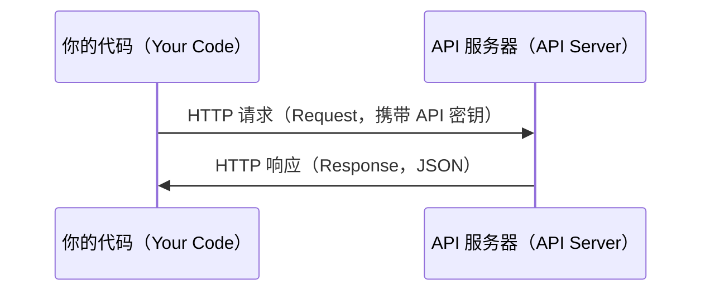

# API 与密钥（APIs & Keys）

> 所有 AI API 的工作方式都一样：发送请求，接收响应。细节会变，模式不变。

**Type:** Build
**Languages:** Python, TypeScript
**Prerequisites:** 阶段 0，第 01 课
**Time:** ~30 分钟

## 学习目标（Learning Objectives）

- 使用环境变量（Environment Variable）和 `.env` 文件安全地存储 API 密钥（API Key）
- 分别使用 Anthropic Python SDK 和原始 HTTP 调用大语言模型（Large Language Model，LLM）API
- 比较 SDK 与原始 HTTP 的请求、响应格式，辅助调试
- 识别并处理身份验证（Authentication）、速率限制（Rate Limit）等常见 API 错误

## 问题（The Problem）

从阶段 11 开始，你将调用 LLM API（Anthropic、OpenAI、Google）。阶段 13–16 中，你会构建循环调用这些 API 的智能体（Agent）。你需要了解 API 密钥的工作原理、安全存储方式，以及如何完成第一次 API 调用。

## 概念（The Concept）



每次 API 调用都包含：
1. 端点（Endpoint，URL）
2. API 密钥（用于身份验证）
3. 请求体（Request Body，说明你想要什么）
4. 响应体（Response Body，返回给你的内容）

```figure
s0-secret-inject
```

## 动手实现（Build It）

### 第 1 步：安全存储 API 密钥（Step 1: Store API keys safely）

绝不要把 API 密钥写进代码。应使用环境变量。

```bash
export ANTHROPIC_API_KEY="sk-ant-..."
export OPENAI_API_KEY="sk-..."
```

也可以使用 `.env` 文件（将其加入 `.gitignore`）：

```text
ANTHROPIC_API_KEY=sk-ant-...
OPENAI_API_KEY=sk-...
```

### 第 2 步：第一次 API 调用，Python（Step 2: First API call (Python)）

```python
import os

import anthropic

client = anthropic.Anthropic()

MODEL = os.environ.get("LLM_MODEL", "claude-sonnet-5")

response = client.messages.create(
    model=MODEL,
    max_tokens=256,
    messages=[{"role": "user", "content": "What is a neural network in one sentence?"}]
)

print(response.content[0].text)
```

`LLM_MODEL` 用于选择 Anthropic 模型 ID，默认值是不带日期的 Sonnet 别名。其他提供商（OpenAI、Google 等）也采用密钥加模型 ID 的模式，但各自拥有不同的 SDK、端点以及请求和响应结构（Schema）。

### 第 3 步：第一次 API 调用，TypeScript（Step 3: First API call (TypeScript)）

```typescript
import Anthropic from "@anthropic-ai/sdk";

const client = new Anthropic();

const MODEL = process.env.LLM_MODEL ?? "claude-sonnet-5";

const response = await client.messages.create({
  model: MODEL,
  max_tokens: 256,
  messages: [{ role: "user", content: "What is a neural network in one sentence?" }],
});

console.log(response.content[0].text);
```

### 第 4 步：原始 HTTP，不使用 SDK（Step 4: Raw HTTP (no SDK)）

```python
import os
import urllib.request
import json

url = "https://api.anthropic.com/v1/messages"
headers = {
    "Content-Type": "application/json",
    "x-api-key": os.environ["ANTHROPIC_API_KEY"],
    "anthropic-version": "2023-06-01",
}
body = json.dumps({
    "model": os.environ.get("LLM_MODEL", "claude-sonnet-5"),
    "max_tokens": 256,
    "messages": [{"role": "user", "content": "What is a neural network in one sentence?"}],
}).encode()

req = urllib.request.Request(url, data=body, headers=headers, method="POST")
with urllib.request.urlopen(req) as resp:
    result = json.loads(resp.read())
    print(result["content"][0]["text"])
```

这就是 SDK 在底层完成的工作。理解原始 HTTP 调用有助于调试。

## 实际应用（Use It）

本课程的使用情况：

| API | 何时需要 | 免费额度 |
|-----|-----------------|-----------|
| Anthropic (Claude) | 阶段 11–16（智能体、工具） | 注册赠送 $5 额度 |
| OpenAI | 阶段 11（对比） | 注册赠送 $5 额度 |
| Hugging Face | 阶段 4–10（模型、数据集） | 免费 |

现在不必全部配置好。课程需要时再配置即可。

## 交付成果（Ship It）

本课产出：
- `outputs/prompt-api-troubleshooter.md`：诊断常见 API 错误

## 练习（Exercises）

1. 获取 Anthropic API 密钥，完成第一次 API 调用
2. 尝试原始 HTTP 版本，并将响应格式与 SDK 版本对比
3. 故意使用错误的 API 密钥，阅读错误消息

## 关键术语（Key Terms）

| 术语 | 常见说法 | 实际含义 |
|------|----------------|----------------------|
| API 密钥（API Key） | “API 的密码” | 标识你的账户并授权请求的唯一字符串 |
| 速率限制（Rate Limit） | “他们在限流” | 每分钟或每小时允许的最大请求数，用于防止滥用并保证公平使用 |
| 词元（Token） | “一个单词”（在 API 语境中） | 一种计费单位：输入词元和输出词元分别统计、分别收费 |
| 流式传输（Streaming） | “实时响应” | 逐字接收响应，而不是等待完整响应生成后再接收 |
