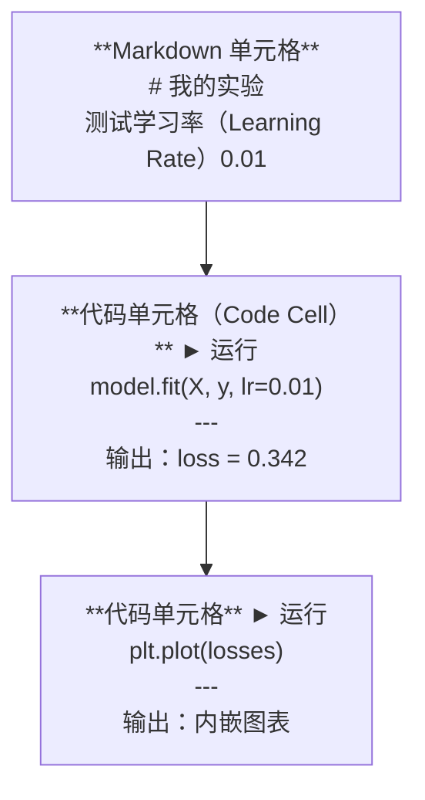
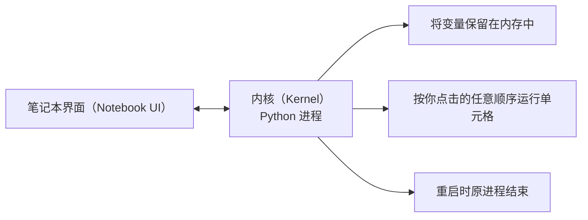

# Jupyter 笔记本（Jupyter Notebooks）

> 笔记本是 AI 工程（AI Engineering）的实验台。你在这里制作原型，再将验证可行的部分投入生产。

**Type:** Build
**Languages:** Python
**Prerequisites:** 阶段 0，第 01 课
**Time:** ~30 分钟

## 学习目标（Learning Objectives）

- 安装并启动 JupyterLab、Jupyter Notebook，或装有 Jupyter 扩展的 VS Code
- 使用魔法命令（Magic Command）（`%timeit`、`%%time`、`%matplotlib inline`）进行基准测试并在单元格内展示可视化结果
- 区分笔记本和脚本的适用场景，采用“在笔记本中探索，以脚本交付”的工作流程
- 识别并避免常见笔记本陷阱：乱序执行（Out-of-order Execution）、隐藏状态（Hidden State）和内存泄漏（Memory Leak）

## 问题（The Problem）

AI 论文、教程和 Kaggle 竞赛都在使用 Jupyter 笔记本。它们让你分段运行代码、就地查看输出、将代码与解释放在一起，并快速迭代。不用笔记本学习 AI，就像做数学作业却没有草稿纸。

但笔记本确实存在陷阱。人们用它做所有事情，甚至包括它很不擅长的工作。知道什么时候使用笔记本、什么时候改用脚本，可以避免日后陷入难以排查的调试困境。

## 概念（The Concept）

笔记本由一系列单元格（Cell）组成，每个单元格中存放代码或文本。



内核（Kernel）是一个在后台运行的 Python 进程。运行单元格时，代码会被发送给内核，由内核执行并返回结果。所有单元格共享同一个内核，因此变量会在不同单元格之间保留。



“按你点击的任意顺序”既是它的强项，也是容易误伤自己的地方。

```figure
s0-cell-order
```

## 动手实现（Build It）

### 第 1 步：选择界面（Step 1: Pick your interface）

三种选择，同一种格式：

| 界面 | 安装方式 | 最适合的场景 |
|-----------|---------|----------|
| JupyterLab | 先运行 `pip install jupyterlab`，再运行 `jupyter lab` | 完整的集成开发环境（Integrated Development Environment，IDE）体验、多标签页、文件浏览器、终端 |
| Jupyter Notebook | 先运行 `pip install notebook`，再运行 `jupyter notebook` | 简单、轻量，每次使用一个笔记本 |
| VS Code | 安装“Jupyter”扩展 | 直接在现有编辑器中使用，集成 git 和调试功能 |

三者都读写同一种 `.ipynb` 文件。选你喜欢的即可。AI 工作中最常用的是 JupyterLab。

```bash
pip install jupyterlab
jupyter lab
```

### 第 2 步：重要的快捷键（Step 2: Keyboard shortcuts that matter）

操作分为两种模式。按 `Escape` 进入命令模式（Command Mode，左侧显示蓝色条），按 `Enter` 进入编辑模式（Edit Mode，显示绿色条）。

**命令模式（最常用）：**

| 按键 | 操作 |
|-----|--------|
| `Shift+Enter` | 运行当前单元格并移到下一个 |
| `A` | 在上方插入单元格 |
| `B` | 在下方插入单元格 |
| `DD` | 删除单元格 |
| `M` | 转换为 Markdown |
| `Y` | 转换为代码 |
| `Z` | 撤销单元格操作 |
| `Ctrl+Shift+H` | 显示所有快捷键 |

**编辑模式：**

| 按键 | 操作 |
|-----|--------|
| `Tab` | 自动补全 |
| `Shift+Tab` | 显示函数签名（Function Signature） |
| `Ctrl+/` | 添加或取消注释 |

你每天会用到无数次 `Shift+Enter`，先记住它。

### 第 3 步：单元格类型（Step 3: Cell types）

**代码单元格**运行 Python 并显示输出：

```python
import numpy as np
data = np.random.randn(1000)
data.mean(), data.std()
```

输出：`(0.0032, 0.9987)`

**Markdown 单元格**渲染格式化文本。用它记录你在做什么以及为什么这样做。它支持标题、粗体、斜体、LaTeX 数学公式（`$E = mc^2$`）、表格和图片。

### 第 4 步：魔法命令（Step 4: Magic commands）

这些不是 Python 语法，而是 Jupyter 专用命令，以 `%`（行魔法命令，Line Magic）或 `%%`（单元格魔法命令，Cell Magic）开头。

**测量代码耗时：**

```python
%timeit np.random.randn(10000)
```

输出：`45.2 us +/- 1.3 us per loop`

```python
%%time
model.fit(X_train, y_train, epochs=10)
```

输出：`Wall time: 2.34 s`

`%timeit` 多次运行代码并取平均值；`%%time` 只运行一次。微基准测试（Microbenchmark）用 `%timeit`，训练运行用 `%%time`。

**启用内嵌绘图：**

```python
%matplotlib inline
```

现在每次调用 `plt.plot()` 或 `plt.show()`，都会直接在笔记本中渲染图表。

**不离开笔记本即可安装包：**

```python
!pip install scikit-learn
```

`!` 前缀用于运行任意 shell 命令。

**检查环境变量：**

```python
%env CUDA_VISIBLE_DEVICES
```

### 第 5 步：内嵌显示富输出（Step 5: Display rich output inline）

笔记本会自动显示单元格中最后一个表达式的值。不过，你可以控制显示内容：

```python
import pandas as pd

df = pd.DataFrame({
    "model": ["Linear", "Random Forest", "Neural Net"],
    "accuracy": [0.72, 0.89, 0.94],
    "training_time": [0.1, 2.3, 45.6]
})
df
```

这会渲染一个格式化的 HTML 表格，而不是纯文本输出。图表也一样：

```python
import matplotlib.pyplot as plt

plt.figure(figsize=(8, 4))
plt.plot([1, 2, 3, 4], [1, 4, 2, 3])
plt.title("Inline Plot")
plt.show()
```

图表会出现在单元格正下方。这正是笔记本在 AI 工作中占据主导地位的原因：数据、图表与代码可以同时查看。

显示图片时：

```python
from IPython.display import Image, display
display(Image(filename="architecture.png"))
```

### 第 6 步：Google Colab（Step 6: Google Colab）

Colab 是免费的云端 Jupyter 笔记本，提供 GPU、预装库以及 Google Drive 集成，无需配置。

1. 访问 [colab.research.google.com](https://colab.research.google.com)
2. 上传本课程中的任意 `.ipynb` 文件
3. 选择“运行时（Runtime）> 更改运行时类型（Change runtime type）> T4 GPU”（免费）

Colab 与本地 Jupyter 的区别：
- 文件不会跨会话保留（请保存到 Drive 或下载）
- 预装了 numpy、pandas、matplotlib、torch、tensorflow、sklearn
- 用 `from google.colab import files` 上传或下载文件
- 用 `from google.colab import drive; drive.mount('/content/drive')` 实现持久化存储（Persistent Storage）
- 连续 90 分钟无操作后，会话会超时（免费套餐）

## 实际应用（Use It）

### 笔记本与脚本：如何选择（Notebooks vs Scripts: When to use which）

| 适合使用笔记本 | 适合使用脚本 |
|-------------------|-----------------|
| 探索数据集 | 训练流水线（Training Pipeline） |
| 制作模型原型 | 可复用的工具函数 |
| 可视化结果 | 任何带有 `if __name__` 的程序 |
| 解释你的工作 | 定时运行的代码 |
| 快速实验 | 生产代码 |
| 课程练习 | 包与库 |

原则是：**在笔记本中探索，以脚本交付**。

AI 工作中的常见流程：
1. 在笔记本中探索数据
2. 在笔记本中制作模型原型
3. 验证可行后，将代码移到 `.py` 文件中
4. 再将这些 `.py` 文件导入笔记本，继续实验

### 常见陷阱（Common traps）

**乱序执行（Out-of-order Execution）。** 你先运行单元格 5，再运行 2，然后运行 7。笔记本在你的机器上能用，但别人从上到下运行就会出错。解决方法：分享前执行“内核（Kernel）> 重启并运行全部（Restart & Run All）”。

**隐藏状态（Hidden State）。** 删除单元格后，它创建的变量仍留在内存中。笔记本看似干净，却依赖一个已不存在的单元格。解决方法：定期重启内核。

**内存泄漏（Memory Leak）。** 加载一个 4GB 数据集，训练模型，再加载另一个数据集，却没有释放任何内存。解决方法：使用 `del variable_name` 和 `gc.collect()`，或重启内核。

## 交付成果（Ship It）

本课产出：
- `outputs/prompt-notebook-helper.md`，用于调试笔记本问题

## 练习（Exercises）

1. 打开 JupyterLab，创建笔记本，用 `%timeit` 比较列表推导式（List Comprehension）与 numpy 创建包含 100,000 个随机数的数组时的耗时
2. 创建一个同时包含 Markdown 和代码单元格的笔记本，加载 CSV、显示数据帧（DataFrame）并绘制图表。然后执行“内核（Kernel）> 重启并运行全部（Restart & Run All）”，验证其能够从上到下运行
3. 将 `code/notebook_tips.py` 中的代码粘贴到 Colab 笔记本，使用免费 GPU 运行

## 关键术语（Key Terms）

| 术语 | 常见说法 | 实际含义 |
|------|----------------|----------------------|
| 内核（Kernel） | “运行代码的东西” | 执行单元格并在内存中保留变量的独立 Python 进程 |
| 单元格（Cell） | “代码块” | 笔记本中可独立运行的单元，内容是代码或 Markdown |
| 魔法命令（Magic Command） | “Jupyter 技巧” | 以 `%` 或 `%%` 开头、用于控制笔记本环境的特殊命令 |
| `.ipynb` | “笔记本文件” | 包含单元格、输出和元数据的 JSON 文件，名称代表 IPython Notebook |

## 延伸阅读（Further Reading）

- [JupyterLab 文档](https://jupyterlab.readthedocs.io/)，了解完整功能
- [Google Colab 常见问题](https://research.google.com/colaboratory/faq.html)，了解 Colab 特有的限制和功能
- [28 个 Jupyter Notebook 技巧](https://www.dataquest.io/blog/jupyter-notebook-tips-tricks-shortcuts/)，了解进阶用户的快捷操作
