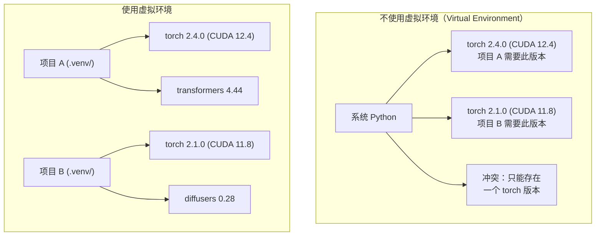

# Python 环境（Python Environments）

> 依赖地狱（Dependency Hell）确实存在。虚拟环境（Virtual Environment）就是解药。

**Type:** Build
**Languages:** Shell
**Prerequisites:** 阶段 0，第 01 课
**Time:** ~30 分钟

## 学习目标（Learning Objectives）

- 使用 `uv`、`venv` 或 `conda` 创建隔离的虚拟环境
- 编写包含可选依赖组的 `pyproject.toml`，并生成锁文件（Lockfile）以保证可复现性（Reproducibility）
- 诊断并修复常见问题：全局安装、混用 pip/conda、CUDA 版本不匹配
- 为依赖冲突的项目实施按阶段划分的环境策略

## 问题（The Problem）

你为一个微调（Fine-tuning）项目安装了 PyTorch 2.4。下周，另一个项目因为锁定了 CUDA 构建版本而需要 PyTorch 2.1。全局升级会破坏第一个项目；降级又会破坏第二个。

这就是依赖地狱。AI/机器学习（Machine Learning，ML）工作中经常发生这种情况，原因包括：

- PyTorch、JAX 和 TensorFlow 各自附带自己的 CUDA 绑定（Binding）
- 模型库会锁定特定的框架版本
- 全局 `pip install` 会覆盖先前安装的内容
- CUDA 11.8 构建与 CUDA 12.x 驱动无法配合使用，反之亦然

解决方法：每个项目使用独立隔离的环境，拥有自己的一套包。

## 概念（The Concept）



```figure
s0-env-isolation
```

## 动手实现（Build It）

### 方案 1：uv venv，推荐（Option 1: uv venv (Recommended)）

`uv` 是速度最快的 Python 包管理器（Package Manager），比 pip 快 10–100 倍。它将虚拟环境、Python 版本和依赖解析（Dependency Resolution）集成在一个工具中管理。

```bash
curl -LsSf https://astral.sh/uv/install.sh | sh

uv python install 3.12

cd your-project
uv venv
source .venv/bin/activate
```

安装包：

```bash
uv pip install torch numpy
```

一步创建带有 `pyproject.toml` 的项目：

```bash
uv init my-ai-project
cd my-ai-project
uv add torch numpy matplotlib
```

### 方案 2：venv，内置工具（Option 2: venv (Built-in)）

如果无法安装 `uv`，可以使用 Python 自带的 `venv`：

```bash
python3 -m venv .venv
source .venv/bin/activate  # Linux/macOS
.venv\Scripts\activate     # Windows

pip install torch numpy
```

它比 `uv` 慢，但只要安装了 Python 就能使用。

### 方案 3：conda，按需使用（Option 3: conda (When You Need It)）

Conda 可以管理 CUDA 工具包、cuDNN 和 C 库等非 Python 依赖。以下情况可以使用它：

- 需要特定版本的 CUDA 工具包，但不想在系统范围内安装
- 使用共享集群，无法安装系统包
- 某个库的安装说明要求“使用 conda”

```bash
# Install miniconda (not the full Anaconda)
curl -LsSf https://repo.anaconda.com/miniconda/Miniconda3-latest-Linux-x86_64.sh -o miniconda.sh
bash miniconda.sh -b

conda create -n myproject python=3.12
conda activate myproject

conda install pytorch torchvision torchaudio pytorch-cuda=12.4 -c pytorch -c nvidia
```

记住一条规则：如果用 conda 管理某个环境，就用 conda 管理该环境中的所有包。在 conda 环境中混用 `pip install`，会造成难以排查的依赖冲突。

### 本课程：按阶段管理环境（For This Course: Per-Phase Strategy）

你可以为整套课程创建一个环境，但不要这样做。不同阶段需要不同的依赖，有时它们还会冲突。

策略如下：

```text
ai-engineering-from-scratch/
├── .venv/                    <-- 阶段 0–3 共用的轻量环境
├── phases/
│   ├── 04-neural-networks/
│   │   └── .venv/            <-- PyTorch 环境
│   ├── 05-cnns/
│   │   └── .venv/            <-- 同一个 PyTorch 环境（符号链接或共享）
│   ├── 08-transformers/
│   │   └── .venv/            <-- 可能需要不同的 Transformer 版本
│   └── 11-llm-apis/
│       └── .venv/            <-- API SDK，无需 torch
```

`code/env_setup.sh` 中的脚本会创建本课程的基础环境。

## pyproject.toml 基础（pyproject.toml Basics）

每个 Python 项目都应该有一个 `pyproject.toml`，用一个文件替代 `setup.py`、`setup.cfg` 和 `requirements.txt`。

```toml
[project]
name = "ai-engineering-from-scratch"
version = "0.1.0"
requires-python = ">=3.11"
dependencies = [
    "numpy>=1.26",
    "matplotlib>=3.8",
    "jupyter>=1.0",
    "scikit-learn>=1.4",
]

[project.optional-dependencies]
torch = ["torch>=2.3", "torchvision>=0.18"]
llm = ["anthropic>=0.39", "openai>=1.50"]
```

然后安装：

```bash
uv pip install -e ".[torch]"    # base + PyTorch
uv pip install -e ".[llm]"     # base + LLM SDKs
uv pip install -e ".[torch,llm]" # everything
```

## 锁文件（Lockfiles）

锁文件将每个依赖（包括传递依赖（Transitive Dependency））锁定到确切版本，以保证可复现性：任何人通过锁文件安装，都会得到完全相同的包。

```bash
# uv generates uv.lock automatically when using uv add
uv add numpy

# pip-tools approach
uv pip compile pyproject.toml -o requirements.lock
uv pip install -r requirements.lock
```

将锁文件提交到 git。其他人克隆仓库后，通过锁文件安装就能得到相同版本。

## 常见错误（Common Mistakes）

### 1. 全局安装（Installing globally）

```bash
pip install torch  # BAD: installs to system Python

source .venv/bin/activate
pip install torch  # GOOD: installs to virtual environment
```

检查包安装到了哪里：

```bash
which python       # should show .venv/bin/python, not /usr/bin/python
which pip           # should show .venv/bin/pip
```

### 2. 混用 pip 和 conda（Mixing pip and conda）

```bash
conda create -n myenv python=3.12
conda activate myenv
conda install pytorch -c pytorch
pip install some-other-package   # BAD: can break conda's dependency tracking
conda install some-other-package # GOOD: let conda manage everything
```

如果必须在 conda 中使用 pip（有些包只能通过 pip 安装），先安装所有 conda 包，最后再安装 pip 包。

### 3. 忘记激活环境（Forgetting to activate）

```bash
python train.py           # uses system Python, missing packages
source .venv/bin/activate
python train.py           # uses project Python, packages found
```

shell 提示符应显示环境名称：

```text
(.venv) $ python train.py
```

### 4. 将 .venv 提交到 git（Committing .venv to git）

```bash
echo ".venv/" >> .gitignore
```

虚拟环境大小通常为 200MB–2GB。它们只适用于本机，不能直接移植到其他机器。应改为提交 `pyproject.toml` 和锁文件。

### 5. CUDA 版本不匹配（CUDA version mismatch）

```bash
nvidia-smi                # shows driver CUDA version (e.g., 12.4)
python -c "import torch; print(torch.version.cuda)"  # shows PyTorch CUDA version

# These must be compatible.
# PyTorch CUDA version must be <= driver CUDA version.
```

## 实际应用（Use It）

运行配置脚本，创建课程环境：

```bash
bash phases/00-setup-and-tooling/06-python-environments/code/env_setup.sh
```

这会在仓库根目录创建 `.venv`，并安装、验证核心依赖。

## 练习（Exercises）

1. 运行 `env_setup.sh`，确认所有检查通过
2. 创建第二个虚拟环境，在其中安装不同版本的 numpy，确认两个环境相互隔离
3. 为一个同时需要 PyTorch 和 Anthropic SDK 的项目编写 `pyproject.toml`
4. 故意全局安装一个包（不激活 venv），观察它的安装位置，然后卸载

## 关键术语（Key Terms）

| 术语 | 常见说法 | 实际含义 |
|------|----------------|----------------------|
| 虚拟环境（Virtual Environment） | “一个 venv” | 包含 Python 解释器和包的隔离目录，独立于系统 Python |
| 锁文件（Lockfile） | “锁定的依赖” | 列出所有包及其确切版本的文件，保证不同机器安装结果一致 |
| pyproject.toml | “新版 setup.py” | 标准 Python 项目配置文件，替代 setup.py/setup.cfg/requirements.txt |
| 传递依赖（Transitive Dependency） | “依赖的依赖” | 包 B 依赖 C；如果安装的 A 依赖 B，那么 C 就是 A 的传递依赖 |
| CUDA 版本不匹配（CUDA Mismatch） | “我的 GPU 不工作了” | 编译 PyTorch 所用的 CUDA 版本与 GPU 驱动支持的版本不同 |
