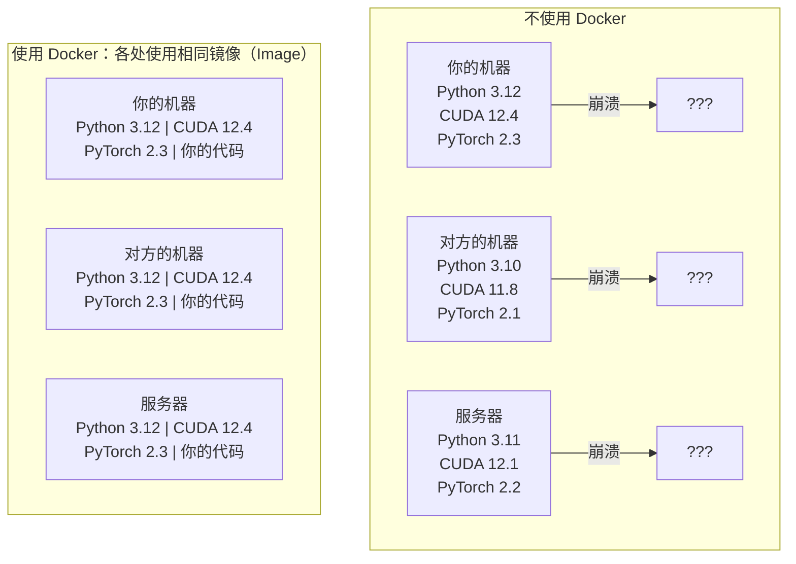

# 面向 AI 的 Docker（Docker for AI）

> 容器（Container）让“在我的机器上能运行”成为过去。

**Type:** Build
**Languages:** Docker
**Prerequisites:** 阶段 0，第 01、03 课
**Time:** ~60 分钟

## 学习目标（Learning Objectives）

- 通过 Dockerfile 构建支持 GPU、包含 CUDA、PyTorch 和 AI 库的 Docker 镜像（Image）
- 将宿主机（Host）目录挂载为卷（Volume），让模型、数据集和代码在容器重建后仍然保留
- 配置 NVIDIA Container Toolkit，让容器能够访问 GPU
- 使用 Docker Compose 编排（Orchestrate）多服务 AI 应用：推理服务器（Inference Server）加向量数据库（Vector Database）

## 问题（The Problem）

你在笔记本电脑上使用 PyTorch 2.3、CUDA 12.4 和 Python 3.12 训练了模型。同事使用的是 PyTorch 2.1、CUDA 11.8 和 Python 3.10。模型在对方机器上崩溃，但你的 Dockerfile 可以在两台机器上使用。

AI 项目的依赖往往很难管理。典型技术栈包括 Python、PyTorch、CUDA 驱动、cuDNN、系统级 C 库，以及 flash-attn 这类要求特定编译器版本的专用包。Docker 将它们打包到同一个镜像中，使其在各处以相同方式运行。

## 概念（The Concept）

Docker 将代码、运行时（Runtime）、库和系统工具封装成一个隔离单元，称为容器。可以将其理解为轻量级虚拟机（Virtual Machine，VM），但它共享宿主操作系统内核（Kernel），不运行自己的内核，因此几秒就能启动，而不是几分钟。



### 为什么 AI 项目尤其需要 Docker（Why AI projects need Docker more than most）

1. **GPU 驱动容易出兼容性问题。** CUDA 12.4 代码无法在 CUDA 11.8 上运行。Docker 将 CUDA 工具包隔离在容器内部，同时通过 NVIDIA Container Toolkit 共享宿主机的 GPU 驱动。

2. **模型权重（Model Weights）很大。** 一个 70 亿参数的模型在 fp16 下占 14 GB。你不会希望每次重建都重新下载。Docker 卷可以将宿主机上的模型目录挂载进容器。

3. **多服务架构（Multi-service Architecture）很常见。** 真正的 AI 应用不只是一个 Python 脚本，而是推理服务器、用于检索增强生成（Retrieval-Augmented Generation，RAG）的向量数据库，可能还有 Web 前端。Docker Compose 用一条命令就能编排这些服务。

### 关键词汇（Key vocabulary）

| 术语 | 含义 |
|------|---------------|
| 镜像（Image） | 只读模板，好比菜谱，由 Dockerfile 构建。 |
| 容器（Container） | 镜像的运行实例，好比厨房。 |
| Dockerfile | 逐层构建镜像的指令。 |
| 卷（Volume） | 容器重启后仍保留的持久化存储（Persistent Storage）。 |
| docker-compose | 使用 YAML 定义多容器应用的工具。 |

### AI 中常见的容器模式（Common container patterns in AI）

```text
开发容器（Dev Container）
  完整工具包、编辑器支持、Jupyter、调试工具。
  用于开发和实验。

训练容器（Training Container）
  精简配置，只包含训练脚本和依赖。
  在 GPU 集群上运行，无编辑器，无 Jupyter。

推理容器（Inference Container）
  为服务优化，镜像小，冷启动（Cold Start）快。
  在生产环境中位于负载均衡器（Load Balancer）之后。
```

```figure
s0-image-layers
```

## 动手实现（Build It）

### 第 1 步：安装 Docker（Step 1: Install Docker）

```bash
# macOS
brew install --cask docker
open /Applications/Docker.app

# Ubuntu
curl -fsSL https://get.docker.com | sh
sudo usermod -aG docker $USER
# Log out and back in for group change to take effect
```

验证：

```bash
docker --version
docker run hello-world
```

### 第 2 步：安装 NVIDIA Container Toolkit，适用于配备 NVIDIA GPU 的 Linux（Step 2: Install NVIDIA Container Toolkit (Linux with NVIDIA GPU)）

它让 Docker 容器能够访问 GPU。macOS 和 Windows（WSL2）用户可以跳过这一步；Docker Desktop 在这些平台上以不同方式处理 GPU 直通（GPU Passthrough）。

```bash
distribution=$(. /etc/os-release;echo $ID$VERSION_ID)
curl -fsSL https://nvidia.github.io/libnvidia-container/gpgkey | sudo gpg --dearmor -o /usr/share/keyrings/nvidia-container-toolkit-keyring.gpg
curl -s -L https://nvidia.github.io/libnvidia-container/$distribution/libnvidia-container.list | \
    sed 's#deb https://#deb [signed-by=/usr/share/keyrings/nvidia-container-toolkit-keyring.gpg] https://#g' | \
    sudo tee /etc/apt/sources.list.d/nvidia-container-toolkit.list

sudo apt-get update
sudo apt-get install -y nvidia-container-toolkit
sudo nvidia-ctk runtime configure --runtime=docker
sudo systemctl restart docker
```

测试容器内能否访问 GPU：

```bash
docker run --rm --gpus all nvidia/cuda:12.4.1-base-ubuntu22.04 nvidia-smi
```

如果看到了 GPU 信息，说明工具包正常工作。

### 第 3 步：理解基础镜像（Step 3: Understand base images）

选择正确的基础镜像（Base Image），可以节省数小时调试时间。

```text
nvidia/cuda:12.4.1-devel-ubuntu22.04
  完整 CUDA 工具包，包含编译器。
  适用于：构建需要 nvcc 的包（flash-attn、bitsandbytes）
  大小：~4 GB

nvidia/cuda:12.4.1-runtime-ubuntu22.04
  仅含 CUDA 运行时，不含编译器。
  适用于：运行预先构建的代码
  大小：~1.5 GB

pytorch/pytorch:2.6.0-cuda12.4-cudnn9-runtime
  在 CUDA 基础上预装 PyTorch。
  适用于：跳过 PyTorch 安装步骤
  大小：~6 GB

python:3.12-slim
  不含 CUDA，仅支持 CPU。
  适用于：CPU 推理、轻量工具
  大小：~150 MB
```

### 第 4 步：编写 AI 开发用 Dockerfile（Step 4: Write a Dockerfile for AI development）

下面是 `code/Dockerfile` 中的 Dockerfile，逐项阅读：

```dockerfile
FROM nvidia/cuda:12.4.1-devel-ubuntu22.04

ENV DEBIAN_FRONTEND=noninteractive
ENV PYTHONUNBUFFERED=1

RUN apt-get update && apt-get install -y --no-install-recommends \
    software-properties-common \
    git \
    curl \
    build-essential \
    && add-apt-repository -y ppa:deadsnakes/ppa \
    && apt-get update && apt-get install -y --no-install-recommends \
    python3.12 \
    python3.12-venv \
    python3.12-dev \
    && rm -rf /var/lib/apt/lists/*

RUN update-alternatives --install /usr/bin/python python /usr/bin/python3.12 1

RUN curl -sSL https://raw.githubusercontent.com/pypa/get-pip/3b73145063be545b649ad9ca83ea8da5fc915a4f/public/get-pip.py -o /tmp/get-pip.py \
    && echo "a341e1a43e38001c551a1508a73ff23636a11970b61d901d9a1cad2a18f57055  /tmp/get-pip.py" | sha256sum -c - \
    && python /tmp/get-pip.py \
    && rm /tmp/get-pip.py \
    && update-alternatives --install /usr/bin/pip pip /usr/local/bin/pip3.12 1

RUN python -m pip install --no-cache-dir --upgrade pip setuptools wheel

RUN python -m pip install --no-cache-dir \
    torch==2.6.0+cu124 \
    torchvision==0.21.0+cu124 \
    torchaudio==2.6.0+cu124 \
    --index-url https://download.pytorch.org/whl/cu124

RUN python -m pip install --no-cache-dir \
    numpy \
    pandas \
    scikit-learn \
    matplotlib \
    jupyter \
    transformers \
    datasets \
    accelerate \
    safetensors

WORKDIR /workspace

VOLUME ["/workspace", "/models"]

EXPOSE 8888

CMD ["python"]
```

构建镜像：

```bash
docker build -t ai-dev -f phases/00-setup-and-tooling/07-docker-for-ai/code/Dockerfile .
```

首次构建需要一些时间，因为要下载 CUDA 基础镜像和 PyTorch。后续构建会使用缓存层（Cached Layer）。

运行：

```bash
docker run --rm -it --gpus all \
    -v $(pwd):/workspace \
    -v ~/models:/models \
    ai-dev python -c "import torch; print(f'PyTorch {torch.__version__}, CUDA: {torch.cuda.is_available()}')"
```

在容器内运行 Jupyter：

```bash
docker run --rm -it --gpus all \
    -v $(pwd):/workspace \
    -v ~/models:/models \
    -p 8888:8888 \
    ai-dev jupyter notebook --ip=0.0.0.0 --port=8888 --no-browser --allow-root
```

### 第 5 步：为数据和模型挂载卷（Step 5: Volume mounts for data and models）

卷挂载（Volume Mount）对 AI 工作至关重要。没有它，下载的 14 GB 模型会在容器停止时消失。

```bash
# Mount your code
-v $(pwd):/workspace

# Mount a shared models directory
-v ~/models:/models

# Mount datasets
-v ~/datasets:/data
```

在训练脚本中，从挂载路径加载模型：

```python
from transformers import AutoModel

model = AutoModel.from_pretrained("/models/llama-7b")
```

模型保存在宿主机文件系统中。无论重建多少次容器，都不必重新下载。

### 第 6 步：用 Docker Compose 运行多服务 AI 应用（Step 6: Docker Compose for multi-service AI apps）

真正的 RAG 应用需要推理服务器和向量数据库。Docker Compose 用一条命令即可同时运行两者。

参见 `code/docker-compose.yml`：

```yaml
services:
  ai-dev:
    build:
      context: .
      dockerfile: Dockerfile
    deploy:
      resources:
        reservations:
          devices:
            - driver: nvidia
              count: all
              capabilities: [gpu]
    volumes:
      - ../../../:/workspace
      - ~/models:/models
      - ~/datasets:/data
    ports:
      - "8888:8888"
    stdin_open: true
    tty: true
    command: jupyter notebook --ip=0.0.0.0 --port=8888 --no-browser --allow-root

  qdrant:
    image: qdrant/qdrant:v1.12.5
    ports:
      - "6333:6333"
      - "6334:6334"
    volumes:
      - qdrant_data:/qdrant/storage

volumes:
  qdrant_data:
```

启动所有服务：

```bash
cd phases/00-setup-and-tooling/07-docker-for-ai/code
docker compose up -d
```

现在，AI 开发容器可以通过服务名访问位于 `http://qdrant:6333` 的向量数据库。Docker Compose 会自动创建共享网络。

从 AI 容器内部测试连接：

```python
from qdrant_client import QdrantClient

client = QdrantClient(host="qdrant", port=6333)
print(client.get_collections())
```

停止所有服务：

```bash
docker compose down
```

添加 `-v`，同时删除 qdrant 卷：

```bash
docker compose down -v
```

### 第 7 步：AI 工作中实用的 Docker 命令（Step 7: Useful Docker commands for AI work）

```bash
# List running containers
docker ps

# List all images and their sizes
docker images

# Remove unused images (reclaim disk space)
docker system prune -a

# Check GPU usage inside a running container
docker exec -it <container_id> nvidia-smi

# Copy a file from container to host
docker cp <container_id>:/workspace/results.csv ./results.csv

# View container logs
docker logs -f <container_id>
```

## 实际应用（Use It）

现在你拥有一个可复现的 AI 开发环境。本课程后续学习中：

- 使用 `docker compose up` 同时启动开发环境和向量数据库
- 将代码、模型和数据挂载为卷，避免在重建之间丢失内容
- 课程需要新的 Python 包时，将其加入 Dockerfile 并重新构建
- 与团队成员分享 Dockerfile，让他们获得完全相同的环境。

### 没有 GPU？（No GPU?）

移除 `--gpus all` 标志和 NVIDIA 部署配置块，容器仍可用于基于 CPU 的课程。PyTorch 会检测到 CUDA 缺失，并自动回退到 CPU。

## 练习（Exercises）

1. 构建 Dockerfile，并在容器内运行 `python -c "import torch; print(torch.__version__)"`
2. 启动 docker-compose 服务栈，验证能否从 AI 容器访问 `http://qdrant:6333/collections` 上的 Qdrant
3. 将 `flask` 加入 Dockerfile，重新构建，在端口 5000 运行一个简单的 API 服务器。使用 `-p 5000:5000` 映射端口
4. 使用 `docker images` 查看镜像大小。尝试将基础镜像从 `devel` 换成 `runtime`，比较大小

## 关键术语（Key Terms）

| 术语 | 常见说法 | 实际含义 |
|------|----------------|----------------------|
| 容器（Container） | “轻量虚拟机” | 使用宿主内核的隔离进程，拥有自己的文件系统和网络 |
| 镜像层（Image Layer） | “缓存步骤” | 每条 Dockerfile 指令都会创建一层。未变化的层会被缓存，因此重建很快。 |
| NVIDIA Container Toolkit | “Docker 中的 GPU” | 通过 `--gpus` 标志将宿主 GPU 暴露给容器的运行时钩子（Runtime Hook） |
| 卷挂载（Volume Mount） | “共享文件夹” | 映射到容器中的宿主目录。容器停止后，修改仍会保留。 |
| 基础镜像（Base Image） | “起点” | Dockerfile 构建所基于的 `FROM` 镜像，决定了预装内容。 |
