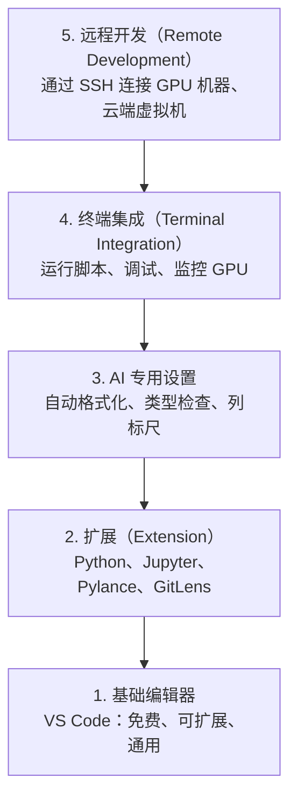

# 编辑器配置（Editor Setup）

> 编辑器是你的搭档。一次配置好，让它不再妨碍工作，而是帮你分担任务。

**Type:** Build
**Languages:** --
**Prerequisites:** 阶段 0，第 01 课
**Time:** ~20 分钟

## 学习目标（Learning Objectives）

- 安装 VS Code 以及 Python、Jupyter、代码检查（Linting）和远程 SSH 所需的扩展
- 为 AI 工作流程配置保存时格式化（Format on Save）、类型检查（Type Checking）和笔记本输出滚动
- 配置 Remote SSH，像操作本地代码一样编辑和调试远程 GPU 机器上的代码
- 评估替代编辑器（Cursor、Windsurf、Neovim），比较它们用于 AI 工作时的取舍

## 问题（The Problem）

你将在编辑器中花费数千小时编写 Python、运行笔记本、调试训练循环，并通过 SSH 连接 GPU 机器。配置不当会让每次工作都受阻：没有自动补全、类型提示和行内错误提示，需要手动格式化，终端操作也很笨重。

正确配置需要 20 分钟。跳过它，则每天都会损失 20 分钟。

## 概念（The Concept）

AI 工程（AI Engineering）的编辑器配置需要五个部分：



```figure
s0-lsp-roundtrip
```

## 动手实现（Build It）

### 第 1 步：安装 VS Code（Step 1: Install VS Code）

推荐使用 VS Code。它免费、支持各类操作系统、对 Jupyter 笔记本支持完善，扩展生态涵盖 AI 工作所需的各种功能。

从 [code.visualstudio.com](https://code.visualstudio.com/) 下载。

在终端中验证：

```bash
code --version
```

如果 macOS 找不到 `code`，打开 VS Code，按 `Cmd+Shift+P`，输入“Shell Command”，选择“将 'code' 命令安装到 PATH（Install 'code' command in PATH）”。

### 第 2 步：安装必需扩展（Step 2: Install Essential Extensions）

打开 VS Code 的集成终端（所有平台均为 `` Ctrl+` ``），安装 AI 工作需要的扩展：

```bash
code --install-extension ms-python.python
code --install-extension ms-python.vscode-pylance
code --install-extension ms-toolsai.jupyter
code --install-extension eamodio.gitlens
code --install-extension ms-vscode-remote.remote-ssh
code --install-extension ms-python.debugpy
code --install-extension ms-python.black-formatter
code --install-extension charliermarsh.ruff
```

各扩展的用途：

| 扩展 | 用途 |
|-----------|-----|
| Python | 语言支持、虚拟环境检测、运行与调试 |
| Pylance | 快速类型检查、自动补全、导入解析 |
| Jupyter | 在 VS Code 内运行笔记本，浏览变量 |
| GitLens | 查看谁修改了什么，行内显示 git blame |
| Remote SSH | 像打开本地目录一样打开远程 GPU 机器上的文件夹 |
| Debugpy | Python 单步调试（Step-through Debugging） |
| Black Formatter | 保存时自动格式化，保持风格一致 |
| Ruff | 快速代码检查，发现常见错误 |

本课的 `code/.vscode/extensions.json` 文件包含完整推荐列表。打开项目文件夹时，VS Code 会提示你安装这些扩展。

### 第 3 步：配置设置（Step 3: Configure Settings）

复制本课 `code/.vscode/settings.json` 中的设置，或通过 `Settings > Open Settings (JSON)` 手动应用。

AI 工作的关键设置：

```jsonc
{
    "python.analysis.typeCheckingMode": "basic",
    "editor.formatOnSave": true,
    "editor.rulers": [88, 120],
    "notebook.output.scrolling": true,
    "files.autoSave": "afterDelay"
}
```

这些设置的重要性：

- **基础类型检查（basic）**：运行前发现参数类型错误，减少排查张量形状（Tensor Shape）不匹配和 API 参数错误的时间。
- **保存时格式化**：不用再考虑格式，交给 Black 处理。
- **第 88 和 120 列的标尺（Ruler）**：Black 在第 88 列换行；第 120 列标记用于提醒文档字符串（Docstring）和注释过长。
- **笔记本输出滚动**：训练循环可能打印数千行。没有滚动区域，输出面板会无限扩张。
- **自动保存（Auto-save）**：忘记保存会让训练脚本运行旧代码。自动保存可以避免这种情况。

### 第 4 步：终端集成（Step 4: Terminal Integration）

你可以在 VS Code 的集成终端中运行训练脚本、监控 GPU 和管理环境。

按以下方式配置：

```jsonc
{
    "terminal.integrated.defaultProfile.osx": "zsh",
    "terminal.integrated.defaultProfile.linux": "bash",
    "terminal.integrated.fontSize": 13,
    "terminal.integrated.scrollback": 10000
}
```

实用快捷键：

| 操作 | macOS | Linux/Windows |
|--------|-------|---------------|
| 显示或隐藏终端 | `` Ctrl+` `` | `` Ctrl+` `` |
| 新建终端 | `` Ctrl+Shift+` `` | `` Ctrl+Shift+` `` |
| 拆分终端 | `Cmd+\` | `Ctrl+Shift+5` |

拆分终端很实用：一个运行脚本，另一个用 `nvidia-smi -l 1` 或 `watch -n 1 nvidia-smi` 监控 GPU。

### 第 5 步：远程开发，通过 SSH 连接 GPU 机器（Step 5: Remote Development (SSH into GPU Boxes)）

这是 AI 工作中最重要的扩展。你会在远程机器（云端虚拟机、实验室服务器、Lambda、Vast.ai）上运行训练。Remote SSH 让你像操作本地机器一样打开远程文件系统、编辑文件、运行终端和调试。

配置步骤：

1. 安装 Remote SSH 扩展（第 2 步已完成）。
2. 按 `Ctrl+Shift+P`（或 `Cmd+Shift+P`），输入“Remote-SSH: Connect to Host”（连接到主机）。
3. 输入 `user@your-gpu-box-ip`。
4. VS Code 会自动在远程机器上安装服务端组件。

要实现免密码访问，配置 SSH 密钥：

```bash
ssh-keygen -t ed25519 -C "your-email@example.com"
ssh-copy-id user@your-gpu-box-ip
```

为方便使用，将主机加入 `~/.ssh/config`：

```text
Host gpu-box
    HostName 203.0.113.50
    User ubuntu
    IdentityFile ~/.ssh/id_ed25519
    ForwardAgent yes
```

现在通过 `Remote-SSH: Connect to Host > gpu-box` 即可直接连接。

## 替代方案（Alternatives）

### Cursor 编辑器（Cursor）

[cursor.com](https://cursor.com) 是基于 VS Code 派生、内置 AI 代码生成功能的编辑器，使用相同的扩展生态和设置格式。如果使用 Cursor，本课内容仍然适用。导入同样的 `settings.json` 和 `extensions.json` 即可。

### Windsurf 编辑器（Windsurf）

[windsurf.com](https://windsurf.com) 是另一个以 AI 为核心、基于 VS Code 派生的编辑器。同样拥有相同的扩展、设置格式和 Remote SSH 支持。

### Vim/Neovim 编辑器（Vim/Neovim）

如果你已经使用 Vim 或 Neovim，且工作效率不错，就继续使用。Python AI 工作所需的最低配置如下：

- 用 **pyright** 或 **pylsp** 进行类型检查（通过 Mason 或手动安装）
- 用 **nvim-lspconfig** 集成语言服务器（Language Server）
- 用 **jupyter-vim** 或 **molten-nvim** 实现类似笔记本的执行方式
- 用 **telescope.nvim** 搜索文件和符号（Symbol）
- 用 **none-ls.nvim** 配合 black 和 ruff 进行格式化与代码检查

如果你尚未使用 Vim，就不要现在开始。它的学习曲线会分散你学习 AI 工程的精力。使用 VS Code 即可。

## 实际应用（Use It）

完成配置后，日常工作流程如下：

1. 在 VS Code 中打开项目文件夹（或通过 Remote SSH 连接 GPU 机器）。
2. 借助自动补全、类型提示和行内错误提示编写 Python。
3. 使用 Jupyter 扩展在编辑器内运行 Jupyter 笔记本。
4. 使用集成终端运行训练脚本、执行 `uv pip install` 并监控 GPU。
5. 提交前用 GitLens 审阅修改。

## 练习（Exercises）

1. 安装 VS Code 和第 2 步列出的所有扩展
2. 将本课的 `settings.json` 复制到你的 VS Code 配置中
3. 打开 Python 文件，验证 Pylance 能显示类型提示，Black 能在保存时格式化
4. 如果可以访问远程机器，配置 Remote SSH 并打开其上的文件夹

## 关键术语（Key Terms）

| 术语 | 常见说法 | 实际含义 |
|------|----------------|----------------------|
| 语言服务器协议（Language Server Protocol，LSP） | “自动补全引擎” | 编辑器向特定语言服务器获取类型信息、补全和诊断结果的标准协议 |
| Pylance | “Python 插件” | Microsoft 的 Python 语言服务器，使用 Pyright 进行类型检查并提供 IntelliSense |
| Remote SSH | “在服务器上工作” | 在远程机器上运行轻量服务器，并将界面传送到本地编辑器的 VS Code 扩展 |
| 保存时格式化（Format on Save） | “自动美化” | 每次保存时编辑器都会运行格式化器（Black、Ruff），使代码风格始终一致 |
