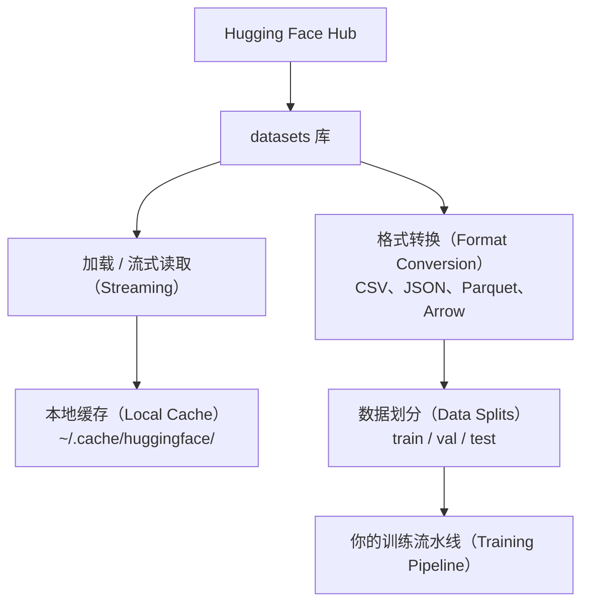

# 数据管理（Data Management）

> 数据是燃料。管理方式决定了你能走多快。

**Type:** Build
**Language:** Python
**Prerequisites:** 阶段 0，第 01 课
**Time:** ~45 分钟

## 学习目标（Learning Objectives）

- 使用 Hugging Face `datasets` 库加载、流式读取（Streaming）和缓存（Cache）数据集
- 在 CSV、JSON、Parquet 和 Arrow 格式之间转换，并解释各自的取舍
- 使用固定随机种子（Random Seed）创建可复现的训练集、验证集和测试集划分
- 使用 `.gitignore`、Git LFS 或 DVC 管理大型模型和数据集文件

## 问题（The Problem）

每个 AI 项目都从数据开始。你需要寻找并下载数据集、转换格式、划分训练与评估数据，并进行版本管理以确保实验可复现。每次手动完成这些工作既慢又容易出错。你需要一套可重复执行的工作流程。

## 概念（The Concept）



Hugging Face `datasets` 库是 AI 工作中加载数据的标准方式，开箱即用地处理下载、缓存、格式转换和流式读取。

```figure
s0-data-pipeline
```

## 动手实现（Build It）

### 第 1 步：安装 datasets 库（Step 1: Install the datasets library）

```bash
pip install datasets huggingface_hub
```

### 第 2 步：加载数据集（Step 2: Load a dataset）

```python
from datasets import load_dataset

dataset = load_dataset("stanfordnlp/imdb")
print(dataset)
print(dataset["train"][0])
```

这会下载 IMDB 影评数据集。首次下载后，后续会从 `~/.cache/huggingface/datasets/` 的缓存加载。

### 第 3 步：流式读取大型数据集（Step 3: Stream large datasets）

有些数据集太大，磁盘也装不下。流式读取逐行加载数据，无需下载整个数据集。

```python
dataset = load_dataset("wikimedia/wikipedia", "20231101.en", split="train", streaming=True)

for i, example in enumerate(dataset):
    print(example["title"])
    if i >= 4:
        break
```

流式读取返回 `IterableDataset`。数据行到达后即可处理，无论数据集有多大，内存占用都保持恒定。

### 第 4 步：数据集格式（Step 4: Dataset formats）

`datasets` 库底层使用 Apache Arrow。你可以根据流水线需求转换为其他格式。

```python
dataset = load_dataset("stanfordnlp/imdb", split="train")

dataset.to_csv("imdb_train.csv")
dataset.to_json("imdb_train.json")
dataset.to_parquet("imdb_train.parquet")
```

格式对比：

| 格式 | 大小 | 读取速度 | 最适合的场景 |
|--------|------|-----------|----------|
| CSV | 大 | 慢 | 人工阅读、电子表格 |
| JSON | 大 | 慢 | API、嵌套数据 |
| Parquet | 小 | 快 | 分析、列式查询（Columnar Query） |
| Arrow | 小 | 最快 | 内存处理（`datasets` 内部使用的格式） |

对于 AI 工作，Parquet 是最佳存储格式。内存中使用 Arrow，CSV 和 JSON 用于数据交换。

### 第 5 步：数据划分（Step 5: Data splits）

每个机器学习（Machine Learning，ML）项目都需要三种划分：

- **训练集（Train）**：模型从中学习（通常占 80%）
- **验证集（Validation）**：训练过程中用它检查进展（通常占 10%）
- **测试集（Test）**：训练完成后用于最终评估（通常占 10%）

有些数据集预先做好了划分；没有的话就自行划分：

```python
dataset = load_dataset("stanfordnlp/imdb", split="train")

split = dataset.train_test_split(test_size=0.2, seed=42)
train_val = split["train"].train_test_split(test_size=0.125, seed=42)

train_ds = train_val["train"]
val_ds = train_val["test"]
test_ds = split["test"]

print(f"Train: {len(train_ds)}, Val: {len(val_ds)}, Test: {len(test_ds)}")
```

始终设置随机种子以保证可复现性（Reproducibility）。相同种子每次都会产生相同的划分。

### 第 6 步：下载与缓存模型（Step 6: Download and cache models）

模型文件很大。`huggingface_hub` 库负责下载和缓存。

```python
from huggingface_hub import hf_hub_download, snapshot_download

model_path = hf_hub_download(
    repo_id="sentence-transformers/all-MiniLM-L6-v2",
    filename="config.json"
)
print(f"Cached at: {model_path}")

model_dir = snapshot_download("sentence-transformers/all-MiniLM-L6-v2")
print(f"Full model at: {model_dir}")
```

模型缓存到 `~/.cache/huggingface/hub/`。下载完成后，后续运行即可直接加载。

### 第 7 步：处理大型文件（Step 7: Handle large files）

模型权重（Model Weights）和大型数据集不应放进 git。可以选择以下三种方式：

**方案 A：.gitignore（最简单）**

```text
*.bin
*.safetensors
*.pt
*.onnx
data/*.parquet
data/*.csv
models/
```

**方案 B：Git LFS（在 git 中跟踪大型文件）**

```bash
git lfs install
git lfs track "*.bin"
git lfs track "*.safetensors"
git add .gitattributes
```

Git LFS 在仓库中存储指针（Pointer），实际文件保存在独立服务器上。GitHub 提供 1 GB 免费空间。

**方案 C：DVC（数据版本控制，Data Version Control）**

```bash
pip install dvc
dvc init
dvc add data/training_set.parquet
git add data/training_set.parquet.dvc data/.gitignore
git commit -m "Track training data with DVC"
```

DVC 创建小型 `.dvc` 文件来指向数据。数据本身保存在 S3、GCS 或其他远程存储后端（Storage Backend）中。

| 方法 | 复杂度 | 最适合的场景 |
|----------|-----------|----------|
| .gitignore | 低 | 个人项目、可以重新获取的已下载数据 |
| Git LFS | 中 | 团队通过 git 共享模型权重 |
| DVC | 高 | 可复现实验、大型数据集、团队协作 |

本课程使用 `.gitignore` 就足够了。需要在不同机器上精确复现实验时，再使用 DVC。

### 第 8 步：存储模式（Step 8: Storage patterns）

**本地存储（Local Storage）**适用于小于约 10 GB 的数据集。HF 缓存会自动处理。

**云存储（Cloud Storage）**适用于更大的数据，或需要在多台机器间共享的数据：

```python
import os

local_path = os.path.expanduser("~/.cache/huggingface/datasets/")

# s3_path = "s3://my-bucket/datasets/"
# gcs_path = "gs://my-bucket/datasets/"
```

DVC 可直接集成 S3 和 GCS：

```bash
dvc remote add -d myremote s3://my-bucket/dvc-store
dvc push
```

本课程使用本地存储即可。当你在远程 GPU 实例上进行微调（Fine-tuning）时，才会需要云存储。

## 本课程使用的数据集（Datasets Used in This Course）

| 数据集 | 课程主题 | 大小 | 学习内容 |
|---------|---------|------|----------------|
| IMDB | 分词（Tokenization）、分类 | 84 MB | 文本分类基础 |
| WikiText | 语言建模（Language Modeling） | 181 MB | 下一词元预测（Next-token Prediction） |
| SQuAD | 问答系统（Question Answering，QA） | 35 MB | 问答、文本跨度（Span） |
| Common Crawl（子集） | 嵌入（Embedding） | 不固定 | 大规模文本处理 |
| MNIST | 视觉基础 | 21 MB | 图像分类基础 |
| COCO（子集） | 多模态（Multimodal） | 不固定 | 图像与文本配对 |

现在不必全部下载。每课都会说明需要哪些数据集。

## 实际应用（Use It）

运行工具脚本，验证一切正常：

```bash
python code/data_utils.py
```

它会下载一个小型数据集，转换格式、划分数据，并打印概要。

## 交付成果（Ship It）

本课产出：
- `code/data_utils.py`：可复用的数据加载与缓存工具
- `outputs/prompt-data-helper.md`：用于为任务寻找合适数据集的提示词（Prompt）

## 练习（Exercises）

1. 使用 `mrpc` 配置加载 `glue` 数据集，查看前 5 个样本
2. 流式读取 `c4` 数据集，统计 10 秒内能处理多少个样本
3. 将数据集转换为 Parquet，比较它与 CSV 的文件大小
4. 使用固定种子按 70/15/15 划分训练集、验证集和测试集，并核实各部分大小

## 关键术语（Key Terms）

| 术语 | 常见说法 | 实际含义 |
|------|----------------|----------------------|
| 数据集划分（Dataset Split） | “训练数据” | 在 ML 生命周期不同阶段使用的具名子集（train/val/test） |
| 流式读取（Streaming） | “惰性加载” | 从远程来源逐行处理数据，而不下载完整数据集 |
| Parquet | “压缩版 CSV” | 为分析查询和存储效率优化的列式文件格式（Columnar File Format） |
| Arrow | “快速数据帧” | datasets 库内部用于零拷贝（Zero-copy）读取的内存列式格式 |
| Git LFS | “大文件版 Git” | 将大型文件存储在 git 仓库之外，同时将指针保留在版本控制中的扩展 |
| DVC | “数据版 Git” | 与云存储集成、用于数据集和模型的版本控制系统 |
| 缓存（Cache） | “已经下载过了” | 先前获取数据的本地副本，默认保存在 ~/.cache/huggingface/ |
