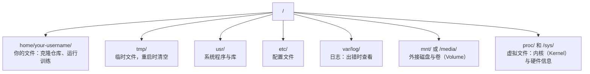

# 面向 AI 的 Linux（Linux for AI）

> 大多数 AI 工作运行在 Linux 上。你需要掌握足够的知识，避免操作受阻。

**Type:** Learn
**Languages:** --
**Prerequisites:** 阶段 0，第 01 课
**Time:** ~30 分钟

## 学习目标（Learning Objectives）

- 浏览 Linux 文件系统（File System），从命令行执行基本文件操作
- 使用 `chmod` 和 `chown` 管理文件权限（Permission），解决“Permission denied”（权限被拒绝）错误
- 使用 `apt` 安装系统包，为新 GPU 机器配置 AI 工作环境
- 识别从 macOS 转向 Linux 时，在远程机器工作中常见的差异与陷阱

## 问题（The Problem）

你在 macOS 或 Windows 上开发。但一旦通过 SSH 连接云端 GPU 机器、租用 Lambda 实例或启动 EC2 机器，就进入了 Ubuntu。终端是唯一的操作界面，没有 Finder、资源管理器，也没有图形用户界面（Graphical User Interface，GUI）。如果不会从命令行浏览文件系统、安装包和管理进程，就只能一边为空闲 GPU 付费，一边搜索“如何在 Linux 中解压文件”。

这是一份生存指南，只覆盖在远程 Linux 机器上开展 AI 工作所需的操作，不作额外扩展。

## 文件系统布局（File System Layout）

Linux 将所有内容组织在唯一的根目录 `/` 下，没有 `C:\` 或 `/Volumes`。你实际会接触的目录如下：



你的主目录（Home Directory）是 `~` 或 `/home/your-username`。几乎所有工作都会在这里进行。

## 基本命令（Essential Commands）

以下 15 个命令覆盖了远程 GPU 机器上 95% 的日常操作。

### 切换位置（Moving Around）

```bash
pwd                         # Where am I?
ls                          # What's here?
ls -la                      # What's here, including hidden files with details?
cd /path/to/dir             # Go there
cd ~                        # Go home
cd ..                       # Go up one level
```

### 文件与目录（Files and Directories）

```bash
mkdir my-project            # Create a directory
mkdir -p a/b/c              # Create nested directories in one shot

cp file.txt backup.txt      # Copy a file
cp -r src/ src-backup/      # Copy a directory (recursive)

mv old.txt new.txt          # Rename a file
mv file.txt /tmp/           # Move a file

rm file.txt                 # Delete a file (no trash, it's gone)
rm -rf my-dir/              # Delete a directory and everything inside
```

`rm -rf` 会永久删除内容，无法撤销。按回车前务必再次核对路径。

### 读取文件（Reading Files）

```bash
cat file.txt                # Print entire file
head -20 file.txt           # First 20 lines
tail -20 file.txt           # Last 20 lines
tail -f log.txt             # Follow a log file in real time (Ctrl+C to stop)
less file.txt               # Scroll through a file (q to quit)
```

### 搜索（Searching）

```bash
grep "error" training.log           # Find lines containing "error"
grep -r "learning_rate" .           # Search all files in current directory
grep -i "cuda" config.yaml          # Case-insensitive search

find . -name "*.py"                 # Find all Python files under current dir
find . -name "*.ckpt" -size +1G     # Find checkpoint files larger than 1GB
```

## 权限（Permissions）

Linux 中的每个文件都有所有者（Owner）和权限位（Permission Bit）。脚本无法执行或目录无法写入时，你就会遇到这些概念。

```bash
ls -l train.py
# -rwxr-xr-- 1 user group 2048 Mar 19 10:00 train.py
#  ^^^             owner permissions: read, write, execute
#     ^^^          group permissions: read, execute
#        ^^        everyone else: read only
```

常见修复方法：

```bash
chmod +x train.sh           # Make a script executable
chmod 755 deploy.sh         # Owner: full, others: read+execute
chmod 644 config.yaml       # Owner: read+write, others: read only

chown user:group file.txt   # Change who owns a file (needs sudo)
```

出现“Permission denied”（权限被拒绝）时，几乎总是权限问题。大多数情况可以通过 `chmod +x` 或 `sudo` 解决。

## 包管理（Package Management，apt）

Ubuntu 使用 `apt`，通过它安装系统级软件。

```bash
sudo apt update             # Refresh the package list (always do this first)
sudo apt install -y htop    # Install a package (-y skips confirmation)
sudo apt install -y build-essential  # C compiler, make, etc. Needed by many Python packages
sudo apt install -y tmux    # Terminal multiplexer (keep sessions alive after disconnect)

apt list --installed        # What's installed?
sudo apt remove htop        # Uninstall
```

新 GPU 机器上常需安装的包：

```bash
sudo apt update && sudo apt install -y \
    build-essential \
    git \
    curl \
    wget \
    tmux \
    htop \
    unzip \
    python3-venv
```

## 用户与 sudo（Users and sudo）

你通常以普通用户身份登录。某些操作需要 root（管理员）权限。

```bash
whoami                      # What user am I?
sudo command                # Run a single command as root
sudo su                     # Become root (exit to go back, use sparingly)
```

在云端 GPU 实例上，你通常是唯一用户，且已经拥有 sudo 权限。不要以 root 身份运行所有操作，只在需要时使用 sudo。

## 进程与 systemd（Processes and systemd）

训练挂起（Hang）或需要检查正在运行的程序时：

```bash
htop                        # Interactive process viewer (q to quit)
ps aux | grep python        # Find running Python processes
kill 12345                  # Gracefully stop process with PID 12345
kill -9 12345               # Force kill (use when graceful doesn't work)
nvidia-smi                  # GPU processes and memory usage
```

systemd 管理服务，也就是后台守护进程（Daemon）。运行推理服务器（Inference Server）时会用到它：

```bash
sudo systemctl start nginx          # Start a service
sudo systemctl stop nginx           # Stop it
sudo systemctl restart nginx        # Restart it
sudo systemctl status nginx         # Check if it's running
sudo systemctl enable nginx         # Start automatically on boot
```

## 磁盘空间（Disk Space）

GPU 机器的磁盘空间通常有限，模型和数据集很快就会将其填满。

```bash
df -h                       # Disk usage for all mounted drives
df -h /home                 # Disk usage for /home specifically

du -sh *                    # Size of each item in current directory
du -sh ~/.cache             # Size of your cache (pip, huggingface models land here)
du -sh /data/checkpoints/   # Check how big your checkpoints are

# Find the biggest space hogs
du -h --max-depth=1 / 2>/dev/null | sort -hr | head -20
```

常见节省空间的方法：

```bash
# Clear pip cache
pip cache purge

# Clear apt cache
sudo apt clean

# Remove old checkpoints you don't need
rm -rf checkpoints/epoch_01/ checkpoints/epoch_02/
```

## 网络操作（Networking）

你会从命令行下载模型、传输文件和调用 API。

```bash
# Download files
wget https://example.com/model.bin                   # Download a file
curl -O https://example.com/data.tar.gz              # Same thing with curl
curl -s https://api.example.com/health | python3 -m json.tool  # Hit an API, pretty-print JSON

# Transfer files between machines
scp model.bin user@remote:/data/                     # Copy file to remote machine
scp user@remote:/data/results.csv .                  # Copy file from remote to local
scp -r user@remote:/data/checkpoints/ ./local-dir/   # Copy directory

# Sync directories (faster than scp for large transfers, resumes on failure)
rsync -avz --progress ./data/ user@remote:/data/
rsync -avz --progress user@remote:/results/ ./results/
```

传输大型内容时，优先用 `rsync` 而非 `scp`。它只传输变化的字节，并能处理连接中断。

## tmux：保持会话运行（tmux: Keep Sessions Alive）

通过 SSH 连接远程机器后，合上笔记本电脑会终止训练。tmux 可以避免这种情况。

```bash
tmux new -s train           # Start a new session named "train"
# ... start your training, then:
# Ctrl+B, then D            # Detach (training keeps running)

tmux ls                     # List sessions
tmux attach -t train        # Reattach to session

# Inside tmux:
# Ctrl+B, then %            # Split pane vertically
# Ctrl+B, then "            # Split pane horizontally
# Ctrl+B, then arrow keys   # Switch between panes
```

长时间训练任务务必在 tmux 内运行，每次都应如此。

## Windows 用户的 WSL2（WSL2 for Windows Users）

如果使用 Windows，WSL2 可以提供真正的 Linux 环境，无需配置双系统启动（Dual Boot）。

```bash
# In PowerShell (admin)
wsl --install -d Ubuntu-24.04

# After restart, open Ubuntu from Start menu
sudo apt update && sudo apt upgrade -y
```

WSL2 运行真正的 Linux 内核。本课所有操作都能在其中使用。在 WSL 内部，你的 Windows 文件位于 `/mnt/c/Users/YourName/`。

GPU 直通（GPU Passthrough）配合 Windows 端安装的 NVIDIA 驱动工作。安装 Windows NVIDIA 驱动，而不是 Linux 驱动，WSL2 中就可以使用 CUDA。

## 从 macOS 到 Linux 的常见陷阱（Gotchas: macOS to Linux）

从 macOS 转过来时，以下差异容易让你遇到问题：

| macOS | Linux | 说明 |
|-------|-------|-------|
| `brew install` | `sudo apt install` | 包名称有时不同。`brew install htop` 与 `sudo apt install htop` 的包名相同，但 `brew install readline` 对应的是 `sudo apt install libreadline-dev`。 |
| `open file.txt` | `xdg-open file.txt` | 但远程机器通常没有 GUI，应使用 `cat` 或 `less`。 |
| `pbcopy` / `pbpaste` | 不可用 | SSH 中没有这种通过管道读写剪贴板的方式。 |
| `~/.zshrc` | `~/.bashrc` | macOS 默认使用 zsh，大多数 Linux 服务器使用 bash。 |
| `/opt/homebrew/` | `/usr/bin/`, `/usr/local/bin/` | 二进制程序位于不同位置。 |
| `sed -i '' 's/a/b/' file` | `sed -i 's/a/b/' file` | macOS sed 在 `-i` 后需要空字符串，Linux 不需要。 |
| 不区分大小写的文件系统 | 区分大小写的文件系统 | 在 Linux 上，`Model.py` 和 `model.py` 是两个不同文件。 |
| 换行符 `\n` | 换行符 `\n` | 两者相同。但 Windows 使用 `\r\n`，会破坏 bash 脚本，可运行 `dos2unix` 修复。 |

## 速查表（Quick Reference Card）

```text
目录导航：      pwd, ls, cd, find
文件操作：      cp, mv, rm, mkdir, cat, head, tail, less
搜索：          grep, find
权限：          chmod, chown, sudo
包管理：        apt update, apt install
进程：          htop, ps, kill, nvidia-smi
服务：          systemctl start/stop/restart/status
磁盘：          df -h, du -sh
网络：          curl, wget, scp, rsync
会话：          tmux new/attach/detach
```

```figure
s0-process-fork
```

## 练习（Exercises）

1. 通过 SSH 连接任意 Linux 机器（或打开 WSL2），进入主目录。创建项目文件夹，用 `touch` 在其中创建三个空文件，再用 `ls -la` 列出它们。
2. 用 apt 安装 `htop`，运行并找出占用内存最多的进程。
3. 启动 tmux 会话，在其中运行 `sleep 300`，分离会话，列出会话，再重新附加。
4. 用 `df -h` 检查可用磁盘空间，再用 `du -sh ~/.cache/*` 找出缓存中占用空间的内容。
5. 用 `scp` 将文件从本地传到远程机器，再用 `rsync` 完成同样传输，比较使用体验。
