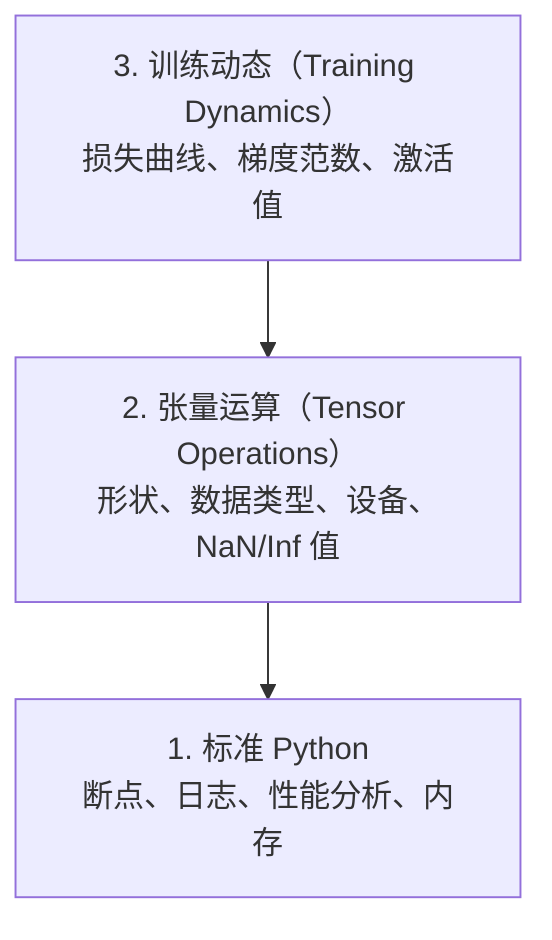

# 调试与性能分析（Debugging and Profiling）

> 最糟糕的 AI 缺陷不会导致崩溃。它们悄无声息地用垃圾数据训练，却报告一条漂亮的损失曲线（Loss Curve）。

**Type:** Build
**Language:** Python
**Prerequisites:** 第 1 课（开发环境（Dev Environment）），基本熟悉 PyTorch
**Time:** ~60 分钟

## 学习目标（Learning Objectives）

- 在训练中使用条件式 `breakpoint()` 和 `debug_print` 检查张量（Tensor）的形状、数据类型（dtype）及非数值（Not a Number，NaN）
- 使用 `cProfile`、`line_profiler` 和 `tracemalloc` 分析训练循环，寻找瓶颈（Bottleneck）
- 检测常见 AI 缺陷：形状不匹配、NaN 损失、数据泄漏（Data Leakage）和位于错误设备上的张量
- 配置 TensorBoard，可视化损失曲线、权重直方图（Weight Histogram）和梯度分布（Gradient Distribution）

## 问题（The Problem）

AI 代码的失败方式与普通代码不同。Web 应用崩溃时会给出堆栈跟踪（Stack Trace）；配置错误的训练循环却可能运行 8 小时，消耗 $200 的 GPU 时间，最终产出的模型只会预测每个输入的均值。代码从未报错。缺陷可能是张量放错了设备、忘记调用 `.detach()`，或标签泄漏到了特征中。

你需要调试工具，在这些静默失败（Silent Failure）浪费时间和算力前将其发现。

## 概念（The Concept）

AI 调试分为三个层次：



大多数人直接跳到第 3 层，盯着 TensorBoard 看。但 80% 的 AI 缺陷出在第 1、2 层。

```figure
s0-flame-hot
```

## 动手实现（Build It）

### 第 1 部分：打印调试，确实有效（Part 1: Print Debugging (Yes, It Works)）

打印调试（Print Debugging）常被轻视，但不该如此。对于张量代码，有针对性的打印语句比调试器单步执行更有效，因为你需要同时看到形状、数据类型和数值范围。

```python
def debug_print(name, tensor):
    print(f"{name}: shape={tensor.shape}, dtype={tensor.dtype}, "
          f"device={tensor.device}, "
          f"min={tensor.min().item():.4f}, max={tensor.max().item():.4f}, "
          f"mean={tensor.mean().item():.4f}, "
          f"has_nan={tensor.isnan().any().item()}")
```

在每个可疑操作后调用它，找到缺陷后移除打印即可。

### 第 2 部分：Python 调试器（Part 2: Python Debugger (pdb and breakpoint)）

内置调试器在 AI 工作中的价值被低估了。在训练循环中加入 `breakpoint()`，即可交互式检查张量。

```python
def training_step(model, batch, criterion, optimizer):
    inputs, labels = batch
    outputs = model(inputs)
    loss = criterion(outputs, labels)

    if loss.item() > 100 or torch.isnan(loss):
        breakpoint()

    loss.backward()
    optimizer.step()
```

进入调试器后，以下命令很有用：

- 用 `p outputs.shape` 检查形状
- 用 `p loss.item()` 查看损失值
- 用 `p torch.isnan(outputs).sum()` 统计 NaN 数量
- 用 `p model.fc1.weight.grad` 检查梯度（Gradient）
- 用 `c` 继续，用 `q` 退出

这就是条件调试（Conditional Debugging）：只在出现可疑情况时暂停。对于运行 10,000 步的训练，这一点很重要。

### 第 3 部分：Python 日志（Part 3: Python Logging）

调试不再只是快速检查时，用日志（Logging）替代打印语句。

```python
import logging

logging.basicConfig(
    level=logging.INFO,
    format="%(asctime)s [%(levelname)s] %(message)s",
    handlers=[
        logging.FileHandler("training.log"),
        logging.StreamHandler()
    ]
)
logger = logging.getLogger(__name__)

logger.info("Starting training: lr=%.4f, batch_size=%d", lr, batch_size)
logger.warning("Loss spike detected: %.4f at step %d", loss.item(), step)
logger.error("NaN loss at step %d, stopping", step)
```

日志提供时间戳、严重级别和文件输出。训练在凌晨 3 点失败时，你需要的是日志文件，而不是已经滚出屏幕的终端输出。

### 第 4 部分：测量代码片段耗时（Part 4: Timing Code Sections）

知道时间花在哪里，是优化的第一步。

```python
import time

class Timer:
    def __init__(self, name=""):
        self.name = name

    def __enter__(self):
        self.start = time.perf_counter()
        return self

    def __exit__(self, *args):
        elapsed = time.perf_counter() - self.start
        print(f"[{self.name}] {elapsed:.4f}s")

with Timer("data loading"):
    batch = next(dataloader_iter)

with Timer("forward pass"):
    outputs = model(batch)

with Timer("backward pass"):
    loss.backward()
```

常见发现：数据加载占训练时间的 60%。解决办法是在 DataLoader 中设置 `num_workers > 0`，而不是换更快的 GPU。

### 第 5 部分：cProfile 与 line_profiler（Part 5: cProfile and line_profiler）

手动计时器不够用时：

```bash
python -m cProfile -s cumtime train.py
```

它按累计耗时显示所有函数调用。若要逐行进行性能分析（Profiling）：

```bash
pip install line_profiler
```

```python
@profile
def train_step(model, data, target):
    output = model(data)
    loss = F.cross_entropy(output, target)
    loss.backward()
    return loss

# Run with: kernprof -l -v train.py
```

### 第 6 部分：内存分析（Part 6: Memory Profiling）

#### 用 tracemalloc 分析 CPU 内存（CPU Memory with tracemalloc）

```python
import tracemalloc

tracemalloc.start()

# your code here
model = build_model()
data = load_dataset()

snapshot = tracemalloc.take_snapshot()
top_stats = snapshot.statistics("lineno")
for stat in top_stats[:10]:
    print(stat)
```

#### 用 memory_profiler 分析 CPU 内存（CPU Memory with memory_profiler）

```bash
pip install memory_profiler
```

```python
from memory_profiler import profile

@profile
def load_data():
    raw = read_csv("data.csv")       # watch memory jump here
    processed = preprocess(raw)       # and here
    return processed
```

运行 `python -m memory_profiler your_script.py`，查看逐行内存用量。

#### 用 PyTorch 分析 GPU 显存（GPU Memory with PyTorch）

```python
import torch

if torch.cuda.is_available():
    print(torch.cuda.memory_summary())

    print(f"Allocated: {torch.cuda.memory_allocated() / 1e9:.2f} GB")
    print(f"Cached: {torch.cuda.memory_reserved() / 1e9:.2f} GB")
```

遇到内存不足（Out of Memory，OOM）时：

1. 减小批量大小（Batch Size），始终先尝试这一步
2. 用 `torch.cuda.empty_cache()` 释放缓存显存
3. 对大型中间结果，先用 `del tensor`，再用 `torch.cuda.empty_cache()`
4. 使用混合精度（Mixed Precision）（`torch.cuda.amp`），将内存占用减半
5. 对很深的模型使用梯度检查点（Gradient Checkpointing）

### 第 7 部分：常见 AI 缺陷及检测方法（Part 7: Common AI Bugs and How to Catch Them）

#### 形状不匹配（Shape Mismatch）

这是最常见的缺陷：模型期望 `[batch, channels, height, width]`，张量形状却是 `[batch, features]`。

```python
def check_shapes(model, sample_input):
    print(f"Input: {sample_input.shape}")
    hooks = []

    def make_hook(name):
        def hook(module, inp, out):
            in_shape = inp[0].shape if isinstance(inp, tuple) else inp.shape
            out_shape = out.shape if hasattr(out, "shape") else type(out)
            print(f"  {name}: {in_shape} -> {out_shape}")
        return hook

    for name, module in model.named_modules():
        hooks.append(module.register_forward_hook(make_hook(name)))

    with torch.no_grad():
        model(sample_input)

    for h in hooks:
        h.remove()
```

用一个样本批次运行一次，就能列出模型中的每次形状变换。

#### NaN 损失（NaN Loss）

NaN 损失说明某处数值计算失控。常见原因：

- 学习率（Learning Rate）过高
- 自定义损失函数中除以零
- 对零或负数取对数
- 循环神经网络（Recurrent Neural Network，RNN）中发生梯度爆炸（Exploding Gradient）

```python
def detect_nan(model, loss, step):
    if torch.isnan(loss):
        print(f"NaN loss at step {step}")
        for name, param in model.named_parameters():
            if param.grad is not None:
                if torch.isnan(param.grad).any():
                    print(f"  NaN gradient in {name}")
                if torch.isinf(param.grad).any():
                    print(f"  Inf gradient in {name}")
        return True
    return False
```

#### 数据泄漏（Data Leakage）

模型在测试集上达到 99% 准确率，听起来不错，但这是一个缺陷。

```python
def check_data_leakage(train_set, test_set, id_column="id"):
    train_ids = set(train_set[id_column].tolist())
    test_ids = set(test_set[id_column].tolist())
    overlap = train_ids & test_ids
    if overlap:
        print(f"DATA LEAKAGE: {len(overlap)} samples in both train and test")
        return True
    return False
```

还要检查时间泄漏（Temporal Leakage）：用未来数据预测过去。划分前先按时间戳排序。

#### 设备错误（Wrong Device）

位于不同设备（CPU 与 GPU）的张量会导致运行时错误。但有时某个张量悄悄留在 CPU 上，其他内容都在 GPU 上，训练只是变慢，并不报错。

```python
def check_devices(model, *tensors):
    model_device = next(model.parameters()).device
    print(f"Model device: {model_device}")
    for i, t in enumerate(tensors):
        if t.device != model_device:
            print(f"  WARNING: tensor {i} on {t.device}, model on {model_device}")
```

### 第 8 部分：TensorBoard 基础（Part 8: TensorBoard Basics）

TensorBoard 展示训练内部情况随时间的变化。

```bash
pip install tensorboard
```

```python
from torch.utils.tensorboard import SummaryWriter

writer = SummaryWriter("runs/experiment_1")

for step in range(num_steps):
    loss = train_step(model, batch)

    writer.add_scalar("loss/train", loss.item(), step)
    writer.add_scalar("lr", optimizer.param_groups[0]["lr"], step)

    if step % 100 == 0:
        for name, param in model.named_parameters():
            writer.add_histogram(f"weights/{name}", param, step)
            if param.grad is not None:
                writer.add_histogram(f"grads/{name}", param.grad, step)

writer.close()
```

启动：

```bash
tensorboard --logdir=runs
```

需要关注的现象：

- **损失不下降**：学习率太低，或模型架构有问题
- **损失剧烈振荡**：学习率太高
- **损失变为 NaN**：数值不稳定（Numerical Instability），参见上方 NaN 小节
- **训练损失下降、验证损失上升**：过拟合（Overfitting）
- **权重直方图收缩到零附近**：梯度消失（Vanishing Gradient）
- **梯度直方图数值暴涨**：需要梯度裁剪（Gradient Clipping）

### 第 9 部分：VS Code 调试器（Part 9: VS Code Debugger）

要进行交互式调试，用 `launch.json` 配置 VS Code：

```json
{
    "version": "0.2.0",
    "configurations": [
        {
            "name": "Debug Training",
            "type": "debugpy",
            "request": "launch",
            "program": "${file}",
            "console": "integratedTerminal",
            "justMyCode": false
        }
    ]
}
```

点击代码左侧边栏设置断点（Breakpoint）。使用变量（Variables）面板检查张量属性。调试控制台（Debug Console）允许你在执行过程中运行任意 Python 表达式。

这适合单步检查数据预处理流水线（Data Preprocessing Pipeline），逐次查看每个变换。

## 实际应用（Use It）

以下调试流程可以发现大多数 AI 缺陷：

1. **训练前**：用样本批次运行 `check_shapes`，确认输入和输出维度符合预期。
2. **前 10 步**：对损失、输出和梯度使用 `debug_print`，确认没有 NaN，且数值范围合理。
3. **训练期间**：记录损失、学习率和梯度范数（Gradient Norm），用 TensorBoard 可视化。
4. **出现故障时**：在失败位置加入 `breakpoint()`，交互式检查张量。
5. **性能方面**：分别测量数据加载、前向传播（Forward Pass）和反向传播（Backward Pass）的耗时。如果接近 OOM，分析内存用量。

## 交付成果（Ship It）

运行调试工具包脚本：

```bash
python phases/00-setup-and-tooling/12-debugging-and-profiling/code/debug_tools.py
```

`outputs/prompt-debug-ai-code.md` 提供帮助诊断 AI 特有缺陷的提示词（Prompt）。

## 练习（Exercises）

1. 运行 `debug_tools.py`，逐段阅读输出。修改示例模型以引入 NaN（提示：在前向传播中除以零），观察检测器如何发现它。
2. 用 `cProfile` 分析训练循环，找出最慢的函数。
3. 用 `tracemalloc` 找出数据加载流水线中分配内存最多的代码行。
4. 为一次简单训练配置 TensorBoard，判断模型是否过拟合。
5. 在训练循环内使用 `breakpoint()`，练习从调试器提示符检查张量形状、设备和梯度值。
