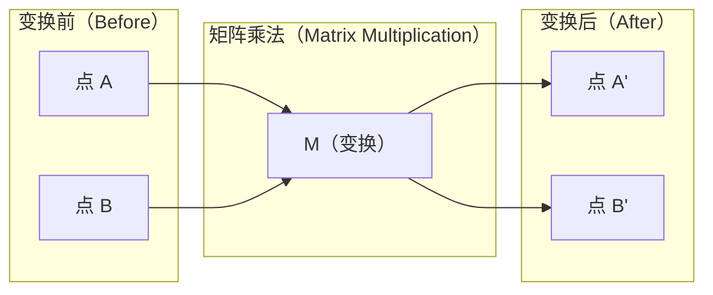
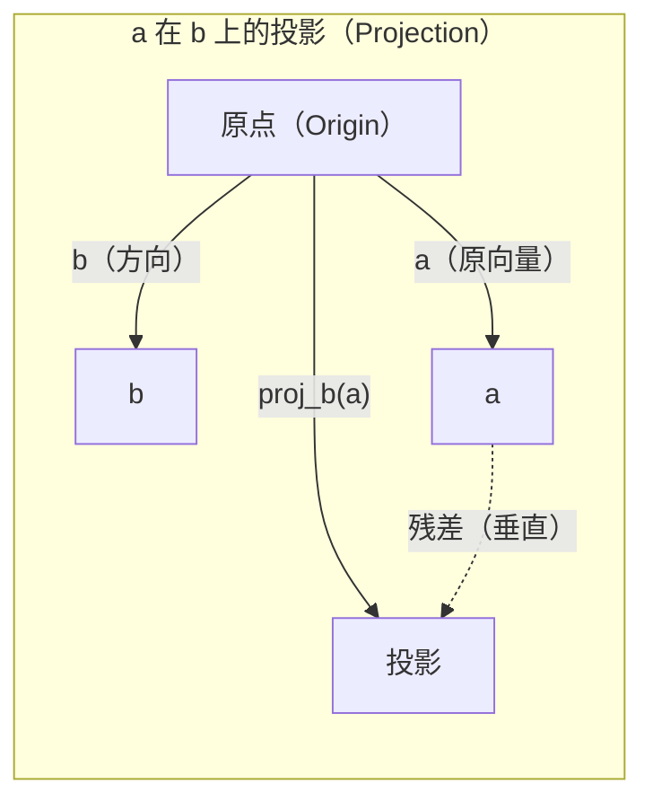

# 线性代数直觉（Linear Algebra Intuition）

> AI 模型看似复杂，其底层离不开矩阵运算。

**Type:** Learn
**Languages:** Python, Julia
**Prerequisites:** 阶段 0
**Time:** ~60 分钟

## 学习目标（Learning Objectives）

- 使用 Python 从零实现向量和矩阵运算，包括加法、点积和矩阵乘法
- 从几何角度解释点积（Dot product）、投影（Projection）和格拉姆–施密特过程（Gram-Schmidt process）的作用
- 通过行化简（Row reduction）判断一组向量的线性无关性（Linear independence）、秩（Rank）和基（Basis）
- 将线性代数概念与嵌入（Embedding）、注意力分数（Attention score）和低秩适配（LoRA）等 AI 应用联系起来

## 问题（The Problem）

随便打开一篇机器学习（ML）论文，第一页通常就会出现向量、矩阵、点积和变换。缺少线性代数直觉时，它们只是符号；有了这种直觉，就能看出神经网络实际在做什么：让点在空间中移动。

你不必成为数学家，但需要理解这些运算的几何含义，再亲手编写实现。

## 核心概念（The Concept）

### 向量表示点，也表示方向（Vectors Are Points (and Directions)）

向量（Vector）本质上是一列数字。不过，这些数字有具体含义：它们是空间中的坐标。

**二维向量 [3, 2]：**

| x | y | 点 |
|---|---|-------|
| 3 | 2 | 向量从原点 (0,0) 指向平面上的 (3, 2) |

该向量的模长为 sqrt(3^2 + 2^2) = sqrt(13)，方向朝右上方。

AI 中几乎什么都可以用向量表示：
- 一个词 → 由 768 个数构成的向量，表示它在嵌入空间（Embedding space）中的“含义”
- 一张图像 → 由数百万个像素值构成的向量
- 一名用户 → 表示其偏好的向量

### 矩阵表示变换（Matrices Are Transformations）

矩阵（Matrix）将一个向量变成另一个向量，可以进行旋转、缩放、拉伸或投影。



在 AI 中，矩阵就是模型的核心表示：
- 神经网络权重 → 将输入变换为输出的矩阵
- 注意力分数 → 决定关注哪些内容的矩阵
- 嵌入 → 将词映射到向量的矩阵

### 点积衡量相似程度（The Dot Product Measures Similarity）

两个向量的点积可以反映它们的相似程度。

```text
a · b = a₁×b₁ + a₂×b₂ + ... + aₙ×bₙ

同向：      a · b > 0  （相似）
垂直：       a · b = 0  （无关）
反向：  a · b < 0  （不相似）
```

搜索引擎、推荐系统和检索增强生成（RAG）正是通过这类操作工作：找到点积较大的向量。

### 线性无关（Linear Independence）

如果一组向量中，没有任何一个向量可以表示成其他向量的线性组合，这组向量就线性无关。若 v1、v2、v3 线性无关，它们张成三维空间；若其中一个可由其他向量组合得到，它们就只能张成一个平面。

这对 AI 的意义在于：特征矩阵的列应当线性无关。如果两个特征完全相关，即线性相关（Linearly dependent），模型就无法区分它们各自的影响。这会在回归中产生多重共线性（Multicollinearity）：权重矩阵变得不稳定，输入的微小变化也可能导致输出大幅波动。

**具体示例：**

```text
v1 = [1, 0, 0]
v2 = [0, 1, 0]
v3 = [2, 1, 0]   # v3 = 2*v1 + v2
```

v1 和 v2 线性无关，任何一个都不是另一个的标量倍数或线性组合。但 v3 = 2*v1 + v2，因此 {v1, v2, v3} 是线性相关的向量组。这三个向量都位于 xy 平面内，无论如何组合，都无法得到 [0, 0, 1]。虽然有三个向量，却只有两个维度的自由度。

在数据集中，如果 feature_3 = 2*feature_1 + feature_2，加入 feature_3 不会给模型增加任何新信息。更糟的是，它会使正规方程（Normal equations）对应的矩阵奇异，从而无法得到唯一的权重解。

### 基与秩（Basis and Rank）

基（Basis）是张成整个空间所需的最小线性无关向量组。基向量的个数就是空间的维度。

三维空间的标准基为 {[1,0,0], [0,1,0], [0,0,1]}。不过，三维空间中任意三个线性无关向量都能构成一组有效的基。选择基，就是选择坐标系。

矩阵的秩 = 线性无关列的数量 = 线性无关行的数量。若 rank < min(rows, cols)，矩阵就是秩亏（Rank-deficient）的。这意味着：
- 方程组有无穷多个解，或无解
- 变换会丢失信息
- 矩阵不可逆

| 情况 | 秩 | 对机器学习的意义 |
|-----------|------|---------------------|
| 满秩（Full rank），rank = min(m, n) | 达到最大可能值 | 存在唯一最小二乘解，模型条件良好。 |
| 秩亏（Rank deficient），rank < min(m, n) | 小于最大值 | 特征冗余，权重解有无穷多个，需要正则化（Regularization）。 |
| 秩为 1 | 1 | 每一列都是同一个向量的缩放副本，所有数据都位于一条直线上。 |
| 接近秩亏，奇异值很小 | 数值意义上的秩较低 | 矩阵病态（Ill-conditioned），微小输入噪声会引起很大的输出变化，应使用奇异值分解（SVD）截断或岭回归（Ridge regression）。 |

### 投影（Projection）

将向量 **a** 投影到向量 **b** 上，得到 **a** 在 **b** 方向上的分量：

```text
proj_b(a) = (a dot b / b dot b) * b
```

残差（Residual）(a - proj_b(a)) 与 b 垂直。这种正交分解（Orthogonal decomposition）是最小二乘拟合（Least-squares fitting）的基础。

投影在机器学习中随处可见：
- 线性回归最小化观测值到列空间（Column space）的距离，求出的解本身就是一次投影
- 主成分分析（PCA）将数据投影到方差最大的方向上
- Transformer 中的注意力计算查询（Query）在键（Key）上的投影



**示例：** a = [3, 4], b = [1, 0]

proj_b(a) = (3*1 + 4*0) / (1*1 + 0*0) * [1, 0] = 3 * [1, 0] = [3, 0]

投影舍弃了 y 方向的分量。这就是最简单的降维（Dimensionality reduction）：丢弃不关心的方向。

### 格拉姆–施密特过程（Gram-Schmidt Process）

该过程将任意一组线性无关向量转换为标准正交基（Orthonormal basis）。标准正交意味着每个向量的长度都是 1，且任意两个向量相互垂直。

算法步骤：
1. 取第一个向量，进行归一化（Normalize）
2. 取第二个向量，减去它在第一个向量上的投影，再归一化
3. 取第三个向量，减去它在此前所有向量上的投影，再归一化
4. 对其余向量重复上述步骤

```text
输入：  v1, v2, v3, ... （线性无关）

u1 = v1 / |v1|

w2 = v2 - (v2 dot u1) * u1
u2 = w2 / |w2|

w3 = v3 - (v3 dot u1) * u1 - (v3 dot u2) * u2
u3 = w3 / |w3|

输出： u1, u2, u3, ... （标准正交基）
```

这也是 QR 分解（QR decomposition）的内部原理。Q 包含标准正交基，R 记录投影系数。QR 分解用于：
- 求解线性方程组，比高斯消元（Gaussian elimination）更稳定
- 计算特征值（Eigenvalue），即 QR 算法
- 最小二乘回归，这是其标准数值方法

```figure
eigen-directions
```

## 动手实现（Build It）

### 步骤 1：从零实现向量（Vectors from scratch，Python）

```python
class Vector:
    def __init__(self, components):
        self.components = list(components)
        self.dim = len(self.components)

    def __add__(self, other):
        return Vector([a + b for a, b in zip(self.components, other.components)])

    def __sub__(self, other):
        return Vector([a - b for a, b in zip(self.components, other.components)])

    def dot(self, other):
        return sum(a * b for a, b in zip(self.components, other.components))

    def magnitude(self):
        return sum(x**2 for x in self.components) ** 0.5

    def normalize(self):
        mag = self.magnitude()
        return Vector([x / mag for x in self.components])

    def cosine_similarity(self, other):
        return self.dot(other) / (self.magnitude() * other.magnitude())

    def __repr__(self):
        return f"Vector({self.components})"


a = Vector([1, 2, 3])
b = Vector([4, 5, 6])

print(f"a + b = {a + b}")
print(f"a · b = {a.dot(b)}")
print(f"|a| = {a.magnitude():.4f}")
print(f"cosine similarity = {a.cosine_similarity(b):.4f}")
```

### 步骤 2：从零实现矩阵（Matrices from scratch，Python）

```python
class Matrix:
    def __init__(self, rows):
        self.rows = [list(row) for row in rows]
        self.shape = (len(self.rows), len(self.rows[0]))

    def __matmul__(self, other):
        if isinstance(other, Vector):
            return Vector([
                sum(self.rows[i][j] * other.components[j] for j in range(self.shape[1]))
                for i in range(self.shape[0])
            ])
        rows = []
        for i in range(self.shape[0]):
            row = []
            for j in range(other.shape[1]):
                row.append(sum(
                    self.rows[i][k] * other.rows[k][j]
                    for k in range(self.shape[1])
                ))
            rows.append(row)
        return Matrix(rows)

    def transpose(self):
        return Matrix([
            [self.rows[j][i] for j in range(self.shape[0])]
            for i in range(self.shape[1])
        ])

    def __repr__(self):
        return f"Matrix({self.rows})"


rotation_90 = Matrix([[0, -1], [1, 0]])
point = Vector([3, 1])

rotated = rotation_90 @ point
print(f"Original: {point}")
print(f"Rotated 90°: {rotated}")
```

### 步骤 3：这些运算为何与 AI 有关（Why this matters for AI）

```python
import random

random.seed(42)
weights = Matrix([[random.gauss(0, 0.1) for _ in range(3)] for _ in range(2)])
input_vector = Vector([1.0, 0.5, -0.3])

output = weights @ input_vector
print(f"Input (3D): {input_vector}")
print(f"Output (2D): {output}")
print("This is what a neural network layer does -- matrix multiplication.")
```

### 步骤 4：Julia 版本（Julia version）

```julia
a = [1.0, 2.0, 3.0]
b = [4.0, 5.0, 6.0]

println("a + b = ", a + b)
println("a · b = ", a ⋅ b)       # Julia supports unicode operators
println("|a| = ", √(a ⋅ a))
println("cosine = ", (a ⋅ b) / (√(a ⋅ a) * √(b ⋅ b)))

# Matrix-vector multiplication
W = [0.1 -0.2 0.3; 0.4 0.5 -0.1]
x = [1.0, 0.5, -0.3]
println("Wx = ", W * x)
println("This is a neural network layer.")
```

### 步骤 5：从零实现线性无关判断与投影（Linear independence and projection from scratch，Python）

```python
def is_linearly_independent(vectors):
    n = len(vectors)
    dim = len(vectors[0].components)
    mat = Matrix([v.components[:] for v in vectors])
    rows = [row[:] for row in mat.rows]
    rank = 0
    for col in range(dim):
        pivot = None
        for row in range(rank, len(rows)):
            if abs(rows[row][col]) > 1e-10:
                pivot = row
                break
        if pivot is None:
            continue
        rows[rank], rows[pivot] = rows[pivot], rows[rank]
        scale = rows[rank][col]
        rows[rank] = [x / scale for x in rows[rank]]
        for row in range(len(rows)):
            if row != rank and abs(rows[row][col]) > 1e-10:
                factor = rows[row][col]
                rows[row] = [rows[row][j] - factor * rows[rank][j] for j in range(dim)]
        rank += 1
    return rank == n


def project(a, b):
    scalar = a.dot(b) / b.dot(b)
    return Vector([scalar * x for x in b.components])


def gram_schmidt(vectors):
    orthonormal = []
    for v in vectors:
        w = v
        for u in orthonormal:
            proj = project(w, u)
            w = w - proj
        if w.magnitude() < 1e-10:
            continue
        orthonormal.append(w.normalize())
    return orthonormal


v1 = Vector([1, 0, 0])
v2 = Vector([1, 1, 0])
v3 = Vector([1, 1, 1])
basis = gram_schmidt([v1, v2, v3])
for i, u in enumerate(basis):
    print(f"u{i+1} = {u}")
    print(f"  |u{i+1}| = {u.magnitude():.6f}")

print(f"u1 · u2 = {basis[0].dot(basis[1]):.6f}")
print(f"u1 · u3 = {basis[0].dot(basis[2]):.6f}")
print(f"u2 · u3 = {basis[1].dot(basis[2]):.6f}")
```

## 实际应用（Use It）

下面用 NumPy 完成相同操作，这才是实践中通常采用的方式：

```python
import numpy as np

a = np.array([1, 2, 3], dtype=float)
b = np.array([4, 5, 6], dtype=float)

print(f"a + b = {a + b}")
print(f"a · b = {np.dot(a, b)}")
print(f"|a| = {np.linalg.norm(a):.4f}")
print(f"cosine = {np.dot(a, b) / (np.linalg.norm(a) * np.linalg.norm(b)):.4f}")

W = np.random.randn(2, 3) * 0.1
x = np.array([1.0, 0.5, -0.3])
print(f"Wx = {W @ x}")
```

### 使用 NumPy 计算秩、投影和 QR 分解（Rank, Projection, and QR with NumPy）

```python
import numpy as np

A = np.array([[1, 2], [2, 4]])
print(f"Rank: {np.linalg.matrix_rank(A)}")

a = np.array([3, 4])
b = np.array([1, 0])
proj = (np.dot(a, b) / np.dot(b, b)) * b
print(f"Projection of {a} onto {b}: {proj}")

Q, R = np.linalg.qr(np.random.randn(3, 3))
print(f"Q is orthogonal: {np.allclose(Q @ Q.T, np.eye(3))}")
print(f"R is upper triangular: {np.allclose(R, np.triu(R))}")
```

### PyTorch：张量支持自动微分（Tensors Are Vectors with Autodiff）

```python
import torch

x = torch.randn(3, requires_grad=True)
y = torch.tensor([1.0, 0.0, 0.0])

similarity = torch.dot(x, y)
similarity.backward()

print(f"x = {x.data}")
print(f"y = {y.data}")
print(f"dot product = {similarity.item():.4f}")
print(f"d(dot)/dx = {x.grad}")
```

点积对 x 的梯度就是 y，PyTorch 自动计算出了这个结果。神经网络中的所有操作都建立在这类运算之上，包括矩阵乘法、点积和投影；自动微分（Autodiff）会沿这些运算跟踪梯度。

你刚刚从零实现了 NumPy 一行代码就能完成的工作，现在也理解了这行代码背后的机制。

## 交付成果（Ship It）

本课产出：
- `outputs/prompt-linear-algebra-tutor.md`：供 AI 助手使用的提示词，通过几何直觉讲授线性代数

## 概念关联（Connections）

本课的每个概念都能对应到现代 AI 的具体环节：

| 概念 | 应用位置 |
|---------|------------------|
| 点积（Dot product） | Transformer 中的注意力分数、RAG 中的余弦相似度（Cosine similarity） |
| 矩阵乘法（Matrix multiply） | 每一层神经网络、每一次线性变换 |
| 线性无关（Linear independence） | 特征选择、避免多重共线性 |
| 秩（Rank） | 判断系统是否可解、低秩适配（Low-Rank Adaptation，LoRA） |
| 投影（Projection） | 线性回归中向列空间投影、PCA |
| 格拉姆–施密特 / QR（Gram-Schmidt / QR） | 数值求解器、特征值计算 |
| 标准正交基（Orthonormal basis） | 稳定的数值计算、白化变换（Whitening transform） |

LoRA 尤其值得一提。它将权重更新分解为低秩矩阵，从而微调大语言模型。LoRA 不直接更新一个 4096x4096 的权重矩阵，即 16M 个参数，而是更新大小分别为 4096x16 和 16x4096 的两个矩阵，共 131K 个参数。秩为 16 的约束意味着，LoRA 假设权重更新位于完整 4096 维空间的一个 16 维子空间中。这就是线性代数在实际系统中的作用。

## 练习（Exercises）

1. 实现 `Vector.angle_between(other)`，返回两个向量之间的夹角，单位为度
2. 创建二维缩放矩阵，使 x 坐标变为两倍、y 坐标变为三倍，再将其作用于向量 [1, 1]
3. 给定 5 个类似词向量的随机向量，维度为 50，用余弦相似度找出最相似的两个
4. 验证格拉姆–施密特过程的输出确实标准正交：任意两个向量的点积为 0，每个向量的模长为 1
5. 创建一个秩为 2 的 3x3 矩阵，并用 `rank()` 方法验证，然后解释其列向量张成什么几何对象
6. 将向量 [1, 2, 3] 投影到 [1, 1, 1] 上，结果在几何上代表什么？

## 关键术语（Key Terms）

| 术语 | 常见说法 | 准确含义 |
|------|----------------|----------------------|
| 向量（Vector） | “一支箭头” | 表示 n 维空间中的点或方向的一列数字 |
| 矩阵（Matrix） | “一张数字表” | 将向量从一个空间映射到另一个空间的变换 |
| 点积（Dot product） | “相乘再相加” | 衡量两个向量方向一致程度的量，是相似性搜索的核心 |
| 嵌入（Embedding） | “某种 AI 魔法” | 表示词、图像或用户等对象含义的向量 |
| 线性无关（Linear independence） | “它们不重叠” | 向量组中没有任何一个向量可由其他向量线性组合得到 |
| 秩（Rank） | “有多少个维度” | 矩阵中线性无关列或行的数量 |
| 投影（Projection） | “影子” | 一个向量在另一个向量方向上的分量 |
| 基（Basis） | “坐标轴” | 张成空间所需的最小线性无关向量组 |
| 标准正交（Orthonormal） | “相互垂直的单位向量” | 向量两两垂直，且每个向量的长度均为 1 |
