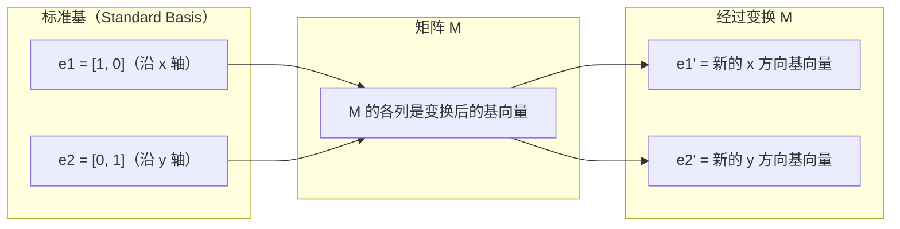
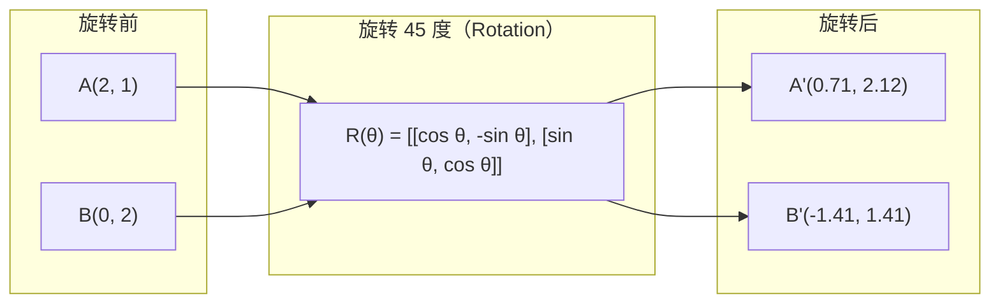
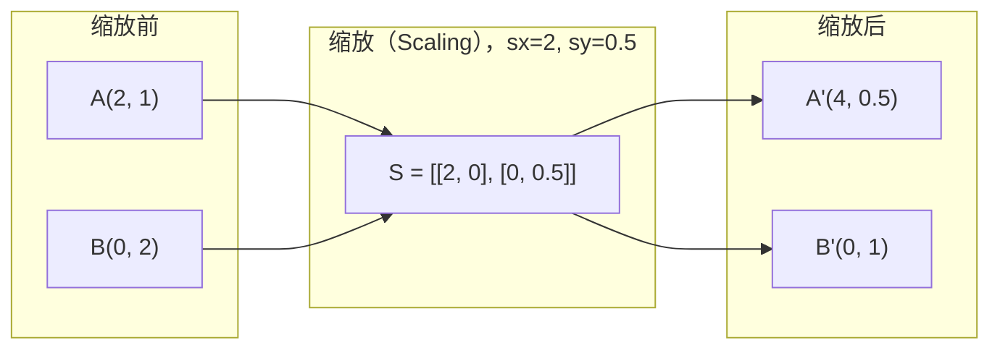
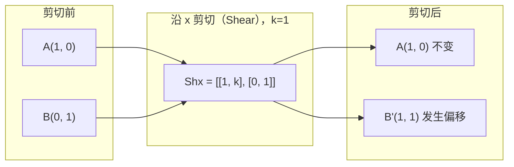
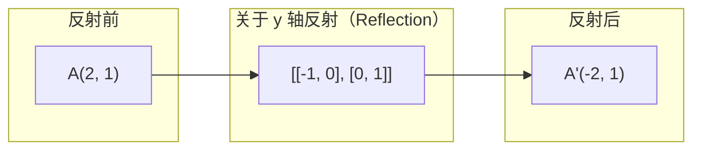
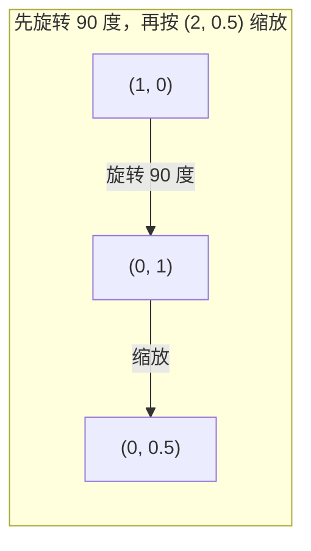
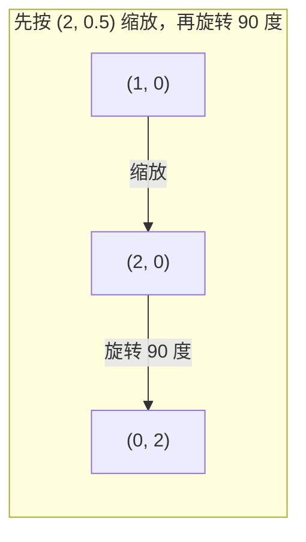

# 矩阵变换（Matrix Transformations）

> 矩阵就像一台重塑空间的机器。理解它如何作用于每个点，也就理解了整个变换。

**Type:** Build
**Languages:** Python, Julia
**Prerequisites:** 阶段 1，第 01–02 课（线性代数直觉、向量与矩阵运算）
**Time:** ~75 分钟

## 学习目标（Learning Objectives）

- 构造旋转（Rotation）、缩放（Scaling）、剪切（Shearing）和反射（Reflection）矩阵，并将其应用于二维、三维点
- 通过矩阵乘法复合多个变换，并验证顺序会影响结果
- 从特征方程（Characteristic equation）求出 2x2 矩阵的特征值（Eigenvalue）和特征向量（Eigenvector）
- 解释特征值为何能决定主成分分析（PCA）的方向、循环神经网络（RNN）的稳定性和谱聚类（Spectral clustering）的行为

## 问题（The Problem）

读到 PCA 时，你会看到“求协方差矩阵的特征向量”；读到模型稳定性时，会看到“检查所有特征值的模是否小于 1”；读到数据增强时，会看到“应用随机旋转”。若不理解矩阵在几何上如何作用于空间，这些说法就很难理解。

矩阵不只是一张数字表，而是操作空间的工具。旋转矩阵让点转动，缩放矩阵拉伸点的位置，剪切矩阵则使其倾斜。神经网络作用于数据的每次变换，都可以看作其中某种操作或它们的复合。本课将把这些操作讲具体。

## 核心概念（The Concept）

### 用矩阵表示变换（Transformations as matrices）

二维空间中的每个线性变换都可以写成 2x2 矩阵。矩阵明确告诉你，基向量 [1, 0] 和 [0, 1] 最终移到哪里，其他点的变化由此确定。



### 旋转（Rotation）

在二维空间中旋转 theta 角度，会保持距离与角度不变，使每个点沿圆弧移动。



三维旋转围绕某条轴进行，每条轴都有对应的旋转矩阵：

```text
Rz(theta) = | cos  -sin  0 |     绕 z 轴旋转
            | sin   cos  0 |     （x-y 平面旋转，z 不变）
            |  0     0   1 |

Rx(theta) = | 1   0     0    |   绕 x 轴旋转
            | 0  cos  -sin   |   （y-z 平面旋转，x 不变）
            | 0  sin   cos   |

Ry(theta) = |  cos  0  sin |     绕 y 轴旋转
            |   0   1   0  |     （x-z 平面旋转，y 不变）
            | -sin  0  cos |
```

### 缩放（Scaling）

缩放沿每条坐标轴分别拉伸或压缩。



### 剪切（Shearing）

剪切使一条坐标轴倾斜，另一条保持不变，将矩形变为平行四边形。



剪切矩阵：
- `Shx = [[1, k], [0, 1]]` 使 x 偏移 k * y
- `Shy = [[1, 0], [k, 1]]` 使 y 偏移 k * x

### 反射（Reflection）

反射将点关于某条坐标轴或直线作镜像。



反射矩阵：
- 关于 y 轴反射：`[[-1, 0], [0, 1]]`
- 关于 x 轴反射：`[[1, 0], [0, -1]]`

### 复合：串联多个变换（Composition: chaining transformations）

先应用变换 A，再应用 B，等价于将它们的矩阵相乘：`result = B @ A @ point`。顺序很重要，先旋转再缩放，与先缩放再旋转的结果不同。



复合矩阵：`S @ R = [[0, -2], [0.5, 0]]`



复合矩阵：`R @ S = [[0, -0.5], [2, 0]]`

结果不同，因为矩阵乘法不满足交换律（Commutativity）。

### 特征值与特征向量（Eigenvalues and eigenvectors）

大多数向量经过矩阵变换后会改变方向。特征向量则不同：矩阵只对其缩放，不使其旋转。缩放因子就是特征值。

```text
A @ v = lambda * v

v 是特征向量（变换后保留的方向）
lambda 是特征值（缩放倍数）

示例：A = | 2  1 |
             | 1  2 |

特征向量 [1, 1]，对应特征值 3：
  A @ [1,1] = [3, 3] = 3 * [1, 1]     （方向相同，放大 3 倍）

特征向量 [1, -1]，对应特征值 1：
  A @ [1,-1] = [1, -1] = 1 * [1, -1]  （方向相同，保持不变）
```

矩阵沿 [1, 1] 方向将空间拉伸为 3 倍，沿 [1, -1] 方向则保持不变。其他方向都是这两个方向的组合。

### 特征分解（Eigendecomposition）

如果矩阵具有 n 个线性无关特征向量，就可以进行如下分解：

```text
A = V @ D @ V^(-1)

V = 各列为特征向量的矩阵
D = 由特征值组成的对角矩阵
V^(-1) = V 的逆矩阵

含义：旋转到特征向量坐标系，沿各轴缩放，再旋转回来。
```

### 为什么特征值很重要（Why eigenvalues matter）

**主成分分析（PCA）。** 协方差矩阵（Covariance matrix）的特征向量就是主成分（Principal component），特征值则表示各主成分包含多少方差。按特征值排序，保留前 k 个，就完成了降维（Dimensionality reduction）。

**稳定性（Stability）。** 在循环网络和动力系统（Dynamical system）中，模大于 1 的特征值会使输出爆炸，模小于 1 则会使输出趋于消失。这用一句话概括了梯度消失与梯度爆炸（Vanishing / exploding gradient）问题。

**谱方法（Spectral methods）。** 图神经网络（Graph neural network）使用邻接矩阵（Adjacency matrix）的特征值，谱聚类使用拉普拉斯矩阵（Laplacian）的特征值。特征向量揭示了图的结构。

### 行列式作为体积缩放因子（Determinant as volume scaling factor）

变换矩阵的行列式（Determinant）表示它对二维面积或三维体积的缩放程度。

```text
det = 1:   面积保持不变（旋转）
det = 2:   面积变为两倍
det = 0:   空间压缩到更低维度（奇异）
det = -1:  面积不变，但定向翻转（反射）

| det(Rotation) | = 1        （始终如此）
| det(Scale sx, sy) | = sx * sy
| det(Shear) | = 1           （面积不变）
| det(Reflection) | = -1     （定向翻转）
```

```figure
matrix-transform
```

## 动手实现（Build It）

### 步骤 1：从零实现变换矩阵（Transformation matrices from scratch，Python）

```python
import math

def rotation_2d(theta):
    c, s = math.cos(theta), math.sin(theta)
    return [[c, -s], [s, c]]

def scaling_2d(sx, sy):
    return [[sx, 0], [0, sy]]

def shearing_2d(kx, ky):
    return [[1, kx], [ky, 1]]

def reflection_x():
    return [[1, 0], [0, -1]]

def reflection_y():
    return [[-1, 0], [0, 1]]

def mat_vec_mul(matrix, vector):
    return [
        sum(matrix[i][j] * vector[j] for j in range(len(vector)))
        for i in range(len(matrix))
    ]

def mat_mul(a, b):
    rows_a, cols_b = len(a), len(b[0])
    cols_a = len(a[0])
    return [
        [sum(a[i][k] * b[k][j] for k in range(cols_a)) for j in range(cols_b)]
        for i in range(rows_a)
    ]

point = [1.0, 0.0]
angle = math.pi / 4

rotated = mat_vec_mul(rotation_2d(angle), point)
print(f"Rotate (1,0) by 45 deg: ({rotated[0]:.4f}, {rotated[1]:.4f})")

scaled = mat_vec_mul(scaling_2d(2, 3), [1.0, 1.0])
print(f"Scale (1,1) by (2,3): ({scaled[0]:.1f}, {scaled[1]:.1f})")

sheared = mat_vec_mul(shearing_2d(1, 0), [1.0, 1.0])
print(f"Shear (1,1) kx=1: ({sheared[0]:.1f}, {sheared[1]:.1f})")

reflected = mat_vec_mul(reflection_y(), [2.0, 1.0])
print(f"Reflect (2,1) across y: ({reflected[0]:.1f}, {reflected[1]:.1f})")
```

### 步骤 2：变换的复合（Composition of transformations）

```python
R = rotation_2d(math.pi / 2)
S = scaling_2d(2, 0.5)

rotate_then_scale = mat_mul(S, R)
scale_then_rotate = mat_mul(R, S)

point = [1.0, 0.0]
result1 = mat_vec_mul(rotate_then_scale, point)
result2 = mat_vec_mul(scale_then_rotate, point)

print(f"Rotate 90 then scale: ({result1[0]:.2f}, {result1[1]:.2f})")
print(f"Scale then rotate 90: ({result2[0]:.2f}, {result2[1]:.2f})")
print(f"Same? {result1 == result2}")
```

### 步骤 3：从零计算特征值（Eigenvalues from scratch，2x2）

对于 2x2 矩阵 `[[a, b], [c, d]]`，特征值是特征方程 `lambda^2 - (a+d)*lambda + (ad - bc) = 0` 的解。

```python
def eigenvalues_2x2(matrix):
    a, b = matrix[0]
    c, d = matrix[1]
    trace = a + d
    det = a * d - b * c
    discriminant = trace ** 2 - 4 * det
    if discriminant < 0:
        real = trace / 2
        imag = (-discriminant) ** 0.5 / 2
        return (complex(real, imag), complex(real, -imag))
    sqrt_disc = discriminant ** 0.5
    return ((trace + sqrt_disc) / 2, (trace - sqrt_disc) / 2)

def eigenvector_2x2(matrix, eigenvalue):
    a, b = matrix[0]
    c, d = matrix[1]
    if abs(b) > 1e-10:
        v = [b, eigenvalue - a]
    elif abs(c) > 1e-10:
        v = [eigenvalue - d, c]
    else:
        if abs(a - eigenvalue) < 1e-10:
            v = [1, 0]
        else:
            v = [0, 1]
    mag = (v[0] ** 2 + v[1] ** 2) ** 0.5
    return [v[0] / mag, v[1] / mag]

A = [[2, 1], [1, 2]]
vals = eigenvalues_2x2(A)
print(f"Matrix: {A}")
print(f"Eigenvalues: {vals[0]:.4f}, {vals[1]:.4f}")

for val in vals:
    vec = eigenvector_2x2(A, val)
    result = mat_vec_mul(A, vec)
    scaled = [val * vec[0], val * vec[1]]
    print(f"  lambda={val:.1f}, v={[round(x,4) for x in vec]}")
    print(f"    A@v = {[round(x,4) for x in result]}")
    print(f"    l*v = {[round(x,4) for x in scaled]}")
```

### 步骤 4：行列式作为体积缩放因子（Determinant as volume scaling factor）

```python
def det_2x2(matrix):
    return matrix[0][0] * matrix[1][1] - matrix[0][1] * matrix[1][0]

print(f"det(rotation 45) = {det_2x2(rotation_2d(math.pi/4)):.4f}")
print(f"det(scale 2,3)   = {det_2x2(scaling_2d(2, 3)):.1f}")
print(f"det(shear kx=1)  = {det_2x2(shearing_2d(1, 0)):.1f}")
print(f"det(reflect y)   = {det_2x2(reflection_y()):.1f}")

singular = [[1, 2], [2, 4]]
print(f"det(singular)     = {det_2x2(singular):.1f}")
print("Singular: columns are proportional, space collapses to a line.")
```

## 实际应用（Use It）

NumPy 通过优化过的例程完成上述全部操作。

```python
import numpy as np

theta = np.pi / 4
R = np.array([[np.cos(theta), -np.sin(theta)],
              [np.sin(theta),  np.cos(theta)]])

point = np.array([1.0, 0.0])
print(f"Rotate (1,0) by 45 deg: {R @ point}")

S = np.diag([2.0, 3.0])
composed = S @ R
print(f"Scale(2,3) after Rotate(45): {composed @ point}")

A = np.array([[2, 1], [1, 2]], dtype=float)
eigenvalues, eigenvectors = np.linalg.eig(A)
print(f"\nEigenvalues: {eigenvalues}")
print(f"Eigenvectors (columns):\n{eigenvectors}")

for i in range(len(eigenvalues)):
    v = eigenvectors[:, i]
    lam = eigenvalues[i]
    print(f"  A @ v{i} = {A @ v}, lambda * v{i} = {lam * v}")

print(f"\ndet(R) = {np.linalg.det(R):.4f}")
print(f"det(S) = {np.linalg.det(S):.1f}")

B = np.array([[3, 1], [0, 2]], dtype=float)
vals, vecs = np.linalg.eig(B)
D = np.diag(vals)
V = vecs
reconstructed = V @ D @ np.linalg.inv(V)
print(f"\nEigendecomposition A = V @ D @ V^-1:")
print(f"Original:\n{B}")
print(f"Reconstructed:\n{reconstructed}")
```

### 使用 NumPy 进行三维旋转（3D rotations with NumPy）

```python
def rotation_3d_z(theta):
    c, s = np.cos(theta), np.sin(theta)
    return np.array([[c, -s, 0], [s, c, 0], [0, 0, 1]])

def rotation_3d_x(theta):
    c, s = np.cos(theta), np.sin(theta)
    return np.array([[1, 0, 0], [0, c, -s], [0, s, c]])

point_3d = np.array([1.0, 0.0, 0.0])
rotated_z = rotation_3d_z(np.pi / 2) @ point_3d
rotated_x = rotation_3d_x(np.pi / 2) @ point_3d

print(f"\n3D point: {point_3d}")
print(f"Rotate 90 around z: {np.round(rotated_z, 4)}")
print(f"Rotate 90 around x: {np.round(rotated_x, 4)}")
```

## 交付成果（Ship It）

本课为阶段 2 的 PCA 和神经网络权重分析建立几何基础。这里实现的特征值、特征向量算法，也用于生产机器学习系统中的降维、谱聚类和稳定性分析。

## 练习（Exercises）

1. 对单位正方形应用旋转、缩放和剪切，四个顶点分别为 [0,0]、[1,0]、[1,1]、[0,1]。打印每种变换后的顶点，并验证旋转保持顶点间距离不变。

2. 使用特征方程手算矩阵 [[4, 2], [1, 3]] 的特征值，再用从零实现的函数和 NumPy 验证。

3. 复合三个变换：旋转 30 度、按 [1.5, 0.8] 缩放、以 kx=0.3 剪切。将复合变换应用于沿圆周排列的 8 个点，打印变换前后的坐标。计算复合矩阵的行列式，验证其等于各矩阵行列式的乘积。

## 关键术语（Key Terms）

| 术语 | 常见说法 | 准确含义 |
|------|----------------|----------------------|
| 旋转矩阵（Rotation matrix） | “把东西转动” | 使点沿圆弧移动、保持距离与角度不变的正交矩阵，行列式始终为 1。 |
| 缩放矩阵（Scaling matrix） | “把东西放大” | 沿各轴独立拉伸或压缩的对角矩阵，行列式等于缩放因子的乘积。 |
| 剪切矩阵（Shearing matrix） | “让东西倾斜” | 让一个坐标按另一个坐标成比例偏移，使矩形变为平行四边形的矩阵，行列式为 1。 |
| 反射（Reflection） | “镜像翻转” | 将空间关于某条轴或某个平面翻转的矩阵，行列式为 -1。 |
| 复合（Composition） | “做两件事” | 通过变换矩阵相乘串联操作，顺序重要：B @ A 表示先应用 A，再应用 B。 |
| 特征向量（Eigenvector） | “特殊方向” | 矩阵只会缩放、不使其旋转的方向，体现变换的特征。 |
| 特征值（Eigenvalue） | “拉伸多少” | 矩阵缩放其特征向量的标量因子，可以为负数（翻转）或复数（旋转）。 |
| 特征分解（Eigendecomposition） | “拆开矩阵” | 将矩阵写成 V @ D @ V^(-1)，分离其基本缩放方向与缩放量。 |
| 行列式（Determinant） | “矩阵算出的一个数” | 变换对二维面积或三维体积的缩放因子，为零表示变换不可逆。 |
| 特征方程（Characteristic equation） | “特征值从哪里来” | det(A - lambda * I) = 0，其多项式的根就是特征值。 |

## 延伸阅读（Further Reading）

- [3Blue1Brown：线性变换（Linear Transformations）](https://www.3blue1brown.com/lessons/linear-transformations)：直观展示矩阵如何重塑空间
- [3Blue1Brown：特征向量与特征值（Eigenvectors and Eigenvalues）](https://www.3blue1brown.com/lessons/eigenvalues)：通过图像解释特征向量的几何含义
- [MIT 18.06 第 21 讲：特征值与特征向量（Eigenvalues and Eigenvectors）](https://ocw.mit.edu/courses/18-06-linear-algebra-spring-2010/)：Gilbert Strang 的经典讲解
