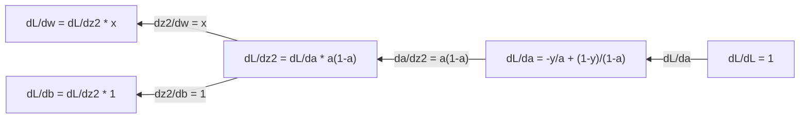
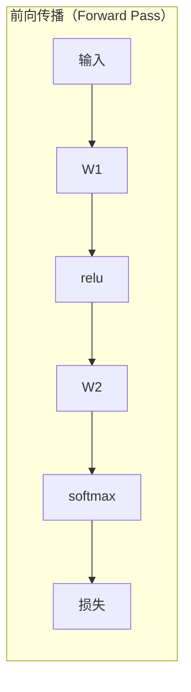
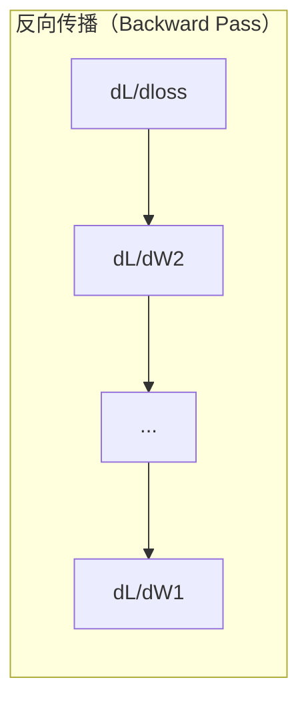

# 面向机器学习的微积分（Calculus for Machine Learning）

> 导数指出下坡方向，神经网络便能据此学习。

**Type:** Learn
**Language:** Python
**Prerequisites:** 阶段 1，第 01–03 课
**Time:** ~60 分钟

## 学习目标（Learning Objectives）

- 计算常见机器学习函数的数值导数（Numerical derivative）与解析导数（Analytical derivative），包括 x^2、Sigmoid 和交叉熵
- 从零实现梯度下降（Gradient descent），最小化一维、二维损失函数
- 推导线性回归模型的梯度，通过手动更新权重训练模型
- 解释海森矩阵（Hessian matrix）、泰勒级数近似（Taylor series approximation）及其与优化方法的联系

## 问题（The Problem）

一个神经网络可能有数百万个权重，每个权重都像一个调节旋钮。你需要判断每个旋钮该往哪个方向转，才能让模型少错一点。微积分给出了这个方向。

没有微积分，训练神经网络就只能随机尝试修改并期待好结果。有了导数，就能知道每个权重如何影响误差，让每次调节都有方向依据。

## 核心概念（The Concept）

### 什么是导数（What is a derivative?）

导数（Derivative）衡量变化率。对于函数 y = f(x)，导数 f'(x) 告诉你：将 x 改变一点点，y 会变化多少？

从几何上看，导数就是曲线在某点处切线（Tangent line）的斜率。

**f(x) = x^2：**

| x | f(x) | f'(x)，斜率 |
|---|------|---------------|
| 0 | 0 | 0，切线水平，位于底部 |
| 1 | 1 | 2 |
| 2 | 4 | 4，该点的切线斜率 |
| 3 | 9 | 6 |

x=2 时，斜率为 4。如果 x 向右移动一点，y 大约增加该位移量的 4 倍。x=0 时斜率为 0，此时位于碗状曲线的底部。

形式化定义：

```text
f'(x) = lim   f(x + h) - f(x)
        h->0  -----------------
                     h
```

在代码中，不直接计算极限，而是使用很小的 h，这就是数值导数。

### 偏导数：每次只改变一个变量（Partial derivatives: one variable at a time）

实际函数往往有多个输入，神经网络的损失依赖数千个权重。偏导数（Partial derivative）将其他变量固定，仅对其中一个变量求导。

```text
f(x, y) = x^2 + 3xy + y^2

df/dx = 2x + 3y     （将 y 视为常数）
df/dy = 3x + 2y     （将 x 视为常数）
```

每个偏导数都回答：只改变这一个权重时，损失会如何变化？

### 梯度：所有偏导数组成的向量（The gradient: vector of all partial derivatives）

梯度（Gradient）将所有偏导数组合成一个向量。对于 f(x, y, z)，梯度为：

```text
grad f = [ df/dx, df/dy, df/dz ]
```

梯度指向函数上升最快的方向。要最小化函数，就朝相反方向走。

**f(x,y) = x^2 + y^2 的等高线图（Contour plot）：**

该函数形成碗状曲面，等高线是一组同心圆，最小值位于 (0, 0)。

| 点 | grad f | -grad f，下降方向 |
|-------|--------|----------------------------|
| (1, 1) | [2, 2]，指向上坡，远离最小值 | [-2, -2]，指向下坡，靠近最小值 |
| (0, 0) | [0, 0]，梯度为零，位于最小值 | [0, 0] |

这就是梯度下降的直观图景：计算梯度，取反，再迈一步。

### 与优化的联系（The connection to optimization）

训练神经网络就是一个优化（Optimization）问题。损失函数（Loss function）L(w1, w2, ..., wn) 衡量模型错得有多严重，目标是将它最小化。

```text
梯度下降更新规则：

  w_new = w_old - learning_rate * dL/dw

对每个权重：
  1. 计算损失对该权重的偏导数
  2. 从权重中减去偏导数乘以一个较小系数的值
  3. 重复
```

学习率（Learning rate）控制步长。太大容易越过目标，太小则进展缓慢。

**损失地形（Loss landscape）的一维切片：**

随着权重 w 变化，损失函数 L(w) 形成有峰有谷的曲线。

| 特征 | 说明 |
|---------|-------------|
| 全局最小值（Global minimum） | 整条曲线的最低点，即最佳解 |
| 局部最小值（Local minimum） | 比周围低，但不是全局最低的谷底 |
| 斜率（Slope） | 梯度下降从初始点沿斜率指示的下坡方向前进 |

梯度下降沿斜率下坡，可能停在局部最小值。不过，在数百万权重构成的高维空间中，这通常不是实际工作的主要问题。

### 数值导数与解析导数（Numerical vs analytical derivatives）

计算导数有两种方式。

解析求导：手动应用微积分规则。例如 f(x) = x^2 的导数是 f'(x) = 2x，结果精确，计算快。

数值求导：利用定义近似导数。取很小的 h，计算 f(x+h) 和 f(x-h)，再求差值。

```text
数值方法（中心差分）：

f'(x) ~= f(x + h) - f(x - h)
          -----------------------
                  2h

实践中 h = 0.0001 通常效果不错
```

数值导数较慢，但适用于任意函数；解析导数计算快，却需要推导公式。神经网络框架采用第三种方式：自动微分（Automatic differentiation），按机械规则计算精确导数。阶段 3 将介绍它。

### 手算简单函数的导数（Derivatives by hand for simple functions）

以下导数会在机器学习中反复出现。

```text
函数            导数             应用位置
--------        ----------       -------
f(x) = x^2     f'(x) = 2x      损失函数（MSE）
f(x) = wx + b  f'(w) = x        线性层，对权重的梯度
                f'(b) = 1        线性层，对偏置的梯度
                f'(x) = w        线性层，对输入的梯度
f(x) = e^x     f'(x) = e^x     Softmax、注意力
f(x) = ln(x)   f'(x) = 1/x     交叉熵损失（Cross-entropy loss）
f(x) = 1/(1+e^-x)  f'(x) = f(x)(1-f(x))   Sigmoid 激活函数
```

对于 f(x) = x^2：

```text
f(x) = x^2    f'(x) = 2x

  x    f(x)   f'(x)   含义
  -2    4      -4      斜率为负，函数递减
  -1    1      -2      斜率为负，函数递减
   0    0       0      斜率为零，处于最小值
   1    1       2      斜率为正，函数递增
   2    4       4      斜率为正，函数递增
```

对于 f(w) = wx + b，令 x=3、b=1：

```text
f(w) = 3w + 1    f'(w) = 3

对 w 的导数就是 x。
x 较大时，w 的小幅变化会引起输出的较大变化。
```

### 链式法则（The chain rule）

函数复合时，链式法则（Chain rule）告诉我们如何求导。

```text
若 y = f(g(x))，则 dy/dx = f'(g(x)) * g'(x)

示例： y = (3x + 1)^2
  外层： f(u) = u^2       f'(u) = 2u
  内层： g(x) = 3x + 1    g'(x) = 3
  dy/dx = 2(3x + 1) * 3 = 6(3x + 1)
```

神经网络是一串函数：输入 -> 线性层 -> 激活函数 -> 线性层 -> 激活函数 -> 损失。反向传播（Backpropagation）就是从输出到输入反复应用链式法则，这便是整个算法的核心。

### 海森矩阵（The Hessian Matrix）

梯度告诉你斜率，海森矩阵则告诉你曲率（Curvature）。

海森矩阵由二阶偏导数组成。对于函数 f(x1, x2, ..., xn)，其第 (i, j) 个元素为：

```text
H[i][j] = d^2f / (dx_i * dx_j)
```

对于二元函数 f(x, y)：

```text
H = | d^2f/dx^2    d^2f/dxdy |
    | d^2f/dydx    d^2f/dy^2 |
```

**在驻点（Critical point），即梯度为 0 的位置，海森矩阵可以告诉你：**

| 海森矩阵性质 | 含义 | 曲面示例 |
|-----------------|---------|-----------------|
| 正定（Positive definite），所有特征值 > 0 | 局部最小值 | 开口向上的碗 |
| 负定（Negative definite），所有特征值 < 0 | 局部最大值 | 开口向下的碗 |
| 不定（Indefinite），特征值有正有负 | 鞍点（Saddle point） | 马鞍形曲面 |

**示例：** f(x, y) = x^2 - y^2，是一个鞍形函数。

```text
df/dx = 2x       df/dy = -2y
d^2f/dx^2 = 2    d^2f/dy^2 = -2    d^2f/dxdy = 0

H = | 2   0 |
    | 0  -2 |

特征值：2 和 -2，一正一负
--> (0, 0) 是鞍点
```

对比碗状函数 f(x, y) = x^2 + y^2：

```text
H = | 2  0 |
    | 0  2 |

特征值：2 和 2，均为正
--> (0, 0) 是局部最小值点
```

**海森矩阵为何对机器学习重要：**

牛顿法（Newton's method）利用海森矩阵选择比梯度下降更合适的优化步长。它不仅看斜率，还考虑曲率：

```text
牛顿法更新：    w_new = w_old - H^(-1) * gradient
梯度下降：   w_new = w_old - lr * gradient
```

牛顿法收敛更快，因为海森矩阵会对梯度“重新缩放”：陡峭方向的步子较小，平缓方向的步子较大。

代价在于：对于含 N 个参数的神经网络，海森矩阵的大小为 N x N。100 万参数的模型需要一个包含 1 万亿个元素的矩阵，因此必须使用近似方法。

| 方法 | 使用的信息 | 成本 | 收敛速度 |
|--------|-------------|------|-------------|
| 梯度下降（Gradient descent） | 仅一阶导数 | 每步 O(N) | 慢，线性收敛 |
| 牛顿法（Newton's method） | 完整海森矩阵 | 每步 O(N^3) | 快，二次收敛 |
| L-BFGS | 利用梯度历史近似海森矩阵 | 每步 O(N) | 中等，超线性收敛 |
| Adam | 逐参数自适应学习率，近似对角海森矩阵 | 每步 O(N) | 中等 |
| 自然梯度（Natural gradient） | 费舍尔信息矩阵（Fisher information matrix），统计意义上的海森矩阵 | 每步 O(N^2) | 快 |

实践中，Adam 是深度学习的默认优化器。它跟踪各参数梯度的移动均值与方差，以较低成本近似二阶信息。

### 泰勒级数近似（Taylor Series Approximation）

任意光滑函数都可以在局部用多项式近似：

```text
f(x + h) = f(x) + f'(x)*h + (1/2)*f''(x)*h^2 + (1/6)*f'''(x)*h^3 + ...
```

保留的项越多，近似通常越好，但这只适用于点 x 附近。

**泰勒级数为何对机器学习重要：**

- **一阶泰勒近似对应梯度下降。** 使用 f(x + h) ~ f(x) + f'(x)*h 时，是在做线性近似。梯度下降通过最小化这个线性模型，选择 h = -lr * f'(x)。

- **二阶泰勒近似对应牛顿法。** 使用 f(x + h) ~ f(x) + f'(x)*h + (1/2)*f''(x)*h^2，可得到二次模型。最小化该模型得到 h = -f'(x)/f''(x)，即牛顿步（Newton's step）。

- **损失函数设计。** 均方误差（MSE）和交叉熵（Cross-entropy）是光滑的，因此泰勒展开的性质良好。这并非巧合：光滑损失使优化过程更可预测。

```text
近似阶数               描述的信息          优化方法
-------------------    -----------------   -------------------
零阶（常数）           只有函数值          随机搜索
一阶（线性）           斜率                梯度下降
二阶（二次）           曲率                牛顿法
更高阶                 更细致的结构        机器学习中很少使用
```

关键认识是：所有基于梯度的优化，实际上都在局部近似损失函数，再向该近似的最小值迈进。

### 机器学习中的积分（Integrals in ML）

导数给出变化率，积分（Integral）则计算累积量，也就是曲线下的面积。

机器学习中很少手算积分，但相关概念随处可见：

**概率（Probability）。** 对概率密度为 p(x) 的连续随机变量：
```text
P(a < X < b) = integral from a to b of p(x) dx
```
概率密度曲线在 a 与 b 之间的面积，就是变量落入该区间的概率。

**期望值（Expected value）。** 按概率加权的平均结果：
```text
E[f(X)] = integral of f(x) * p(x) dx
```
数据分布上的期望损失是一个积分。训练最小化的是它的经验近似。

**KL 散度（KL divergence）。** 衡量两个分布的差异：
```text
KL(p || q) = integral of p(x) * log(p(x) / q(x)) dx
```
用于变分自编码器（VAE）、知识蒸馏（Knowledge distillation）和贝叶斯推断（Bayesian inference）。

**归一化常数（Normalization constants）。** 贝叶斯推断中：
```text
p(w | data) = p(data | w) * p(w) / integral of p(data | w) * p(w) dw
```
分母是对所有可能参数值的积分。它往往难以直接求解，因此会使用马尔可夫链蒙特卡洛（MCMC）和变分推断（Variational inference）等近似方法。

| 积分概念 | 机器学习中的应用 |
|-----------------|----------------------|
| 曲线下面积 | 根据密度函数计算概率 |
| 期望值 | 损失函数、风险最小化（Risk minimization） |
| KL 散度 | VAE、策略优化（Policy optimization）、蒸馏 |
| 归一化 | 贝叶斯后验（Posterior）、Softmax 分母 |
| 边际似然（Marginal likelihood） | 模型比较、证据下界（ELBO） |

### 计算图中的多元链式法则（Multivariable Chain Rule in a Computation Graph）

链式法则不仅适用于串联的标量函数。神经网络中的变量会分叉，也会汇合。下面展示一次简单前向传播中导数所对应的计算路径：


反向传播从右向左计算梯度：



每条箭头对应乘以一个局部导数（Local derivative）。任意参数的梯度，是从损失到该参数的路径上所有局部导数的乘积。路径分叉、汇合时，要将各条路径的贡献相加，这就是多元链式法则。

反向传播的全部核心就是：沿计算图（Computation graph）从输出到输入，系统地应用链式法则。

### 雅可比矩阵（The Jacobian matrix）

函数将向量映射到向量时，例如神经网络的一层，其导数是一个矩阵。雅可比矩阵（Jacobian）包含每个输出对每个输入的偏导数。

对于 f: R^n -> R^m，雅可比矩阵 J 的形状为 m x n：

| | x1 | x2 | ... | xn |
|---|---|---|---|---|
| f1 | df1/dx1 | df1/dx2 | ... | df1/dxn |
| f2 | df2/dx1 | df2/dx2 | ... | df2/dxn |
| ... | ... | ... | ... | ... |
| fm | dfm/dx1 | dfm/dx2 | ... | dfm/dxn |

你不必手算神经网络的雅可比矩阵，PyTorch 会处理。但知道它的存在，有助于理解反向传播中的形状：若网络层将 R^n 映射到 R^m，其雅可比矩阵为 m x n，梯度通过该矩阵的转置向后传播。

### 为什么这对神经网络重要（Why this matters for neural networks）

神经网络的每个权重都会得到一个梯度，指出该如何调整权重来降低损失。





每个权重的更新：
- `W1 = W1 - lr * dL/dW1`
- `W2 = W2 - lr * dL/dW2`

前向传播计算预测和损失，反向传播计算损失对每个权重的梯度，然后让所有权重向下坡方向走一小步。重复数百万步，这就是深度学习。

```figure
derivative-tangent
```

## 动手实现（Build It）

### 步骤 1：从零实现数值导数（Numerical derivative from scratch）

```python
def numerical_derivative(f, x, h=1e-7):
    return (f(x + h) - f(x - h)) / (2 * h)

def f(x):
    return x ** 2

for x in [-2, -1, 0, 1, 2]:
    numerical = numerical_derivative(f, x)
    analytical = 2 * x
    print(f"x={x:2d}  f'(x) numerical={numerical:.6f}  analytical={analytical:.1f}")
```

数值导数与解析导数在小数点后多位上吻合。

### 步骤 2：偏导数与梯度（Partial derivatives and gradients）

```python
def numerical_gradient(f, point, h=1e-7):
    gradient = []
    for i in range(len(point)):
        point_plus = list(point)
        point_minus = list(point)
        point_plus[i] += h
        point_minus[i] -= h
        partial = (f(point_plus) - f(point_minus)) / (2 * h)
        gradient.append(partial)
    return gradient

def f_multi(point):
    x, y = point
    return x**2 + 3*x*y + y**2

grad = numerical_gradient(f_multi, [1.0, 2.0])
print(f"Numerical gradient at (1,2): {[f'{g:.4f}' for g in grad]}")
print(f"Analytical gradient at (1,2): [2*1+3*2, 3*1+2*2] = [{2*1+3*2}, {3*1+2*2}]")
```

### 步骤 3：用梯度下降寻找 f(x) = x^2 的最小值（Gradient descent）

```python
x = 5.0
lr = 0.1
for step in range(20):
    grad = 2 * x
    x = x - lr * grad
    print(f"step {step:2d}  x={x:8.4f}  f(x)={x**2:10.6f}")
```

从 x=5 开始，每一步都会更接近最小值点 x=0。

### 步骤 4：二维函数的梯度下降（Gradient descent on a 2D function）

```python
def f_2d(point):
    x, y = point
    return x**2 + y**2

point = [4.0, 3.0]
lr = 0.1
for step in range(30):
    grad = numerical_gradient(f_2d, point)
    point = [p - lr * g for p, g in zip(point, grad)]
    loss = f_2d(point)
    if step % 5 == 0 or step == 29:
        print(f"step {step:2d}  point=({point[0]:7.4f}, {point[1]:7.4f})  f={loss:.6f}")
```

### 步骤 5：对比数值导数与解析导数（Comparing numerical and analytical derivatives）

```python
import math

test_functions = [
    ("x^2",      lambda x: x**2,          lambda x: 2*x),
    ("x^3",      lambda x: x**3,          lambda x: 3*x**2),
    ("sin(x)",   lambda x: math.sin(x),   lambda x: math.cos(x)),
    ("e^x",      lambda x: math.exp(x),   lambda x: math.exp(x)),
    ("1/x",      lambda x: 1/x,           lambda x: -1/x**2),
]

x = 2.0
print(f"{'Function':<12} {'Numerical':>12} {'Analytical':>12} {'Error':>12}")
print("-" * 50)
for name, f, df in test_functions:
    num = numerical_derivative(f, x)
    ana = df(x)
    err = abs(num - ana)
    print(f"{name:<12} {num:12.6f} {ana:12.6f} {err:12.2e}")
```

### 步骤 6：用数值方法计算海森矩阵（Computing the Hessian numerically）

```python
def hessian_2d(f, x, y, h=1e-5):
    fxx = (f(x + h, y) - 2 * f(x, y) + f(x - h, y)) / (h ** 2)
    fyy = (f(x, y + h) - 2 * f(x, y) + f(x, y - h)) / (h ** 2)
    fxy = (f(x + h, y + h) - f(x + h, y - h) - f(x - h, y + h) + f(x - h, y - h)) / (4 * h ** 2)
    return [[fxx, fxy], [fxy, fyy]]

def saddle(x, y):
    return x ** 2 - y ** 2

def bowl(x, y):
    return x ** 2 + y ** 2

H_saddle = hessian_2d(saddle, 0.0, 0.0)
H_bowl = hessian_2d(bowl, 0.0, 0.0)
print(f"Saddle Hessian: {H_saddle}")  # [[2, 0], [0, -2]] -- mixed signs
print(f"Bowl Hessian:   {H_bowl}")    # [[2, 0], [0, 2]]  -- both positive
```

鞍形函数的海森矩阵具有特征值 2 和 -2，符号不同，确认该点为鞍点。碗状函数的特征值为 2 和 2，均为正，确认该点为最小值点。

### 步骤 7：实际应用泰勒近似（Taylor approximation in action）

```python
import math

def taylor_approx(f, f_prime, f_double_prime, x0, h, order=2):
    result = f(x0)
    if order >= 1:
        result += f_prime(x0) * h
    if order >= 2:
        result += 0.5 * f_double_prime(x0) * h ** 2
    return result

x0 = 0.0
for h in [0.1, 0.5, 1.0, 2.0]:
    true_val = math.sin(h)
    t1 = taylor_approx(math.sin, math.cos, lambda x: -math.sin(x), x0, h, order=1)
    t2 = taylor_approx(math.sin, math.cos, lambda x: -math.sin(x), x0, h, order=2)
    print(f"h={h:.1f}  sin(h)={true_val:.4f}  order1={t1:.4f}  order2={t2:.4f}")
```

x0=0 附近，sin(x) ~ x，这是一阶泰勒近似。h 较小时近似很好，h 较大时误差明显。这说明为什么梯度下降适合较小的学习率：每一步都假设线性近似足够准确。

### 步骤 8：将这些知识用于神经网络（Why this matters for a neural network）

```python
import random

random.seed(42)

w = random.gauss(0, 1)
b = random.gauss(0, 1)
lr = 0.01

xs = [1.0, 2.0, 3.0, 4.0, 5.0]
ys = [3.0, 5.0, 7.0, 9.0, 11.0]

for epoch in range(200):
    total_loss = 0
    dw = 0
    db = 0
    for x, y in zip(xs, ys):
        pred = w * x + b
        error = pred - y
        total_loss += error ** 2
        dw += 2 * error * x
        db += 2 * error
    dw /= len(xs)
    db /= len(xs)
    total_loss /= len(xs)
    w -= lr * dw
    b -= lr * db
    if epoch % 40 == 0 or epoch == 199:
        print(f"epoch {epoch:3d}  w={w:.4f}  b={b:.4f}  loss={total_loss:.6f}")

print(f"\nLearned: y = {w:.2f}x + {b:.2f}")
print(f"Actual:  y = 2x + 1")
```

每个基于梯度的训练循环都遵循这一流程：预测、计算损失、计算梯度、更新权重。

## 实际应用（Use It）

用 NumPy 实现相同操作，代码更简洁，速度也更快：

```python
import numpy as np

x = np.array([1, 2, 3, 4, 5], dtype=float)
y = np.array([3, 5, 7, 9, 11], dtype=float)

w, b = np.random.randn(), np.random.randn()
lr = 0.01

for epoch in range(200):
    pred = w * x + b
    error = pred - y
    loss = np.mean(error ** 2)
    dw = np.mean(2 * error * x)
    db = np.mean(2 * error)
    w -= lr * dw
    b -= lr * db

print(f"Learned: y = {w:.2f}x + {b:.2f}")
```

你已经从零实现了梯度下降。PyTorch 会自动计算梯度，但更新循环完全相同。

## 练习（Exercises）

1. 通过两次调用 `numerical_derivative` 实现 `numerical_second_derivative(f, x)`，验证 x^3 在 x=2 处的二阶导数为 12。
2. 用梯度下降寻找 f(x, y) = (x - 3)^2 + (y + 1)^2 的最小值，从 (0, 0) 开始，结果应收敛到 (3, -1)。
3. 为梯度下降循环添加动量（Momentum）：维护一个累积历史梯度的速度向量。对 f(x) = x^4 - 3x^2，比较有无动量时的收敛速度。

## 关键术语（Key Terms）

| 术语 | 常见说法 | 准确含义 |
|------|----------------|----------------------|
| 导数（Derivative） | “斜率” | 函数在某点的变化率，表示输入每变化一个单位，输出会变化多少。 |
| 偏导数（Partial derivative） | “对一个变量求导” | 固定其他变量，对其中一个变量求得的导数。 |
| 梯度（Gradient） | “上升最快的方向” | 所有偏导数组成的向量，指向函数增长最快的方向。 |
| 梯度下降（Gradient descent） | “下坡” | 从参数中减去梯度乘以学习率，以降低损失，是神经网络训练的核心。 |
| 学习率（Learning rate） | “步长” | 控制每次梯度下降步幅的标量，太大易发散，太小则收敛慢。 |
| 链式法则（Chain rule） | “导数相乘” | 复合函数的求导规则：df/dx = df/dg * dg/dx，是反向传播的数学基础。 |
| 雅可比矩阵（Jacobian） | “导数矩阵” | 向量到向量函数中，所有输出对所有输入的偏导数组成的矩阵。 |
| 数值导数（Numerical derivative） | “有限差分（Finite differences）” | 计算两个相邻点的函数值，再通过两点间斜率近似导数。 |
| 反向传播（Backpropagation） | “反向模式自动微分（Reverse-mode autodiff）” | 利用链式法则，从输出到输入逐层计算梯度，是神经网络学习的机制。 |
| 海森矩阵（Hessian） | “二阶导数矩阵” | 所有二阶偏导数组成的矩阵，描述函数曲率；驻点处海森矩阵正定，表示局部最小值。 |
| 泰勒级数（Taylor series） | “多项式近似” | 利用导数近似某点附近的函数：f(x+h) ~ f(x) + f'(x)h + (1/2)f''(x)h^2 + ...，有助于理解梯度下降和牛顿法。 |
| 积分（Integral） | “曲线下面积” | 某个量在区间上的累积；机器学习中用积分定义概率、期望值和 KL 散度。 |

## 延伸阅读（Further Reading）

- [3Blue1Brown：微积分的本质（Essence of Calculus）](https://www.3blue1brown.com/topics/calculus)：建立导数、积分和链式法则的视觉直觉
- [斯坦福 CS231n：反向传播（Backpropagation）](https://cs231n.github.io/optimization-2/)：梯度如何流经神经网络各层
