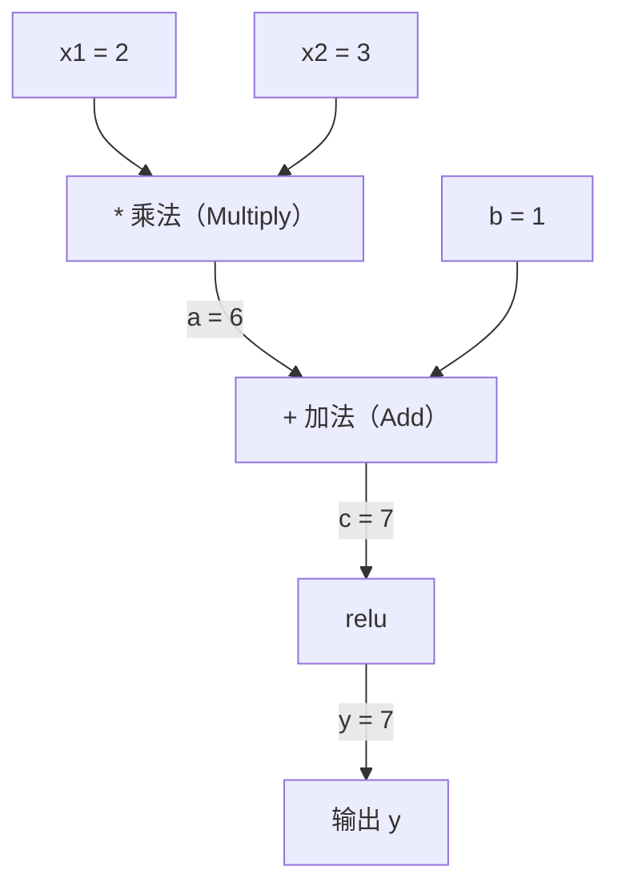
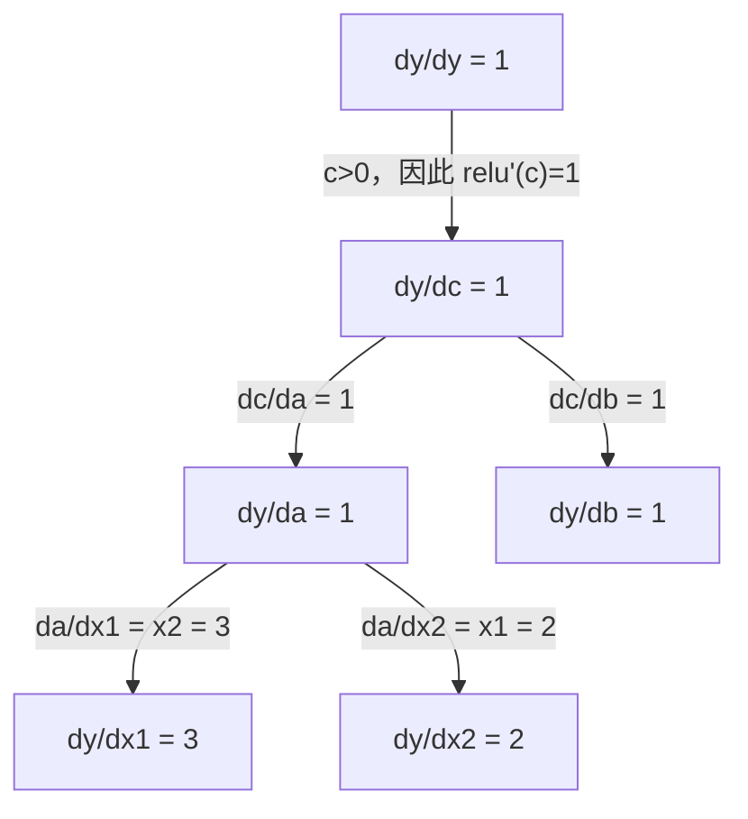

# 链式法则与自动微分（Chain Rule & Automatic Differentiation）

> 每个能够学习的神经网络，背后都离不开链式法则（Chain Rule）。

**Type:** Build
**Language:** Python
**Prerequisites:** 阶段 1，第 04 课（导数与梯度（Derivatives & Gradients））
**Time:** 约 90 分钟

## 学习目标（Learning Objectives）

- 构建最小自动求导（Autograd）引擎，用 Value 类记录运算，并通过反向模式自动微分（Reverse-Mode Autodiff）计算梯度
- 使用拓扑排序（Topological Sort），实现计算图（Computational Graph）的前向计算和反向传播
- 仅用从零实现的自动求导引擎，构建多层感知机（Multi-Layer Perceptron，MLP）并训练它学习异或（XOR）
- 用数值有限差分（Finite Differences）进行梯度检查（Gradient Checking），验证自动微分的正确性

## 要解决的问题（The Problem）

你已经会求简单函数的导数。但神经网络并不是一个简单函数，而是数百个函数的复合：矩阵乘法、加偏置、应用激活函数、再次进行矩阵乘法、Softmax、交叉熵损失（Cross-Entropy Loss）。输出是函数套函数再套函数的结果。

训练网络需要求损失对每一个权重的梯度。面对数百万个参数，手算不可能完成；用数值方法（有限差分）计算又太慢。

链式法则提供数学依据，自动微分提供计算算法。两者结合，可以对任意函数复合计算精确梯度，耗时与一次前向计算成正比。

PyTorch、TensorFlow 和 JAX 都以此为基础。本课将从零实现一个微型版本。

## 核心概念（The Concept）

### 链式法则（Chain Rule）

若 `y = f(g(x))`，则 `y` 对 `x` 的导数为：

```text
dy/dx = dy/dg * dg/dx = f'(g(x)) * g'(x)
```

沿着复合链将导数相乘，每一环贡献自身的局部导数。

例如：`y = sin(x^2)`

```text
g(x) = x^2       g'(x) = 2x
f(g) = sin(g)     f'(g) = cos(g)

dy/dx = cos(x^2) * 2x
```

复合层数增加时，链条也随之延长：

```text
y = f(g(h(x)))

dy/dx = f'(g(h(x))) * g'(h(x)) * h'(x)
```

神经网络的每一层，都是这条链上的一环。

### 计算图（Computational Graph）

计算图把链式法则可视化：每个运算对应一个节点。数据沿图向前流动，梯度沿图向后传播。

**前向计算（Forward Pass）：计算数值**



**反向传播（Backward Pass）：计算梯度**



反向传播在每个节点应用链式法则，把梯度从输出传回输入。

### 前向模式与反向模式（Forward Mode vs Reverse Mode）

在计算图中应用链式法则，有两种方式。

**前向模式（Forward Mode）** 从输入出发，将导数向前传播。先设置 `dx/dx = 1`，再依次通过各个运算。它适合输入少、输出多的情况。

```text
前向模式（Forward Mode）：以 dx/dx = 1 为种子，向前传播

  x = 2       (dx/dx = 1)
  a = x^2     (da/dx = 2x = 4)
  y = sin(a)  (dy/dx = cos(a) * da/dx = cos(4) * 4 = -2.615)
```

**反向模式（Reverse Mode）** 从输出出发，将梯度向后传播。先设置 `dy/dy = 1`，再逆序通过各个运算。它适合输入多、输出少的情况。

```text
反向模式（Reverse Mode）：以 dy/dy = 1 为种子，向后传播

  y = sin(a)  (dy/dy = 1)
  a = x^2     (dy/da = cos(a) = cos(4) = -0.654)
  x = 2       (dy/dx = dy/da * da/dx = -0.654 * 4 = -2.615)
```

神经网络有数百万个输入（权重），却只有一个输出（损失）。反向模式只需一次反向传播就能计算所有梯度。这也是反向传播（Backpropagation）采用反向模式的原因。

| 模式 | 种子 | 方向 | 适用情况 |
|------|------|-----------|-----------|
| 前向模式（Forward Mode） | `dx_i/dx_i = 1` | 从输入到输出 | 输入少、输出多 |
| 反向模式（Reverse Mode） | `dy/dy = 1` | 从输出到输入 | 输入多、输出少，例如神经网络 |

### 用对偶数实现前向模式（Dual Numbers for Forward Mode）

借助对偶数（Dual Numbers），前向模式可以实现得很简洁。对偶数的形式为 `a + b*epsilon`，其中 `epsilon^2 = 0`。

```text
对偶数（Dual Number）：（数值，导数）

(2, 1) 表示：数值为 2，对 x 的导数为 1

算术运算规则：
  (a, a') + (b, b') = (a+b, a'+b')
  (a, a') * (b, b') = (a*b, a'*b + a*b')
  sin(a, a')         = (sin(a), cos(a)*a')
```

把输入变量的导数设为 1，导数信息就会自动通过每个运算传播。

### 构建自动求导引擎（Autograd Engine）

自动求导引擎需要三部分：

1. **数值封装（Value Wrapping）。** 将每个数封装成对象，保存数值及其梯度。
2. **计算图记录（Graph Recording）。** 每次运算记录输入，以及计算局部梯度的函数。
3. **反向传播（Backward Pass）。** 对计算图进行拓扑排序，再按逆序遍历，在每个节点应用链式法则。

PyTorch 的 `autograd` 做的正是这些。`torch.Tensor` 类封装数值；设置 `requires_grad=True` 时记录运算；调用 `.backward()` 时计算梯度。

### PyTorch 自动求导（Autograd）的内部机制

当你写下这样的 PyTorch 代码时：

```python
x = torch.tensor(2.0, requires_grad=True)
y = x ** 2 + 3 * x + 1
y.backward()
print(x.grad)  # 7.0 = 2*x + 3 = 2*2 + 3
```

PyTorch 内部会：

1. 为 `x` 创建一个设置了 `requires_grad=True` 的 `Tensor` 节点
2. 每次运算（`**`、`*`、`+`）都创建新节点，并记录反向计算函数
3. 调用 `y.backward()`，沿已记录的计算图触发反向模式自动微分
4. 每个节点的 `grad_fn` 计算局部梯度，并把梯度传给父节点
5. 通过加法将梯度累积到 `.grad` 属性中，而不是覆盖旧值

这是一张动态图（Dynamic Graph），即运行时定义（Define-by-Run）：每次前向计算都会重新建图。因此，PyTorch 模型内部可以使用条件分支（if/else）和循环等控制流。

```figure
chain-rule
```

## 动手构建（Build It）

### 第 1 步：Value 类

```python
class Value:
    def __init__(self, data, children=(), op=''):
        self.data = data
        self.grad = 0.0
        self._backward = lambda: None
        self._prev = set(children)
        self._op = op

    def __repr__(self):
        return f"Value(data={self.data:.4f}, grad={self.grad:.4f})"
```

每个 `Value` 保存数值、梯度（初始为零）、反向计算函数，以及指向生成该值的子节点的引用。

### 第 2 步：支持梯度跟踪的算术运算

```python
    def __add__(self, other):
        other = other if isinstance(other, Value) else Value(other)
        out = Value(self.data + other.data, (self, other), '+')
        def _backward():
            self.grad += out.grad
            other.grad += out.grad
        out._backward = _backward
        return out

    def __mul__(self, other):
        other = other if isinstance(other, Value) else Value(other)
        out = Value(self.data * other.data, (self, other), '*')
        def _backward():
            self.grad += other.data * out.grad
            other.grad += self.data * out.grad
        out._backward = _backward
        return out

    def relu(self):
        out = Value(max(0, self.data), (self,), 'relu')
        def _backward():
            self.grad += (1.0 if out.data > 0 else 0.0) * out.grad
        out._backward = _backward
        return out
```

每个运算创建一个闭包（Closure），负责计算局部梯度，并乘以上游梯度（`out.grad`）。使用 `+=`，是为了处理同一个值参与多个运算的情况。

### 第 3 步：反向传播（Backward Pass）

```python
    def backward(self):
        topo = []
        visited = set()
        def build_topo(v):
            if v not in visited:
                visited.add(v)
                for child in v._prev:
                    build_topo(child)
                topo.append(v)
        build_topo(self)

        self.grad = 1.0
        for v in reversed(topo):
            v._backward()
```

拓扑排序确保每个节点的梯度计算完整后，才继续传给它的子节点。种子梯度为 1.0（dy/dy = 1）。

### 第 4 步：补齐引擎所需的其他运算

基础 Value 类支持加法、乘法和 relu。实际的自动求导引擎还需要更多运算。下面这些运算足以支持构建神经网络：

```python
    def __neg__(self):
        return self * -1

    def __sub__(self, other):
        return self + (-other)

    def __radd__(self, other):
        return self + other

    def __rmul__(self, other):
        return self * other

    def __rsub__(self, other):
        return other + (-self)

    def __pow__(self, n):
        out = Value(self.data ** n, (self,), f'**{n}')
        def _backward():
            self.grad += n * (self.data ** (n - 1)) * out.grad
        out._backward = _backward
        return out

    def __truediv__(self, other):
        return self * (other ** -1) if isinstance(other, Value) else self * (Value(other) ** -1)

    def exp(self):
        import math
        e = math.exp(self.data)
        out = Value(e, (self,), 'exp')
        def _backward():
            self.grad += e * out.grad
        out._backward = _backward
        return out

    def log(self):
        import math
        out = Value(math.log(self.data), (self,), 'log')
        def _backward():
            self.grad += (1.0 / self.data) * out.grad
        out._backward = _backward
        return out

    def tanh(self):
        import math
        t = math.tanh(self.data)
        out = Value(t, (self,), 'tanh')
        def _backward():
            self.grad += (1 - t ** 2) * out.grad
        out._backward = _backward
        return out
```

**各项运算的作用：**

| 运算 | 反向计算规则 | 用途 |
|-----------|--------------|---------|
| `__sub__` | 复用加法与取负运算 | 损失计算（pred - target） |
| `__pow__` | n * x^(n-1) | 多项式激活函数、均方误差（MSE，error^2） |
| `__truediv__` | 复用乘法与 pow(-1) | 归一化（Normalization）、学习率缩放 |
| `exp` | exp(x) * 上游梯度 | Softmax、对数似然（Log-Likelihood） |
| `log` | (1/x) * 上游梯度 | 交叉熵损失、对数概率 |
| `tanh` | (1 - tanh^2) * 上游梯度 | 经典激活函数（Activation Function） |

这里的关键是复用：`__sub__` 和 `__truediv__` 都用已有运算定义。链式法则会沿底层的加法、乘法、幂运算组合导数，因此无需另写规则，也能得到正确梯度。

### 第 5 步：从零构建微型多层感知机（MLP）

有了完整的 Value 类，就能构建神经网络。不需要 PyTorch，也不需要 NumPy，只需要 Value 和链式法则。

```python
import random

class Neuron:
    def __init__(self, n_inputs):
        self.w = [Value(random.uniform(-1, 1)) for _ in range(n_inputs)]
        self.b = Value(0.0)

    def __call__(self, x):
        act = sum((wi * xi for wi, xi in zip(self.w, x)), self.b)
        return act.tanh()

    def parameters(self):
        return self.w + [self.b]

class Layer:
    def __init__(self, n_inputs, n_outputs):
        self.neurons = [Neuron(n_inputs) for _ in range(n_outputs)]

    def __call__(self, x):
        return [n(x) for n in self.neurons]

    def parameters(self):
        return [p for n in self.neurons for p in n.parameters()]

class MLP:
    def __init__(self, sizes):
        self.layers = [Layer(sizes[i], sizes[i+1]) for i in range(len(sizes)-1)]

    def __call__(self, x):
        for layer in self.layers:
            x = layer(x)
        return x[0] if len(x) == 1 else x

    def parameters(self):
        return [p for layer in self.layers for p in layer.parameters()]
```

`Neuron` 计算 `tanh(w1*x1 + w2*x2 + ... + b)`。`Layer` 是一组神经元，`MLP` 将多层堆叠起来。每个权重都是一个 `Value`，因此调用 `loss.backward()` 就会把梯度传播到每个参数。

**在异或（XOR）数据上训练：**

```python
random.seed(42)
model = MLP([2, 4, 1])  # 2 inputs, 4 hidden neurons, 1 output

xs = [[0, 0], [0, 1], [1, 0], [1, 1]]
ys = [-1, 1, 1, -1]  # XOR pattern (using -1/1 for tanh)

for step in range(100):
    preds = [model(x) for x in xs]
    loss = sum((p - y) ** 2 for p, y in zip(preds, ys))

    for p in model.parameters():
        p.grad = 0.0
    loss.backward()

    lr = 0.05
    for p in model.parameters():
        p.data -= lr * p.grad

    if step % 20 == 0:
        print(f"step {step:3d}  loss = {loss.data:.4f}")

print("\nPredictions after training:")
for x, y in zip(xs, ys):
    print(f"  input={x}  target={y:2d}  pred={model(x).data:6.3f}")
```

这就是 micrograd：用纯 Python 和自动微分实现完整的神经网络训练循环。商业深度学习框架做的也是这些，只是规模大得多。

### 第 6 步：梯度检查（Gradient Checking）

如何确认自动微分实现正确？把结果与数值导数比较，这就是梯度检查。

```python
def gradient_check(build_expr, x_val, h=1e-7):
    x = Value(x_val)
    y = build_expr(x)
    y.backward()
    autodiff_grad = x.grad

    y_plus = build_expr(Value(x_val + h)).data
    y_minus = build_expr(Value(x_val - h)).data
    numerical_grad = (y_plus - y_minus) / (2 * h)

    diff = abs(autodiff_grad - numerical_grad)
    return autodiff_grad, numerical_grad, diff
```

用一个复杂表达式进行测试：

```python
def expr(x):
    return (x ** 3 + x * 2 + 1).tanh()

ad, num, diff = gradient_check(expr, 0.5)
print(f"Autodiff:  {ad:.8f}")
print(f"Numerical: {num:.8f}")
print(f"Difference: {diff:.2e}")
# Difference should be < 1e-5
```

新增运算时，梯度检查不可缺少。反向传播有错误时，数值检查可以将其发现。严谨的深度学习实现都会在开发阶段做梯度检查。

**什么时候使用梯度检查：**

| 场景 | 是否进行梯度检查 |
|-----------|-------------------|
| 为自动求导引擎增加新运算 | 是，每次都要检查 |
| 调试无法收敛的训练循环 | 是，先检查梯度 |
| 生产训练 | 否，太慢，每个参数需要两次前向计算 |
| 自动求导代码的单元测试（Unit Test） | 是，应自动执行 |

### 第 7 步：与手算结果核对

```python
x1 = Value(2.0)
x2 = Value(3.0)
a = x1 * x2          # a = 6.0
b = a + Value(1.0)    # b = 7.0
y = b.relu()          # y = 7.0

y.backward()

print(f"y = {y.data}")          # 7.0
print(f"dy/dx1 = {x1.grad}")   # 3.0 (= x2)
print(f"dy/dx2 = {x2.grad}")   # 2.0 (= x1)
```

手算核对：`y = relu(x1*x2 + 1)`。由于 `x1*x2 + 1 = 7 > 0`，relu 在此处等同于恒等函数。
`dy/dx1 = x2 = 3`，`dy/dx2 = x1 = 2`。引擎的结果与手算一致。

## 实际使用（Use It）

### 与 PyTorch 核对

```python
import torch

x1 = torch.tensor(2.0, requires_grad=True)
x2 = torch.tensor(3.0, requires_grad=True)
a = x1 * x2
b = a + 1.0
y = torch.relu(b)
y.backward()

print(f"PyTorch dy/dx1 = {x1.grad.item()}")  # 3.0
print(f"PyTorch dy/dx2 = {x2.grad.item()}")  # 2.0
```

梯度一致。你的引擎与 PyTorch 得到相同结果，是因为采用了相同的数学方法：通过链式法则实现反向模式自动微分。

### 更复杂的表达式

```python
a = Value(2.0)
b = Value(-3.0)
c = Value(10.0)
f = (a * b + c).relu()  # relu(2*(-3) + 10) = relu(4) = 4

f.backward()
print(f"df/da = {a.grad}")  # -3.0 (= b)
print(f"df/db = {b.grad}")  #  2.0 (= a)
print(f"df/dc = {c.grad}")  #  1.0
```

## 交付成果（Ship It）

本课产出：
- `outputs/skill-autodiff.md`：用于构建和调试自动求导系统的技能（Skill）
- `code/autodiff.py`：可继续扩展的最小自动求导引擎

这里构建的 Value 类，是阶段 3 神经网络训练循环的基础。

## 练习（Exercises）

1. 为 Value 类添加 `__pow__`，使其支持 `x ** n`。验证 `d/dx(x^3)` 在 `x=2` 时等于 `12.0`。

2. 添加激活函数 `tanh`。验证 `tanh'(0) = 1`，以及 `tanh'(2) = 0.0707`（近似值）。

3. 为单个神经元构建计算图：`y = relu(w1*x1 + w2*x2 + b)`。计算全部五个梯度，并与 PyTorch 核对。

4. 使用对偶数实现前向模式自动微分。创建 `Dual` 类，验证它与反向模式引擎给出相同导数。

## 关键术语（Key Terms）

| 术语 | 常见说法 | 实际含义 |
|------|----------------|----------------------|
| 链式法则（Chain Rule） | “把导数乘起来” | 复合函数的导数等于各函数在相应位置的局部导数之积 |
| 计算图（Computational Graph） | “网络结构图” | 一张有向无环图，节点表示运算，边传递前向数值或反向梯度 |
| 前向模式（Forward Mode） | “把导数往前推” | 从输入向输出传播导数的自动微分方式，每个输入变量需要遍历一次 |
| 反向模式（Reverse Mode） | “反向传播” | 从输出向输入传播梯度的自动微分方式，每个输出变量需要遍历一次 |
| 自动求导（Autograd） | “自动算梯度” | 记录数值上的运算、构建计算图，并通过链式法则计算精确梯度的系统 |
| 对偶数（Dual Numbers） | “数值加上导数” | 形如 a + b*epsilon（epsilon^2 = 0）的数，使算术运算能够携带导数信息 |
| 拓扑排序（Topological Sort） | “按依赖顺序排列” | 将图节点排序，使每个节点都位于它依赖的所有节点之后，这是正确传播梯度的前提 |
| 梯度累积（Gradient Accumulation） | “相加，不覆盖” | 一个值被多个运算使用时，它的梯度等于各条路径传来的梯度贡献之和 |
| 动态图（Dynamic Graph） | “运行时定义” | 每次前向计算重新构建的计算图，允许在模型内部使用 Python 控制流，PyTorch 就采用这种方式 |
| 梯度检查（Gradient Checking） | “用数值方法核验” | 将自动微分梯度与有限差分得到的数值梯度比较，验证正确性，是重要的调试手段 |
| 多层感知机（Multi-Layer Perceptron，MLP） | “有多个层的感知机” | 含一个或多个神经元隐藏层的网络；每个神经元先求加权和并加偏置，再应用激活函数 |
| 神经元（Neuron） | “加权求和，再激活” | 基本计算单元：output = activation(w1*x1 + w2*x2 + ... + b)，权重和偏置都是可学习参数 |

## 延伸阅读（Further Reading）

- [3Blue1Brown：反向传播的微积分（Backpropagation Calculus）](https://www.youtube.com/watch?v=tIeHLnjs5U8)：用可视化解释神经网络中的链式法则
- [PyTorch 自动求导机制（Autograd Mechanics）](https://pytorch.org/docs/stable/notes/autograd.html)：实际系统的工作原理
- [机器学习中的自动微分：综述（Automatic Differentiation in Machine Learning: A Survey）](https://arxiv.org/abs/1502.05767)：全面的学术综述
