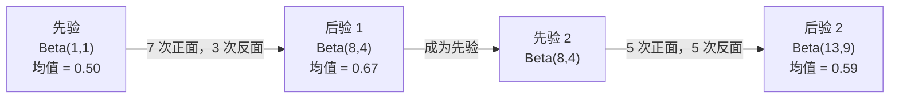

# 贝叶斯定理（Bayes' Theorem）

> 概率描述你的预期；贝叶斯定理描述你如何从新信息中学习。

**Type:** Build
**Language:** Python
**Prerequisites:** 阶段 1，第 06 课（概率基础）
**Time:** ~75 分钟

## 学习目标（Learning Objectives）

- 应用贝叶斯定理，从先验、似然和证据计算后验概率
- 从零构建朴素贝叶斯（Naive Bayes）文本分类器，使用拉普拉斯平滑（Laplace Smoothing）和对数空间计算
- 比较最大似然估计（Maximum Likelihood Estimation，MLE）与最大后验估计（Maximum A Posteriori，MAP），解释 MAP 如何对应 L2 正则化
- 使用贝塔–二项（Beta-Binomial）共轭先验实现序贯贝叶斯更新，用于 A/B 测试

## 问题（The Problem）

某项医学检测的准确率为 99%。你的结果为阳性。你真正患病的概率是多少？

多数人会说 99%。实际答案取决于这种疾病有多罕见。如果每 10,000 人中只有 1 人患病，阳性结果对应的患病概率仅约为 1%。其余 99% 的阳性结果都来自健康人的误报。

这不是脑筋急转弯，而是贝叶斯定理。每个垃圾邮件过滤器、医学诊断系统以及量化不确定性的机器学习模型，都使用这种推理：从一个信念出发，观察证据，然后更新信念。

不理解这一点就构建机器学习系统，会导致误解模型输出、设置不恰当的阈值，并交付过度自信的预测。

## 概念（The Concept）

### 从联合概率到贝叶斯定理（From joint probability to Bayes）

第 06 课已经介绍，条件概率为：

```
P(A|B) = P(A and B) / P(B)
```

对称地：

```
P(B|A) = P(A and B) / P(A)
```

两个表达式具有相同的分子 P(A and B)。令它们相等，再整理：

```
P(A and B) = P(A|B) * P(B) = P(B|A) * P(A)

因此：

P(A|B) = P(B|A) * P(A) / P(B)
```

这就是贝叶斯定理：四个量，一个等式。

### 四个组成部分（The four parts）

| 部分 | 名称 | 含义 |
|------|------|---------------|
| P(A\|B) | 后验（Posterior） | 观察证据 B 后，对 A 更新后的信念 |
| P(B\|A) | 似然（Likelihood） | 如果 A 为真，证据 B 出现的可能性 |
| P(A) | 先验（Prior） | 观察任何证据之前，对 A 的信念 |
| P(B) | 证据（Evidence） | 在所有可能情况下观察到 B 的总概率 |

证据项 P(B) 起归一化作用。可以用全概率公式将它展开：

```
P(B) = P(B|A) * P(A) + P(B|not A) * P(not A)
```

### 医学检测示例（Medical test example）

某疾病每 10,000 人中影响 1 人。检测准确率为 99%（能检出 99% 的患者，假阳性率为 1%）。

```
P(sick)          = 0.0001     （先验：疾病罕见）
P(positive|sick) = 0.99       （似然：检测能检出疾病）
P(positive|healthy) = 0.01    （假阳性率）

P(positive) = P(positive|sick) * P(sick) + P(positive|healthy) * P(healthy)
            = 0.99 * 0.0001 + 0.01 * 0.9999
            = 0.000099 + 0.009999
            = 0.010098

P(sick|positive) = P(positive|sick) * P(sick) / P(positive)
                 = 0.99 * 0.0001 / 0.010098
                 = 0.0098
                 = 0.98%
```

不到 1%。先验占据主导。当疾病罕见时，即使检测准确，阳性结果也多为假阳性。这就是医生要求复检确认的原因。

### 垃圾邮件过滤示例（Spam filter example）

你收到一封含有单词 "lottery" 的邮件。它是垃圾邮件吗？

```
P(spam)                = 0.3      （30% 的邮件是垃圾邮件）
P("lottery"|spam)      = 0.05     （5% 的垃圾邮件含有 "lottery"）
P("lottery"|not spam)  = 0.001    （0.1% 的正常邮件含有 "lottery"）

P("lottery") = 0.05 * 0.3 + 0.001 * 0.7
             = 0.015 + 0.0007
             = 0.0157

P(spam|"lottery") = 0.05 * 0.3 / 0.0157
                  = 0.955
                  = 95.5%
```

一个词就将概率从 30% 推到了 95.5%。真实的垃圾邮件过滤器会同时对数百个词应用贝叶斯方法。

### 朴素贝叶斯：独立性假设（Naive Bayes: independence assumption）

朴素贝叶斯假设给定类别后，所有特征条件独立，从而将方法扩展到多个特征：

```
P(class | feature_1, feature_2, ..., feature_n)
  = P(class) * P(feature_1|class) * P(feature_2|class) * ... * P(feature_n|class)
    / P(feature_1, feature_2, ..., feature_n)
```

“朴素”指的就是独立性假设。文本中词语的出现并不独立（"New" 与 "York" 相关）。但这个假设在实践中效果出奇地好，因为分类器只需对类别排序，而不必产生校准后的概率。

由于所有类别的分母相同，可以忽略分母，只比较分子：

```
score(class) = P(class) * product of P(feature_i | class)
```

选择得分最高的类别。

### 最大似然估计（Maximum likelihood estimation，MLE）

如何从训练数据获得 P(feature|class)？计数即可。

```
P("free"|spam) = (number of spam emails containing "free") / (total spam emails)
```

这就是 MLE：选择使观测数据最可能出现的参数值。你在最大化似然函数，对于离散计数，它简化为相对频率。

问题是：如果某个词从未在训练垃圾邮件中出现，MLE 就会赋予它零概率。一个未见词就会使整个乘积归零。拉普拉斯平滑可以解决这个问题：

```
P(word|class) = (count(word, class) + 1) / (total_words_in_class + vocabulary_size)
```

给每个计数加 1，确保没有概率为零。

### 最大后验估计（Maximum a posteriori，MAP）

MLE 问：哪些参数能最大化 P(data|parameters)？

MAP 问：哪些参数能最大化 P(parameters|data)？

根据贝叶斯定理：

```
P(parameters|data) proportional to P(data|parameters) * P(parameters)
```

MAP 为参数本身加入先验。如果你认为参数应该较小，就用惩罚较大数值的先验表达这一信念。这与机器学习中的 L2 正则化相同。岭回归的“岭”惩罚，本质上就是权重的高斯先验。

| 估计方法 | 优化目标 | 机器学习中的对应方法 |
|------------|-----------|---------------|
| MLE | P(data\|params) | 不带正则化的训练 |
| MAP | P(data\|params) * P(params) | L2 / L1 正则化 |

### 贝叶斯学派与频率学派：实践差异（Bayesian vs frequentist: the practical difference）

频率学派（Frequentist）将参数视为固定的未知量。他们问：“如果重复这个实验许多次，会发生什么？”

贝叶斯学派（Bayesian）用分布表示参数。他们问：“根据已观察到的情况，我对参数有怎样的信念？”

构建机器学习系统时，两者的实际差异如下：

| 方面 | 频率学派 | 贝叶斯学派 |
|--------|-------------|----------|
| 输出 | 点估计 | 数值上的分布 |
| 不确定性 | 置信区间（Confidence Interval，针对过程） | 可信区间（Credible Interval，针对参数） |
| 小样本数据 | 可能过拟合 | 先验起正则化作用 |
| 计算 | 通常更快 | 常需要采样（马尔可夫链蒙特卡洛，Markov Chain Monte Carlo，MCMC） |

大多数生产环境中的机器学习采用频率学派方法（SGD、点估计）。当你需要校准的不确定性（医学决策、安全关键系统），或数据稀缺（少样本学习、冷启动）时，贝叶斯方法更能发挥优势。

### 贝叶斯思维为何对机器学习重要（Why Bayesian thinking matters for ML）

这种联系不只是类比：

**先验就是正则化。** 权重的高斯先验对应 L2 正则化，拉普拉斯先验对应 L1。每当加入正则化项，你就在用贝叶斯方式表达自己预期的参数值。

**后验表示不确定性。** 单个预测概率无法告诉你模型对该估计有多大把握。贝叶斯方法给出分布：“我认为 P(spam) 在 0.8 到 0.95 之间。”

**贝叶斯更新就是在线学习。** 今天的后验成为明天的先验。模型看到新数据时，会增量更新信念，而不必从零重新训练。

**模型比较也是贝叶斯式的。** 贝叶斯信息准则（Bayesian Information Criterion，BIC）、边缘似然（Marginal Likelihood）和贝叶斯因子（Bayes Factor）都用贝叶斯推理在模型之间做选择，同时避免过拟合。

```figure
bayes-update
```

## 动手实现（Build It）

### 第 1 步：贝叶斯定理函数（Step 1: Bayes theorem function）

```python
def bayes(prior, likelihood, false_positive_rate):
    evidence = likelihood * prior + false_positive_rate * (1 - prior)
    posterior = likelihood * prior / evidence
    return posterior

result = bayes(prior=0.0001, likelihood=0.99, false_positive_rate=0.01)
print(f"P(sick|positive) = {result:.4f}")
```

### 第 2 步：朴素贝叶斯分类器（Step 2: Naive Bayes classifier）

```python
import math
from collections import defaultdict

class NaiveBayes:
    def __init__(self, smoothing=1.0):
        self.smoothing = smoothing
        self.class_counts = defaultdict(int)
        self.word_counts = defaultdict(lambda: defaultdict(int))
        self.class_word_totals = defaultdict(int)
        self.vocab = set()

    def train(self, documents, labels):
        for doc, label in zip(documents, labels):
            self.class_counts[label] += 1
            words = doc.lower().split()
            for word in words:
                self.word_counts[label][word] += 1
                self.class_word_totals[label] += 1
                self.vocab.add(word)

    def predict(self, document):
        words = document.lower().split()
        total_docs = sum(self.class_counts.values())
        vocab_size = len(self.vocab)
        best_class = None
        best_score = float("-inf")
        for cls in self.class_counts:
            score = math.log(self.class_counts[cls] / total_docs)
            for word in words:
                count = self.word_counts[cls].get(word, 0)
                total = self.class_word_totals[cls]
                score += math.log((count + self.smoothing) / (total + self.smoothing * vocab_size))
            if score > best_score:
                best_score = score
                best_class = cls
        return best_class
```

对数概率防止下溢。许多小概率相乘，结果会小到浮点数无法表示。对对数概率求和在数值上稳定，在数学上等价。

### 第 3 步：用垃圾邮件数据训练（Step 3: Train on spam data）

```python
train_docs = [
    "win free money now",
    "free lottery ticket winner",
    "claim your prize today free",
    "urgent offer free cash",
    "congratulations you won free",
    "meeting tomorrow at noon",
    "project update attached",
    "can we schedule a call",
    "quarterly report review",
    "lunch on thursday sounds good",
    "team standup notes attached",
    "please review the pull request",
]

train_labels = [
    "spam", "spam", "spam", "spam", "spam",
    "ham", "ham", "ham", "ham", "ham", "ham", "ham",
]

classifier = NaiveBayes()
classifier.train(train_docs, train_labels)

test_messages = [
    "free money waiting for you",
    "meeting rescheduled to friday",
    "you won a free prize",
    "please review the attached report",
]

for msg in test_messages:
    print(f"  '{msg}' -> {classifier.predict(msg)}")
```

### 第 4 步：检查学得的概率（Step 4: Inspect the learned probabilities）

```python
def show_top_words(classifier, cls, n=5):
    vocab_size = len(classifier.vocab)
    total = classifier.class_word_totals[cls]
    probs = {}
    for word in classifier.vocab:
        count = classifier.word_counts[cls].get(word, 0)
        probs[word] = (count + classifier.smoothing) / (total + classifier.smoothing * vocab_size)
    sorted_words = sorted(probs.items(), key=lambda x: x[1], reverse=True)
    for word, prob in sorted_words[:n]:
        print(f"    {word}: {prob:.4f}")

print("\nTop spam words:")
show_top_words(classifier, "spam")
print("\nTop ham words:")
show_top_words(classifier, "ham")
```

## 实际应用（Use It）

Scikit-learn 提供可用于生产的朴素贝叶斯实现：

```python
from sklearn.feature_extraction.text import CountVectorizer
from sklearn.naive_bayes import MultinomialNB
from sklearn.metrics import classification_report

vectorizer = CountVectorizer()
X_train = vectorizer.fit_transform(train_docs)
clf = MultinomialNB()
clf.fit(X_train, train_labels)

X_test = vectorizer.transform(test_messages)
predictions = clf.predict(X_test)
for msg, pred in zip(test_messages, predictions):
    print(f"  '{msg}' -> {pred}")
```

算法相同。CountVectorizer 负责分词和构建词表。MultinomialNB 内部处理平滑和对数概率。你从零编写的版本用 40 行实现了同样的功能。

## 交付成果（Ship It）

这里构建的 NaiveBayes 类展示了完整流程：分词、带拉普拉斯平滑的概率估计，以及对数空间预测。`code/bayes.py` 中的代码仅依赖 Python 标准库，可端到端运行。

### 共轭先验（Conjugate Priors）

当先验与后验属于同一个分布族时，该先验称为“共轭”先验。这使贝叶斯更新在代数上很简洁：无需数值积分，就能得到闭式后验。

| 似然 | 共轭先验 | 后验 | 示例 |
|-----------|----------------|-----------|---------|
| 伯努利分布（Bernoulli） | Beta(a, b) | Beta(a + successes, b + failures) | 估计硬币正面概率的偏差 |
| 正态分布（Normal，方差已知） | Normal(mu_0, sigma_0) | Normal(weighted mean, smaller variance) | 传感器校准 |
| 泊松分布（Poisson） | Gamma(a, b) | Gamma(a + sum of counts, b + n) | 到达率建模 |
| 多项分布（Multinomial） | Dirichlet(alpha) | Dirichlet(alpha + counts) | 主题建模、语言模型 |

这为何重要：没有共轭先验，你需要蒙特卡洛采样（Monte Carlo Sampling）或变分推断（Variational Inference）来近似后验。有了共轭先验，只需更新两个数。

贝塔分布（Beta Distribution）是实践中最常见的共轭先验。Beta(a, b) 表示你对概率参数的信念，均值为 a/(a+b)。a+b 越大，分布越集中（信心越强）。

贝塔先验的特殊情况：
- Beta(1, 1) = 均匀分布。你对该参数没有偏好。
- Beta(10, 10) = 峰值位于 0.5。你坚信参数接近 0.5。
- Beta(1, 10) = 偏向 0。你认为参数较小。

更新规则非常简单：

```
先验：     Beta(a, b)
数据：     s 次成功，f 次失败
后验：     Beta(a + s, b + f)
```

不需要积分，不需要采样，只需加法。

### 序贯贝叶斯更新（Sequential Bayesian Updating）

贝叶斯推断天然支持序贯处理。今天的后验成为明天的先验。真实系统就是这样进行增量学习，而不必重新处理所有历史数据。

具体示例：估计一枚硬币是否公平。

**第 1 天：尚无数据。**
从均匀先验 Beta(1, 1) 开始。你没有偏好。
- 先验均值：0.5
- 先验在 [0, 1] 上平坦

**第 2 天：观察到 7 次正面、3 次反面。**
后验 = Beta(1 + 7, 1 + 3) = Beta(8, 4)
- 后验均值：8/12 = 0.667
- 证据表明硬币偏向正面

**第 3 天：又观察到 5 次正面、5 次反面。**
将昨天的后验作为今天的先验。
后验 = Beta(8 + 5, 4 + 5) = Beta(13, 9)
- 后验均值：13/22 = 0.591
- 正反平衡的新数据将估计拉回到更接近 0.5 的位置



观测顺序并不重要。从 Beta(1,1) 出发，一次性用全部 12 次正面和 8 次反面更新，也会得到相同的 Beta(13, 9)。序贯更新与批量更新在数学上等价，但序贯更新无需存储原始数据，就能在每一步做决策。

这是生产机器学习系统在线学习的基础。多臂老虎机问题中的汤普森采样（Thompson Sampling）、增量推荐系统和流式异常检测器，都使用这一模式。

### 与 A/B 测试的联系（Connection to A/B Testing）

A/B 测试是贝叶斯推断的另一种表现形式。

场景：你在测试两种按钮颜色，版本 A（蓝色）和版本 B（绿色），想知道哪一种能获得更多点击。

贝叶斯 A/B 测试：

1. **先验。** 两个版本都从 Beta(1, 1) 开始，没有先验偏好。
2. **数据。** 版本 A：1000 次展示中有 50 次点击。版本 B：1000 次展示中有 65 次点击。
3. **后验。**
   - A: Beta(1 + 50, 1 + 950) = Beta(51, 951)。均值 = 0.051
   - B: Beta(1 + 65, 1 + 935) = Beta(66, 936)。均值 = 0.066
4. **决策。** 计算 P(B > A)，即 B 的真实转化率高于 A 的概率。

解析计算 P(B > A) 很困难，但蒙特卡洛方法让它变得简单：

```
1. 从 Beta(51, 951) 抽取 100,000 个样本 -> samples_A
2. 从 Beta(66, 936) 抽取 100,000 个样本 -> samples_B
3. P(B > A) = 样本中 B > A 的比例
```

如果 P(B > A) > 0.95，就上线版本 B。如果介于 0.05 和 0.95 之间，就继续收集数据。如果 P(B > A) < 0.05，就上线版本 A。

相对于频率学派 A/B 测试的优势：
- 得到直接的概率陈述：“B 更好的概率为 97%”
- 没有 p 值的歧义，也不必绕着“无法拒绝原假设”来表达
- 可以随时查看结果，而不增加假阳性率（没有“偷看问题”）
- 可以纳入先验知识（例如，先前测试表明转化率通常在 3–8%）

| 方面 | 频率学派 A/B | 贝叶斯 A/B |
|--------|----------------|--------------|
| 输出 | p 值 | P(B > A) |
| 解释 | “如果 A=B，这些数据有多出乎意料？” | “B 优于 A 的可能性有多大？” |
| 提前停止 | 增加假阳性 | 可随时安全停止（前提是先验选择恰当且模型设定正确） |
| 先验知识 | 不使用 | 编码为贝塔先验 |
| 决策规则 | p < 0.05 | P(B > A) > threshold |

## 练习（Exercises）

1. **多次检测。** 某患者在两次独立检测中均呈阳性（两次准确率均为 99%，患病率为万分之一）。两次检测后的 P(sick) 是多少？将第一次检测的后验作为第二次检测的先验。

2. **平滑的影响。** 分别使用 0.01、0.1、1.0 和 10.0 的平滑值运行垃圾邮件分类器。最高的词概率如何变化？当 smoothing=0，且某个词仅出现在正常邮件中时，会发生什么？

3. **添加特征。** 扩展 NaiveBayes 类，除词频外，也将消息长度（短/长）作为特征。从训练数据估计 P(short|spam) 和 P(short|ham)，并将它们纳入预测得分。

4. **手算 MAP。** 给定观测数据（10 次抛硬币中有 7 次正面），使用 Beta(2,2) 先验计算正面概率的 MAP 估计，并与 MLE 估计（7/10）比较。

## 关键术语（Key Terms）

| 术语 | 通俗说法 | 实际含义 |
|------|----------------|----------------------|
| 先验（Prior） | “我的初始猜测” | 观察证据之前的 P(hypothesis)。在机器学习中对应正则化项。 |
| 似然（Likelihood） | “数据有多吻合” | P(evidence\|hypothesis)。在特定假设下，观测数据出现的可能性。 |
| 后验（Posterior） | “我更新后的信念” | P(hypothesis\|evidence)。先验乘以似然，再归一化。 |
| 证据（Evidence） | “归一化常数” | 所有假设下的 P(data)。保证后验之和为 1。 |
| 朴素贝叶斯（Naive Bayes） | “那个简单的文本分类器” | 假设给定类别后特征独立的分类器。即使假设不成立，也能取得良好效果。 |
| 拉普拉斯平滑（Laplace Smoothing） | “加一平滑” | 给每个特征添加一个小计数，防止未见数据导致零概率。 |
| 最大似然估计（MLE） | “直接用频率” | 选择最大化 P(data\|parameters) 的参数。没有先验，数据少时可能过拟合。 |
| 最大后验估计（MAP） | “带先验的 MLE” | 选择最大化 P(data\|parameters) * P(parameters) 的参数，等价于正则化 MLE。 |
| 对数概率（Log-probability） | “在对数空间中计算” | 用 log(P) 代替 P，避免许多小数相乘时浮点下溢。 |
| 假阳性（False Positive） | “误报” | 检测为阳性，但真实状态为阴性。它是基础概率谬误的成因。 |

## 延伸阅读（Further Reading）

- [3Blue1Brown：贝叶斯定理](https://www.youtube.com/watch?v=HZGCoVF3YvM) - 用医学检测示例做可视化解释
- [Stanford CS229：生成式学习算法](https://cs229.stanford.edu/notes2022fall/cs229-notes2.pdf) - 朴素贝叶斯及其与判别模型的联系
- [Think Bayes（贝叶斯思维）](https://greenteapress.com/wp/think-bayes/) - 附 Python 代码的免费贝叶斯统计书籍
- [scikit-learn 朴素贝叶斯](https://scikit-learn.org/stable/modules/naive_bayes.html) - 生产实现及各变体的适用场景
