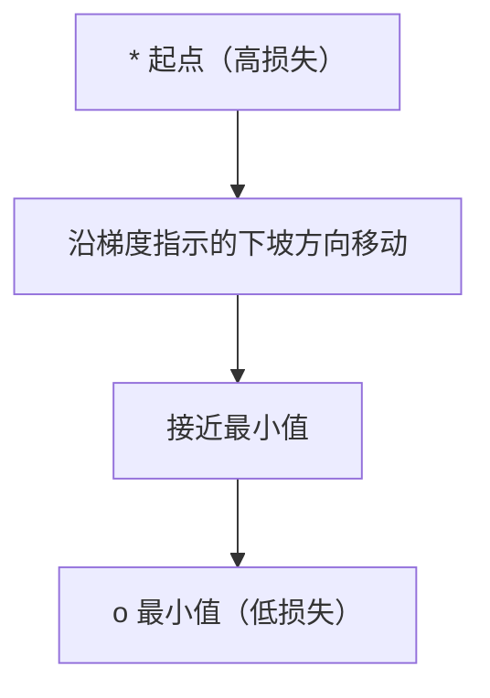
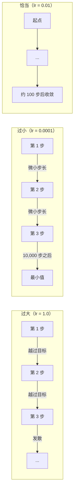
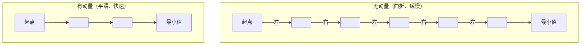
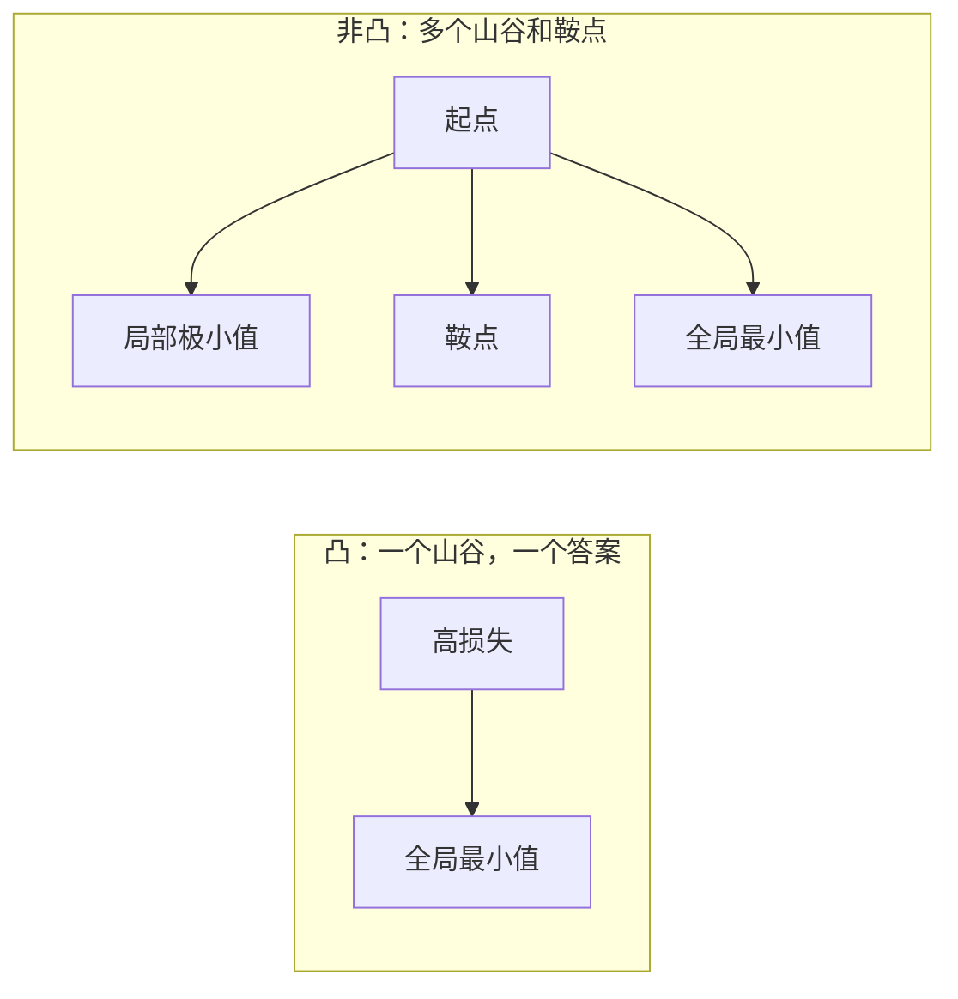
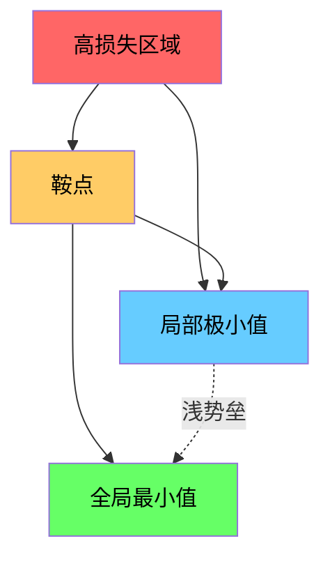

# 优化（Optimization）

> 训练神经网络，无非是在寻找山谷的最低点。

**Type:** Build
**Language:** Python
**Prerequisites:** 阶段 1，第 04–05 课（导数、梯度）
**Time:** ~75 分钟

## 学习目标（Learning Objectives）

- 从零实现普通梯度下降（Gradient Descent，GD）、带动量的随机梯度下降（Stochastic Gradient Descent，SGD）和 Adam
- 比较优化器在 Rosenbrock 函数上的收敛情况，解释 Adam 为何为每个权重自适应调整学习率
- 区分凸与非凸损失曲面，解释鞍点在高维空间中的作用
- 配置学习率调度（阶梯衰减、余弦退火、预热），提高训练稳定性

## 问题（The Problem）

你有损失函数，它告诉你模型错得有多远。你有梯度，它告诉你哪个方向会使损失增大。现在，你需要一种下坡策略。

最直接的方法很简单：沿梯度反方向移动，用一个叫学习率的数缩放步长，然后重复。这就是梯度下降，而且有效。但“有效”有前提。学习率过大，会直接跨过谷底，在两侧来回反弹；过小，则要多走数千步才能缓慢靠近答案。遇到鞍点时，即使尚未找到最小值，也可能停止移动。

深度学习中的每个优化器都在回答同一个问题：如何更快、更可靠地到达谷底？

## 概念（The Concept）

### 优化的含义（What optimization means）

优化是寻找使函数最小化（或最大化）的输入值。在机器学习中，函数是损失，输入是模型权重。训练就是优化。

```
最小化 L(w)，其中：
  L = 损失函数
  w = 模型权重（可能包含数百万个参数）
```

### 普通梯度下降（Gradient descent (vanilla)）

这是最简单的优化器。计算损失相对于每个权重的梯度，沿各自梯度的反方向移动权重，并用学习率缩放步长。

```
w = w - lr * gradient
```

这就是整个算法，只有一行。



### 学习率：最重要的超参数（Learning rate: the most important hyperparameter）

学习率（Learning Rate）控制步长，决定收敛过程的方方面面。



没有公式能直接给出合适的学习率，需要通过实验寻找。常用起点是：Adam 为 0.001，带动量的 SGD 为 0.01。

### SGD、批量与小批量（SGD vs batch vs mini-batch）

普通梯度下降在每次更新前计算整个数据集上的梯度，称为批量梯度下降（Batch Gradient Descent）。它稳定，但速度慢。

随机梯度下降（SGD）在单个随机样本上计算梯度，然后立即更新。它噪声大，但速度快。

小批量梯度下降（Mini-batch Gradient Descent）折中处理：在一小批样本（32、64、128、256 个）上计算梯度，再更新。这是实践中普遍使用的方法。

| 变体 | 批大小 | 梯度质量 | 单步速度 | 噪声 |
|---------|-----------|-----------------|---------------|-------|
| 批量 GD | 整个数据集 | 精确 | 慢 | 无 |
| SGD | 1 个样本 | 噪声很大 | 快 | 高 |
| 小批量 | 32-256 | 较好的估计 | 均衡 | 中等 |

SGD 和小批量训练的噪声并非缺陷。它有助于逃离浅局部极小值和鞍点。

### 动量：滚下山坡的球（Momentum: the ball rolling downhill）

普通梯度下降只看当前梯度。如果梯度方向来回摆动（狭窄山谷中很常见），前进就会很慢。动量（Momentum）将历史梯度累积为速度项，以解决这一问题。

```
v = beta * v + gradient
w = w - lr * v
```

可以把它比作滚下山坡的球：它不会遇到每个凸起就停下来重新起步，而是沿一致的方向积累速度，同时减弱振荡。



`beta`（通常为 0.9）控制保留多少历史。beta 越大，动量越强、路径越平滑，但对方向变化的响应越慢。

### Adam：自适应学习率（Adam: adaptive learning rates）

不同权重需要不同的学习率。很少获得大梯度的权重，在终于遇到大梯度时应迈出更大步；经常获得巨大梯度的权重则应迈小步。

Adam（自适应矩估计，Adaptive Moment Estimation）为每个权重追踪两个量：

1. 一阶矩（First Moment，m）：梯度的滑动平均（类似动量）
2. 二阶矩（Second Moment，v）：梯度平方的滑动平均（梯度幅度）

```
m = beta1 * m + (1 - beta1) * gradient
v = beta2 * v + (1 - beta2) * gradient^2

m_hat = m / (1 - beta1^t)    偏差修正
v_hat = v / (1 - beta2^t)    偏差修正

w = w - lr * m_hat / (sqrt(v_hat) + epsilon)
```

关键在于除以 `sqrt(v_hat)`。大梯度对应除以大数（有效步长小），小梯度对应除以小数（有效步长大）。每个权重因此获得自己的自适应学习率。

默认超参数：`lr=0.001, beta1=0.9, beta2=0.999, epsilon=1e-8`。这些默认值对多数问题效果良好。

### 学习率调度（Learning rate schedules）

固定学习率是一种折中。训练初期希望用大步长快速前进；训练后期希望用小步长在最小值附近细调。

常见调度策略：

| 调度 | 公式 | 使用场景 |
|----------|---------|----------|
| 阶梯衰减（Step Decay） | 每 N 个训练轮次执行 lr = lr * factor | 简单，便于手动控制 |
| 指数衰减（Exponential Decay） | lr = lr_0 * decay^t | 平滑下降 |
| 余弦退火（Cosine Annealing） | lr = lr_min + 0.5 * (lr_max - lr_min) * (1 + cos(pi * t / T)) | Transformer、现代训练流程 |
| 预热（Warmup）+ 衰减 | 先线性增加，再衰减 | 大模型，防止早期不稳定 |

### 凸与非凸（Convex vs non-convex）

凸函数（Convex Function）只有一个最小值，梯度下降总能找到它。像 `f(x) = x^2` 这样的二次函数就是凸函数。

神经网络的损失函数是非凸的，包含许多局部极小值、鞍点和平坦区域。



实践中，高维神经网络的局部极小值很少构成问题。多数局部极小值的损失接近全局最小值。鞍点（Saddle Point，某些方向平坦、另一些方向弯曲）才是真正的障碍。动量和小批量噪声有助于逃离它们。

### 损失曲面可视化（Loss landscape visualization）

损失是所有权重的函数。对于含 100 万个权重的模型，损失曲面（Loss Landscape）位于 1,000,001 维空间中。我们在权重空间中随机选择两个方向，沿这两个方向绘制损失，得到二维曲面来进行可视化。



尖锐极小值的泛化能力较差，平坦极小值的泛化能力较好。这也是带动量的 SGD 在最终测试准确率上常优于 Adam 的原因之一：其噪声防止优化器停留在尖锐极小值中。

```figure
gradient-descent
```

## 动手实现（Build It）

### 第 1 步：定义测试函数（Step 1: Define a test function）

Rosenbrock 函数是经典的优化基准。其最小值位于 (1, 1)，处在一个狭窄弯曲的山谷内。山谷很容易找到，却难以沿谷前进。

```
f(x, y) = (1 - x)^2 + 100 * (y - x^2)^2
```

```python
def rosenbrock(params):
    x, y = params
    return (1 - x) ** 2 + 100 * (y - x ** 2) ** 2

def rosenbrock_gradient(params):
    x, y = params
    df_dx = -2 * (1 - x) + 200 * (y - x ** 2) * (-2 * x)
    df_dy = 200 * (y - x ** 2)
    return [df_dx, df_dy]
```

### 第 2 步：普通梯度下降（Step 2: Vanilla gradient descent）

```python
class GradientDescent:
    def __init__(self, lr=0.001):
        self.lr = lr

    def step(self, params, grads):
        return [p - self.lr * g for p, g in zip(params, grads)]
```

### 第 3 步：带动量的 SGD（Step 3: SGD with momentum）

```python
class SGDMomentum:
    def __init__(self, lr=0.001, momentum=0.9):
        self.lr = lr
        self.momentum = momentum
        self.velocity = None

    def step(self, params, grads):
        if self.velocity is None:
            self.velocity = [0.0] * len(params)
        self.velocity = [
            self.momentum * v + g
            for v, g in zip(self.velocity, grads)
        ]
        return [p - self.lr * v for p, v in zip(params, self.velocity)]
```

### 第 4 步：Adam（Step 4: Adam）

```python
class Adam:
    def __init__(self, lr=0.001, beta1=0.9, beta2=0.999, epsilon=1e-8):
        self.lr = lr
        self.beta1 = beta1
        self.beta2 = beta2
        self.epsilon = epsilon
        self.m = None
        self.v = None
        self.t = 0

    def step(self, params, grads):
        if self.m is None:
            self.m = [0.0] * len(params)
            self.v = [0.0] * len(params)

        self.t += 1

        self.m = [
            self.beta1 * m + (1 - self.beta1) * g
            for m, g in zip(self.m, grads)
        ]
        self.v = [
            self.beta2 * v + (1 - self.beta2) * g ** 2
            for v, g in zip(self.v, grads)
        ]

        m_hat = [m / (1 - self.beta1 ** self.t) for m in self.m]
        v_hat = [v / (1 - self.beta2 ** self.t) for v in self.v]

        return [
            p - self.lr * mh / (vh ** 0.5 + self.epsilon)
            for p, mh, vh in zip(params, m_hat, v_hat)
        ]
```

### 第 5 步：运行并比较（Step 5: Run and compare）

```python
def optimize(optimizer, func, grad_func, start, steps=5000):
    params = list(start)
    history = [params[:]]
    for _ in range(steps):
        grads = grad_func(params)
        params = optimizer.step(params, grads)
        history.append(params[:])
    return history

start = [-1.0, 1.0]

gd_history = optimize(GradientDescent(lr=0.0005), rosenbrock, rosenbrock_gradient, start)
sgd_history = optimize(SGDMomentum(lr=0.0001, momentum=0.9), rosenbrock, rosenbrock_gradient, start)
adam_history = optimize(Adam(lr=0.01), rosenbrock, rosenbrock_gradient, start)

for name, history in [("GD", gd_history), ("SGD+M", sgd_history), ("Adam", adam_history)]:
    final = history[-1]
    loss = rosenbrock(final)
    print(f"{name:6s} -> x={final[0]:.6f}, y={final[1]:.6f}, loss={loss:.8f}")
```

预期输出：Adam 收敛最快。带动量的 SGD 路径更平滑。普通 GD 沿狭窄山谷缓慢前进。

## 实际应用（Use It）

实践中使用 PyTorch 或 JAX 优化器。它们负责参数组、权重衰减（Weight Decay）、梯度裁剪（Gradient Clipping）和图形处理器（Graphics Processing Unit，GPU）加速。

```python
import torch

model = torch.nn.Linear(784, 10)

sgd = torch.optim.SGD(model.parameters(), lr=0.01, momentum=0.9)
adam = torch.optim.Adam(model.parameters(), lr=0.001)
adamw = torch.optim.AdamW(model.parameters(), lr=0.001, weight_decay=0.01)

scheduler = torch.optim.lr_scheduler.CosineAnnealingLR(adam, T_max=100)
```

经验法则：

- 从 Adam（lr=0.001）开始，多数问题无需调参就能工作。
- 需要最佳最终准确率且能投入更多调参成本时，切换到带动量的 SGD（lr=0.01, momentum=0.9）。
- Transformer 使用 AdamW（带解耦权重衰减的 Adam）。
- 训练超过几个轮次时，始终使用学习率调度。
- 训练不稳定时降低学习率，训练过慢时提高学习率。

## 交付成果（Ship It）

本课交付一个帮助选择合适优化器的提示词，见 `outputs/prompt-optimizer-guide.md`。

这里构建的优化器类将在阶段 3 从零训练神经网络时再次使用。

## 练习（Exercises）

1. **学习率扫描。** 分别用学习率 [0.0001, 0.0005, 0.001, 0.005, 0.01] 在 Rosenbrock 函数上运行普通梯度下降。绘制或打印各自在 5000 步后的最终损失，找出仍能收敛的最大学习率。

2. **动量比较。** 分别用动量值 [0.0, 0.5, 0.9, 0.99] 在 Rosenbrock 函数上运行 SGD。追踪每一步的损失。哪个动量值收敛最快？哪个会越过目标？

3. **逃离鞍点。** 定义函数 `f(x, y) = x^2 - y^2`（原点处为鞍点）。从 (0.01, 0.01) 开始，比较普通 GD、带动量的 SGD 和 Adam 的行为。哪个能逃离鞍点？

4. **实现学习率衰减。** 为 GradientDescent 类添加指数衰减调度：`lr = lr_0 * 0.999^step`。比较在 Rosenbrock 函数上使用与不使用衰减时的收敛情况。

## 关键术语（Key Terms）

| 术语 | 通俗说法 | 实际含义 |
|------|----------------|----------------------|
| 梯度下降（Gradient Descent） | “往下坡走” | 减去学习率缩放后的梯度来更新权重，是最基本的优化器。 |
| 学习率（Learning Rate） | “步长” | 控制每次更新中权重移动距离的标量。过大导致发散，过小浪费计算。 |
| 动量（Momentum） | “继续滚动” | 将历史梯度累积为速度向量，减弱振荡，并加速沿一致方向的移动。 |
| 随机梯度下降（SGD） | “随机采样” | 在随机子集而非全数据集上计算梯度，实践中几乎总指小批量 SGD。 |
| 小批量（Mini-batch） | “一块数据” | 用于估计梯度的训练数据小子集（32-256 个样本），兼顾速度与梯度精度。 |
| Adam | “默认优化器” | 自适应矩估计。追踪各权重的梯度及梯度平方的滑动平均，为各权重分配自己的学习率。 |
| 偏差修正（Bias Correction） | “修复冷启动” | Adam 的一阶和二阶矩初始化为零。偏差修正通过除以 (1 - beta^t)，补偿初始步骤中的偏差。 |
| 学习率调度（Learning Rate Schedule） | “随时间改变 lr” | 在训练过程中调整学习率的函数，前期大步走，后期小步走。 |
| 凸函数（Convex Function） | “一个山谷” | 任意局部极小值均为全局最小值的函数。梯度下降总能找到它。神经网络损失不是凸函数。 |
| 鞍点（Saddle Point） | “平坦但不是最小值” | 梯度为零，但在某些方向为极小值、另一些方向为极大值的点，在高维空间中常见。 |
| 损失曲面（Loss Landscape） | “地形” | 在权重空间上绘制的损失函数，可沿两个随机方向切片来可视化。 |
| 收敛（Convergence） | “到达目标” | 优化器到达进一步更新也不能明显降低损失的位置。 |

## 延伸阅读（Further Reading）

- [Sebastian Ruder：梯度下降优化算法综述](https://ruder.io/optimizing-gradient-descent/) - 全面介绍主要优化器
- [动量为何真正有效（Distill）](https://distill.pub/2017/momentum/) - 动量动力学的交互式可视化
- [Adam：一种随机优化方法（Kingma 与 Ba，2014）](https://arxiv.org/abs/1412.6980) - Adam 原始论文，简短易读
- [神经网络损失曲面可视化（Li 等，2018）](https://arxiv.org/abs/1712.09913) - 展示尖锐与平坦极小值的论文
