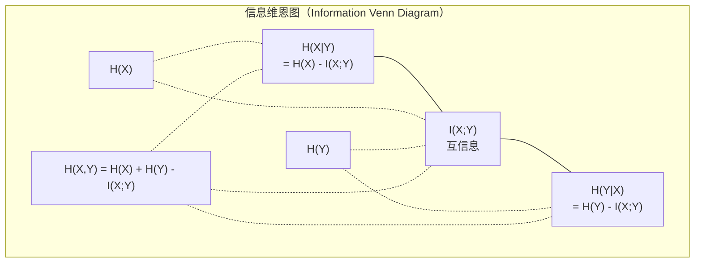

# 信息论（Information Theory）

> 信息论衡量意外程度，损失函数以此为基础。

**Type:** Learn
**Language:** Python
**Prerequisites:** 阶段 1，第 06 课（概率）
**Time:** ~60 分钟

## 学习目标（Learning Objectives）

- 从零计算熵（Entropy）、交叉熵（Cross-entropy）和 KL 散度（Kullback–Leibler Divergence，KL），解释它们之间的关系
- 推导为什么最小化交叉熵损失等价于最大化对数似然
- 计算特征与目标之间的互信息（Mutual Information），据此对特征重要性排序
- 将困惑度（Perplexity）解释为语言模型选择时面对的有效词表大小

## 问题（The Problem）

你训练每个分类模型时都会调用 `CrossEntropyLoss()`，在语言模型论文中会看到“困惑度”，在变分自编码器（Variational Autoencoder，VAE）、蒸馏和基于人类反馈的强化学习（Reinforcement Learning from Human Feedback，RLHF）中会读到 KL 散度。这些概念并非彼此孤立，而是同一思想的不同表现形式。

信息论提供了讨论不确定性、压缩和预测的语言。Claude Shannon 于 1948 年创立信息论，目的是解决通信问题。事实表明，训练神经网络也是通信问题：模型试图通过学得权重构成的有噪声信道，传递正确标签。

本课从零构建每个公式，让你理解它们的来源以及为何有效。

## 概念（The Concept）

### 信息量：意外程度（Information Content (Surprise)）

不太可能的事情发生时，携带的信息更多。硬币正面朝上？不意外。彩票中奖？很意外。

概率为 p 的事件，其信息量（Information Content）为：

```
I(x) = -log(p(x))
```

以 2 为底的对数得到比特（Bit），自然对数得到奈特（Nat）。概念相同，单位不同。

```
事件               概率           意外程度（比特）
公平硬币正面       0.5            1.0
掷出 6 点          0.167          2.58
千分之一的事件     0.001          9.97
必然事件           1.0            0.0
```

必然事件的信息量为零，因为你已经知道它们会发生。

### 熵：平均意外程度（Entropy (Average Surprise)）

熵是一个分布所有可能结果的意外程度的期望。

```
H(P) = -sum( p(x) * log(p(x)) )  for all x
```

公平硬币的熵达到二元变量的最大值：1 比特。有偏硬币（99% 为正面）的熵很低：0.08 比特。你基本知道结果，因此每次抛掷几乎不提供信息。

```
公平硬币：    H = -(0.5 * log2(0.5) + 0.5 * log2(0.5)) = 1.0 比特
有偏硬币：    H = -(0.99 * log2(0.99) + 0.01 * log2(0.01)) = 0.08 比特
```

熵衡量分布中不可消除的不确定性。压缩不能突破这个下限。

### 交叉熵：你每天使用的损失函数（Cross-Entropy (The Loss Function You Use Every Day)）

交叉熵衡量用分布 Q 编码实际来自分布 P 的事件时，平均有多意外。

```
H(P, Q) = -sum( p(x) * log(q(x)) )  for all x
```

P 是真实分布（标签），Q 是模型的预测。如果 Q 与 P 完全一致，交叉熵就等于熵。任何不匹配都会使它增大。

分类中，P 是独热向量（One-hot Vector，真实类别概率为 1，其余为 0）。因此交叉熵简化为：

```
H(P, Q) = -log(q(true_class))
```

这就是分类交叉熵损失的完整公式：最大化正确类别的预测概率。

### KL 散度：分布之间的距离（KL Divergence (Distance Between Distributions)）

KL 散度衡量用 Q 代替 P 时增加了多少意外程度。

```
D_KL(P || Q) = sum( p(x) * log(p(x) / q(x)) )  for all x
             = H(P, Q) - H(P)
```

交叉熵等于熵加 KL 散度。训练期间真实分布的熵恒定，因此最小化交叉熵就等于最小化 KL 散度。你在推动模型分布接近真实分布。

KL 散度不对称：D_KL(P || Q) != D_KL(Q || P)。它不是真正的距离度量。

### 互信息（Mutual Information）

互信息衡量知道一个变量后，能获得多少关于另一个变量的信息。

```
I(X; Y) = H(X) - H(X|Y)
        = H(X) + H(Y) - H(X, Y)
```

如果 X 与 Y 独立，互信息为零，知道一个变量并不能提供另一个变量的信息。如果两者完全相关，互信息等于任意一个变量的熵。

特征选择中，特征与目标的互信息高，说明特征有用；互信息低，则说明它是噪声。

### 条件熵（Conditional Entropy）

H(Y|X) 衡量观察 X 后，Y 还剩多少不确定性。

```
H(Y|X) = H(X,Y) - H(X)
```

两种极端情况：
- 如果 X 完全决定 Y，则 H(Y|X) = 0。知道 X 就消除了 Y 的全部不确定性。例如：X = 摄氏温度，Y = 华氏温度。
- 如果 X 不提供任何关于 Y 的信息，则 H(Y|X) = H(Y)。知道 X 完全不会减少不确定性。例如：X = 抛硬币的结果，Y = 明天的天气。

条件熵始终非负，且不超过 H(Y)：

```
0 <= H(Y|X) <= H(Y)
```

在机器学习中，决策树会使用条件熵。每次分裂时，算法选择使 H(Y|X) 最小的特征 X，即消除标签 Y 最多不确定性的特征。

### 联合熵（Joint Entropy）

H(X,Y) 是 X 与 Y 联合分布的熵。

```
H(X,Y) = -sum sum p(x,y) * log(p(x,y))   for all x, y
```

关键性质：

```
H(X,Y) <= H(X) + H(Y)
```

当 X 与 Y 独立时等号成立。如果它们共享信息，联合熵就小于各自熵之和。“少掉”的熵恰好就是互信息。



关系如下：
- H(X,Y) = H(X) + H(Y|X) = H(Y) + H(X|Y)
- I(X;Y) = H(X) - H(X|Y) = H(Y) - H(Y|X)
- H(X,Y) = H(X) + H(Y) - I(X;Y)

### 深入理解互信息（Mutual Information (Deep Dive)）

互信息 I(X;Y) 量化知道一个变量后，另一个变量的不确定性减少了多少。

```
I(X;Y) = H(X) - H(X|Y)
       = H(Y) - H(Y|X)
       = H(X) + H(Y) - H(X,Y)
       = sum sum p(x,y) * log(p(x,y) / (p(x) * p(y)))
```

性质：
- 始终有 I(X;Y) >= 0。观察不会使你损失信息。
- 当且仅当 X 与 Y 独立时，I(X;Y) = 0。
- I(X;Y) = I(Y;X)。它具有对称性，这与 KL 散度不同。
- I(X;X) = H(X)。变量与自身共享全部信息。

**用互信息做特征选择。** 在机器学习中，你需要能提供目标信息的特征。互信息给出了有理论依据的特征排序方法：

1. 对每个特征 X_i，计算 I(X_i; Y)，其中 Y 是目标变量。
2. 按互信息（MI）得分对特征排序。
3. 保留前 k 个特征。

这适用于特征与目标之间的任意关系：线性、非线性、单调或非单调。相关系数只能捕捉线性关系，MI 则能捕捉所有关系。

| 方法 | 可检测关系 | 计算成本 | 能处理类别变量？ |
|--------|---------|-------------------|---------------------|
| 皮尔逊相关（Pearson Correlation） | 线性关系 | O(n) | 否 |
| 斯皮尔曼相关（Spearman Correlation） | 单调关系 | O(n log n) | 否 |
| 互信息（Mutual Information） | 任意统计依赖 | 使用分箱时 O(n log n) | 是 |

### 标签平滑与交叉熵（Label Smoothing and Cross-Entropy）

标准分类使用硬目标：[0, 0, 1, 0]。真实类别概率为 1，其余为 0。标签平滑（Label Smoothing）用软目标替代它们：

```
soft_target = (1 - epsilon) * hard_target + epsilon / num_classes
```

当 epsilon = 0.1 且有 4 个类别时：
- 硬目标：[0, 0, 1, 0]
- 软目标：[0.025, 0.025, 0.925, 0.025]

从信息论角度看，标签平滑增加了目标分布的熵。硬独热目标的熵为 0，没有不确定性。软目标的熵为正。

这样做的好处：
- 防止模型将 logits 推到极端值（在交叉熵下，要完全匹配独热目标，需要无穷大的 logits）
- 起正则化作用：模型无法达到 100% 的信心
- 改善校准：预测概率更能反映真实不确定性
- 减少训练与推理行为之间的差异

使用标签平滑后，交叉熵损失变为：

```
L = (1 - epsilon) * CE(hard_target, prediction) + epsilon * H_uniform(prediction)
```

第二项惩罚偏离均匀分布的预测，直接对信心进行正则化。

### 交叉熵为何是标准分类损失（Why Cross-Entropy Is THE Classification Loss）

三个视角，结论相同。

**信息论视角。** 交叉熵衡量用模型分布代替真实分布时浪费了多少比特。最小化它，使模型成为现实最有效率的编码器。

**最大似然视角。** 对于真实类别为 y_i 的 N 个训练样本：

```
似然           = product( q(y_i) )
对数似然       = sum( log(q(y_i)) )
负对数似然     = -sum( log(q(y_i)) )
```

最后一行就是交叉熵损失。最小化交叉熵 = 最大化模型下训练数据的似然。

**梯度视角。** 交叉熵对 logits 的梯度就是 (predicted - true)，简洁、稳定、计算快。因此它与 softmax 非常契合。

### 比特与奈特（Bits vs Nats）

唯一的区别是对数的底。

```
以 2 为底的对数  -> 比特（bits，信息论传统）
以 e 为底的对数  -> 奈特（nats，机器学习惯例）
以 10 为底的对数 -> 哈特莱（hartleys，很少使用）
```

1 nat = 1/ln(2) bits = 1.4427 bits。PyTorch 和 TensorFlow 默认使用自然对数（奈特）。

### 困惑度（Perplexity）

困惑度是交叉熵的指数，表示模型无法确定选择时，相当于面对多少个等可能选项。

```
困惑度 = 2^H(P,Q)   （使用比特时）
困惑度 = e^H(P,Q)   （使用奈特时）
```

困惑度为 50 的语言模型，平均而言，相当于必须从 50 个可能的下一个词元中均匀选择。越低越好。

GPT-2 在常见基准上的困惑度约为 30。现代模型在训练数据充分覆盖的领域中可达到个位数。

```figure
entropy-kl
```

## 动手实现（Build It）

### 第 1 步：信息量与熵（Step 1: Information content and entropy）

```python
import math

def information_content(p, base=2):
    if p <= 0 or p > 1:
        return float('inf') if p <= 0 else 0.0
    return -math.log(p) / math.log(base)

def entropy(probs, base=2):
    return sum(
        p * information_content(p, base)
        for p in probs if p > 0
    )

fair_coin = [0.5, 0.5]
biased_coin = [0.99, 0.01]
fair_die = [1/6] * 6

print(f"Fair coin entropy:   {entropy(fair_coin):.4f} bits")
print(f"Biased coin entropy: {entropy(biased_coin):.4f} bits")
print(f"Fair die entropy:    {entropy(fair_die):.4f} bits")
```

### 第 2 步：交叉熵与 KL 散度（Step 2: Cross-entropy and KL divergence）

```python
def cross_entropy(p, q, base=2):
    total = 0.0
    for pi, qi in zip(p, q):
        if pi > 0:
            if qi <= 0:
                return float('inf')
            total += pi * (-math.log(qi) / math.log(base))
    return total

def kl_divergence(p, q, base=2):
    return cross_entropy(p, q, base) - entropy(p, base)

true_dist = [0.7, 0.2, 0.1]
good_model = [0.6, 0.25, 0.15]
bad_model = [0.1, 0.1, 0.8]

print(f"Entropy of true dist:     {entropy(true_dist):.4f} bits")
print(f"CE (good model):          {cross_entropy(true_dist, good_model):.4f} bits")
print(f"CE (bad model):           {cross_entropy(true_dist, bad_model):.4f} bits")
print(f"KL divergence (good):     {kl_divergence(true_dist, good_model):.4f} bits")
print(f"KL divergence (bad):      {kl_divergence(true_dist, bad_model):.4f} bits")
```

### 第 3 步：将交叉熵用作分类损失（Step 3: Cross-entropy as classification loss）

```python
def softmax(logits):
    max_logit = max(logits)
    exps = [math.exp(z - max_logit) for z in logits]
    total = sum(exps)
    return [e / total for e in exps]

def cross_entropy_loss(true_class, logits):
    probs = softmax(logits)
    return -math.log(probs[true_class])

logits = [2.0, 1.0, 0.1]
true_class = 0

probs = softmax(logits)
loss = cross_entropy_loss(true_class, logits)

print(f"Logits:      {logits}")
print(f"Softmax:     {[f'{p:.4f}' for p in probs]}")
print(f"True class:  {true_class}")
print(f"Loss:        {loss:.4f} nats")
print(f"Perplexity:  {math.exp(loss):.2f}")
```

### 第 4 步：交叉熵等于负对数似然（Step 4: Cross-entropy equals negative log-likelihood）

```python
import random

random.seed(42)

n_samples = 1000
n_classes = 3
true_labels = [random.randint(0, n_classes - 1) for _ in range(n_samples)]
model_logits = [[random.gauss(0, 1) for _ in range(n_classes)] for _ in range(n_samples)]

ce_loss = sum(
    cross_entropy_loss(label, logits)
    for label, logits in zip(true_labels, model_logits)
) / n_samples

nll = -sum(
    math.log(softmax(logits)[label])
    for label, logits in zip(true_labels, model_logits)
) / n_samples

print(f"Cross-entropy loss:      {ce_loss:.6f}")
print(f"Negative log-likelihood: {nll:.6f}")
print(f"Difference:              {abs(ce_loss - nll):.2e}")
```

### 第 5 步：互信息（Step 5: Mutual information）

```python
def mutual_information(joint_probs, base=2):
    rows = len(joint_probs)
    cols = len(joint_probs[0])

    margin_x = [sum(joint_probs[i][j] for j in range(cols)) for i in range(rows)]
    margin_y = [sum(joint_probs[i][j] for i in range(rows)) for j in range(cols)]

    mi = 0.0
    for i in range(rows):
        for j in range(cols):
            pxy = joint_probs[i][j]
            if pxy > 0:
                mi += pxy * math.log(pxy / (margin_x[i] * margin_y[j])) / math.log(base)
    return mi

independent = [[0.25, 0.25], [0.25, 0.25]]
dependent = [[0.45, 0.05], [0.05, 0.45]]

print(f"MI (independent): {mutual_information(independent):.4f} bits")
print(f"MI (dependent):   {mutual_information(dependent):.4f} bits")
```

## 实际应用（Use It）

用 NumPy 实现相同概念，这也是实践中的用法：

```python
import numpy as np

def np_entropy(p):
    p = np.asarray(p, dtype=float)
    mask = p > 0
    result = np.zeros_like(p)
    result[mask] = p[mask] * np.log(p[mask])
    return -result.sum()

def np_cross_entropy(p, q):
    p, q = np.asarray(p, dtype=float), np.asarray(q, dtype=float)
    mask = p > 0
    return -(p[mask] * np.log(q[mask])).sum()

def np_kl_divergence(p, q):
    return np_cross_entropy(p, q) - np_entropy(p)

true = np.array([0.7, 0.2, 0.1])
pred = np.array([0.6, 0.25, 0.15])
print(f"Entropy:    {np_entropy(true):.4f} nats")
print(f"Cross-ent:  {np_cross_entropy(true, pred):.4f} nats")
print(f"KL div:     {np_kl_divergence(true, pred):.4f} nats")
```

你从零实现了 `torch.nn.CrossEntropyLoss()` 内部的计算。现在你知道训练中损失为什么下降了：以浪费信息的奈特数衡量，模型的预测分布正在接近真实分布。

## 练习（Exercises）

1. 假设英语字母均匀分布（26 个字母），计算其熵，再用实际字母频率估计。哪个更高？为什么？

2. 模型对真实类别为 1 的样本输出 logits [5.0, 2.0, 0.5]。手算交叉熵损失，再用你的 `cross_entropy_loss` 函数验证。什么 logits 会得到零损失？

3. 展示 KL 散度不对称。选择两个分布 P 和 Q，计算 D_KL(P || Q) 与 D_KL(Q || P)，解释它们为何不同。

4. 构建函数，计算词元预测序列的困惑度。给定 (true_token_index, predicted_logits) 对的列表，返回序列的困惑度。

## 关键术语（Key Terms）

| 术语 | 通俗说法 | 实际含义 |
|------|----------------|----------------------|
| 信息量（Information Content） | “意外程度” | 编码事件所需的比特数（或奈特数）：-log(p) |
| 熵（Entropy） | “随机性” | 分布所有结果的平均意外程度，衡量不可消除的不确定性。 |
| 交叉熵（Cross-entropy） | “损失函数” | 用模型分布 Q 编码来自真实分布 P 的事件时，平均的意外程度。 |
| KL 散度（KL Divergence） | “分布间的距离” | 用 Q 代替 P 浪费的额外比特，等于交叉熵减熵，不对称。 |
| 互信息（Mutual Information） | “X 和 Y 有多相关” | 知道 Y 后，X 的不确定性减少的量。零表示独立。 |
| Softmax | “把 logits 转为概率” | 求指数并归一化，将任意实数向量映射为有效概率分布。 |
| 困惑度（Perplexity） | “模型有多困惑” | 交叉熵的指数，模型每一步选择时面对的有效词表大小。 |
| 比特（Bits） | “Shannon 的单位” | 用以 2 为底的对数衡量的信息。1 比特消除一次公平抛硬币的不确定性。 |
| 奈特（Nats） | “机器学习的单位” | 用自然对数衡量的信息，是 PyTorch 和 TensorFlow 的默认单位。 |
| 负对数似然（Negative Log-likelihood，NLL） | “NLL 损失” | 对独热标签而言等同于交叉熵损失。最小化它就是最大化正确预测的概率。 |

## 延伸阅读（Further Reading）

- [Shannon 1948：通信的数学理论](https://people.math.harvard.edu/~ctm/home/text/others/shannon/entropy/entropy.pdf) - 原始论文，至今仍值得阅读
- [可视化信息论（Chris Olah）](https://colah.github.io/posts/2015-09-Visual-Information/) - 熵与 KL 散度的出色可视化解释
- [PyTorch CrossEntropyLoss 文档](https://pytorch.org/docs/stable/generated/torch.nn.CrossEntropyLoss.html) - 框架如何实现你刚刚构建的功能
