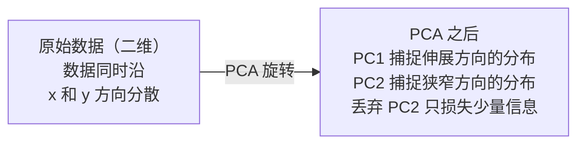

# 降维（Dimensionality Reduction）

> 高维数据蕴含结构，从合适的角度观察就能发现它。

**Type:** Build
**Language:** Python
**Prerequisites:** 阶段 1，第 01 课（线性代数直觉）、第 02 课（向量、矩阵与运算）、第 03 课（特征值与特征向量）、第 06 课（概率与分布）
**Time:** ~90 分钟

## 学习目标（Learning Objectives）

- 从零实现主成分分析（Principal Component Analysis，PCA）：中心化数据、计算协方差矩阵、特征分解并投影
- 使用解释方差比（Explained Variance Ratio）与肘部法（Elbow Method）选择主成分数量
- 比较 PCA、t-SNE 和 UMAP 对 MNIST 数字进行二维可视化的效果，并说明它们的权衡
- 应用带径向基函数核（Radial Basis Function，RBF）的核 PCA，分离标准 PCA 无法处理的非线性数据结构

## 问题（The Problem）

你的数据集中，每个样本有 784 个特征。它们可能是手写数字的像素值、基因表达水平，或用户行为信号。你无法可视化 784 个维度，无法把它们画出来，甚至无法在脑中想象。

但这 784 个特征大多冗余。真正的信息位于一个小得多的曲面上。描述一个手写的 "7"，不需要 784 个独立数值，只需几个：笔画角度、横线长度、倾斜程度。其余是噪声。

降维就是寻找这个更小的曲面。它把 784 维数据压缩到 2、10 或 50 维，同时保留重要结构。

## 概念（The Concept）

### 维度灾难（The curse of dimensionality）

高维空间违背直觉。随着维度增加，三方面会出现问题。

**距离失去意义。** 在高维空间中，任意两个随机点之间的距离趋于相同。如果每个点到其他点的距离都差不多，最近邻搜索就会失效。

```
维度         平均距离比（随机点之间的最大值/最小值）
2            ~5.0
10           ~1.8
100          ~1.2
1000         ~1.02
```

**体积集中在角落。** d 维单位超立方体有 2^d 个角。在 100 维中，几乎所有体积都位于远离中心的角落。数据点散布到边缘，模型在内部区域得不到足够数据。

**数据需求呈指数增长。** 为保持相同的样本密度，从 2 维扩展到 20 维意味着需要 10^18 倍的数据。数据永远不够。降低维度能使数据密度回到可用水平。

### PCA：寻找重要方向（PCA: find the directions that matter）

主成分分析（PCA）寻找数据变化最大的轴。它旋转坐标系，使第一根轴捕捉最多方差，第二根轴捕捉次多方差，以此类推。

算法如下：

```
1. 中心化数据             （每个特征减去其均值）
2. 计算协方差             （特征如何共同变化）
3. 特征分解               （寻找主要方向）
4. 按特征值排序           （方差最大的在前）
5. 投影                   （保留前 k 个特征向量，丢弃其余）
```

为什么使用特征分解（Eigendecomposition）？协方差矩阵（Covariance Matrix）对称且半正定。其特征向量是特征空间中的正交方向，特征值说明每个方向捕捉了多少方差。最大特征值对应的特征向量指向最大方差方向。



- **PCA 之前：** 数据点云沿对角方向分布，跨越 x、y 两轴
- **PCA 之后：** 坐标系旋转，使 PC1 对齐最大方差方向（伸展方向），PC2 对齐最小方差方向（狭窄方向）
- **降维：** 丢弃 PC2 相当于将数据投影到 PC1，仅损失少量信息

### 解释方差比（Explained variance ratio）

每个主成分（Principal Component）捕捉总方差的一部分，解释方差比告诉你这一部分有多大。

```
主成分       特征值        解释方差比         累积值
PC1          4.73          0.473              0.473
PC2          2.51          0.251              0.724
PC3          1.12          0.112              0.836
PC4          0.89          0.089              0.925
...
```

当累积解释方差达到 0.95 时，说明这些主成分捕捉了 95% 的信息。之后的成分大多是噪声。

### 选择主成分数量（Choosing the number of components）

三种策略：

1. **阈值。** 保留足够多的主成分，解释 90–95% 的方差。
2. **肘部法。** 绘制各主成分的解释方差，寻找急剧下降的位置。
3. **下游性能。** 用 PCA 做预处理，扫描 k 并衡量模型准确率。准确率进入平台期的位置就是最佳 k。

### t-SNE：保留邻域（t-SNE: preserve neighborhoods）

t 分布随机邻域嵌入（t-Distributed Stochastic Neighbor Embedding，t-SNE）专为可视化设计。它将高维数据映射到二维（或三维），同时保留点之间的邻近关系。

直觉是：在原始空间中，根据距离计算点对上的概率分布。近点概率高，远点概率低。然后寻找保持相同概率分布的二维布局。原本在 784 维中相邻的点，在二维中仍然相邻。

t-SNE 的关键性质：
- 非线性。它能展开 PCA 无法处理的复杂流形（Manifold）。
- 随机性。不同运行会产生不同布局。
- 困惑度（Perplexity）参数控制考虑多少邻居（典型范围：5–50）。
- 输出中簇与簇之间的距离没有意义，只有簇本身有意义。
- 大型数据集上较慢，默认复杂度为 O(n^2)。

### UMAP：更快且更好地保留全局结构（UMAP: faster, better global structure）

统一流形近似与投影（Uniform Manifold Approximation and Projection，UMAP）的工作方式与 t-SNE 类似，但有两个优势：
- 更快。它使用近似最近邻图，而不计算所有点对的距离。
- 全局结构更好。输出中各簇的相对位置通常比 t-SNE 更有意义。

UMAP 在高维空间构建加权图（“模糊拓扑表示”，Fuzzy Topological Representation），再寻找尽可能保留该图的低维布局。

关键参数：
- `n_neighbors`：用多少邻居定义局部结构（类似困惑度）。值越大，保留的全局结构越多。
- `min_dist`：输出中点聚集得有多紧密。值越小，簇越密集。

### 如何选择方法（When to use which）

| 方法 | 使用场景 | 保留内容 | 速度 |
|--------|----------|-----------|-------|
| PCA | 训练前预处理 | 全局方差 | 快（精确），可处理数百万样本 |
| PCA | 快速探索性可视化 | 线性结构 | 快 |
| t-SNE | 可用于发表的二维图 | 局部邻域 | 慢（理想情况为 < 10k 样本） |
| UMAP | 大规模二维可视化 | 局部及部分全局结构 | 中等（可处理数百万样本） |
| PCA | 模型特征降维 | 按方差排序的特征 | 快 |
| t-SNE / UMAP | 理解簇结构 | 簇的分离情况 | 中等到慢 |

经验法则：预处理与数据压缩使用 PCA，需要二维结构可视化时使用 t-SNE 或 UMAP。

### 核主成分分析（Kernel PCA）

标准 PCA 寻找线性子空间，旋转坐标系并丢弃坐标轴。但如果数据位于非线性流形上呢？二维中的圆无法用直线分离，标准 PCA 无法提供帮助。

核 PCA 在核函数诱导的高维特征空间中应用 PCA，而不显式计算该空间的坐标。这就是核技巧（Kernel Trick），与支持向量机（Support Vector Machine，SVM）背后的思想相同。

算法如下：
1. 计算核矩阵 K，其中 K_ij = k(x_i, x_j)
2. 在特征空间中中心化核矩阵
3. 对中心化后的核矩阵做特征分解
4. 前几个特征向量（按 1/sqrt(eigenvalue) 缩放）就是投影

常见核函数：

| 核 | 公式 | 适用情况 |
|--------|---------|----------|
| 径向基函数（RBF，高斯） | exp(-gamma * \|\|x - y\|\|^2) | 多数非线性数据、光滑流形 |
| 多项式（Polynomial） | (x . y + c)^d | 多项式关系 |
| Sigmoid | tanh(alpha * x . y + c) | 类似神经网络的映射 |

核 PCA 与标准 PCA 的选择：

| 标准 | 标准 PCA | 核 PCA |
|-----------|-------------|------------|
| 数据结构 | 线性子空间 | 非线性流形 |
| 速度 | O(min(n^2 d, d^2 n)) | O(n^2 d + n^3) |
| 可解释性 | 主成分是特征的线性组合 | 主成分无法直接从特征角度解释 |
| 可扩展性 | 可处理数百万样本 | 核矩阵为 n x n，受内存限制 |
| 重建 | 直接逆变换 | 需要原像近似（Pre-image Approximation） |

经典例子是二维同心圆：两圈点，一圈位于另一圈内部。标准 PCA 把它们投影到同一条线上，对分类无用。使用 RBF 核的核 PCA 将内圈与外圈映射到不同区域，使它们线性可分。

### 重建误差（Reconstruction Error）

降维效果如何？把 784 维压缩到 50 维，丢失了什么？

衡量重建误差：
1. 将数据投影到 k 维：X_reduced = X @ W_k
2. 重建：X_hat = X_reduced @ W_k^T
3. 计算均方误差（Mean Squared Error，MSE）：mean((X - X_hat)^2)

对于 PCA，重建误差与解释方差之间存在简洁关系：

```
重建误差 = 未保留特征值的总和
总方差 = 所有特征值的总和
丢失比例 = （丢弃特征值的总和）/（所有特征值的总和）
```

每个主成分的解释方差比为：

```
explained_ratio_k = eigenvalue_k / sum(all eigenvalues)
```

以主成分数量为横轴、累积解释方差为纵轴绘图，得到“肘部”曲线。合适的主成分数量位于：
- 曲线趋平处（收益递减）
- 累积方差越过阈值处（通常为 0.90 或 0.95）
- 下游任务性能进入平台期处

重建误差不仅能用于选择 k，也能用于异常检测：重建误差高的样本是不符合学得子空间的离群值。这是生产系统中基于 PCA 的异常检测的基础。

```figure
pca-axes
```

## 动手实现（Build It）

### 第 1 步：从零实现 PCA（Step 1: PCA from scratch）

```python
import numpy as np

class PCA:
    def __init__(self, n_components):
        self.n_components = n_components
        self.components = None
        self.mean = None
        self.eigenvalues = None
        self.explained_variance_ratio_ = None

    def fit(self, X):
        self.mean = np.mean(X, axis=0)
        X_centered = X - self.mean

        cov_matrix = np.cov(X_centered, rowvar=False)

        eigenvalues, eigenvectors = np.linalg.eigh(cov_matrix)

        sorted_idx = np.argsort(eigenvalues)[::-1]
        eigenvalues = eigenvalues[sorted_idx]
        eigenvectors = eigenvectors[:, sorted_idx]

        self.components = eigenvectors[:, :self.n_components].T
        self.eigenvalues = eigenvalues[:self.n_components]
        total_var = np.sum(eigenvalues)
        self.explained_variance_ratio_ = self.eigenvalues / total_var

        return self

    def transform(self, X):
        X_centered = X - self.mean
        return X_centered @ self.components.T

    def fit_transform(self, X):
        self.fit(X)
        return self.transform(X)
```

### 第 2 步：在合成数据上测试（Step 2: Test on synthetic data）

```python
np.random.seed(42)
n_samples = 500

t = np.random.uniform(0, 2 * np.pi, n_samples)
x1 = 3 * np.cos(t) + np.random.normal(0, 0.2, n_samples)
x2 = 3 * np.sin(t) + np.random.normal(0, 0.2, n_samples)
x3 = 0.5 * x1 + 0.3 * x2 + np.random.normal(0, 0.1, n_samples)

X_synthetic = np.column_stack([x1, x2, x3])

pca = PCA(n_components=2)
X_reduced = pca.fit_transform(X_synthetic)

print(f"Original shape: {X_synthetic.shape}")
print(f"Reduced shape:  {X_reduced.shape}")
print(f"Explained variance ratios: {pca.explained_variance_ratio_}")
print(f"Total variance captured: {sum(pca.explained_variance_ratio_):.4f}")
```

### 第 3 步：二维 MNIST 数字（Step 3: MNIST digits in 2D）

```python
from sklearn.datasets import fetch_openml

mnist = fetch_openml("mnist_784", version=1, as_frame=False, parser="auto")
X_mnist = mnist.data[:5000].astype(float)
y_mnist = mnist.target[:5000].astype(int)

pca_mnist = PCA(n_components=50)
X_pca50 = pca_mnist.fit_transform(X_mnist)
print(f"50 components capture {sum(pca_mnist.explained_variance_ratio_):.2%} of variance")

pca_2d = PCA(n_components=2)
X_pca2d = pca_2d.fit_transform(X_mnist)
print(f"2 components capture {sum(pca_2d.explained_variance_ratio_):.2%} of variance")
```

### 第 4 步：与 sklearn 比较（Step 4: Compare with sklearn）

```python
from sklearn.decomposition import PCA as SklearnPCA
from sklearn.manifold import TSNE

sklearn_pca = SklearnPCA(n_components=2)
X_sklearn_pca = sklearn_pca.fit_transform(X_mnist)

print(f"\nOur PCA explained variance:     {pca_2d.explained_variance_ratio_}")
print(f"Sklearn PCA explained variance: {sklearn_pca.explained_variance_ratio_}")

diff = np.abs(np.abs(X_pca2d) - np.abs(X_sklearn_pca))
print(f"Max absolute difference: {diff.max():.10f}")

tsne = TSNE(n_components=2, perplexity=30, random_state=42)
X_tsne = tsne.fit_transform(X_mnist)
print(f"\nt-SNE output shape: {X_tsne.shape}")
```

### 第 5 步：UMAP 比较（Step 5: UMAP comparison）

```python
try:
    from umap import UMAP

    reducer = UMAP(n_components=2, n_neighbors=15, min_dist=0.1, random_state=42)
    X_umap = reducer.fit_transform(X_mnist)
    print(f"UMAP output shape: {X_umap.shape}")
except ImportError:
    print("Install umap-learn: pip install umap-learn")
```

## 实际应用（Use It）

用 PCA 作为分类器前的预处理：

```python
from sklearn.decomposition import PCA as SklearnPCA
from sklearn.linear_model import LogisticRegression
from sklearn.model_selection import train_test_split
from sklearn.metrics import accuracy_score

X_train, X_test, y_train, y_test = train_test_split(
    X_mnist, y_mnist, test_size=0.2, random_state=42
)

results = {}
for k in [10, 30, 50, 100, 200]:
    pca_k = SklearnPCA(n_components=k)
    X_tr = pca_k.fit_transform(X_train)
    X_te = pca_k.transform(X_test)

    clf = LogisticRegression(max_iter=1000, random_state=42)
    clf.fit(X_tr, y_train)
    acc = accuracy_score(y_test, clf.predict(X_te))
    var_captured = sum(pca_k.explained_variance_ratio_)
    results[k] = (acc, var_captured)
    print(f"k={k:>3d}  accuracy={acc:.4f}  variance={var_captured:.4f}")
```

远未达到 784 维时，性能就进入平台期。该平台期就是适合使用的配置点。

## 交付成果（Ship It）

本课交付：
- `outputs/skill-dimensionality-reduction.md` - 为给定任务选择合适降维技术的技能

## 练习（Exercises）

1. 修改 PCA 类，使其支持 `inverse_transform`。分别用 10、50 和 200 个主成分重建 MNIST 数字，打印各自的重建误差（与原始数据差值的均方）。

2. 在同一 MNIST 子集上，分别用困惑度 5、30 和 100 运行 t-SNE。描述输出如何变化。为什么困惑度会影响簇的紧密程度？

3. 取一个包含 50 个特征、其中只有 5 个提供信息的数据集（用 `sklearn.datasets.make_classification` 生成）。应用 PCA，检查解释方差曲线是否正确识别出数据实质上是 5 维的。

## 关键术语（Key Terms）

| 术语 | 通俗说法 | 实际含义 |
|------|----------------|----------------------|
| 维度灾难（Curse of Dimensionality） | “特征太多” | 随维度增加，距离、体积和数据密度都表现得违背直觉，模型需要指数增长的数据来弥补。 |
| 主成分分析（PCA） | “减少维度” | 旋转坐标系，使轴对齐最大方差方向，然后丢弃低方差轴。 |
| 主成分（Principal Component） | “重要方向” | 协方差矩阵的特征向量，即特征空间中数据变化最多的方向。 |
| 解释方差比（Explained Variance Ratio） | “这个成分有多少信息” | 一个主成分捕捉的总方差比例。将前 k 个比例求和，可知 k 个成分保留了多少信息。 |
| 协方差矩阵（Covariance Matrix） | “特征如何相关” | 对称矩阵，其中 (i,j) 项衡量特征 i 和 j 如何共同变化，对角项为各特征的方差。 |
| t 分布随机邻域嵌入（t-SNE） | “那个聚类图” | 通过保留点对邻域概率将高维数据映射到二维的非线性方法，适合可视化，不适合预处理。 |
| 统一流形近似与投影（UMAP） | “更快的 t-SNE” | 基于拓扑数据分析的非线性方法，保留局部和部分全局结构，比 t-SNE 更易扩展。 |
| 困惑度（Perplexity） | “t-SNE 的调节旋钮” | 控制每个点考虑的有效邻居数量。低困惑度关注很局部的结构，高困惑度捕捉更广泛的模式。 |
| 流形（Manifold） | “数据所在的曲面” | 嵌入高维空间的低维曲面。一张在三维空间中揉皱的纸就是二维流形。 |

## 延伸阅读（Further Reading）

- [主成分分析教程](https://arxiv.org/abs/1404.1100)（Shlens）- 从基础开始清晰推导 PCA
- [如何有效使用 t-SNE](https://distill.pub/2016/misread-tsne/)（Wattenberg 等）- 关于 t-SNE 陷阱与参数选择的交互指南
- [UMAP 文档](https://umap-learn.readthedocs.io/) - UMAP 作者提供的理论与实践指导
