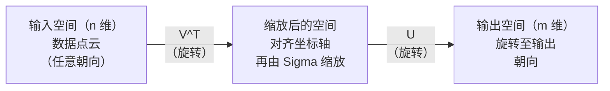
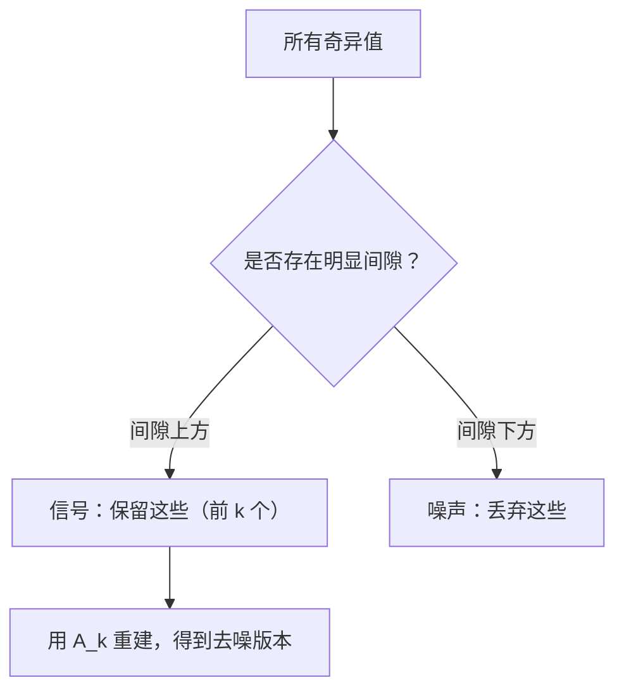

# 奇异值分解（Singular Value Decomposition）

> 奇异值分解是线性代数的瑞士军刀。每个矩阵都能做 SVD，每位数据科学家都需要掌握它。

**Type:** Build
**Languages:** Python, Julia
**Prerequisites:** 阶段 1，第 01 课（线性代数直觉）、第 02 课（向量与矩阵运算）、第 03 课（矩阵变换）
**Time:** ~120 分钟

## 学习目标（Learning Objectives）

- 通过幂迭代（Power Iteration）实现奇异值分解（Singular Value Decomposition，SVD），解释 U、Sigma 和 V^T 的几何含义
- 应用截断 SVD 压缩图像，并衡量压缩比与重建误差之间的关系
- 通过 SVD 计算 Moore-Penrose 伪逆（Pseudoinverse），求解超定最小二乘系统
- 将 SVD 与主成分分析（Principal Component Analysis，PCA）、推荐系统（潜在因子）和自然语言处理（Natural Language Processing，NLP）中的潜在语义分析联系起来

## 问题（The Problem）

你有一个 1000x2000 矩阵。它可能是用户–电影评分、文档–词项频率表，也可能是图像的像素值。你需要压缩、去噪、发现隐藏结构，或用它求解最小二乘系统。特征分解（Eigendecomposition）只适用于方阵，而且即使是方阵，也必须拥有一组完备的线性无关特征向量。

SVD 适用于任意矩阵，任意形状、任意秩，没有额外条件。它将矩阵分解为三个因子，揭示矩阵如何在几何上作用于空间。它是线性代数中最通用、最有用的分解。

## 概念（The Concept）

### SVD 的几何作用（What SVD does geometrically）

无论形状如何，每个矩阵都依次执行三种操作：旋转、缩放、旋转。SVD 将这一分解显式表示出来。

```
A = U * Sigma * V^T

      m x n     m x m    m x n    n x n
     （任意）  （旋转）  （缩放）  （旋转）
```

给定任意矩阵 A，SVD 将它分解为：
- V^T 在输入空间（n 维）旋转向量
- Sigma 沿各轴缩放（拉伸或压缩）
- U 将结果旋转到输出空间（m 维）



可以这样理解：把矩阵交给 SVD，它告诉你：“这个矩阵将球形输入先用 V^T 旋转，再用 Sigma 拉伸成椭球，最后用 U 旋转椭球。”奇异值就是椭球各轴的长度。

### 完整分解（The full decomposition）

对于形状为 m x n 的矩阵 A：

```
A = U * Sigma * V^T

其中：
  U     为 m x m 正交矩阵（U^T U = I）
  Sigma 为 m x n 对角矩阵（对角线上是奇异值）
  V     为 n x n 正交矩阵（V^T V = I）

奇异值满足 sigma_1 >= sigma_2 >= ... >= sigma_r > 0
其中 r = rank(A)
```

U 的列称为左奇异向量（Left Singular Vector），V 的列称为右奇异向量（Right Singular Vector），Sigma 的对角元素称为奇异值（Singular Value）。奇异值始终非负，通常按降序排列。

### 左奇异向量、奇异值与右奇异向量（Left singular vectors, singular values, right singular vectors）

SVD 的每个组成部分都有明确的几何含义。

**右奇异向量（V 的列）：** 构成输入空间（R^n）的标准正交基。这些输入方向经矩阵映射后，对应输出空间中的正交方向。可以把它们视为定义域的自然坐标系。

**奇异值（Sigma 的对角线）：** 它们是缩放因子。第 i 个奇异值告诉你，矩阵沿第 i 个右奇异向量方向将向量拉伸多少。奇异值为零，意味着矩阵将该方向完全压扁。

**左奇异向量（U 的列）：** 构成输出空间（R^m）的标准正交基。第 i 个左奇异向量是第 i 个右奇异向量缩放后落入的输出方向。

它们之间的关系：

```
A * v_i = sigma_i * u_i

矩阵 A 将第 i 个右奇异向量 v_i
按 sigma_i 缩放，并映射到第 i 个左奇异向量 u_i 的方向。
```

这让你可以逐个坐标方向理解任意矩阵的作用。

### 外积形式（Outer product form）

SVD 可以写成秩为 1 的矩阵之和：

```
A = sigma_1 * u_1 * v_1^T + sigma_2 * u_2 * v_2^T + ... + sigma_r * u_r * v_r^T

每一项 sigma_i * u_i * v_i^T 都是秩为 1 的矩阵（外积）。
完整矩阵是 r 个这样的矩阵之和，其中 r 为秩。
```

这种形式是低秩近似（Low-rank Approximation）的基础。每一项增加一层结构：第一项捕捉最重要的模式，第二项捕捉次重要模式，以此类推。截断这个和式，就能得到任意给定秩下的最佳近似。

```
秩 1 近似：      A_1 = sigma_1 * u_1 * v_1^T
                  （捕捉主导模式）

秩 2 近似：      A_2 = sigma_1 * u_1 * v_1^T + sigma_2 * u_2 * v_2^T
                  （捕捉两个最重要的模式）

秩 k 近似：      A_k = 前 k 项之和
                  （由 Eckart-Young 定理保证最优）
```

### 与特征分解的关系（Relationship to eigendecomposition）

SVD 与特征分解有深刻联系。A 的奇异值和奇异向量，直接来自 A^T A 和 A A^T 的特征值与特征向量。

```
A^T A = V * Sigma^T * U^T * U * Sigma * V^T
      = V * Sigma^T * Sigma * V^T
      = V * D * V^T

其中 D = Sigma^T * Sigma 是对角矩阵，对角元素为 sigma_i^2。

因此：
- 右奇异向量（V）是 A^T A 的特征向量
- 奇异值的平方（sigma_i^2）是 A^T A 的特征值

类似地：
A A^T = U * Sigma * V^T * V * Sigma^T * U^T
      = U * Sigma * Sigma^T * U^T

因此：
- 左奇异向量（U）是 A A^T 的特征向量
- A A^T 的特征值也是 sigma_i^2
```

这一联系说明三点：
1. 奇异值始终为非负实数（它们是半正定矩阵特征值的平方根）。
2. 可以通过 A^T A 的特征分解计算 SVD，但这会使条件数平方，损失数值精度。专门的 SVD 算法会避免这一点。
3. 当 A 为对称半正定方阵时，SVD 与特征分解是同一件事。

### 截断 SVD：低秩近似（Truncated SVD: low-rank approximation）

Eckart-Young-Mirsky 定理表明，只保留前 k 个奇异值及对应向量，即可得到 A 的最佳秩 k 近似（对弗罗贝尼乌斯范数和谱范数均成立）：

```
A_k = U_k * Sigma_k * V_k^T

其中：
  U_k     为 m x k（U 的前 k 列）
  Sigma_k 为 k x k（Sigma 左上角的 k x k 子块）
  V_k     为 n x k（V 的前 k 列）

近似误差 = sigma_{k+1}（谱范数）
         = sqrt(sigma_{k+1}^2 + ... + sigma_r^2)（弗罗贝尼乌斯范数）
```

这不只是“不错的”近似，而是可以证明的最佳秩 k 近似。没有其他秩 k 矩阵比它更接近 A。

| 分量 | 相对大小 | 秩 3 近似中保留？ |
|-----------|-------------------|------------------------|
| sigma_1 | 最大 | 是 |
| sigma_2 | 大 | 是 |
| sigma_3 | 中等偏大 | 是 |
| sigma_4 | 中等 | 否（误差） |
| sigma_5 | 中等偏小 | 否（误差） |
| sigma_6 | 小 | 否（误差） |
| sigma_7 | 很小 | 否（误差） |
| sigma_8 | 极小 | 否（误差） |

保留前 3 个：A_3 捕捉三个最大的奇异值。误差 = 剩余值（sigma_4 到 sigma_8）。

如果奇异值衰减快，较小的 k 就能捕捉矩阵的大部分内容。如果衰减慢，矩阵就没有低秩结构。

### 使用 SVD 压缩图像（Image compression with SVD）

灰度图像是像素强度矩阵。一张 800x600 图像包含 480,000 个数值。SVD 让你用少得多的数值近似它。

```
原始图像：800 x 600 = 480,000 个数值

秩为 k 的 SVD：
  U_k:      800 x k 个数值
  Sigma_k:  k 个数值
  V_k:      600 x k 个数值
  总计：    k * (800 + 600 + 1) = k * 1401 个数值

  k=10:   14,010 个数值（原始的 2.9%）
  k=50:   70,050 个数值（原始的 14.6%）
  k=100: 140,100 个数值（原始的 29.2%）

  k 越小，压缩效果越好，
  但视觉质量会下降。
```

关键在于：自然图像的奇异值通常迅速衰减。前几个奇异值捕捉整体结构（形状、渐变），后面的捕捉细节和噪声。截断到秩 50 时，图像往往看起来与原图几乎相同，却少用 85% 的存储空间。

### SVD 用于推荐系统（SVD for recommendation systems）

Netflix Prize 让这种方法广为人知。你有一个用户–电影评分矩阵，其中大部分条目缺失。

```
             电影1   电影2   电影3   电影4   电影5
  用户1      [  5      ?       3       ?       1  ]
  用户2      [  ?      4       ?       2       ?  ]
  用户3      [  3      ?       5       ?       ?  ]
  用户4      [  ?      ?       ?       4       3  ]

  ? = 未知评分
```

思路是：评分矩阵具有低秩结构。用户的品味并非完全独立。少数潜在因子（Latent Factor，如动作片与剧情片、新片与老片、重思考与重感官）就能解释多数偏好。

对填补后的评分矩阵做 SVD，将其分解为：
- U：潜在因子空间中的用户画像
- Sigma：各潜在因子的重要性
- V^T：潜在因子空间中的电影画像

用户对电影的预测评分，是用户画像与电影画像的点积（以奇异值加权）。低秩近似填补了缺失条目。

实践中会使用 Simon Funk 的增量 SVD 或交替最小二乘（Alternating Least Squares，ALS）等能直接处理缺失数据的变体。但核心思想相同：通过 SVD 分解潜在因子。

### NLP 中的 SVD：潜在语义分析（SVD in NLP: Latent Semantic Analysis）

潜在语义分析（Latent Semantic Analysis，LSA），也称潜在语义索引（Latent Semantic Indexing，LSI），将 SVD 应用于词项–文档矩阵。

```
             文档1  文档2  文档3  文档4
  "cat"      [  3      0      1      0  ]
  "dog"      [  2      0      0      1  ]
  "fish"     [  0      4      1      0  ]
  "pet"      [  1      1      1      1  ]
  "ocean"    [  0      3      0      0  ]

进行秩 k=2 的 SVD 后：

  每篇文档成为二维“概念空间”中的一个点。
  每个词项成为同一二维空间中的一个点。
  主题相似的文档聚在一起。
  含义相似的词项聚在一起。

  "cat" 与 "dog" 最终相邻（陆生宠物）。
  "fish" 与 "ocean" 最终相邻（水相关概念）。
  文档1 和文档3 若主题相似，就会聚在一起。
```

LSA 是最早成功从原始文本捕捉语义相似性的方法之一。它之所以有效，是因为近义词往往出现在相似文档中，SVD 因此将它们归入相同的潜在维度。现代词嵌入（Word Embedding，如 Word2Vec、GloVe）可以视为这一思想的后继。

### SVD 用于去噪（SVD for noise reduction）

含噪数据的信号集中在最大的几个奇异值中，噪声则分布在所有奇异值中。截断可以去除噪声底。

**纯净信号的奇异值：**

| 分量 | 大小 | 类型 |
|-----------|-----------|------|
| sigma_1 | 很大 | 信号 |
| sigma_2 | 大 | 信号 |
| sigma_3 | 中等 | 信号 |
| sigma_4 | 接近零 | 可忽略 |
| sigma_5 | 接近零 | 可忽略 |

**含噪信号的奇异值（噪声影响所有分量）：**

| 分量 | 大小 | 类型 |
|-----------|-----------|------|
| sigma_1 | 很大 | 信号 |
| sigma_2 | 大 | 信号 |
| sigma_3 | 中等 | 信号 |
| sigma_4 | 小 | 噪声 |
| sigma_5 | 小 | 噪声 |
| sigma_6 | 小 | 噪声 |
| sigma_7 | 小 | 噪声 |



这一方法用于信号处理、科学测量和数据清洗。只要矩阵受到加性噪声干扰，截断 SVD 就是一种有理论依据的信号与噪声分离方法。

### 通过 SVD 计算伪逆（Pseudoinverse via SVD）

Moore-Penrose 伪逆 A+ 将矩阵求逆推广到非方阵和奇异矩阵。SVD 让计算变得简单。

```
如果 A = U * Sigma * V^T，则：

A+ = V * Sigma+ * U^T

其中 Sigma+ 通过以下步骤构造：
  1. 转置 Sigma（交换行列）
  2. 将每个非零对角元素 sigma_i 替换为 1/sigma_i
  3. 零保持为零

对于 A (m x n)：     A+ 为 (n x m)
对于 Sigma (m x n)： Sigma+ 为 (n x m)
```

伪逆可求解最小二乘（Least Squares）问题。如果 Ax = b 没有精确解（超定系统），那么 x = A+ b 就是最小二乘解（最小化 ||Ax - b||）。

```
超定系统（方程数多于未知数）：

  [1  1]         [3]
  [2  1] x   =   [5]       不存在精确解。
  [3  1]         [6]

  x_ls = A+ b = V * Sigma+ * U^T * b

  得到使残差平方和最小的 x。
  结果与正规方程 (A^T A)^(-1) A^T b 相同，
  但数值上更稳定。
```

### 数值稳定性优势（Numerical stability advantages）

计算 A^T A 的特征分解会使奇异值平方（A^T A 的特征值为 sigma_i^2）。这会使条件数（Condition Number）平方，放大数值误差。

```
示例：
  A 的奇异值为 [1000, 1, 0.001]
  A 的条件数：1000 / 0.001 = 10^6

  A^T A 的特征值为 [10^6, 1, 10^{-6}]
  A^T A 的条件数：10^6 / 10^{-6} = 10^{12}

  直接计算 SVD：面对的条件数为 10^6
  通过 A^T A 计算：面对的条件数为 10^{12}
                    （额外损失 6 位精度）
```

现代 SVD 算法（Golub-Kahan 双对角化）直接处理 A，从不构造 A^T A。因此应始终优先选择 `np.linalg.svd(A)`，而不是 `np.linalg.eig(A.T @ A)`。

### 与 PCA 的联系（Connection to PCA）

PCA 就是对中心化数据做 SVD。这不是类比，而是完全相同的计算。

```
给定已中心化（减去均值）的数据矩阵 X (n_samples x n_features)：

协方差矩阵：C = (1/(n-1)) * X^T X

PCA 寻找 C 的特征向量。但：

  X = U * Sigma * V^T    （X 的 SVD）

  X^T X = V * Sigma^2 * V^T

  C = (1/(n-1)) * V * Sigma^2 * V^T

因此主成分恰好就是右奇异向量 V。
每个主成分的解释方差为 sigma_i^2 / (n-1)。

sklearn 使用 SVD 实现 PCA，而不是特征分解。
这样更快，数值上也更稳定。
```

这意味着第 10 课学到的降维知识，底层都是 SVD。PCA 是 SVD 在机器学习中最常见的应用。

```figure
svd-rank-reconstruction
```

## 动手实现（Build It）

### 第 1 步：用幂迭代从零实现 SVD（Step 1: SVD from scratch using power iteration）

思路是：在 A^T A（或 A A^T）上用幂迭代求最大奇异值及其向量。然后从矩阵中消去该分量，再重复求下一个奇异值。

```python
import numpy as np

def power_iteration(M, num_iters=100):
    n = M.shape[1]
    v = np.random.randn(n)
    v = v / np.linalg.norm(v)

    for _ in range(num_iters):
        Mv = M @ v
        v = Mv / np.linalg.norm(Mv)

    eigenvalue = v @ M @ v
    return eigenvalue, v

def svd_from_scratch(A, k=None):
    m, n = A.shape
    if k is None:
        k = min(m, n)

    sigmas = []
    us = []
    vs = []

    A_residual = A.copy().astype(float)

    for _ in range(k):
        AtA = A_residual.T @ A_residual
        eigenvalue, v = power_iteration(AtA, num_iters=200)

        if eigenvalue < 1e-10:
            break

        sigma = np.sqrt(eigenvalue)
        u = A_residual @ v / sigma

        sigmas.append(sigma)
        us.append(u)
        vs.append(v)

        A_residual = A_residual - sigma * np.outer(u, v)

    U = np.column_stack(us) if us else np.empty((m, 0))
    S = np.array(sigmas)
    V = np.column_stack(vs) if vs else np.empty((n, 0))

    return U, S, V
```

### 第 2 步：测试并与 NumPy 比较（Step 2: Test and compare with NumPy）

```python
np.random.seed(42)
A = np.random.randn(5, 4)

U_ours, S_ours, V_ours = svd_from_scratch(A)
U_np, S_np, Vt_np = np.linalg.svd(A, full_matrices=False)

print("Our singular values:", np.round(S_ours, 4))
print("NumPy singular values:", np.round(S_np, 4))

A_reconstructed = U_ours @ np.diag(S_ours) @ V_ours.T
print(f"Reconstruction error: {np.linalg.norm(A - A_reconstructed):.8f}")
```

### 第 3 步：图像压缩演示（Step 3: Image compression demo）

```python
def compress_image_svd(image_matrix, k):
    U, S, Vt = np.linalg.svd(image_matrix, full_matrices=False)
    compressed = U[:, :k] @ np.diag(S[:k]) @ Vt[:k, :]
    return compressed

image = np.random.seed(42)
rows, cols = 200, 300
image = np.random.randn(rows, cols)

for k in [1, 5, 10, 20, 50]:
    compressed = compress_image_svd(image, k)
    error = np.linalg.norm(image - compressed) / np.linalg.norm(image)
    original_size = rows * cols
    compressed_size = k * (rows + cols + 1)
    ratio = compressed_size / original_size
    print(f"k={k:>3d}  error={error:.4f}  storage={ratio:.1%}")
```

### 第 4 步：去噪（Step 4: Noise reduction）

```python
np.random.seed(42)
clean = np.outer(np.sin(np.linspace(0, 4*np.pi, 100)),
                 np.cos(np.linspace(0, 2*np.pi, 80)))
noise = 0.3 * np.random.randn(100, 80)
noisy = clean + noise

U, S, Vt = np.linalg.svd(noisy, full_matrices=False)
denoised = U[:, :5] @ np.diag(S[:5]) @ Vt[:5, :]

print(f"Noisy error:    {np.linalg.norm(noisy - clean):.4f}")
print(f"Denoised error: {np.linalg.norm(denoised - clean):.4f}")
print(f"Improvement:    {(1 - np.linalg.norm(denoised - clean) / np.linalg.norm(noisy - clean)):.1%}")
```

### 第 5 步：伪逆（Step 5: Pseudoinverse）

```python
A = np.array([[1, 1], [2, 1], [3, 1]], dtype=float)
b = np.array([3, 5, 6], dtype=float)

U, S, Vt = np.linalg.svd(A, full_matrices=False)
S_inv = np.diag(1.0 / S)
A_pinv = Vt.T @ S_inv @ U.T

x_svd = A_pinv @ b
x_lstsq = np.linalg.lstsq(A, b, rcond=None)[0]
x_pinv = np.linalg.pinv(A) @ b

print(f"SVD pseudoinverse solution:  {x_svd}")
print(f"np.linalg.lstsq solution:   {x_lstsq}")
print(f"np.linalg.pinv solution:    {x_pinv}")
```

## 实际应用（Use It）

完整可运行演示位于 `code/svd.py`。运行它，查看 SVD 如何应用于图像压缩、推荐系统、潜在语义分析和去噪。

```bash
python svd.py
```

`code/svd.jl` 中的 Julia 版本使用 Julia 原生 `svd()` 函数和 `LinearAlgebra` 包演示相同概念。

```bash
julia svd.jl
```

## 交付成果（Ship It）

本课交付：
- `outputs/skill-svd.md` - 帮助判断真实项目中何时以及如何应用 SVD 的技能

## 练习（Exercises）

1. 不使用幂迭代，从零实现完整 SVD。改为对 A^T A 做特征分解，得到 V 与奇异值，再计算 U = A V Sigma^{-1}。与幂迭代版本及 NumPy 比较数值精度。

2. 加载真实灰度图像（或将一张图转为灰度）。分别以秩 1、5、10、25、50、100 压缩。对每个秩计算压缩比与相对误差，找出图像在视觉上达到可接受质量时的秩。

3. 构建一个微型推荐系统。创建一个部分条目已知的 10x8 用户–电影评分矩阵，用行均值填补缺失条目。计算 SVD，重建秩 3 近似。用重建矩阵预测缺失评分，并验证预测是否合理。

4. 创建具有 3 个合成主题的 100x50 文档–词项矩阵，每个主题有 5 个相关词项。加入噪声后应用 SVD，验证前 3 个奇异值远大于其余值。将文档投影到三维潜在空间，检查相同主题的文档是否聚在一起。

5. 生成一个纯净低秩矩阵（秩 3，大小 50x40），加入不同强度的高斯噪声（sigma = 0.1, 0.5, 1.0, 2.0）。对每个噪声级别，将 k 从 1 扫描到 40，衡量相对纯净矩阵的重建误差，找出最佳截断秩。绘制最优 k 随噪声级别变化的曲线。

## 关键术语（Key Terms）

| 术语 | 通俗说法 | 实际含义 |
|------|----------------|----------------------|
| 奇异值分解（SVD） | “分解任意矩阵” | 将 A 分解为 U Sigma V^T，其中 U、V 正交，Sigma 为非负对角矩阵。适用于任意形状的矩阵。 |
| 奇异值（Singular Value） | “这个分量有多重要” | Sigma 的第 i 个对角元素，衡量矩阵沿第 i 个主方向拉伸多少。始终非负，按降序排列。 |
| 左奇异向量（Left Singular Vector） | “输出方向” | U 的一列，即第 i 个右奇异向量按 sigma_i 缩放后映射到的输出方向。 |
| 右奇异向量（Right Singular Vector） | “输入方向” | V 的一列，即矩阵按 sigma_i 缩放后映射到第 i 个左奇异向量的输入方向。 |
| 截断 SVD（Truncated SVD） | “低秩近似” | 只保留前 k 个奇异值及向量，产生可以证明的原矩阵最佳秩 k 近似（Eckart-Young 定理）。 |
| 秩（Rank） | “真实维度” | 非零奇异值的数量，表示矩阵实际使用多少个独立方向。 |
| 伪逆（Pseudoinverse） | “广义逆” | V Sigma+ U^T。将非零奇异值取倒数，零保持不变。求解非方阵或奇异矩阵的最小二乘问题。 |
| 条件数（Condition Number） | “对误差有多敏感” | sigma_max / sigma_min。条件数大意味着微小输入变化会导致大幅输出变化，SVD 直接揭示这一点。 |
| 潜在因子（Latent Factor） | “隐藏变量” | SVD 发现的低秩空间中的一个维度。在推荐中可能对应类型偏好，在 NLP 中可能对应主题。 |
| 弗罗贝尼乌斯范数（Frobenius Norm） | “矩阵整体大小” | 所有元素平方和的平方根，也等于奇异值平方和的平方根，用于衡量近似误差。 |
| Eckart-Young 定理（Eckart-Young Theorem） | “SVD 给出最佳压缩” | 对任意目标秩 k，截断 SVD 在所有可能的秩 k 矩阵中使近似误差最小。 |
| 幂迭代（Power Iteration） | “寻找最大特征向量” | 反复将随机向量乘以矩阵并归一化，收敛到最大特征值对应的特征向量，是许多 SVD 算法的基础。 |

## 延伸阅读（Further Reading）

- [Gilbert Strang：《线性代数及其应用》第 7 章](https://math.mit.edu/~gs/linearalgebra/) - 系统讲解 SVD 及其应用
- [3Blue1Brown：SVD 究竟是什么？](https://www.youtube.com/watch?v=vSczTbgc8Rc) - SVD 的几何直觉
- [我们推荐奇异值分解](https://www.ams.org/publicoutreach/feature-column/fcarc-svd) - 美国数学学会提供的易懂概览
- [Netflix Prize 与矩阵分解](https://sifter.org/~simon/journal/20061211.html) - Simon Funk 关于 SVD 推荐算法的原始博文
- [潜在语义分析](https://en.wikipedia.org/wiki/Latent_semantic_analysis) - SVD 最初在 NLP 中的应用
- [Trefethen 与 Bau 的《数值线性代数》](https://people.maths.ox.ac.uk/trefethen/text.html) - 理解 SVD 算法及其数值性质的权威参考
