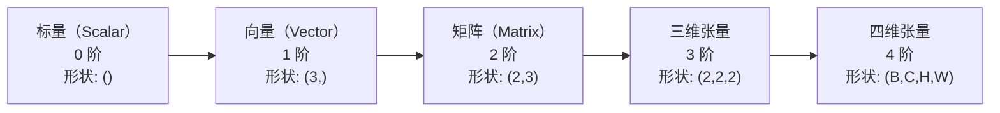
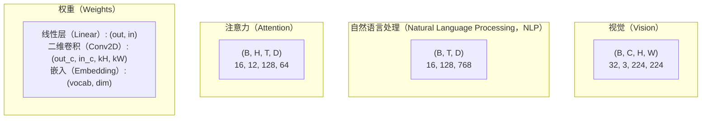
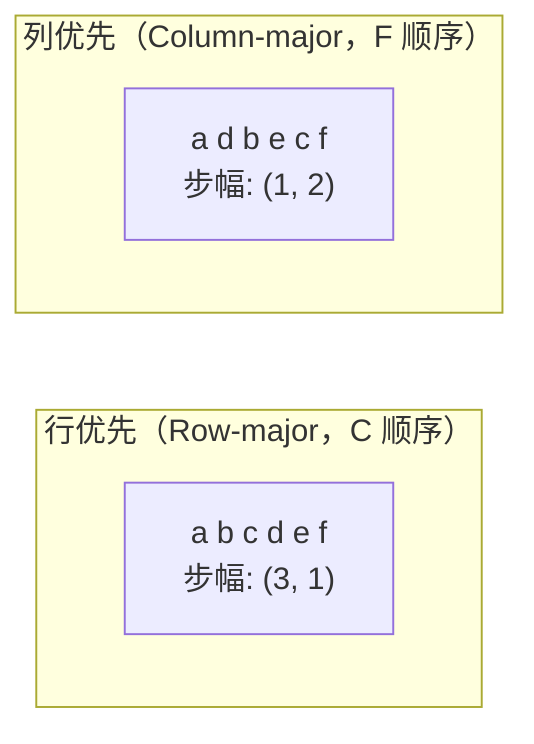
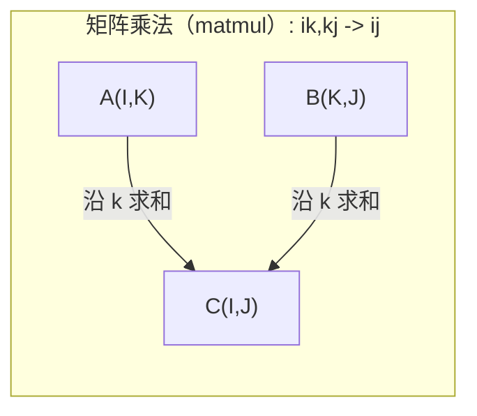

# 张量运算（Tensor Operations）

> 张量（Tensor）是数据与深度学习（Deep Learning，DL）之间的共同语言。每幅图像、每个句子、每个梯度都通过张量流动。

**Type:** Build
**Language:** Python
**Prerequisites:** 阶段 1，第 01 课（线性代数直觉，Linear Algebra Intuition）、第 02 课（向量、矩阵与运算，Vectors, Matrices & Operations）
**Time:** ~90 分钟

## 学习目标（Learning Objectives）

- 从零实现支持形状、步幅、重塑、转置和逐元素运算的张量类
- 应用广播（Broadcasting）规则，在不复制数据的情况下对不同形状的张量进行运算
- 编写用于点积、矩阵乘法、外积和批量运算的爱因斯坦求和（Einstein Summation，einsum）表达式
- 追踪多头注意力（Multi-Head Attention）每一步的确切张量形状

## 问题（The Problem）

你构建了一个 Transformer，前向传播（Forward Pass）看起来没有问题。运行后却得到：`RuntimeError: mat1 and mat2 shapes cannot be multiplied (32x768 and 512x768)`。你盯着这些形状，尝试转置，结果又提示 `Expected 4D input (got 3D input)`。你添加一次 unsqueeze，其他地方又出错了。

形状错误是深度学习代码中最常见的缺陷。从概念上看并不难：每种运算都有形状约束（Shape Contract），但问题会迅速叠加。Transformer 将数十次重塑、转置和广播串联起来，一个轴弄错就会引发连锁错误。更糟的是，有些形状错误根本不会抛出异常，而是沿错误维度广播或沿错误轴求和，悄无声息地产生无效结果。

矩阵处理两组对象之间的两两关系，但真实数据无法都放进二维结构中。一批 32 幅 224x224 的 RGB 图像是一个四维张量：`(32, 3, 224, 224)`。具有 12 个头的自注意力（Self-Attention）同样是四维的：`(batch, heads, seq_len, head_dim)`。你需要一种能推广到任意维数的数据结构，并且其运算可以在所有维度上清晰组合。这种结构就是张量。掌握它的运算，形状错误就很容易调试。

## 核心概念（The Concept）

### 什么是张量（What a tensor is）

张量是数据类型统一的多维数值数组。维度数量称为**阶（Rank 或 Order）**，每个维度称为**轴（Axis）**。**形状（Shape）**是一个元组，列出每个轴的大小。



元素总数 = 各维度大小的乘积。形状 `(2, 3, 4)` 包含 `2 * 3 * 4 = 24` 个元素。

### 深度学习中的张量形状（Tensor shapes in deep learning）

按照惯例，不同类型的数据对应特定的张量形状。



PyTorch 使用 NCHW（通道优先，Channels-First）。TensorFlow 默认使用 NHWC（通道最后，Channels-Last）。布局不匹配会导致不易察觉的性能下降或错误。

### 内存布局如何工作（How memory layout works）

二维数组在内存中是一维字节序列。**步幅（Strides）**告诉你，沿各轴移动一步需要跳过多少个元素。



转置（Transpose）不移动数据，而是交换步幅，使张量变为**非连续（Non-contiguous）**：同一行的元素在内存中不再相邻。

### 广播规则（Broadcasting rules）

广播让你无需复制数据就能对不同形状的张量进行运算。将形状右对齐：两个维度大小相等，或者其中一个为 1 时，它们就兼容。维数较少的形状在左侧补 1。

```text
张量 A:       (8, 1, 6, 1)
张量 B:          (7, 1, 5)
补齐后的 B:   (1, 7, 1, 5)
结果:         (8, 7, 6, 5)
```

### Einsum：通用张量运算（Einsum: the universal tensor operation）

爱因斯坦求和用字母标记每个轴。出现在输入中、但未出现在输出中的轴会被求和；同时出现在输入和输出中的轴则保留。



关键模式：`i,i->`（点积，Dot Product）、`i,j->ij`（外积，Outer Product）、`ii->`（迹，Trace）、`ij->ji`（转置）、`bij,bjk->bik`（批量矩阵乘法，Batch Matmul）、`bhtd,bhsd->bhts`（注意力分数）。

```figure
tensor-broadcast
```

## 动手实现（Build It）

代码位于 `code/tensors.py`。每一步都对应其中的实现。

### 第 1 步：张量存储与步幅（Step 1: Tensor storage and strides）

张量存储一个扁平数值列表以及形状元数据。步幅告诉索引逻辑如何将多维索引映射为扁平位置。

```python
class Tensor:
    def __init__(self, data, shape=None):
        if isinstance(data, (list, tuple)):
            self._data, self._shape = self._flatten_nested(data)
        elif isinstance(data, np.ndarray):
            self._data = data.flatten().tolist()
            self._shape = tuple(data.shape)
        else:
            self._data = [data]
            self._shape = ()

        if shape is not None:
            total = reduce(lambda a, b: a * b, shape, 1)
            if total != len(self._data):
                raise ValueError(
                    f"Cannot reshape {len(self._data)} elements into shape {shape}"
                )
            self._shape = tuple(shape)

        self._strides = self._compute_strides(self._shape)

    @staticmethod
    def _compute_strides(shape):
        if len(shape) == 0:
            return ()
        strides = [1] * len(shape)
        for i in range(len(shape) - 2, -1, -1):
            strides[i] = strides[i + 1] * shape[i + 1]
        return tuple(strides)
```

对于形状 `(3, 4)`，步幅是 `(4, 1)`：前进一行跳过 4 个元素，前进一列跳过 1 个元素。

### 第 2 步：重塑、压缩和扩维（Step 2: Reshape, squeeze, unsqueeze）

重塑（Reshape）改变形状而不改变元素顺序。元素总数必须保持不变。将某个维度设为 `-1`，可自动推断该维度的大小。

```python
t = Tensor(list(range(12)), shape=(2, 6))
r = t.reshape((3, 4))
r = t.reshape((-1, 3))
```

压缩（Squeeze）移除大小为 1 的轴，扩维（Unsqueeze）则插入一个这样的轴。扩维对广播至关重要：将偏置向量 `(D,)` 加到批量数据 `(B, T, D)` 上，需要将其扩维为 `(1, 1, D)`。

```python
t = Tensor(list(range(6)), shape=(1, 3, 1, 2))
s = t.squeeze()
v = Tensor([1, 2, 3])
u = v.unsqueeze(0)
```

### 第 3 步：转置与轴置换（Step 3: Transpose and permute）

转置交换两个轴。轴置换（Permute）重新排列所有轴。NCHW 与 NHWC 之间的转换就是这样完成的。

```python
mat = Tensor(list(range(6)), shape=(2, 3))
tr = mat.transpose(0, 1)

t4d = Tensor(list(range(24)), shape=(1, 2, 3, 4))
perm = t4d.permute((0, 2, 3, 1))
```

转置或轴置换后，张量在内存中不再连续。在 PyTorch 中，对非连续张量调用 `view` 会失败，应改用 `reshape` 或先调用 `.contiguous()`。

### 第 4 步：逐元素运算与归约（Step 4: Element-wise operations and reductions）

逐元素运算（Element-wise Operations，如加、乘、减）独立作用于每个元素，并保持形状不变。归约（Reduction，如求和、均值、最大值）会合并一个或多个轴。

```python
a = Tensor([[1, 2], [3, 4]])
b = Tensor([[10, 20], [30, 40]])
c = a + b
d = a * 2
s = a.sum(axis=0)
```

卷积神经网络（Convolutional Neural Network，CNN）中的全局平均池化（Global Average Pooling）：`(B, C, H, W).mean(axis=[2, 3])` 产生 `(B, C)`。自然语言处理中的序列均值池化：`(B, T, D).mean(axis=1)` 产生 `(B, D)`。

### 第 5 步：使用 NumPy 广播（Step 5: Broadcasting with NumPy）

`demo_broadcasting_numpy()` 函数位于 `tensors.py`，展示了核心模式。

```python
activations = np.random.randn(4, 3)
bias = np.array([0.1, 0.2, 0.3])
result = activations + bias

images = np.random.randn(2, 3, 4, 4)
scale = np.array([0.5, 1.0, 1.5]).reshape(1, 3, 1, 1)
result = images * scale

a = np.array([1, 2, 3]).reshape(-1, 1)
b = np.array([10, 20, 30, 40]).reshape(1, -1)
outer = a * b
```

通过广播计算两两距离：将 `(M, 2)` 重塑为 `(M, 1, 2)`，将 `(N, 2)` 重塑为 `(1, N, 2)`，依次相减、平方、沿最后一轴求和、开平方。结果形状为 `(M, N)`。

### 第 6 步：Einsum 运算（Step 6: Einsum operations）

`demo_einsum()` 和 `demo_einsum_gallery()` 函数逐一演示所有常见模式。

```python
a = np.array([1.0, 2.0, 3.0])
b = np.array([4.0, 5.0, 6.0])
dot = np.einsum("i,i->", a, b)

A = np.array([[1, 2], [3, 4], [5, 6]], dtype=float)
B = np.array([[7, 8, 9], [10, 11, 12]], dtype=float)
matmul = np.einsum("ik,kj->ij", A, B)

batch_A = np.random.randn(4, 3, 5)
batch_B = np.random.randn(4, 5, 2)
batch_mm = np.einsum("bij,bjk->bik", batch_A, batch_B)
```

缩并（Contraction）的计算成本是所有索引大小的乘积，包括保留和求和的索引。对于 B=32、I=128、J=64、K=128 的 `bij,bjk->bik`，需要 `32 * 128 * 64 * 128 = 33,554,432` 次乘加运算。

### 第 7 步：通过 einsum 实现注意力机制（Step 7: Attention mechanism via einsum）

`demo_attention_einsum()` 函数端到端实现了多头注意力。

```python
B, H, T, D = 2, 4, 8, 16
E = H * D

X = np.random.randn(B, T, E)
W_q = np.random.randn(E, E) * 0.02

Q = np.einsum("bte,ek->btk", X, W_q)
Q = Q.reshape(B, T, H, D).transpose(0, 2, 1, 3)

scores = np.einsum("bhtd,bhsd->bhts", Q, K) / np.sqrt(D)
weights = softmax(scores, axis=-1)
attn_output = np.einsum("bhts,bhsd->bhtd", weights, V)

concat = attn_output.transpose(0, 2, 1, 3).reshape(B, T, E)
output = np.einsum("bte,ek->btk", concat, W_o)
```

每一步都是张量运算：投影（通过 einsum 进行矩阵乘法）、拆分注意力头（重塑 + 转置）、计算注意力分数（通过 einsum 进行批量矩阵乘法）、加权求和（通过 einsum 进行批量矩阵乘法）、合并注意力头（转置 + 重塑）、输出投影（通过 einsum 进行矩阵乘法）。

## 实际应用（Use It）

### 从零实现与 NumPy 对比（Scratch vs NumPy）

| 运算 | 从零实现（Tensor 类） | NumPy |
|---|---|---|
| 创建 | `Tensor([[1,2],[3,4]])` | `np.array([[1,2],[3,4]])` |
| 重塑 | `t.reshape((3,4))` | `a.reshape(3,4)` |
| 转置 | `t.transpose(0,1)` | `a.T` 或 `a.transpose(0,1)` |
| 压缩 | `t.squeeze(0)` | `np.squeeze(a, 0)` |
| 求和 | `t.sum(axis=0)` | `a.sum(axis=0)` |
| 爱因斯坦求和 | 不适用 | `np.einsum("ij,jk->ik", a, b)` |

### 从零实现与 PyTorch 对比（Scratch vs PyTorch）

```python
import torch

t = torch.tensor([[1, 2, 3], [4, 5, 6]], dtype=torch.float32)
t.shape
t.stride()
t.is_contiguous()

t.reshape(3, 2)
t.unsqueeze(0)
t.transpose(0, 1)
t.transpose(0, 1).contiguous()

torch.einsum("ik,kj->ij", A, B)
```

PyTorch 增加了自动求导（Autograd）、图形处理器（Graphics Processing Unit，GPU）支持，以及经过优化的基础线性代数子程序（Basic Linear Algebra Subprograms，BLAS）内核。形状语义完全相同。理解从零实现的版本后，PyTorch 的形状错误也就能看懂了。

### 将每个神经网络层视为张量运算（Every neural network layer as a tensor operation）

| 运算 | 张量形式 | Einsum |
|---|---|---|
| 线性层 | `Y = X @ W.T + b` | `"bd,od->bo"` + 偏置 |
| 注意力 QKV | `Q = X @ W_q` | `"btd,dh->bth"` |
| 注意力分数 | `Q @ K.T / sqrt(d)` | `"bhtd,bhsd->bhts"` |
| 注意力输出 | `softmax(scores) @ V` | `"bhts,bhsd->bhtd"` |
| 批量归一化（Batch Normalization） | `(X - mu) / sigma * gamma` | 逐元素运算 + 广播 |
| Softmax | `exp(x) / sum(exp(x))` | 逐元素运算 + 归约 |

## 交付成果（Ship It）

本课产出两个可复用的提示词（Prompt）：

1. **`outputs/prompt-tensor-shapes.md`**：用于系统调试张量形状不匹配的提示词。包含各类常见运算（matmul、broadcast、cat、Linear、Conv2d、BatchNorm、softmax）的决策表，以及修复方案查找表。

2. **`outputs/prompt-tensor-debugger.md`**：当形状错误阻碍进展时，可以粘贴给任意 AI 助手的分步调试提示词。提供错误消息和张量形状，即可获得确切修复方案。

## 练习（Exercises）

1. **简单：重塑往返。** 取形状为 `(2, 3, 4)` 的张量，将它重塑为 `(6, 4)`，再变为 `(24,)`，最后变回 `(2, 3, 4)`。打印扁平数据，验证每一步都保持了元素顺序。

2. **中等：实现广播。** 为 `Tensor` 类添加 `broadcast_to(shape)` 方法，将大小为 1 的维度扩展到目标形状。然后修改 `_elementwise_op`，使其在运算前自动广播。用形状 `(3, 1)` 和 `(1, 4)` 测试，结果应为 `(3, 4)`。

3. **困难：从零构建 einsum。** 实现基础的 `einsum(subscripts, *tensors)` 函数，至少支持点积（`i,i->`）、矩阵乘法（`ij,jk->ik`）、外积（`i,j->ij`）和转置（`ij->ji`）。解析下标字符串，识别缩并索引，遍历所有索引组合。将结果与 `np.einsum` 对比。

4. **困难：注意力形状追踪器。** 编写一个函数，以 `batch_size`、`seq_len`、`embed_dim` 和 `num_heads` 为输入，打印多头注意力每一步的确切形状：输入、Q/K/V 投影、拆分头、注意力分数、softmax 权重、加权求和、合并头、输出投影。对照 `demo_attention_einsum()` 的输出验证。

## 关键术语（Key Terms）

| 术语 | 常见说法 | 实际含义 |
|---|---|---|
| 张量（Tensor） | “维度更多的矩阵” | 类型统一，并定义了形状、步幅及运算的多维数组 |
| 阶（Rank） | “维度的数量” | 轴的数量。矩阵作为张量是 2 阶，这并不等于它在线性代数意义下的矩阵秩 |
| 形状（Shape） | “张量的大小” | 列出各轴大小的元组。`(2, 3)` 表示 2 行、3 列 |
| 步幅（Stride） | “内存如何布局” | 沿各轴前进一个位置需要跳过的元素数量 |
| 广播（Broadcasting） | “形状不同也能直接算” | 一组严格规则：从右对齐，维度大小必须相等或其中一个为 1 |
| 连续（Contiguous） | “张量处于正常状态” | 元素依照逻辑布局顺序存储在内存中，没有间隙或重排 |
| 爱因斯坦求和（Einsum） | “矩阵乘法的花式写法” | 通用记法，一行即可表达张量缩并、外积、迹或转置 |
| 视图（View） | “和重塑一样” | 共享同一内存缓冲区、但形状或步幅元数据不同的张量；对非连续数据会失败 |
| 缩并（Contraction） | “沿一个索引求和” | 对张量之间的共享索引相乘并求和、产生低阶结果的一般运算 |
| NCHW / NHWC | “PyTorch 与 TensorFlow 的格式” | 图像张量的内存布局惯例。NCHW 将通道放在空间维度之前，NHWC 则放在之后 |

## 延伸阅读（Further Reading）

- [NumPy 广播](https://numpy.org/doc/stable/user/basics.broadcasting.html)：包含可视化示例的标准规则
- [PyTorch 张量视图](https://pytorch.org/docs/stable/tensor_view.html)：何时可以使用视图，何时会复制数据
- [einops](https://github.com/arogozhnikov/einops)：让张量重塑更易读且更安全的库
- [图解 Transformer](https://jalammar.github.io/illustrated-transformer/)：可视化注意力过程中流动的张量形状
- [NumPy 中的爱因斯坦求和](https://numpy.org/doc/stable/reference/generated/numpy.einsum.html)：完整的 einsum 文档及示例
