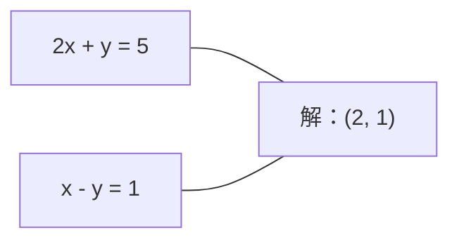
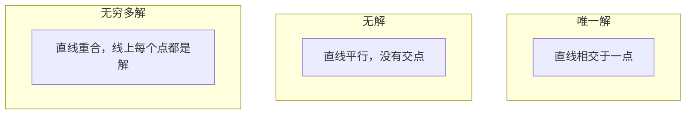

# 线性方程组（Linear Systems）

> 求解 Ax = b 是数学中最古老的问题之一，至今仍在支撑神经网络的运行。

**Type:** Build
**Language:** Python
**Prerequisites:** 第 1 阶段，第 01 课（线性代数直觉，Linear Algebra Intuition）、第 02 课（向量与矩阵，Vectors & Matrices）、第 03 课（矩阵变换，Matrix Transformations）
**Time:** ~120 分钟

## 学习目标（Learning Objectives）

- 使用带部分选主元的高斯消元法（Gaussian Elimination）与回代法（Back Substitution）求解 Ax = b
- 使用 LU、QR 和 Cholesky 分解对矩阵进行因式分解，并解释各自的适用场景
- 推导最小二乘法（Least Squares）的正规方程（Normal Equations），并将其与线性回归和岭回归联系起来
- 使用条件数（Condition Number）诊断病态方程组，并应用正则化（Regularization）提高稳定性

## 问题背景（The Problem）

每次训练线性回归模型，都是在求解线性方程组。每次计算最小二乘拟合，也是在求解线性方程组。神经网络层每次计算 `y = Wx + b`，都是在计算线性方程组的一侧。添加正则化，就是修改这个方程组。使用高斯过程（Gaussian Processes）时，需要分解矩阵。为马氏距离（Mahalanobis Distance）求协方差矩阵的逆时，也是在求解线性方程组。

方程 Ax = b 无处不在。A 是已知系数构成的矩阵，b 是已知输出构成的向量，x 是待求的未知量向量。在线性回归中，A 是数据矩阵，b 是目标向量，x 是权重向量。整个模型可以归结为：寻找 x，使 Ax 尽可能接近 b。

本课将从零实现求解这个方程的各类主要方法。你将理解为什么某些方法速度快、另一些方法稳定，为什么有些方法只能处理方阵方程组、另一些却能处理超定方程组，以及为什么矩阵的条件数决定了求解结果是否有意义。

## 核心概念（The Concept）

### Ax = b 的几何意义（What Ax = b means geometrically）

线性方程组有对应的几何解释。每个方程定义一个超平面（Hyperplane），解就是所有超平面相交的点或点集。

```
2x + y = 5          二维空间中的两条直线。
x - y  = 1          它们相交于 x=2, y=1。
```



可能出现三种情况：



用矩阵表示时，“唯一解”意味着 A 可逆；“无解”意味着方程组不相容；“无穷多解”意味着 A 存在零空间（Null Space）。大多数机器学习（Machine Learning，ML）问题属于“没有精确解”的情况，因为方程数（数据点数）多于未知量数（参数数）。这时就需要最小二乘法。

### 列视角与行视角（Column picture vs row picture）

可以从两个角度理解 Ax = b。

**行视角（Row Picture）。** A 的每一行定义一个方程，每个方程对应一个超平面，解就是它们共同相交的位置。

**列视角（Column Picture）。** A 的每一列是一个向量。问题变为：A 的各列通过怎样的线性组合才能得到 b？

```
A = | 2  1 |    b = | 5 |
    | 1 -1 |        | 1 |

行视角：联立求解 2x + y = 5 和 x - y = 1。

列视角：寻找 x1, x2，使得：
  x1 * [2, 1] + x2 * [1, -1] = [5, 1]
  2 * [2, 1] + 1 * [1, -1] = [4+1, 2-1] = [5, 1]   验证成立。
```

列视角更为根本。如果 b 位于 A 的列空间（Column Space）内，方程组就有解；否则，要在列空间中寻找距离 b 最近的点。这个最近点对应最小二乘解。

### 高斯消元法（Gaussian elimination）

高斯消元法把 Ax = b 转换为上三角方程组 Ux = c，再通过回代求解。这是最直接的方法。

算法如下：

```
1. 对每一列 k（主元列）：
   a. 在第 k 列中，从第 k 行起向下寻找最大的元素（部分选主元）。
   b. 将该行与第 k 行交换。
   c. 对第 k 行下方的每一行 i：
      - 计算乘数 m = A[i][k] / A[k][k]
      - 从第 i 行减去第 k 行的 m 倍。
2. 回代：从最后一个方程开始向上求解。
```

示例：

```
原始方程组：
| 2  1  1 | 8 |       R2 = R2 - (2)R1     | 2  1   1 |  8 |
| 4  3  3 |20 |  -->  R3 = R3 - (1)R1 --> | 0  1   1 |  4 |
| 2  3  1 |12 |                            | 0  2   0 |  4 |

                       R3 = R3 - (2)R2     | 2  1   1 |  8 |
                                       --> | 0  1   1 |  4 |
                                           | 0  0  -2 | -4 |

回代：
  -2 * x3 = -4    -->  x3 = 2
  x2 + 2  = 4     -->  x2 = 2
  2*x1 + 2 + 2 = 8 --> x1 = 2
```

高斯消元需要 O(n^3) 次运算。对于 1000x1000 的方程组，大约需要十亿次浮点运算。它速度很快，但如果要对同一个 A 求解多个方程组，还有更好的办法。

### 部分选主元的重要性（Partial pivoting: why it matters）

不选主元时，高斯消元可能失败或产生毫无意义的结果。主元为零会造成除零；主元很小时，则会放大舍入误差。

```
不合适的主元：                   使用部分选主元：
| 0.001  1 | 1.001 |            先交换行：
| 1      1 | 2     |            | 1      1 | 2     |
                                 | 0.001  1 | 1.001 |
m = 1/0.001 = 1000              m = 0.001/1 = 0.001
R2 = R2 - 1000*R1               R2 = R2 - 0.001*R1
| 0.001  1     | 1.001   |      | 1      1     | 2     |
| 0     -999   | -999.0  |      | 0      0.999 | 0.999 |

x2 = 1.000（正确）              x2 = 1.000（正确）
x1 = (1.001 - 1)/0.001          x1 = (2 - 1)/1 = 1.000（正确）
   = 0.001/0.001 = 1.000        乘数较小，因此稳定。
```

在精度有限的浮点运算中，不选主元的版本可能丢失有效数字。部分选主元始终选择可用的最大主元，使误差放大尽可能小。

### LU 分解（LU decomposition）

LU 分解将 A 分解为下三角矩阵 L 和上三角矩阵 U：A = LU。L 存储高斯消元过程中的乘数，U 则是消元后的结果。

```
A = L @ U

| 2  1  1 |   | 1  0  0 |   | 2  1   1 |
| 4  3  3 | = | 2  1  0 | @ | 0  1   1 |
| 2  3  1 |   | 1  2  1 |   | 0  0  -2 |
```

为什么要分解，而不只是消元？因为得到 L 和 U 后，针对任意新的 b 求解 Ax = b 只需要 O(n^2)：

```
Ax = b
LUx = b
令 y = Ux：
  Ly = b    （前代，O(n^2)）
  Ux = y    （回代，O(n^2)）
```

O(n^3) 的开销只需在分解时支付一次，后续每次求解都是 O(n^2)。如果需要对同一个 A、不同的 b 求解 1000 个方程组，LU 可将总工作量降低 1000/3 倍。

采用部分选主元时，得到 PA = LU，其中 P 是记录行交换的置换矩阵（Permutation Matrix）。

### QR 分解（QR decomposition）

QR 分解将 A 分解为正交矩阵（Orthogonal Matrix）Q 和上三角矩阵 R：A = QR。

正交矩阵满足 Q^T Q = I，其各列是标准正交向量。乘以 Q 会保持长度和角度不变。

```
A = Q @ R

Q 的各列标准正交：Q^T Q = I
R 为上三角矩阵

求解 Ax = b：
  QRx = b
  Rx = Q^T b    （只需乘以 Q^T，无需求逆）
  回代求得 x。
```

求解最小二乘问题时，QR 在数值上比 LU 更稳定。Gram-Schmidt 正交化过程逐列构造 Q：

```
给定 A 的各列 a1, a2, ...：

q1 = a1 / ||a1||

q2 = a2 - (a2 . q1) * q1        （减去在 q1 上的投影）
q2 = q2 / ||q2||                （归一化）

q3 = a3 - (a3 . q1) * q1 - (a3 . q2) * q2
q3 = q3 / ||q3||

R[i][j] = qi . aj    for i <= j
```

每一步都去掉沿之前所有 q 向量方向的分量，只留下新的正交方向。

### Cholesky 分解（Cholesky decomposition）

当 A 对称（A = A^T）且正定（所有特征值均为正）时，可以将其分解为 A = L L^T，其中 L 是下三角矩阵。这就是 Cholesky 分解。

```
A = L @ L^T

| 4  2 |   | 2  0 |   | 2  1 |
| 2  5 | = | 1  2 | @ | 0  2 |

L[i][i] = sqrt(A[i][i] - sum(L[i][k]^2 for k < i))
L[i][j] = (A[i][j] - sum(L[i][k]*L[j][k] for k < j)) / L[j][j]    for i > j
```

Cholesky 的速度是 LU 的两倍，只需一半存储空间。它仅适用于对称正定矩阵，但这类矩阵经常出现：

- 协方差矩阵是对称半正定矩阵，正则化后为正定矩阵。
- 高斯过程中的核矩阵是对称正定矩阵。
- 凸函数在最小值处的海森矩阵（Hessian）是对称正定矩阵。
- A^T A 始终对称半正定。

在高斯过程中，先用 Cholesky 分解核矩阵 K，再求解 K alpha = y，得到预测均值。Cholesky 因子还能给出边际似然所需的对数行列式：log det(K) = 2 * sum(log(diag(L)))。

### 最小二乘：Ax = b 没有精确解时（Least squares: when Ax = b has no exact solution）

如果 A 为 m x n 且 m > n（方程数多于未知量数），这个方程组就是超定的（Overdetermined），没有精确解。此时改为最小化平方误差：

```
最小化 ||Ax - b||^2

这是残差的平方和：
  sum((A[i,:] @ x - b[i])^2 for i in range(m))
```

最小值点满足正规方程：

```
A^T A x = A^T b
```

推导：展开 ||Ax - b||^2 = (Ax - b)^T (Ax - b) = x^T A^T A x - 2 x^T A^T b + b^T b。对 x 求梯度并令其为零：2 A^T A x - 2 A^T b = 0。

```
原始方程组（超定，4 个方程、2 个未知量）：
| 1  1 |         | 3 |
| 1  2 | x     = | 5 |       不存在同时满足全部 4 个方程的精确 x。
| 1  3 |         | 6 |
| 1  4 |         | 8 |

正规方程：
A^T A = | 4  10 |    A^T b = | 22 |
        | 10 30 |            | 63 |

求解：x = [1.5, 1.7]

这就是线性回归。x[0] 是截距，x[1] 是斜率。
```

### 正规方程就是线性回归（Normal equations = linear regression）

两者的对应关系是精确的。在线性回归中，数据矩阵 X 的每一行对应一个样本，每一列对应一个特征。目标向量 y 的每个元素对应一个样本。权重向量 w 满足：

```
X^T X w = X^T y
w = (X^T X)^(-1) X^T y
```

这就是线性回归的闭式解（Closed-form Solution）。每次调用 `sklearn.linear_model.LinearRegression.fit()` 都是在计算它，或通过 QR、奇异值分解（Singular Value Decomposition，SVD）计算等价结果。

给矩阵加上正则项 lambda * I，就得到岭回归（Ridge Regression）：

```
(X^T X + lambda * I) w = X^T y
w = (X^T X + lambda * I)^(-1) X^T y
```

正则化改善了矩阵的条件性，使求逆更容易达到较高精度，同时将权重向零收缩以防止过拟合。当 lambda > 0 时，矩阵 X^T X + lambda * I 始终对称正定，因此可以用 Cholesky 求解。

### 伪逆（Pseudoinverse，Moore-Penrose）

伪逆 A+ 将矩阵求逆推广到非方阵和奇异矩阵。对于任意矩阵 A：

```
x = A+ b

其中 A+ = V Sigma+ U^T    （通过 SVD 计算）
```

将每个非零奇异值取倒数，再对结果转置，就得到 Sigma+。若 A = U Sigma V^T，则 A+ = V Sigma+ U^T。

```
A = U Sigma V^T        (SVD)

Sigma = | 5  0 |       Sigma+ = | 1/5  0  0 |
        | 0  2 |                | 0  1/2  0 |
        | 0  0 |

A+ = V Sigma+ U^T
```

伪逆给出最小范数的最小二乘解。对于不同的方程组：
- 唯一解：A+ b 给出该解。
- 无解：A+ b 给出最小二乘解。
- 无穷多解：A+ b 给出 ||x|| 最小的那个解。

NumPy 的 `np.linalg.lstsq` 和 `np.linalg.pinv` 在内部都使用 SVD。

### 条件数（Condition number）

条件数衡量解对输入微小变化的敏感程度。矩阵 A 的条件数为：

```
kappa(A) = ||A|| * ||A^(-1)|| = sigma_max / sigma_min
```

其中 sigma_max 和 sigma_min 分别是最大与最小奇异值。

```
良态（kappa ~ 1）：                  病态（kappa ~ 10^15）：
b 的微小变化 -->                     b 的微小变化 -->
x 的微小变化                         x 的巨大变化

| 2  0 |   kappa = 2/1 = 2          | 1   1          |   kappa ~ 10^15
| 0  1 |   可以可靠求解             | 1   1+10^(-15) |   解毫无意义
```

经验法则：
- kappa < 100：可以可靠求解，结果准确。
- kappa ~ 10^k：浮点运算大约损失 k 位精度。
- kappa ~ 10^16（对于 float64）：解没有意义，矩阵实际上已近似奇异。

在机器学习中，特征近乎共线时会产生病态性。正则化（加上 lambda * I）将条件数从 sigma_max / sigma_min 改善为 (sigma_max + lambda) / (sigma_min + lambda)。

### 迭代方法：共轭梯度法（Iterative methods: conjugate gradient）

对于超大型稀疏方程组（数百万未知量），LU 或 Cholesky 等直接法的成本过高。迭代法通过多次迭代改进初始猜测，逐步逼近解。

共轭梯度法（Conjugate Gradient，CG）用于求解 A 对称正定时的 Ax = b。在精确算术下，它至多经过 n 次迭代便能找到精确解；若 A 的特征值聚集，通常收敛得更快。

```
算法概要：
  x0 = 初始猜测（通常为零）
  r0 = b - A x0           （残差）
  p0 = r0                 （搜索方向）

  对 k = 0, 1, 2, ...：
    alpha = (rk . rk) / (pk . A pk)
    x_{k+1} = xk + alpha * pk
    r_{k+1} = rk - alpha * A pk
    beta = (r_{k+1} . r_{k+1}) / (rk . rk)
    p_{k+1} = r_{k+1} + beta * pk
    若 ||r_{k+1}|| < tolerance：停止
```

CG 的应用包括：
- 大规模优化（Newton-CG 方法）
- 求解偏微分方程（Partial Differential Equation，PDE）离散化得到的方程组
- 核矩阵过大、无法分解的核方法
- 其他迭代求解器的预条件处理（Preconditioning）

收敛速度取决于条件数。条件性更好的方程组收敛更快，这也是正则化有效的另一个原因。

### 总览：何时选择哪种方法（The full picture: which method when）

| 方法 | 要求 | 成本 | 使用场景 |
|--------|-------------|------|----------|
| 高斯消元法 | A 是非奇异方阵 | O(n^3) | 一次性求解方阵方程组 |
| LU 分解 | A 是非奇异方阵 | O(n^3) 分解 + O(n^2) 求解 | 对同一个 A 多次求解 |
| QR 分解 | 任意 A（m >= n） | O(mn^2) | 最小二乘，数值稳定 |
| Cholesky | A 对称正定 | O(n^3/3) | 协方差矩阵、高斯过程、岭回归 |
| 正规方程 | 超定（m > n） | O(mn^2 + n^3) | 线性回归（n 较小） |
| SVD / 伪逆 | 任意 A | O(mn^2) | 秩亏方程组、最小范数解 |
| 共轭梯度法 | A 对称正定且稀疏 | O(n * k * nnz) | 大型稀疏方程组，k = 迭代次数 |

### 与机器学习的联系（Connection to ML）

本课的每种方法都会出现在生产环境的机器学习中：

**线性回归（Linear Regression）。** 闭式解通过求解正规方程 X^T X w = X^T y 得到。可以使用 Cholesky（n 较小时）、QR（关注数值稳定性时）或 SVD（矩阵可能秩亏时）。

**岭回归。** 向 X^T X 加上 lambda * I。正则化后的方程组 (X^T X + lambda * I) w = X^T y 始终可以通过 Cholesky 求解，因为当 lambda > 0 时，X^T X + lambda * I 对称正定。

**高斯过程。** 计算预测均值需要求解 K alpha = y，其中 K 为核矩阵。标准做法是对 K 进行 Cholesky 分解。对数边际似然用到 log det(K) = 2 sum(log(diag(L)))。

**神经网络初始化。** 正交初始化使用 QR 分解创建各列标准正交的权重矩阵，防止深层网络中的信号坍缩。

**预条件处理。** 大规模优化器使用不完全 Cholesky 或不完全 LU 作为共轭梯度求解器的预条件器。

**特征工程（Feature Engineering）。** X^T X 的条件数可以反映特征是否共线。如果 kappa 很大，就删除特征或添加正则化。

```figure
linear-system-conditioning
```

## 动手实现（Build It）

### 第 1 步：带部分选主元的高斯消元法（Step 1: Gaussian elimination with partial pivoting）

```python
import numpy as np

def gaussian_elimination(A, b):
    n = len(b)
    Ab = np.hstack([A.astype(float), b.reshape(-1, 1).astype(float)])

    for k in range(n):
        max_row = k + np.argmax(np.abs(Ab[k:, k]))
        Ab[[k, max_row]] = Ab[[max_row, k]]

        if abs(Ab[k, k]) < 1e-12:
            raise ValueError(f"Matrix is singular or nearly singular at pivot {k}")

        for i in range(k + 1, n):
            m = Ab[i, k] / Ab[k, k]
            Ab[i, k:] -= m * Ab[k, k:]

    x = np.zeros(n)
    for i in range(n - 1, -1, -1):
        x[i] = (Ab[i, -1] - Ab[i, i+1:n] @ x[i+1:n]) / Ab[i, i]

    return x
```

### 第 2 步：LU 分解（Step 2: LU decomposition）

```python
def lu_decompose(A):
    n = A.shape[0]
    L = np.eye(n)
    U = A.astype(float).copy()
    P = np.eye(n)

    for k in range(n):
        max_row = k + np.argmax(np.abs(U[k:, k]))
        if max_row != k:
            U[[k, max_row]] = U[[max_row, k]]
            P[[k, max_row]] = P[[max_row, k]]
            if k > 0:
                L[[k, max_row], :k] = L[[max_row, k], :k]

        for i in range(k + 1, n):
            L[i, k] = U[i, k] / U[k, k]
            U[i, k:] -= L[i, k] * U[k, k:]

    return P, L, U

def lu_solve(P, L, U, b):
    n = len(b)
    Pb = P @ b.astype(float)

    y = np.zeros(n)
    for i in range(n):
        y[i] = Pb[i] - L[i, :i] @ y[:i]

    x = np.zeros(n)
    for i in range(n - 1, -1, -1):
        x[i] = (y[i] - U[i, i+1:] @ x[i+1:]) / U[i, i]

    return x
```

### 第 3 步：Cholesky 分解（Step 3: Cholesky decomposition）

```python
def cholesky(A):
    n = A.shape[0]
    L = np.zeros_like(A, dtype=float)

    for i in range(n):
        for j in range(i + 1):
            s = A[i, j] - L[i, :j] @ L[j, :j]
            if i == j:
                if s <= 0:
                    raise ValueError("Matrix is not positive definite")
                L[i, j] = np.sqrt(s)
            else:
                L[i, j] = s / L[j, j]

    return L
```

### 第 4 步：通过正规方程求最小二乘解（Step 4: Least squares via normal equations）

```python
def least_squares_normal(A, b):
    AtA = A.T @ A
    Atb = A.T @ b
    return gaussian_elimination(AtA, Atb)

def ridge_regression(A, b, lam):
    n = A.shape[1]
    AtA = A.T @ A + lam * np.eye(n)
    Atb = A.T @ b
    L = cholesky(AtA)
    y = np.zeros(n)
    for i in range(n):
        y[i] = (Atb[i] - L[i, :i] @ y[:i]) / L[i, i]
    x = np.zeros(n)
    for i in range(n - 1, -1, -1):
        x[i] = (y[i] - L.T[i, i+1:] @ x[i+1:]) / L.T[i, i]
    return x
```

### 第 5 步：条件数（Step 5: Condition number）

```python
def condition_number(A):
    U, S, Vt = np.linalg.svd(A)
    return S[0] / S[-1]
```

## 实际应用（Use It）

将这些组件组合起来，在真实数据上进行线性回归和岭回归：

```python
np.random.seed(42)
X_raw = np.random.randn(100, 3)
w_true = np.array([2.0, -1.0, 0.5])
y = X_raw @ w_true + np.random.randn(100) * 0.1

X = np.column_stack([np.ones(100), X_raw])

w_ols = least_squares_normal(X, y)
print(f"OLS weights (ours):    {w_ols}")

w_np = np.linalg.lstsq(X, y, rcond=None)[0]
print(f"OLS weights (numpy):   {w_np}")
print(f"Max difference: {np.max(np.abs(w_ols - w_np)):.2e}")

w_ridge = ridge_regression(X, y, lam=1.0)
print(f"Ridge weights (ours):  {w_ridge}")

from sklearn.linear_model import Ridge
ridge_sk = Ridge(alpha=1.0, fit_intercept=False)
ridge_sk.fit(X, y)
print(f"Ridge weights (sklearn): {ridge_sk.coef_}")
```

## 交付成果（Ship It）

本课产出：
- `code/linear_systems.py`，包含从零实现的高斯消元法、LU 分解、Cholesky 分解、最小二乘法和岭回归
- 可运行的演示，验证正规方程与 sklearn 的 LinearRegression 产生相同权重

## 练习（Exercises）

1. 使用你实现的高斯消元法、LU 求解器以及 `np.linalg.solve`，求解方程组 `[[1,2,3],[4,5,6],[7,8,10]] x = [6, 15, 27]`。验证三者在浮点容差范围内给出相同答案。

2. 生成一个 50x5 的随机矩阵 X 和目标 y = X @ w_true + noise。分别使用正规方程、QR（通过 `np.linalg.qr`）、SVD（通过 `np.linalg.svd`）及 `np.linalg.lstsq` 求解 w。比较四种解，测量 X^T X 的条件数，并解释它如何影响你对不同方法的信任程度。

3. 让两列几乎相同，构造近似奇异矩阵，例如第 2 列 = 第 1 列 + 1e-10 * noise。计算条件数，分别在不使用正则化和使用正则化（加上 0.01 * I）时求解 Ax = b。比较解与残差，解释正则化为何有效。

4. 针对一个 100x100 的随机对称正定矩阵实现共轭梯度算法。统计收敛到容差 1e-8 需要多少次迭代，并与理论上的最多 n 次迭代比较。

5. 在规模为 10、50、200、500 的对称正定矩阵上，测量你实现的 Cholesky 求解器、LU 求解器与 `np.linalg.solve` 的耗时。绘制结果，验证 Cholesky 的速度约为 LU 的 2 倍。

## 关键术语（Key Terms）

| 术语 | 常见说法 | 实际含义 |
|------|----------------|----------------------|
| 线性方程组（Linear System） | “求 x” | 一组线性方程 Ax = b。求 x 就是寻找经过变换 A 后产生输出 b 的输入。 |
| 高斯消元法（Gaussian Elimination） | “行化简” | 使用行运算系统地消去对角线下方的元素，得到可通过回代求解的上三角方程组。O(n^3)。 |
| 部分选主元（Partial Pivoting） | “交换行以保持稳定” | 对第 k 列消元前，将该列绝对值最大的元素所在行交换到主元位置，避免除以很小的数。 |
| LU 分解（LU Decomposition） | “分解为三角矩阵” | 写成 A = LU，其中 L 为下三角矩阵（存储乘数），U 为上三角矩阵（消元后的矩阵）。将 O(n^3) 的成本分摊到多次求解。 |
| QR 分解（QR Decomposition） | “正交分解” | 写成 A = QR，其中 Q 的列标准正交，R 为上三角矩阵。求解最小二乘时比 LU 更稳定。 |
| Cholesky 分解（Cholesky Decomposition） | “矩阵的平方根” | 对于对称正定的 A，写成 A = LL^T。成本为 LU 的一半，用于协方差矩阵、核矩阵和岭回归。 |
| 最小二乘法（Least Squares） | “无法精确求解时的最佳拟合” | 方程组超定（方程数多于未知量数）时，最小化残差平方和 ||Ax - b||^2。 |
| 正规方程（Normal Equations） | “微积分捷径” | A^T A x = A^T b。令 ||Ax - b||^2 的梯度为零，这正是线性回归的闭式解。 |
| 伪逆（Pseudoinverse） | “非方阵的求逆” | 通过 SVD 得到 A+ = V Sigma+ U^T。为任意矩阵提供最小范数的最小二乘解，无论方阵或矩形矩阵、奇异与否。 |
| 条件数（Condition Number） | “答案有多可信” | kappa = sigma_max / sigma_min。衡量对输入扰动的敏感度，大约损失 log10(kappa) 位精度。 |
| 岭回归（Ridge Regression） | “正则化最小二乘” | 求解 (X^T X + lambda I) w = X^T y。加上 lambda I 改善条件性并使权重向零收缩，防止过拟合。 |
| 共轭梯度法（Conjugate Gradient） | “大矩阵的迭代 Ax=b” | 对称正定方程组的迭代求解器，至多 n 步收敛。适用于因式分解成本过高的大型稀疏方程组。 |
| 超定方程组（Overdetermined System） | “数据比参数多” | m 行 n 列方程组中 m > n，不存在精确解。最小二乘法寻找最佳近似，每个回归问题都是这种情况。 |
| 回代法（Back Substitution） | “从下往上求解” | 对上三角方程组，先求解最后一个方程，再向前代入。O(n^2)。 |
| 前代法（Forward Substitution） | “从上往下求解” | 对下三角方程组，先求解第一个方程，再向后代入。O(n^2)。用于 LU 求解的 L 步骤。 |

## 延伸阅读（Further Reading）

- [MIT 18.06：线性代数（Linear Algebra）](https://ocw.mit.edu/courses/18-06-linear-algebra-spring-2010/)（Gilbert Strang）：讲解线性方程组与矩阵分解的权威课程
- [数值线性代数（Numerical Linear Algebra）](https://people.maths.ox.ac.uk/trefethen/text.html)（Trefethen & Bau）：理解数值稳定性、条件性与算法失效原因的标准参考书
- [矩阵计算（Matrix Computations）](https://www.press.jhu.edu/books/title/10678/matrix-computations)（Golub & Van Loan）：涵盖各类矩阵算法的百科全书式参考书
- [3Blue1Brown：逆矩阵（Inverse Matrices）](https://www.3blue1brown.com/lessons/inverse-matrices)：直观展示求解 Ax = b 的几何意义
