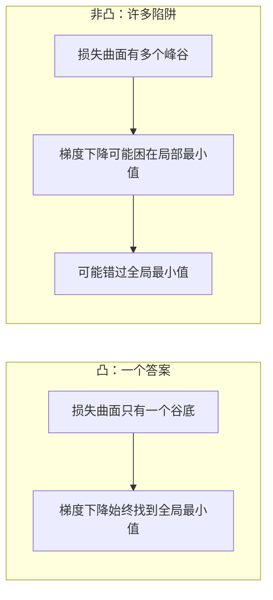
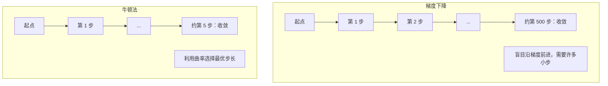
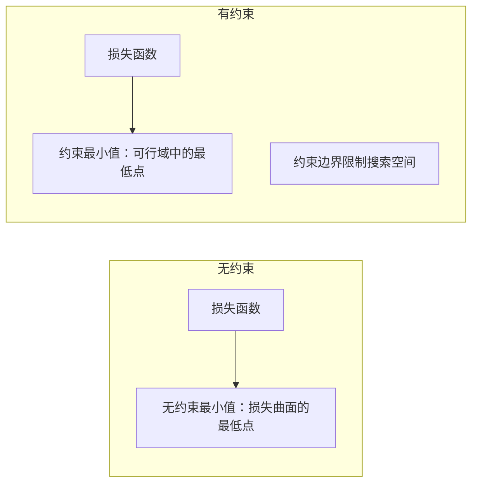
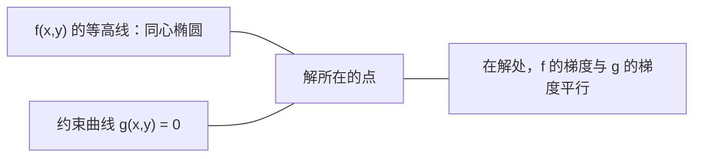

# 凸优化（Convex Optimization）

> 凸问题只有一个谷底，神经网络却有数百万个。理解两者的区别很重要。

**Type:** Build
**Language:** Python
**Prerequisites:** 第 1 阶段，第 04 课（机器学习微积分，Calculus for ML）、第 08 课（优化，Optimization）
**Time:** ~90 分钟

## 学习目标（Learning Objectives）

- 使用定义、二阶导数及海森矩阵判据检验函数是否为凸函数
- 实现牛顿法，并将其二次收敛速度与梯度下降比较
- 使用拉格朗日乘子求解约束优化问题，并解释 KKT 条件
- 解释神经网络损失地形为何非凸，以及 SGD 为什么仍能找到较好的解

## 问题背景（The Problem）

第 08 课介绍了梯度下降（Gradient Descent）、动量（Momentum）和 Adam。这些优化器可以沿任意曲面向下移动，却没有保证。在非凸地形上，梯度下降可能落入很差的局部最小值，困在鞍点，或永远振荡。你仍然使用它，是因为神经网络非凸，而且没有替代办法。

但机器学习（Machine Learning，ML）中的许多问题是凸的，例如线性回归、逻辑回归、支持向量机（Support Vector Machine，SVM）、最小绝对收缩与选择算子（Least Absolute Shrinkage and Selection Operator，LASSO）和岭回归。对这些问题，存在更强的工具：具有数学保证的优化方法。凸问题恰好只有一个谷底，任何向下移动的算法都会到达全局最小值。无需重启，无需学习率调度，也无需碰运气。

理解凸性有三方面作用。第一，它告诉你问题何时容易（凸）、何时困难（非凸）。第二，它为凸问题提供牛顿法等更快的工具。第三，它解释了贯穿机器学习的概念：把正则化视为约束、SVM 中的对偶性，以及深度学习在不具备凸性带来的各种良好性质时为何仍然有效。

## 核心概念（The Concept）

### 凸集（Convex sets）

若集合 S 中任意两点之间的线段也完全位于 S 内，则 S 为凸集。

| 凸集 | 非凸集 |
|---|---|
| **矩形**：内部任意两点的连线都留在内部 | **星形/月牙形**：内部两点之间的连线可能穿出集合 |
| **三角形**：所有内部点也满足同样性质 | **甜甜圈形/圆环**：孔洞使一些线段离开集合 |
| 任意两点间的线段都在集合内 | 某些点对之间的线段会离开集合 |

形式化检验：对于 S 中任意点 x、y 和任意 t in [0, 1]，点 tx + (1-t)y 也属于 S。

凸集示例：
- 直线、平面、整个 R^n
- 球（圆盘、球体、超球体）
- 半空间（Halfspace）：{x : a^T x <= b}
- 任意多个凸集的交集

非凸集示例：
- 甜甜圈形（圆环）
- 两个不相交圆的并集
- 任何有“凹陷”或“孔洞”的集合

### 凸函数（Convex functions）

若函数 f 的定义域是凸集，且对于定义域内任意两点 x、y 和任意 t in [0, 1]，满足：

```
f(tx + (1-t)y) <= t*f(x) + (1-t)*f(y)
```

几何意义：函数图像上任意两点间的线段都位于图像上方，或与图像重合。

| 性质 | 凸函数 | 非凸函数 |
|---|---|---|
| **线段检验** | 图像上任意两点间的连线都在曲线**上方或与之重合** | 图像上某些点之间的连线会落到曲线**下方** |
| **形状** | 单个向上弯曲的碗形/谷地 | 多个峰谷，曲率正负混合 |
| **局部最小值** | 每个局部最小值都是全局最小值 | 可能存在高度不同的多个局部最小值 |

常见凸函数：
- f(x) = x^2（抛物线）
- f(x) = |x|（绝对值）
- f(x) = e^x（指数函数）
- f(x) = max(0, x)（修正线性单元，Rectified Linear Unit，ReLU，虽然是分段线性的）
- f(x) = -log(x)，x > 0（负对数）
- 任意线性函数 f(x) = a^T x + b（既凸又凹）

### 凸性检验（Testing for convexity）

下面给出三种实用检验，从最简单到最严格。

**检验 1：二阶导数检验（一维）。** 若对所有 x 都有 f''(x) >= 0，则 f 为凸函数。

- f(x) = x^2：f''(x) = 2 >= 0，凸。
- f(x) = x^3：f''(x) = 6x，在 x < 0 时为负，非凸。
- f(x) = e^x：f''(x) = e^x > 0，凸。

**检验 2：海森矩阵检验（多变量）。** 若对所有 x，海森矩阵（Hessian Matrix）H(x) 都是半正定的，则 f 为凸函数。海森矩阵是二阶偏导数构成的矩阵。

**检验 3：定义检验。** 直接检查不等式 f(tx + (1-t)y) <= t*f(x) + (1-t)*f(y)。适用于导数难以计算的函数。

### 凸性为何重要（Why convexity matters）

凸优化的核心定理：

**对于凸函数，每个局部最小值都是全局最小值。**

这意味着梯度下降不会被困住。任何下行路径都通向同一个答案，算法保证收敛到最优解。



由此得到：
- 不需要随机重启
- 不需要复杂的学习率调度
- 可以证明收敛性，速度取决于函数性质
- 解是唯一的，平坦区域除外

### 机器学习中的凸与非凸（Convex vs non-convex in ML）

| 问题 | 是否凸？ | 原因 |
|---------|---------|-----|
| 线性回归（均方误差，Mean Squared Error，MSE） | 是 | 损失是权重的二次函数 |
| 逻辑回归 | 是 | 对数损失关于权重是凸的 |
| SVM（合页损失，Hinge Loss） | 是 | 线性函数的最大值 |
| LASSO（L1 回归） | 是 | 凸函数之和仍然凸 |
| 岭回归（L2） | 是 | 二次函数 + 二次函数 = 凸 |
| 神经网络（任意损失） | 否 | 非线性激活产生非凸地形 |
| k 均值聚类（k-means Clustering） | 否 | 存在离散分配步骤 |
| 矩阵分解（Matrix Factorization） | 否 | 存在未知量的乘积 |

使用凸损失的线性模型是凸的。一旦加入带非线性激活的隐藏层，凸性就被破坏。

### 海森矩阵（The Hessian matrix）

函数 f: R^n -> R 的海森矩阵 H 是由二阶偏导数组成的 n x n 矩阵。

```
H[i][j] = d^2 f / (dx_i dx_j)
```

对于 f(x, y) = x^2 + 3xy + y^2：

```
df/dx = 2x + 3y       d^2f/dx^2 = 2      d^2f/dxdy = 3
df/dy = 3x + 2y       d^2f/dydx = 3      d^2f/dy^2 = 2

H = [ 2  3 ]
    [ 3  2 ]
```

海森矩阵揭示曲率信息：
- 特征值全部为正：函数在每个方向都向上弯曲，在该点处为凸
- 特征值全部为负：在每个方向都向下弯曲，为凹，对应局部最大值
- 符号混合：鞍点（Saddle Point），某些方向向上弯曲，其他方向向下弯曲
- 特征值为零：对应方向平坦，即退化

要满足凸性，海森矩阵必须处处半正定（所有特征值 >= 0），而不仅在某一点成立。

### 牛顿法（Newton's method）

梯度下降使用一阶信息，即梯度；牛顿法（Newton's Method）使用二阶信息，即海森矩阵。它在当前点拟合二次近似，直接跳到该二次函数的最小值点。

```
更新规则：
  x_new = x - H^(-1) * gradient

对比梯度下降：
  x_new = x - lr * gradient
```

牛顿法用海森矩阵的逆替代标量学习率，根据局部曲率自动调整步长和方向。



优点：
- 在最小值附近二次收敛，每步误差变为平方量级
- 不需要调学习率
- 尺度不变，无论如何参数化问题都适用

缺点：
- 计算海森矩阵需要 O(n^2) 内存，求逆成本为 O(n^3)
- 对拥有 100 万权重的神经网络，这意味着 10^12 个元素与 10^18 次运算
- 对深度学习不实用

### 约束优化（Constrained optimization）

无约束优化：在所有 x 上最小化 f(x)。
约束优化：在满足约束的前提下最小化 f(x)。

实际问题都有约束。你想最小化成本，但预算有限；你想最小化误差，但模型复杂度有上限。



### 拉格朗日乘子（Lagrange multipliers）

拉格朗日乘子法（Lagrange Multipliers）将有约束问题转化为无约束问题。

问题：在 g(x) = 0 的约束下最小化 f(x)。

解法：引入新变量，即拉格朗日乘子 lambda，求解无约束问题：

```
L(x, lambda) = f(x) + lambda * g(x)
```

在解处，L 的梯度为零：

```
dL/dx = df/dx + lambda * dg/dx = 0
dL/dlambda = g(x) = 0
```

几何直觉：在约束最小值处，f 的梯度必须与约束 g 的梯度平行。如果不平行，就可以沿约束曲面移动，进一步减小 f。



示例：在 x + y = 1 的约束下，最小化 f(x,y) = x^2 + y^2。

```
L = x^2 + y^2 + lambda(x + y - 1)

dL/dx = 2x + lambda = 0  =>  x = -lambda/2
dL/dy = 2y + lambda = 0  =>  y = -lambda/2
dL/dlambda = x + y - 1 = 0

由前两式得：x = y
代入得：2x = 1，因此 x = y = 0.5, lambda = -1
```

直线 x + y = 1 上距离原点最近的点是 (0.5, 0.5)。

### KKT 条件（KKT conditions）

卡鲁什—库恩—塔克条件（Karush-Kuhn-Tucker Conditions，KKT）将拉格朗日乘子推广到不等式约束。

问题：在 g_i(x) <= 0、i = 1, ..., m 的约束下最小化 f(x)。

KKT 条件（最优性的必要条件）：

```
1. 驻点条件：    df/dx + sum(lambda_i * dg_i/dx) = 0
2. 原始可行性：  g_i(x) <= 0  对所有 i
3. 对偶可行性：    lambda_i >= 0  对所有 i
4. 互补松弛：  lambda_i * g_i(x) = 0  对所有 i
```

关键是互补松弛（Complementary Slackness）：要么约束处于激活状态（g_i = 0，解位于边界），要么乘子为零（约束不起作用）。不影响解的约束对应 lambda = 0。

KKT 条件是 SVM 的核心。支持向量就是约束被激活（lambda > 0）的数据点。其余数据点的 lambda = 0，不影响决策边界。

### 将正则化视为约束优化（Regularization as constrained optimization）

L1 和 L2 正则化不是任意的小技巧，它们是换了一种形式的约束优化问题。

**L2 正则化（岭回归，Ridge）：**

```
最小化  Loss(w)  满足约束  ||w||^2 <= t

等价的无约束形式：
最小化  Loss(w) + lambda * ||w||^2
```

约束 ||w||^2 <= t 定义一个球，二维为圆，三维为球体。解位于损失等高线首次接触该球的位置。

**L1 正则化（LASSO）：**

```
最小化  Loss(w)  满足约束  ||w||_1 <= t

等价的无约束形式：
最小化  Loss(w) + lambda * ||w||_1
```

约束 ||w||_1 <= t 定义一个菱形，即二维中旋转后的正方形。

| 性质 | L2 约束（圆） | L1 约束（菱形） |
|---|---|---|
| **约束形状** | 圆，高维为球 | 菱形，二维中旋转后的正方形 |
| **损失等高线接触位置** | 光滑边界，圆上的任意一点 | 与坐标轴对齐的顶角 |
| **解的行为** | 权重较小但不为零 | 部分权重恰好为零，即稀疏 |
| **结果** | 权重收缩 | 特征选择 |

这解释了为什么 L1 产生稀疏模型，即进行特征选择，而 L2 只收缩权重。菱形的顶角与坐标轴对齐，损失等高线更容易接触顶角，使一个或多个权重恰好为零。

### 对偶性（Duality）

每个约束优化问题（原始问题，Primal）都有一个对应问题（对偶问题，Dual）。对于凸问题，原始问题和对偶问题具有相同的最优值，这就是强对偶性（Strong Duality）。

拉格朗日对偶函数：

```
原始问题： 最小化 f(x) 满足约束 g(x) <= 0
拉格朗日函数： L(x, lambda) = f(x) + lambda * g(x)
对偶函数： d(lambda) = min_x L(x, lambda)
对偶问题： 最大化 d(lambda) 满足约束 lambda >= 0
```

对偶性的重要之处：
- 对偶问题有时比原始问题更容易求解
- SVM 通过对偶形式求解，其中问题依赖数据点之间的点积，从而支持核技巧（Kernel Trick）
- 对偶问题给出原始最优值的下界，有助于检查解的质量

具体到 SVM：

```
原始问题： 寻找 w, b，使其 最大化 间隔 2/||w|| 满足约束
        y_i(w^T x_i + b) >= 1 对所有 i

对偶问题：   最大化 sum(alpha_i) - 0.5 * sum_ij(alpha_i * alpha_j * y_i * y_j * x_i^T x_j)
        满足约束 alpha_i >= 0 且 sum(alpha_i * y_i) = 0

对偶问题只涉及点积 x_i^T x_j。
将 x_i^T x_j 替换为 K(x_i, x_j)，便得到核技巧。
```

### 深度学习为何在非凸条件下仍然有效（Why deep learning works despite non-convexity）

神经网络的损失函数高度非凸。按照各种经典衡量标准，优化它们本应失败。然而随机梯度下降（Stochastic Gradient Descent，SGD）却能稳定找到较好的解。这可以由几个因素解释。

**大多数局部最小值已经足够好。** 在高维空间中，随机临界点（梯度为零的点）绝大多数是鞍点，而非局部最小值。少数存在的局部最小值，其损失通常接近全局最小值。当参数空间有数百万维时，陷入极差局部最小值的概率极低。

**真正的障碍是鞍点，而不是局部最小值。** 在有 n 个参数的函数中，鞍点同时具有正曲率与负曲率方向。对于高维中的随机临界点，n 个特征值全部为正（局部最小值）的概率大约是 2^(-n)。几乎所有临界点都是鞍点，SGD 的噪声有助于逃离它们。

**过参数化使地形更平滑。** 参数多于训练样本的网络，损失曲面更平滑、连通性更好。更宽的网络具有更少的不良局部最小值。这与直觉相反，但与实证结果一致。

**损失地形结构：**

| 性质 | 低维空间 | 高维空间 |
|---|---|---|
| **地形** | 许多孤立的峰谷 | 平滑相连的谷地 |
| **最小值** | 许多孤立的局部最小值 | 很少有不良局部最小值，大多接近最优 |
| **搜索** | 难以找到全局最小值 | 许多路径通向较好的解 |
| **临界点** | 局部最小值与鞍点混合 | 绝大多数是鞍点，而非局部最小值 |

**随机噪声起到隐式正则化作用。** 小批量 SGD 添加的噪声会阻止优化停留在尖锐最小值。尖锐最小值容易过拟合，平坦最小值则有助于泛化。噪声使优化偏向损失地形中的平坦区域。

### 实践中的二阶方法（Second-order methods in practice）

纯牛顿法不适用于大型模型，但若干近似方法能让二阶信息变得可用。

**有限内存 BFGS（Limited-memory BFGS，L-BFGS）：** 使用最近 m 次梯度差近似海森矩阵的逆。内存需求从 O(n^2) 降为 O(mn)。适合参数规模不超过约 10,000 的问题，用于经典机器学习，如逻辑回归、条件随机场（Conditional Random Fields，CRF），而非深度学习。

**自然梯度（Natural Gradient）：** 使用费舍尔信息矩阵（Fisher Information Matrix，对数似然的期望海森矩阵）替代标准海森矩阵，以考虑概率分布的几何结构。克罗内克分解近似曲率（Kronecker-Factored Approximate Curvature，K-FAC）将费舍尔矩阵近似为克罗内克积，使其适用于神经网络。

**无海森矩阵优化（Hessian-free Optimization）：** 使用共轭梯度求解 Hx = g，始终不显式构造 H。只需要海森矩阵与向量的乘积，它可以通过自动微分在 O(n) 时间内计算。

**对角近似（Diagonal Approximations）：** Adam 的二阶矩是对海森矩阵对角线的对角近似。AdaHessian 进一步通过 Hutchinson 估计器使用实际的海森矩阵对角元素。

| 方法 | 内存 | 每步成本 | 适用场景 |
|--------|--------|--------------|-------------|
| 梯度下降 | O(n) | O(n) | 基线方法、大型模型 |
| 牛顿法 | O(n^2) | O(n^3) | 小型凸问题 |
| L-BFGS | O(mn) | O(mn) | 中型凸问题 |
| Adam | O(n) | O(n) | 深度学习默认选择 |
| K-FAC | O(n) | 每层 O(n) | 研究、大批量训练 |

```figure
convex-vs-nonconvex
```

## 动手实现（Build It）

### 第 1 步：凸性检查器（Step 1: Convexity checker）

编写函数，通过采样点并检查凸性定义，对凸性进行经验检验。

```python
import random
import math

def check_convexity(f, dim, bounds=(-5, 5), samples=1000):
    violations = 0
    for _ in range(samples):
        x = [random.uniform(*bounds) for _ in range(dim)]
        y = [random.uniform(*bounds) for _ in range(dim)]
        t = random.uniform(0, 1)
        mid = [t * xi + (1 - t) * yi for xi, yi in zip(x, y)]
        lhs = f(mid)
        rhs = t * f(x) + (1 - t) * f(y)
        if lhs > rhs + 1e-10:
            violations += 1
    return violations == 0, violations
```

### 第 2 步：二维牛顿法（Step 2: Newton's method for 2D）

使用显式海森矩阵实现牛顿法，并与梯度下降比较收敛速度。

```python
def newtons_method(f, grad_f, hessian_f, x0, steps=50, tol=1e-12):
    x = list(x0)
    history = [x[:]]
    for _ in range(steps):
        g = grad_f(x)
        H = hessian_f(x)
        det = H[0][0] * H[1][1] - H[0][1] * H[1][0]
        if abs(det) < 1e-15:
            break
        H_inv = [
            [H[1][1] / det, -H[0][1] / det],
            [-H[1][0] / det, H[0][0] / det],
        ]
        dx = [
            H_inv[0][0] * g[0] + H_inv[0][1] * g[1],
            H_inv[1][0] * g[0] + H_inv[1][1] * g[1],
        ]
        x = [x[0] - dx[0], x[1] - dx[1]]
        history.append(x[:])
        if sum(gi ** 2 for gi in g) < tol:
            break
    return history
```

### 第 3 步：拉格朗日乘子求解器（Step 3: Lagrange multiplier solver）

对拉格朗日函数使用梯度下降，求解约束优化问题。

```python
def lagrange_solve(f_grad, g_val, g_grad, x0, lr=0.01,
                   lr_lambda=0.01, steps=5000):
    x = list(x0)
    lam = 0.0
    history = []
    for _ in range(steps):
        fg = f_grad(x)
        gv = g_val(x)
        gg = g_grad(x)
        x = [
            xi - lr * (fgi + lam * ggi)
            for xi, fgi, ggi in zip(x, fg, gg)
        ]
        lam = lam + lr_lambda * gv
        history.append((x[:], lam, gv))
    return history
```

### 第 4 步：比较一阶与二阶方法（Step 4: Compare first-order vs second-order）

在同一个二次函数上运行梯度下降和牛顿法，统计收敛步数。

```python
def quadratic(x):
    return 5 * x[0] ** 2 + x[1] ** 2

def quadratic_grad(x):
    return [10 * x[0], 2 * x[1]]

def quadratic_hessian(x):
    return [[10, 0], [0, 2]]
```

牛顿法将在 1 步内收敛，因为它对二次函数是精确的。梯度下降则需要数百步，因为海森矩阵的特征值相差 5 倍，形成狭长谷地。

## 实际应用（Use It）

选择机器学习模型和求解器时，可以直接应用凸性分析。

对于凸问题（逻辑回归、SVM、LASSO）：
- 使用专门的求解器，如 liblinear、CVXPY、采用 method='L-BFGS-B' 的 scipy.optimize.minimize
- 预期得到唯一的全局解
- 二阶方法实用且快速

对于非凸问题（神经网络）：
- 使用一阶方法，如 SGD、Adam
- 接受解依赖初始化和随机性这一事实
- 使用过参数化、噪声和学习率调度作为隐式正则化
- 不要浪费时间寻找全局最小值，较好的局部最小值已足够

```python
from scipy.optimize import minimize

result = minimize(
    fun=lambda w: sum((y - X @ w) ** 2) + 0.1 * sum(w ** 2),
    x0=np.zeros(d),
    method='L-BFGS-B',
    jac=lambda w: -2 * X.T @ (y - X @ w) + 0.2 * w,
)
```

对于 SVM，对偶形式使你能够使用核技巧：

```python
from sklearn.svm import SVC

svm = SVC(kernel='rbf', C=1.0)
svm.fit(X_train, y_train)
print(f"Support vectors: {svm.n_support_}")
```

## 练习（Exercises）

1. **凸性示例集。** 使用检查器测试以下函数的凸性：f(x) = x^4、f(x) = sin(x)、f(x,y) = x^2 + y^2、f(x,y) = x*y、f(x) = max(x, 0)。解释每个结果为何合理。

2. **牛顿法与梯度下降竞速。** 从起点 (10, 10) 出发，在 f(x,y) = 50*x^2 + y^2 上运行两种方法。各自需要多少步才能达到 loss < 1e-10？条件数（海森矩阵最大与最小特征值之比）增大时，梯度下降会发生什么？

3. **拉格朗日乘子的几何意义。** 在 x + 2y = 4 的约束下最小化 f(x,y) = (x-3)^2 + (y-3)^2。检查解处 f 的梯度是否与 g 的梯度平行，以验证结果。

4. **正则化约束。** 实现 L1 约束优化：在 |x| + |y| <= 1 下最小化 (x-3)^2 + (y-2)^2。展示解有一个坐标等于零，即菱形约束带来的稀疏性。

5. **海森矩阵特征值分析。** 计算 Rosenbrock 函数在 (1,1) 和 (-1,1) 处的海森矩阵，并计算两处的特征值。特征值揭示了最小值附近与远离最小值时曲率的哪些区别？

## 关键术语（Key Terms）

| 术语 | 含义 |
|------|---------------|
| 凸集（Convex Set） | 集合内任意两点间的线段都留在集合内 |
| 凸函数（Convex Function） | 图像上任意两点的连线位于图像上方或与之重合；等价地，海森矩阵处处半正定 |
| 局部最小值（Local Minimum） | 比所有邻近点更低的点。对于凸函数，每个局部最小值都是全局最小值 |
| 全局最小值（Global Minimum） | 函数在整个定义域上的最低点 |
| 海森矩阵（Hessian Matrix） | 所有二阶偏导数组成的矩阵，编码曲率信息 |
| 半正定（Positive Semidefinite） | 矩阵的所有特征值均非负，是“二阶导数 >= 0”的多维对应概念 |
| 条件数（Condition Number） | 海森矩阵最大与最小特征值之比。条件数大意味着谷地狭长、梯度下降缓慢 |
| 牛顿法（Newton's Method） | 使用海森矩阵的逆确定步长和方向的二阶优化器，在最小值附近二次收敛 |
| 拉格朗日乘子（Lagrange Multiplier） | 为将约束优化转化为无约束优化而引入的变量 |
| KKT 条件（KKT Conditions） | 不等式约束下最优性的必要条件，是拉格朗日乘子的推广 |
| 互补松弛（Complementary Slackness） | 在解处，要么约束激活，要么其乘子为零；两者绝不同时非零 |
| 对偶性（Duality） | 每个约束问题都有对应的对偶问题。对于凸问题，两者最优值相同 |
| 强对偶性（Strong Duality） | 原始与对偶最优值相等，对满足 Slater 条件的凸问题成立 |
| L-BFGS | 近似二阶方法，存储最近 m 次梯度差，而非完整海森矩阵 |
| 鞍点（Saddle Point） | 梯度为零，但在某些方向为最小值、其他方向为最大值的点 |
| 过参数化（Overparameterization） | 参数数量多于训练样本，使损失地形平滑并减少不良局部最小值 |

## 延伸阅读（Further Reading）

- [Boyd 与 Vandenberghe：凸优化（Convex Optimization）](https://web.stanford.edu/~boyd/cvxbook/)：标准教材，可在线免费获取
- [Bottou、Curtis、Nocedal：大规模机器学习的优化方法（Optimization Methods for Large-Scale Machine Learning，2018）](https://arxiv.org/abs/1606.04838)：连接凸优化理论与深度学习实践
- [Choromanska 等：多层网络的损失曲面（The Loss Surfaces of Multilayer Networks，2015）](https://arxiv.org/abs/1412.0233)：解释非凸神经网络地形为何没有看起来那么糟
- [Nocedal 与 Wright：数值优化（Numerical Optimization）](https://link.springer.com/book/10.1007/978-0-387-40065-5)：牛顿法、L-BFGS 和约束优化的全面参考书
