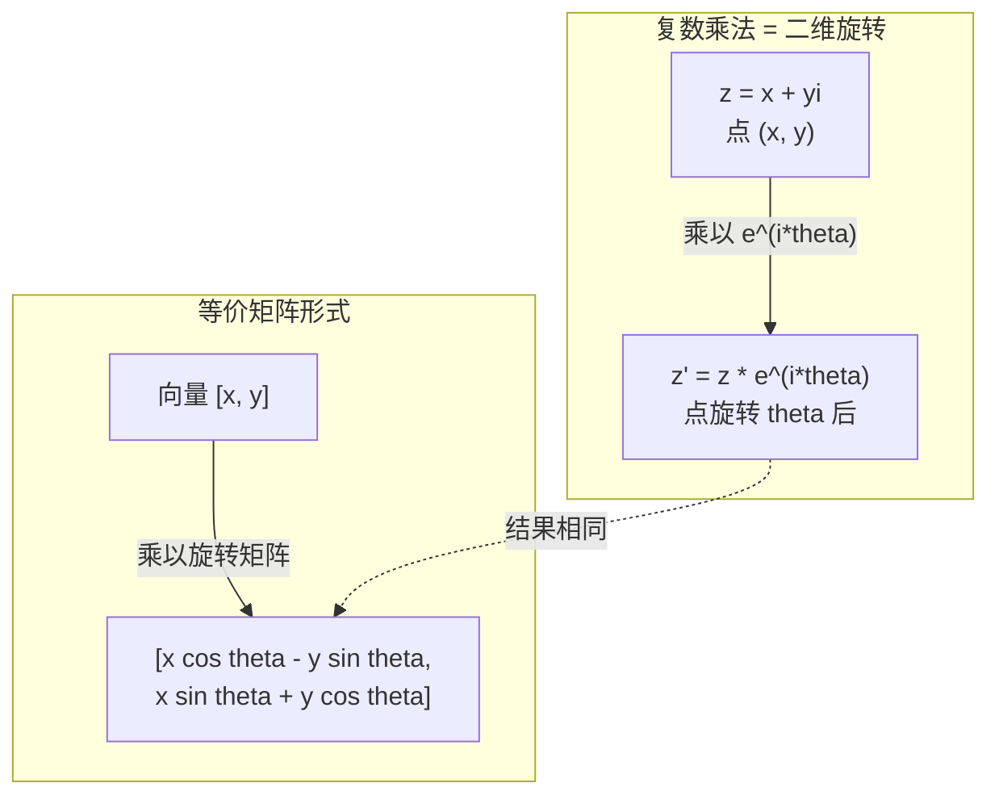
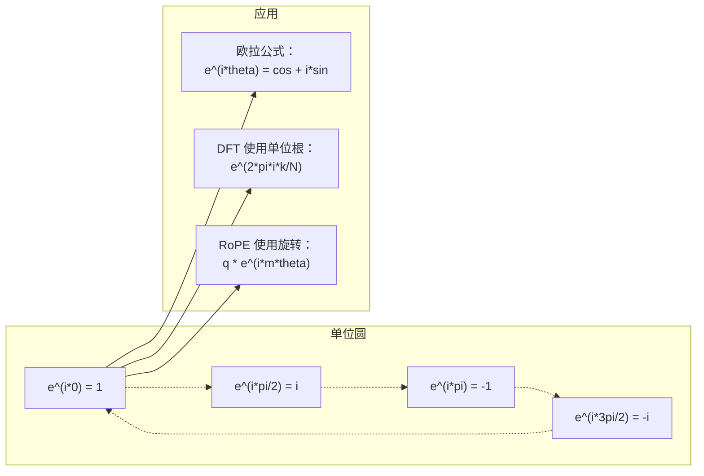

# AI 中的复数（Complex Numbers for AI）

> -1 的平方根并非虚构。它是旋转、频率以及半个信号处理领域的关键。

**Type:** Learn
**Language:** Python
**Prerequisites:** 第 1 阶段，第 01–04 课（线性代数、微积分）
**Time:** ~60 分钟

## 学习目标（Learning Objectives）

- 在直角坐标形式与极坐标形式下进行复数运算：加、乘、除和求共轭
- 应用欧拉公式，在复指数与三角函数之间转换
- 使用复单位根实现离散傅里叶变换
- 解释复数旋转如何支撑 Transformer 中的 RoPE 与正弦位置编码

## 问题背景（The Problem）

打开一篇傅里叶变换论文，你会发现到处都是 `i`。查看 Transformer 的位置编码，会看到不同频率的 `sin` 和 `cos`，它们正是复指数的实部与虚部。阅读量子计算资料时，又会发现所有内容都用复向量空间表达。

复数看起来很抽象。建立在 -1 平方根上的数系，似乎只是一种数学技巧。但它并不是技巧，而是旋转与振荡的自然语言。只要某个事物在旋转、振动或振荡，复数就是合适的工具。

不理解复数，就无法理解离散傅里叶变换（Discrete Fourier Transform，DFT），也无法理解快速傅里叶变换（Fast Fourier Transform，FFT）。你将无法理解现代语言模型中的旋转位置嵌入（Rotary Position Embedding，RoPE），也无法理解原始 Transformer 论文的正弦位置编码为何使用那些频率。

本课从零构建复数运算，将其与几何联系起来，并准确展示复数在机器学习中的应用位置。

## 核心概念（The Concept）

### 什么是复数（What is a complex number?）

复数（Complex Number）有两部分：实部（Real Part）和虚部（Imaginary Part）。

```
z = a + bi

其中：
  a 为实部
  b 为虚部
  i 为虚数单位，定义为 i^2 = -1
```

仅此而已。你把数轴扩展成一个平面：实数位于一条轴上，虚数位于另一条轴上，每个复数都是平面内的一个点。

### 复数运算（Complex arithmetic）

**加法。** 实部相加，虚部相加。

```
(a + bi) + (c + di) = (a + c) + (b + d)i

示例： (3 + 2i) + (1 + 4i) = 4 + 6i
```

**乘法。** 使用分配律，并记住 i^2 = -1。

```
(a + bi)(c + di) = ac + adi + bci + bdi^2
                 = ac + adi + bci - bd
                 = (ac - bd) + (ad + bc)i

示例： (3 + 2i)(1 + 4i) = 3 + 12i + 2i + 8i^2
                            = 3 + 14i - 8
                            = -5 + 14i
```

**共轭（Conjugate）。** 将虚部符号反转。

```
(a + bi) 的共轭 = a - bi
```

复数与其共轭的乘积始终为实数：

```
(a + bi)(a - bi) = a^2 + b^2
```

**除法。** 分子和分母同时乘以分母的共轭。

```
(a + bi) / (c + di) = (a + bi)(c - di) / (c^2 + d^2)
```

这样会消去分母的虚部，得到整洁的复数形式。

### 复平面（The complex plane）

复平面（Complex Plane）将每个复数映射为二维点。横轴是实轴，纵轴是虚轴。

```
z = 3 + 2i  对应点 (3, 2)
z = -1 + 0i 对应点 (-1, 0) 位于实轴上
z = 0 + 4i  对应点 (0, 4) 位于虚轴上
```

复数既是一个点，也是从原点出发的向量。这种双重解释使复数适合处理几何问题。

### 极坐标形式（Polar form）

平面内任意点都可以用到原点的距离，以及相对实轴正方向的角度来描述。

```
z = r * (cos(theta) + i*sin(theta))

其中：
  r = |z| = sqrt(a^2 + b^2)     （幅值，又称模）
  theta = atan2(b, a)             （相位，又称辐角）
```

直角坐标形式（Rectangular Form，a + bi）适合加法，极坐标形式（Polar Form，r, theta）适合乘法。

**极坐标形式下的乘法。** 幅值相乘，角度相加。

```
z1 = r1 * e^(i*theta1)
z2 = r2 * e^(i*theta2)

z1 * z2 = (r1 * r2) * e^(i*(theta1 + theta2))
```

这就是复数非常适合描述旋转的原因。乘以模为 1 的复数，就是纯旋转。

### 欧拉公式（Euler's formula）

欧拉公式（Euler's Formula）连接复指数与三角函数：

```
e^(i*theta) = cos(theta) + i*sin(theta)
```

这是本课最重要的公式。当 theta = pi 时：

```
e^(i*pi) = cos(pi) + i*sin(pi) = -1 + 0i = -1

因此： e^(i*pi) + 1 = 0
```

五个基本常数 e、i、pi、1、0 被一个等式联系起来。

### 欧拉公式为何对机器学习重要（Why Euler's formula matters for ML）

欧拉公式表明，随着 theta 变化，`e^(i*theta)` 沿单位圆运动。theta = 0 时位于 (1, 0)；theta = pi/2 时位于 (0, 1)；theta = pi 时位于 (-1, 0)；theta = 3*pi/2 时位于 (0, -1)。完整旋转一周对应 theta = 2*pi。

这意味着复指数就是旋转，而旋转在信号处理与机器学习中无处不在。

### 与二维旋转的联系（Connection to 2D rotations）

将复数 (x + yi) 乘以 e^(i*theta)，相当于将点 (x, y) 绕原点旋转 theta 角。

```
通过复数乘法旋转：
  (x + yi) * (cos(theta) + i*sin(theta))
  = (x*cos(theta) - y*sin(theta)) + (x*sin(theta) + y*cos(theta))i

通过矩阵乘法旋转：
  [cos(theta)  -sin(theta)] [x]   [x*cos(theta) - y*sin(theta)]
  [sin(theta)   cos(theta)] [y] = [x*sin(theta) + y*cos(theta)]
```

两者结果完全相同。复数乘法就是二维旋转，旋转矩阵只是用矩阵记法表达复数乘法。



### 相量与旋转信号（Phasors and rotating signals）

复指数 e^(i*omega*t) 表示以角频率 omega 绕单位圆旋转的点。随着 t 增大，该点沿圆运动。

这个旋转点的实部为 cos(omega*t)，虚部为 sin(omega*t)。正弦信号就是旋转复数的投影。

```
e^(i*omega*t) = cos(omega*t) + i*sin(omega*t)

实部：      cos(omega*t)    -- 余弦波
虚部： sin(omega*t)    -- 正弦波
```

这就是相量（Phasor）表示。你无需跟踪起伏的正弦波，而是跟踪平滑旋转的箭头。相移变为角度偏移，振幅变化变为模的变化，信号相加变为向量相加。

### 单位根（Roots of unity）

N 次单位根（Roots of Unity）是单位圆上等距分布的 N 个点：

```
w_k = e^(2*pi*i*k/N)    其中 k = 0, 1, 2, ..., N-1
```

N = 4 时，单位根为 1、i、-1、-i，对应四个正方向。
N = 8 时，在四个正方向之外，还增加四个对角方向。

单位根是离散傅里叶变换的基础。DFT 将信号分解为这 N 个等间隔频率上的分量。

### 与 DFT 的联系（Connection to the DFT）

信号 x[0], x[1], ..., x[N-1] 的离散傅里叶变换为：

```
X[k] = sum_{n=0}^{N-1} x[n] * e^(-2*pi*i*k*n/N)
```

每个 X[k] 衡量信号与第 k 个单位根，即频率 k 处复正弦波的相关程度。DFT 将信号拆成 N 个旋转相量，并给出每个相量的幅值和相位。

### 为什么 i 并不虚构（Why i is not imaginary）

“虚数”一词是历史偶然。Descartes 最初用它表达轻视。但 i 并不比人们最初拒绝接受的负数更虚构。负数回答“3 减去 5 得到什么”，虚数单位回答“什么数的平方为 -1”。

更有用的理解是：i 是一个 90 度旋转算子。实数乘一次 i，就旋转 90 度到虚轴；再乘一次 i，即 i^2，又旋转 90 度，此时指向实轴负方向。这就是 i^2 = -1 的原因。它并不神秘，只是两次四分之一周旋转构成半周旋转。

这解释了复数为何遍布工程领域。任何旋转的对象，如电磁波、量子态、信号振荡和位置编码，都能用复数自然描述。

### 复指数与三角函数（Complex exponentials vs trigonometric functions）

在欧拉公式出现之前，工程师把信号写作 A*cos(omega*t + phi)，其中 A 为振幅、omega 为频率、phi 为相位。这种表示有效，但运算麻烦。两个不同相位的余弦相加，需要使用三角恒等式。

用复指数表示，同一信号写作 A*e^(i*(omega*t + phi))。两个信号相加就是两个复数相加；相乘（调制）就是模相乘、角度相加；相移变为角度相加；频移变为乘以相量。

整个信号处理领域转向复指数记法，是因为数学表达更简洁。“真实信号”始终只是复数表示的实部，虚部作为辅助信息一同保留，使代数运算自然成立。

### 与 Transformer 的联系（Connection to transformers）

**正弦位置编码（Sinusoidal Positional Encodings）**，来自原始 Transformer 论文：

```
PE(pos, 2i) = sin(pos / 10000^(2i/d))
PE(pos, 2i+1) = cos(pos / 10000^(2i/d))
```

sin 与 cos 对是不同频率复指数的实部与虚部。每个频率为位置编码提供不同的“分辨率”。低频变化缓慢，表示粗粒度位置；高频变化迅速，表示细粒度位置。它们共同赋予每个位置独特的频率指纹。

**旋转位置嵌入（RoPE）** 更进一步：它显式地将查询向量（Query）和键向量（Key）乘以复数旋转矩阵。两个词元（Token）的相对位置变成旋转角。使用旋转后的向量计算注意力（Attention），使模型通过复数乘法感知相对位置。

| 运算 | 代数形式 | 几何意义 |
|-----------|---------------|-------------------|
| 加法 | (a+c) + (b+d)i | 平面内的向量相加 |
| 乘法 | (ac-bd) + (ad+bc)i | 旋转与缩放 |
| 共轭 | a - bi | 关于实轴反射 |
| 模 | sqrt(a^2 + b^2) | 到原点的距离 |
| 相位 | atan2(b, a) | 相对实轴正方向的角度 |
| 除法 | 乘以共轭 | 反向旋转并重新缩放 |
| 幂 | r^n * e^(i*n*theta) | 旋转 n 次，缩放 r^n 倍 |



```figure
roots-of-unity
```

## 动手实现（Build It）

### 第 1 步：Complex 类（Step 1: Complex class）

构建 Complex 复数类，支持算术运算、模、相位，以及直角坐标形式与极坐标形式之间的转换。

```python
import math

class Complex:
    def __init__(self, real, imag=0.0):
        self.real = real
        self.imag = imag

    def __add__(self, other):
        return Complex(self.real + other.real, self.imag + other.imag)

    def __mul__(self, other):
        r = self.real * other.real - self.imag * other.imag
        i = self.real * other.imag + self.imag * other.real
        return Complex(r, i)

    def __truediv__(self, other):
        denom = other.real ** 2 + other.imag ** 2
        r = (self.real * other.real + self.imag * other.imag) / denom
        i = (self.imag * other.real - self.real * other.imag) / denom
        return Complex(r, i)

    def magnitude(self):
        return math.sqrt(self.real ** 2 + self.imag ** 2)

    def phase(self):
        return math.atan2(self.imag, self.real)

    def conjugate(self):
        return Complex(self.real, -self.imag)
```

### 第 2 步：极坐标转换与欧拉公式（Step 2: Polar conversion and Euler's formula）

```python
def to_polar(z):
    return z.magnitude(), z.phase()

def from_polar(r, theta):
    return Complex(r * math.cos(theta), r * math.sin(theta))

def euler(theta):
    return Complex(math.cos(theta), math.sin(theta))
```

验证：`euler(theta).magnitude()` 应始终为 1.0；`euler(0)` 应得到 (1, 0)；`euler(pi)` 应得到 (-1, 0)。

### 第 3 步：旋转（Step 3: Rotation）

将点 (x, y) 旋转 theta 角，只需一次复数乘法：

```python
point = Complex(3, 4)
rotated = point * euler(math.pi / 4)
```

模保持不变，只有角度改变。

### 第 4 步：用复数运算实现 DFT（Step 4: DFT from complex arithmetic）

```python
def dft(signal):
    N = len(signal)
    result = []
    for k in range(N):
        total = Complex(0, 0)
        for n in range(N):
            angle = -2 * math.pi * k * n / N
            total = total + Complex(signal[n], 0) * euler(angle)
        result.append(total)
    return result
```

这是 O(N^2) 的 DFT。每个输出 X[k] 都是信号样本乘以单位根后的总和。

### 第 5 步：逆 DFT（Step 5: Inverse DFT）

逆 DFT 根据频谱重建原始信号。与正向 DFT 相比，只需改变指数的符号，并除以 N。

```python
def idft(spectrum):
    N = len(spectrum)
    result = []
    for n in range(N):
        total = Complex(0, 0)
        for k in range(N):
            angle = 2 * math.pi * k * n / N
            total = total + spectrum[k] * euler(angle)
        result.append(Complex(total.real / N, total.imag / N))
    return result
```

这实现了完美重建。先应用 DFT，再应用逆离散傅里叶变换（Inverse Discrete Fourier Transform，IDFT），就能在机器精度范围内恢复原始信号，不丢失任何信息。

### 第 6 步：单位根（Step 6: Roots of unity）

```python
def roots_of_unity(N):
    return [euler(2 * math.pi * k / N) for k in range(N)]
```

验证两个性质：
- 每个根的模恰好为 1。
- 所有 N 个根的和为零，因为它们因对称性而相互抵消。

正是这些性质使 DFT 可逆。单位根构成频域的正交基。

## 实际应用（Use It）

Python 内置复数支持，字面量 `j` 表示虚数单位。

```python
z = 3 + 2j
w = 1 + 4j

print(z + w)
print(z * w)
print(abs(z))

import cmath
print(cmath.phase(z))
print(cmath.exp(1j * cmath.pi))
```

对于数组，numpy 原生支持复数：

```python
import numpy as np

z = np.array([1+2j, 3+4j, 5+6j])
print(np.abs(z))
print(np.angle(z))
print(np.conj(z))
print(np.real(z))
print(np.imag(z))

signal = np.sin(2 * np.pi * 5 * np.linspace(0, 1, 128))
spectrum = np.fft.fft(signal)
freqs = np.fft.fftfreq(128, d=1/128)
```

## 交付成果（Ship It）

运行 `code/complex_numbers.py`，生成 `outputs/skill-complex-arithmetic.md`。

## 练习（Exercises）

1. **手算复数。** 计算 (2 + 3i) * (4 - i)，并用代码验证。然后计算 (5 + 2i) / (1 - 3i)。在复平面上画出两个结果，检查乘法是否对第一个数进行了旋转和缩放。

2. **旋转序列。** 从点 (1, 0) 开始，连续乘以 e^(i*pi/6) 十二次。验证经过 12 次乘法后回到 (1, 0)。打印每一步的坐标，确认它们构成正十二边形。

3. **已知信号的 DFT。** 创建 sin(2*pi*3*t) 与 0.5*sin(2*pi*7*t) 之和的信号，在 32 个点采样。运行你的 DFT，验证幅度谱在频率 3 和 7 处有峰，且频率 7 处的峰高为频率 3 处的一半。

4. **单位根可视化。** 计算 8 次单位根，验证它们的和为零。验证任意一个根乘以本原单位根 e^(2*pi*i/8) 都得到下一个根。

5. **与旋转矩阵等价。** 对 10 个随机角度和 10 个随机点，验证复数乘法与 2x2 旋转矩阵的矩阵向量乘法结果相同。打印最大数值差异。

## 关键术语（Key Terms）

| 术语 | 含义 |
|------|---------------|
| 复数（Complex Number） | 形如 a + bi 的数，a 为实部，b 为虚部，i^2 = -1 |
| 虚数单位（Imaginary Unit） | 由 i^2 = -1 定义的数 i。并非哲学意义上的虚构，它是旋转算子 |
| 复平面（Complex Plane） | x 轴为实轴、y 轴为虚轴的二维平面，也称 Argand 平面 |
| 幅值/模（Magnitude/Modulus） | 到原点的距离：sqrt(a^2 + b^2)，记为 \|z\| |
| 相位/辐角（Phase/Argument） | 相对实轴正方向的角度：atan2(b, a)，记为 arg(z) |
| 共轭（Conjugate） | 关于实轴的镜像：a + bi 的共轭为 a - bi |
| 极坐标形式（Polar Form） | 将 z 表示为 r * e^(i*theta)，而非 a + bi，使乘法更容易 |
| 欧拉公式（Euler's Formula） | e^(i*theta) = cos(theta) + i*sin(theta)，连接指数函数与三角函数 |
| 相量（Phasor） | 表示正弦信号的旋转复数 e^(i*omega*t) |
| 单位根（Roots of Unity） | k 从 0 到 N-1 时的 N 个复数 e^(2*pi*i*k/N)，即单位圆上等距分布的 N 个点 |
| 离散傅里叶变换（DFT） | 使用单位根，将信号分解为复正弦分量 |
| 旋转位置嵌入（RoPE） | 使用复数乘法在 Transformer 注意力中编码相对位置 |

## 延伸阅读（Further Reading）

- [欧拉公式的直观介绍（Visual Introduction to Euler's Formula）](https://betterexplained.com/articles/intuitive-understanding-of-eulers-formula/)：无需繁重符号即可建立几何直觉
- [Su 等：RoFormer（2021）](https://arxiv.org/abs/2104.09864)：提出使用复数旋转的位置嵌入的论文
- [Vaswani 等：注意力就是你所需要的一切（Attention Is All You Need，2017）](https://arxiv.org/abs/1706.03762)：包含正弦位置编码的原始 Transformer 论文
- [3Blue1Brown：用入门群论理解欧拉公式（Euler's formula with introductory group theory）](https://www.youtube.com/watch?v=mvmuCPvRoWQ)：直观解释 e^(i*pi) = -1 的原因
- [Needham：复分析的可视化方法（Visual Complex Analysis）](https://global.oup.com/academic/product/visual-complex-analysis-9780198534464)：复数最出色的可视化讲解，包含丰富几何洞见
- [Strang：线性代数导论第 10 章（Introduction to Linear Algebra, Ch. 10）](https://math.mit.edu/~gs/linearalgebra/)：在线性代数和特征值背景下介绍复数
